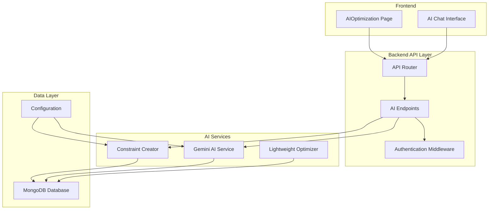
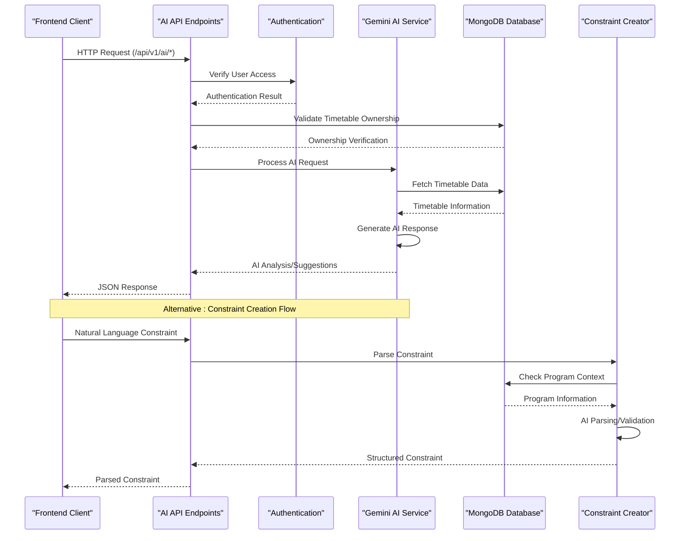
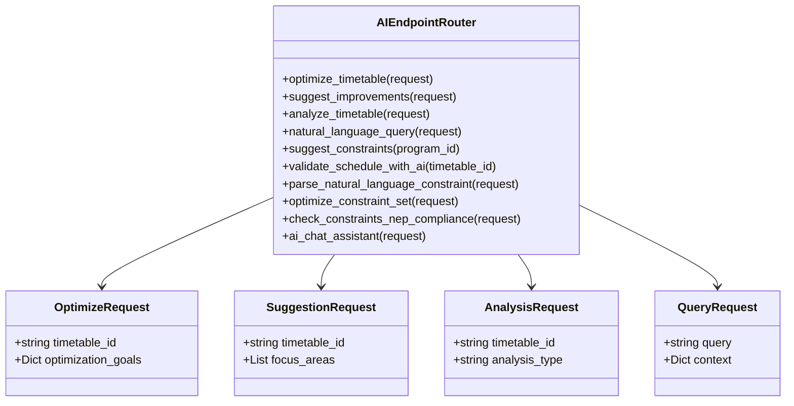
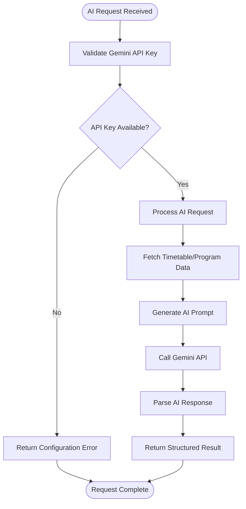
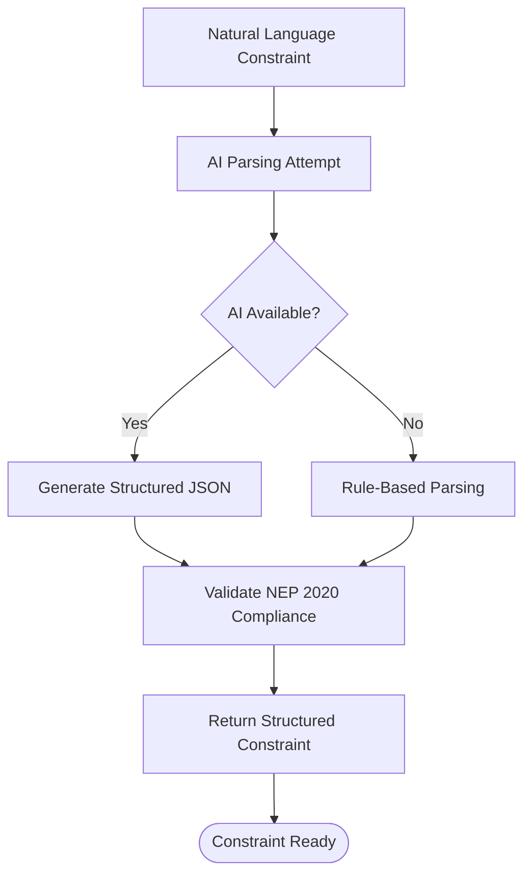
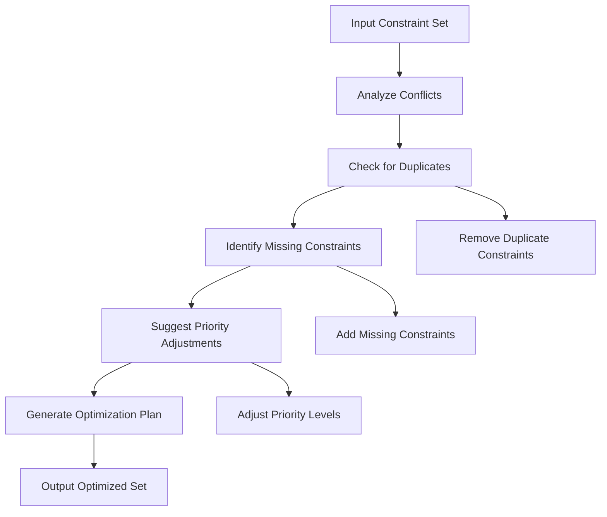
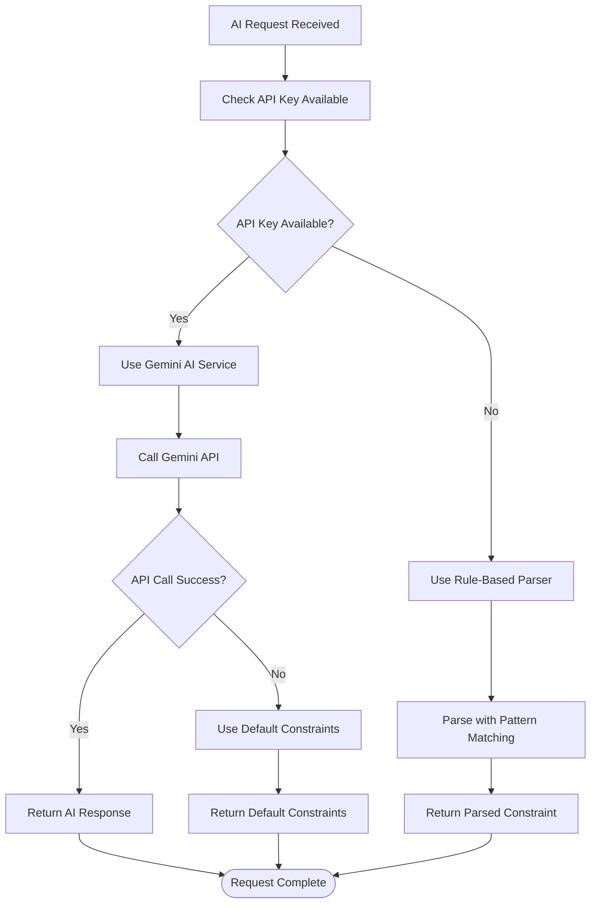

# AI Assistance Endpoints

<cite>
**Referenced Files in This Document**
- [ai.py](file://backend/app/api/v1/endpoints/ai.py)
- [gemini.py](file://backend/app/services/ai/gemini.py)
- [constraint_creator.py](file://backend/app/services/ai/constraint_creator.py)
- [optimizer.py](file://backend/app/services/ai/optimizer.py)
- [config.py](file://backend/app/core/config.py)
- [mongodb.py](file://backend/app/db/mongodb.py)
- [api.py](file://backend/app/api/api_v1/api.py)
- [AIOptimization.tsx](file://frontend/src/components/pages/AIOptimization.tsx)
</cite>

## Table of Contents
1. [Introduction](#introduction)
2. [Project Structure](#project-structure)
3. [Core Components](#core-components)
4. [Architecture Overview](#architecture-overview)
5. [Detailed Component Analysis](#detailed-component-analysis)
6. [API Reference](#api-reference)
7. [Constraint Creation Services](#constraint-creation-services)
8. [AI Model Configuration](#ai-model-configuration)
9. [Response Quality Assessment](#response-quality-assessment)
10. [Fallback Mechanisms](#fallback-mechanisms)
11. [Performance Considerations](#performance-considerations)
12. [Troubleshooting Guide](#troubleshooting-guide)
13. [Conclusion](#conclusion)

## Introduction
This document provides comprehensive API documentation for AI assistance endpoints that integrate Google Gemini API for academic timetable management. The system offers constraint creation, optimization suggestions, and NEP 2020 compliance analysis services. It enables natural language processing for constraint parsing, AI-powered timetable optimization, and intelligent suggestion generation for schedule improvements.

## Project Structure
The AI assistance system is organized across backend API endpoints, AI service modules, and frontend components:



**Diagram sources**
- [api.py:1-34](file://backend/app/api/api_v1/api.py#L1-L34)
- [ai.py:1-362](file://backend/app/api/v1/endpoints/ai.py#L1-L362)

**Section sources**
- [api.py:1-34](file://backend/app/api/api_v1/api.py#L1-L34)
- [ai.py:1-362](file://backend/app/api/v1/endpoints/ai.py#L1-L362)

## Core Components
The AI assistance system consists of three primary components:

### Gemini AI Service
Provides natural language processing, timetable analysis, and optimization capabilities through Google Gemini API integration.

### AI Constraint Creator
Handles natural language constraint parsing, NEP 2020 compliance checking, and constraint optimization suggestions.

### Lightweight Optimizer
Implements basic optimization scoring for timetable efficiency metrics.

**Section sources**
- [gemini.py:9-288](file://backend/app/services/ai/gemini.py#L9-L288)
- [constraint_creator.py:18-781](file://backend/app/services/ai/constraint_creator.py#L18-L781)
- [optimizer.py:6-59](file://backend/app/services/ai/optimizer.py#L6-L59)

## Architecture Overview
The AI assistance architecture follows a layered approach with clear separation of concerns:



**Diagram sources**
- [ai.py:46-266](file://backend/app/api/v1/endpoints/ai.py#L46-L266)
- [gemini.py:18-288](file://backend/app/services/ai/gemini.py#L18-L288)
- [constraint_creator.py:179-282](file://backend/app/services/ai/constraint_creator.py#L179-L282)

## Detailed Component Analysis

### AI Endpoint Implementation
The AI endpoints provide comprehensive timetable management services with strict security controls:



**Diagram sources**
- [ai.py:14-45](file://backend/app/api/v1/endpoints/ai.py#L14-L45)

**Section sources**
- [ai.py:46-266](file://backend/app/api/v1/endpoints/ai.py#L46-L266)

### Gemini AI Service Capabilities
The Gemini AI Service handles multiple AI-powered operations:



**Diagram sources**
- [gemini.py:18-288](file://backend/app/services/ai/gemini.py#L18-L288)

**Section sources**
- [gemini.py:9-288](file://backend/app/services/ai/gemini.py#L9-L288)

### Constraint Creation System
The constraint creation system provides AI-powered constraint parsing and NEP 2020 compliance validation:



**Diagram sources**
- [constraint_creator.py:179-282](file://backend/app/services/ai/constraint_creator.py#L179-L282)

**Section sources**
- [constraint_creator.py:18-781](file://backend/app/services/ai/constraint_creator.py#L18-L781)

## API Reference

### Base URL and Authentication
- **Base URL**: `/api/v1/ai`
- **Authentication**: Requires active user session
- **Authorization**: All operations require ownership verification of target resources

### HTTP Methods and Endpoints

#### Timetable Optimization
- **POST** `/ai/optimize`
- **Purpose**: Optimize existing timetable using AI
- **Request Schema**:
  ```json
  {
    "timetable_id": "string",
    "optimization_goals": {
      "efficiency": true,
      "conflicts": true,
      "workload": true,
      "nep_compliance": true
    }
  }
  ```
- **Response Schema**:
  ```json
  {
    "timetable_id": "string",
    "optimization_result": "string",
    "optimized": true,
    "timestamp": "2025-08-30T00:00:00Z"
  }
  ```

#### Improvement Suggestions
- **POST** `/ai/suggest`
- **Purpose**: Get AI suggestions for timetable improvements
- **Request Schema**:
  ```json
  {
    "timetable_id": "string",
    "focus_areas": ["string"]
  }
  ```
- **Response Schema**:
  ```json
  {
    "timetable_id": "string",
    "suggestions": [
      {
        "title": "string",
        "description": "string",
        "impact_level": "high|medium|low",
        "implementation_difficulty": "easy|medium|hard",
        "expected_benefit": "string"
      }
    ],
    "generated_at": "2025-08-30T00:00:00Z"
  }
  ```

#### Timetable Analysis
- **POST** `/ai/analysis`
- **Purpose**: Analyze timetable efficiency and compliance
- **Request Schema**:
  ```json
  {
    "timetable_id": "string",
    "analysis_type": "comprehensive|efficiency|compliance|resource"
  }
  ```
- **Response Schema**:
  ```json
  {
    "timetable_id": "string",
    "analysis_type": "string",
    "efficiency_score": 0,
    "analysis_details": "string",
    "analyzed_at": "2025-08-30T00:00:00Z"
  }
  ```

#### Natural Language Query Processing
- **POST** `/ai/query`
- **Purpose**: Process natural language queries about timetables
- **Request Schema**:
  ```json
  {
    "query": "string",
    "context": {
      "timetable_id": "string",
      "active_tab": 0,
      "optimization_goals": {}
    }
  }
  ```
- **Response Schema**:
  ```json
  {
    "query": "string",
    "response": "string",
    "processed_at": "2025-08-30T00:00:00Z"
  }
  ```

#### NEP 2020 Compliance Validation
- **POST** `/ai/validate-schedule`
- **Purpose**: Validate timetable against NEP 2020 guidelines
- **Request Schema**: `{"timetable_id": "string"}`
- **Response Schema**:
  ```json
  {
    "timetable_id": "string",
    "nep_compliance_score": 0,
    "compliance_details": "string",
    "validation_date": "2025-08-30T00:00:00Z",
    "recommendations": ["string"]
  }
  ```

#### Program Constraint Suggestions
- **GET** `/ai/constraints/suggest/{program_id}`
- **Purpose**: Get AI-suggested constraints for a specific program
- **Response Schema**:
  ```json
  {
    "program_id": "string",
    "suggested_constraints": [
      {
        "constraint_type": "string",
        "description": "string",
        "parameters": {},
        "priority": 1,
        "rationale": "string"
      }
    ],
    "generated_at": "2025-08-30T00:00:00Z"
  }
  ```

#### Natural Language Constraint Parsing
- **POST** `/ai/constraints/parse-natural-language`
- **Purpose**: Parse natural language constraint into structured format
- **Request Schema**:
  ```json
  {
    "text": "string",
    "program_id": "string"
  }
  ```
- **Response Schema**:
  ```json
  {
    "success": true,
    "parsed_constraint": {},
    "original_text": "string"
  }
  ```

#### Constraint Set Optimization
- **POST** `/ai/constraints/optimize-set`
- **Purpose**: Optimize constraint set for better timetable generation
- **Request Schema**:
  ```json
  {
    "constraints": [{}],
    "optimization_goals": {}
  }
  ```
- **Response Schema**:
  ```json
  {
    "success": true,
    "optimization_result": {
      "optimized_constraints": [{}],
      "removed_constraints": ["string"],
      "added_constraints": [{}],
      "priority_adjustments": ["string"],
      "optimization_summary": "string",
      "expected_improvements": {
        "conflict_reduction": "string",
        "nep_compliance_increase": "string",
        "schedule_quality_improvement": "string"
      }
    }
  }
  ```

#### NEP Compliance Check for Constraints
- **POST** `/ai/constraints/check-nep-compliance`
- **Purpose**: Validate constraints against NEP 2020 guidelines
- **Request Schema**:
  ```json
  {
    "constraints": [{}]
  }
  ```
- **Response Schema**:
  ```json
  {
    "success": true,
    "compliance_report": {
      "overall_score": 0,
      "compliance_level": "string",
      "area_scores": {},
      "strengths": ["string"],
      "gaps": ["string"],
      "recommendations": ["string"],
      "missing_constraints": ["string"]
    }
  }
  ```

#### AI Chat Assistant
- **POST** `/ai/chat`
- **Purpose**: AI-powered chat assistance for timetable management
- **Request Schema**:
  ```json
  {
    "message": "string",
    "conversation_history": [
      {"role": "string", "content": "string"}
    ],
    "context": {}
  }
  ```
- **Response Schema**:
  ```json
  {
    "response": "string",
    "suggestions": ["string"]
  }
  ```

**Section sources**
- [ai.py:46-362](file://backend/app/api/v1/endpoints/ai.py#L46-L362)

## Constraint Creation Services

### Natural Language Processing
The constraint creation system processes natural language descriptions into structured constraint objects:

#### Constraint Types Supported
- **Faculty Availability**: Time-based availability constraints
- **Faculty Workload**: Teaching hour limitations
- **Room Capacity**: Minimum/maximum capacity requirements
- **Room Type Requirements**: Specialized room type needs
- **Time Preferences**: Preferred or avoided time slots
- **Consecutive Classes**: Back-to-back class requirements
- **Gap Minimization**: Maximum gap restrictions
- **Block Scheduling**: Extended session scheduling
- **NEP Compliance**: NEP 2020 guideline alignment

#### NEP 2020 Compliance Areas
The system validates constraints against six key NEP 2020 areas:
1. **Credit System**: CBCS compliance and flexibility
2. **Multidisciplinary**: Interdisciplinary education
3. **Assessment**: Continuous evaluation methods
4. **Skill Development**: Practical learning emphasis
5. **Research**: Innovation and critical thinking
6. **Faculty Workload**: Reasonable teaching loads

**Section sources**
- [constraint_creator.py:28-89](file://backend/app/services/ai/constraint_creator.py#L28-L89)
- [constraint_creator.py:93-169](file://backend/app/services/ai/constraint_creator.py#L93-L169)

### AI-Powered Constraint Optimization
The optimization service identifies conflicts, suggests priority adjustments, and recommends missing constraints:



**Diagram sources**
- [constraint_creator.py:659-721](file://backend/app/services/ai/constraint_creator.py#L659-L721)

**Section sources**
- [constraint_creator.py:659-777](file://backend/app/services/ai/constraint_creator.py#L659-L777)

## AI Model Configuration

### Gemini API Integration
The system integrates with Google Gemini API for advanced AI capabilities:

#### Configuration Parameters
- **Model**: `gemini-1.5-flash`
- **API Key**: Configured via environment variable
- **Fallback Mechanism**: Rule-based parsing when API unavailable

#### Environment Configuration
```python
# Required environment variables
GEMINI_API_KEY: Optional[str] = None

# Database configuration
MONGODB_URL: str = "mongodb://localhost:27017"
DATABASE_NAME: str = "timetable_system1"
```

#### Model Capabilities
- **Timetable Optimization**: Advanced scheduling analysis
- **Constraint Parsing**: Natural language to structured format conversion
- **Compliance Validation**: NEP 2020 guideline adherence checking
- **Suggestion Generation**: Context-aware improvement recommendations

**Section sources**
- [config.py:34-44](file://backend/app/core/config.py#L34-L44)
- [gemini.py:10-16](file://backend/app/services/ai/gemini.py#L10-L16)
- [constraint_creator.py:171-178](file://backend/app/services/ai/constraint_creator.py#L171-L178)

## Response Quality Assessment

### AI Response Evaluation Metrics
The system employs multiple quality assessment mechanisms:

#### Structured Response Validation
- **JSON Parsing**: Ensures AI responses are properly formatted
- **Schema Validation**: Verifies response structure matches expected format
- **Content Completeness**: Checks for required response fields

#### Compliance Scoring
- **NEP 2020 Compliance**: Overall score calculation (0-100)
- **Area-Specific Scores**: Individual area compliance assessment
- **Recommendation Quality**: Actionable improvement suggestions

#### Performance Metrics
- **Response Time**: AI processing latency measurement
- **Accuracy**: Constraint parsing precision
- **Completeness**: Coverage of all requested information

**Section sources**
- [gemini.py:50-57](file://backend/app/services/ai/gemini.py#L50-L57)
- [constraint_creator.py:536-598](file://backend/app/services/ai/constraint_creator.py#L536-L598)

## Fallback Mechanisms

### Multi-Level Fallback System
The system implements comprehensive fallback mechanisms for reliability:



**Diagram sources**
- [constraint_creator.py:190-282](file://backend/app/services/ai/constraint_creator.py#L190-L282)
- [gemini.py:20-60](file://backend/app/services/ai/gemini.py#L20-L60)

### Fallback Strategies

#### Constraint Parsing Fallback
- **Primary**: AI-powered natural language parsing
- **Secondary**: Pattern-based rule extraction
- **Default**: Generic constraint creation with manual parameters

#### Optimization Fallback
- **Primary**: AI optimization suggestions
- **Secondary**: Rule-based optimization heuristics
- **Default**: Basic constraint filtering and prioritization

#### Compliance Validation Fallback
- **Primary**: AI compliance assessment
- **Secondary**: Rule-based compliance checking
- **Default**: Basic NEP area coverage assessment

**Section sources**
- [constraint_creator.py:283-310](file://backend/app/services/ai/constraint_creator.py#L283-L310)
- [constraint_creator.py:671-721](file://backend/app/services/ai/constraint_creator.py#L671-L721)

## Performance Considerations

### AI Processing Optimization
- **Response Caching**: Store frequently accessed AI responses
- **Batch Processing**: Combine multiple requests when possible
- **Asynchronous Operations**: Non-blocking AI API calls
- **Connection Pooling**: Efficient database connections

### Database Optimization
- **Indexing**: Proper MongoDB indexing for timetable queries
- **Connection Management**: Connection pooling for database operations
- **Query Optimization**: Efficient data retrieval patterns

### Frontend Performance
- **State Management**: Efficient React component state updates
- **Loading States**: Progress indicators for long-running operations
- **Error Boundaries**: Graceful error handling and user feedback

## Troubleshooting Guide

### Common Issues and Solutions

#### AI Service Unavailable
**Symptoms**: API returns configuration error messages
**Causes**: Missing or invalid Gemini API key
**Solutions**:
1. Verify `GEMINI_API_KEY` environment variable
2. Check API quota and billing status
3. Validate network connectivity to Gemini API

#### Timetable Access Denied
**Symptoms**: 404 errors when accessing timetable operations
**Causes**: User doesn't own the target timetable
**Solutions**:
1. Verify user authentication
2. Check timetable ownership validation
3. Ensure proper authorization headers

#### Constraint Parsing Failures
**Symptoms**: Natural language constraint parsing errors
**Causes**: Ambiguous constraint descriptions
**Solutions**:
1. Provide clearer constraint specifications
2. Use structured parameter formats
3. Consult AI chat assistant for guidance

#### Database Connection Issues
**Symptoms**: MongoDB connection errors
**Causes**: Database server unavailability
**Solutions**:
1. Verify MongoDB server status
2. Check connection string configuration
3. Review firewall and network settings

**Section sources**
- [ai.py:56-63](file://backend/app/api/v1/endpoints/ai.py#L56-L63)
- [gemini.py:20-21](file://backend/app/services/ai/gemini.py#L20-L21)
- [constraint_creator.py:190-192](file://backend/app/services/ai/constraint_creator.py#L190-L192)

## Conclusion
The AI assistance endpoints provide a comprehensive solution for academic timetable management through Google Gemini API integration. The system offers robust constraint creation, optimization suggestions, and NEP 2020 compliance analysis with built-in fallback mechanisms for reliability. The modular architecture ensures scalability and maintainability while the extensive API coverage supports diverse timetable management workflows.

Key benefits include:
- **Natural Language Processing**: Intuitive constraint creation through conversational interfaces
- **AI-Powered Optimization**: Intelligent timetable improvements and suggestions
- **Compliance Assurance**: Automated NEP 2020 guideline validation
- **Reliability**: Comprehensive fallback mechanisms for system resilience
- **Security**: Strict access controls and user authorization

The system serves as a foundation for intelligent academic scheduling with extensible capabilities for future enhancements and integrations.