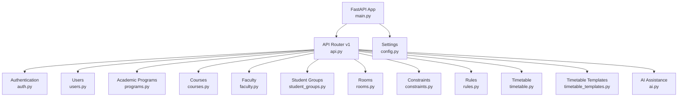
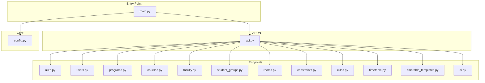
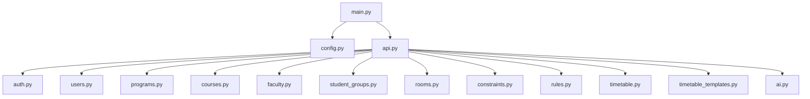
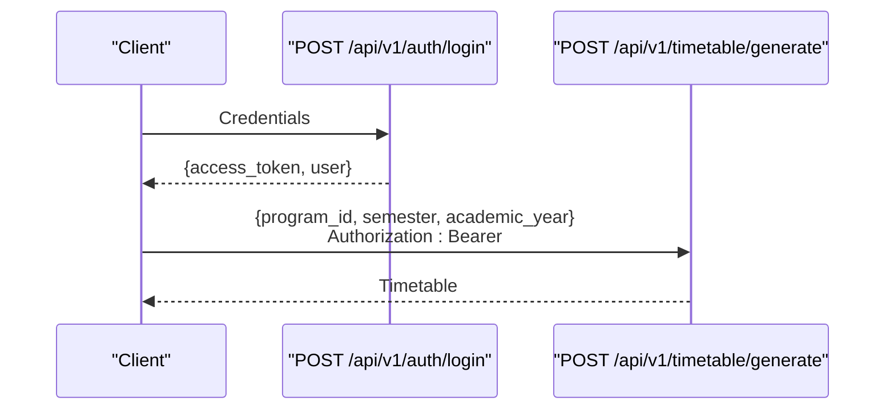

# API Reference

<cite>
**Referenced Files in This Document**
- [main.py](file://backend/app/main.py)
- [api.py](file://backend/app/api/api_v1/api.py)
- [auth.py](file://backend/app/api/v1/endpoints/auth.py)
- [users.py](file://backend/app/api/v1/endpoints/users.py)
- [programs.py](file://backend/app/api/v1/endpoints/programs.py)
- [courses.py](file://backend/app/api/v1/endpoints/courses.py)
- [faculty.py](file://backend/app/api/v1/endpoints/faculty.py)
- [student_groups.py](file://backend/app/api/v1/endpoints/student_groups.py)
- [rooms.py](file://backend/app/api/v1/endpoints/rooms.py)
- [constraints.py](file://backend/app/api/v1/endpoints/constraints.py)
- [rules.py](file://backend/app/api/v1/endpoints/rules.py)
- [timetable.py](file://backend/app/api/v1/endpoints/timetable.py)
- [timetable_templates.py](file://backend/app/api/v1/endpoints/timetable_templates.py)
- [ai.py](file://backend/app/api/v1/endpoints/ai.py)
- [config.py](file://backend/app/core/config.py)
</cite>

## Table of Contents
1. [Introduction](#introduction)
2. [Project Structure](#project-structure)
3. [Core Components](#core-components)
4. [Architecture Overview](#architecture-overview)
5. [Detailed Component Analysis](#detailed-component-analysis)
6. [Dependency Analysis](#dependency-analysis)
7. [Performance Considerations](#performance-considerations)
8. [Troubleshooting Guide](#troubleshooting-guide)
9. [Conclusion](#conclusion)
10. [Appendices](#appendices)

## Introduction
This document provides comprehensive API documentation for the ShedMaster REST endpoints. It covers authentication, user management, academic structures (programs, courses, faculty, rooms, student groups), scheduling constraints and rules, timetable creation and management, AI-assisted optimization and analysis, and template-based generation. It also documents request/response schemas, authentication requirements, validation rules, error handling, rate limiting, pagination, and client integration patterns.

## Project Structure
The backend is a FastAPI application with a modular endpoint organization under a versioned API router. The main application initializes middleware, database connections, and registers all endpoint routers.

**Diagram sources**
- [main.py:33-102](file://backend/app/main.py#L33-L102)
- [api.py:1-34](file://backend/app/api/api_v1/api.py#L1-L34)

**Section sources**
- [main.py:1-102](file://backend/app/main.py#L1-L102)
- [api.py:1-34](file://backend/app/api/api_v1/api.py#L1-L34)

## Core Components
- Authentication and Authorization
  - OAuth2-compatible token login, registration, token testing, and refresh.
  - Access token validation via dependency injection.
- Data Management
  - CRUD endpoints for users, programs, courses, faculty, rooms, student groups, constraints, and rules.
- Timetable Management
  - Create, read, update, delete timetables with pagination and filtering.
  - Export to JSON, Excel, and PDF formats.
  - Validation and optimization endpoints.
- AI Assistance
  - Natural language queries, suggestions, analysis, NEP 2020 compliance checks, and chatbot assistance powered by Google Gemini.
- Templates
  - Template-based timetable generation with optional overrides for courses, student groups, rooms, and faculty.

**Section sources**
- [auth.py:29-123](file://backend/app/api/v1/endpoints/auth.py#L29-L123)
- [users.py:11-123](file://backend/app/api/v1/endpoints/users.py#L11-L123)
- [programs.py:12-288](file://backend/app/api/v1/endpoints/programs.py#L12-L288)
- [courses.py:12-279](file://backend/app/api/v1/endpoints/courses.py#L12-L279)
- [faculty.py:13-265](file://backend/app/api/v1/endpoints/faculty.py#L13-L265)
- [rooms.py:12-258](file://backend/app/api/v1/endpoints/rooms.py#L12-L258)
- [student_groups.py:13-380](file://backend/app/api/v1/endpoints/student_groups.py#L13-L380)
- [constraints.py:11-189](file://backend/app/api/v1/endpoints/constraints.py#L11-L189)
- [rules.py:13-68](file://backend/app/api/v1/endpoints/rules.py#L13-L68)
- [timetable.py:17-728](file://backend/app/api/v1/endpoints/timetable.py#L17-L728)
- [timetable_templates.py:10-106](file://backend/app/api/v1/endpoints/timetable_templates.py#L10-L106)
- [ai.py:46-362](file://backend/app/api/v1/endpoints/ai.py#L46-L362)

## Architecture Overview
The API follows a layered architecture:
- Entry point initializes FastAPI, CORS, MongoDB connection, and registers the v1 router.
- The v1 router aggregates all endpoint modules grouped by domain.
- Each endpoint module handles HTTP methods, validation, authorization, and persistence.

**Diagram sources**
- [main.py:33-102](file://backend/app/main.py#L33-L102)
- [api.py:1-34](file://backend/app/api/api_v1/api.py#L1-L34)
- [config.py:1-61](file://backend/app/core/config.py#L1-L61)

## Detailed Component Analysis

### Authentication Endpoints
- Base path: /api/v1/auth
- Tags: Authentication

Endpoints:
- POST /login
  - OAuth2 password flow.
  - Request: form-encoded OAuth2PasswordRequestForm (username, password).
  - Response: access_token, token_type, user (id, email, full_name, role, is_admin).
  - Errors: 401 Incorrect username or password, 400 Inactive user.
- POST /test-register
  - Validates registration payload without creating an account.
  - Request: UserCreate fields.
  - Response: message, received_data, required_fields, optional_fields.
- POST /register
  - Creates a new user account.
  - Request: UserCreate fields.
  - Response: User model.
  - Errors: 400 Duplicate email/value error, 500 Registration failure.
- POST /test-token
  - Validates access token and returns current user.
  - Response: User model.
- POST /refresh-token
  - Issues a new access token for the current user.
  - Response: access_token, token_type.

Security and validation:
- Token expiration is configured in settings.
- CORS preflight handling for register endpoint.

**Section sources**
- [auth.py:29-123](file://backend/app/api/v1/endpoints/auth.py#L29-L123)
- [config.py:30-36](file://backend/app/core/config.py#L30-L36)

### User Management Endpoints
- Base path: /api/v1/users
- Tags: Users

Endpoints:
- GET /
  - Query params: skip (ge 0), limit (1-1000).
  - Response: array of User.
  - Requires admin.
- GET /me
  - Response: User (current).
- GET /{user_id}
  - Response: User.
  - Permissions: admin OR self.
- POST /
  - Request: UserCreate.
  - Response: User.
  - Requires admin; prevents duplicate emails.
- PUT /{user_id}
  - Request: UserUpdate.
  - Response: User.
  - Permissions: admin OR self.
- DELETE /{user_id}
  - Response: deletion message.
  - Requires admin.

Pagination and validation:
- skip and limit enforced; limit capped at 1000.

**Section sources**
- [users.py:11-123](file://backend/app/api/v1/endpoints/users.py#L11-L123)

### Academic Management Endpoints

#### Programs
- Base path: /api/v1/programs
- Tags: Programs

Endpoints:
- GET /
  - Query params: skip (ge 0), limit (1-1000), program_type, department.
  - Response: array of Program.
- GET /{program_id}
  - Response: Program.
- POST /
  - Request: ProgramCreate.
  - Response: Program.
  - Requires admin; enforces unique program code.
- PUT /{program_id}
  - Request: ProgramUpdate.
  - Response: Program.
  - Requires admin.
- DELETE /{program_id}
  - Response: deletion message.
  - Requires admin; prevents deletion if associated timetables exist.
- GET /{program_id}/courses
  - Query: semester.
  - Response: array of Course.
- GET /{program_id}/statistics
  - Response: counts and semester breakdown.

**Section sources**
- [programs.py:12-288](file://backend/app/api/v1/endpoints/programs.py#L12-L288)

#### Courses
- Base path: /api/v1/courses
- Tags: Courses

Endpoints:
- GET /
  - Query: program_id, semester.
  - Response: array of Course.
- POST /
  - Request: CourseCreate.
  - Response: Course.
  - Prevents duplicate course codes.
- PUT /{course_id}
  - Request: CourseUpdate.
  - Response: Course.
  - Validates ObjectId; prevents duplicate codes.
- DELETE /{course_id}
  - Response: deletion message.

**Section sources**
- [courses.py:12-279](file://backend/app/api/v1/endpoints/courses.py#L12-L279)

#### Faculty
- Base path: /api/v1/faculty
- Tags: Faculty

Endpoints:
- GET /
  - Response: array of Faculty.
- POST /
  - Request: FacultyCreate.
  - Response: Faculty.
  - Prevents duplicate employee_id per user.
- GET /{faculty_id}
  - Response: Faculty.
- PUT /{faculty_id}
  - Request: FacultyUpdate.
  - Response: Faculty.
  - Validates ObjectId; prevents duplicate employee_id.
- DELETE /{faculty_id}
  - Response: deletion message.

**Section sources**
- [faculty.py:13-265](file://backend/app/api/v1/endpoints/faculty.py#L13-L265)

#### Rooms
- Base path: /api/v1/rooms
- Tags: Rooms

Endpoints:
- GET /
  - Query: building, room_type, min_capacity.
  - Response: array of Room.
- POST /
  - Request: RoomCreate.
  - Response: Room.
  - Prevents duplicate room name+building.
- PUT /{room_id}
  - Request: RoomUpdate.
  - Response: Room.
  - Validates ObjectId; prevents duplicate room name+building.
- DELETE /{room_id}
  - Response: deletion message.

**Section sources**
- [rooms.py:12-258](file://backend/app/api/v1/endpoints/rooms.py#L12-L258)

#### Student Groups
- Base path: /api/v1/student-groups
- Tags: Student Groups

Endpoints:
- GET /
  - Query: program_id.
  - Response: array of StudentGroup.
- POST /
  - Request: StudentGroupCreate.
  - Response: StudentGroup.
  - Validates course_ids and program_id existence.
- GET /{group_id}
  - Response: StudentGroup.
- PUT /{group_id}
  - Request: StudentGroupUpdate.
  - Response: StudentGroup.
  - Validates ObjectId and referenced entities.
- DELETE /{group_id}
  - Response: deletion message.
- GET /program/{program_id}/available-years
  - Response: array of year integers.

**Section sources**
- [student_groups.py:13-380](file://backend/app/api/v1/endpoints/student_groups.py#L13-L380)

### Scheduling Constraints and Rules
- Base path: /api/v1/constraints
- Tags: Constraints

Endpoints:
- GET /
  - Query: skip (ge 0), limit (1-1000), constraint_type, is_active, program_id.
  - Response: array of Constraint.
- GET /{constraint_id}
  - Response: Constraint.
- POST /
  - Request: ConstraintCreate.
  - Response: Constraint.
  - Permissions: admin or faculty; stores created_by.
- PUT /{constraint_id}
  - Request: ConstraintUpdate.
  - Response: Constraint.
  - Permissions: admin or creator.
- DELETE /{constraint_id}
  - Response: deletion message.
  - Permissions: admin or creator.
- GET /types/
  - Response: supported constraint types and descriptions.
- POST /validate
  - Request: program_id.
  - Response: validation summary.

**Section sources**
- [constraints.py:11-189](file://backend/app/api/v1/endpoints/constraints.py#L11-L189)

- Base path: /api/v1/rules
- Tags: Rules

Endpoints:
- GET /
  - Response: array of Rule.
- POST /
  - Request: RuleCreate.
  - Response: Rule.
- PUT /{rule_id}
  - Request: RuleUpdate.
  - Response: Rule.
- DELETE /{rule_id}
  - Response: deletion message.

**Section sources**
- [rules.py:13-68](file://backend/app/api/v1/endpoints/rules.py#L13-L68)

### Timetable Endpoints
- Base path: /api/v1/timetable
- Tags: Timetable

Endpoints:
- GET /
  - Query: skip (ge 0), limit (1-1000), program_id, semester, academic_year, is_draft.
  - Response: array of Timetable.
  - Security: filters by created_by except for demo user.
- GET /{timetable_id}
  - Response: Timetable.
  - Security: requires ownership.
- POST /
  - Request: TimetableCreate.
  - Response: Timetable.
  - Sets created_by and default is_draft=false.
- POST /draft
  - Request: partial dict (supports id for updates).
  - Response: Timetable.
  - Security: requires ownership for updates.
- POST /generate
  - Query: program_id, semester, academic_year.
  - Response: Timetable.
- POST /generate-advanced
  - Request: program_id, semester, academic_year, title, student_group_id, rule_id, plus optional overrides.
  - Response: structured generation result with metadata.
- POST /generate-nep-ga
  - Request: program_id, semester, academic_year, title, nep_preferences, population_size, max_generations.
  - Response: NEP GA generation result with fitness and compliance metrics.
- PUT /{timetable_id}
  - Request: TimetableUpdate.
  - Response: Timetable.
  - Security: requires ownership.
- DELETE /{timetable_id}
  - Response: deletion message.
  - Security: requires ownership.
- GET /{timetable_id}/export/{format}
  - Query: format (json, excel, pdf).
  - Response: JSON body or streamed file attachment.
- POST /{timetable_id}/optimize
  - Response: optimized Timetable.
- POST /{timetable_id}/validate
  - Response: validation result.

Security highlights:
- All read/update/delete operations enforce ownership via created_by filtering.

**Section sources**
- [timetable.py:17-728](file://backend/app/api/v1/endpoints/timetable.py#L17-L728)

### Timetable Templates Endpoints
- Base path: /api/v1/timetable-templates
- Tags: Timetable Templates

Endpoints:
- POST /generate-from-template
  - Request: program_id, semester, academic_year, title (optional), student_group_id (optional).
  - Response: success flag, message, timetable, template_used.

**Section sources**
- [timetable_templates.py:10-106](file://backend/app/api/v1/endpoints/timetable_templates.py#L10-L106)

### AI Assistance Endpoints
- Base path: /api/v1/ai
- Tags: AI Assistance

Endpoints:
- POST /optimize
  - Request: OptimizeRequest (timetable_id, optimization_goals).
  - Response: AI optimization result.
  - Security: requires ownership.
- POST /suggest
  - Request: SuggestionRequest (timetable_id, focus_areas).
  - Response: suggestions array with metadata.
  - Security: requires ownership.
- POST /analysis
  - Request: AnalysisRequest (timetable_id, analysis_type).
  - Response: AI analysis result.
  - Security: requires ownership.
- POST /query
  - Request: QueryRequest (query, context).
  - Response: processed response with timestamp.
- GET /constraints/suggest/{program_id}
  - Response: AI-suggested constraints for program.
- POST /validate-schedule
  - Request: timetable_id.
  - Response: NEP 2020 validation result.
  - Security: requires ownership.
- POST /constraints/parse-natural-language
  - Request: NaturalLanguageConstraintRequest (text, program_id).
  - Response: parsed_constraint.
- POST /constraints/optimize-set
  - Request: ConstraintOptimizationRequest (constraints, optimization_goals).
  - Response: optimization_result.
- POST /constraints/check-nep-compliance
  - Request: NEPComplianceCheckRequest (constraints).
  - Response: compliance_report.
- POST /chat
  - Request: AIChatRequest (message, conversation_history, context).
  - Response: response text and suggestions.
  - Returns configuration hint if AI not set up.

Google Gemini integration patterns:
- Natural language processing for constraints and queries.
- NEP 2020 compliance checks.
- Chat assistant with contextual conversation history.

**Section sources**
- [ai.py:46-362](file://backend/app/api/v1/endpoints/ai.py#L46-L362)

## Dependency Analysis
Key dependencies and relationships:
- FastAPI app depends on settings for CORS, tokens, and MongoDB configuration.
- All endpoints depend on get_current_active_user for authorization.
- Timetable endpoints depend on generator and exporter services.
- AI endpoints depend on GeminiAIService and constraint_creator.

**Diagram sources**
- [main.py:33-102](file://backend/app/main.py#L33-L102)
- [api.py:1-34](file://backend/app/api/api_v1/api.py#L1-L34)
- [config.py:1-61](file://backend/app/core/config.py#L1-L61)

**Section sources**
- [main.py:33-102](file://backend/app/main.py#L33-L102)
- [api.py:1-34](file://backend/app/api/api_v1/api.py#L1-L34)

## Performance Considerations
- Pagination
  - Default page size and maximum page size are configurable.
  - Enforced via query parameters across multiple endpoints.
- Database queries
  - Filtering by created_by ensures user isolation and reduces cross-user scanning.
  - ObjectId conversions are performed server-side for JSON serialization.
- Export formats
  - Streaming responses for Excel/PDF reduce memory overhead for large exports.
- AI operations
  - NEP GA engine supports configurable population size and generations.

[No sources needed since this section provides general guidance]

## Troubleshooting Guide
Common issues and resolutions:
- Authentication failures
  - 401 Unauthorized on login indicates incorrect credentials; ensure username/password correctness.
  - 400 Inactive user indicates account not activated.
- Ownership errors
  - 404 Not Found when accessing timetables or templates not owned by the current user.
  - Ensure the timetable_id belongs to the authenticated user.
- Validation errors
  - 422 Unprocessable Entity indicates schema validation failure; review required fields and types.
- Registration conflicts
  - 400 Bad Request for duplicate emails or course codes; resolve duplicates before retry.
- Export failures
  - 400 Unsupported format if format is not json/excel/pdf.
  - 500 Internal Server Error for export exceptions; check server logs.

**Section sources**
- [main.py:42-54](file://backend/app/main.py#L42-L54)
- [auth.py:36-47](file://backend/app/api/v1/endpoints/auth.py#L36-L47)
- [timetable.py:84-91](file://backend/app/api/v1/endpoints/timetable.py#L84-L91)

## Conclusion
ShedMaster provides a comprehensive REST API for academic scheduling with strong security (ownership-based filtering), robust pagination, and AI-driven optimization. The modular endpoint design simplifies integration and maintenance. Clients should adhere to authentication, validation, and pagination rules documented here.

[No sources needed since this section summarizes without analyzing specific files]

## Appendices

### Authentication Requirements
- All endpoints under /api/v1 require a valid bearer token (except login/register).
- Token lifetime and algorithm are configurable.

**Section sources**
- [config.py:30-36](file://backend/app/core/config.py#L30-L36)

### Rate Limiting
- Not implemented in the current codebase.
- Recommended: Integrate rate limiting middleware or use upstream proxy.

[No sources needed since this section provides general guidance]

### Pagination
- Supported via skip and limit query parameters.
- Limits are validated and capped at 1000.

**Section sources**
- [users.py:13-25](file://backend/app/api/v1/endpoints/users.py#L13-L25)
- [programs.py:14-18](file://backend/app/api/v1/endpoints/programs.py#L14-L18)
- [constraints.py:13-32](file://backend/app/api/v1/endpoints/constraints.py#L13-L32)

### Bulk Operations
- No explicit bulk endpoints are exposed.
- Use repeated individual operations or implement client-side batching.

[No sources needed since this section provides general guidance]

### Client Integration Patterns
- Use Authorization header: Bearer <access_token>.
- Follow endpoint-specific request schemas and handle paginated responses.
- For exports, handle streaming responses for Excel/PDF.

**Section sources**
- [auth.py:50-64](file://backend/app/api/v1/endpoints/auth.py#L50-L64)

### Example Workflows

#### Login and Timetable Generation

**Diagram sources**
- [auth.py:29-64](file://backend/app/api/v1/endpoints/auth.py#L29-L64)
- [timetable.py:234-264](file://backend/app/api/v1/endpoints/timetable.py#L234-L264)