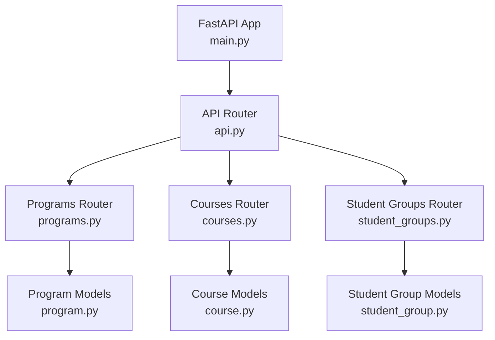
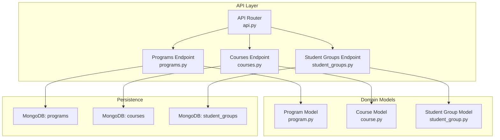
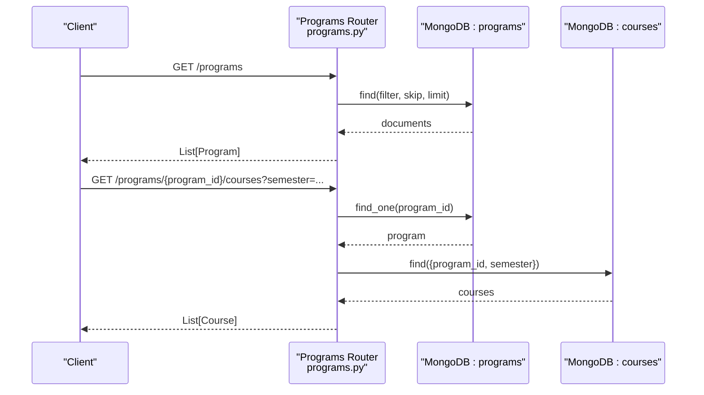
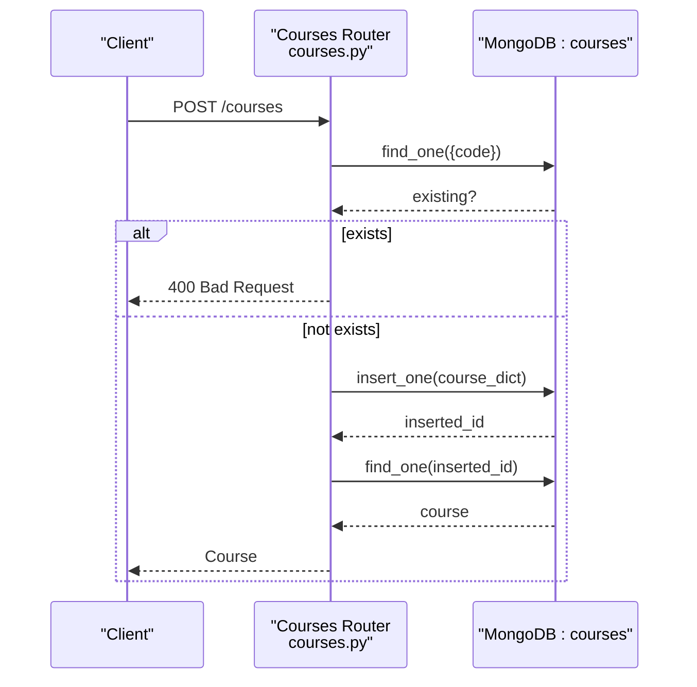
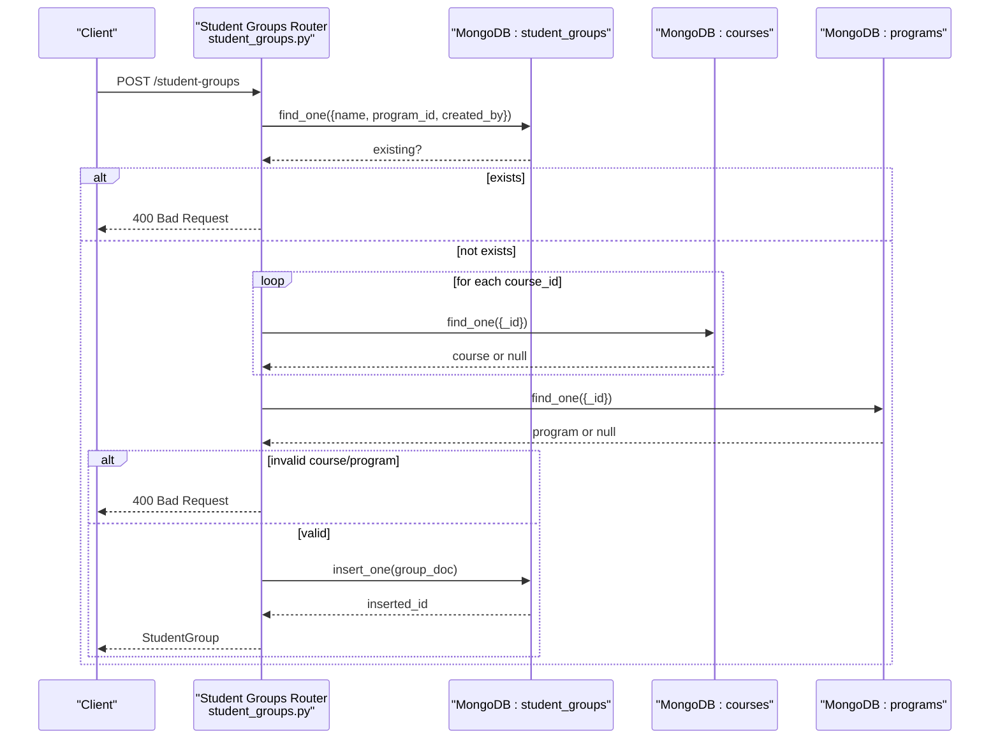
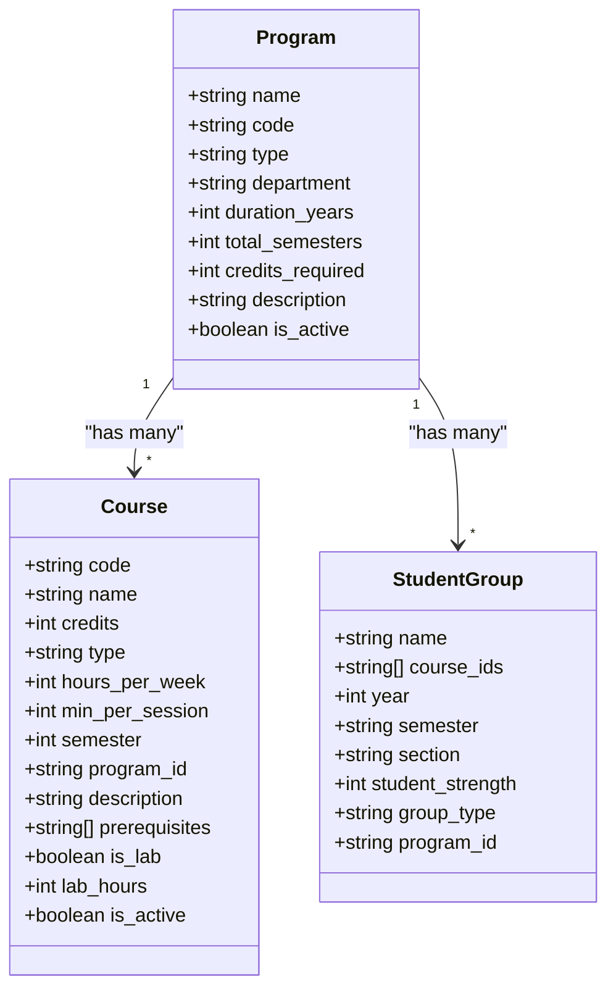
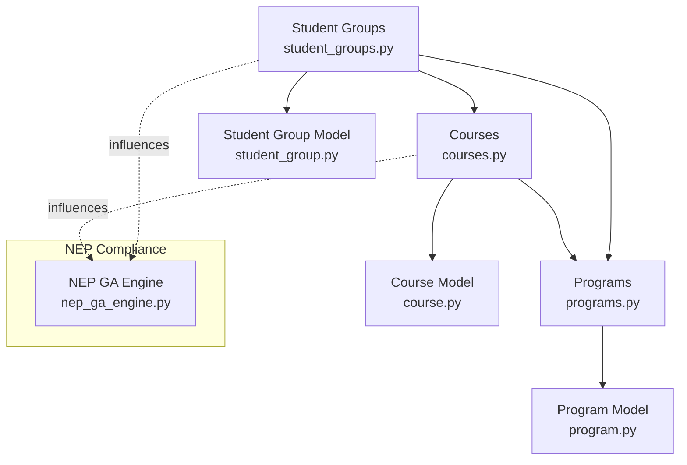

# Academic Management Endpoints

<cite>
**Referenced Files in This Document**
- [api.py](file://backend/app/api/api_v1/api.py)
- [main.py](file://backend/app/main.py)
- [programs.py](file://backend/app/api/v1/endpoints/programs.py)
- [courses.py](file://backend/app/api/v1/endpoints/courses.py)
- [student_groups.py](file://backend/app/api/v1/endpoints/student_groups.py)
- [program.py](file://backend/app/models/program.py)
- [course.py](file://backend/app/models/course.py)
- [student_group.py](file://backend/app/models/student_group.py)
- [nep_ga_engine.py](file://backend/app/services/timetable/nep_ga_engine.py)
</cite>

## Table of Contents
1. [Introduction](#introduction)
2. [Project Structure](#project-structure)
3. [Core Components](#core-components)
4. [Architecture Overview](#architecture-overview)
5. [Detailed Component Analysis](#detailed-component-analysis)
6. [Dependency Analysis](#dependency-analysis)
7. [Performance Considerations](#performance-considerations)
8. [Troubleshooting Guide](#troubleshooting-guide)
9. [Conclusion](#conclusion)

## Introduction
This document provides comprehensive API documentation for academic management endpoints focused on programs, courses, and student groups. It covers CRUD operations, request/response schemas, validation rules, and relationship constraints. It also addresses NEP 2020 compliance validation, course prerequisite handling, and academic hierarchy management. The backend is built with FastAPI and MongoDB, exposing REST endpoints under a unified router.

## Project Structure
The API is organized around a central router that mounts sub-routers for each domain. The academic management endpoints are exposed under the following prefixes:
- /programs
- /courses
- /student-groups

**Diagram sources**
- [main.py:1-102](file://backend/app/main.py#L1-L102)
- [api.py:1-34](file://backend/app/api/api_v1/api.py#L1-L34)
- [programs.py:1-288](file://backend/app/api/v1/endpoints/programs.py#L1-L288)
- [courses.py:1-279](file://backend/app/api/v1/endpoints/courses.py#L1-L279)
- [student_groups.py:1-380](file://backend/app/api/v1/endpoints/student_groups.py#L1-L380)
- [program.py:1-33](file://backend/app/models/program.py#L1-L33)
- [course.py:1-43](file://backend/app/models/course.py#L1-L43)
- [student_group.py:1-36](file://backend/app/models/student_group.py#L1-L36)

**Section sources**
- [api.py:24-27](file://backend/app/api/api_v1/api.py#L24-L27)
- [main.py:101](file://backend/app/main.py#L101)

## Core Components
This section outlines the request/response schemas and validation rules for each academic entity.

### Program Schema
- Base fields: name, code, type, department, duration_years, total_semesters, credits_required, description, is_active
- Validation: type constrained to predefined values; duration_years and total_semesters are integers; is_active defaults to true
- Relationships: Courses reference program_id; deletion guarded by associated timetables

**Section sources**
- [program.py:6-16](file://backend/app/models/program.py#L6-L16)
- [programs.py:116-121](file://backend/app/api/v1/endpoints/programs.py#L116-L121)

### Course Schema
- Base fields: code, name, credits (1–10), type, hours_per_week (1–20), min_per_session (30–180), semester (1–8), program_id, description, prerequisites (list of course IDs), is_lab, lab_hours, is_active
- Validation: numeric ranges enforced; prerequisites must reference existing course IDs
- Relationships: linked to a Program via program_id; course code uniqueness enforced

**Section sources**
- [course.py:6-19](file://backend/app/models/course.py#L6-L19)
- [courses.py:67-74](file://backend/app/api/v1/endpoints/courses.py#L67-L74)

### Student Group Schema
- Base fields: name, course_ids (list of course IDs), year (1–4), semester ("Odd"/"Even"), section, student_strength (1–200), group_type, program_id
- Validation: year and strength constrained; course_ids and program_id validated against existing entities
- Relationships: belongs to a Program; course_ids must reference existing Courses

**Section sources**
- [student_group.py:5-13](file://backend/app/models/student_group.py#L5-L13)
- [student_groups.py:81-110](file://backend/app/api/v1/endpoints/student_groups.py#L81-L110)

## Architecture Overview
The API follows a layered architecture:
- Entry points: FastAPI app registers a global router that includes domain-specific routers
- Domain routers: programs, courses, and student_groups handle CRUD operations
- Persistence: MongoDB collections for programs, courses, and student_groups
- Validation: Pydantic models define schemas and constraints; FastAPI handles request validation

**Diagram sources**
- [api.py:24-27](file://backend/app/api/api_v1/api.py#L24-L27)
- [programs.py:1-288](file://backend/app/api/v1/endpoints/programs.py#L1-L288)
- [courses.py:1-279](file://backend/app/api/v1/endpoints/courses.py#L1-L279)
- [student_groups.py:1-380](file://backend/app/api/v1/endpoints/student_groups.py#L1-L380)
- [program.py:1-33](file://backend/app/models/program.py#L1-L33)
- [course.py:1-43](file://backend/app/models/course.py#L1-L43)
- [student_group.py:1-36](file://backend/app/models/student_group.py#L1-L36)

## Detailed Component Analysis

### Programs Endpoints
- GET /programs
  - Filters: program_type, department; pagination via skip and limit
  - Response: array of Program objects
- GET /programs/{program_id}
  - Response: single Program object
- POST /programs
  - Requires admin role; validates unique program code
  - Response: created Program object
- PUT /programs/{program_id}
  - Requires admin role; partial updates supported
  - Response: updated Program object
- DELETE /programs/{program_id}
  - Requires admin role; prevents deletion if associated timetables exist
- GET /programs/{program_id}/courses
  - Filters: semester; returns courses linked to the program
- GET /programs/{program_id}/statistics
  - Aggregates counts and semester-wise course distribution

**Diagram sources**
- [programs.py:12-59](file://backend/app/api/v1/endpoints/programs.py#L12-L59)
- [programs.py:201-248](file://backend/app/api/v1/endpoints/programs.py#L201-L248)

**Section sources**
- [programs.py:12-199](file://backend/app/api/v1/endpoints/programs.py#L12-L199)
- [programs.py:201-287](file://backend/app/api/v1/endpoints/programs.py#L201-L287)

### Courses Endpoints
- GET /courses
  - Filters: program_id, semester
  - Response: array of Course objects
- POST /courses
  - Validates unique course code; converts program_id to ObjectId if provided
  - Response: created Course object
- PUT /courses/{course_id}
  - Validates ObjectId format; enforces unique code change; updates timestamps
  - Response: updated Course object
- DELETE /courses/{course_id}
  - Validates ObjectId format; deletes course

**Diagram sources**
- [courses.py:58-126](file://backend/app/api/v1/endpoints/courses.py#L58-L126)

**Section sources**
- [courses.py:12-279](file://backend/app/api/v1/endpoints/courses.py#L12-L279)

### Student Groups Endpoints
- GET /student-groups
  - Filters: program_id
  - Response: array of StudentGroup objects
- POST /student-groups
  - Validates unique group name per program and creator; ensures course_ids and program_id exist
  - Response: created StudentGroup object
- GET /student-groups/{group_id}
  - Requires ownership (created_by)
  - Response: StudentGroup object
- PUT /student-groups/{group_id}
  - Validates ObjectId format; enforces uniqueness of name within program; updates course_ids and program_id if provided
  - Response: updated StudentGroup object
- DELETE /student-groups/{group_id}
  - Requires ownership
- GET /student-groups/program/{program_id}/available-years
  - Returns available academic years based on program duration

**Diagram sources**
- [student_groups.py:59-137](file://backend/app/api/v1/endpoints/student_groups.py#L59-L137)

**Section sources**
- [student_groups.py:13-380](file://backend/app/api/v1/endpoints/student_groups.py#L13-L380)

### Data Models and Validation Rules

**Diagram sources**
- [program.py:6-33](file://backend/app/models/program.py#L6-L33)
- [course.py:6-43](file://backend/app/models/course.py#L6-L43)
- [student_group.py:5-36](file://backend/app/models/student_group.py#L5-L36)

**Section sources**
- [program.py:6-33](file://backend/app/models/program.py#L6-L33)
- [course.py:6-43](file://backend/app/models/course.py#L6-L43)
- [student_group.py:5-36](file://backend/app/models/student_group.py#L5-L36)

## Dependency Analysis
- Authentication and Authorization
  - Endpoints depend on a current active/admin user for privileged operations
- Database Access
  - All endpoints use MongoDB collections for persistence
- Cross-entity Dependencies
  - Courses reference Program via program_id
  - Student Groups reference Program and Courses via program_id and course_ids
- NEP 2020 Compliance
  - Timetable generation integrates NEP constraints (practical/theory ratio, faculty workload, etc.) via a dedicated genetic algorithm engine

**Diagram sources**
- [programs.py:1-288](file://backend/app/api/v1/endpoints/programs.py#L1-L288)
- [courses.py:1-279](file://backend/app/api/v1/endpoints/courses.py#L1-L279)
- [student_groups.py:1-380](file://backend/app/api/v1/endpoints/student_groups.py#L1-L380)
- [program.py:1-33](file://backend/app/models/program.py#L1-L33)
- [course.py:1-43](file://backend/app/models/course.py#L1-L43)
- [student_group.py:1-36](file://backend/app/models/student_group.py#L1-L36)
- [nep_ga_engine.py:1-794](file://backend/app/services/timetable/nep_ga_engine.py#L1-L794)

**Section sources**
- [programs.py:113-114](file://backend/app/api/v1/endpoints/programs.py#L113-L114)
- [courses.py:82-91](file://backend/app/api/v1/endpoints/courses.py#L82-L91)
- [student_groups.py:97-110](file://backend/app/api/v1/endpoints/student_groups.py#L97-L110)
- [nep_ga_engine.py:43-86](file://backend/app/services/timetable/nep_ga_engine.py#L43-L86)

## Performance Considerations
- Pagination and Filtering
  - Programs and Courses endpoints support skip/limit and targeted filters to reduce payload sizes
- ObjectId Handling
  - Endpoints convert ObjectId fields to strings for JSON responses to ensure compatibility
- Validation Overhead
  - Pydantic validation occurs automatically; ensure client requests align with model constraints to minimize server-side processing
- Indexing Recommendations
  - Consider indexing frequently queried fields (e.g., program_id, code, name) in MongoDB for improved query performance

[No sources needed since this section provides general guidance]

## Troubleshooting Guide
- Validation Errors
  - The application returns structured validation errors with detailed messages for malformed requests
- Common HTTP Status Codes
  - 400 Bad Request: Invalid ObjectId, duplicate codes/names, invalid formats
  - 401/403 Unauthorized/Forbidden: Insufficient privileges or unauthenticated access
  - 404 Not Found: Entity not found by ID or missing relationships
  - 500 Internal Server Error: Unexpected server failures during persistence operations
- Logging and Diagnostics
  - Endpoints print request and error details; use logs to diagnose issues

**Section sources**
- [main.py:42-54](file://backend/app/main.py#L42-L54)
- [programs.py:113-120](file://backend/app/api/v1/endpoints/programs.py#L113-L120)
- [courses.py:88-91](file://backend/app/api/v1/endpoints/courses.py#L88-L91)
- [student_groups.py:92-95](file://backend/app/api/v1/endpoints/student_groups.py#L92-L95)

## Conclusion
The academic management endpoints provide a robust foundation for managing programs, courses, and student groups with strong validation, clear relationships, and NEP 2020-aware timetable generation. By adhering to the documented schemas and constraints, clients can reliably perform CRUD operations and integrate with higher-level scheduling workflows.