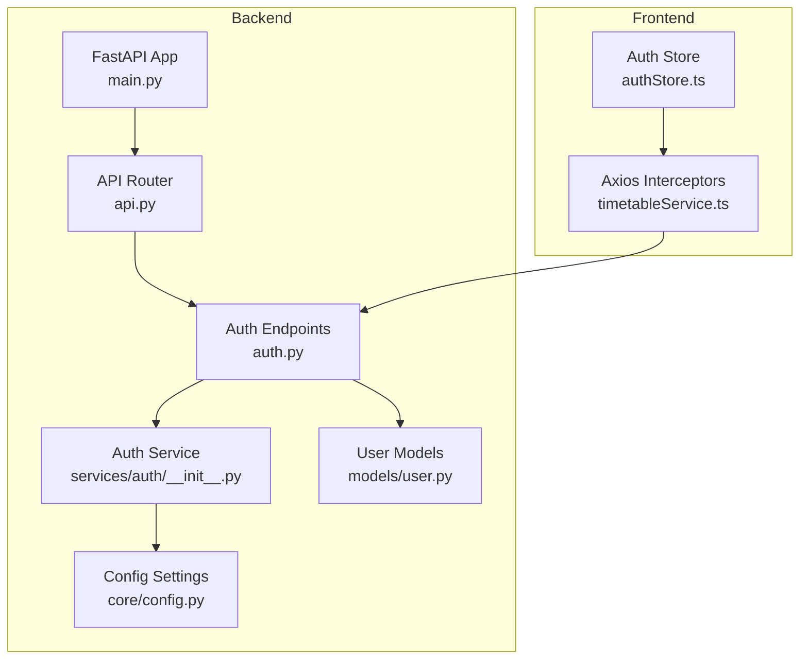
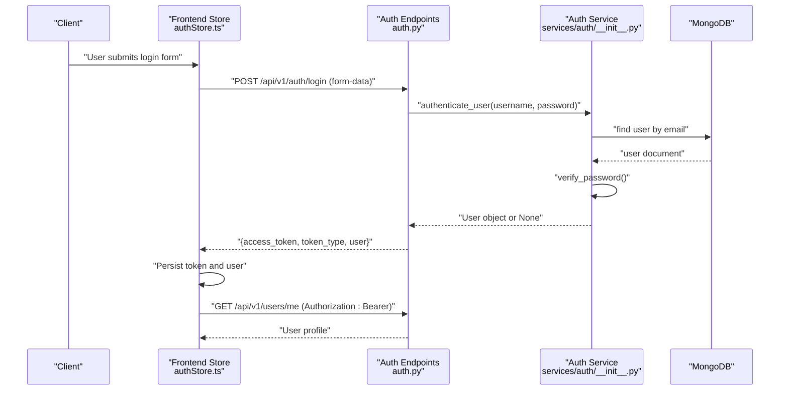
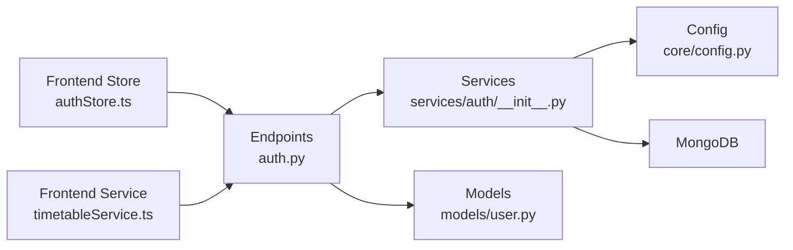

# Authentication Endpoints

<cite>
**Referenced Files in This Document**
- [auth.py](file://backend/app/api/v1/endpoints/auth.py)
- [__init__.py](file://backend/app/services/auth/__init__.py)
- [user.py](file://backend/app/models/user.py)
- [config.py](file://backend/app/core/config.py)
- [api.py](file://backend/app/api/api_v1/api.py)
- [main.py](file://backend/app/main.py)
- [authStore.ts](file://frontend/src/store/authStore.ts)
- [timetableService.ts](file://frontend/src/services/timetableService.ts)
- [test_endpoints.py](file://test_endpoints.py)
- [test_login.py](file://test_login.py)
</cite>

## Table of Contents
1. [Introduction](#introduction)
2. [Project Structure](#project-structure)
3. [Core Components](#core-components)
4. [Architecture Overview](#architecture-overview)
5. [Detailed Component Analysis](#detailed-component-analysis)
6. [Dependency Analysis](#dependency-analysis)
7. [Performance Considerations](#performance-considerations)
8. [Troubleshooting Guide](#troubleshooting-guide)
9. [Conclusion](#conclusion)

## Introduction
This document provides comprehensive API documentation for the authentication endpoints. It covers login, logout, signup (registration), password reset, and token refresh. It also documents JWT token authentication schemas, user registration models, session management, middleware behavior, token expiration handling, and security considerations. The guide includes HTTP method definitions, required parameters, validation rules, success and error responses, and practical examples for registration and login requests. Recommendations for rate limiting, account lockout policies, and secure token storage are provided.

## Project Structure
The authentication system spans backend endpoints, services, models, and frontend integration:
- Backend API endpoints for authentication are defined under the API v1 router and mounted under the `/api/v1/auth` prefix.
- Authentication service handles token creation, verification, user retrieval, and password hashing.
- User models define request/response schemas for registration and user representation.
- Frontend stores and services manage token lifecycle, automatic refresh, and protected requests.

**Diagram sources**
- [main.py:1-102](file://backend/app/main.py#L1-L102)
- [api.py:1-34](file://backend/app/api/api_v1/api.py#L1-L34)
- [auth.py:1-123](file://backend/app/api/v1/endpoints/auth.py#L1-L123)
- [__init__.py:1-190](file://backend/app/services/auth/__init__.py#L1-L190)
- [user.py:1-76](file://backend/app/models/user.py#L1-L76)
- [config.py:1-61](file://backend/app/core/config.py#L1-L61)
- [authStore.ts:1-248](file://frontend/src/store/authStore.ts#L1-L248)
- [timetableService.ts:1-772](file://frontend/src/services/timetableService.ts#L1-L772)

**Section sources**
- [main.py:1-102](file://backend/app/main.py#L1-L102)
- [api.py:1-34](file://backend/app/api/api_v1/api.py#L1-L34)
- [auth.py:1-123](file://backend/app/api/v1/endpoints/auth.py#L1-L123)
- [__init__.py:1-190](file://backend/app/services/auth/__init__.py#L1-L190)
- [user.py:1-76](file://backend/app/models/user.py#L1-L76)
- [config.py:1-61](file://backend/app/core/config.py#L1-L61)
- [authStore.ts:1-248](file://frontend/src/store/authStore.ts#L1-L248)
- [timetableService.ts:1-772](file://frontend/src/services/timetableService.ts#L1-L772)

## Core Components
- Authentication endpoints module exposes routes for login, registration, token testing, and refresh.
- Authentication service manages password hashing, token encoding/decoding, user lookup, and current user resolution.
- User models define request/response shapes for registration and user representation.
- Configuration defines JWT secret, algorithm, and token expiration.
- Frontend integrates token storage, bearer header injection, and automatic refresh logic.

Key responsibilities:
- Endpoint handlers validate inputs, authenticate users, issue tokens, and return user profiles.
- Service functions encapsulate cryptographic operations and database interactions.
- Models enforce field presence and types for registration and user payloads.
- Config controls security parameters and token lifetime.

**Section sources**
- [auth.py:29-123](file://backend/app/api/v1/endpoints/auth.py#L29-L123)
- [__init__.py:26-190](file://backend/app/services/auth/__init__.py#L26-L190)
- [user.py:27-76](file://backend/app/models/user.py#L27-L76)
- [config.py:29-33](file://backend/app/core/config.py#L29-L33)

## Architecture Overview
The authentication flow connects client requests to backend endpoints, which delegate to the authentication service for token management and user validation. The frontend stores tokens and injects Authorization headers for protected requests.

**Diagram sources**
- [auth.py:29-64](file://backend/app/api/v1/endpoints/auth.py#L29-L64)
- [__init__.py:62-89](file://backend/app/services/auth/__init__.py#L62-L89)
- [authStore.ts:36-74](file://frontend/src/store/authStore.ts#L36-L74)

## Detailed Component Analysis

### Authentication Endpoints
- Route prefix: `/api/v1/auth`
- Available endpoints:
  - POST `/login`: OAuth2-compatible token login
  - POST `/register`: Create new user account
  - POST `/test-token`: Validate access token
  - POST `/refresh-token`: Refresh access token for active users

Behavior highlights:
- Login validates credentials and returns an access token with user profile.
- Registration validates input via model validators and persists to MongoDB.
- Token testing and refresh endpoints depend on current active user resolution.

**Section sources**
- [auth.py:29-123](file://backend/app/api/v1/endpoints/auth.py#L29-L123)
- [api.py:23](file://backend/app/api/api_v1/api.py#L23)

### Login Endpoint
- Method: POST
- Path: `/api/v1/auth/login`
- Authentication: OAuth2PasswordRequestForm (form-encoded)
- Required parameters:
  - username: string (email)
  - password: string
- Validation rules:
  - Username must match an existing user record.
  - Password must match the stored hash.
  - User must be active.
- Success response:
  - access_token: string (JWT)
  - token_type: string ("bearer")
  - user: object containing id, email, full_name, role, is_admin
- Error responses:
  - 401 Unauthorized: Incorrect username or password
  - 400 Bad Request: Inactive user

Example request (form-encoded):
- Content-Type: application/x-www-form-urlencoded
- Body:
  - username: admin@example.com
  - password: admin123

Example success response:
{
  "access_token": "<JWT>",
  "token_type": "bearer",
  "user": {
    "id": "507f1f77bcf86cd799439011",
    "email": "admin@example.com",
    "full_name": "Admin User",
    "role": "user",
    "is_admin": false
  }
}

Example error response (incorrect credentials):
{
  "detail": "Incorrect username or password"
}

**Section sources**
- [auth.py:29-64](file://backend/app/api/v1/endpoints/auth.py#L29-L64)
- [__init__.py:62-89](file://backend/app/services/auth/__init__.py#L62-L89)

### Logout Endpoint
- Method: POST
- Path: `/api/v1/auth/logout`
- Behavior: Not implemented in the current codebase.
- Recommendation: Implement logout by invalidating the token server-side or maintaining a revocation list. Alternatively, rely on short-lived tokens and refresh logic.

Note: The absence of a dedicated logout endpoint means clients should clear local tokens and avoid reusing stale tokens.

**Section sources**
- [auth.py:1-123](file://backend/app/api/v1/endpoints/auth.py#L1-L123)

### Signup (Registration) Endpoint
- Method: POST
- Path: `/api/v1/auth/register`
- Request body schema (UserCreate):
  - email: string (valid email)
  - name: optional string
  - full_name: optional string (validated; requires either name or full_name)
  - password: string
  - is_active: optional boolean (default: true)
  - is_admin: optional boolean (default: false)
  - role: optional string (default: "user")
- Validation rules:
  - Either name or full_name must be provided.
  - Email must be unique; registration fails if duplicate.
  - Password is hashed before persistence.
- Success response:
  - Returns created User object with id, email, full_name, role, is_admin, timestamps.
- Error responses:
  - 400 Bad Request: Validation error or duplicate email
  - 500 Internal Server Error: Unexpected failure during registration

Example request (JSON):
{
  "email": "john.doe@example.com",
  "full_name": "John Doe",
  "password": "SecurePass!2024",
  "role": "user"
}

Example success response:
{
  "id": "507f1f77bcf86cd799439011",
  "email": "john.doe@example.com",
  "full_name": "John Doe",
  "role": "user",
  "is_admin": false,
  "created_at": "2025-06-01T12:00:00Z",
  "updated_at": null
}

Example error response (duplicate email):
{
  "detail": "Email already registered"
}

**Section sources**
- [auth.py:78-101](file://backend/app/api/v1/endpoints/auth.py#L78-L101)
- [__init__.py:159-189](file://backend/app/services/auth/__init__.py#L159-L189)
- [user.py:39-56](file://backend/app/models/user.py#L39-L56)

### Password Reset Endpoint
- Method: POST
- Path: `/api/v1/auth/reset-password`
- Behavior: Not implemented in the current codebase.
- Recommendation: Implement secure password reset with time-limited tokens sent via email, ensuring CSRF protection and rate limiting.

Note: The absence of a password reset endpoint indicates that password changes are not handled through the provided API.

**Section sources**
- [auth.py:1-123](file://backend/app/api/v1/endpoints/auth.py#L1-L123)

### Token Refresh Endpoint
- Method: POST
- Path: `/api/v1/auth/refresh-token`
- Authentication: Requires a valid active user context
- Behavior:
  - Issues a new access token bound to the current user’s ID.
  - Uses configured expiration from settings.
- Success response:
  - access_token: string (JWT)
  - token_type: string ("bearer")

Example success response:
{
  "access_token": "<JWT>",
  "token_type": "bearer"
}

Security note: The refresh endpoint depends on the current active user. Ensure clients proactively refresh tokens before expiration to avoid 401 responses.

**Section sources**
- [auth.py:109-123](file://backend/app/api/v1/endpoints/auth.py#L109-L123)
- [__init__.py:137-144](file://backend/app/services/auth/__init__.py#L137-L144)
- [config.py:32](file://backend/app/core/config.py#L32)

### Token Testing Endpoint
- Method: POST
- Path: `/api/v1/auth/test-token`
- Purpose: Verify that a provided access token is valid and corresponds to an active user.
- Behavior:
  - Resolves current active user from the token.
  - Returns the user object if valid.
- Success response:
  - Returns User object representing the authenticated user.

**Section sources**
- [auth.py:102-107](file://backend/app/api/v1/endpoints/auth.py#L102-L107)
- [__init__.py:137-144](file://backend/app/services/auth/__init__.py#L137-L144)

### JWT Token Authentication Schema
- Token type: Bearer JWT
- Payload claims:
  - sub: user identifier (string)
  - exp: expiration timestamp (UTC)
- Signing algorithm: HS256
- Secret key: configurable via settings
- Expiration: 30 days (43200 minutes)

Frontend usage:
- Authorization header: "Bearer <access_token>"
- Automatic injection via interceptors for protected requests
- Token expiration detection and refresh logic for admin users

**Section sources**
- [auth.py:49-52](file://backend/app/api/v1/endpoints/auth.py#L49-L52)
- [__init__.py:41-59](file://backend/app/services/auth/__init__.py#L41-L59)
- [config.py:30-33](file://backend/app/core/config.py#L30-L33)
- [authStore.ts:209-247](file://frontend/src/store/authStore.ts#L209-L247)
- [timetableService.ts:263-305](file://frontend/src/services/timetableService.ts#L263-L305)

### Session Management
- Sessions are stateless via JWT tokens.
- Clients store the access token locally and attach it to subsequent requests.
- Protected endpoints require Authorization: Bearer <token>.
- Automatic refresh attempts are implemented for admin users in the frontend service.

Recommendations:
- Use HttpOnly cookies for tokens in production to mitigate XSS risks.
- Implement sliding sessions or refresh tokens for long-lived sessions.
- Enforce logout by clearing tokens and optionally blacklisting JWTs.

**Section sources**
- [authStore.ts:122-129](file://frontend/src/store/authStore.ts#L122-L129)
- [timetableService.ts:238-261](file://frontend/src/services/timetableService.ts#L238-L261)

### Authentication Middleware and Security
- OAuth2PasswordBearer token URL is configured to `/api/v1/auth/login`.
- Token decoding validates signature and extracts user identity.
- Current user resolution enforces active user requirement.
- Demo user handling is present for development/testing.

Security considerations:
- Use HTTPS in production to protect tokens in transit.
- Rotate SECRET_KEY regularly and store it securely.
- Implement rate limiting and account lockout policies at the gateway or application level.
- Sanitize logs to avoid exposing tokens or sensitive data.

**Section sources**
- [__init__.py:21-23](file://backend/app/services/auth/__init__.py#L21-L23)
- [__init__.py:104-113](file://backend/app/services/auth/__init__.py#L104-L113)
- [__init__.py:62-75](file://backend/app/services/auth/__init__.py#L62-L75)

### CORS and Preflight Handling
- The registration endpoint includes an OPTIONS route to handle CORS preflight requests.
- Frontend origins are configured in the main application middleware.

**Section sources**
- [auth.py:17-27](file://backend/app/api/v1/endpoints/auth.py#L17-L27)
- [main.py:56-64](file://backend/app/main.py#L56-L64)

## Dependency Analysis
The authentication system exhibits clear separation of concerns:
- Endpoints depend on service functions for authentication and token management.
- Services depend on configuration for JWT settings and database access.
- Models define request/response contracts enforced by FastAPI.
- Frontend depends on backend endpoints for authentication and relies on interceptors for token handling.

**Diagram sources**
- [auth.py:1-123](file://backend/app/api/v1/endpoints/auth.py#L1-L123)
- [__init__.py:1-190](file://backend/app/services/auth/__init__.py#L1-L190)
- [user.py:1-76](file://backend/app/models/user.py#L1-L76)
- [config.py:1-61](file://backend/app/core/config.py#L1-L61)
- [authStore.ts:1-248](file://frontend/src/store/authStore.ts#L1-L248)
- [timetableService.ts:1-772](file://frontend/src/services/timetableService.ts#L1-L772)

**Section sources**
- [auth.py:1-123](file://backend/app/api/v1/endpoints/auth.py#L1-L123)
- [__init__.py:1-190](file://backend/app/services/auth/__init__.py#L1-L190)
- [user.py:1-76](file://backend/app/models/user.py#L1-L76)
- [config.py:1-61](file://backend/app/core/config.py#L1-L61)
- [authStore.ts:1-248](file://frontend/src/store/authStore.ts#L1-L248)
- [timetableService.ts:1-772](file://frontend/src/services/timetableService.ts#L1-L772)

## Performance Considerations
- Token signing and verification are lightweight; performance impact is minimal.
- Password hashing uses bcrypt; consider tuned cost factors for production workloads.
- Database queries for user lookup should be indexed on email for optimal performance.
- Avoid excessive token refreshes; batch requests and cache user data client-side where appropriate.

## Troubleshooting Guide
Common issues and resolutions:
- 401 Unauthorized on login:
  - Verify username/password correctness and user activation status.
  - Confirm Authorization header format: "Bearer <token>" for protected endpoints.
- 400 Bad Request on registration:
  - Ensure email uniqueness and provide either name or full_name.
  - Check password strength and model constraints.
- 401 Unauthorized on protected endpoints:
  - Trigger token refresh logic in the frontend service.
  - Ensure interceptors are adding Authorization headers.
- CORS errors:
  - Confirm frontend origin is allowed and preflight OPTIONS is handled.

Operational tests:
- Use the provided test scripts to validate server health and login flow.

**Section sources**
- [auth.py:38-47](file://backend/app/api/v1/endpoints/auth.py#L38-L47)
- [auth.py:89-100](file://backend/app/api/v1/endpoints/auth.py#L89-L100)
- [authStore.ts:238-247](file://frontend/src/store/authStore.ts#L238-L247)
- [test_endpoints.py:14-45](file://test_endpoints.py#L14-L45)
- [test_login.py:4-9](file://test_login.py#L4-L9)

## Conclusion
The authentication system provides robust JWT-based login, registration, token testing, and refresh capabilities. While logout and password reset are not implemented, the foundation supports secure token handling, active user enforcement, and frontend integration with automatic refresh for admin users. For production, implement logout mechanisms, password reset workflows, rate limiting, account lockout policies, and secure token storage practices to strengthen security posture.