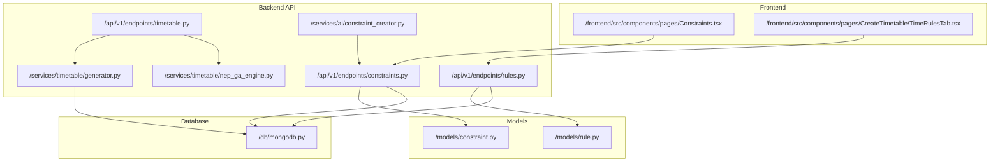
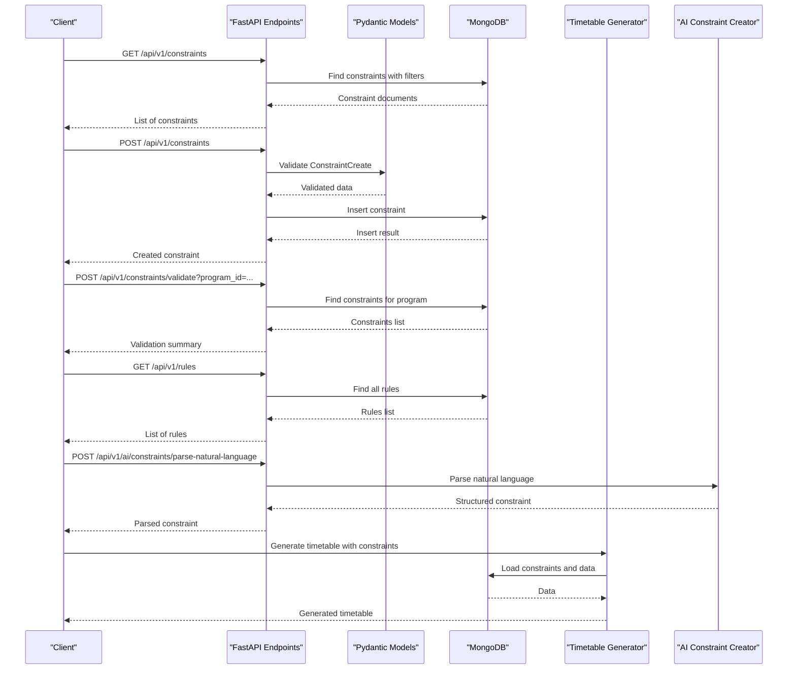
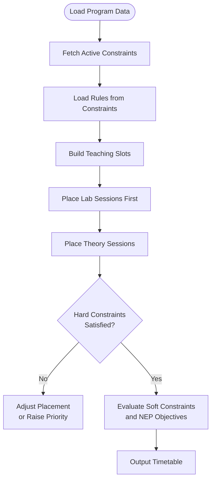
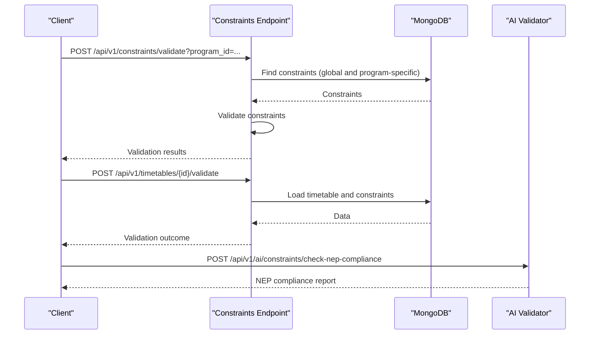
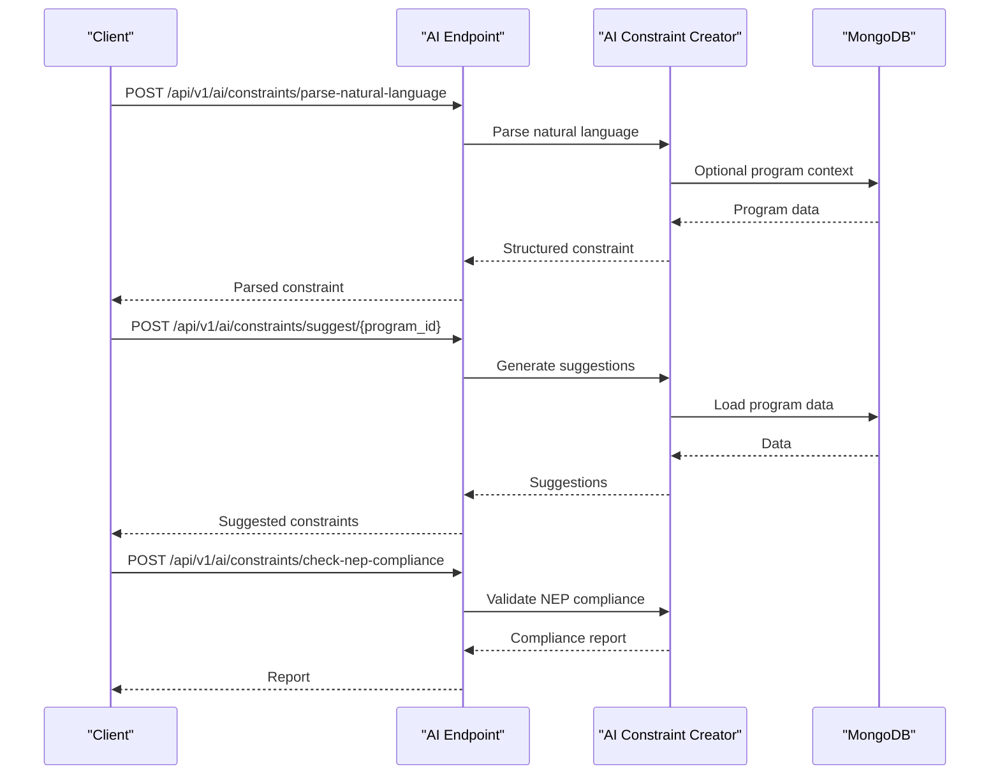
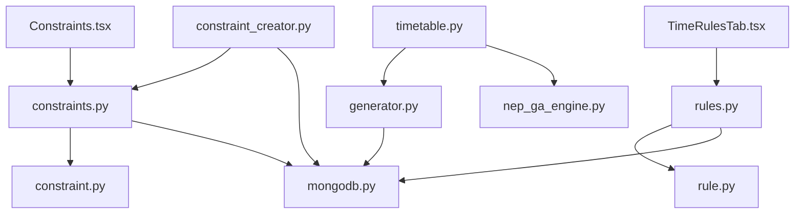

# Constraint and Rules Endpoints

<cite>
**Referenced Files in This Document**
- [constraints.py](file://backend/app/api/v1/endpoints/constraints.py)
- [rules.py](file://backend/app/api/v1/endpoints/rules.py)
- [constraint.py](file://backend/app/models/constraint.py)
- [rule.py](file://backend/app/models/rule.py)
- [generator.py](file://backend/app/services/timetable/generator.py)
- [mongodb.py](file://backend/app/db/mongodb.py)
- [timetable.py](file://backend/app/api/v1/endpoints/timetable.py)
- [nep_ga_engine.py](file://backend/app/services/timetable/nep_ga_engine.py)
- [constraint_creator.py](file://backend/app/services/ai/constraint_creator.py)
- [Constraints.tsx](file://frontend/src/components/pages/Constraints.tsx)
- [TimeRulesTab.tsx](file://frontend/src/components/pages/CreateTimetable/TimeRulesTab.tsx)
</cite>

## Table of Contents
1. [Introduction](#introduction)
2. [Project Structure](#project-structure)
3. [Core Components](#core-components)
4. [Architecture Overview](#architecture-overview)
5. [Detailed Component Analysis](#detailed-component-analysis)
6. [Dependency Analysis](#dependency-analysis)
7. [Performance Considerations](#performance-considerations)
8. [Troubleshooting Guide](#troubleshooting-guide)
9. [Conclusion](#conclusion)

## Introduction
This document provides comprehensive API documentation for constraint and scheduling rules endpoints used in timetable generation. It covers constraint definition, rule management, validation systems, and compliance with educational regulations (NEP 2020). The documentation includes HTTP methods, request schemas, constraint categories, rule precedence, conflict resolution strategies, and practical examples for creation, modification, and validation testing.

## Project Structure
The constraint and rules functionality spans backend API endpoints, Pydantic models, database integration, and AI-powered assistance. The frontend components provide user interfaces for managing constraints and time rules.

**Diagram sources**
- [constraints.py:1-189](file://backend/app/api/v1/endpoints/constraints.py#L1-L189)
- [rules.py:1-68](file://backend/app/api/v1/endpoints/rules.py#L1-L68)
- [constraint.py:1-30](file://backend/app/models/constraint.py#L1-L30)
- [rule.py:1-34](file://backend/app/models/rule.py#L1-L34)
- [generator.py:1-402](file://backend/app/services/timetable/generator.py#L1-L402)
- [nep_ga_engine.py:1-794](file://backend/app/services/timetable/nep_ga_engine.py#L1-L794)
- [constraint_creator.py:1-781](file://backend/app/services/ai/constraint_creator.py#L1-L781)
- [mongodb.py:1-41](file://backend/app/db/mongodb.py#L1-L41)
- [timetable.py:1-728](file://backend/app/api/v1/endpoints/timetable.py#L1-L728)
- [Constraints.tsx:1-800](file://frontend/src/components/pages/Constraints.tsx#L1-L800)
- [TimeRulesTab.tsx:1-293](file://frontend/src/components/pages/CreateTimetable/TimeRulesTab.tsx#L1-L293)

**Section sources**
- [constraints.py:1-189](file://backend/app/api/v1/endpoints/constraints.py#L1-L189)
- [rules.py:1-68](file://backend/app/api/v1/endpoints/rules.py#L1-L68)
- [constraint.py:1-30](file://backend/app/models/constraint.py#L1-L30)
- [rule.py:1-34](file://backend/app/models/rule.py#L1-L34)
- [generator.py:1-402](file://backend/app/services/timetable/generator.py#L1-L402)
- [nep_ga_engine.py:1-794](file://backend/app/services/timetable/nep_ga_engine.py#L1-L794)
- [constraint_creator.py:1-781](file://backend/app/services/ai/constraint_creator.py#L1-L781)
- [mongodb.py:1-41](file://backend/app/db/mongodb.py#L1-L41)
- [timetable.py:1-728](file://backend/app/api/v1/endpoints/timetable.py#L1-L728)
- [Constraints.tsx:1-800](file://frontend/src/components/pages/Constraints.tsx#L1-L800)
- [TimeRulesTab.tsx:1-293](file://frontend/src/components/pages/CreateTimetable/TimeRulesTab.tsx#L1-L293)

## Core Components
- Constraint endpoint router manages CRUD operations for scheduling constraints with filtering, pagination, and validation.
- Rule endpoint router manages time and scheduling rules with create, update, delete, and list operations.
- Pydantic models define request/response schemas for constraints and rules.
- Timetable generator consumes constraints to build feasible schedules and applies rule-based policies.
- AI constraint creator parses natural language into structured constraints, suggests improvements, and validates NEP 2020 compliance.
- Frontend components provide interactive forms for constraint creation and rule configuration.

**Section sources**
- [constraints.py:1-189](file://backend/app/api/v1/endpoints/constraints.py#L1-L189)
- [rules.py:1-68](file://backend/app/api/v1/endpoints/rules.py#L1-L68)
- [constraint.py:1-30](file://backend/app/models/constraint.py#L1-L30)
- [rule.py:1-34](file://backend/app/models/rule.py#L1-L34)
- [generator.py:163-402](file://backend/app/services/timetable/generator.py#L163-L402)
- [constraint_creator.py:179-781](file://backend/app/services/ai/constraint_creator.py#L179-L781)
- [Constraints.tsx:195-800](file://frontend/src/components/pages/Constraints.tsx#L195-L800)
- [TimeRulesTab.tsx:32-293](file://frontend/src/components/pages/CreateTimetable/TimeRulesTab.tsx#L32-L293)

## Architecture Overview
The constraint and rules system integrates API endpoints, models, database persistence, and AI assistance. Constraints feed into the timetable generation pipeline, while rules define time and scheduling policies. Validation endpoints ensure compliance with organizational and regulatory standards.

**Diagram sources**
- [constraints.py:11-189](file://backend/app/api/v1/endpoints/constraints.py#L11-L189)
- [rules.py:13-68](file://backend/app/api/v1/endpoints/rules.py#L13-L68)
- [constraint.py:15-30](file://backend/app/models/constraint.py#L15-L30)
- [rule.py:14-34](file://backend/app/models/rule.py#L14-L34)
- [mongodb.py:11-41](file://backend/app/db/mongodb.py#L11-L41)
- [generator.py:169-233](file://backend/app/services/timetable/generator.py#L169-L233)
- [constraint_creator.py:179-282](file://backend/app/services/ai/constraint_creator.py#L179-L282)

## Detailed Component Analysis

### Constraint Endpoints
- Base path: `/api/v1/constraints`
- Methods:
  - GET `/` - List constraints with filtering by type, activity, and program.
  - GET `/{constraint_id}` - Retrieve a specific constraint.
  - POST `/` - Create a new constraint (requires admin or faculty role).
  - PUT `/{constraint_id}` - Update an existing constraint (creator or admin).
  - DELETE `/{constraint_id}` - Delete a constraint (creator or admin).
  - GET `/types/` - List supported constraint types with descriptions.
  - POST `/validate` - Validate constraints for a given program.

Request schemas:
- ConstraintCreate: name, type, description, parameters (dict), priority (1-10), is_active (bool), program_id (optional).
- ConstraintUpdate: optional fields of ConstraintCreate.

Response schemas:
- Constraint: Constraint model plus created_by, created_at, updated_at.

Validation:
- Endpoint validates constraints for a program and returns a summary of validity.

Permissions:
- Creation and updates require admin or faculty roles; deletions require admin or creator.

Examples:
- Create a constraint: POST /api/v1/constraints with ConstraintCreate payload.
- Update a constraint: PUT /api/v1/constraints/{constraint_id} with ConstraintUpdate payload.
- Validate constraints: POST /api/v1/constraints/validate?program_id=PROGRAM_ID.

**Section sources**
- [constraints.py:11-189](file://backend/app/api/v1/endpoints/constraints.py#L11-L189)
- [constraint.py:15-30](file://backend/app/models/constraint.py#L15-L30)

### Rule Endpoints
- Base path: `/api/v1/rules`
- Methods:
  - GET `/` - List all rules.
  - POST `/` - Create a new rule (time settings).
  - PUT `/{rule_id}` - Update an existing rule.
  - DELETE `/{rule_id}` - Delete a rule.

Request schemas:
- RuleCreate: name, description, rule_type (default "custom"), params (dict), is_active.
- RuleUpdate: optional fields of RuleCreate.

Response schemas:
- Rule: includes id, created_by, created_at, updated_at.

Usage:
- Time rules define scheduling parameters (e.g., start/end times, intervals, max classes per day).

Examples:
- Create time settings rule: POST /api/v1/rules with RuleCreate payload containing params for time settings.
- Update rule: PUT /api/v1/rules/{rule_id} with RuleUpdate payload.

**Section sources**
- [rules.py:13-68](file://backend/app/api/v1/endpoints/rules.py#L13-L68)
- [rule.py:14-34](file://backend/app/models/rule.py#L14-L34)

### Constraint Definition and Categories
Supported constraint types include:
- faculty_availability: Defines faculty availability windows.
- room_capacity: Matches room capacity to course enrollment.
- time_preference: Encodes preferred or avoided time slots.
- course_prerequisite: Sequences courses based on prerequisites.
- faculty_workload: Limits teaching hours per faculty member.
- room_type_requirement: Requires specific room types (e.g., lab).
- block_scheduling: Schedules extended blocks for practical sessions.
- gap_minimization: Reduces gaps between classes.
- consecutive_classes: Schedules specific courses in consecutive slots.
- nep_compliance: Aligns with NEP 2020 guidelines.

Parameters vary by type; refer to frontend component definitions for UI-driven parameter schemas.

**Section sources**
- [constraints.py:122-149](file://backend/app/api/v1/endpoints/constraints.py#L122-L149)
- [Constraints.tsx:98-193](file://frontend/src/components/pages/Constraints.tsx#L98-L193)

### Rule Precedence and Conflict Resolution
- Priority: Constraints include a numeric priority field (1-10) indicating relative importance.
- Rule-based policies: Rules define time boundaries and limits (e.g., max classes per day, continuous hours).
- Conflict resolution: The generator evaluates hard constraints first (conflicts, capacity, availability) and then optimizes soft constraints and NEP objectives.

**Diagram sources**
- [generator.py:169-302](file://backend/app/services/timetable/generator.py#L169-L302)
- [generator.py:303-379](file://backend/app/services/timetable/generator.py#L303-L379)

**Section sources**
- [generator.py:163-402](file://backend/app/services/timetable/generator.py#L163-L402)

### Validation Systems
- Constraint validation: POST /api/v1/constraints/validate runs a program-wide validation and returns a summary.
- Timetable validation: POST /api/v1/timetables/{id}/validate validates a generated timetable against constraints.
- NEP 2020 compliance: AI-assisted validation and optimization ensure alignment with NEP guidelines.

**Diagram sources**
- [constraints.py:151-189](file://backend/app/api/v1/endpoints/constraints.py#L151-L189)
- [timetable.py:709-728](file://backend/app/api/v1/endpoints/timetable.py#L709-L728)
- [constraint_creator.py:536-658](file://backend/app/services/ai/constraint_creator.py#L536-L658)

**Section sources**
- [constraints.py:151-189](file://backend/app/api/v1/endpoints/constraints.py#L151-L189)
- [timetable.py:709-728](file://backend/app/api/v1/endpoints/timetable.py#L709-L728)
- [constraint_creator.py:536-658](file://backend/app/services/ai/constraint_creator.py#L536-L658)

### AI-Powered Constraint Management
- Natural language parsing: Converts user-provided text into structured constraints.
- Suggestions: Provides AI-generated constraint suggestions tailored to a program.
- NEP compliance checking: Validates constraint sets against NEP 2020 guidelines and offers recommendations.
- Optimization: Suggests improvements to reduce conflicts and enhance schedule quality.

**Diagram sources**
- [constraint_creator.py:179-282](file://backend/app/services/ai/constraint_creator.py#L179-L282)
- [constraint_creator.py:405-499](file://backend/app/services/ai/constraint_creator.py#L405-L499)
- [constraint_creator.py:536-658](file://backend/app/services/ai/constraint_creator.py#L536-L658)

**Section sources**
- [constraint_creator.py:179-781](file://backend/app/services/ai/constraint_creator.py#L179-L781)

### Frontend Integration
- Constraints management UI: Allows creation, editing, deletion, and validation of constraints with parameter-driven forms.
- Time rules UI: Enables configuration of time settings and rule creation/update via a slider-based interface.

**Section sources**
- [Constraints.tsx:195-800](file://frontend/src/components/pages/Constraints.tsx#L195-L800)
- [TimeRulesTab.tsx:32-293](file://frontend/src/components/pages/CreateTimetable/TimeRulesTab.tsx#L32-L293)

## Dependency Analysis
The constraint and rules system exhibits clear separation of concerns:
- API endpoints depend on Pydantic models for validation and MongoDB for persistence.
- Timetable generation consumes constraints and rules to produce schedules.
- AI services augment constraint management with natural language processing and compliance validation.
- Frontend components drive user interactions and data submission.

**Diagram sources**
- [constraints.py:1-189](file://backend/app/api/v1/endpoints/constraints.py#L1-L189)
- [rules.py:1-68](file://backend/app/api/v1/endpoints/rules.py#L1-L68)
- [constraint.py:1-30](file://backend/app/models/constraint.py#L1-L30)
- [rule.py:1-34](file://backend/app/models/rule.py#L1-L34)
- [mongodb.py:1-41](file://backend/app/db/mongodb.py#L1-L41)
- [timetable.py:1-728](file://backend/app/api/v1/endpoints/timetable.py#L1-L728)
- [generator.py:1-402](file://backend/app/services/timetable/generator.py#L1-L402)
- [nep_ga_engine.py:1-794](file://backend/app/services/timetable/nep_ga_engine.py#L1-L794)
- [constraint_creator.py:1-781](file://backend/app/services/ai/constraint_creator.py#L1-L781)
- [Constraints.tsx:1-800](file://frontend/src/components/pages/Constraints.tsx#L1-L800)
- [TimeRulesTab.tsx:1-293](file://frontend/src/components/pages/CreateTimetable/TimeRulesTab.tsx#L1-L293)

**Section sources**
- [constraints.py:1-189](file://backend/app/api/v1/endpoints/constraints.py#L1-L189)
- [rules.py:1-68](file://backend/app/api/v1/endpoints/rules.py#L1-L68)
- [constraint.py:1-30](file://backend/app/models/constraint.py#L1-L30)
- [rule.py:1-34](file://backend/app/models/rule.py#L1-L34)
- [generator.py:1-402](file://backend/app/services/timetable/generator.py#L1-L402)
- [nep_ga_engine.py:1-794](file://backend/app/services/timetable/nep_ga_engine.py#L1-L794)
- [constraint_creator.py:1-781](file://backend/app/services/ai/constraint_creator.py#L1-L781)
- [mongodb.py:1-41](file://backend/app/db/mongodb.py#L1-L41)
- [timetable.py:1-728](file://backend/app/api/v1/endpoints/timetable.py#L1-L728)
- [Constraints.tsx:1-800](file://frontend/src/components/pages/Constraints.tsx#L1-L800)
- [TimeRulesTab.tsx:1-293](file://frontend/src/components/pages/CreateTimetable/TimeRulesTab.tsx#L1-L293)

## Performance Considerations
- Pagination: Constraint listing supports skip/limit parameters to manage large datasets.
- Filtering: Query filters reduce database load by limiting returned records.
- Asynchronous database operations: Motor client enables non-blocking I/O for MongoDB.
- Timetable generation: Slot computation and placement algorithms consider time windows and constraints to minimize backtracking.

[No sources needed since this section provides general guidance]

## Troubleshooting Guide
Common issues and resolutions:
- Authentication errors: Ensure valid JWT token is included in Authorization header for protected endpoints.
- Permission errors: Creation and updates require admin or faculty roles; deletions require admin or creator ownership.
- Not found errors: Verify resource IDs and ensure resources exist before performing operations.
- Validation failures: Review request schemas and parameter constraints defined in Pydantic models.
- Database connectivity: Confirm MongoDB connection settings and network accessibility.

**Section sources**
- [constraints.py:56-113](file://backend/app/api/v1/endpoints/constraints.py#L56-L113)
- [rules.py:38-67](file://backend/app/api/v1/endpoints/rules.py#L38-L67)
- [mongodb.py:11-41](file://backend/app/db/mongodb.py#L11-L41)

## Conclusion
The constraint and rules endpoints provide a robust foundation for timetable generation with comprehensive validation and AI-assisted management. Constraints enable precise control over scheduling policies, while rules define time-based parameters. The system supports NEP 2020 compliance and offers flexible validation and optimization capabilities to ensure high-quality, regulatory-aligned timetables.