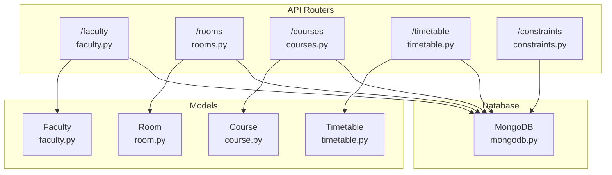
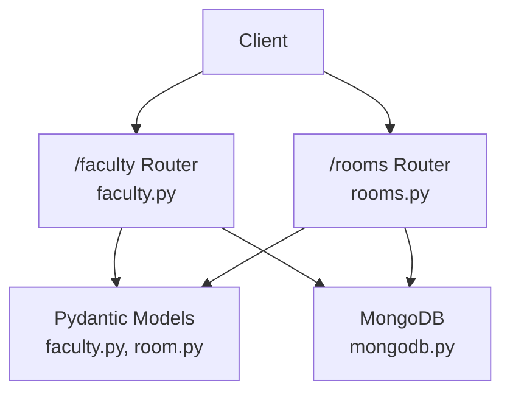
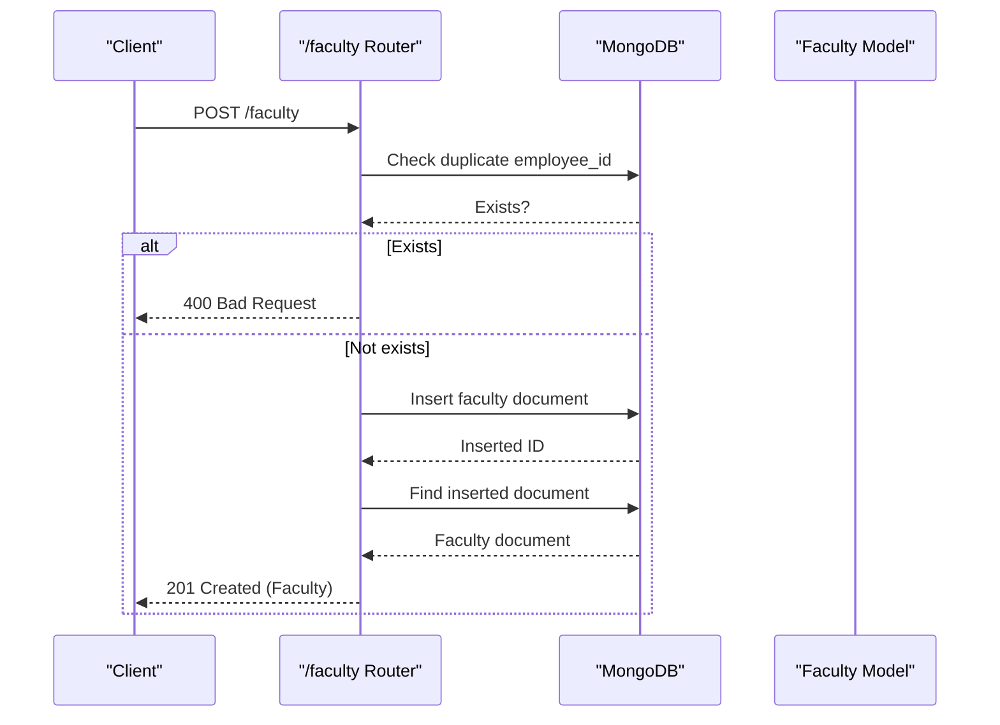
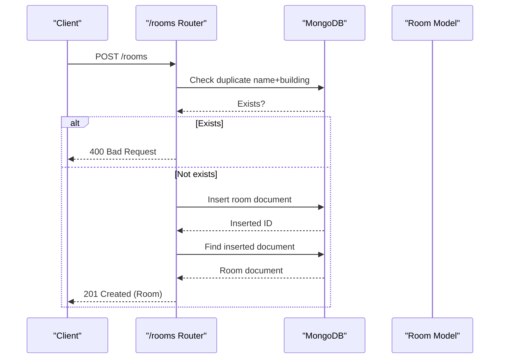
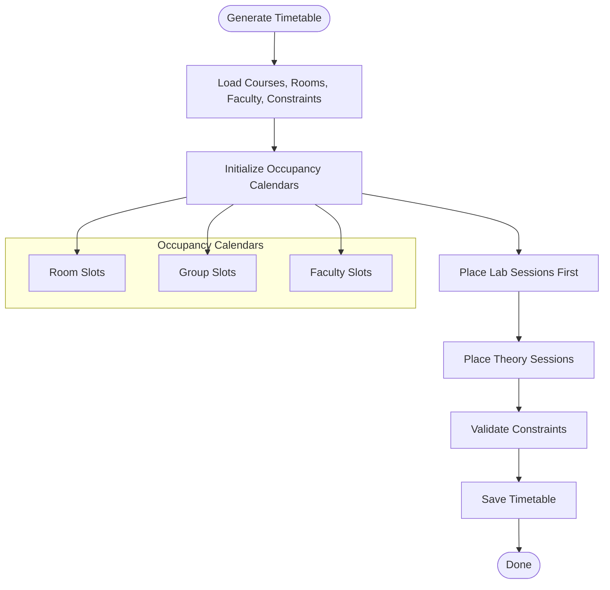
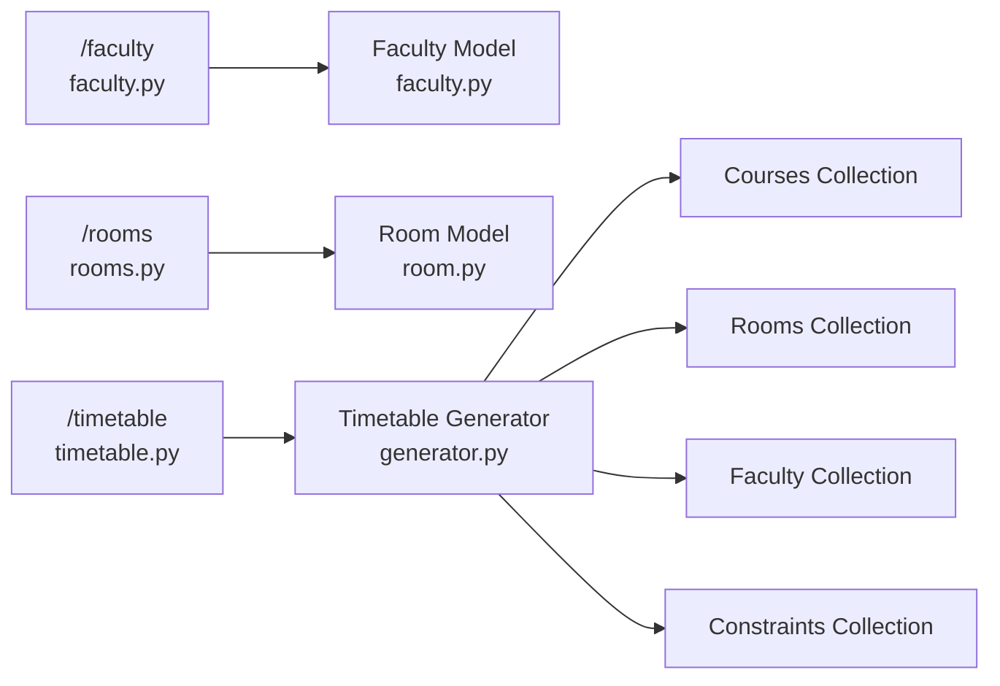

# Faculty and Room Management Endpoints

<cite>
**Referenced Files in This Document**
- [faculty.py](file://backend/app/api/v1/endpoints/faculty.py)
- [rooms.py](file://backend/app/api/v1/endpoints/rooms.py)
- [faculty.py](file://backend/app/models/faculty.py)
- [room.py](file://backend/app/models/room.py)
- [api.py](file://backend/app/api/api_v1/api.py)
- [mongodb.py](file://backend/app/db/mongodb.py)
- [timetable.py](file://backend/app/models/timetable.py)
- [generator.py](file://backend/app/services/timetable/generator.py)
- [constraints.py](file://backend/app/api/v1/endpoints/constraints.py)
- [courses.py](file://backend/app/api/v1/endpoints/courses.py)
- [course.py](file://backend/app/models/course.py)
</cite>

## Table of Contents
1. [Introduction](#introduction)
2. [Project Structure](#project-structure)
3. [Core Components](#core-components)
4. [Architecture Overview](#architecture-overview)
5. [Detailed Component Analysis](#detailed-component-analysis)
6. [Dependency Analysis](#dependency-analysis)
7. [Performance Considerations](#performance-considerations)
8. [Troubleshooting Guide](#troubleshooting-guide)
9. [Conclusion](#conclusion)

## Introduction
This document provides comprehensive API documentation for faculty and room management endpoints. It covers:
- HTTP methods and request/response schemas for /faculty and /rooms
- Faculty availability tracking and workload management
- Room booking/reservation systems and capacity constraints
- Integration with course scheduling and timetable generation
- Examples of conflict resolution, utilization optimization, and capacity planning
- Faculty preferences handling, room equipment management, and maintenance scheduling integration

## Project Structure
The relevant backend API endpoints and models are organized under:
- API routers: /faculty, /rooms, /courses, /timetable, /constraints
- Data models: Faculty, Room, Course, Timetable
- Database abstraction: MongoDB via Motor client
- Timetable generation: Rule-based and AI-driven generators

**Diagram sources**
- [api.py:26-28](file://backend/app/api/api_v1/api.py#L26-L28)
- [faculty.py:1-265](file://backend/app/api/v1/endpoints/faculty.py#L1-L265)
- [rooms.py:1-258](file://backend/app/api/v1/endpoints/rooms.py#L1-L258)
- [courses.py:1-279](file://backend/app/api/v1/endpoints/courses.py#L1-L279)
- [timetable.py:1-728](file://backend/app/api/v1/endpoints/timetable.py#L1-L728)
- [constraints.py:1-189](file://backend/app/api/v1/endpoints/constraints.py#L1-L189)
- [faculty.py:1-39](file://backend/app/models/faculty.py#L1-L39)
- [room.py:1-43](file://backend/app/models/room.py#L1-L43)
- [course.py:1-43](file://backend/app/models/course.py#L1-L43)
- [timetable.py:1-52](file://backend/app/models/timetable.py#L1-L52)
- [mongodb.py:1-41](file://backend/app/db/mongodb.py#L1-L41)

**Section sources**
- [api.py:26-28](file://backend/app/api/api_v1/api.py#L26-L28)

## Core Components
- Faculty endpoint router (/faculty): CRUD operations for faculty records with user isolation and duplicate checks
- Room endpoint router (/rooms): CRUD operations for rooms with filters, duplicates, and soft deletion
- Models: Typed Pydantic models define schemas for creation, updates, and database representation
- Database: MongoDB connection and collection access
- Timetable integration: Faculty and rooms are used during timetable generation and validation

Key capabilities:
- Faculty workload management via max hours per week and availability days
- Room capacity constraints and equipment matching (projector, AC, accessibility)
- Conflict detection during timetable generation using occupancy calendars
- Constraint-based scheduling with configurable rules

**Section sources**
- [faculty.py:13-265](file://backend/app/api/v1/endpoints/faculty.py#L13-L265)
- [rooms.py:12-258](file://backend/app/api/v1/endpoints/rooms.py#L12-L258)
- [faculty.py:5-39](file://backend/app/models/faculty.py#L5-L39)
- [room.py:6-43](file://backend/app/models/room.py#L6-L43)
- [mongodb.py:11-41](file://backend/app/db/mongodb.py#L11-L41)

## Architecture Overview
The API follows a layered architecture:
- Routers handle HTTP requests and responses
- Services orchestrate business logic (e.g., timetable generation)
- Models validate and serialize data
- Database layer abstracts MongoDB operations

**Diagram sources**
- [faculty.py:13-265](file://backend/app/api/v1/endpoints/faculty.py#L13-L265)
- [rooms.py:12-258](file://backend/app/api/v1/endpoints/rooms.py#L12-L258)
- [faculty.py:5-39](file://backend/app/models/faculty.py#L5-L39)
- [room.py:6-43](file://backend/app/models/room.py#L6-L43)
- [mongodb.py:11-41](file://backend/app/db/mongodb.py#L11-L41)

## Detailed Component Analysis

### Faculty Management Endpoints
- Base path: /faculty
- Methods:
  - GET /faculty: List all faculty (no user isolation in current implementation)
  - POST /faculty: Create a new faculty member
  - GET /faculty/{faculty_id}: Retrieve a specific faculty member
  - PUT /faculty/{faculty_id}: Update a faculty member
  - DELETE /faculty/{faculty_id}: Delete a faculty member

Request/response schemas:
- Request: FacultyCreate (fields include name, employee_id, department, designation, email, subjects, max_hours_per_week, available_days)
- Response: Faculty (includes id, created_by, created_at, updated_at)

Processing logic highlights:
- Duplicate employee_id check on create/update
- ObjectId validation for faculty_id
- Automatic timestamps on create/update
- User isolation enforced on read/update/delete via created_by matching

**Diagram sources**
- [faculty.py:43-98](file://backend/app/api/v1/endpoints/faculty.py#L43-L98)
- [faculty.py:155-213](file://backend/app/api/v1/endpoints/faculty.py#L155-L213)

**Section sources**
- [faculty.py:13-265](file://backend/app/api/v1/endpoints/faculty.py#L13-L265)
- [faculty.py:5-39](file://backend/app/models/faculty.py#L5-L39)

### Room Management Endpoints
- Base path: /rooms
- Methods:
  - GET /rooms: List rooms with optional filters (building, room_type, min_capacity)
  - POST /rooms: Create a new room
  - PUT /rooms/{room_id}: Update a room
  - DELETE /rooms/{room_id}: Soft delete a room

Request/response schemas:
- Request: RoomCreate (name, building, floor, capacity, room_type, facilities, flags for lab/accessibility/equipment, location_notes, is_active)
- Response: Room (includes id, created_by, created_at, updated_at)

Processing logic highlights:
- Duplicate room name per building check on create/update
- ObjectId validation for room_id
- Soft deletion sets is_active to False
- Filters support regex-based building/room_type matching

**Diagram sources**
- [rooms.py:58-115](file://backend/app/api/v1/endpoints/rooms.py#L58-L115)
- [rooms.py:118-206](file://backend/app/api/v1/endpoints/rooms.py#L118-L206)

**Section sources**
- [rooms.py:12-258](file://backend/app/api/v1/endpoints/rooms.py#L12-L258)
- [room.py:6-43](file://backend/app/models/room.py#L6-L43)

### Timetable Integration and Scheduling Constraints
- Faculty and rooms are consumed by timetable generation services
- Occupancy calendars track room, group, and faculty availability
- Constraints define rules for scheduling (workload, capacity, time windows, NEP compliance)

**Diagram sources**
- [generator.py:235-401](file://backend/app/services/timetable/generator.py#L235-L401)
- [constraints.py:115-149](file://backend/app/api/v1/endpoints/constraints.py#L115-L149)

**Section sources**
- [generator.py:169-233](file://backend/app/services/timetable/generator.py#L169-L233)
- [generator.py:247-379](file://backend/app/services/timetable/generator.py#L247-L379)
- [constraints.py:11-32](file://backend/app/api/v1/endpoints/constraints.py#L11-L32)

### Course and Program Context
- Courses define workload (hours per week, lab hours) and prerequisites
- Programs and semesters drive timetable scope
- These inform faculty-room assignments during generation

**Section sources**
- [courses.py:12-55](file://backend/app/api/v1/endpoints/courses.py#L12-L55)
- [course.py:6-43](file://backend/app/models/course.py#L6-L43)

## Dependency Analysis
- API routers depend on:
  - Authentication dependency for user isolation
  - MongoDB collections for persistence
  - Pydantic models for validation
- Timetable generator depends on:
  - Courses, rooms, faculty, constraints collections
  - Rule engine for slot generation and constraint enforcement

**Diagram sources**
- [faculty.py:13-265](file://backend/app/api/v1/endpoints/faculty.py#L13-L265)
- [rooms.py:12-258](file://backend/app/api/v1/endpoints/rooms.py#L12-L258)
- [timetable.py:1-728](file://backend/app/api/v1/endpoints/timetable.py#L1-L728)
- [generator.py:169-233](file://backend/app/services/timetable/generator.py#L169-L233)

**Section sources**
- [api.py:26-28](file://backend/app/api/api_v1/api.py#L26-L28)
- [mongodb.py:11-41](file://backend/app/db/mongodb.py#L11-L41)

## Performance Considerations
- Indexing recommendations:
  - Faculty: employee_id, created_by
  - Rooms: name, building, capacity, is_active
  - Courses: code, program_id, semester
  - Timetables: program_id, semester, academic_year, created_by
- Pagination and limits:
  - Use skip/limit for large datasets (as seen in timetable listing)
- Filtering:
  - Prefer exact matches for frequently filtered fields (e.g., is_active)
- Asynchronous queries:
  - Ensure database operations leverage async/await to minimize latency

[No sources needed since this section provides general guidance]

## Troubleshooting Guide
Common issues and resolutions:
- Duplicate employee_id or room name:
  - Ensure uniqueness constraints are respected before create/update
- Invalid ObjectId format:
  - Validate IDs before performing operations
- Permission errors:
  - Confirm user isolation checks (created_by) for read/update/delete
- Capacity mismatch:
  - Verify room capacity vs. group size and constraints
- Constraint validation failures:
  - Review active constraints for the program and adjust parameters

**Section sources**
- [faculty.py:52-62](file://backend/app/api/v1/endpoints/faculty.py#L52-L62)
- [rooms.py:67-77](file://backend/app/api/v1/endpoints/rooms.py#L67-L77)
- [constraints.py:151-189](file://backend/app/api/v1/endpoints/constraints.py#L151-L189)

## Conclusion
The faculty and room management endpoints provide robust CRUD operations with strong validation and user isolation. Integrated with timetable generation and constraints, they enable effective scheduling that respects faculty availability, workload limits, and room capacity/equipment requirements. By leveraging constraints and occupancy calendars, the system supports conflict resolution, utilization optimization, and capacity planning.