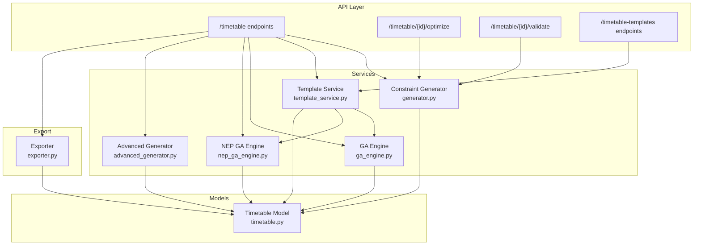
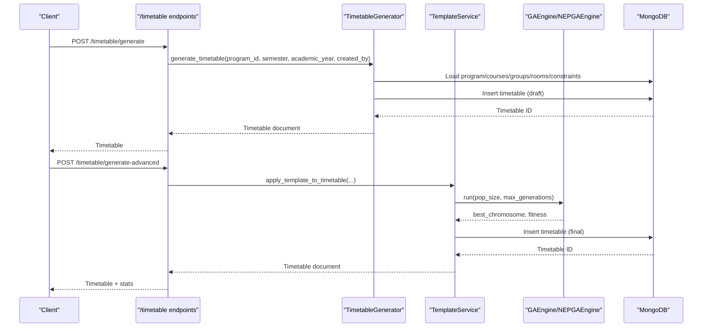
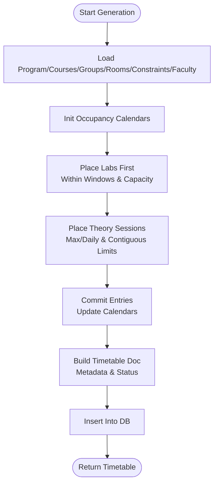
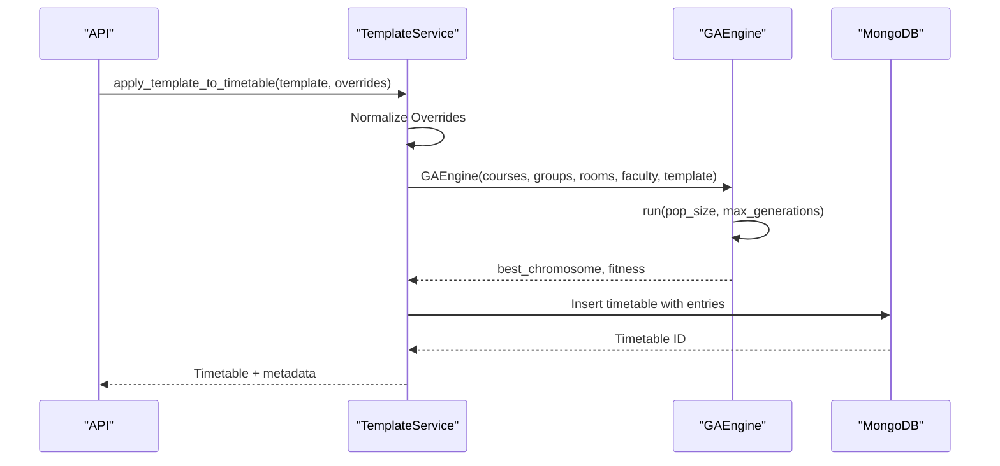
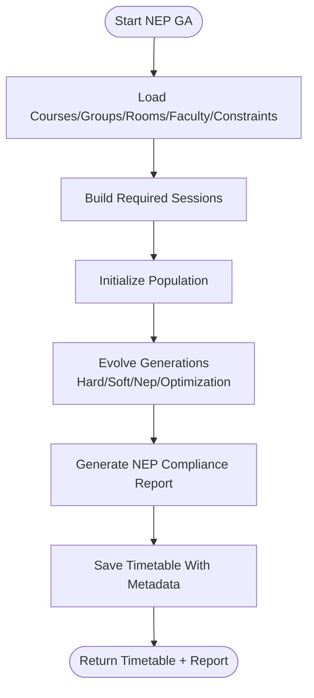
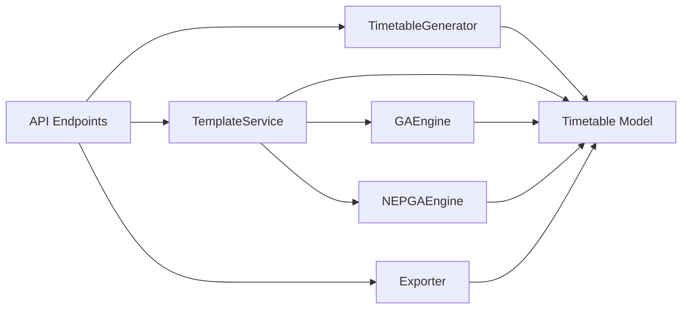

# Timetable Generation Endpoints

<cite>
**Referenced Files in This Document**
- [api.py](file://backend/app/api/api_v1/api.py)
- [timetable.py](file://backend/app/api/v1/endpoints/timetable.py)
- [timetable_templates.py](file://backend/app/api/v1/endpoints/timetable_templates.py)
- [generator.py](file://backend/app/services/timetable/generator.py)
- [template_service.py](file://backend/app/services/timetable/template_service.py)
- [ga_engine.py](file://backend/app/services/timetable/ga_engine.py)
- [nep_ga_engine.py](file://backend/app/services/timetable/nep_ga_engine.py)
- [advanced_generator.py](file://backend/app/services/timetable/advanced_generator.py)
- [exporter.py](file://backend/app/services/timetable/exporter.py)
- [timetable.py](file://backend/app/models/timetable.py)
</cite>

## Table of Contents
1. [Introduction](#introduction)
2. [Project Structure](#project-structure)
3. [Core Components](#core-components)
4. [Architecture Overview](#architecture-overview)
5. [Detailed Component Analysis](#detailed-component-analysis)
6. [Dependency Analysis](#dependency-analysis)
7. [Performance Considerations](#performance-considerations)
8. [Troubleshooting Guide](#troubleshooting-guide)
9. [Conclusion](#conclusion)

## Introduction
This document provides comprehensive API documentation for timetable generation and management endpoints. It covers constraint-based generation, template-based generation, NEP 2020-compliant optimization, timetable validation, conflict detection, and export capabilities. It also outlines request/response schemas, processing flows, and best practices for academic scheduling.

## Project Structure
The timetable system is organized around FastAPI routers and service-layer generators:
- API routers under `/timetable` and `/timetable-templates` expose CRUD, generation, validation, optimization, and export endpoints.
- Service layer implements three generation strategies:
  - Constraint-based generator for basic hard/soft rules.
  - Template-based genetic algorithm for structured scheduling.
  - NEP 2020-compliant genetic algorithm for policy-aligned schedules.
- Exporters support Excel, PDF, CSV, and JSON formats.

**Diagram sources**
- [api.py:1-34](file://backend/app/api/api_v1/api.py#L1-L34)
- [timetable.py:1-728](file://backend/app/api/v1/endpoints/timetable.py#L1-L728)
- [timetable_templates.py:1-106](file://backend/app/api/v1/endpoints/timetable_templates.py#L1-L106)
- [generator.py:1-402](file://backend/app/services/timetable/generator.py#L1-L402)
- [template_service.py:1-486](file://backend/app/services/timetable/template_service.py#L1-L486)
- [ga_engine.py:1-414](file://backend/app/services/timetable/ga_engine.py#L1-L414)
- [nep_ga_engine.py:1-794](file://backend/app/services/timetable/nep_ga_engine.py#L1-L794)
- [advanced_generator.py:1-707](file://backend/app/services/timetable/advanced_generator.py#L1-L707)
- [exporter.py:1-383](file://backend/app/services/timetable/exporter.py#L1-L383)
- [timetable.py:1-52](file://backend/app/models/timetable.py#L1-L52)

**Section sources**
- [api.py:1-34](file://backend/app/api/api_v1/api.py#L1-L34)
- [timetable.py:1-728](file://backend/app/api/v1/endpoints/timetable.py#L1-L728)
- [timetable_templates.py:1-106](file://backend/app/api/v1/endpoints/timetable_templates.py#L1-L106)

## Core Components
- Timetable model defines the core structure for entries, time slots, and metadata.
- Constraint-based generator loads program/course/student-group/room/faculty data and applies hard/soft rules to produce a draft timetable.
- Template service normalizes overrides, fetches/creates templates, and runs GA to allocate entries.
- GA engine implements multi-objective fitness with hard/soft constraints and optimization objectives.
- NEP GA engine extends GA with NEP 2020 objectives and compliance scoring.
- Exporter supports Excel, PDF, CSV, and JSON exports with enriched metadata.

**Section sources**
- [timetable.py:1-52](file://backend/app/models/timetable.py#L1-L52)
- [generator.py:163-402](file://backend/app/services/timetable/generator.py#L163-L402)
- [template_service.py:209-414](file://backend/app/services/timetable/template_service.py#L209-L414)
- [ga_engine.py:19-414](file://backend/app/services/timetable/ga_engine.py#L19-L414)
- [nep_ga_engine.py:33-794](file://backend/app/services/timetable/nep_ga_engine.py#L33-L794)
- [exporter.py:16-383](file://backend/app/services/timetable/exporter.py#L16-L383)

## Architecture Overview
The API routes orchestrate service-layer generators and exporters. Security is enforced via user isolation on reads/writes/deletes. Validation and optimization endpoints leverage the constraint-based generator.

**Diagram sources**
- [timetable.py:234-376](file://backend/app/api/v1/endpoints/timetable.py#L234-L376)
- [generator.py:235-402](file://backend/app/services/timetable/generator.py#L235-L402)
- [template_service.py:209-414](file://backend/app/services/timetable/template_service.py#L209-L414)
- [ga_engine.py:125-165](file://backend/app/services/timetable/ga_engine.py#L125-L165)

## Detailed Component Analysis

### Timetable Endpoints
- GET /timetable: List timetables with optional filters (program_id, semester, academic_year, is_draft). Enforces user isolation via created_by.
- GET /timetable/{timetable_id}: Retrieve a specific timetable owned by the current user.
- POST /timetable: Create an empty timetable with provided metadata.
- POST /timetable/draft: Save/update a draft timetable with is_draft=true.
- POST /timetable/generate: AI-driven constraint-based generation for a program/semester/year.
- POST /timetable/generate-advanced: Template-based generation using GA; supports overrides for courses/groups/rooms/faculty.
- POST /timetable/generate-nep-ga: NEP 2020-compliant GA generation with compliance reporting.
- PUT /timetable/{timetable_id}: Update timetable metadata/entries for the owner.
- DELETE /timetable/{timetable_id}: Delete timetable owned by the user.
- GET /timetable/{timetable_id}/export/{format}: Export timetable to excel, pdf, json, csv (user isolation).
- POST /timetable/{timetable_id}/optimize: Re-optimize an existing timetable.
- POST /timetable/{timetable_id}/validate: Validate timetable against constraints.

Security highlights:
- Every read/write/delete operation filters by created_by to ensure user isolation.
- Demo mode allows unrestricted access for internal testing.

**Section sources**
- [timetable.py:17-728](file://backend/app/api/v1/endpoints/timetable.py#L17-L728)

### Timetable Templates Endpoints
- POST /timetable-templates/generate-from-template: Generate a timetable from a program/semester template; creates default template if none exists.

Request body:
- program_id: Program identifier
- semester: Integer semester
- academic_year: Academic year string
- title: Optional title (auto-generated if omitted)
- student_group_id: Optional specific student group

Response includes success flag, generated timetable, and template metadata.

**Section sources**
- [timetable_templates.py:10-106](file://backend/app/api/v1/endpoints/timetable_templates.py#L10-L106)

### Constraint-Based Generation
The constraint-based generator:
- Loads program, courses, student groups, rooms, constraints, and faculty.
- Builds occupancy calendars for rooms, groups, and faculty.
- Places labs first within allowed windows and capacities.
- Places theory sessions respecting max periods per day, contiguous limits, and projector requirements.
- Produces a draft timetable with metadata and validation status.

**Diagram sources**
- [generator.py:169-402](file://backend/app/services/timetable/generator.py#L169-L402)

**Section sources**
- [generator.py:163-402](file://backend/app/services/timetable/generator.py#L163-L402)

### Template-Based Generation with GA
Template service:
- Normalizes overrides for courses, student groups, rooms, and faculty.
- Retrieves or creates a template for the program/semester.
- Runs GA to allocate sessions to rooms/time slots while satisfying hard constraints and optimizing soft objectives.

GA engine:
- Chromosome encodes course allocations with day/slot/room.
- Fitness balances hard constraint violations, soft constraints (room capacity fit), and optimization (balanced workload).
- Uses tournament selection, crossover, and multiple mutation operators.

**Diagram sources**
- [template_service.py:209-414](file://backend/app/services/timetable/template_service.py#L209-L414)
- [ga_engine.py:125-165](file://backend/app/services/timetable/ga_engine.py#L125-L165)

**Section sources**
- [template_service.py:209-414](file://backend/app/services/timetable/template_service.py#L209-L414)
- [ga_engine.py:19-414](file://backend/app/services/timetable/ga_engine.py#L19-L414)

### NEP 2020 Compliant Generation
NEP GA engine:
- Extends GA with NEP-specific objectives: practical/theory ratio, faculty workload limits, daily load balance, and lab timing preferences.
- Evaluates compliance and returns a detailed report with recommendations.

**Diagram sources**
- [nep_ga_engine.py:259-318](file://backend/app/services/timetable/nep_ga_engine.py#L259-L318)

**Section sources**
- [nep_ga_engine.py:33-794](file://backend/app/services/timetable/nep_ga_engine.py#L33-L794)

### Validation and Conflict Detection
Validation checks:
- Hard constraints: No resource conflicts (room/faculty/group), capacity compliance, daily period limits.
- Soft constraints: Room capacity fit, lab room assignment.
- Optimization: Balanced workload across days.

Conflict detection:
- Overlap checks between time slots for rooms, faculty, and groups.
- Period continuity enforcement.

**Section sources**
- [generator.py:247-272](file://backend/app/services/timetable/generator.py#L247-L272)
- [ga_engine.py:214-282](file://backend/app/services/timetable/ga_engine.py#L214-L282)

### Export Formats and Sharing
Supported export formats:
- Excel: Detailed timetable with metadata and entries.
- PDF: Landscape-oriented printable timetable.
- CSV: Structured CSV for external tools.
- JSON: Full timetable data for integration.

Sharing mechanisms:
- Export endpoints return downloadable files or streaming responses.
- Timetable ownership is enforced via created_by filtering.

**Section sources**
- [exporter.py:22-383](file://backend/app/services/timetable/exporter.py#L22-L383)
- [timetable.py:623-687](file://backend/app/api/v1/endpoints/timetable.py#L623-L687)

### Request and Response Schemas

#### GET /timetable
- Query parameters:
  - skip: integer (default 0)
  - limit: integer (default 100, min 1, max 1000)
  - program_id: string (optional)
  - semester: integer (optional)
  - academic_year: string (optional)
  - is_draft: boolean (optional)
- Response: Array of timetable objects with converted ObjectIds to strings.

**Section sources**
- [timetable.py:17-71](file://backend/app/api/v1/endpoints/timetable.py#L17-L71)

#### GET /timetable/{timetable_id}
- Path parameter: timetable_id
- Response: Timetable object with converted ObjectIds to strings.

**Section sources**
- [timetable.py:73-114](file://backend/app/api/v1/endpoints/timetable.py#L73-L114)

#### POST /timetable
- Request body: TimetableCreate (title, program_id, semester, academic_year, metadata)
- Response: Timetable (with entries defaulted to empty array)

**Section sources**
- [timetable.py:116-145](file://backend/app/api/v1/endpoints/timetable.py#L116-L145)
- [timetable.py:30-36](file://backend/app/models/timetable.py#L30-L36)

#### POST /timetable/draft
- Request body: Partial timetable data including optional id for updates
- Response: Timetable (draft)

**Section sources**
- [timetable.py:147-232](file://backend/app/api/v1/endpoints/timetable.py#L147-L232)

#### POST /timetable/generate
- Query parameters:
  - program_id: string
  - semester: integer
  - academic_year: string
- Response: Timetable (draft)

**Section sources**
- [timetable.py:234-264](file://backend/app/api/v1/endpoints/timetable.py#L234-L264)

#### POST /timetable/generate-advanced
- Request body:
  - program_id: string
  - semester: integer
  - academic_year: string
  - title: string (optional)
  - student_group_id: string (optional)
  - rule_id: string (optional)
  - courses: array (optional)
  - student_groups: array (optional)
  - rooms: array (optional)
  - faculty: array (optional)
- Response:
  - success: boolean
  - message: string
  - timetable: Timetable
  - generation_details: object with statistics and validation
  - template_used: object with id, name, is_default

**Section sources**
- [timetable.py:266-376](file://backend/app/api/v1/endpoints/timetable.py#L266-L376)
- [template_service.py:209-414](file://backend/app/services/timetable/template_service.py#L209-L414)

#### POST /timetable/generate-nep-ga
- Request body:
  - program_id: string
  - semester: integer
  - academic_year: string
  - title: string (optional)
  - nep_preferences: object (optional)
  - population_size: integer (optional)
  - max_generations: integer (optional)
- Response:
  - success: boolean
  - message: string
  - timetable: object with id, title, entries, optimization_score, nep_compliance
  - generation_details: object with method, fitness_score, generations, nep_compliance_score, statistics

**Section sources**
- [timetable.py:377-537](file://backend/app/api/v1/endpoints/timetable.py#L377-L537)
- [nep_ga_engine.py:444-531](file://backend/app/services/timetable/nep_ga_engine.py#L444-L531)

#### PUT /timetable/{timetable_id}
- Path parameter: timetable_id
- Request body: TimetableUpdate (partial fields)
- Response: Timetable

**Section sources**
- [timetable.py:539-589](file://backend/app/api/v1/endpoints/timetable.py#L539-L589)

#### DELETE /timetable/{timetable_id}
- Path parameter: timetable_id
- Response: Success message

**Section sources**
- [timetable.py:591-621](file://backend/app/api/v1/endpoints/timetable.py#L591-L621)

#### GET /timetable/{timetable_id}/export/{format}
- Path parameters: timetable_id, format (excel, pdf, json, csv)
- Response: File download or streaming response depending on format

**Section sources**
- [timetable.py:623-687](file://backend/app/api/v1/endpoints/timetable.py#L623-L687)
- [exporter.py:22-383](file://backend/app/services/timetable/exporter.py#L22-L383)

#### POST /timetable/{timetable_id}/optimize
- Path parameter: timetable_id
- Response: Optimized timetable

**Section sources**
- [timetable.py:689-707](file://backend/app/api/v1/endpoints/timetable.py#L689-L707)

#### POST /timetable/{timetable_id}/validate
- Path parameter: timetable_id
- Response: Validation result object

**Section sources**
- [timetable.py:709-727](file://backend/app/api/v1/endpoints/timetable.py#L709-L727)

## Dependency Analysis
- API endpoints depend on service-layer generators and exporters.
- Template service depends on GA engines and MongoDB collections.
- Constraint-based generator depends on MongoDB collections and constructs entries conforming to the Timetable model.
- Exporter depends on MongoDB to enrich entries with course, faculty, and room details.

**Diagram sources**
- [timetable.py:1-728](file://backend/app/api/v1/endpoints/timetable.py#L1-L728)
- [template_service.py:1-486](file://backend/app/services/timetable/template_service.py#L1-L486)
- [ga_engine.py:1-414](file://backend/app/services/timetable/ga_engine.py#L1-L414)
- [nep_ga_engine.py:1-794](file://backend/app/services/timetable/nep_ga_engine.py#L1-L794)
- [exporter.py:1-383](file://backend/app/services/timetable/exporter.py#L1-L383)
- [timetable.py:1-52](file://backend/app/models/timetable.py#L1-L52)

**Section sources**
- [timetable.py:1-728](file://backend/app/api/v1/endpoints/timetable.py#L1-L728)
- [template_service.py:1-486](file://backend/app/services/timetable/template_service.py#L1-L486)
- [ga_engine.py:1-414](file://backend/app/services/timetable/ga_engine.py#L1-L414)
- [nep_ga_engine.py:1-794](file://backend/app/services/timetable/nep_ga_engine.py#L1-L794)
- [exporter.py:1-383](file://backend/app/services/timetable/exporter.py#L1-L383)
- [timetable.py:1-52](file://backend/app/models/timetable.py#L1-L52)

## Performance Considerations
- GA parameters (population size, max generations) influence runtime and quality; tune based on dataset scale.
- Export operations fetch related documents; consider pagination and caching for large timetables.
- Constraint-based generation uses occupancy calendars; ensure efficient slot overlap checks.
- NEP GA adds compliance scoring overhead; adjust thresholds and weights for acceptable latency.

## Troubleshooting Guide
Common issues and resolutions:
- Timetable not found: Verify timetable_id ownership and existence; ensure created_by matches current user.
- Export failures: Confirm timetable exists and format is supported; check server logs for exceptions.
- Generation failures: Validate program_id/semester/academic_year; ensure required collections (courses, rooms, faculty) are populated.
- Constraint violations: Review hard constraints (conflicts, capacity) and soft constraints (preferences) in validation output.

**Section sources**
- [timetable.py:73-114](file://backend/app/api/v1/endpoints/timetable.py#L73-L114)
- [timetable.py:623-687](file://backend/app/api/v1/endpoints/timetable.py#L623-L687)
- [exporter.py:22-41](file://backend/app/services/timetable/exporter.py#L22-L41)

## Conclusion
The timetable system provides robust APIs for constraint-based and template-based generation, NEP 2020 compliance, validation, optimization, and export. Security is enforced via user isolation, and the modular design enables extensibility for additional constraints and scheduling policies.