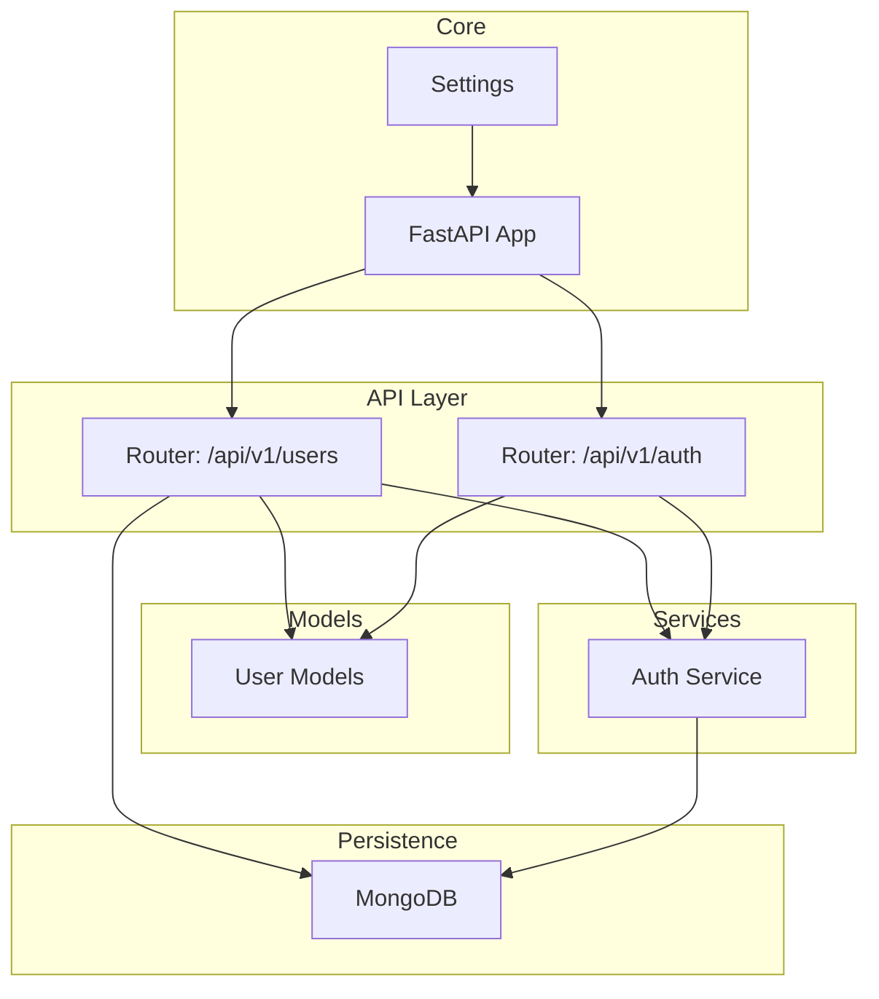
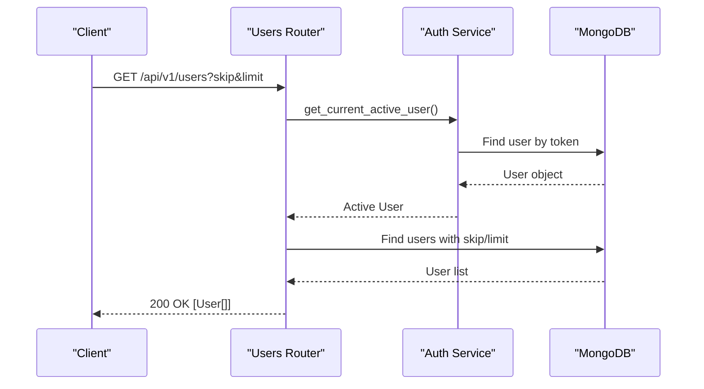
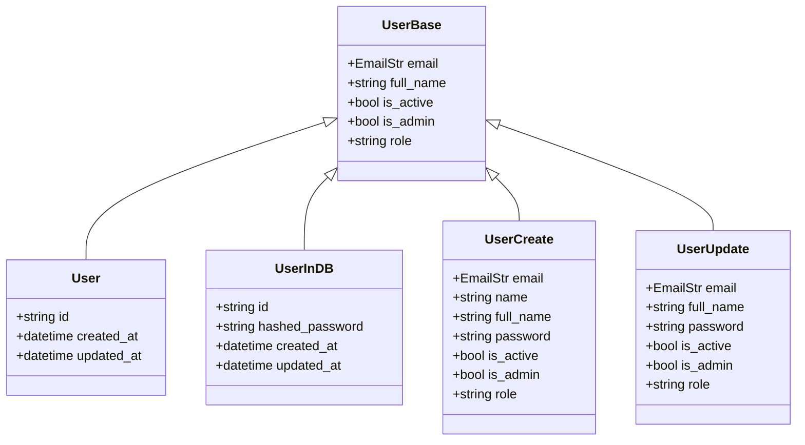
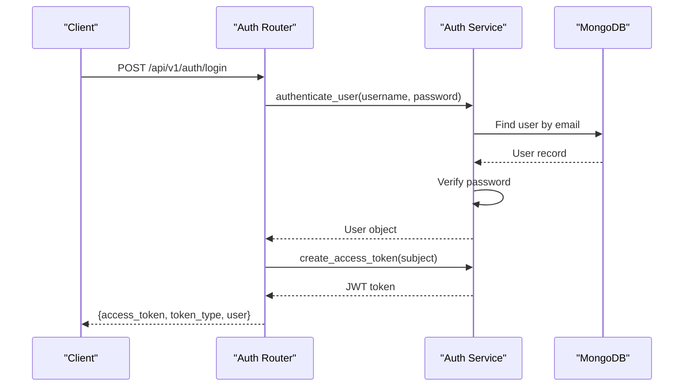
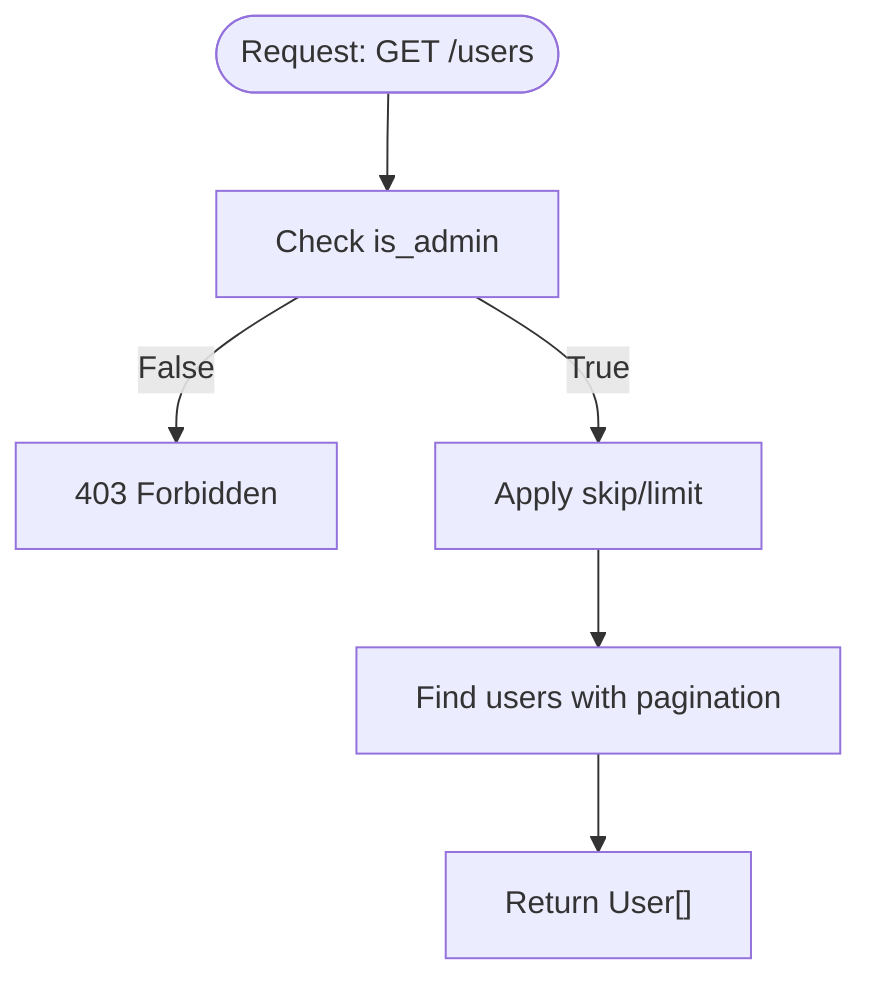
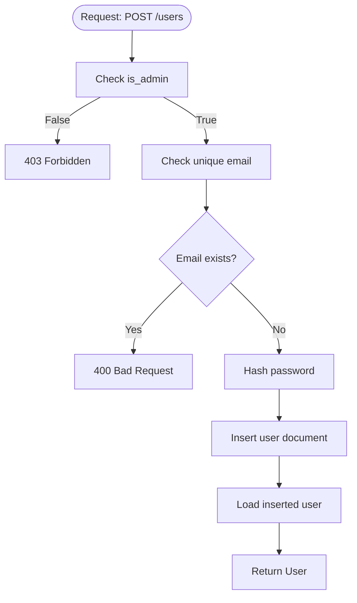
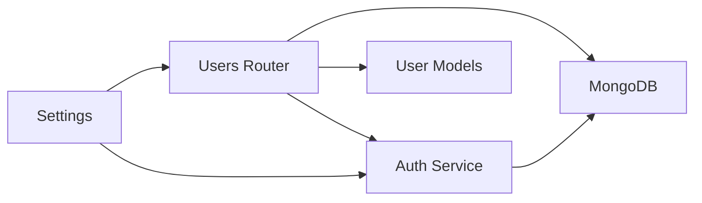

# User Management Endpoints

<cite>
**Referenced Files in This Document**
- [users.py](file://backend/app/api/v1/endpoints/users.py)
- [user.py](file://backend/app/models/user.py)
- [auth.py](file://backend/app/api/v1/endpoints/auth.py)
- [api.py](file://backend/app/api/api_v1/api.py)
- [main.py](file://backend/app/main.py)
- [mongodb.py](file://backend/app/db/mongodb.py)
- [config.py](file://backend/app/core/config.py)
- [__init__.py](file://backend/app/services/auth/__init__.py)
</cite>

## Table of Contents
1. [Introduction](#introduction)
2. [Project Structure](#project-structure)
3. [Core Components](#core-components)
4. [Architecture Overview](#architecture-overview)
5. [Detailed Component Analysis](#detailed-component-analysis)
6. [Dependency Analysis](#dependency-analysis)
7. [Performance Considerations](#performance-considerations)
8. [Troubleshooting Guide](#troubleshooting-guide)
9. [Conclusion](#conclusion)
10. [Appendices](#appendices)

## Introduction
This document provides comprehensive API documentation for user management endpoints. It covers CRUD operations for user profiles, role assignment, permission management, and administrative user operations. The documentation includes HTTP methods, request/response schemas, filtering/sorting/pagination parameters, examples, and operational considerations such as data protection and audit logging.

## Project Structure
The user management API is implemented under the versioned API router and integrates with authentication, database, and configuration modules.

**Diagram sources**
- [api.py:22-34](file://backend/app/api/api_v1/api.py#L22-L34)
- [users.py:1-123](file://backend/app/api/v1/endpoints/users.py#L1-L123)
- [auth.py:1-123](file://backend/app/api/v1/endpoints/auth.py#L1-L123)
- [user.py:1-76](file://backend/app/models/user.py#L1-L76)
- [mongodb.py:1-41](file://backend/app/db/mongodb.py#L1-L41)
- [config.py:1-61](file://backend/app/core/config.py#L1-L61)
- [main.py:101](file://backend/app/main.py#L101)

**Section sources**
- [api.py:22-34](file://backend/app/api/api_v1/api.py#L22-L34)
- [main.py:101](file://backend/app/main.py#L101)

## Core Components
- User endpoints router mounted under /api/v1/users
- Authentication and authorization via JWT bearer tokens
- MongoDB-backed persistence with ObjectId handling
- Pydantic models for request/response schemas and validation

Key capabilities:
- Retrieve all users with pagination
- Retrieve current user profile
- Retrieve a specific user by ID
- Create a new user (admin-only)
- Update a user (self or admin)
- Delete a user (admin-only)

**Section sources**
- [users.py:11-123](file://backend/app/api/v1/endpoints/users.py#L11-L123)
- [user.py:27-76](file://backend/app/models/user.py#L27-L76)
- [auth.py:29-123](file://backend/app/api/v1/endpoints/auth.py#L29-L123)
- [mongodb.py:11-41](file://backend/app/db/mongodb.py#L11-L41)

## Architecture Overview
The user management flow integrates FastAPI routing, authentication, and database operations.

**Diagram sources**
- [users.py:11-25](file://backend/app/api/v1/endpoints/users.py#L11-L25)
- [__init__.py:91-144](file://backend/app/services/auth/__init__.py#L91-L144)
- [mongodb.py:11-41](file://backend/app/db/mongodb.py#L11-L41)

## Detailed Component Analysis

### Endpoint Catalog
- GET /api/v1/users
  - Description: List users with pagination
  - Auth: Required
  - Permissions: Admin only
  - Query params: skip (>=0), limit (1-1000)
  - Response: Array of User objects
- GET /api/v1/users/me
  - Description: Get current user profile
  - Auth: Required
  - Response: User object
- GET /api/v1/users/{user_id}
  - Description: Get a specific user by ID
  - Auth: Required
  - Permissions: Owner or Admin
  - Response: User object
- POST /api/v1/users
  - Description: Create a new user
  - Auth: Required
  - Permissions: Admin only
  - Request: UserCreate
  - Response: User object
- PUT /api/v1/users/{user_id}
  - Description: Update a user
  - Auth: Required
  - Permissions: Owner or Admin
  - Request: UserUpdate
  - Response: User object
- DELETE /api/v1/users/{user_id}
  - Description: Delete a user
  - Auth: Required
  - Permissions: Admin only
  - Response: Deletion confirmation

Notes:
- Filtering, sorting, and pagination are supported via skip/limit query parameters.
- Role-based access control is enforced per endpoint.
- Bulk operations are not implemented; use repeated individual operations.

**Section sources**
- [users.py:11-123](file://backend/app/api/v1/endpoints/users.py#L11-L123)

### Request and Response Schemas
User models define the shape of requests and responses.

Validation highlights:
- Either name or full_name must be provided during creation; full_name is validated accordingly.
- Password hashing is handled by the authentication service during registration.
- ObjectId conversion is performed for JSON serialization.

**Diagram sources**
- [user.py:27-76](file://backend/app/models/user.py#L27-L76)

**Section sources**
- [user.py:27-76](file://backend/app/models/user.py#L27-L76)

### Authentication and Authorization
- JWT bearer tokens are used for authentication.
- Access tokens are created with configurable expiration.
- Current user retrieval validates tokens and checks activity status.
- Admin-only endpoints enforce is_admin flag.
- Demo user support is included for development.

**Diagram sources**
- [auth.py:29-64](file://backend/app/api/v1/endpoints/auth.py#L29-L64)
- [__init__.py:62-88](file://backend/app/services/auth/__init__.py#L62-L88)
- [mongodb.py:11-41](file://backend/app/db/mongodb.py#L11-L41)

**Section sources**
- [auth.py:29-123](file://backend/app/api/v1/endpoints/auth.py#L29-L123)
- [__init__.py:91-156](file://backend/app/services/auth/__init__.py#L91-L156)

### Data Persistence and Connection
- MongoDB connection is established at startup and closed on shutdown.
- ObjectId is converted to string for JSON responses.
- Database operations use Motor async client.

Operational notes:
- Connection failures are logged and do not prevent API startup.
- ObjectId handling ensures consistent serialization.

**Section sources**
- [mongodb.py:11-41](file://backend/app/db/mongodb.py#L11-L41)
- [user.py:11-20](file://backend/app/models/user.py#L11-L20)

### Endpoint Implementation Details

#### GET /api/v1/users
- Pagination parameters:
  - skip: integer >= 0
  - limit: integer between 1 and 1000
- Access control: Admin required
- Response: Array of User objects

**Diagram sources**
- [users.py:11-25](file://backend/app/api/v1/endpoints/users.py#L11-L25)

**Section sources**
- [users.py:11-25](file://backend/app/api/v1/endpoints/users.py#L11-L25)

#### GET /api/v1/users/me
- Access control: Authenticated user required
- Response: User object for current session

**Section sources**
- [users.py:27-34](file://backend/app/api/v1/endpoints/users.py#L27-L34)

#### GET /api/v1/users/{user_id}
- Access control: Owner or Admin
- Validation: User exists by ObjectId
- Response: User object

**Section sources**
- [users.py:36-50](file://backend/app/api/v1/endpoints/users.py#L36-L50)

#### POST /api/v1/users
- Access control: Admin required
- Validation: Unique email
- Behavior: Password stored as hashed value via authentication service
- Response: Created User object

**Diagram sources**
- [users.py:52-75](file://backend/app/api/v1/endpoints/users.py#L52-L75)
- [__init__.py:159-189](file://backend/app/services/auth/__init__.py#L159-L189)

**Section sources**
- [users.py:52-75](file://backend/app/api/v1/endpoints/users.py#L52-L75)
- [__init__.py:159-189](file://backend/app/services/auth/__init__.py#L159-L189)

#### PUT /api/v1/users/{user_id}
- Access control: Owner or Admin
- Validation: User exists by ObjectId
- Behavior: Partial updates for provided fields
- Response: Updated User object

**Section sources**
- [users.py:77-101](file://backend/app/api/v1/endpoints/users.py#L77-L101)

#### DELETE /api/v1/users/{user_id}
- Access control: Admin required
- Validation: User exists by ObjectId
- Behavior: Deletes user document
- Response: Success message

**Section sources**
- [users.py:103-122](file://backend/app/api/v1/endpoints/users.py#L103-L122)

### Examples

#### Example: Create a User
- Endpoint: POST /api/v1/users
- Authentication: Bearer token (Admin)
- Request body (schema): UserCreate
  - email: string (required)
  - full_name: string (required; or name)
  - password: string (required)
  - is_active: boolean (default true)
  - is_admin: boolean (default false)
  - role: string (default "user")
- Response: User object

Validation rules:
- Either name or full_name must be provided during creation.
- Email uniqueness is enforced.

**Section sources**
- [users.py:52-75](file://backend/app/api/v1/endpoints/users.py#L52-L75)
- [user.py:39-56](file://backend/app/models/user.py#L39-L56)

#### Example: Update a User
- Endpoint: PUT /api/v1/users/{user_id}
- Authentication: Bearer token (Owner or Admin)
- Request body (schema): UserUpdate
  - email: optional
  - full_name: optional
  - password: optional
  - is_active: optional
  - is_admin: optional
  - role: optional
- Response: Updated User object

Behavior:
- Only provided fields are updated.
- Self-update allowed; Admin can update any user.

**Section sources**
- [users.py:77-101](file://backend/app/api/v1/endpoints/users.py#L77-L101)
- [user.py:58-65](file://backend/app/models/user.py#L58-L65)

#### Example: List Users with Pagination
- Endpoint: GET /api/v1/users
- Authentication: Bearer token (Admin)
- Query parameters:
  - skip: integer >= 0
  - limit: integer between 1 and 1000
- Response: Array of User objects

**Section sources**
- [users.py:11-25](file://backend/app/api/v1/endpoints/users.py#L11-L25)

#### Example: Role Updates
- Role assignment is part of UserCreate/UserUpdate.
- Admin-only endpoint POST /api/v1/users sets is_admin and role.
- PUT /api/v1/users/{user_id} allows role updates for Admin.

Note: There is no dedicated role assignment endpoint; role changes occur via create/update operations.

**Section sources**
- [users.py:52-75](file://backend/app/api/v1/endpoints/users.py#L52-L75)
- [users.py:77-101](file://backend/app/api/v1/endpoints/users.py#L77-L101)

#### Example: Bulk Operations
- Not implemented.
- Recommendation: Use repeated individual operations or implement batch endpoints in future iterations.

**Section sources**
- [users.py:11-123](file://backend/app/api/v1/endpoints/users.py#L11-L123)

## Dependency Analysis
The user management module depends on:
- Authentication service for token validation and user retrieval
- MongoDB for persistence
- Pydantic models for request/response validation
- Configuration for API base path and security settings

**Diagram sources**
- [users.py:1-9](file://backend/app/api/v1/endpoints/users.py#L1-L9)
- [auth.py:1-14](file://backend/app/api/v1/endpoints/auth.py#L1-L14)
- [user.py:1-76](file://backend/app/models/user.py#L1-L76)
- [mongodb.py:1-41](file://backend/app/db/mongodb.py#L1-L41)
- [config.py:10-32](file://backend/app/core/config.py#L10-L32)

**Section sources**
- [users.py:1-9](file://backend/app/api/v1/endpoints/users.py#L1-L9)
- [auth.py:1-14](file://backend/app/api/v1/endpoints/auth.py#L1-L14)
- [user.py:1-76](file://backend/app/models/user.py#L1-L76)
- [mongodb.py:1-41](file://backend/app/db/mongodb.py#L1-L41)
- [config.py:10-32](file://backend/app/core/config.py#L10-L32)

## Performance Considerations
- Pagination limits: limit is constrained between 1 and 1000 to avoid heavy queries.
- Asynchronous MongoDB operations: Motor client supports non-blocking IO.
- Token verification overhead: JWT decoding occurs on each protected endpoint call.
- Recommendations:
  - Add database indexes for email lookups and user ID queries.
  - Consider cursor-based pagination for very large datasets.
  - Cache frequently accessed user metadata where appropriate.

[No sources needed since this section provides general guidance]

## Troubleshooting Guide
Common issues and resolutions:
- 401 Unauthorized: Ensure a valid Bearer token is provided.
- 403 Forbidden: Confirm the user has sufficient permissions (Admin for create/delete/update).
- 404 Not Found: The requested user ID does not exist.
- 400 Bad Request: Validation errors or duplicate email during creation.
- 422 Unprocessable Entity: Request body validation failure.

Operational checks:
- Health endpoint: GET /health
- CORS configuration: Verify allowed origins in settings.
- Database connectivity: Check MongoDB connection logs.

**Section sources**
- [users.py:21-22](file://backend/app/api/v1/endpoints/users.py#L21-L22)
- [users.py:44-45](file://backend/app/api/v1/endpoints/users.py#L44-L45)
- [users.py:66-67](file://backend/app/api/v1/endpoints/users.py#L66-L67)
- [users.py:92-93](file://backend/app/api/v1/endpoints/users.py#L92-L93)
- [main.py:42-54](file://backend/app/main.py#L42-L54)

## Conclusion
The user management API provides a secure, role-aware CRUD interface for user profiles with robust authentication, validation, and pagination. Administrators can manage users comprehensively, while regular users can update their own profiles. Future enhancements could include dedicated role assignment endpoints, bulk operations, and expanded filtering/sorting capabilities.

[No sources needed since this section summarizes without analyzing specific files]

## Appendices

### API Definitions

- Base URL: /api/v1
- Authentication: Bearer token (JWT)
- Content-Type: application/json

Endpoints:
- GET /users
  - Query: skip (integer, >=0), limit (integer, 1-1000)
  - Response: 200 [User[]]
- GET /users/me
  - Response: 200 User
- GET /users/{user_id}
  - Response: 200 User, 404 if not found
- POST /users
  - Body: UserCreate
  - Response: 201 User, 400 on duplicate email
- PUT /users/{user_id}
  - Body: UserUpdate
  - Response: 200 User, 404 if not found
- DELETE /users/{user_id}
  - Response: 200 { message }, 404 if not found

Security and Compliance:
- Password hashing is handled by the authentication service.
- ObjectId serialization is managed in models.
- Audit logging is not implemented in the current codebase; consider adding request/response logging for sensitive operations.

**Section sources**
- [users.py:11-123](file://backend/app/api/v1/endpoints/users.py#L11-L123)
- [user.py:11-20](file://backend/app/models/user.py#L11-L20)
- [auth.py:159-189](file://backend/app/services/auth/__init__.py#L159-L189)