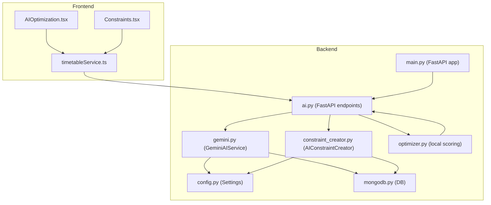
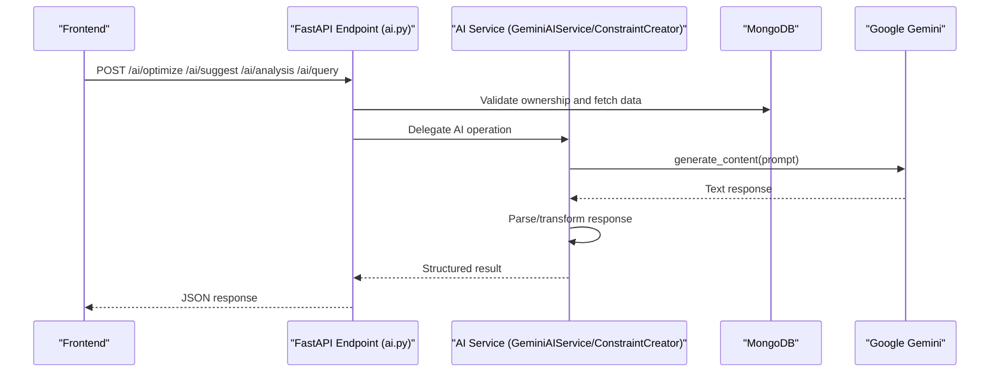
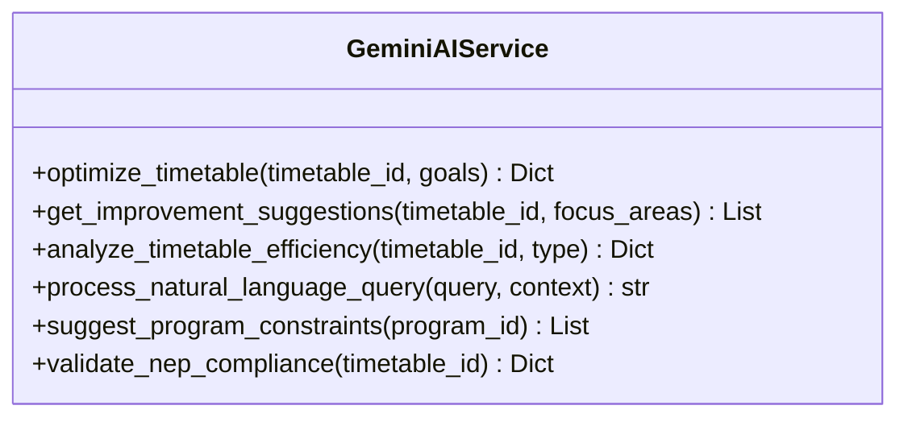
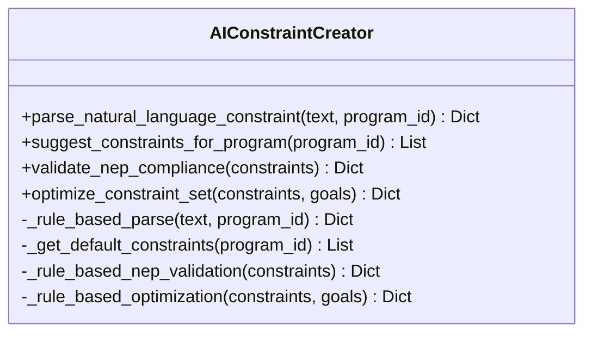
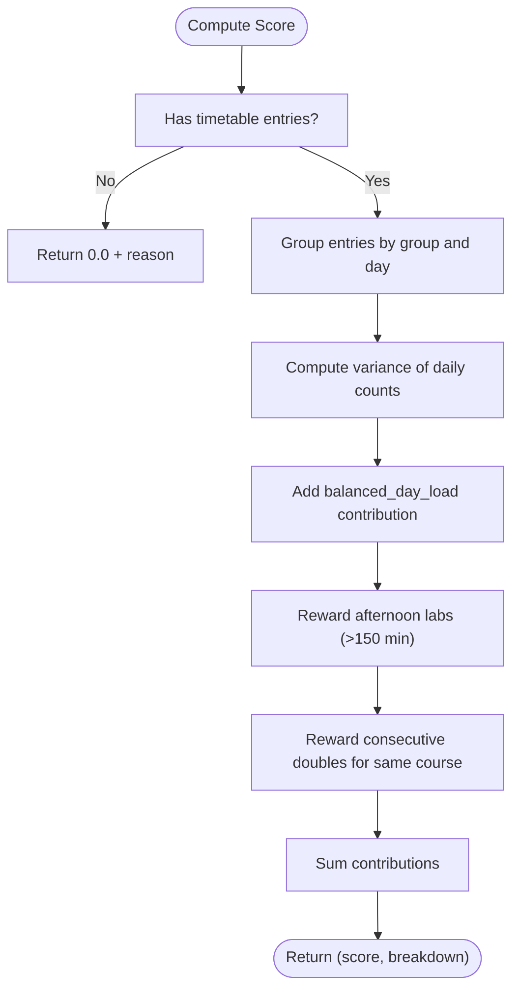
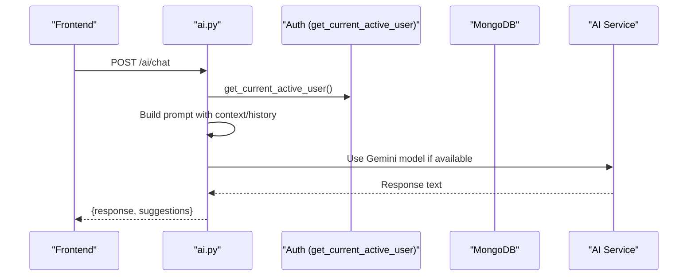
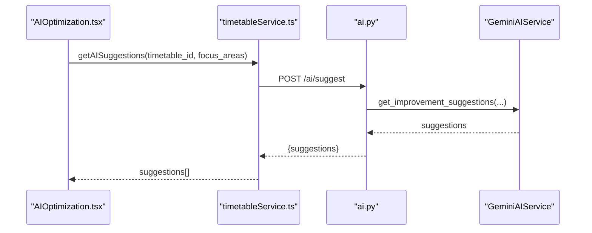
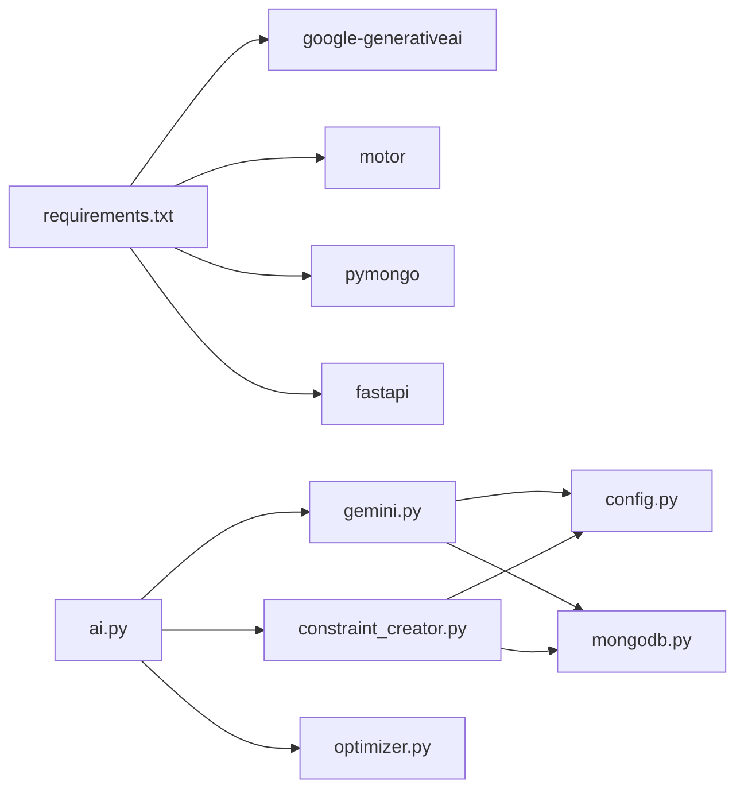
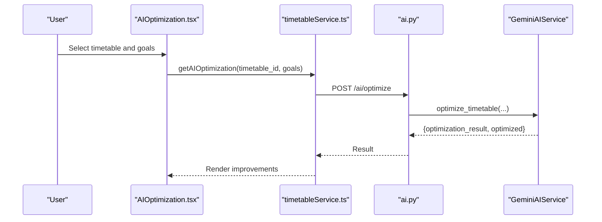
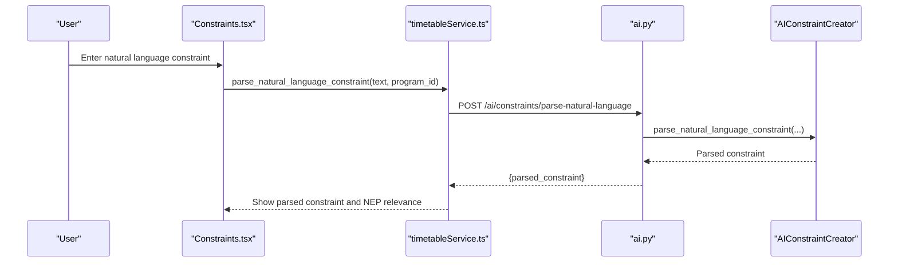

# AI Integration

<cite>
**Referenced Files in This Document**
- [ai.py](file://backend/app/api/v1/endpoints/ai.py)
- [gemini.py](file://backend/app/services/ai/gemini.py)
- [constraint_creator.py](file://backend/app/services/ai/constraint_creator.py)
- [optimizer.py](file://backend/app/services/ai/optimizer.py)
- [config.py](file://backend/app/core/config.py)
- [mongodb.py](file://backend/app/db/mongodb.py)
- [main.py](file://backend/app/main.py)
- [requirements.txt](file://backend/requirements.txt)
- [AIOptimization.tsx](file://frontend/src/components/pages/AIOptimization.tsx)
- [Constraints.tsx](file://frontend/src/components/pages/Constraints.tsx)
- [timetableService.ts](file://frontend/src/services/timetableService.ts)
</cite>

## Table of Contents
1. [Introduction](#introduction)
2. [Project Structure](#project-structure)
3. [Core Components](#core-components)
4. [Architecture Overview](#architecture-overview)
5. [Detailed Component Analysis](#detailed-component-analysis)
6. [Dependency Analysis](#dependency-analysis)
7. [Performance Considerations](#performance-considerations)
8. [Troubleshooting Guide](#troubleshooting-guide)
9. [Conclusion](#conclusion)
10. [Appendices](#appendices)

## Introduction
This document explains the AI integration powering ShedMaster’s timetable generation system. It covers how the system leverages Google Gemini AI for:
- Natural language constraint parsing into structured data
- AI-assisted timetable optimization and suggestions
- NEP 2020 compliance validation and enhancement
- Frontend user workflows for AI-driven scheduling

It also documents fallback strategies, error handling, prompt engineering, response parsing, and guidance for extending the system to alternative AI providers.

## Project Structure
The AI integration spans backend services and frontend components:
- Backend FastAPI endpoints expose AI features under /api/v1/ai
- AI services encapsulate Gemini integration and rule-based fallbacks
- Frontend pages provide user interfaces for AI optimization, constraint parsing, and chat

**Diagram sources**
- [ai.py:1-362](file://backend/app/api/v1/endpoints/ai.py#L1-L362)
- [gemini.py:1-288](file://backend/app/services/ai/gemini.py#L1-L288)
- [constraint_creator.py:1-781](file://backend/app/services/ai/constraint_creator.py#L1-L781)
- [optimizer.py:1-59](file://backend/app/services/ai/optimizer.py#L1-L59)
- [config.py:1-61](file://backend/app/core/config.py#L1-L61)
- [mongodb.py:1-41](file://backend/app/db/mongodb.py#L1-L41)
- [main.py:1-102](file://backend/app/main.py#L1-L102)

**Section sources**
- [ai.py:1-362](file://backend/app/api/v1/endpoints/ai.py#L1-L362)
- [main.py:1-102](file://backend/app/main.py#L1-L102)

## Core Components
- GeminiAIService: Orchestrates AI-powered timetable analysis, suggestions, optimization, and NEP validation via Google Gemini.
- AIConstraintCreator: Parses natural language constraints into structured formats, validates NEP relevance, and optimizes constraint sets with AI fallbacks.
- Local Optimizer: Provides lightweight, deterministic scoring for timetable quality metrics.
- FastAPI Endpoints: Expose AI features with user ownership checks and robust error handling.
- Frontend Pages: Provide user workflows for AI optimization, constraint parsing, and chat assistance.

**Section sources**
- [gemini.py:1-288](file://backend/app/services/ai/gemini.py#L1-L288)
- [constraint_creator.py:1-781](file://backend/app/services/ai/constraint_creator.py#L1-L781)
- [optimizer.py:1-59](file://backend/app/services/ai/optimizer.py#L1-L59)
- [ai.py:1-362](file://backend/app/api/v1/endpoints/ai.py#L1-L362)

## Architecture Overview
The AI integration follows a layered architecture:
- Presentation Layer: Frontend pages and services
- API Layer: FastAPI endpoints enforcing access control and delegating to services
- AI Services Layer: GeminiAIService and AIConstraintCreator
- Data Access Layer: MongoDB integration for timetable and program data
- Configuration Layer: Settings for API keys and runtime behavior

**Diagram sources**
- [ai.py:46-135](file://backend/app/api/v1/endpoints/ai.py#L46-L135)
- [gemini.py:18-153](file://backend/app/services/ai/gemini.py#L18-L153)
- [constraint_creator.py:179-281](file://backend/app/services/ai/constraint_creator.py#L179-L281)

## Detailed Component Analysis

### GeminiAIService
Responsibilities:
- Timetable optimization requests
- Improvement suggestions with focus areas
- Efficiency analysis with configurable depth
- Natural language query processing
- Program constraint suggestions
- NEP 2020 compliance validation
- Fallback handling when API key is missing

Key behaviors:
- Initializes Gemini model only when GEMINI_API_KEY is configured
- Builds prompts tailored to each operation
- Returns structured results or error messages
- Integrates with MongoDB to fetch timetable and program data

**Diagram sources**
- [gemini.py:9-288](file://backend/app/services/ai/gemini.py#L9-L288)

**Section sources**
- [gemini.py:1-288](file://backend/app/services/ai/gemini.py#L1-L288)

### AIConstraintCreator
Responsibilities:
- Parse natural language constraints into structured objects
- Suggest program-specific constraints using AI with fallback defaults
- Validate NEP 2020 compliance for constraints
- Optimize constraint sets with AI and rule-based fallbacks

Key behaviors:
- Maintains NEP 2020 rule sets and constraint patterns
- Uses Gemini when configured; otherwise applies rule-based parsing
- Extracts JSON from Gemini responses and normalizes metadata
- Provides fallbacks for AI unavailability

**Diagram sources**
- [constraint_creator.py:18-781](file://backend/app/services/ai/constraint_creator.py#L18-L781)

**Section sources**
- [constraint_creator.py:1-781](file://backend/app/services/ai/constraint_creator.py#L1-L781)

### Local Optimizer
Responsibilities:
- Lightweight scoring for timetable quality
- Encourages balanced daily load, afternoon labs, and consecutive double blocks

Key behaviors:
- Aggregates entries by group and day
- Computes variance penalties and reward adjustments
- Returns total score and breakdown

**Diagram sources**
- [optimizer.py:6-59](file://backend/app/services/ai/optimizer.py#L6-L59)

**Section sources**
- [optimizer.py:1-59](file://backend/app/services/ai/optimizer.py#L1-L59)

### FastAPI Endpoints (AI)
Responsibilities:
- Enforce user ownership for timetable operations
- Route requests to appropriate AI services
- Handle exceptions and return standardized responses
- Support AI chat assistant with context and suggestions

Key behaviors:
- Ownership checks ensure users can only access their timetables
- Delegates to GeminiAIService or AIConstraintCreator
- Returns structured JSON responses for frontend consumption

**Diagram sources**
- [ai.py:267-362](file://backend/app/api/v1/endpoints/ai.py#L267-L362)

**Section sources**
- [ai.py:1-362](file://backend/app/api/v1/endpoints/ai.py#L1-L362)

### Frontend Integration
Responsibilities:
- Provide user interfaces for AI optimization, suggestions, analysis, and chat
- Call backend endpoints via timetableService
- Render AI responses and suggestions in organized layouts

Key behaviors:
- AIOptimization.tsx: Tabs for Optimize, Suggestions, Analysis, AI Chat, NEP Compliance
- Constraints.tsx: Natural language constraint parsing dialog with AI examples
- timetableService.ts: Typed API calls to /ai endpoints

**Diagram sources**
- [AIOptimization.tsx:591-631](file://frontend/src/components/pages/AIOptimization.tsx#L591-L631)
- [timetableService.ts:591-631](file://frontend/src/services/timetableService.ts#L591-L631)
- [ai.py:75-106](file://backend/app/api/v1/endpoints/ai.py#L75-L106)

**Section sources**
- [AIOptimization.tsx:1-1032](file://frontend/src/components/pages/AIOptimization.tsx#L1-L1032)
- [Constraints.tsx:1100-1299](file://frontend/src/components/pages/Constraints.tsx#L1100-L1299)
- [timetableService.ts:591-631](file://frontend/src/services/timetableService.ts#L591-L631)

## Dependency Analysis
External dependencies:
- google-generativeai: Gemini integration
- motor/pymongo: MongoDB connectivity
- pydantic/fastapi: API framework and validation
- bcrypt/passlib/pyjwt: Authentication and authorization

Internal dependencies:
- ai.py depends on GeminiAIService and AIConstraintCreator
- GeminiAIService depends on Settings and MongoDB
- AIConstraintCreator depends on Settings and MongoDB
- Frontend components depend on timetableService

**Diagram sources**
- [requirements.txt:1-19](file://backend/requirements.txt#L1-L19)
- [ai.py:1-12](file://backend/app/api/v1/endpoints/ai.py#L1-L12)
- [gemini.py:1-8](file://backend/app/services/ai/gemini.py#L1-L8)
- [constraint_creator.py:1-16](file://backend/app/services/ai/constraint_creator.py#L1-L16)
- [config.py:1-61](file://backend/app/core/config.py#L1-L61)
- [mongodb.py:1-41](file://backend/app/db/mongodb.py#L1-L41)

**Section sources**
- [requirements.txt:1-19](file://backend/requirements.txt#L1-L19)
- [ai.py:1-12](file://backend/app/api/v1/endpoints/ai.py#L1-L12)

## Performance Considerations
- Prompt construction: Keep prompts concise while including sufficient context to reduce token usage and latency.
- Response parsing: Strip markdown code fences and validate JSON before deserialization.
- Fallbacks: Rule-based parsing and default constraints ensure minimal downtime when AI is unavailable.
- Local scoring: Use lightweight local optimizer for quick feedback loops before invoking AI.
- Caching: Consider caching repeated AI prompts or suggestions where appropriate.

[No sources needed since this section provides general guidance]

## Troubleshooting Guide
Common issues and remedies:
- Missing Gemini API key
  - Symptom: AI endpoints return configuration errors
  - Action: Set GEMINI_API_KEY in environment; verify .env loading
- Ownership validation failures
  - Symptom: 404 Not Found for timetable operations
  - Action: Ensure current user owns the timetable; verify ObjectId conversion
- MongoDB connectivity issues
  - Symptom: Database warnings; some operations may fail
  - Action: Confirm MongoDB is reachable; check connection timeouts
- JSON parsing errors
  - Symptom: Malformed AI responses
  - Action: Strip markdown fences; validate JSON structure; apply fallbacks

**Section sources**
- [config.py:34-36](file://backend/app/core/config.py#L34-L36)
- [ai.py:56-63](file://backend/app/api/v1/endpoints/ai.py#L56-L63)
- [gemini.py:20-21](file://backend/app/services/ai/gemini.py#L20-L21)
- [constraint_creator.py:190-193](file://backend/app/services/ai/constraint_creator.py#L190-L193)

## Conclusion
The ShedMaster AI integration provides a robust, extensible foundation for AI-powered timetable management. It combines structured prompts, rule-based fallbacks, and local optimization to deliver reliable results. The modular design allows easy extension to alternative AI providers and incremental feature additions.

[No sources needed since this section summarizes without analyzing specific files]

## Appendices

### Prompt Engineering Strategies
- Role-setting: Define the AI’s domain (academic scheduling, NEP 2020)
- Context injection: Include timetable, program, and user context
- Output constraints: Specify JSON schema and formatting expectations
- Examples: Provide examples for complex parsing tasks
- Validation: Strip markdown fences and validate JSON before use

**Section sources**
- [gemini.py:29-48](file://backend/app/services/ai/gemini.py#L29-L48)
- [constraint_creator.py:208-252](file://backend/app/services/ai/constraint_creator.py#L208-L252)

### Response Parsing and Validation
- Strip code fences from Gemini responses
- Validate JSON structure and keys
- Normalize metadata (timestamps, ownership)
- Apply fallbacks when parsing fails

**Section sources**
- [constraint_creator.py:254-277](file://backend/app/services/ai/constraint_creator.py#L254-L277)
- [gemini.py:96-110](file://backend/app/services/ai/gemini.py#L96-L110)

### Cost Management and Rate Limiting
- Environment-based configuration: Centralize API keys and thresholds
- Graceful degradation: Use rule-based fallbacks when AI is unavailable
- Batch operations: Combine similar prompts where feasible
- Monitoring: Track endpoint usage and response times

**Section sources**
- [config.py:34-36](file://backend/app/core/config.py#L34-L36)
- [constraint_creator.py:190-193](file://backend/app/services/ai/constraint_creator.py#L190-L193)

### Extending AI Capabilities
- Provider abstraction: Wrap AI calls behind interfaces for pluggable providers
- Prompt templates: Centralize and version prompt configurations
- Validation layers: Add schema validation and constraint checks
- Observability: Log prompts and responses for debugging and tuning

**Section sources**
- [gemini.py:9-17](file://backend/app/services/ai/gemini.py#L9-L17)
- [constraint_creator.py:171-178](file://backend/app/services/ai/constraint_creator.py#L171-L178)

### Example Workflows

#### AI-Assisted Timetable Creation

**Diagram sources**
- [AIOptimization.tsx:222-264](file://frontend/src/components/pages/AIOptimization.tsx#L222-L264)
- [timetableService.ts:591-631](file://frontend/src/services/timetableService.ts#L591-L631)
- [ai.py:46-73](file://backend/app/api/v1/endpoints/ai.py#L46-L73)
- [gemini.py:18-57](file://backend/app/services/ai/gemini.py#L18-L57)

#### Natural Language Constraint Parsing

**Diagram sources**
- [Constraints.tsx:1147-1166](file://frontend/src/components/pages/Constraints.tsx#L1147-L1166)
- [timetableService.ts:591-631](file://frontend/src/services/timetableService.ts#L591-L631)
- [ai.py:209-228](file://backend/app/api/v1/endpoints/ai.py#L209-L228)
- [constraint_creator.py:179-281](file://backend/app/services/ai/constraint_creator.py#L179-L281)