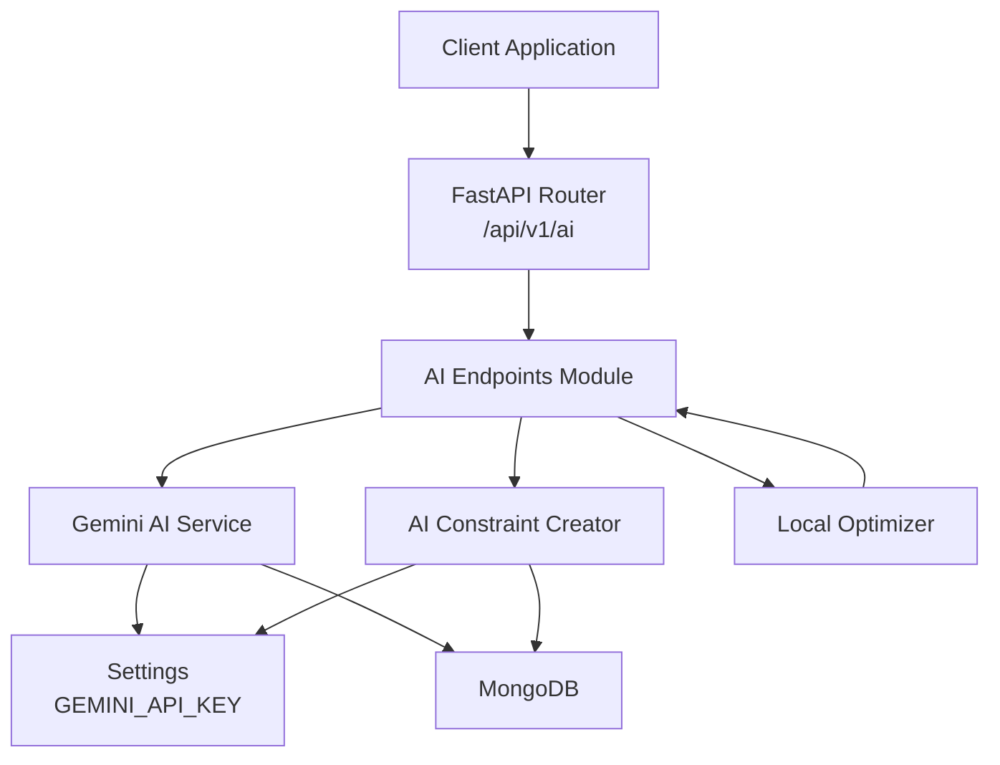
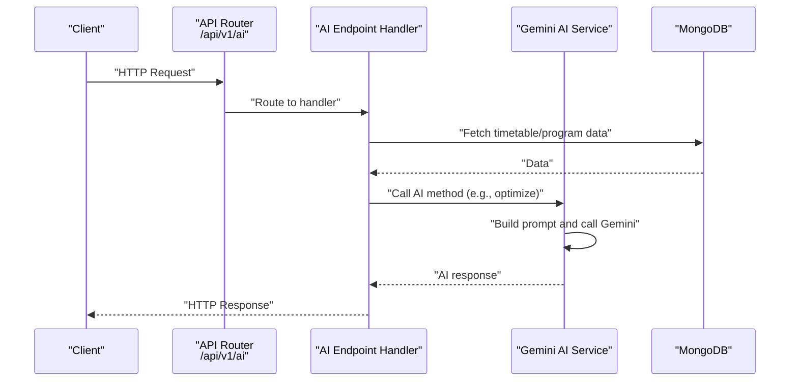
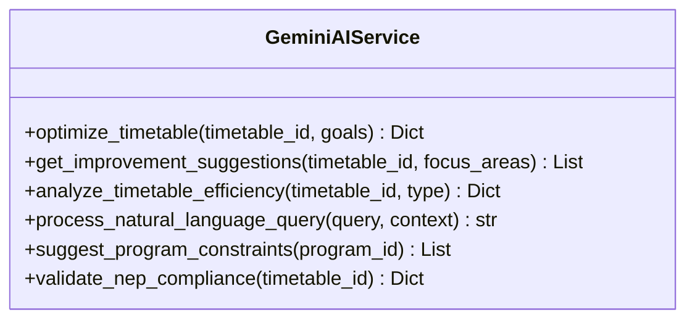
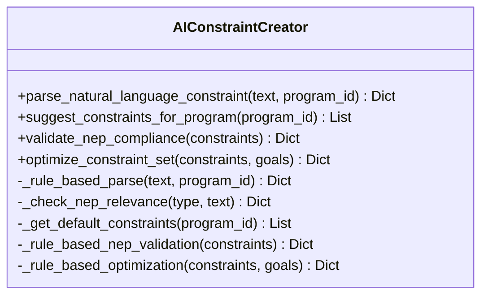
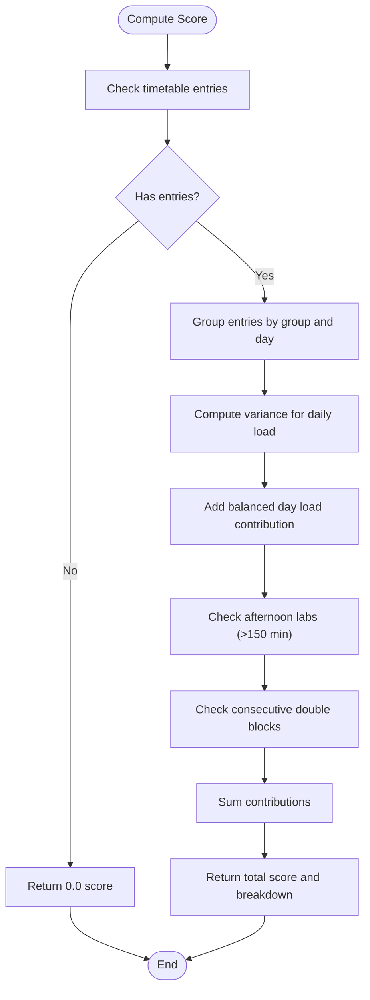
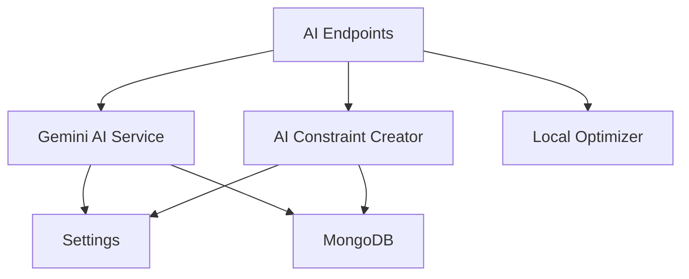

# AI Assistance Endpoints

<cite>
**Referenced Files in This Document**
- [api.py](file://backend/app/api/api_v1/api.py)
- [ai.py](file://backend/app/api/v1/endpoints/ai.py)
- [gemini.py](file://backend/app/services/ai/gemini.py)
- [constraint_creator.py](file://backend/app/services/ai/constraint_creator.py)
- [optimizer.py](file://backend/app/services/ai/optimizer.py)
- [config.py](file://backend/app/core/config.py)
- [mongodb.py](file://backend/app/db/mongodb.py)
- [constraint.py](file://backend/app/models/constraint.py)
- [main.py](file://backend/app/main.py)
</cite>

## Table of Contents
1. [Introduction](#introduction)
2. [Project Structure](#project-structure)
3. [Core Components](#core-components)
4. [Architecture Overview](#architecture-overview)
5. [Detailed Component Analysis](#detailed-component-analysis)
6. [Dependency Analysis](#dependency-analysis)
7. [Performance Considerations](#performance-considerations)
8. [Troubleshooting Guide](#troubleshooting-guide)
9. [Conclusion](#conclusion)

## Introduction
This document provides comprehensive API documentation for the AI assistance and optimization endpoints under the /api/v1/ai/ group. It covers natural language processing, constraint creation, optimization suggestions, and NEP 2020 compliance analysis. The AI service integrates with Google Gemini to generate structured suggestions, analyze timetables, and validate educational guidelines. The documentation details HTTP methods, URL patterns, request/response schemas, validation, error handling, and operational considerations such as rate limiting, fallback mechanisms, and performance optimization.

## Project Structure
The AI endpoints are mounted under the /api/v1/ai/ prefix and integrated via the main API router. The AI services are implemented in dedicated modules that encapsulate Gemini integration, constraint parsing and optimization, and lightweight local optimization scoring.

**Diagram sources**
- [api.py:33](file://backend/app/api/api_v1/api.py#L33)
- [ai.py:1](file://backend/app/api/v1/endpoints/ai.py#L1)
- [gemini.py:9](file://backend/app/services/ai/gemini.py#L9)
- [constraint_creator.py:18](file://backend/app/services/ai/constraint_creator.py#L18)
- [optimizer.py:6](file://backend/app/services/ai/optimizer.py#L6)
- [config.py:35](file://backend/app/core/config.py#L35)
- [mongodb.py:5](file://backend/app/db/mongodb.py#L5)

**Section sources**
- [api.py:33](file://backend/app/api/api_v1/api.py#L33)
- [main.py:101](file://backend/app/main.py#L101)

## Core Components
- AI Endpoints module: Defines the /api/v1/ai/ routes and delegates to AI services.
- Gemini AI Service: Provides methods for timetable optimization, suggestions, efficiency analysis, natural language query processing, constraint suggestion, and NEP 2020 validation.
- AI Constraint Creator: Parses natural language constraints into structured formats, suggests program-specific constraints, validates NEP 2020 compliance, and optimizes constraint sets.
- Local Optimizer: Lightweight scoring for timetable entries focusing on balanced daily load, afternoon labs, and consecutive blocks.
- Configuration: Exposes GEMINI_API_KEY for Gemini integration.
- Database: MongoDB connection abstraction used by AI services for data retrieval.

**Section sources**
- [ai.py:1](file://backend/app/api/v1/endpoints/ai.py#L1)
- [gemini.py:9](file://backend/app/services/ai/gemini.py#L9)
- [constraint_creator.py:18](file://backend/app/services/ai/constraint_creator.py#L18)
- [optimizer.py:6](file://backend/app/services/ai/optimizer.py#L6)
- [config.py:35](file://backend/app/core/config.py#L35)
- [mongodb.py:5](file://backend/app/db/mongodb.py#L5)

## Architecture Overview
The AI endpoints integrate with Google Gemini for advanced reasoning tasks while maintaining fallbacks and local optimizations for resilience and performance.

**Diagram sources**
- [api.py:33](file://backend/app/api/api_v1/api.py#L33)
- [gemini.py:18](file://backend/app/services/ai/gemini.py#L18)
- [mongodb.py:25](file://backend/app/db/mongodb.py#L25)

## Detailed Component Analysis

### AI Endpoints Module
The AI endpoints module defines the route group and handlers for AI-assisted operations. It integrates with the Gemini AI Service and AI Constraint Creator to provide:
- Natural language query processing
- Timetable optimization and suggestions
- Efficiency analysis
- Constraint suggestion and NEP 2020 validation

Note: The module imports the AI router and exposes the /api/v1/ai/ group. Specific endpoint handlers are defined within this module.

**Section sources**
- [ai.py:1](file://backend/app/api/v1/endpoints/ai.py#L1)

### Gemini AI Service
The Gemini AI Service encapsulates all AI-driven operations:
- Timetable optimization: Accepts timetable_id and optimization goals; returns analysis, suggestions, priorities, and NEP compliance metrics.
- Improvement suggestions: Generates actionable suggestions for focus areas.
- Efficiency analysis: Computes efficiency metrics and highlights issues.
- Natural language query processing: Answers questions about timetables with NEP 2020 guidance.
- Program constraint suggestions: Suggests constraints tailored to a program.
- NEP 2020 validation: Validates timetable compliance and provides recommendations.

Key behaviors:
- Graceful degradation when GEMINI_API_KEY is missing.
- Structured prompt engineering for each operation.
- Error handling returning standardized error messages.

**Diagram sources**
- [gemini.py:9](file://backend/app/services/ai/gemini.py#L9)

**Section sources**
- [gemini.py:18](file://backend/app/services/ai/gemini.py#L18)
- [gemini.py:62](file://backend/app/services/ai/gemini.py#L62)
- [gemini.py:114](file://backend/app/services/ai/gemini.py#L114)
- [gemini.py:155](file://backend/app/services/ai/gemini.py#L155)
- [gemini.py:184](file://backend/app/services/ai/gemini.py#L184)
- [gemini.py:241](file://backend/app/services/ai/gemini.py#L241)

### AI Constraint Creator
The AI Constraint Creator parses natural language constraints into structured formats, suggests program-specific constraints, validates NEP 2020 compliance, and optimizes constraint sets:
- Natural language parsing: Converts free-form text into structured constraints with parameters and NEP relevance.
- Rule-based fallback: Operates without AI when GEMINI_API_KEY is absent.
- NEP 2020 compliance: Checks coverage across credit system, multidisciplinary, assessment, skill development, research, and faculty workload.
- Constraint optimization: Identifies conflicts, removes duplicates, and adds missing constraints.

**Diagram sources**
- [constraint_creator.py:18](file://backend/app/services/ai/constraint_creator.py#L18)

**Section sources**
- [constraint_creator.py:179](file://backend/app/services/ai/constraint_creator.py#L179)
- [constraint_creator.py:405](file://backend/app/services/ai/constraint_creator.py#L405)
- [constraint_creator.py:536](file://backend/app/services/ai/constraint_creator.py#L536)
- [constraint_creator.py:659](file://backend/app/services/ai/constraint_creator.py#L659)

### Local Optimizer
The Local Optimizer computes a lightweight score for timetable entries focusing on:
- Balanced daily load across groups and days
- Afternoon lab scheduling preference
- Consecutive double blocks reward

**Diagram sources**
- [optimizer.py:6](file://backend/app/services/ai/optimizer.py#L6)

**Section sources**
- [optimizer.py:6](file://backend/app/services/ai/optimizer.py#L6)

### Configuration and Database
- Configuration: GEMINI_API_KEY enables Gemini integration; missing key triggers fallback behavior.
- Database: MongoDB connection abstraction supports AI services in fetching timetable and program data.

**Section sources**
- [config.py:35](file://backend/app/core/config.py#L35)
- [mongodb.py:11](file://backend/app/db/mongodb.py#L11)

## Dependency Analysis
The AI endpoints depend on:
- API routing for mounting under /api/v1/ai/
- Gemini AI Service for external AI operations
- AI Constraint Creator for structured constraint handling
- Local Optimizer for lightweight scoring
- Configuration for API key availability
- MongoDB for data access

**Diagram sources**
- [api.py:33](file://backend/app/api/api_v1/api.py#L33)
- [gemini.py:9](file://backend/app/services/ai/gemini.py#L9)
- [constraint_creator.py:18](file://backend/app/services/ai/constraint_creator.py#L18)
- [optimizer.py:6](file://backend/app/services/ai/optimizer.py#L6)
- [config.py:35](file://backend/app/core/config.py#L35)
- [mongodb.py:5](file://backend/app/db/mongodb.py#L5)

**Section sources**
- [api.py:33](file://backend/app/api/api_v1/api.py#L33)
- [gemini.py:9](file://backend/app/services/ai/gemini.py#L9)
- [constraint_creator.py:18](file://backend/app/services/ai/constraint_creator.py#L18)
- [optimizer.py:6](file://backend/app/services/ai/optimizer.py#L6)
- [config.py:35](file://backend/app/core/config.py#L35)
- [mongodb.py:5](file://backend/app/db/mongodb.py#L5)

## Performance Considerations
- AI service latency: Gemini calls introduce network latency; batch operations and caching can reduce repeated calls.
- Prompt complexity: Keep prompts concise and structured to minimize token usage and response time.
- Fallback mechanisms: When GEMINI_API_KEY is missing, rule-based parsing and default constraints ensure minimal downtime.
- Local scoring: Use the local optimizer for quick feedback during development or when external AI is unavailable.
- Database queries: Fetch only required fields and apply pagination for large datasets.

[No sources needed since this section provides general guidance]

## Troubleshooting Guide
Common issues and resolutions:
- Missing GEMINI_API_KEY:
  - Symptom: AI methods return configuration errors.
  - Resolution: Set GEMINI_API_KEY in environment variables; otherwise, fallback logic applies.
- Validation errors:
  - Symptom: 422 responses with validation details.
  - Resolution: Ensure request bodies conform to expected schemas and required fields.
- Database connectivity:
  - Symptom: MongoDB connection warnings during startup.
  - Resolution: Verify MONGODB_URL and DATABASE_NAME; the system continues without DB for testing.
- AI service failures:
  - Symptom: AI methods return error messages.
  - Resolution: Retry after verifying API key and quota; consider rate limiting and exponential backoff.

**Section sources**
- [config.py:35](file://backend/app/core/config.py#L35)
- [main.py:42](file://backend/app/main.py#L42)
- [mongodb.py:28](file://backend/app/db/mongodb.py#L28)
- [gemini.py:20](file://backend/app/services/ai/gemini.py#L20)

## Conclusion
The AI assistance endpoints provide a robust foundation for natural language processing, constraint creation, optimization suggestions, and NEP 2020 compliance analysis. By leveraging Google Gemini with graceful fallbacks and local optimizations, the system balances advanced AI capabilities with reliability and performance. Proper configuration, validation, and monitoring ensure smooth operation across diverse deployment scenarios.