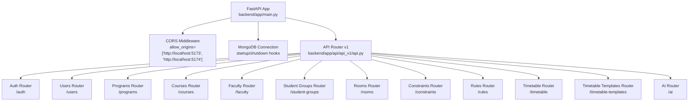
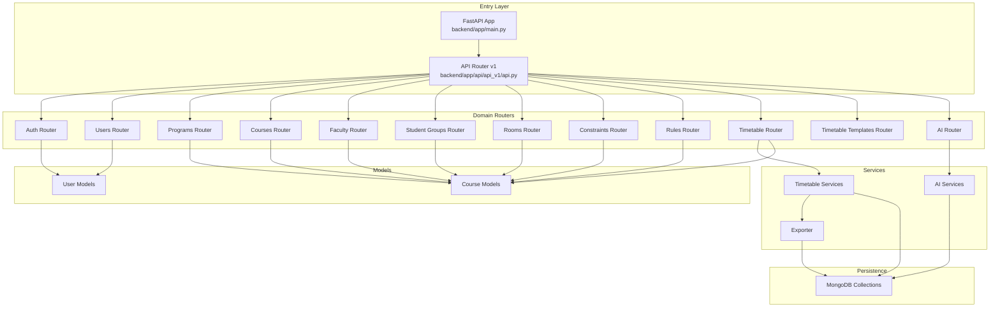
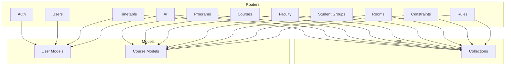

# API Endpoints Reference

<cite>
**Referenced Files in This Document**
- [backend/app/main.py](file://backend/app/main.py)
- [backend/app/api/api_v1/api.py](file://backend/app/api/api_v1/api.py)
- [backend/app/api/v1/endpoints/auth.py](file://backend/app/api/v1/endpoints/auth.py)
- [backend/app/api/v1/endpoints/users.py](file://backend/app/api/v1/endpoints/users.py)
- [backend/app/api/v1/endpoints/programs.py](file://backend/app/api/v1/endpoints/programs.py)
- [backend/app/api/v1/endpoints/courses.py](file://backend/app/api/v1/endpoints/courses.py)
- [backend/app/api/v1/endpoints/faculty.py](file://backend/app/api/v1/endpoints/faculty.py)
- [backend/app/api/v1/endpoints/student_groups.py](file://backend/app/api/v1/endpoints/student_groups.py)
- [backend/app/api/v1/endpoints/rooms.py](file://backend/app/api/v1/endpoints/rooms.py)
- [backend/app/api/v1/endpoints/constraints.py](file://backend/app/api/v1/endpoints/constraints.py)
- [backend/app/api/v1/endpoints/rules.py](file://backend/app/api/v1/endpoints/rules.py)
- [backend/app/api/v1/endpoints/timetable.py](file://backend/app/api/v1/endpoints/timetable.py)
- [backend/app/api/v1/endpoints/ai.py](file://backend/app/api/v1/endpoints/ai.py)
- [backend/app/models/user.py](file://backend/app/models/user.py)
- [backend/app/models/course.py](file://backend/app/models/course.py)
</cite>

## Table of Contents
1. [Introduction](#introduction)
2. [Project Structure](#project-structure)
3. [Core Components](#core-components)
4. [Architecture Overview](#architecture-overview)
5. [Detailed Component Analysis](#detailed-component-analysis)
6. [Dependency Analysis](#dependency-analysis)
7. [Performance Considerations](#performance-considerations)
8. [Troubleshooting Guide](#troubleshooting-guide)
9. [Conclusion](#conclusion)
10. [Appendices](#appendices)

## Introduction
This document provides comprehensive API documentation for the ShedMaster backend. It covers all REST endpoints grouped by functional domains: Authentication, User Management, Academic Structure, Faculty Management, Student Groups, Rooms, Constraints, Rules, Timetable Generation, Timetable Templates, and AI Services. For each endpoint, you will find HTTP methods, URL patterns, request/response schemas, authentication requirements, parameter descriptions, validation rules, error response formats, and practical usage examples. Additional topics include pagination, filtering, sorting, bulk operations, rate limiting, CORS configuration, security considerations, and API versioning guidance.

## Project Structure
The backend is built with FastAPI and organized into modular API routers under a versioned namespace. The main application initializes middleware (CORS, validation), connects to MongoDB, and mounts the versioned API router.

**Diagram sources**
- [backend/app/main.py:33-102](file://backend/app/main.py#L33-L102)
- [backend/app/api/api_v1/api.py:1-34](file://backend/app/api/api_v1/api.py#L1-L34)

**Section sources**
- [backend/app/main.py:33-102](file://backend/app/main.py#L33-L102)
- [backend/app/api/api_v1/api.py:1-34](file://backend/app/api/api_v1/api.py#L1-L34)

## Core Components
- Versioning: The API is mounted under a versioned prefix defined by settings.API_V1_STR. The application exposes version "1.0.0".
- Authentication: Endpoints generally require an active bearer token. Some endpoints enforce admin or ownership checks.
- Validation: Pydantic models define request/response schemas and validation rules. Global validation exceptions are handled centrally.
- Persistence: MongoDB collections are accessed via a shared database client abstraction.
- CORS: Configured for local development origins and allows credentials, headers, and methods.

Key behaviors:
- Pagination: Many list endpoints accept skip and limit parameters with bounds.
- Filtering: Query parameters enable filtering by various attributes.
- Ownership and isolation: Timetable and related endpoints consistently filter by created_by to prevent cross-user access.
- Soft deletion: Rooms use is_active flag for soft deletion semantics.

**Section sources**
- [backend/app/main.py:33-102](file://backend/app/main.py#L33-L102)
- [backend/app/api/api_v1/api.py:1-34](file://backend/app/api/api_v1/api.py#L1-L34)

## Architecture Overview
The API follows a layered architecture:
- Entry points: FastAPI app and APIRouter v1
- Routers: Feature-specific routers for each domain
- Services: Business logic for timetable generation, AI, and exporters
- Models: Pydantic models for request/response validation
- Database: MongoDB collection access

**Diagram sources**
- [backend/app/main.py:33-102](file://backend/app/main.py#L33-L102)
- [backend/app/api/api_v1/api.py:1-34](file://backend/app/api/api_v1/api.py#L1-L34)
- [backend/app/api/v1/endpoints/timetable.py:1-728](file://backend/app/api/v1/endpoints/timetable.py#L1-L728)
- [backend/app/api/v1/endpoints/ai.py:1-362](file://backend/app/api/v1/endpoints/ai.py#L1-L362)
- [backend/app/models/user.py:1-76](file://backend/app/models/user.py#L1-L76)
- [backend/app/models/course.py:1-43](file://backend/app/models/course.py#L1-L43)

## Detailed Component Analysis

### Authentication Endpoints
- Base Path: /api/v1/auth
- Security: Bearer token required for protected routes; login returns access token and user payload.

Endpoints:
- POST /login
  - Description: OAuth2-compatible token login.
  - Auth: No authentication required.
  - Request: OAuth2PasswordRequestForm (username, password).
  - Response: access_token, token_type, user (id, email, full_name, role, is_admin).
  - Errors: 401 Incorrect username or password; 400 Inactive user.

- POST /test-register
  - Description: Validates registration payload without creating an account.
  - Auth: No authentication required.
  - Request: UserCreate fields.
  - Response: Message and received_data snapshot.

- POST /register
  - Description: Creates a new user account.
  - Auth: No authentication required.
  - Request: UserCreate fields.
  - Response: User model.
  - Errors: 400 Duplicate email or validation error; 500 Registration failure.

- POST /test-token
  - Description: Tests token validity.
  - Auth: Bearer required.
  - Response: Current active User.

- POST /refresh-token
  - Description: Issues a new access token for the current user.
  - Auth: Bearer required.
  - Response: New access_token and token_type.

- OPTIONS /register
  - Description: CORS preflight for register.
  - Response: 200 with CORS headers.

Example usage:
- curl -X POST http://localhost:8000/api/v1/auth/login -H "Content-Type: application/x-www-form-urlencoded" -d "username=<EMAIL>&password=secret"
- curl -X POST http://localhost:8000/api/v1/auth/register -H "Content-Type: application/json" -d '{"email":"<EMAIL>","full_name":"John Doe","password":"secret"}'

Validation rules:
- UserCreate requires email, full_name or name, password; enforces presence of full_name if name is provided.

Error response format:
- Standard JSON with detail, body, and message on validation failures.

**Section sources**
- [backend/app/api/v1/endpoints/auth.py:17-123](file://backend/app/api/v1/endpoints/auth.py#L17-L123)
- [backend/app/models/user.py:39-56](file://backend/app/models/user.py#L39-L56)
- [backend/app/main.py:41-54](file://backend/app/main.py#L41-L54)

### User Management Endpoints
- Base Path: /api/v1/users
- Security: Requires active user; admin privileges required for listing, creating, and deleting users.

Endpoints:
- GET /
  - Description: List users with pagination.
  - Auth: Bearer required; admin.
  - Query: skip (ge 0), limit (1..1000).
  - Response: Array of User.

- GET /me
  - Description: Get current user profile.
  - Auth: Bearer required.
  - Response: User.

- GET /{user_id}
  - Description: Get a specific user by ID.
  - Auth: Bearer required; admin or self.
  - Response: User.
  - Errors: 403 Forbidden; 404 Not found.

- POST /
  - Description: Create a new user.
  - Auth: Bearer required; admin.
  - Request: UserCreate.
  - Response: User.
  - Errors: 400 Email already registered; 403 Forbidden.

- PUT /{user_id}
  - Description: Update a user.
  - Auth: Bearer required; admin or self.
  - Request: UserUpdate.
  - Response: User.
  - Errors: 404 Not found; 403 Forbidden.

- DELETE /{user_id}
  - Description: Delete a user.
  - Auth: Bearer required; admin.
  - Response: Deletion message.
  - Errors: 403 Forbidden; 404 Not found.

Pagination and filtering:
- Pagination supported via skip and limit query parameters.

Security:
- Ownership checks enforced; admin bypasses ownership.

**Section sources**
- [backend/app/api/v1/endpoints/users.py:11-123](file://backend/app/api/v1/endpoints/users.py#L11-L123)

### Academic Structure Endpoints
- Base Path: /api/v1/programs
- Security: Bearer required; admin for create/update/delete; read access for listing and retrieval.

Endpoints:
- GET /
  - Description: List programs with optional filters.
  - Auth: Bearer required.
  - Query: skip (ge 0), limit (1..1000), program_type, department.
  - Response: Array of Program.

- GET /{program_id}
  - Description: Get a specific program.
  - Auth: Bearer required.
  - Response: Program.

- POST /
  - Description: Create a new program.
  - Auth: Bearer required; admin.
  - Request: ProgramCreate.
  - Response: Program.
  - Errors: 400 Duplicate code; 403 Forbidden.

- PUT /{program_id}
  - Description: Update a program.
  - Auth: Bearer required; admin.
  - Request: ProgramUpdate.
  - Response: Program.

- DELETE /{program_id}
  - Description: Delete a program.
  - Auth: Bearer required; admin.
  - Response: Deletion message.
  - Errors: 403 Forbidden; 404 Not found; 400 Cannot delete program with associated timetables.

- GET /{program_id}/courses
  - Description: Get courses for a program (optionally filtered by semester).
  - Auth: Bearer required.
  - Query: semester.
  - Response: Array of Course.

- GET /{program_id}/statistics
  - Description: Get program statistics (course counts, timetable counts, semester breakdown).
  - Auth: Bearer required.
  - Response: Program stats object.

Validation rules:
- ObjectId parsing for IDs; fallback to string matching for program_id in course queries.

**Section sources**
- [backend/app/api/v1/endpoints/programs.py:12-288](file://backend/app/api/v1/endpoints/programs.py#L12-L288)

### Courses Endpoints
- Base Path: /api/v1/courses
- Security: Bearer required; admin for create/update/delete; read access for listing and retrieval.

Endpoints:
- GET /
  - Description: List courses with optional filters.
  - Auth: Bearer required.
  - Query: program_id, semester.
  - Response: Array of Course-like dictionaries with string IDs.

- POST /
  - Description: Create a new course.
  - Auth: Bearer required.
  - Request: CourseCreate.
  - Response: Course-like dictionary with string IDs.
  - Errors: 400 Duplicate course code; 400 Invalid program_id format.

- PUT /{course_id}
  - Description: Update a course.
  - Auth: Bearer required.
  - Request: CourseUpdate.
  - Response: Course-like dictionary with string IDs.
  - Errors: 400 Invalid course ID format; 404 Not found; 400 Duplicate course code.

- DELETE /{course_id}
  - Description: Delete a course.
  - Auth: Bearer required.
  - Response: Deletion message.
  - Errors: 400 Invalid course ID format; 404 Not found.

Validation rules:
- CourseCreate enforces credits, hours_per_week, min_per_session ranges; type and is_lab flags; optional prerequisites array.

**Section sources**
- [backend/app/api/v1/endpoints/courses.py:12-279](file://backend/app/api/v1/endpoints/courses.py#L12-L279)
- [backend/app/models/course.py:6-43](file://backend/app/models/course.py#L6-L43)

### Faculty Management Endpoints
- Base Path: /api/v1/faculty
- Security: Bearer required; read access for listing; write operations scoped to created_by.

Endpoints:
- GET /
  - Description: List all faculty (no user isolation).
  - Auth: Bearer required.
  - Response: Array of Faculty.

- POST /
  - Description: Create a new faculty member.
  - Auth: Bearer required.
  - Request: FacultyCreate.
  - Response: Faculty.
  - Errors: 400 Duplicate employee_id for user.

- GET /{faculty_id}
  - Description: Get a specific faculty member by ID.
  - Auth: Bearer required.
  - Response: Faculty.
  - Errors: 400 Invalid ID; 404 Not found.

- PUT /{faculty_id}
  - Description: Update a faculty member.
  - Auth: Bearer required.
  - Request: FacultyUpdate.
  - Response: Faculty.
  - Errors: 400 Invalid ID; 404 Not found; 400 Duplicate employee_id.

- DELETE /{faculty_id}
  - Description: Delete a faculty member.
  - Auth: Bearer required.
  - Response: Deletion message.
  - Errors: 400 Invalid ID; 404 Not found.

Notes:
- Endpoints filter by created_by for safety and uniqueness constraints.

**Section sources**
- [backend/app/api/v1/endpoints/faculty.py:13-265](file://backend/app/api/v1/endpoints/faculty.py#L13-L265)

### Student Groups Endpoints
- Base Path: /api/v1/student-groups
- Security: Bearer required; read access for listing; write operations scoped to created_by.

Endpoints:
- GET /
  - Description: List student groups with optional program filter.
  - Auth: Bearer required.
  - Query: program_id.
  - Response: Array of StudentGroup.

- POST /
  - Description: Create a new student group.
  - Auth: Bearer required.
  - Request: StudentGroupCreate.
  - Response: StudentGroup.
  - Errors: 400 Duplicate group name for program; 400 Invalid course/program IDs.

- GET /{group_id}
  - Description: Get a specific student group.
  - Auth: Bearer required.
  - Response: StudentGroup.
  - Errors: 400 Invalid ID; 404 Not found.

- PUT /{group_id}
  - Description: Update a student group.
  - Auth: Bearer required.
  - Request: StudentGroupUpdate.
  - Response: StudentGroup.
  - Errors: 400 Invalid ID; 404 Not found; 400 Duplicate name; 400 Invalid course/program IDs.

- DELETE /{group_id}
  - Description: Delete a student group.
  - Auth: Bearer required.
  - Response: Deletion message.
  - Errors: 400 Invalid ID; 404 Not found.

- GET /program/{program_id}/available-years
  - Description: Get available academic years for a program.
  - Auth: Bearer required.
  - Response: Array of integers (years 1..duration_years).
  - Errors: 400 Invalid program ID; 404 Not found.

**Section sources**
- [backend/app/api/v1/endpoints/student_groups.py:13-380](file://backend/app/api/v1/endpoints/student_groups.py#L13-L380)

### Rooms Endpoints
- Base Path: /api/v1/rooms
- Security: Bearer required; admin for create/update/delete; read access for listing and retrieval.

Endpoints:
- GET /
  - Description: List rooms with optional filters.
  - Auth: Bearer required.
  - Query: building (regex), room_type (regex), min_capacity.
  - Response: Array of Room-like dictionaries with string IDs.

- POST /
  - Description: Create a new room.
  - Auth: Bearer required.
  - Request: RoomCreate.
  - Response: Room-like dictionary with string IDs.
  - Errors: 400 Duplicate room name in building.

- PUT /{room_id}
  - Description: Update a room.
  - Auth: Bearer required.
  - Request: RoomUpdate.
  - Response: Room-like dictionary with string IDs.
  - Errors: 400 Invalid room ID; 404 Not found; 400 Duplicate room name in building.

- DELETE /{room_id}
  - Description: Soft delete a room (set is_active=false).
  - Auth: Bearer required.
  - Response: Deletion message.
  - Errors: 400 Invalid room ID; 404 Not found.

**Section sources**
- [backend/app/api/v1/endpoints/rooms.py:12-258](file://backend/app/api/v1/endpoints/rooms.py#L12-L258)

### Constraints Endpoints
- Base Path: /api/v1/constraints
- Security: Bearer required; admin or creator for write operations.

Endpoints:
- GET /
  - Description: List constraints with optional filters.
  - Auth: Bearer required.
  - Query: skip (ge 0), limit (1..1000), constraint_type, is_active, program_id.
  - Response: Array of Constraint.

- GET /{constraint_id}
  - Description: Get a specific constraint.
  - Auth: Bearer required.
  - Response: Constraint.
  - Errors: 404 Not found.

- POST /
  - Description: Create a new constraint.
  - Auth: Bearer required; admin or role=admin/faculty.
  - Request: ConstraintCreate.
  - Response: Constraint.

- PUT /{constraint_id}
  - Description: Update a constraint.
  - Auth: Bearer required; admin or creator.
  - Request: ConstraintUpdate.
  - Response: Constraint.

- DELETE /{constraint_id}
  - Description: Delete a constraint.
  - Auth: Bearer required; admin or creator.
  - Response: Deletion message.

- GET /types/
  - Description: Get available constraint types and descriptions.
  - Auth: Bearer required.
  - Response: Types and descriptions.

- POST /validate
  - Description: Validate constraints for a program (aggregates active constraints).
  - Auth: Bearer required.
  - Query: program_id.
  - Response: Validation summary.

**Section sources**
- [backend/app/api/v1/endpoints/constraints.py:11-189](file://backend/app/api/v1/endpoints/constraints.py#L11-L189)

### Rules Endpoints
- Base Path: /api/v1/rules
- Security: Bearer required; admin for create/update/delete.

Endpoints:
- GET /
  - Description: List all rules.
  - Auth: Bearer required.
  - Response: Array of Rule.

- POST /
  - Description: Create a new rule.
  - Auth: Bearer required.
  - Request: RuleCreate.
  - Response: Rule.

- PUT /{rule_id}
  - Description: Update a rule.
  - Auth: Bearer required.
  - Request: RuleUpdate.
  - Response: Rule.
  - Errors: 400 Invalid rule ID; 404 Not found.

- DELETE /{rule_id}
  - Description: Delete a rule.
  - Auth: Bearer required.
  - Response: Deletion message.
  - Errors: 400 Invalid rule ID; 404 Not found.

**Section sources**
- [backend/app/api/v1/endpoints/rules.py:13-68](file://backend/app/api/v1/endpoints/rules.py#L13-L68)

### Timetable Endpoints
- Base Path: /api/v1/timetable
- Security: Bearer required; strict ownership checks via created_by; demo user bypasses isolation.

Endpoints:
- GET /
  - Description: List user’s timetables with optional filters.
  - Auth: Bearer required.
  - Query: skip (ge 0), limit (1..1000), program_id, semester, academic_year, is_draft.
  - Response: Array of Timetable.

- GET /{timetable_id}
  - Description: Get a specific timetable by ID.
  - Auth: Bearer required.
  - Response: Timetable.
  - Errors: 404 Not found.

- POST /
  - Description: Create a new empty timetable.
  - Auth: Bearer required.
  - Request: TimetableCreate.
  - Response: Timetable.

- POST /draft
  - Description: Save or update a draft timetable (partial data).
  - Auth: Bearer required.
  - Request: Partial dict with optional id.
  - Response: Timetable.

- POST /generate
  - Description: Generate timetable using AI optimization.
  - Auth: Bearer required.
  - Query: program_id, semester, academic_year.
  - Response: Timetable.

- POST /generate-advanced
  - Description: Template-based generation with smart slot allocation.
  - Auth: Bearer required.
  - Request: JSON with program_id, semester, academic_year, title, student_group_id, rule_id, overrides.
  - Response: Structured result with timetable and generation details.

- POST /generate-nep-ga
  - Description: NEP 2020 compliant Genetic Algorithm generation.
  - Auth: Bearer required.
  - Request: JSON with program_id, semester, academic_year, title, nep_preferences, population_size, max_generations, and overrides.
  - Response: Structured result with timetable, fitness score, NEP compliance, and statistics.

- PUT /{timetable_id}
  - Description: Update a timetable.
  - Auth: Bearer required.
  - Request: TimetableUpdate.
  - Response: Timetable.

- DELETE /{timetable_id}
  - Description: Delete a timetable.
  - Auth: Bearer required.
  - Response: Deletion message.

- GET /{timetable_id}/export/{format_type}
  - Description: Export timetable to excel, pdf, or json.
  - Auth: Bearer required.
  - Path: format_type in {json, excel, pdf}.
  - Response: JSON body or streamed file attachment.

- POST /{timetable_id}/optimize
  - Description: Optimize an existing timetable using AI.
  - Auth: Bearer required.
  - Response: Optimized timetable.

- POST /{timetable_id}/validate
  - Description: Validate timetable against constraints.
  - Auth: Bearer required.
  - Response: Validation result.

Ownership and isolation:
- All read/write operations filter by created_by to ensure user isolation.

Export formats:
- json: Returns JSON body.
- excel: Returns binary stream with .xlsx content.
- pdf: Returns binary stream with .pdf content; falls back to HTML if PDF generation fails.

**Section sources**
- [backend/app/api/v1/endpoints/timetable.py:17-728](file://backend/app/api/v1/endpoints/timetable.py#L17-L728)

### AI Services Endpoints
- Base Path: /api/v1/ai
- Security: Bearer required; strict ownership checks for timetable-related operations.

Endpoints:
- POST /optimize
  - Description: Use AI to optimize an existing timetable.
  - Auth: Bearer required.
  - Request: OptimizeRequest (timetable_id, optimization_goals).
  - Response: AI optimization result.

- POST /suggest
  - Description: Get AI suggestions for timetable improvements.
  - Auth: Bearer required.
  - Request: SuggestionRequest (timetable_id, focus_areas).
  - Response: Suggestions with generated_at timestamp.

- POST /analysis
  - Description: AI analysis of timetable efficiency and compliance.
  - Auth: Bearer required.
  - Request: AnalysisRequest (timetable_id, analysis_type).
  - Response: Analysis result.

- POST /query
  - Description: Process natural language queries about timetables.
  - Auth: Bearer required.
  - Request: QueryRequest (query, context).
  - Response: Response with processed_at timestamp.

- GET /constraints/suggest/{program_id}
  - Description: Get AI-suggested constraints for a program.
  - Auth: Bearer required.
  - Response: Suggested constraints.

- POST /validate-schedule
  - Description: Validate schedule against NEP 2020 guidelines and best practices.
  - Auth: Bearer required.
  - Request: timetable_id.
  - Response: Validation result.

- POST /constraints/parse-natural-language
  - Description: Parse natural language constraint into structured format.
  - Auth: Bearer required.
  - Request: NaturalLanguageConstraintRequest (text, program_id).
  - Response: Parsed constraint.

- POST /constraints/optimize-set
  - Description: Optimize a set of constraints using AI.
  - Auth: Bearer required.
  - Request: ConstraintOptimizationRequest (constraints, optimization_goals).
  - Response: Optimization result.

- POST /constraints/check-nep-compliance
  - Description: Validate constraints against NEP 2020 guidelines.
  - Auth: Bearer required.
  - Request: NEPComplianceCheckRequest (constraints).
  - Response: Compliance report.

- POST /chat
  - Description: AI chatbot for timetable and constraint assistance.
  - Auth: Bearer required.
  - Request: AIChatRequest (message, conversation_history, context).
  - Response: Response and suggestions.

**Section sources**
- [backend/app/api/v1/endpoints/ai.py:46-362](file://backend/app/api/v1/endpoints/ai.py#L46-L362)

## Dependency Analysis
The API is composed of independent routers grouped by domain. Cross-domain dependencies occur primarily through database access and shared models. Ownership and permission enforcement are centralized in individual endpoints rather than shared middleware.

**Diagram sources**
- [backend/app/api/api_v1/api.py:6-34](file://backend/app/api/api_v1/api.py#L6-L34)
- [backend/app/models/user.py:27-76](file://backend/app/models/user.py#L27-L76)
- [backend/app/models/course.py:6-43](file://backend/app/models/course.py#L6-L43)

**Section sources**
- [backend/app/api/api_v1/api.py:6-34](file://backend/app/api/api_v1/api.py#L6-L34)

## Performance Considerations
- Pagination: Prefer skip/limit on list endpoints to avoid large payloads.
- Filtering: Use query parameters to narrow results server-side.
- Ownership checks: Ensure created_by filtering is maintained to reduce accidental scans.
- Export streaming: Use StreamingResponse for large exports (Excel/PDF) to minimize memory usage.
- Validation: Keep request bodies minimal; rely on Pydantic validation to avoid extra processing.

[No sources needed since this section provides general guidance]

## Troubleshooting Guide
Common issues and resolutions:
- Validation errors: The global exception handler returns a JSON body with detail, body, and message. Inspect detail for field-level errors.
- Authentication failures: 401 Unauthorized indicates invalid or expired token; use /auth/refresh-token to obtain a new token.
- Permission denied: 403 Forbidden occurs when non-admin attempts admin-only operations or when accessing another user’s resources.
- Resource not found: 404 Not found for missing IDs; verify ObjectId format and resource existence.
- CORS failures: Ensure frontend origin is included in allow_origins and credentials are allowed.

**Section sources**
- [backend/app/main.py:41-54](file://backend/app/main.py#L41-L54)

## Conclusion
ShedMaster provides a comprehensive, versioned REST API for timetable generation and academic administration. Endpoints follow consistent patterns: Bearer authentication, Pydantic validation, pagination, filtering, and strict ownership controls. The AI-assisted generation and validation endpoints enable NEP 2020 compliance and intelligent optimization. For production deployments, consider adding rate limiting, stricter CORS policies, and robust monitoring.

[No sources needed since this section summarizes without analyzing specific files]

## Appendices

### API Design Patterns
- RESTful resource naming: plural nouns for collections (/users, /programs), resource IDs in path segments.
- HTTP verbs: GET (retrieve), POST (create), PUT (update), DELETE (remove).
- Status codes: 200 OK, 201 Created, 400 Bad Request, 401 Unauthorized, 403 Forbidden, 404 Not Found, 422 Unprocessable Entity, 500 Internal Server Error.
- Pagination: skip and limit with bounds.
- Filtering: query parameters per endpoint.
- Ownership: created_by filtering for user-scoped resources.

### CORS Configuration
- Allowed origins: http://localhost:5173, http://localhost:5174
- Credentials, headers, and methods allowed; exposed headers configurable.

**Section sources**
- [backend/app/main.py:56-64](file://backend/app/main.py#L56-L64)

### Rate Limiting
- Not implemented in the current codebase. Recommended approaches:
  - Use middleware or gateway to throttle requests per IP or token.
  - Apply per-route limits for sensitive endpoints (login, AI).
  - Integrate with external rate limiting solutions.

[No sources needed since this section provides general guidance]

### Security Considerations
- Token-based authentication with bearer tokens.
- Admin-only endpoints clearly enforced.
- Ownership checks on timetable and related resources.
- Input validation via Pydantic models.
- CORS configured for development; tighten for production.

**Section sources**
- [backend/app/api/v1/endpoints/timetable.py:30-44](file://backend/app/api/v1/endpoints/timetable.py#L30-L44)
- [backend/app/api/v1/endpoints/constraints.py:56-57](file://backend/app/api/v1/endpoints/constraints.py#L56-L57)

### API Versioning and Backward Compatibility
- Version prefix: /api/v1
- Recommendations:
  - Increment major version on breaking changes.
  - Add new endpoints under new paths; deprecate old ones after migration period.
  - Preserve backward compatibility for existing fields; introduce new optional fields.
  - Document breaking changes and migration steps.

**Section sources**
- [backend/app/main.py:34-36](file://backend/app/main.py#L34-L36)

### Request/Response Schemas Overview
- User: email, full_name, is_active, is_admin, role, timestamps.
- Course: code, name, credits, type, hours_per_week, min_per_session, semester, program_id, description, prerequisites, is_lab, lab_hours, is_active, timestamps.
- Program: fields defaulted for response stability.
- Timetable: title, program_id, semester, academic_year, entries, metadata, timestamps, flags.

**Section sources**
- [backend/app/models/user.py:27-76](file://backend/app/models/user.py#L27-L76)
- [backend/app/models/course.py:6-43](file://backend/app/models/course.py#L6-L43)
- [backend/app/api/v1/endpoints/programs.py:42-54](file://backend/app/api/v1/endpoints/programs.py#L42-L54)
- [backend/app/api/v1/endpoints/timetable.py:116-145](file://backend/app/api/v1/endpoints/timetable.py#L116-L145)