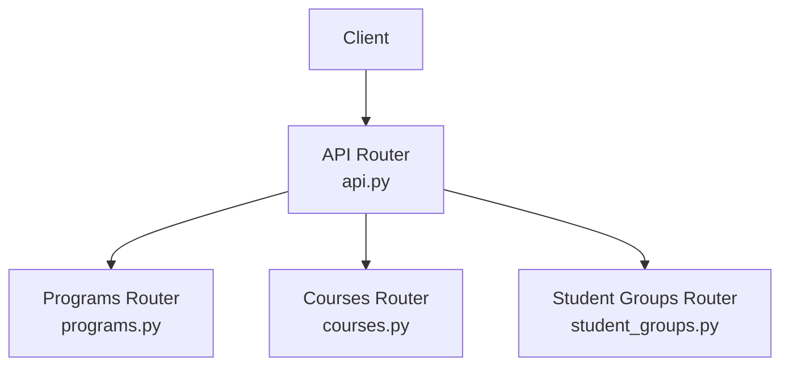
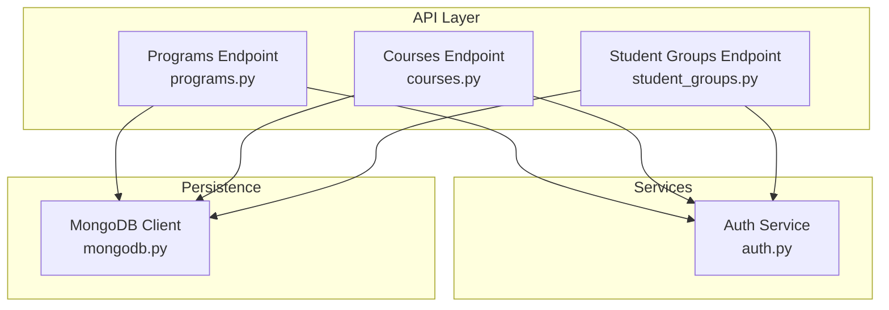
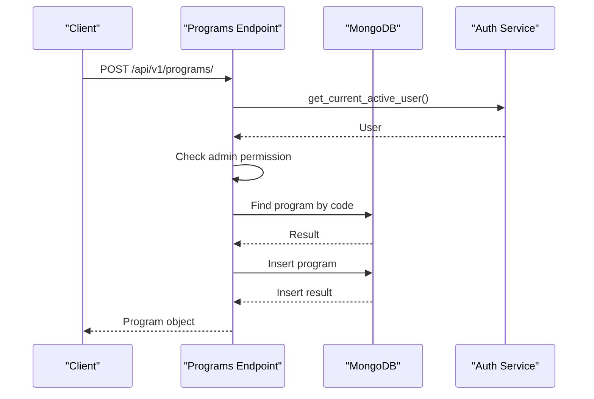
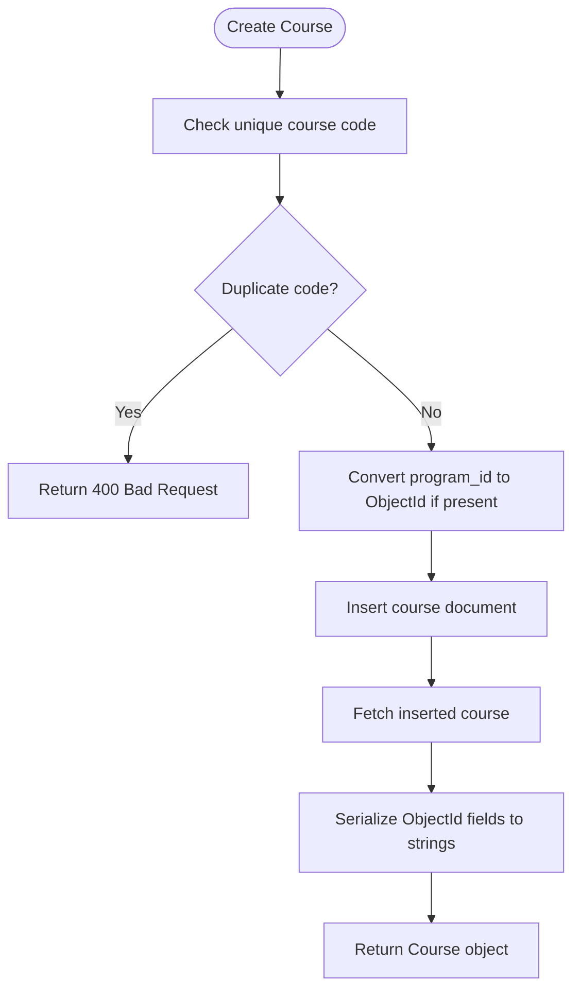
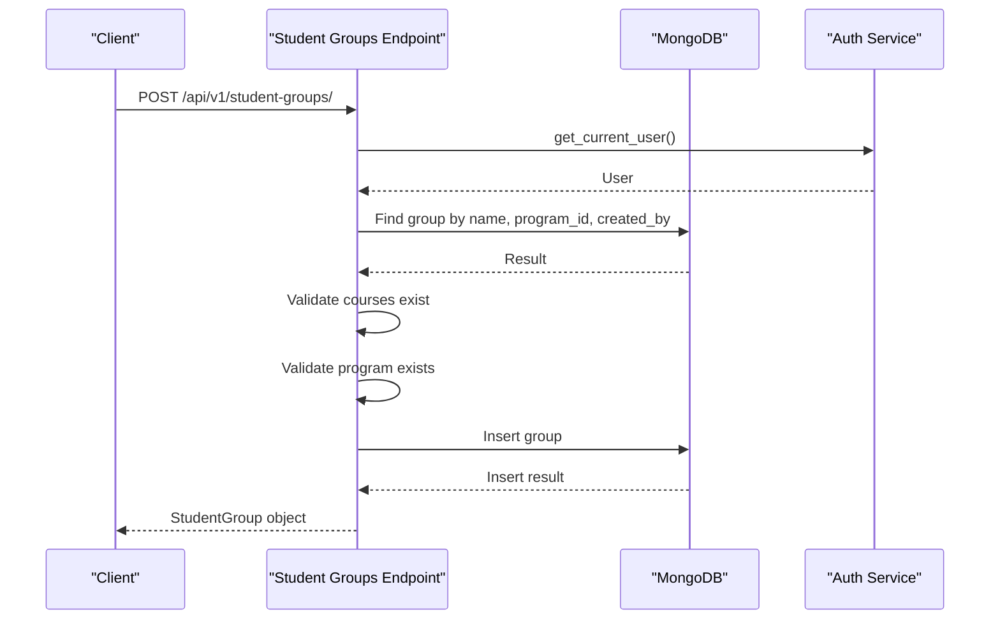
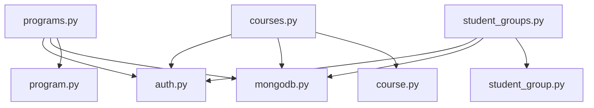

# Academic Structure Endpoints

<cite>
**Referenced Files in This Document**
- [api.py](file://backend/app/api/api_v1/api.py)
- [programs.py](file://backend/app/api/v1/endpoints/programs.py)
- [courses.py](file://backend/app/api/v1/endpoints/courses.py)
- [student_groups.py](file://backend/app/api/v1/endpoints/student_groups.py)
- [program.py](file://backend/app/models/program.py)
- [course.py](file://backend/app/models/course.py)
- [student_group.py](file://backend/app/models/student_group.py)
- [mongodb.py](file://backend/app/db/mongodb.py)
- [auth.py](file://backend/app/services/auth.py)
- [test_endpoints.py](file://test_endpoints.py)
</cite>

## Table of Contents
1. [Introduction](#introduction)
2. [Project Structure](#project-structure)
3. [Core Components](#core-components)
4. [Architecture Overview](#architecture-overview)
5. [Detailed Component Analysis](#detailed-component-analysis)
6. [Dependency Analysis](#dependency-analysis)
7. [Performance Considerations](#performance-considerations)
8. [Troubleshooting Guide](#troubleshooting-guide)
9. [Conclusion](#conclusion)

## Introduction
This document provides comprehensive API documentation for academic structure management endpoints focused on three primary areas:
- Academic program administration: managing degree programs, their metadata, and program-level statistics
- Course catalog management: maintaining course definitions, prerequisites, and semester mapping
- Student group configuration: organizing student groups by year, semester, section, and course composition

It covers HTTP methods, URL patterns, request/response schemas, validation rules, and operational constraints. It also documents program-course relationships, course prerequisites, student group enrollment tracking, academic year management, and bulk operations for importing academic data. Guidance is included for ensuring data consistency, referential integrity, and academic policy compliance.

## Project Structure
The API is organized under a single router that mounts multiple endpoint groups. The relevant endpoint groups for this document are:
- Programs: /api/v1/programs/
- Courses: /api/v1/courses/
- Student Groups: /api/v1/student-groups/

**Diagram sources**
- [api.py:24-27](file://backend/app/api/api_v1/api.py#L24-L27)
- [programs.py:10](file://backend/app/api/v1/endpoints/programs.py#L10)
- [courses.py:10](file://backend/app/api/v1/endpoints/courses.py#L10)
- [student_groups.py:11](file://backend/app/api/v1/endpoints/student_groups.py#L11)

**Section sources**
- [api.py:24-27](file://backend/app/api/api_v1/api.py#L24-L27)

## Core Components
This section outlines the data models that define request/response schemas for each endpoint group.

- Program model fields:
  - name, code, type, department, duration_years, total_semesters, credits_required, description, is_active
  - Additional fields: created_at, updated_at
  - Validation: non-empty strings for identifiers, numeric bounds for duration and credits, boolean flags

- Course model fields:
  - code, name, credits, type, hours_per_week, min_per_session, semester, program_id, description, prerequisites, is_lab, lab_hours, is_active
  - Additional fields: created_by, created_at, updated_at
  - Validation: credits and hours within bounds, semester within 1..8, prerequisites as list of course IDs

- Student Group model fields:
  - name, course_ids, year, semester, section, student_strength, group_type, program_id
  - Additional fields: id, created_by, created_at, updated_at
  - Validation: year within 1..4, student_strength within 1..200, semester enumeration-like string, section enumeration-like string

**Section sources**
- [program.py:6-33](file://backend/app/models/program.py#L6-L33)
- [course.py:6-43](file://backend/app/models/course.py#L6-L43)
- [student_group.py:5-36](file://backend/app/models/student_group.py#L5-L36)

## Architecture Overview
The API follows a layered architecture:
- Endpoint routers handle HTTP requests and responses
- Authentication service enforces access policies
- MongoDB client manages persistence
- Pydantic models define request/response schemas and validation

**Diagram sources**
- [programs.py:4-5](file://backend/app/api/v1/endpoints/programs.py#L4-L5)
- [courses.py:3-5](file://backend/app/api/v1/endpoints/courses.py#L3-L5)
- [student_groups.py:6-9](file://backend/app/api/v1/endpoints/student_groups.py#L6-L9)
- [mongodb.py](file://backend/app/db/mongodb.py)
- [auth.py](file://backend/app/services/auth.py)

## Detailed Component Analysis

### Programs Endpoint Group
Endpoints:
- GET /api/v1/programs/
  - Query parameters: skip (>=0), limit (1..1000), program_type (optional), department (optional)
  - Response: array of Program objects
  - Filters: program_type and department applied to query
  - Pagination: skip and limit supported

- GET /api/v1/programs/{program_id}
  - Path parameter: program_id (ObjectId or string)
  - Response: Program object
  - Validation: ObjectId parsing with error handling

- POST /api/v1/programs/
  - Request body: ProgramCreate
  - Response: Program object
  - Access control: admin-only
  - Validation: unique program code per request
  - Persistence: inserts into programs collection

- PUT /api/v1/programs/{program_id}
  - Path parameter: program_id
  - Request body: ProgramUpdate (partial updates)
  - Response: Program object
  - Access control: admin-only
  - Validation: program existence

- DELETE /api/v1/programs/{program_id}
  - Path parameter: program_id
  - Response: success message
  - Access control: admin-only
  - Validation: program existence and absence of associated timetables

- GET /api/v1/programs/{program_id}/courses
  - Path parameter: program_id
  - Query parameters: semester (optional)
  - Response: array of Course objects linked to the program
  - Validation: program existence; supports ObjectId or string program_id in query

- GET /api/v1/programs/{program_id}/statistics
  - Path parameter: program_id
  - Response: statistics including total_courses, total_timetables, courses_by_semester, and program_info
  - Validation: program existence

Validation rules:
- Unique program code enforcement on create
- ObjectId parsing with HTTP 400 on invalid format
- Admin-only operations for create/update/delete
- Associated timetable check before deletion

Operational constraints:
- Deletion blocked if program has associated timetables
- Program-course relationship via program_id stored in course documents

Example workflows:
- Create a program with metadata and retrieve it
- List programs with filters and pagination
- Fetch program statistics for reporting
- Retrieve program courses filtered by semester

**Diagram sources**
- [programs.py:100-139](file://backend/app/api/v1/endpoints/programs.py#L100-L139)

**Section sources**
- [programs.py:12-64](file://backend/app/api/v1/endpoints/programs.py#L12-L64)
- [programs.py:72-98](file://backend/app/api/v1/endpoints/programs.py#L72-L98)
- [programs.py:100-139](file://backend/app/api/v1/endpoints/programs.py#L100-L139)
- [programs.py:140-171](file://backend/app/api/v1/endpoints/programs.py#L140-L171)
- [programs.py:172-199](file://backend/app/api/v1/endpoints/programs.py#L172-L199)
- [programs.py:201-248](file://backend/app/api/v1/endpoints/programs.py#L201-L248)
- [programs.py:250-287](file://backend/app/api/v1/endpoints/programs.py#L250-L287)

### Courses Endpoint Group
Endpoints:
- GET /api/v1/courses/
  - Query parameters: program_id (optional), semester (optional)
  - Response: array of Course objects
  - Filters: program_id supports ObjectId or string; semester filter applied

- POST /api/v1/courses/
  - Request body: CourseCreate
  - Response: Course object
  - Validation: unique course code per request; program_id ObjectId conversion if provided
  - Persistence: sets created_by to current user ID and timestamps

- PUT /api/v1/courses/{course_id}
  - Path parameter: course_id
  - Request body: CourseUpdate (partial updates)
  - Response: Course object
  - Validation: course existence, ObjectId format, unique code change if applicable, program_id conversion if provided

- DELETE /api/v1/courses/{course_id}
  - Path parameter: course_id
  - Response: success message
  - Validation: course existence and ObjectId format

Prerequisites and relationships:
- Course prerequisites stored as a list of course IDs
- Program association via program_id field
- Semester mapping for curriculum sequencing

Validation rules:
- Unique course code enforcement
- Numeric bounds for credits, hours_per_week, min_per_session, and semester
- ObjectId format validation for IDs
- Program existence validation during updates when program_id is changed

**Diagram sources**
- [courses.py:58-126](file://backend/app/api/v1/endpoints/courses.py#L58-L126)

**Section sources**
- [courses.py:12-56](file://backend/app/api/v1/endpoints/courses.py#L12-L56)
- [courses.py:58-126](file://backend/app/api/v1/endpoints/courses.py#L58-L126)
- [courses.py:128-231](file://backend/app/api/v1/endpoints/courses.py#L128-L231)
- [courses.py:233-279](file://backend/app/api/v1/endpoints/courses.py#L233-L279)

### Student Groups Endpoint Group
Endpoints:
- GET /api/v1/student-groups/
  - Query parameters: program_id (optional)
  - Response: array of StudentGroup objects
  - Filters: program_id supports ObjectId or string

- POST /api/v1/student-groups/
  - Request body: StudentGroupCreate
  - Response: StudentGroup object
  - Validation: unique group name per program and user; course existence checks; program existence; course_ids and program_id ObjectId validation

- GET /api/v1/student-groups/{group_id}
  - Path parameter: group_id
  - Response: StudentGroup object
  - Validation: ObjectId format; ownership by current user

- PUT /api/v1/student-groups/{group_id}
  - Path parameter: group_id
  - Request body: StudentGroupUpdate (partial updates)
  - Response: StudentGroup object
  - Validation: group existence and ownership; non-empty update fields; course and program existence when modified; unique name constraint if name is updated

- DELETE /api/v1/student-groups/{group_id}
  - Path parameter: group_id
  - Response: success message
  - Validation: group existence and ownership

- GET /api/v1/student-groups/program/{program_id}/available-years
  - Path parameter: program_id
  - Response: array of integers representing available academic years based on program duration

Enrollment tracking:
- Student groups link to courses via course_ids
- Year, semester, section, and student_strength capture enrollment configuration
- group_type distinguishes regular classes vs practical labs

**Diagram sources**
- [student_groups.py:59-138](file://backend/app/api/v1/endpoints/student_groups.py#L59-L138)

**Section sources**
- [student_groups.py:13-58](file://backend/app/api/v1/endpoints/student_groups.py#L13-L58)
- [student_groups.py:59-138](file://backend/app/api/v1/endpoints/student_groups.py#L59-L138)
- [student_groups.py:139-179](file://backend/app/api/v1/endpoints/student_groups.py#L139-L179)
- [student_groups.py:181-292](file://backend/app/api/v1/endpoints/student_groups.py#L181-L292)
- [student_groups.py:293-342](file://backend/app/api/v1/endpoints/student_groups.py#L293-L342)
- [student_groups.py:344-380](file://backend/app/api/v1/endpoints/student_groups.py#L344-L380)

## Dependency Analysis
Key dependencies and relationships:
- Endpoint routers depend on:
  - Authentication service for user context and permissions
  - MongoDB client for database operations
  - Pydantic models for request/response validation and serialization

- Cross-cutting concerns:
  - ObjectId conversion and validation
  - Ownership checks for student groups
  - Admin-only operations for program management

**Diagram sources**
- [programs.py:4-5](file://backend/app/api/v1/endpoints/programs.py#L4-L5)
- [courses.py:3-5](file://backend/app/api/v1/endpoints/courses.py#L3-L5)
- [student_groups.py:6-9](file://backend/app/api/v1/endpoints/student_groups.py#L6-L9)
- [program.py:1-33](file://backend/app/models/program.py#L1-L33)
- [course.py:1-43](file://backend/app/models/course.py#L1-L43)
- [student_group.py:1-36](file://backend/app/models/student_group.py#L1-L36)
- [mongodb.py](file://backend/app/db/mongodb.py)
- [auth.py](file://backend/app/services/auth.py)

**Section sources**
- [programs.py:1-10](file://backend/app/api/v1/endpoints/programs.py#L1-L10)
- [courses.py:1-10](file://backend/app/api/v1/endpoints/courses.py#L1-L10)
- [student_groups.py:1-11](file://backend/app/api/v1/endpoints/student_groups.py#L1-L11)

## Performance Considerations
- Pagination: Programs listing supports skip and limit to control payload size
- Filtering: Queries apply filters at the database level to reduce result sets
- ObjectId handling: Efficient conversion avoids unnecessary round trips
- Aggregation: Program statistics use aggregation pipeline for grouped counts

Recommendations:
- Use appropriate limit values for listing endpoints
- Apply filters (program_id, semester) to narrow result sets
- Batch operations for bulk imports should leverage database bulk write capabilities

[No sources needed since this section provides general guidance]

## Troubleshooting Guide
Common issues and resolutions:
- Authentication failures: Ensure valid bearer token is provided for protected endpoints
- Authorization errors: Admin privileges required for program create/update/delete
- Invalid ObjectId: Verify ID format; endpoints return HTTP 400 for malformed IDs
- Duplicate entries: Unique constraints on program code and course code; adjust inputs accordingly
- Referential integrity: Ensure program_id and course_ids exist before creating/updating documents
- Deletion conflicts: Cannot delete programs with associated timetables

Testing utilities:
- Automated tests demonstrate endpoint availability and basic response inspection

**Section sources**
- [programs.py:113-121](file://backend/app/api/v1/endpoints/programs.py#L113-L121)
- [courses.py:67-74](file://backend/app/api/v1/endpoints/courses.py#L67-L74)
- [student_groups.py:68-79](file://backend/app/api/v1/endpoints/student_groups.py#L68-L79)
- [programs.py:189-196](file://backend/app/api/v1/endpoints/programs.py#L189-L196)
- [test_endpoints.py:25-45](file://test_endpoints.py#L25-L45)

## Conclusion
The academic structure endpoints provide a robust foundation for managing programs, courses, and student groups. They enforce validation, maintain referential integrity, and offer filtering and pagination for scalable operations. Administrators can manage academic catalogs, configure student groups, and track program statistics while ensuring compliance with academic policies through built-in constraints and access controls.