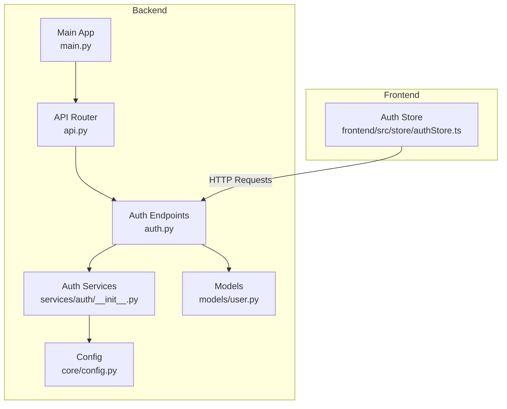
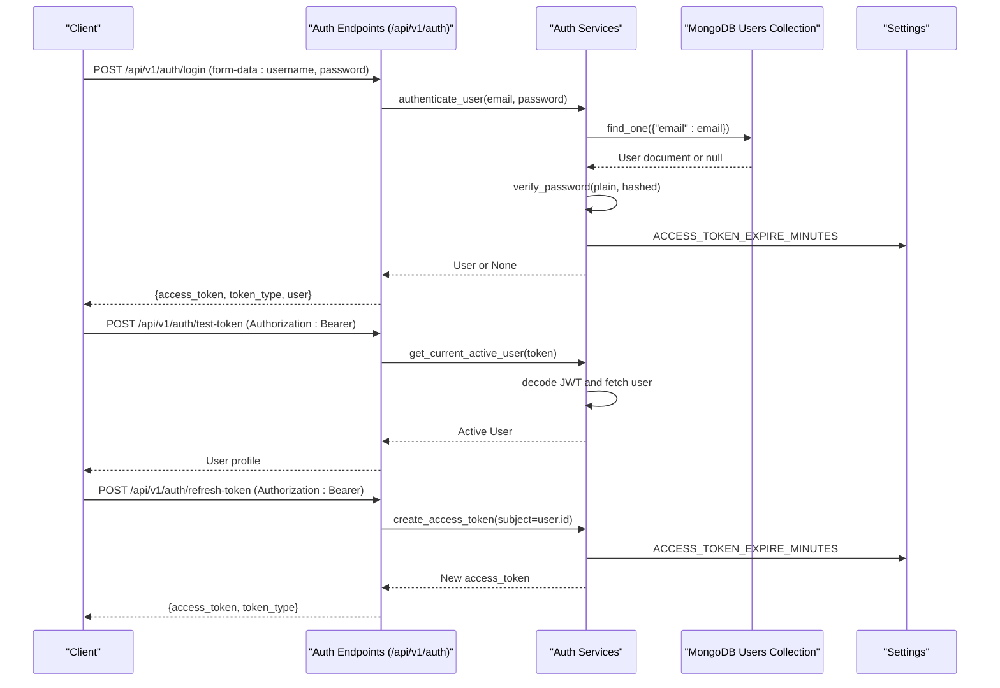
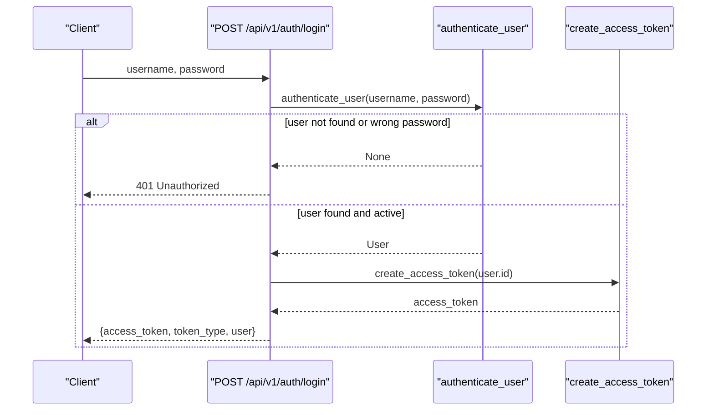
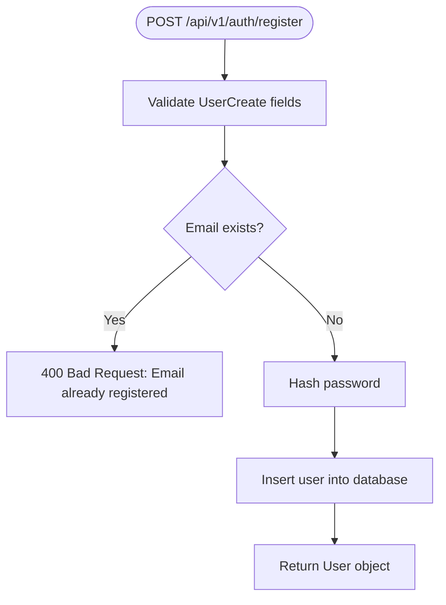
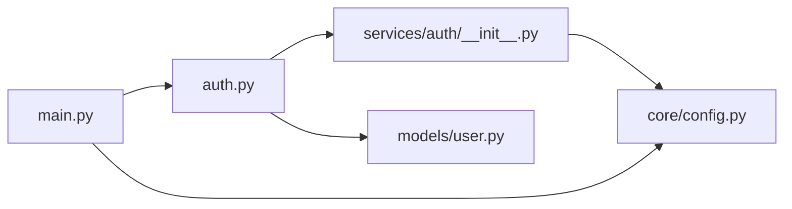

# Authentication Endpoints

<cite>
**Referenced Files in This Document**
- [auth.py](file://backend/app/api/v1/endpoints/auth.py)
- [__init__.py](file://backend/app/services/auth/__init__.py)
- [user.py](file://backend/app/models/user.py)
- [config.py](file://backend/app/core/config.py)
- [main.py](file://backend/app/main.py)
- [api.py](file://backend/app/api/api_v1/api.py)
- [authStore.ts](file://frontend/src/store/authStore.ts)
- [test_login.py](file://test_login.py)
- [tmp_test_login.py](file://backend/tmp_test_login.py)
</cite>

## Table of Contents
1. [Introduction](#introduction)
2. [Project Structure](#project-structure)
3. [Core Components](#core-components)
4. [Architecture Overview](#architecture-overview)
5. [Detailed Component Analysis](#detailed-component-analysis)
6. [Dependency Analysis](#dependency-analysis)
7. [Performance Considerations](#performance-considerations)
8. [Troubleshooting Guide](#troubleshooting-guide)
9. [Conclusion](#conclusion)
10. [Appendices](#appendices)

## Introduction
This document provides comprehensive API documentation for the authentication endpoints under the /api/v1/auth/ group. It covers login, registration, token testing, and token refresh functionality. It also explains the OAuth2 password flow implementation, JWT token structure, access token expiration handling, request parameter validation, error response formats, CORS preflight handling, and practical examples using curl commands and response samples. Security considerations including password hashing, token security, and rate limiting are addressed.

## Project Structure
The authentication module is organized as follows:
- API router definition and inclusion under /api/v1/auth
- Endpoint implementations for login, registration, token testing, and token refresh
- Service layer implementing password hashing, token creation, user authentication, and token validation
- Pydantic models for user data validation
- Global configuration for API base URL, CORS, and JWT settings
- Frontend integration demonstrating OAuth2 password flow and token usage



**Diagram sources**
- [api.py:22-23](file://backend/app/api/api_v1/api.py#L22-L23)
- [auth.py:1-123](file://backend/app/api/v1/endpoints/auth.py#L1-L123)
- [__init__.py:1-190](file://backend/app/services/auth/__init__.py#L1-L190)
- [user.py:1-76](file://backend/app/models/user.py#L1-L76)
- [config.py:1-61](file://backend/app/core/config.py#L1-L61)
- [main.py:1-102](file://backend/app/main.py#L1-L102)
- [authStore.ts:1-207](file://frontend/src/store/authStore.ts#L1-L207)

**Section sources**
- [api.py:1-34](file://backend/app/api/api_v1/api.py#L1-L34)
- [auth.py:1-123](file://backend/app/api/v1/endpoints/auth.py#L1-L123)
- [__init__.py:1-190](file://backend/app/services/auth/__init__.py#L1-L190)
- [user.py:1-76](file://backend/app/models/user.py#L1-L76)
- [config.py:1-61](file://backend/app/core/config.py#L1-L61)
- [main.py:1-102](file://backend/app/main.py#L1-L102)

## Core Components
- Authentication endpoints router mounted at /api/v1/auth
- OAuth2 password flow with tokenUrl pointing to /api/v1/auth/login
- JWT access tokens with HS256 algorithm and configurable expiration
- Password hashing using bcrypt
- User validation via Pydantic models
- CORS support configured at the application level and per-endpoint preflight handling

Key implementation references:
- Router mounting and endpoint definitions: [auth.py:1-123](file://backend/app/api/v1/endpoints/auth.py#L1-L123)
- OAuth2 bearer token scheme and token creation: [__init__.py:20-59](file://backend/app/services/auth/__init__.py#L20-L59)
- User models and validation: [user.py:27-76](file://backend/app/models/user.py#L27-L76)
- API base URL and JWT settings: [config.py:10-33](file://backend/app/core/config.py#L10-L33)
- CORS middleware configuration: [main.py:56-64](file://backend/app/main.py#L56-L64)

**Section sources**
- [auth.py:1-123](file://backend/app/api/v1/endpoints/auth.py#L1-L123)
- [__init__.py:20-59](file://backend/app/services/auth/__init__.py#L20-L59)
- [user.py:27-76](file://backend/app/models/user.py#L27-L76)
- [config.py:10-33](file://backend/app/core/config.py#L10-L33)
- [main.py:56-64](file://backend/app/main.py#L56-L64)

## Architecture Overview
The authentication flow integrates FastAPI endpoints, service layer utilities, and MongoDB persistence. The frontend interacts with the backend using OAuth2 password flow and bearer tokens.



**Diagram sources**
- [auth.py:29-64](file://backend/app/api/v1/endpoints/auth.py#L29-L64)
- [auth.py:102-107](file://backend/app/api/v1/endpoints/auth.py#L102-L107)
- [auth.py:109-122](file://backend/app/api/v1/endpoints/auth.py#L109-L122)
- [__init__.py:62-88](file://backend/app/services/auth/__init__.py#L62-L88)
- [__init__.py:91-144](file://backend/app/services/auth/__init__.py#L91-L144)
- [__init__.py:41-59](file://backend/app/services/auth/__init__.py#L41-L59)
- [config.py:30-32](file://backend/app/core/config.py#L30-L32)

## Detailed Component Analysis

### Endpoints Overview
- Base URL: /api/v1/auth
- Methods: POST for login, register, test-token, refresh-token; OPTIONS for preflight
- Authentication requirements:
  - login: none (OAuth2 password flow)
  - register: none (validation-only endpoint)
  - test-token: bearer token required
  - refresh-token: bearer token required

**Section sources**
- [auth.py:17-27](file://backend/app/api/v1/endpoints/auth.py#L17-L27)
- [auth.py:29-64](file://backend/app/api/v1/endpoints/auth.py#L29-L64)
- [auth.py:78-100](file://backend/app/api/v1/endpoints/auth.py#L78-L100)
- [auth.py:102-107](file://backend/app/api/v1/endpoints/auth.py#L102-L107)
- [auth.py:109-122](file://backend/app/api/v1/endpoints/auth.py#L109-L122)

### Login Endpoint
- Method: POST
- URL: /api/v1/auth/login
- Purpose: OAuth2 password flow to obtain an access token
- Request:
  - Content-Type: application/x-www-form-urlencoded
  - Form fields:
    - username: email address
    - password: plaintext password
- Response:
  - access_token: JWT string
  - token_type: bearer
  - user: {id, email, full_name, role, is_admin}
- Authentication:
  - Uses OAuth2PasswordBearer with tokenUrl set to /api/v1/auth/login
- Error responses:
  - 401 Unauthorized: Incorrect username or password
  - 400 Bad Request: Inactive user



**Diagram sources**
- [auth.py:29-64](file://backend/app/api/v1/endpoints/auth.py#L29-L64)
- [__init__.py:62-88](file://backend/app/services/auth/__init__.py#L62-L88)
- [__init__.py:41-59](file://backend/app/services/auth/__init__.py#L41-L59)

**Section sources**
- [auth.py:29-64](file://backend/app/api/v1/endpoints/auth.py#L29-L64)
- [__init__.py:20-23](file://backend/app/services/auth/__init__.py#L20-L23)
- [__init__.py:62-88](file://backend/app/services/auth/__init__.py#L62-L88)
- [__init__.py:41-59](file://backend/app/services/auth/__init__.py#L41-L59)

### Registration Endpoint
- Method: POST
- URL: /api/v1/auth/register
- Purpose: Create a new user account
- Request:
  - Content-Type: application/json
  - Body fields:
    - email: unique email address
    - name or full_name: one of them required
    - password: plaintext password
    - is_active: optional
    - is_admin: optional
    - role: optional
- Response:
  - Returns created User object with id, email, full_name, role, is_admin, timestamps
- Validation:
  - full_name is required; if not provided, name is used; otherwise validation fails
- Error responses:
  - 400 Bad Request: Email already registered
  - 500 Internal Server Error: Registration failed



**Diagram sources**
- [auth.py:78-100](file://backend/app/api/v1/endpoints/auth.py#L78-L100)
- [user.py:39-56](file://backend/app/models/user.py#L39-L56)
- [__init__.py:159-189](file://backend/app/services/auth/__init__.py#L159-L189)

**Section sources**
- [auth.py:78-100](file://backend/app/api/v1/endpoints/auth.py#L78-L100)
- [user.py:39-56](file://backend/app/models/user.py#L39-L56)
- [__init__.py:159-189](file://backend/app/services/auth/__init__.py#L159-L189)

### Token Testing Endpoint
- Method: POST
- URL: /api/v1/auth/test-token
- Purpose: Verify access token validity and return current user
- Request:
  - Authorization: Bearer <access_token>
- Response:
  - Current active user object
- Authentication:
  - Requires valid bearer token; raises 401 if invalid

**Section sources**
- [auth.py:102-107](file://backend/app/api/v1/endpoints/auth.py#L102-L107)
- [__init__.py:91-144](file://backend/app/services/auth/__init__.py#L91-L144)

### Token Refresh Endpoint
- Method: POST
- URL: /api/v1/auth/refresh-token
- Purpose: Issue a new access token for an active user
- Request:
  - Authorization: Bearer <access_token>
- Response:
  - access_token: new JWT string
  - token_type: bearer
- Authentication:
  - Requires valid bearer token; raises 401 if invalid

**Section sources**
- [auth.py:109-122](file://backend/app/api/v1/endpoints/auth.py#L109-L122)
- [__init__.py:41-59](file://backend/app/services/auth/__init__.py#L41-L59)

### CORS Preflight Handling
- OPTIONS /api/v1/auth/register
- Purpose: Handle browser preflight requests for cross-origin registration
- Headers:
  - Access-Control-Allow-Origin: *
  - Access-Control-Allow-Methods: POST, OPTIONS
  - Access-Control-Allow-Headers: *

**Section sources**
- [auth.py:17-27](file://backend/app/api/v1/endpoints/auth.py#L17-L27)
- [main.py:56-64](file://backend/app/main.py#L56-L64)

### OAuth2 Password Flow Implementation
- Token URL: /api/v1/auth/login
- Client sends:
  - Content-Type: application/x-www-form-urlencoded
  - Fields: username (email), password
- Server responds with:
  - access_token, token_type, user
- Subsequent requests:
  - Authorization: Bearer <access_token>

**Section sources**
- [__init__.py:20-23](file://backend/app/services/auth/__init__.py#L20-L23)
- [auth.py:29-64](file://backend/app/api/v1/endpoints/auth.py#L29-L64)
- [authStore.ts:36-74](file://frontend/src/store/authStore.ts#L36-L74)

### JWT Token Structure and Expiration
- Algorithm: HS256
- Claims:
  - exp: expiration timestamp
  - sub: user identifier
- Expiration: ACCESS_TOKEN_EXPIRE_MINUTES from settings (default 30 days)
- Creation and decoding handled in service layer

**Section sources**
- [config.py:30-32](file://backend/app/core/config.py#L30-L32)
- [__init__.py:41-59](file://backend/app/services/auth/__init__.py#L41-L59)
- [__init__.py:91-134](file://backend/app/services/auth/__init__.py#L91-L134)

### Request Parameter Validation
- Registration validation:
  - email: required and unique
  - full_name: required; if missing, name is used; otherwise error
  - password: required
  - Optional fields: is_active, is_admin, role
- Login validation:
  - username and password required via OAuth2PasswordRequestForm

**Section sources**
- [user.py:39-56](file://backend/app/models/user.py#L39-L56)
- [auth.py:78-100](file://backend/app/api/v1/endpoints/auth.py#L78-L100)
- [auth.py:29-35](file://backend/app/api/v1/endpoints/auth.py#L29-L35)

### Error Response Formats
- Login:
  - 401 Unauthorized: Incorrect username or password
  - 400 Bad Request: Inactive user
- Registration:
  - 400 Bad Request: Email already registered
  - 500 Internal Server Error: Registration failed
- Token testing/refresh:
  - 401 Unauthorized: Could not validate credentials

**Section sources**
- [auth.py:36-47](file://backend/app/api/v1/endpoints/auth.py#L36-L47)
- [auth.py:89-100](file://backend/app/api/v1/endpoints/auth.py#L89-L100)
- [__init__.py:97-113](file://backend/app/services/auth/__init__.py#L97-L113)

### Practical Examples

#### Login Flow (curl)
```bash
curl -X POST http://localhost:8000/api/v1/auth/login \
  -H "Content-Type: application/x-www-form-urlencoded" \
  -d "username=admin@example.com&password=admin123"
```
Response:
- access_token: string
- token_type: bearer
- user: {id, email, full_name, role, is_admin}

**Section sources**
- [auth.py:29-64](file://backend/app/api/v1/endpoints/auth.py#L29-L64)
- [test_login.py:4-9](file://test_login.py#L4-L9)
- [tmp_test_login.py:3-6](file://backend/tmp_test_login.py#L3-L6)

#### Registration Flow (curl)
```bash
curl -X POST http://localhost:8000/api/v1/auth/register \
  -H "Content-Type: application/json" \
  -d '{
    "email": "newuser@example.com",
    "name": "New User",
    "password": "SecurePass!2025"
  }'
```
Response:
- User object with id, email, full_name, role, is_admin, timestamps

**Section sources**
- [auth.py:78-100](file://backend/app/api/v1/endpoints/auth.py#L78-L100)
- [user.py:39-56](file://backend/app/models/user.py#L39-L56)

#### Token Testing (curl)
```bash
curl -X POST http://localhost:8000/api/v1/auth/test-token \
  -H "Authorization: Bearer YOUR_ACCESS_TOKEN"
```
Response:
- Current active user object

**Section sources**
- [auth.py:102-107](file://backend/app/api/v1/endpoints/auth.py#L102-L107)
- [__init__.py:91-144](file://backend/app/services/auth/__init__.py#L91-L144)

#### Token Refresh (curl)
```bash
curl -X POST http://localhost:8000/api/v1/auth/refresh-token \
  -H "Authorization: Bearer YOUR_ACCESS_TOKEN"
```
Response:
- access_token: string
- token_type: bearer

**Section sources**
- [auth.py:109-122](file://backend/app/api/v1/endpoints/auth.py#L109-L122)
- [__init__.py:41-59](file://backend/app/services/auth/__init__.py#L41-L59)

## Dependency Analysis
The authentication endpoints depend on:
- Router inclusion under /api/v1/auth
- Service functions for authentication, token creation, and user retrieval
- Pydantic models for request/response validation
- Configuration for API base URL, JWT settings, and CORS



**Diagram sources**
- [api.py:22-23](file://backend/app/api/api_v1/api.py#L22-L23)
- [auth.py:1-14](file://backend/app/api/v1/endpoints/auth.py#L1-L14)
- [__init__.py:1-14](file://backend/app/services/auth/__init__.py#L1-L14)
- [user.py:1-76](file://backend/app/models/user.py#L1-L76)
- [config.py:1-61](file://backend/app/core/config.py#L1-L61)
- [main.py:1-102](file://backend/app/main.py#L1-L102)

**Section sources**
- [api.py:22-23](file://backend/app/api/api_v1/api.py#L22-L23)
- [auth.py:1-14](file://backend/app/api/v1/endpoints/auth.py#L1-L14)
- [__init__.py:1-14](file://backend/app/services/auth/__init__.py#L1-L14)
- [user.py:1-76](file://backend/app/models/user.py#L1-L76)
- [config.py:1-61](file://backend/app/core/config.py#L1-L61)
- [main.py:1-102](file://backend/app/main.py#L1-L102)

## Performance Considerations
- Token expiration is set to 30 days by default; adjust ACCESS_TOKEN_EXPIRE_MINUTES for stricter security
- Password hashing uses bcrypt; ensure adequate cost factors for production environments
- Database queries for user lookup are O(1) via email index; ensure proper indexing in MongoDB
- Consider adding rate limiting for login attempts to mitigate brute-force attacks

[No sources needed since this section provides general guidance]

## Troubleshooting Guide
Common issues and resolutions:
- 401 Unauthorized on login:
  - Verify username/password correctness
  - Confirm user is active
- 400 Bad Request on registration:
  - Ensure unique email and presence of either name or full_name
- 401 Unauthorized on token endpoints:
  - Ensure Authorization header includes valid bearer token
- CORS issues:
  - Confirm frontend origin is allowed in CORS configuration
  - Use OPTIONS /api/v1/auth/register for preflight

**Section sources**
- [auth.py:36-47](file://backend/app/api/v1/endpoints/auth.py#L36-L47)
- [auth.py:89-100](file://backend/app/api/v1/endpoints/auth.py#L89-L100)
- [__init__.py:97-113](file://backend/app/services/auth/__init__.py#L97-L113)
- [main.py:56-64](file://backend/app/main.py#L56-L64)

## Conclusion
The authentication module provides a robust OAuth2 password flow with JWT access tokens, comprehensive user validation, and CORS support. The endpoints are designed for secure and scalable usage, with clear error responses and practical examples for common workflows.

[No sources needed since this section summarizes without analyzing specific files]

## Appendices

### Security Considerations
- Password hashing: bcrypt is used for secure password storage
- Token security: HS256 algorithm with configurable secret key and expiration
- Rate limiting: Implement rate limiting for login attempts to prevent brute-force attacks
- Token refresh: Prefer refresh tokens for long-lived sessions; current implementation re-authenticates the user

**Section sources**
- [__init__.py:35-38](file://backend/app/services/auth/__init__.py#L35-L38)
- [__init__.py:41-59](file://backend/app/services/auth/__init__.py#L41-L59)
- [config.py:30-32](file://backend/app/core/config.py#L30-L32)

### Frontend Integration Notes
- The frontend demonstrates OAuth2 password flow and bearer token usage
- Token expiration detection and refresh logic are implemented client-side

**Section sources**
- [authStore.ts:36-74](file://frontend/src/store/authStore.ts#L36-L74)
- [authStore.ts:155-196](file://frontend/src/store/authStore.ts#L155-L196)