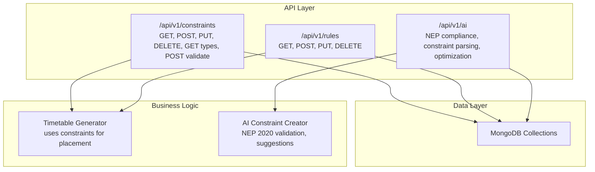
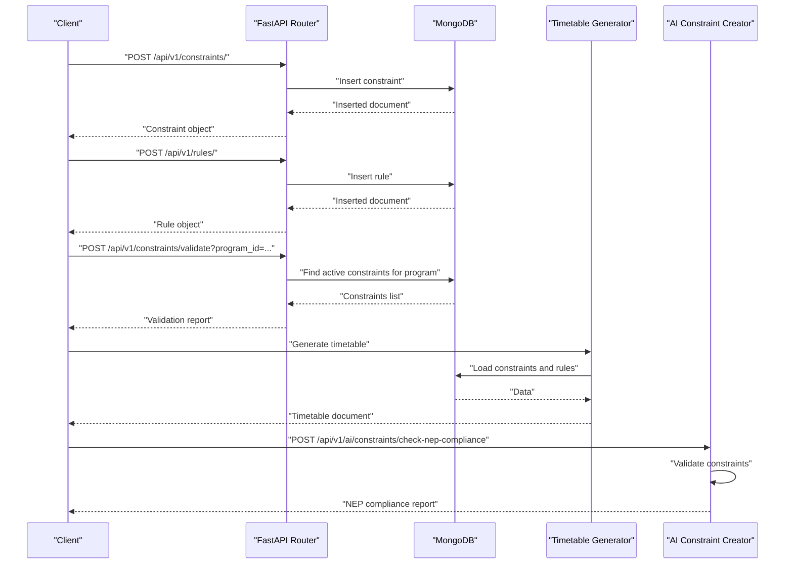
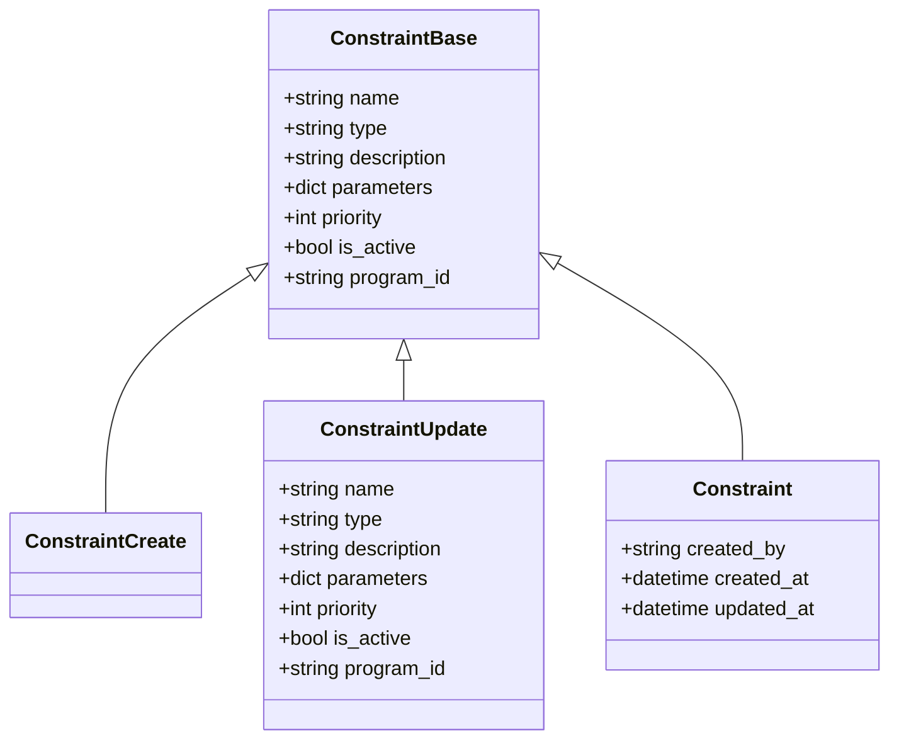
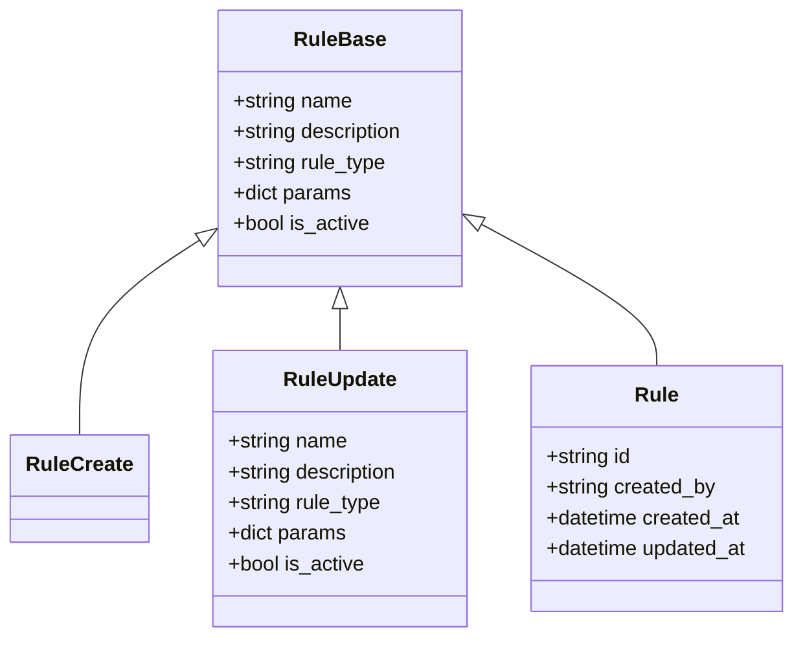
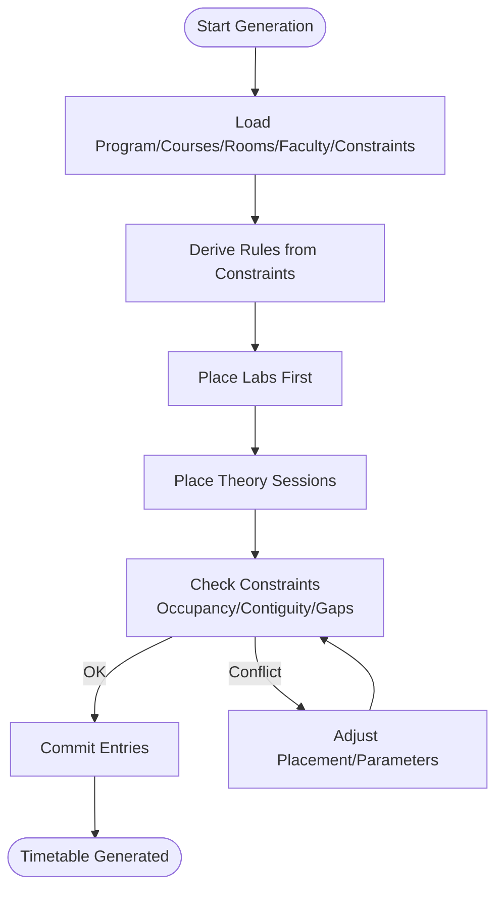
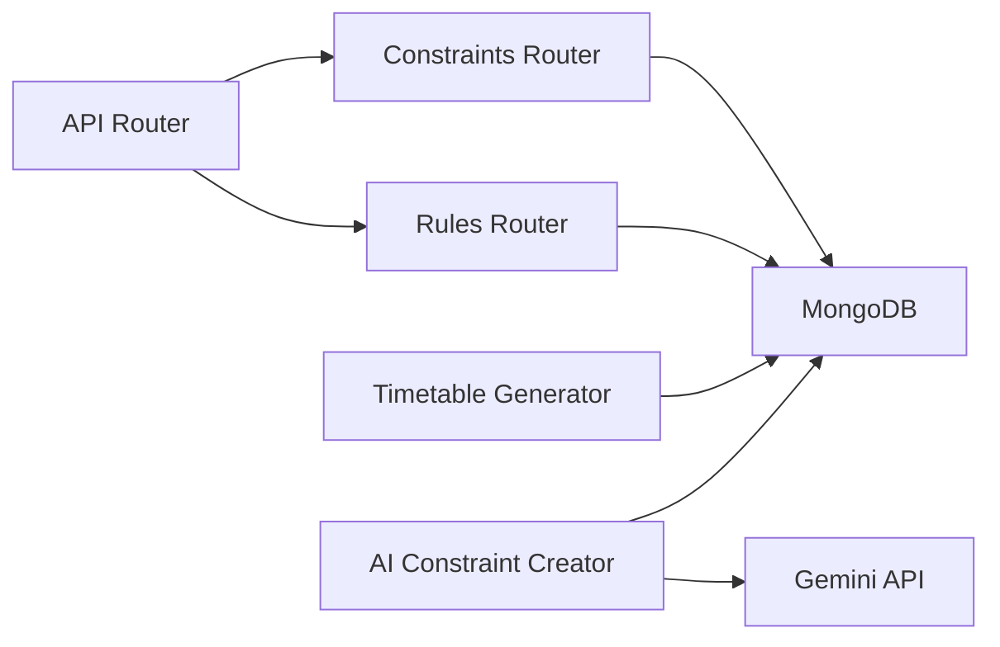

# Constraint and Rules Endpoints

<cite>
**Referenced Files in This Document**
- [constraints.py](file://backend/app/api/v1/endpoints/constraints.py)
- [rules.py](file://backend/app/api/v1/endpoints/rules.py)
- [constraint.py](file://backend/app/models/constraint.py)
- [rule.py](file://backend/app/models/rule.py)
- [api.py](file://backend/app/api/api_v1/api.py)
- [mongodb.py](file://backend/app/db/mongodb.py)
- [generator.py](file://backend/app/services/timetable/generator.py)
- [constraint_creator.py](file://backend/app/services/ai/constraint_creator.py)
- [ai.py](file://backend/app/api/v1/endpoints/ai.py)
</cite>

## Table of Contents
1. [Introduction](#introduction)
2. [Project Structure](#project-structure)
3. [Core Components](#core-components)
4. [Architecture Overview](#architecture-overview)
5. [Detailed Component Analysis](#detailed-component-analysis)
6. [Dependency Analysis](#dependency-analysis)
7. [Performance Considerations](#performance-considerations)
8. [Troubleshooting Guide](#troubleshooting-guide)
9. [Conclusion](#conclusion)

## Introduction
This document provides comprehensive API documentation for the constraint and scheduling rules endpoints under `/api/v1/constraints/` and `/api/v1/rules/`. It covers scheduling constraint definition, rule enforcement, policy management, NEP 2020 compliance, and institutional policies. The documentation details HTTP methods, URL patterns, request/response schemas, validation logic, and integration with timetable generation.

## Project Structure
The constraint and rules APIs are organized as FastAPI routers included in the main API router. Constraints are stored in MongoDB collections and integrated into timetable generation logic. Rules define operational parameters for timetable construction.

**Diagram sources**
- [api.py:31-32](file://backend/app/api/api_v1/api.py#L31-L32)
- [constraints.py:9](file://backend/app/api/v1/endpoints/constraints.py#L9)
- [rules.py:10](file://backend/app/api/v1/endpoints/rules.py#L10)
- [ai.py:12](file://backend/app/api/v1/endpoints/ai.py#L12)

**Section sources**
- [api.py:1-34](file://backend/app/api/api_v1/api.py#L1-L34)

## Core Components
- Constraint model: Defines constraint structure, parameters, priority, and lifecycle fields.
- Rule model: Defines rule structure for operational parameters and metadata.
- Constraints endpoint: CRUD operations, type enumeration, and validation pipeline.
- Rules endpoint: CRUD operations for rule management.
- Timetable generator: Consumes constraints and rules to build timetables.
- AI constraint creator: Parses natural language constraints, validates NEP 2020 compliance, and optimizes constraint sets.

**Section sources**
- [constraint.py:6-30](file://backend/app/models/constraint.py#L6-L30)
- [rule.py:6-34](file://backend/app/models/rule.py#L6-L34)
- [constraints.py:11-189](file://backend/app/api/v1/endpoints/constraints.py#L11-L189)
- [rules.py:13-68](file://backend/app/api/v1/endpoints/rules.py#L13-L68)
- [generator.py:169-233](file://backend/app/services/timetable/generator.py#L169-L233)
- [constraint_creator.py:18-781](file://backend/app/services/ai/constraint_creator.py#L18-L781)

## Architecture Overview
The constraint and rules endpoints integrate with MongoDB for persistence and with the timetable generator for runtime enforcement. AI services augment constraint creation and validation with NEP 2020 compliance checks.

**Diagram sources**
- [constraints.py:47-64](file://backend/app/api/v1/endpoints/constraints.py#L47-L64)
- [rules.py:23-34](file://backend/app/api/v1/endpoints/rules.py#L23-L34)
- [constraints.py:151-189](file://backend/app/api/v1/endpoints/constraints.py#L151-L189)
- [generator.py:169-233](file://backend/app/services/timetable/generator.py#L169-L233)
- [ai.py:250-265](file://backend/app/api/v1/endpoints/ai.py#L250-L265)

## Detailed Component Analysis

### Constraints Endpoints
- Base URL: `/api/v1/constraints`
- Methods:
  - GET `/`: List constraints with pagination and filters
  - GET `/{constraint_id}`: Retrieve a specific constraint
  - POST `/`: Create a new constraint
  - PUT `/{constraint_id}`: Update an existing constraint
  - DELETE `/{constraint_id}`: Delete a constraint
  - GET `/types/`: Enumerate available constraint types and descriptions
  - POST `/validate`: Validate constraints for a program

- Request/Response Schemas:
  - Create/Update body: ConstraintCreate/ConstraintUpdate
  - Response: Constraint (includes metadata like created_by, timestamps)
  - Types endpoint returns a list of constraint types and descriptions
  - Validation endpoint returns a structured report for each constraint

- Permissions:
  - Creation: Requires admin or faculty roles
  - Updates and deletions: Requires admin or ownership by creator

- Filtering and Pagination:
  - Query parameters: skip, limit, constraint_type, is_active, program_id

- Validation Logic:
  - Program existence check before validation
  - Fetches active constraints scoped to program or global
  - Returns overall status and per-constraint results

- Example Use Cases:
  - Faculty availability: Define when a faculty member is available
  - Room capacity limits: Ensure room capacity meets course enrollment
  - Scheduling preferences: Prefer morning or avoid lunch slots

**Section sources**
- [constraints.py:11-189](file://backend/app/api/v1/endpoints/constraints.py#L11-L189)
- [constraint.py:15-30](file://backend/app/models/constraint.py#L15-L30)

#### Constraints Endpoint Class Diagram

**Diagram sources**
- [constraint.py:6-30](file://backend/app/models/constraint.py#L6-L30)

### Rules Endpoints
- Base URL: `/api/v1/rules`
- Methods:
  - GET `/`: List all rules
  - POST `/`: Create a new rule
  - PUT `/{rule_id}`: Update an existing rule
  - DELETE `/{rule_id}`: Delete a rule

- Request/Response Schemas:
  - Create/Update body: RuleCreate/RuleUpdate
  - Response: Rule (includes metadata like created_by, timestamps)

- Lifecycle Management:
  - Created and updated timestamps maintained
  - Ownership tracked via created_by

- Typical Rule Types:
  - Time settings: college start/end times, periods, passing gaps, max periods per day, max contiguous periods
  - Other rule categories can be defined via rule_type and params

**Section sources**
- [rules.py:13-68](file://backend/app/api/v1/endpoints/rules.py#L13-L68)
- [rule.py:6-34](file://backend/app/models/rule.py#L6-L34)

#### Rules Endpoint Class Diagram

**Diagram sources**
- [rule.py:6-34](file://backend/app/models/rule.py#L6-L34)

### NEP 2020 Compliance and Institutional Policies
- AI-driven constraint parsing and optimization:
  - Natural language to structured constraints
  - NEP 2020 area coverage (credit system, multidisciplinary, assessment, skill development, research, faculty workload)
  - Constraint optimization suggestions and conflict detection

- NEP compliance validation:
  - Validates a set of constraints against NEP 2020 guidelines
  - Provides area scores, strengths, gaps, and recommendations

- Integration points:
  - AI endpoint for NEP compliance checks
  - Timetable generator consumes constraints for placement

**Section sources**
- [constraint_creator.py:28-90](file://backend/app/services/ai/constraint_creator.py#L28-L90)
- [constraint_creator.py:536-657](file://backend/app/services/ai/constraint_creator.py#L536-L657)
- [ai.py:250-265](file://backend/app/api/v1/endpoints/ai.py#L250-L265)

### Timetable Generation and Constraint Satisfaction
- Timetable generator loads constraints and builds timetables:
  - Loads program, courses, groups, rooms, faculty, and constraints
  - Applies rules derived from constraints (e.g., time settings)
  - Places labs first, then theory sessions with constraints on occupancy and continuity

- Constraint satisfaction and conflict handling:
  - Occupancy calendars track room, group, and faculty slots
  - Overlap checks prevent conflicts
  - Contiguity checks enforce max contiguous periods and passing gaps
  - Lab windows and max labs per day constraints respected

- Rule precedence:
  - Rules derived from constraints influence slot generation and placement
  - Priority and type-specific parameters guide placement decisions

**Section sources**
- [generator.py:169-233](file://backend/app/services/timetable/generator.py#L169-L233)
- [generator.py:247-272](file://backend/app/services/timetable/generator.py#L247-L272)
- [generator.py:308-379](file://backend/app/services/timetable/generator.py#L308-L379)

#### Timetable Generation Flow

**Diagram sources**
- [generator.py:235-401](file://backend/app/services/timetable/generator.py#L235-L401)

## Dependency Analysis
- API routing:
  - Constraints and rules routers are included under `/api/v1/constraints` and `/api/v1/rules`
- Data persistence:
  - MongoDB collections accessed via shared database client
- Business logic:
  - Timetable generator depends on constraints and rules
  - AI services depend on Gemini API and constraint creator

**Diagram sources**
- [api.py:31-32](file://backend/app/api/api_v1/api.py#L31-L32)
- [mongodb.py:5-41](file://backend/app/db/mongodb.py#L5-L41)

**Section sources**
- [api.py:1-34](file://backend/app/api/api_v1/api.py#L1-L34)
- [mongodb.py:1-41](file://backend/app/db/mongodb.py#L1-L41)

## Performance Considerations
- Pagination and filtering reduce payload sizes for listing endpoints.
- Constraint validation fetches only active constraints scoped to a program or global.
- Timetable generation uses occupancy calendars and overlap checks to prune placements early.
- AI operations (parsing, optimization, NEP validation) are asynchronous and may require external API calls.

## Troubleshooting Guide
- Authentication and permissions:
  - Creation requires admin or faculty roles; updates/deletes require admin or ownership.
- Resource not found:
  - Deleting or updating a non-existent constraint raises a 404 error.
  - Validation requires a valid program ID.
- Database connectivity:
  - MongoDB connection errors are logged; API continues without DB for testing.
- Conflict detection:
  - Use the validation endpoint to identify constraint conflicts before generation.
  - Review NEP compliance report to address gaps.

**Section sources**
- [constraints.py:56-57](file://backend/app/api/v1/endpoints/constraints.py#L56-L57)
- [constraints.py:76-83](file://backend/app/api/v1/endpoints/constraints.py#L76-L83)
- [constraints.py:102-109](file://backend/app/api/v1/endpoints/constraints.py#L102-L109)
- [constraints.py:160-162](file://backend/app/api/v1/endpoints/constraints.py#L160-L162)
- [mongodb.py:28-32](file://backend/app/db/mongodb.py#L28-L32)

## Conclusion
The constraint and rules endpoints provide a robust foundation for defining scheduling policies, enforcing institutional rules, and ensuring NEP 2020 compliance. Together with the timetable generator and AI services, they enable automated, validated, and optimized timetable creation tailored to academic programs.