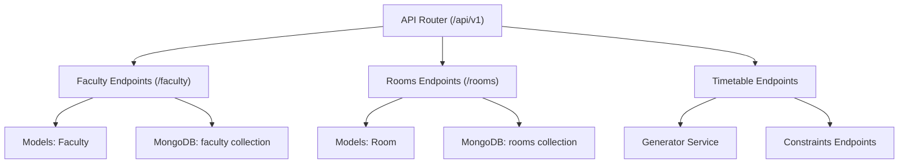
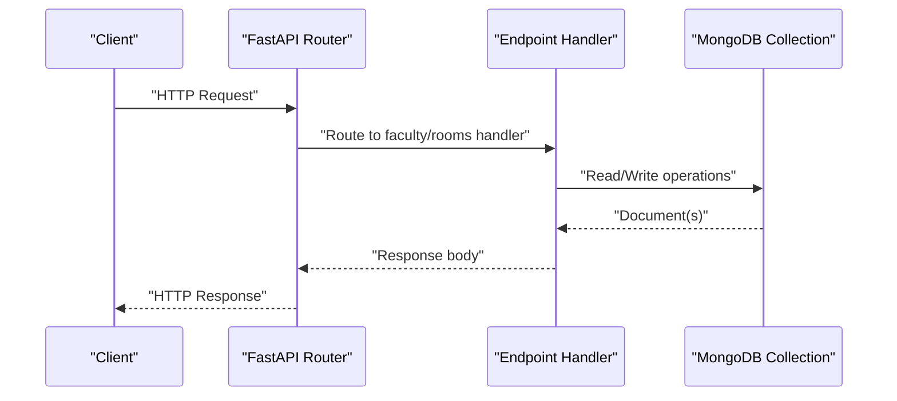
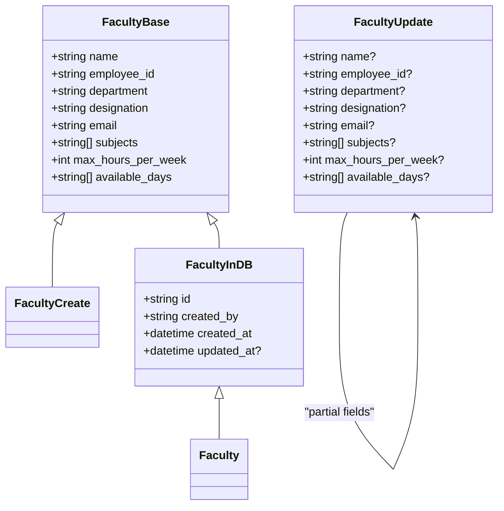
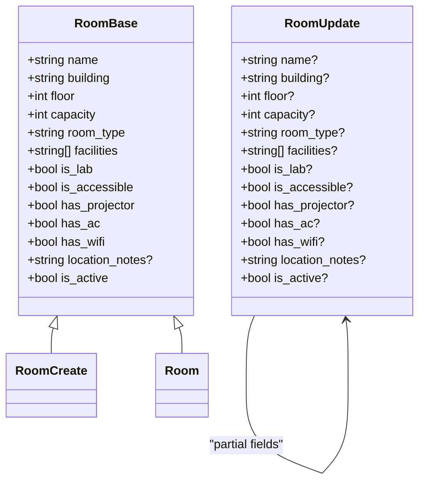
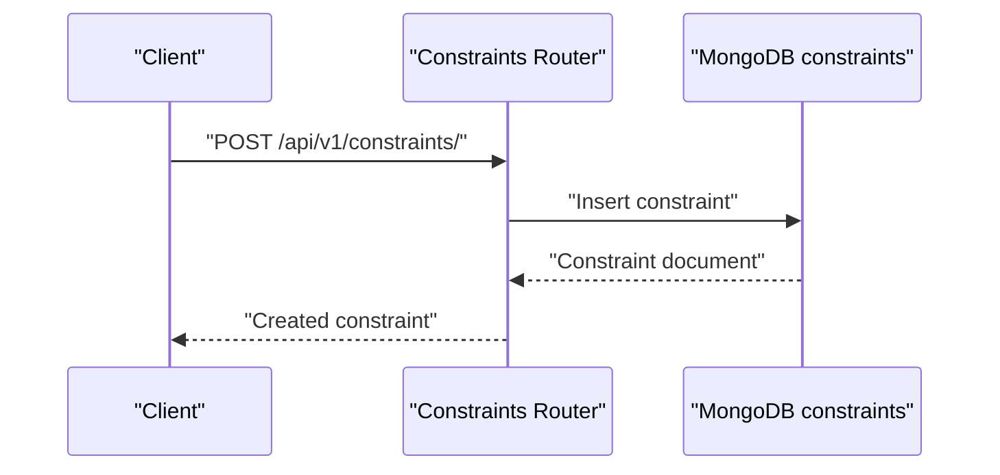
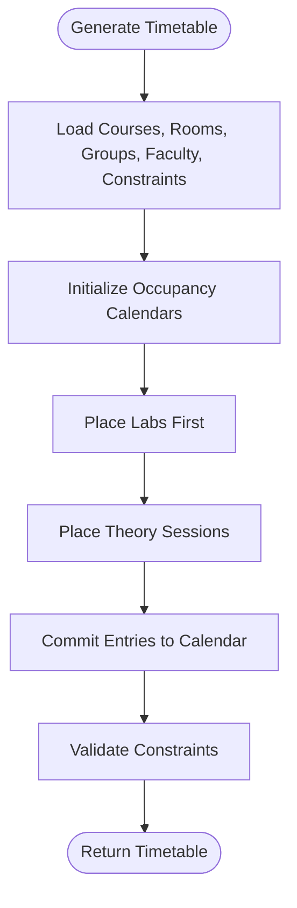
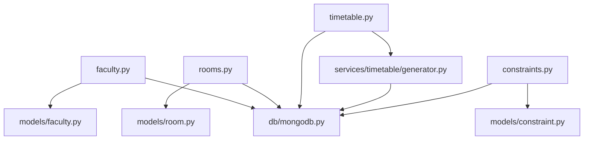

# Faculty and Room Management Endpoints

<cite>
**Referenced Files in This Document**
- [api.py](file://backend/app/api/api_v1/api.py)
- [faculty.py](file://backend/app/api/v1/endpoints/faculty.py)
- [rooms.py](file://backend/app/api/v1/endpoints/rooms.py)
- [faculty.py](file://backend/app/models/faculty.py)
- [room.py](file://backend/app/models/room.py)
- [mongodb.py](file://backend/app/db/mongodb.py)
- [timetable.py](file://backend/app/api/v1/endpoints/timetable.py)
- [generator.py](file://backend/app/services/timetable/generator.py)
- [constraints.py](file://backend/app/api/v1/endpoints/constraints.py)
- [course.py](file://backend/app/api/v1/endpoints/courses.py)
- [constraint.py](file://backend/app/models/constraint.py)
- [user.py](file://backend/app/models/user.py)
</cite>

## Table of Contents
1. [Introduction](#introduction)
2. [Project Structure](#project-structure)
3. [Core Components](#core-components)
4. [Architecture Overview](#architecture-overview)
5. [Detailed Component Analysis](#detailed-component-analysis)
6. [Dependency Analysis](#dependency-analysis)
7. [Performance Considerations](#performance-considerations)
8. [Troubleshooting Guide](#troubleshooting-guide)
9. [Conclusion](#conclusion)
10. [Appendices](#appendices)

## Introduction
This document provides comprehensive API documentation for faculty and room management endpoints under the base path /api/v1/. It covers:
- Faculty endpoints for listing, creating, retrieving, updating, and deleting faculty records
- Room endpoints for listing, creating, updating, and soft-deleting rooms with filtering capabilities
- Integration with scheduling constraints and timetable generation
- Request validation rules, scheduling constraints, and conflict detection
- Examples for faculty assignment to courses, room booking for classes, and capacity planning
- Time slot management, resource conflict resolution, and facility maintenance considerations

## Project Structure
The API is organized under a versioned router that mounts endpoint groups for faculty and rooms, among others. The faculty and rooms endpoints are defined in dedicated modules and use shared models and database utilities.

**Diagram sources**
- [api.py:26-28](file://backend/app/api/api_v1/api.py#L26-L28)
- [faculty.py:1-265](file://backend/app/api/v1/endpoints/faculty.py#L1-L265)
- [rooms.py:1-258](file://backend/app/api/v1/endpoints/rooms.py#L1-L258)
- [mongodb.py:1-41](file://backend/app/db/mongodb.py#L1-L41)

**Section sources**
- [api.py:1-34](file://backend/app/api/api_v1/api.py#L1-L34)

## Core Components
- Faculty endpoints: GET /, POST /, GET /{faculty_id}, PUT /{faculty_id}, DELETE /{faculty_id}
- Room endpoints: GET /, POST /, PUT /{room_id}, DELETE /{room_id}
- Shared models define request/response schemas for faculty and rooms
- MongoDB integration via a shared database client
- Timetable generation integrates faculty and room data with scheduling constraints

**Section sources**
- [faculty.py:13-265](file://backend/app/api/v1/endpoints/faculty.py#L13-L265)
- [rooms.py:12-258](file://backend/app/api/v1/endpoints/rooms.py#L12-L258)
- [faculty.py:5-39](file://backend/app/models/faculty.py#L5-L39)
- [room.py:6-43](file://backend/app/models/room.py#L6-L43)
- [mongodb.py:11-41](file://backend/app/db/mongodb.py#L11-L41)

## Architecture Overview
The faculty and room APIs are mounted under /api/v1 and use Pydantic models for validation. Requests are processed by FastAPI routers and persisted to MongoDB collections. Timetable generation consumes faculty and room data along with constraints to produce schedules.

**Diagram sources**
- [api.py:26-28](file://backend/app/api/api_v1/api.py#L26-L28)
- [faculty.py:13-265](file://backend/app/api/v1/endpoints/faculty.py#L13-L265)
- [rooms.py:12-258](file://backend/app/api/v1/endpoints/rooms.py#L12-L258)
- [mongodb.py:11-41](file://backend/app/db/mongodb.py#L11-L41)

## Detailed Component Analysis

### Faculty Endpoints

#### Endpoint: GET /api/v1/faculty/
- Method: GET
- Description: Retrieves all faculty members from the database
- Authentication: Requires a current user context
- Response: Array of faculty documents with ObjectId fields converted to strings
- Notes: No filtering applied; returns all records

**Section sources**
- [faculty.py:13-41](file://backend/app/api/v1/endpoints/faculty.py#L13-L41)

#### Endpoint: POST /api/v1/faculty/
- Method: POST
- Description: Creates a new faculty member
- Request Body: FacultyCreate schema
- Validation:
  - Unique employee_id per creator
  - Required fields enforced by model
- Response: Created faculty document with metadata
- Error Handling:
  - Duplicate employee_id
  - Internal server errors

**Section sources**
- [faculty.py:43-98](file://backend/app/api/v1/endpoints/faculty.py#L43-L98)
- [faculty.py:15-16](file://backend/app/models/faculty.py#L15-L16)

#### Endpoint: GET /api/v1/faculty/{faculty_id}
- Method: GET
- Path Parameter: faculty_id (ObjectID)
- Description: Retrieves a specific faculty member by ID
- Validation:
  - Validates ObjectID format
  - Ensures record belongs to current user
- Response: Single faculty document

**Section sources**
- [faculty.py:100-137](file://backend/app/api/v1/endpoints/faculty.py#L100-L137)

#### Endpoint: PUT /api/v1/faculty/{faculty_id}
- Method: PUT
- Path Parameter: faculty_id (ObjectID)
- Request Body: Partial updates via FacultyUpdate schema
- Validation:
  - Validates ObjectID format
  - Prevents duplicate employee_id if updated
  - Rejects requests with no valid fields
- Response: Updated faculty document

**Section sources**
- [faculty.py:139-222](file://backend/app/api/v1/endpoints/faculty.py#L139-L222)
- [faculty.py:18-26](file://backend/app/models/faculty.py#L18-L26)

#### Endpoint: DELETE /api/v1/faculty/{faculty_id}
- Method: DELETE
- Path Parameter: faculty_id (ObjectID)
- Description: Deletes a faculty member
- Validation:
  - Validates ObjectID format
  - Ensures record belongs to current user
- Response: Deletion confirmation message

**Section sources**
- [faculty.py:224-265](file://backend/app/api/v1/endpoints/faculty.py#L224-L265)

#### Faculty Data Model

**Diagram sources**
- [faculty.py:5-39](file://backend/app/models/faculty.py#L5-L39)

### Room Endpoints

#### Endpoint: GET /api/v1/rooms/
- Method: GET
- Query Parameters:
  - building (string, optional)
  - room_type (string, optional)
  - min_capacity (integer, optional)
- Description: Lists rooms with optional filters; returns all by default
- Response: Array of room dictionaries with ObjectIds converted to strings

**Section sources**
- [rooms.py:12-51](file://backend/app/api/v1/endpoints/rooms.py#L12-L51)

#### Endpoint: POST /api/v1/rooms/
- Method: POST
- Request Body: RoomCreate schema
- Validation:
  - Unique room name per building
  - Required fields enforced by model
- Response: Created room document with metadata

**Section sources**
- [rooms.py:58-115](file://backend/app/api/v1/endpoints/rooms.py#L58-L115)
- [room.py:21-22](file://backend/app/models/room.py#L21-L22)

#### Endpoint: PUT /api/v1/rooms/{room_id}
- Method: PUT
- Path Parameter: room_id (string)
- Request Body: RoomUpdate schema
- Validation:
  - Validates ObjectID format
  - Prevents duplicate room name per building if updated
  - Ignores unset fields
- Response: Updated room document

**Section sources**
- [rooms.py:118-206](file://backend/app/api/v1/endpoints/rooms.py#L118-L206)
- [room.py:24-37](file://backend/app/models/room.py#L24-L37)

#### Endpoint: DELETE /api/v1/rooms/{room_id}
- Method: DELETE
- Path Parameter: room_id (string)
- Description: Soft deletes a room by marking it inactive
- Response: Deletion confirmation message

**Section sources**
- [rooms.py:209-257](file://backend/app/api/v1/endpoints/rooms.py#L209-L257)

#### Room Data Model

**Diagram sources**
- [room.py:6-43](file://backend/app/models/room.py#L6-L43)

### Scheduling Constraints and Timetable Integration
- Constraints endpoint supports listing, creating, updating, deleting, and validating constraints
- Constraint types include faculty availability, room capacity, time preferences, and more
- Timetable generation loads faculty and room data and applies constraints to produce schedules

**Diagram sources**
- [constraints.py:47-64](file://backend/app/api/v1/endpoints/constraints.py#L47-L64)

**Section sources**
- [constraints.py:11-189](file://backend/app/api/v1/endpoints/constraints.py#L11-L189)
- [constraint.py:6-30](file://backend/app/models/constraint.py#L6-L30)
- [timetable.py:234-264](file://backend/app/api/v1/endpoints/timetable.py#L234-L264)
- [generator.py:169-233](file://backend/app/services/timetable/generator.py#L169-L233)

### Time Slot Management and Conflict Resolution
- The generator defines atomic time slots, lunch breaks, and lab windows
- Occupancy calendars track room, group, and faculty availability
- Conflict detection prevents overlapping bookings for the same resource in the same time slot

**Diagram sources**
- [generator.py:235-401](file://backend/app/services/timetable/generator.py#L235-L401)

**Section sources**
- [generator.py:86-147](file://backend/app/services/timetable/generator.py#L86-L147)
- [generator.py:247-272](file://backend/app/services/timetable/generator.py#L247-L272)

## Dependency Analysis
- Faculty endpoints depend on:
  - Authentication middleware for current user
  - MongoDB client for faculty collection
  - Faculty models for validation
- Room endpoints depend on:
  - Authentication middleware for current user
  - MongoDB client for rooms collection
  - Room models for validation
- Timetable generation depends on:
  - Faculty and room collections
  - Constraints collection
  - Generator service for slot allocation and conflict checks

**Diagram sources**
- [faculty.py:1-265](file://backend/app/api/v1/endpoints/faculty.py#L1-L265)
- [rooms.py:1-258](file://backend/app/api/v1/endpoints/rooms.py#L1-L258)
- [timetable.py:1-728](file://backend/app/api/v1/endpoints/timetable.py#L1-L728)
- [generator.py:1-402](file://backend/app/services/timetable/generator.py#L1-L402)
- [constraints.py:1-189](file://backend/app/api/v1/endpoints/constraints.py#L1-L189)

**Section sources**
- [mongodb.py:11-41](file://backend/app/db/mongodb.py#L11-L41)

## Performance Considerations
- Query filtering for rooms uses regex matching; consider indexing building and room_type for large datasets
- Faculty and room retrieval returns all documents by default; prefer pagination and filtering in production
- Timetable generation iterates over slots and resources; ensure adequate constraints and indexes for optimal performance
- Soft deletion for rooms avoids data loss but increases collection size; periodic cleanup recommended

[No sources needed since this section provides general guidance]

## Troubleshooting Guide
Common issues and resolutions:
- Invalid ObjectID format:
  - Faculty: Ensure faculty_id is a valid ObjectId
  - Rooms: Ensure room_id is a valid ObjectId
- Duplicate identifiers:
  - Faculty: employee_id must be unique per creator
  - Rooms: room name must be unique per building
- Not found errors:
  - Faculty/Rooms: Record may not belong to the current user or does not exist
- Permission errors:
  - Constraints: Only admins or creators can modify constraints
- Validation failures:
  - Respect model constraints (e.g., capacity bounds, hours limits)

**Section sources**
- [faculty.py:109-113](file://backend/app/api/v1/endpoints/faculty.py#L109-L113)
- [rooms.py:129-135](file://backend/app/api/v1/endpoints/rooms.py#L129-L135)
- [rooms.py:67-77](file://backend/app/api/v1/endpoints/rooms.py#L67-L77)
- [constraints.py:56-57](file://backend/app/api/v1/endpoints/constraints.py#L56-L57)

## Conclusion
The faculty and room management endpoints provide robust CRUD operations with strong validation and integration into the scheduling pipeline. By leveraging constraints and the timetable generator, institutions can manage faculty workload, room capacity, and equipment availability effectively while resolving scheduling conflicts automatically.

[No sources needed since this section summarizes without analyzing specific files]

## Appendices

### Example Workflows

#### Faculty Assignment to Courses
- Create a course via courses endpoint
- Ensure faculty subjects include the course code or name
- Generate timetable; the generator maps courses to eligible faculty based on subjects

**Section sources**
- [course.py:12-55](file://backend/app/api/v1/endpoints/courses.py#L12-L55)
- [generator.py:210-221](file://backend/app/services/timetable/generator.py#L210-L221)
- [timetable.py:234-264](file://backend/app/api/v1/endpoints/timetable.py#L234-L264)

#### Room Booking for Classes
- Filter rooms by capacity and type
- Confirm room availability via timetable occupancy calendars
- Generate timetable to allocate rooms to sessions

**Section sources**
- [rooms.py:12-51](file://backend/app/api/v1/endpoints/rooms.py#L12-L51)
- [generator.py:240-242](file://backend/app/services/timetable/generator.py#L240-L242)

#### Capacity Planning Scenarios
- Use GET /api/v1/rooms with min_capacity to identify undersized rooms
- Adjust course enrollment or split groups accordingly
- Re-run timetable generation to rebalance allocations

**Section sources**
- [rooms.py:14-51](file://backend/app/api/v1/endpoints/rooms.py#L14-L51)
- [timetable.py:266-375](file://backend/app/api/v1/endpoints/timetable.py#L266-L375)

### Request Validation Summary
- FacultyCreate: Enforces presence of name, employee_id, department, designation, email, max_hours_per_week bounds, and available_days
- RoomCreate: Enforces presence of name, building, floor bounds, capacity bounds, room_type, facilities, accessibility flags, and is_active

**Section sources**
- [faculty.py:15-16](file://backend/app/models/faculty.py#L15-L16)
- [room.py:21-22](file://backend/app/models/room.py#L21-L22)