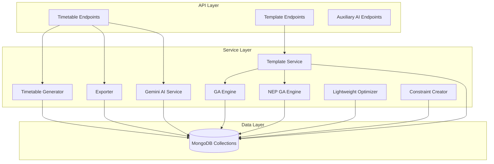
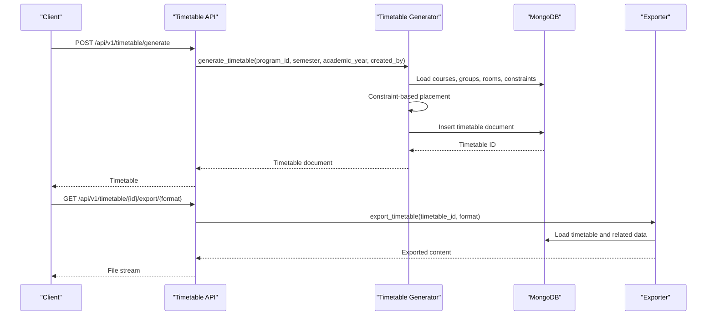
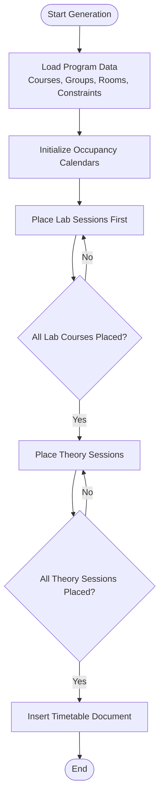
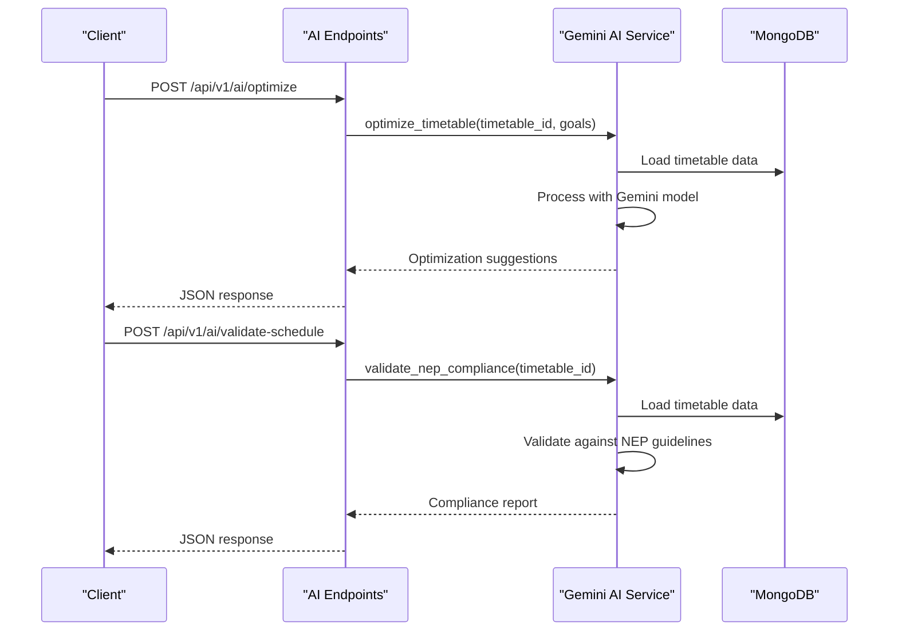
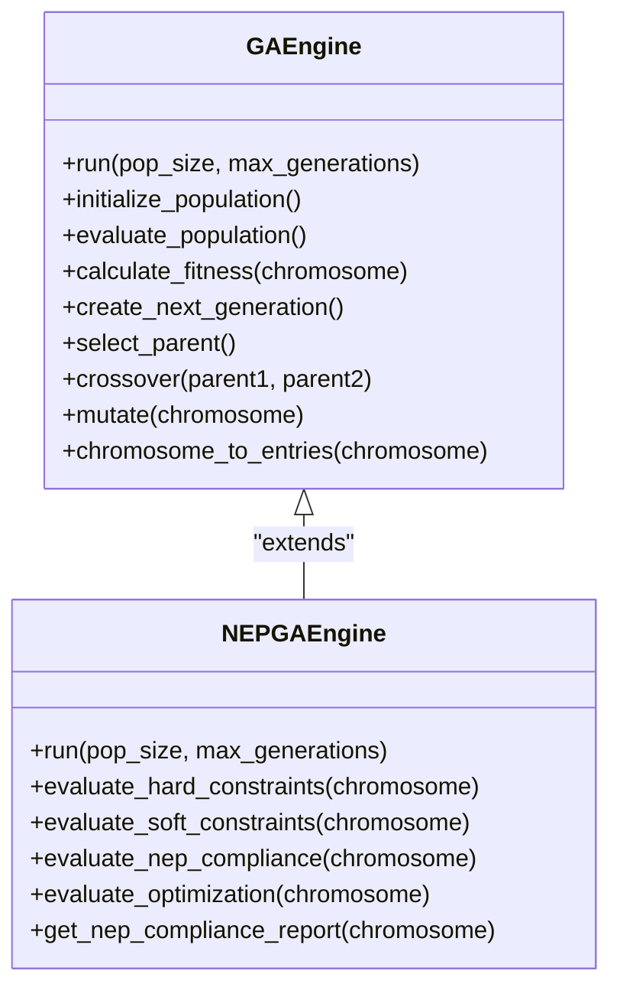
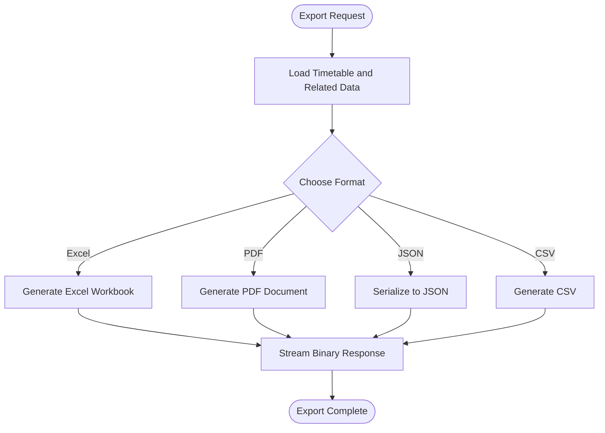
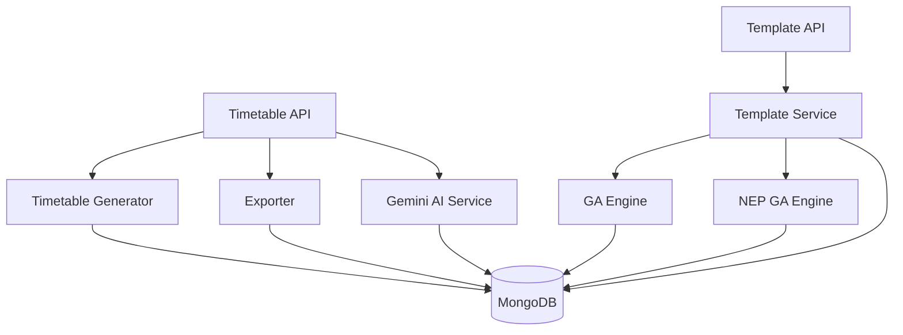

# Timetable Generation Endpoints

<cite>
**Referenced Files in This Document**
- [timetable.py](file://backend/app/api/v1/endpoints/timetable.py)
- [timetable_templates.py](file://backend/app/api/v1/endpoints/timetable_templates.py)
- [generator.py](file://backend/app/services/timetable/generator.py)
- [template_service.py](file://backend/app/services/timetable/template_service.py)
- [ga_engine.py](file://backend/app/services/timetable/ga_engine.py)
- [nep_ga_engine.py](file://backend/app/services/timetable/nep_ga_engine.py)
- [exporter.py](file://backend/app/services/timetable/exporter.py)
- [gemini.py](file://backend/app/services/ai/gemini.py)
- [optimizer.py](file://backend/app/services/ai/optimizer.py)
- [constraint_creator.py](file://backend/app/services/ai/constraint_creator.py)
- [timetable.py](file://backend/app/models/timetable.py)
</cite>

## Table of Contents
1. [Introduction](#introduction)
2. [Project Structure](#project-structure)
3. [Core Components](#core-components)
4. [Architecture Overview](#architecture-overview)
5. [Detailed Component Analysis](#detailed-component-analysis)
6. [Dependency Analysis](#dependency-analysis)
7. [Performance Considerations](#performance-considerations)
8. [Troubleshooting Guide](#troubleshooting-guide)
9. [Conclusion](#conclusion)

## Introduction
This document provides comprehensive API documentation for timetable generation and management endpoints. It covers the `/api/v1/timetable/` and `/api/v1/timetable-templates/` endpoint groups, detailing timetable creation, modification, validation, and template management. It explains constraint-based generation, AI-assisted optimization, template-based creation, and batch processing capabilities. The documentation includes request validation, template selection, conflict resolution, examples of timetable generation with different algorithms, template application, and export operations. It also documents timetable review processes, approval workflows, and version management, along with performance considerations for large-scale generation, memory optimization, and parallel processing capabilities.

## Project Structure
The timetable generation system is organized around FastAPI routers that expose REST endpoints, backed by service layers implementing constraint-based generation, AI optimization, and template management. The key components include:
- Endpoint routers for timetable and template operations
- Service generators for constraint-based and AI-assisted generation
- Genetic Algorithm engines for optimization
- Exporters for multiple output formats
- AI services for natural language processing and NEP 2020 compliance validation

**Diagram sources**
- [timetable.py](file://backend/app/api/v1/endpoints/timetable.py)
- [timetable_templates.py](file://backend/app/api/v1/endpoints/timetable_templates.py)
- [generator.py](file://backend/app/services/timetable/generator.py)
- [template_service.py](file://backend/app/services/timetable/template_service.py)
- [ga_engine.py](file://backend/app/services/timetable/ga_engine.py)
- [nep_ga_engine.py](file://backend/app/services/timetable/nep_ga_engine.py)
- [exporter.py](file://backend/app/services/timetable/exporter.py)
- [gemini.py](file://backend/app/services/ai/gemini.py)
- [optimizer.py](file://backend/app/services/ai/optimizer.py)
- [constraint_creator.py](file://backend/app/services/ai/constraint_creator.py)

**Section sources**
- [timetable.py](file://backend/app/api/v1/endpoints/timetable.py)
- [timetable_templates.py](file://backend/app/api/v1/endpoints/timetable_templates.py)

## Core Components
This section outlines the primary components involved in timetable generation and management:
- Timetable endpoints: CRUD operations, generation, optimization, validation, and export
- Template endpoints: Template-based generation and management
- Generators: Constraint-based and AI-assisted generation
- Engines: Genetic Algorithm implementations for optimization
- Exporters: Multi-format export functionality
- AI services: Natural language processing, NEP 2020 validation, and constraint optimization
- Models: Pydantic models defining request/response schemas

Key responsibilities:
- Timetable endpoints enforce user isolation and handle filtering, pagination, and export
- Template service manages template creation, normalization of overrides, and GA-based allocation
- Generators implement constraint-based placement and time slot calculations
- Engines optimize schedules using genetic algorithms with multi-objective fitness
- Exporters produce Excel, PDF, JSON, and CSV outputs
- AI services provide NEP 2020 compliance checks and constraint suggestions
- Models define strict schemas for request validation

**Section sources**
- [timetable.py](file://backend/app/api/v1/endpoints/timetable.py)
- [timetable_templates.py](file://backend/app/api/v1/endpoints/timetable_templates.py)
- [generator.py](file://backend/app/services/timetable/generator.py)
- [template_service.py](file://backend/app/services/timetable/template_service.py)
- [ga_engine.py](file://backend/app/services/timetable/ga_engine.py)
- [nep_ga_engine.py](file://backend/app/services/timetable/nep_ga_engine.py)
- [exporter.py](file://backend/app/services/timetable/exporter.py)
- [gemini.py](file://backend/app/services/ai/gemini.py)
- [optimizer.py](file://backend/app/services/ai/optimizer.py)
- [constraint_creator.py](file://backend/app/services/ai/constraint_creator.py)
- [timetable.py](file://backend/app/models/timetable.py)

## Architecture Overview
The system follows a layered architecture:
- API layer: FastAPI routers exposing endpoints with user authentication and authorization
- Service layer: Business logic for generation, optimization, template management, and export
- Data layer: MongoDB collections storing timetables, templates, constraints, and related entities
- AI layer: Gemini-based services for natural language processing and NEP 2020 validation

**Diagram sources**
- [timetable.py](file://backend/app/api/v1/endpoints/timetable.py)
- [generator.py](file://backend/app/services/timetable/generator.py)
- [exporter.py](file://backend/app/services/timetable/exporter.py)

## Detailed Component Analysis

### Timetable Endpoints
The `/api/v1/timetable/` endpoints provide comprehensive timetable lifecycle management:
- GET `/`: Retrieve paginated and filtered timetables with user isolation
- GET `/{id}`: Fetch a specific timetable with ownership verification
- POST `/`: Create an empty timetable
- POST `/draft`: Save or update draft timetables with partial data
- POST `/generate`: AI-assisted constraint-based generation
- POST `/generate-advanced`: Template-based generation with GA optimization
- POST `/generate-nep-ga`: NEP 2020 compliant genetic algorithm generation
- PUT `/{id}`: Update timetable metadata and entries
- DELETE `/{id}`: Delete timetable with ownership verification
- GET `/{id}/export/{format}`: Export timetable in multiple formats
- POST `/{id}/optimize`: AI optimization of existing timetable
- POST `/{id}/validate`: Constraint validation of timetable

Security measures:
- All endpoints filter by `created_by` to ensure user isolation
- Ownership verification prevents cross-user access
- Validation ensures required fields are present for generation requests

Request/response schemas:
- Request models: TimetableCreate, TimetableUpdate
- Response models: Timetable with embedded entries and metadata
- Export responses: Streamed binary content or JSON

Generation algorithms:
- Constraint-based generator: Places labs first, then theory with projector requirements
- Template-based generator: Uses GA engine to allocate sessions optimally
- NEP GA engine: Multi-objective optimization with NEP 2020 compliance

Conflict resolution:
- Hard constraints: No faculty/room/group conflicts
- Soft constraints: Capacity, timing preferences, and workload balance
- NEP compliance: Practical/theory ratios, faculty workload limits

**Section sources**
- [timetable.py](file://backend/app/api/v1/endpoints/timetable.py)
- [timetable.py](file://backend/app/models/timetable.py)

### Timetable Templates Endpoints
The `/api/v1/timetable-templates/` endpoints manage template-based timetable generation:
- POST `/generate-from-template`: Generate timetable from template with optional overrides
- Template management: Get, create, update, delete templates
- Override support: Courses, student groups, rooms, and faculty overrides

Template service features:
- Normalization of overrides for consistent processing
- Default template creation based on active rules
- Application of templates to create optimized timetables via GA
- Object ID conversion for JSON serialization

**Section sources**
- [timetable_templates.py](file://backend/app/api/v1/endpoints/timetable_templates.py)
- [template_service.py](file://backend/app/services/timetable/template_service.py)

### Constraint-Based Generation
The constraint-based generator implements a two-phase placement algorithm:
1. Lab sessions: Place labs within designated windows, respecting capacity and subgroup limits
2. Theory sessions: Place lectures with projector requirements, double-period preferences, and workload constraints

Rules and constraints:
- Time settings: Start/end times, lunch breaks, period durations, passing gaps
- Maximum periods per day and contiguous periods
- Lab session restrictions and windows
- Faculty and room availability constraints

**Diagram sources**
- [generator.py](file://backend/app/services/timetable/generator.py)

**Section sources**
- [generator.py](file://backend/app/services/timetable/generator.py)

### AI-Assisted Optimization
AI services enhance timetable generation and validation:
- Gemini AI integration for natural language processing
- NEP 2020 compliance validation and suggestions
- Constraint optimization and parsing from natural language
- Lightweight optimization scoring for schedule quality

**Diagram sources**
- [ai.py](file://backend/app/api/v1/endpoints/ai.py)
- [gemini.py](file://backend/app/services/ai/gemini.py)

**Section sources**
- [ai.py](file://backend/app/api/v1/endpoints/ai.py)
- [gemini.py](file://backend/app/services/ai/gemini.py)
- [optimizer.py](file://backend/app/services/ai/optimizer.py)
- [constraint_creator.py](file://backend/app/services/ai/constraint_creator.py)

### Template-Based Generation and GA Optimization
Template-based generation leverages a genetic algorithm to allocate sessions optimally:
- Chromosome representation: Gene includes course, group, faculty, room, day, and slot
- Fitness function: Balances hard constraints, soft constraints, and optimization objectives
- Operators: Swap, insertion, inversion, and attribute mutations
- Selection: Tournament selection with elitism preservation

**Diagram sources**
- [ga_engine.py](file://backend/app/services/timetable/ga_engine.py)
- [nep_ga_engine.py](file://backend/app/services/timetable/nep_ga_engine.py)

**Section sources**
- [template_service.py](file://backend/app/services/timetable/template_service.py)
- [ga_engine.py](file://backend/app/services/timetable/ga_engine.py)
- [nep_ga_engine.py](file://backend/app/services/timetable/nep_ga_engine.py)

### Export Operations
Export functionality supports multiple formats with tailored presentation:
- Excel: Formatted worksheets with merged headers and styled cells
- PDF: Landscape layout with tables and metadata
- JSON: Structured timetable data with related entities
- CSV: Tabular format for external tools

**Diagram sources**
- [exporter.py](file://backend/app/services/timetable/exporter.py)

**Section sources**
- [exporter.py](file://backend/app/services/timetable/exporter.py)

## Dependency Analysis
The system exhibits clear separation of concerns with minimal coupling between components:
- API endpoints depend on service layers, not directly on data models
- Services encapsulate business logic and database interactions
- Engines and exporters are self-contained with minimal external dependencies
- AI services rely on configuration and external APIs

**Diagram sources**
- [timetable.py](file://backend/app/api/v1/endpoints/timetable.py)
- [timetable_templates.py](file://backend/app/api/v1/endpoints/timetable_templates.py)
- [generator.py](file://backend/app/services/timetable/generator.py)
- [template_service.py](file://backend/app/services/timetable/template_service.py)
- [ga_engine.py](file://backend/app/services/timetable/ga_engine.py)
- [nep_ga_engine.py](file://backend/app/services/timetable/nep_ga_engine.py)
- [exporter.py](file://backend/app/services/timetable/exporter.py)
- [gemini.py](file://backend/app/services/ai/gemini.py)

**Section sources**
- [timetable.py](file://backend/app/api/v1/endpoints/timetable.py)
- [timetable_templates.py](file://backend/app/api/v1/endpoints/timetable_templates.py)
- [generator.py](file://backend/app/services/timetable/generator.py)
- [template_service.py](file://backend/app/services/timetable/template_service.py)
- [ga_engine.py](file://backend/app/services/timetable/ga_engine.py)
- [nep_ga_engine.py](file://backend/app/services/timetable/nep_ga_engine.py)
- [exporter.py](file://backend/app/services/timetable/exporter.py)
- [gemini.py](file://backend/app/services/ai/gemini.py)

## Performance Considerations
Large-scale generation and optimization require careful attention to performance:
- Memory optimization: Use streaming responses for exports, process data in chunks, and avoid loading unnecessary collections
- Parallel processing: Consider concurrent generation for multiple programs or semesters, with rate limiting and resource pooling
- Algorithm tuning: Adjust population sizes and generation counts based on dataset scale; implement early stopping criteria
- Database optimization: Index frequently queried fields (program_id, semester, academic_year), use aggregation pipelines where beneficial
- Caching: Cache frequently accessed templates and constraints to reduce database load
- Batch operations: Support batch generation and export operations for institutional scale deployments

## Troubleshooting Guide
Common issues and resolutions:
- Authentication failures: Verify API key configuration for AI services and ensure user context is properly established
- Data inconsistencies: Validate that required collections (courses, rooms, faculty, constraints) are populated before generation
- Export errors: Check file format availability and ensure required libraries (WeasyPrint for PDF) are installed
- Performance bottlenecks: Monitor database query performance, adjust GA parameters, and implement pagination for large datasets
- Template conflicts: Review template overrides and ensure consistency between courses, groups, rooms, and faculty mappings

**Section sources**
- [timetable.py](file://backend/app/api/v1/endpoints/timetable.py)
- [timetable_templates.py](file://backend/app/api/v1/endpoints/timetable_templates.py)
- [exporter.py](file://backend/app/services/timetable/exporter.py)

## Conclusion
The timetable generation system provides a robust, extensible foundation for automated academic scheduling. Its layered architecture enables clear separation of concerns, while constraint-based and AI-assisted generation approaches offer flexibility and quality optimization. Template management and export capabilities support diverse institutional needs, and performance considerations ensure scalability for large deployments. The integration of NEP 2020 compliance and natural language processing further enhances usability and adherence to educational guidelines.