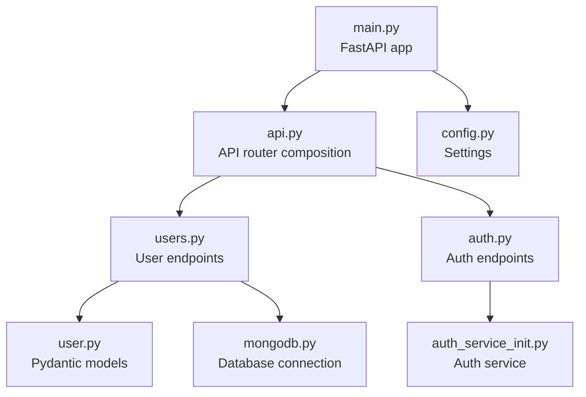
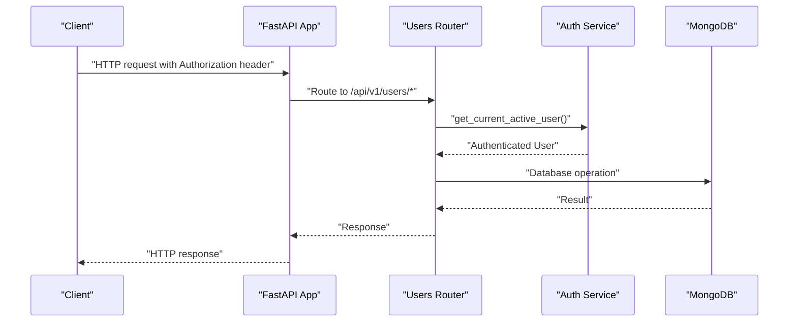
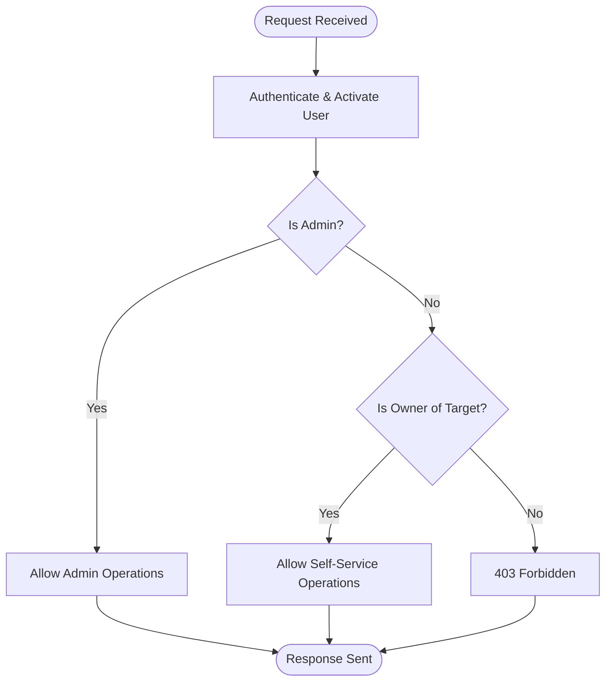
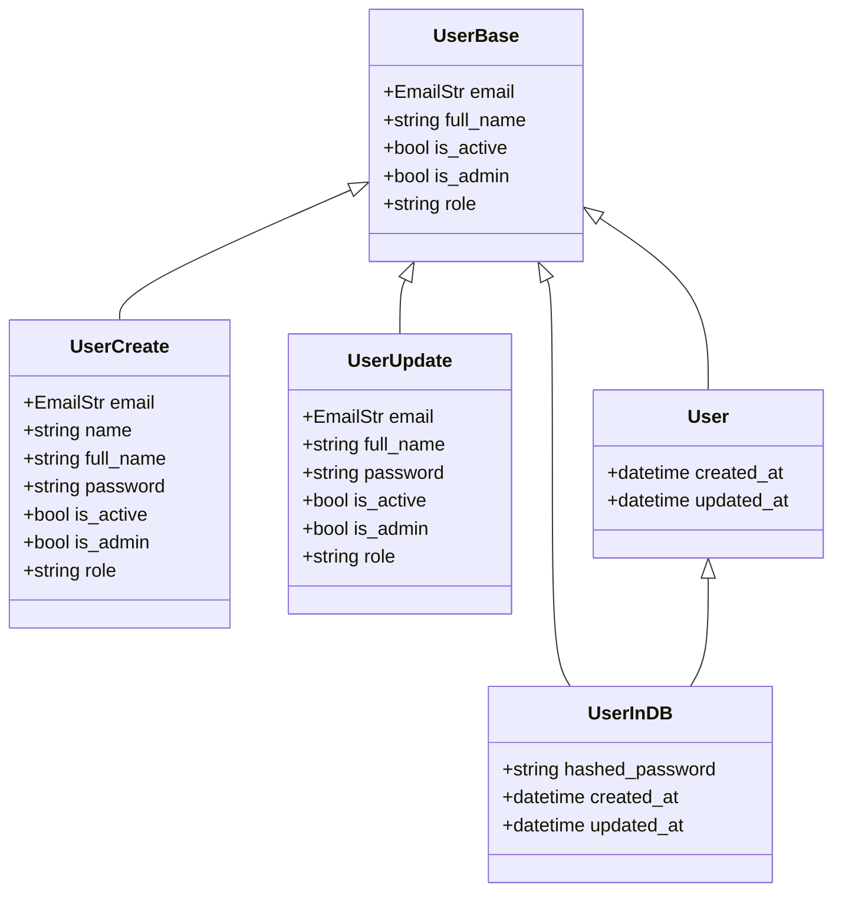
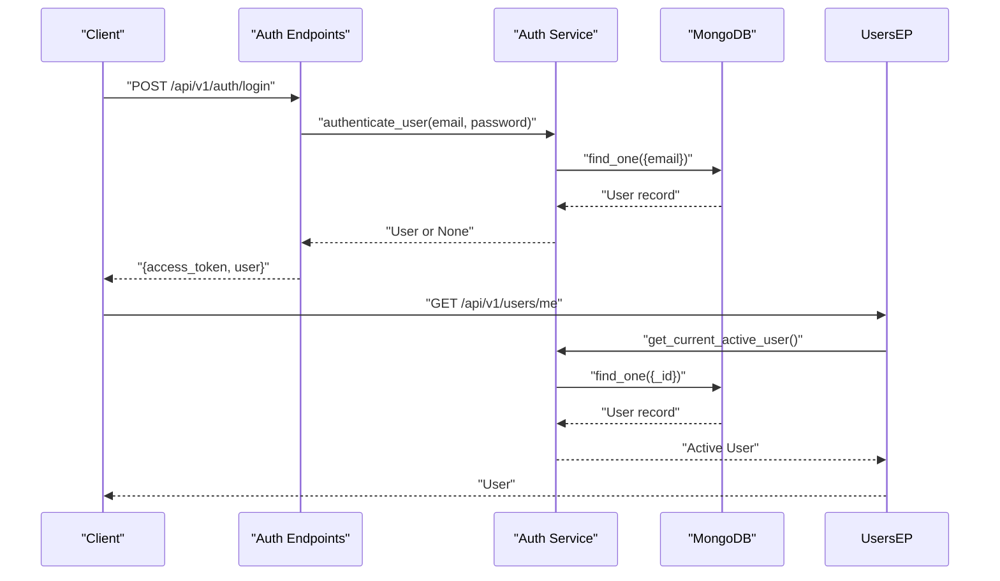
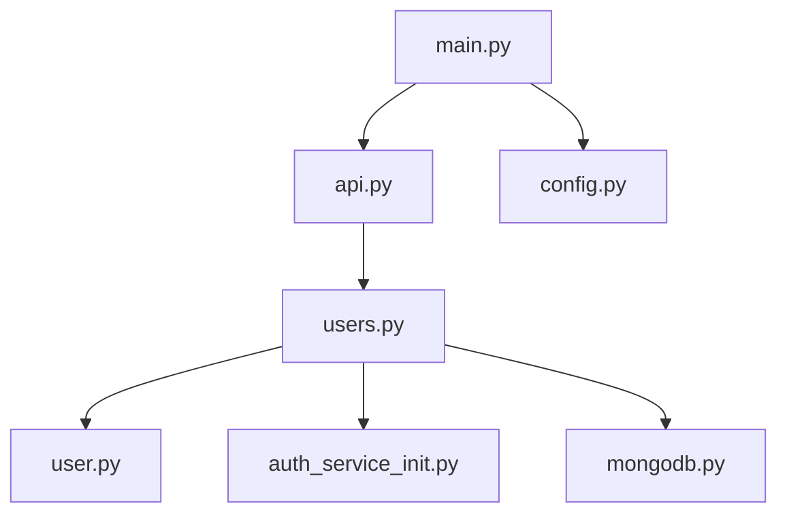

# User Management Endpoints

<cite>
**Referenced Files in This Document**
- [users.py](file://backend/app/api/v1/endpoints/users.py)
- [user.py](file://backend/app/models/user.py)
- [api.py](file://backend/app/api/api_v1/api.py)
- [main.py](file://backend/app/main.py)
- [mongodb.py](file://backend/app/db/mongodb.py)
- [config.py](file://backend/app/core/config.py)
- [auth.py](file://backend/app/api/v1/endpoints/auth.py)
- [auth_service_init.py](file://backend/app/services/auth/__init__.py)
- [create_admin_user.py](file://backend/create_admin_user.py)
- [test_endpoints.py](file://test_endpoints.py)
</cite>

## Table of Contents
1. [Introduction](#introduction)
2. [Project Structure](#project-structure)
3. [Core Components](#core-components)
4. [Architecture Overview](#architecture-overview)
5. [Detailed Component Analysis](#detailed-component-analysis)
6. [Dependency Analysis](#dependency-analysis)
7. [Performance Considerations](#performance-considerations)
8. [Troubleshooting Guide](#troubleshooting-guide)
9. [Conclusion](#conclusion)

## Introduction
This document provides comprehensive API documentation for the user management endpoints under the base path /api/v1/users/. It covers user CRUD operations, profile management, and administrative functions. For each endpoint, it specifies HTTP methods, URL patterns, request/response schemas, and required permissions. It also details role-based access control, admin-only operations, user self-service capabilities, request validation rules, response formatting, error handling for duplicates, invalid permissions, and data integrity violations. Examples include user creation by administrators, profile updates by users, and listing users with pagination. Bulk operations and data export are not implemented in the current codebase.

## Project Structure
The user management module is organized as follows:
- Endpoint router: backend/app/api/v1/endpoints/users.py
- Pydantic models: backend/app/models/user.py
- API router composition: backend/app/api/api_v1/api.py
- Application entrypoint and middleware: backend/app/main.py
- Database connection: backend/app/db/mongodb.py
- Configuration: backend/app/core/config.py
- Authentication endpoints and services: backend/app/api/v1/endpoints/auth.py and backend/app/services/auth/__init__.py
- Administrative user creation script: backend/create_admin_user.py
- Endpoint testing harness: test_endpoints.py

**Diagram sources**
- [main.py:1-102](file://backend/app/main.py#L1-L102)
- [api.py:1-34](file://backend/app/api/api_v1/api.py#L1-L34)
- [users.py:1-123](file://backend/app/api/v1/endpoints/users.py#L1-L123)
- [user.py:1-76](file://backend/app/models/user.py#L1-L76)
- [mongodb.py:1-41](file://backend/app/db/mongodb.py#L1-L41)
- [config.py:1-61](file://backend/app/core/config.py#L1-L61)
- [auth.py:1-123](file://backend/app/api/v1/endpoints/auth.py#L1-L123)
- [auth_service_init.py:1-190](file://backend/app/services/auth/__init__.py#L1-L190)

**Section sources**
- [main.py:1-102](file://backend/app/main.py#L1-L102)
- [api.py:1-34](file://backend/app/api/api_v1/api.py#L1-L34)

## Core Components
- User endpoint router: Defines GET /, GET /me, GET /{user_id}, POST /, PUT /{user_id}, and DELETE /{user_id}.
- Pydantic models: Define User, UserCreate, UserUpdate, and UserInDB schemas with validation rules.
- Authentication service: Provides token-based authentication, user retrieval, and admin checks.
- Database layer: Async MongoDB integration via Motor.
- API composition: Mounts the users router under /api/v1/users with tags for OpenAPI documentation.

Key permissions and roles:
- is_admin flag controls administrative actions.
- Self-service access allows users to manage their own profiles.
- Non-admin users cannot list, create, update, or delete other users.

Pagination:
- GET / supports skip and limit query parameters with enforced bounds.

Validation:
- UserCreate enforces either name or full_name presence.
- Email uniqueness is enforced during creation.
- Validation errors return structured 422 responses.

**Section sources**
- [users.py:11-123](file://backend/app/api/v1/endpoints/users.py#L11-L123)
- [user.py:27-76](file://backend/app/models/user.py#L27-L76)
- [auth_service_init.py:137-156](file://backend/app/services/auth/__init__.py#L137-L156)
- [mongodb.py:11-41](file://backend/app/db/mongodb.py#L11-L41)
- [api.py:22](file://backend/app/api/api_v1/api.py#L22)
- [main.py:41-54](file://backend/app/main.py#L41-L54)

## Architecture Overview
The user management endpoints are protected by JWT-based authentication middleware and validated by Pydantic models. Requests flow through the FastAPI application, which delegates to the users router. The router enforces role-based access control and interacts with MongoDB for persistence.

**Diagram sources**
- [main.py:101](file://backend/app/main.py#L101)
- [users.py:11-123](file://backend/app/api/v1/endpoints/users.py#L11-L123)
- [auth_service_init.py:91-144](file://backend/app/services/auth/__init__.py#L91-L144)
- [mongodb.py:11-41](file://backend/app/db/mongodb.py#L11-L41)

## Detailed Component Analysis

### Endpoint Catalog
- Base path: /api/v1/users
- Tags: Users

Endpoints:
- GET /
  - Description: List all users with pagination.
  - Permissions: Admin-only.
  - Query parameters: skip (integer, default 0, >=0), limit (integer, default 100, 1-1000).
  - Response: Array of User objects.
  - Errors: 403 Forbidden if not admin; 422 Unprocessable Entity for invalid parameters.

- GET /me
  - Description: Retrieve the current authenticated user’s profile.
  - Permissions: Authenticated user required.
  - Response: User object.
  - Errors: 401 Unauthorized if invalid/missing token; 400 Bad Request if inactive.

- GET /{user_id}
  - Description: Retrieve a specific user by ID.
  - Permissions: Admin OR owner of the target user.
  - Path parameter: user_id (string, ObjectId).
  - Response: User object.
  - Errors: 403 Forbidden if insufficient permissions; 404 Not Found if user does not exist.

- POST /
  - Description: Create a new user.
  - Permissions: Admin-only.
  - Request body: UserCreate (email, optional name/full_name, password, optional flags).
  - Response: User object.
  - Errors: 400 Bad Request if email already exists; 403 Forbidden if not admin; 422 Unprocessable Entity for validation failures.

- PUT /{user_id}
  - Description: Update a user’s profile.
  - Permissions: Admin OR owner of the target user.
  - Path parameter: user_id (string, ObjectId).
  - Request body: UserUpdate (partial fields allowed).
  - Response: User object.
  - Errors: 403 Forbidden if insufficient permissions; 404 Not Found if user does not exist.

- DELETE /{user_id}
  - Description: Delete a user.
  - Permissions: Admin-only.
  - Path parameter: user_id (string, ObjectId).
  - Response: Success message.
  - Errors: 403 Forbidden if not admin; 404 Not Found if user does not exist.

Request validation rules:
- UserCreate requires either name or full_name; email must be unique.
- UserUpdate accepts partial fields; password updates are allowed.
- Pagination parameters skip and limit are validated to bounds.

Response formatting:
- Responses use Pydantic models; ObjectId fields are serialized as strings.
- Errors return structured JSON with detail and body information.

Error handling:
- Duplicate email: 400 Bad Request on POST /.
- Insufficient permissions: 403 Forbidden on GET /{user_id}, POST /, PUT /{user_id}, DELETE /{user_id}.
- Not found: 404 Not Found on GET /{user_id} and DELETE /{user_id} when user does not exist.
- Validation failures: 422 Unprocessable Entity with detailed errors.

Examples:
- Admin creates a user:
  - Method: POST /api/v1/users/
  - Headers: Authorization: Bearer <admin_token>
  - Body: { "email": "...", "full_name": "...", "password": "..." }
  - Expected: 200 OK with User object.

- User updates their profile:
  - Method: PUT /api/v1/users/{own_user_id}
  - Headers: Authorization: Bearer <user_token>
  - Body: { "full_name": "Updated Name" }
  - Expected: 200 OK with updated User object.

- Admin lists users with pagination:
  - Method: GET /api/v1/users/?skip=0&limit=20
  - Headers: Authorization: Bearer <admin_token>
  - Expected: 200 OK with array of User objects.

Bulk operations and export:
- Not implemented in the current codebase.

**Section sources**
- [users.py:11-123](file://backend/app/api/v1/endpoints/users.py#L11-L123)
- [user.py:39-65](file://backend/app/models/user.py#L39-L65)
- [auth_service_init.py:137-156](file://backend/app/services/auth/__init__.py#L137-L156)
- [main.py:41-54](file://backend/app/main.py#L41-L54)

### Role-Based Access Control
- Admin-only operations:
  - GET / (list all users)
  - POST / (create user)
  - DELETE /{user_id} (delete user)
- Self-service operations:
  - GET /me (view own profile)
  - GET /{user_id} (view profile; owner or admin)
  - PUT /{user_id} (update profile; owner or admin)

**Diagram sources**
- [users.py:21-88](file://backend/app/api/v1/endpoints/users.py#L21-L88)
- [auth_service_init.py:137-156](file://backend/app/services/auth/__init__.py#L137-L156)

**Section sources**
- [users.py:21-88](file://backend/app/api/v1/endpoints/users.py#L21-L88)
- [auth_service_init.py:137-156](file://backend/app/services/auth/__init__.py#L137-L156)

### Data Models

**Diagram sources**
- [user.py:27-76](file://backend/app/models/user.py#L27-L76)

**Section sources**
- [user.py:27-76](file://backend/app/models/user.py#L27-L76)

### Authentication and Authorization Flow

**Diagram sources**
- [auth.py:29-64](file://backend/app/api/v1/endpoints/auth.py#L29-L64)
- [auth_service_init.py:62-88](file://backend/app/services/auth/__init__.py#L62-L88)
- [auth_service_init.py:91-144](file://backend/app/services/auth/__init__.py#L91-L144)
- [users.py:27-34](file://backend/app/api/v1/endpoints/users.py#L27-L34)

**Section sources**
- [auth.py:29-64](file://backend/app/api/v1/endpoints/auth.py#L29-L64)
- [auth_service_init.py:62-88](file://backend/app/services/auth/__init__.py#L62-L88)
- [auth_service_init.py:91-144](file://backend/app/services/auth/__init__.py#L91-L144)
- [users.py:27-34](file://backend/app/api/v1/endpoints/users.py#L27-L34)

## Dependency Analysis
- The users router depends on:
  - Pydantic models for request/response validation.
  - Authentication service for user identity and permissions.
  - MongoDB for persistence.
- The API router mounts the users router under /api/v1/users.
- The main application sets up CORS and global validation error handling.

**Diagram sources**
- [users.py:1-123](file://backend/app/api/v1/endpoints/users.py#L1-L123)
- [user.py:1-76](file://backend/app/models/user.py#L1-L76)
- [auth_service_init.py:1-190](file://backend/app/services/auth/__init__.py#L1-L190)
- [mongodb.py:1-41](file://backend/app/db/mongodb.py#L1-L41)
- [api.py:22](file://backend/app/api/api_v1/api.py#L22)
- [main.py:101](file://backend/app/main.py#L101)
- [config.py:1-61](file://backend/app/core/config.py#L1-L61)

**Section sources**
- [users.py:1-123](file://backend/app/api/v1/endpoints/users.py#L1-L123)
- [api.py:22](file://backend/app/api/api_v1/api.py#L22)
- [main.py:101](file://backend/app/main.py#L101)

## Performance Considerations
- Pagination limits: The GET / endpoint enforces a maximum page size and minimum/maximum bounds for skip and limit, preventing excessive memory usage.
- Asynchronous database operations: Motor is used for non-blocking I/O with MongoDB.
- Token verification: JWT decoding occurs on each request; caching tokens client-side reduces repeated authentication overhead.
- Validation overhead: Pydantic validation adds safety but may increase latency for large payloads.

[No sources needed since this section provides general guidance]

## Troubleshooting Guide
Common issues and resolutions:
- 401 Unauthorized:
  - Cause: Invalid or missing Authorization header.
  - Resolution: Obtain a valid access token via /api/v1/auth/login and include Bearer <token>.
- 403 Forbidden:
  - Cause: Non-admin user attempting admin-only operation or accessing another user’s profile without ownership.
  - Resolution: Authenticate as admin or ensure you are editing your own profile.
- 404 Not Found:
  - Cause: User ID does not exist.
  - Resolution: Verify the user ID or check database records.
- 400 Bad Request:
  - Duplicate email on POST /: Ensure unique email address.
  - Inactive user on login: Activate the user account.
- 422 Unprocessable Entity:
  - Cause: Validation errors in request body.
  - Resolution: Review required fields and data types per UserCreate/UserUpdate.

Administrative setup:
- Create an admin user using the provided script to enable admin-only operations.

**Section sources**
- [users.py:21-122](file://backend/app/api/v1/endpoints/users.py#L21-L122)
- [auth_service_init.py:141-144](file://backend/app/services/auth/__init__.py#L141-L144)
- [create_admin_user.py:1-46](file://backend/create_admin_user.py#L1-L46)
- [main.py:41-54](file://backend/app/main.py#L41-L54)

## Conclusion
The user management endpoints provide a secure, role-based interface for user CRUD operations with robust validation and error handling. Admins can manage all users, while authenticated users can manage their own profiles. Pagination ensures scalable listing, and JWT-based authentication secures all operations. Bulk operations and export are not currently implemented; future enhancements could include filtering/sorting and export endpoints.