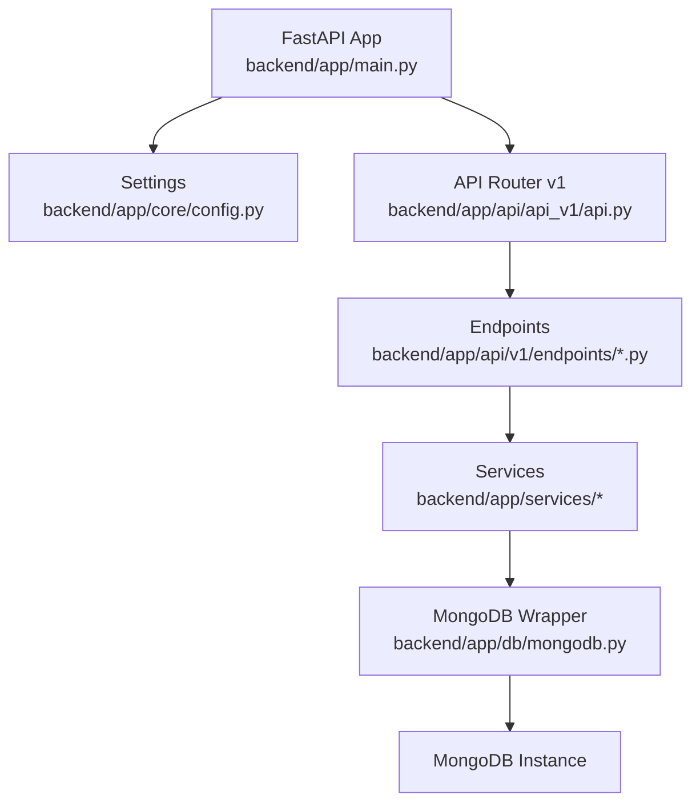
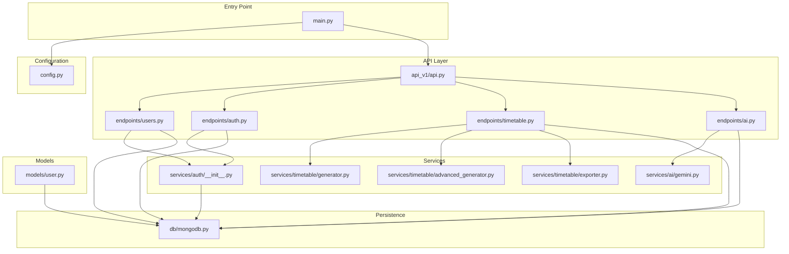
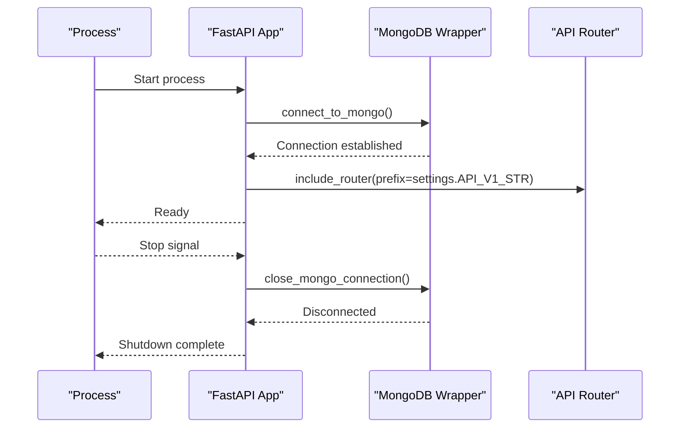
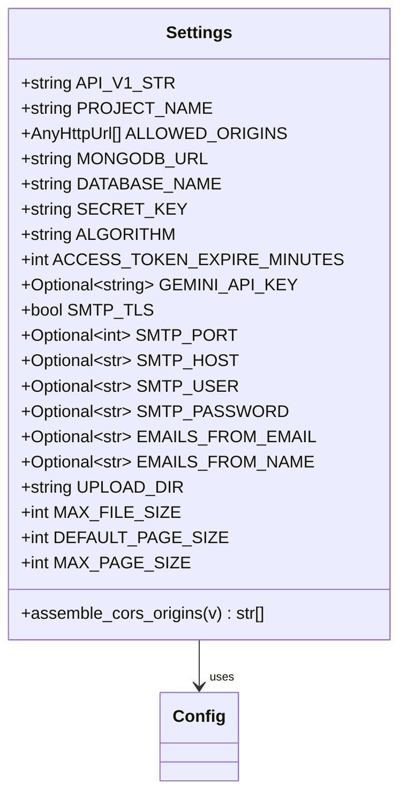
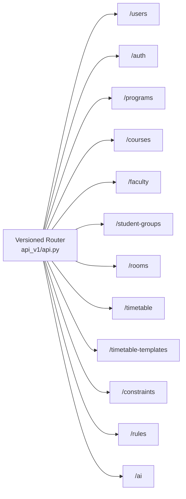
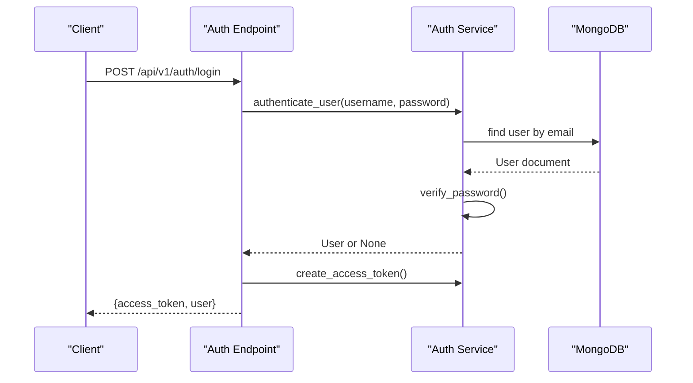
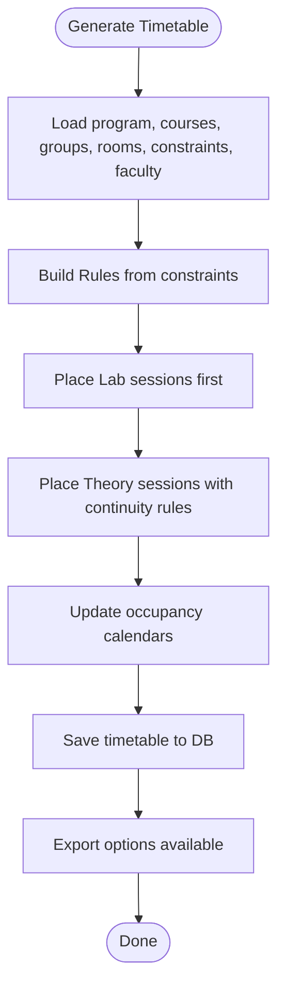
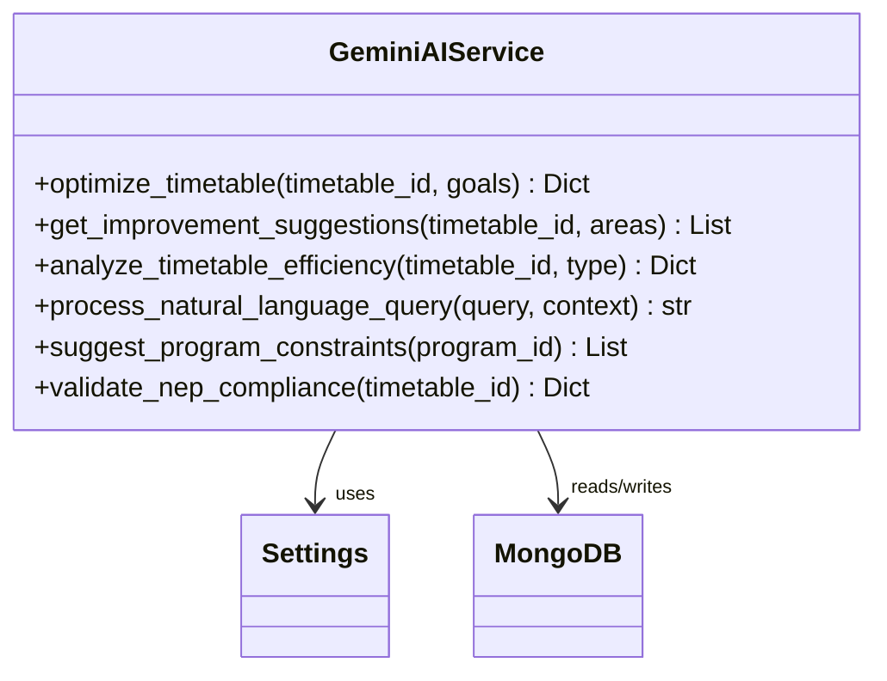
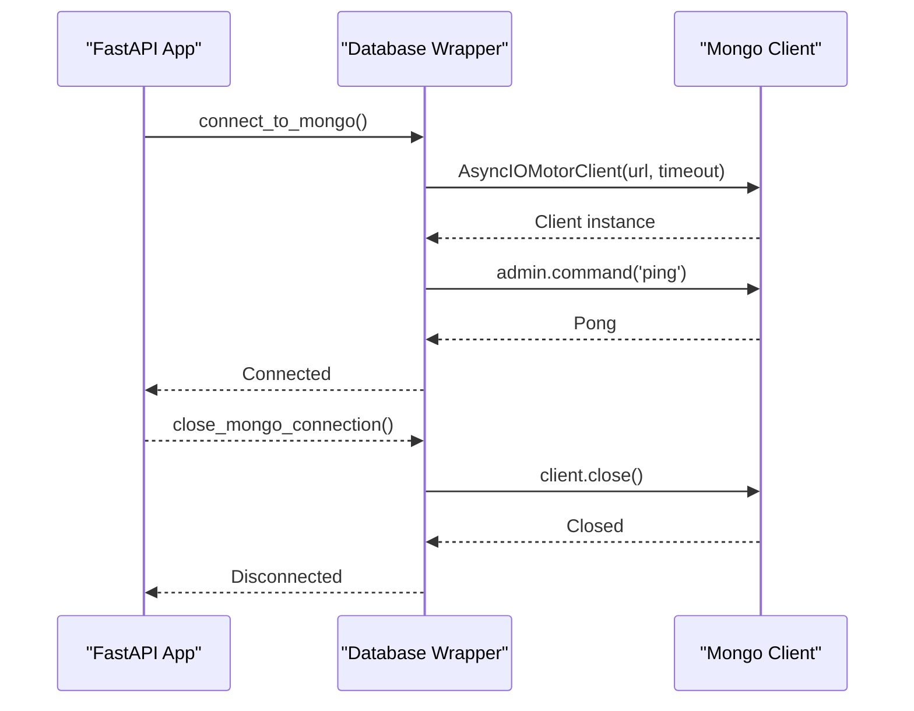
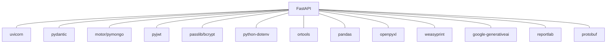

# Application Structure

<cite>
**Referenced Files in This Document**
- [main.py](file://backend/app/main.py)
- [config.py](file://backend/app/core/config.py)
- [api.py](file://backend/app/api/api_v1/api.py)
- [mongodb.py](file://backend/app/db/mongodb.py)
- [users.py](file://backend/app/api/v1/endpoints/users.py)
- [auth.py](file://backend/app/api/v1/endpoints/auth.py)
- [timetable.py](file://backend/app/api/v1/endpoints/timetable.py)
- [ai.py](file://backend/app/api/v1/endpoints/ai.py)
- [user.py](file://backend/app/models/user.py)
- [__init__.py](file://backend/app/services/auth/__init__.py)
- [generator.py](file://backend/app/services/timetable/generator.py)
- [gemini.py](file://backend/app/services/ai/gemini.py)
- [requirements.txt](file://backend/requirements.txt)
</cite>

## Table of Contents
1. [Introduction](#introduction)
2. [Project Structure](#project-structure)
3. [Core Components](#core-components)
4. [Architecture Overview](#architecture-overview)
5. [Detailed Component Analysis](#detailed-component-analysis)
6. [Dependency Analysis](#dependency-analysis)
7. [Performance Considerations](#performance-considerations)
8. [Troubleshooting Guide](#troubleshooting-guide)
9. [Conclusion](#conclusion)
10. [Appendices](#appendices)

## Introduction
This document describes the ShedMaster backend application structure built with FastAPI. It covers application initialization, configuration management, modular API routing, startup/shutdown lifecycle, middleware registration, dependency injection patterns, and the project organization. It also provides guidance on extending the application with new modules while maintaining architectural consistency, along with error handling, logging, and performance monitoring recommendations.

## Project Structure
The backend follows a layered, feature-based organization:
- Entry point initializes the FastAPI application, registers middleware, and mounts the versioned API router.
- Configuration is centralized via a settings class loaded from environment variables.
- API routing is organized under a versioned namespace with feature-specific routers.
- Data access is abstracted behind a MongoDB client wrapper.
- Business logic is split into service modules (authentication, timetable generation, AI assistance).
- Pydantic models define request/response schemas and BSON interoperability.

**Diagram sources**
- [main.py:33-101](file://backend/app/main.py#L33-L101)
- [config.py:7-61](file://backend/app/core/config.py#L7-L61)
- [api.py:3-34](file://backend/app/api/api_v1/api.py#L3-L34)
- [mongodb.py:5-41](file://backend/app/db/mongodb.py#L5-L41)

**Section sources**
- [main.py:1-102](file://backend/app/main.py#L1-L102)
- [config.py:1-61](file://backend/app/core/config.py#L1-L61)
- [api.py:1-34](file://backend/app/api/api_v1/api.py#L1-L34)
- [mongodb.py:1-41](file://backend/app/db/mongodb.py#L1-L41)

## Core Components
- FastAPI Application Initialization: Creates the ASGI app with metadata, CORS middleware, custom exception handlers, health checks, and includes the versioned API router.
- Configuration Management: Centralized settings class loads environment variables and exposes typed configuration for API, database, security, AI, email, file storage, and pagination.
- Modular API Routing: A versioned router aggregates feature routers grouped by domain (users, auth, programs, courses, timetable, constraints, rules, rooms, faculty, student groups, AI).
- Database Access: A lightweight wrapper around Motor client manages connection lifecycle and provides a shared database handle.
- Authentication Services: JWT-based authentication, password hashing, token creation, and current user retrieval with dependency injection.
- Timetable Generation: Constraint-based generator and advanced engines for NEP-compliant scheduling.
- AI Integration: Gemini-based services for optimization, suggestions, analysis, and NEP compliance validation.

**Section sources**
- [main.py:25-101](file://backend/app/main.py#L25-L101)
- [config.py:7-61](file://backend/app/core/config.py#L7-L61)
- [api.py:3-34](file://backend/app/api/api_v1/api.py#L3-L34)
- [mongodb.py:5-41](file://backend/app/db/mongodb.py#L5-L41)
- [auth.py:1-123](file://backend/app/api/v1/endpoints/auth.py#L1-L123)
- [users.py:1-123](file://backend/app/api/v1/endpoints/users.py#L1-L123)
- [timetable.py:1-728](file://backend/app/api/v1/endpoints/timetable.py#L1-L728)
- [ai.py:1-362](file://backend/app/api/v1/endpoints/ai.py#L1-L362)
- [generator.py:163-402](file://backend/app/services/timetable/generator.py#L163-L402)
- [gemini.py:9-288](file://backend/app/services/ai/gemini.py#L9-L288)

## Architecture Overview
The system uses a clean separation of concerns:
- Entry point configures the app and lifecycle.
- Versioned API routes encapsulate feature domains.
- Services orchestrate business logic and interact with the database.
- Models define data contracts and BSON compatibility.
- Middleware handles cross-cutting concerns like CORS and validation.

**Diagram sources**
- [main.py:33-101](file://backend/app/main.py#L33-L101)
- [config.py:7-61](file://backend/app/core/config.py#L7-L61)
- [api.py:3-34](file://backend/app/api/api_v1/api.py#L3-L34)
- [users.py:1-123](file://backend/app/api/v1/endpoints/users.py#L1-L123)
- [auth.py:1-123](file://backend/app/api/v1/endpoints/auth.py#L1-L123)
- [timetable.py:1-728](file://backend/app/api/v1/endpoints/timetable.py#L1-L728)
- [ai.py:1-362](file://backend/app/api/v1/endpoints/ai.py#L1-L362)
- [__init__.py:1-190](file://backend/app/services/auth/__init__.py#L1-L190)
- [generator.py:163-402](file://backend/app/services/timetable/generator.py#L163-L402)
- [gemini.py:9-288](file://backend/app/services/ai/gemini.py#L9-L288)
- [mongodb.py:5-41](file://backend/app/db/mongodb.py#L5-L41)
- [user.py:1-76](file://backend/app/models/user.py#L1-L76)

## Detailed Component Analysis

### FastAPI Application Initialization and Lifecycle
- Lifespan management: Connects to MongoDB on startup and closes connections on shutdown.
- CORS middleware: Configured for local frontend origins.
- Root and health endpoints: Provide service metadata and readiness checks.
- Exception handling: Custom validation error handler logs request bodies and validation errors.
- Router mounting: Includes the versioned API router with a base path from settings.

**Diagram sources**
- [main.py:25-39](file://backend/app/main.py#L25-L39)
- [mongodb.py:11-41](file://backend/app/db/mongodb.py#L11-L41)
- [api.py:3-34](file://backend/app/api/api_v1/api.py#L3-L34)
- [config.py:10-12](file://backend/app/core/config.py#L10-L12)

**Section sources**
- [main.py:25-101](file://backend/app/main.py#L25-L101)
- [mongodb.py:11-41](file://backend/app/db/mongodb.py#L11-L41)
- [config.py:10-12](file://backend/app/core/config.py#L10-L12)

### Configuration Management
- Centralized settings class loads environment variables from a .env file.
- Typed fields for API base path, database URLs, security tokens, AI API keys, email settings, upload directories, pagination defaults, and CORS origins.
- Dynamic assembly of allowed origins from comma-separated strings.

**Diagram sources**
- [config.py:7-61](file://backend/app/core/config.py#L7-L61)

**Section sources**
- [config.py:7-61](file://backend/app/core/config.py#L7-L61)

### Modular API Routing and Namespace Organization
- Versioned router aggregates feature routers with descriptive tags.
- Endpoints are grouped by domain: users, auth, programs, courses, faculty, student groups, rooms, timetable, timetable templates, constraints, rules, and AI.
- Each endpoint module defines CRUD and domain-specific operations with Pydantic models and MongoDB interactions.

**Diagram sources**
- [api.py:3-34](file://backend/app/api/api_v1/api.py#L3-L34)

**Section sources**
- [api.py:3-34](file://backend/app/api/api_v1/api.py#L3-L34)
- [users.py:1-123](file://backend/app/api/v1/endpoints/users.py#L1-L123)
- [auth.py:1-123](file://backend/app/api/v1/endpoints/auth.py#L1-L123)
- [timetable.py:1-728](file://backend/app/api/v1/endpoints/timetable.py#L1-L728)
- [ai.py:1-362](file://backend/app/api/v1/endpoints/ai.py#L1-L362)

### Authentication and Authorization Patterns
- OAuth2 password flow with JWT bearer tokens.
- Password hashing and verification using bcrypt.
- Token creation with expiration derived from settings.
- Dependency injection for current user and active user checks.
- Demo user support for development.

**Diagram sources**
- [auth.py:29-64](file://backend/app/api/v1/endpoints/auth.py#L29-L64)
- [__init__.py:62-88](file://backend/app/services/auth/__init__.py#L62-L88)
- [__init__.py:41-59](file://backend/app/services/auth/__init__.py#L41-L59)

**Section sources**
- [auth.py:1-123](file://backend/app/api/v1/endpoints/auth.py#L1-L123)
- [__init__.py:1-190](file://backend/app/services/auth/__init__.py#L1-L190)
- [user.py:1-76](file://backend/app/models/user.py#L1-L76)

### Timetable Generation and Optimization
- Constraint-based generator builds entries respecting rules (time slots, lunch breaks, max periods, labs).
- Advanced generators include template-based and NEP-compliant genetic algorithm approaches.
- Exporters support multiple formats (JSON, Excel, PDF/HTML fallback).
- Endpoints enforce user isolation by filtering queries by created_by.

**Diagram sources**
- [generator.py:235-402](file://backend/app/services/timetable/generator.py#L235-L402)
- [timetable.py:234-264](file://backend/app/api/v1/endpoints/timetable.py#L234-L264)

**Section sources**
- [generator.py:163-402](file://backend/app/services/timetable/generator.py#L163-L402)
- [timetable.py:1-728](file://backend/app/api/v1/endpoints/timetable.py#L1-L728)

### AI-Assisted Timetable Operations
- Gemini integration for optimization suggestions, analysis, NEP compliance checks, and natural language queries.
- Constraint parsing and optimization using AI.
- Chat assistant with contextual suggestions.

**Diagram sources**
- [gemini.py:9-288](file://backend/app/services/ai/gemini.py#L9-L288)
- [ai.py:46-106](file://backend/app/api/v1/endpoints/ai.py#L46-L106)

**Section sources**
- [ai.py:1-362](file://backend/app/api/v1/endpoints/ai.py#L1-L362)
- [gemini.py:9-288](file://backend/app/services/ai/gemini.py#L9-L288)

### Database Abstraction and Connection Lifecycle
- Singleton wrapper holds AsyncIOMotorClient and database reference.
- Connection attempts with timeouts and ping verification.
- Graceful handling when DB is unavailable (logs and continues).

**Diagram sources**
- [mongodb.py:11-41](file://backend/app/db/mongodb.py#L11-L41)

**Section sources**
- [mongodb.py:5-41](file://backend/app/db/mongodb.py#L5-L41)

## Dependency Analysis
External dependencies are declared in requirements.txt and include FastAPI, uvicorn, Pydantic, Motor/Mongo, python-dotenv, passlib/bcrypt, PyJWT, ortools, pandas, openpyxl, weasyprint, google-generativeai, reportlab, and protobuf.

**Diagram sources**
- [requirements.txt:1-19](file://backend/requirements.txt#L1-L19)

**Section sources**
- [requirements.txt:1-19](file://backend/requirements.txt#L1-L19)

## Performance Considerations
- Use pagination in endpoints to limit result sizes (as seen in users and timetable endpoints).
- Leverage async database operations with Motor to avoid blocking I/O.
- Cache frequently accessed configuration values in memory after initial load.
- Monitor DB connection health and consider retry/backoff strategies for transient failures.
- For AI operations, batch requests and cache results where feasible to reduce latency.

[No sources needed since this section provides general guidance]

## Troubleshooting Guide
- Validation errors: The custom handler logs the request method, URL, body, and validation errors, returning a structured 422 response.
- CORS issues: Verify allowed origins match the frontend origin and that the middleware is registered before route inclusion.
- Database connectivity: If MongoDB is unreachable, the app starts without DB; check connection URL and network access.
- Authentication failures: Confirm SECRET_KEY and ALGORITHM match the client expectations; ensure bcrypt-compatible passwords are stored.
- Health checks: Use the /health endpoint to verify service readiness.

**Section sources**
- [main.py:42-54](file://backend/app/main.py#L42-L54)
- [main.py:56-64](file://backend/app/main.py#L56-L64)
- [mongodb.py:11-41](file://backend/app/db/mongodb.py#L11-L41)
- [auth.py:29-64](file://backend/app/api/v1/endpoints/auth.py#L29-L64)

## Conclusion
ShedMaster employs a clean, modular FastAPI architecture with centralized configuration, robust authentication, and service-driven business logic. The versioned API routing promotes maintainability, while async database access and AI integrations enable scalable functionality. Following the patterns documented here ensures consistent extension and reliable operation.

[No sources needed since this section summarizes without analyzing specific files]

## Appendices

### Extending the Application with New Modules
- Add a new endpoint module under backend/app/api/v1/endpoints/ with a dedicated router.
- Register the new router in backend/app/api/api_v1/api.py with an appropriate prefix and tag.
- Implement service logic in backend/app/services/ as needed.
- Define Pydantic models in backend/app/models/ if new schemas are required.
- Update requirements.txt if adding new dependencies.
- Ensure user isolation and permission checks are enforced in new endpoints.
- Add health checks and tests to maintain reliability.

**Section sources**
- [api.py:3-34](file://backend/app/api/api_v1/api.py#L3-L34)
- [users.py:1-123](file://backend/app/api/v1/endpoints/users.py#L1-L123)
- [timetable.py:1-728](file://backend/app/api/v1/endpoints/timetable.py#L1-L728)
- [requirements.txt:1-19](file://backend/requirements.txt#L1-L19)