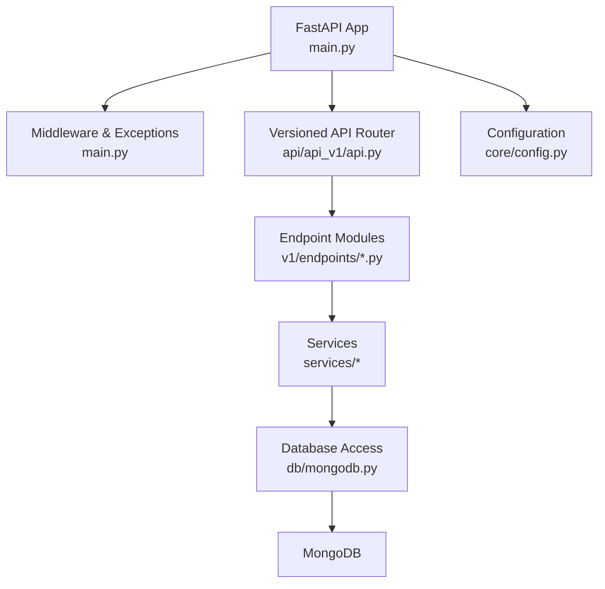
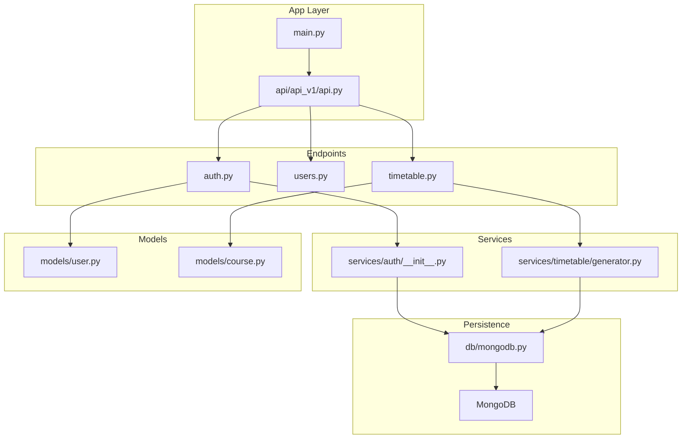
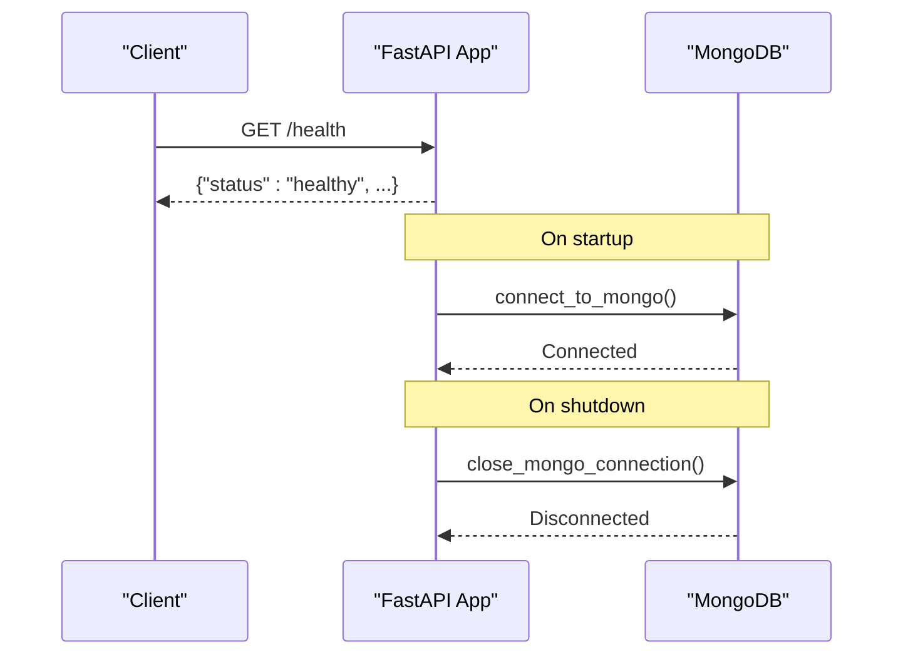
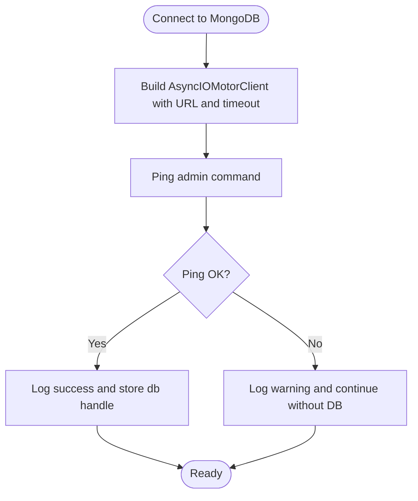
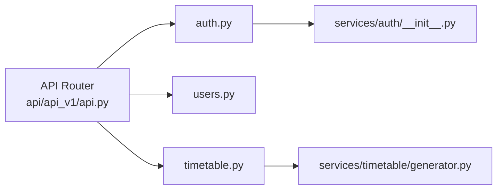
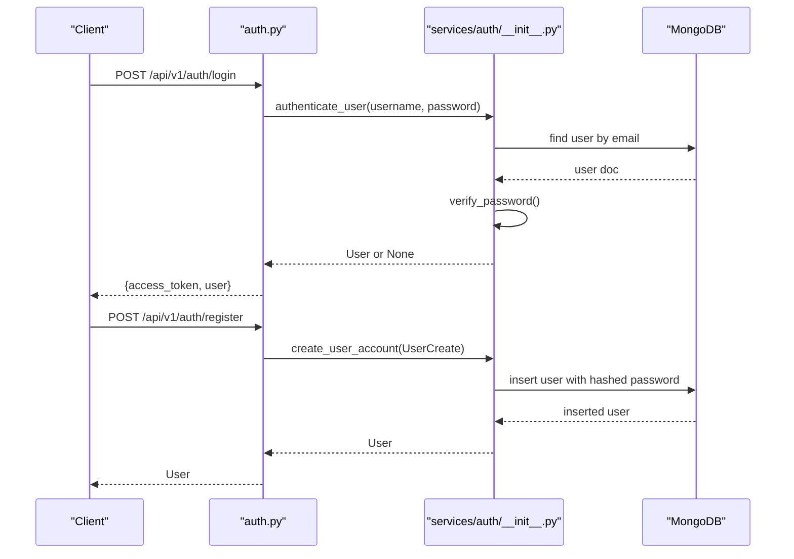
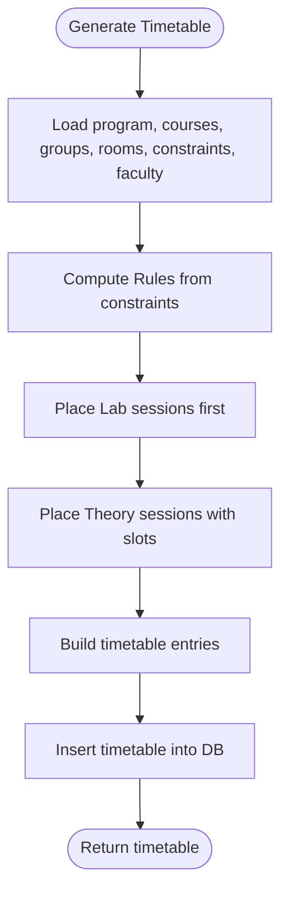
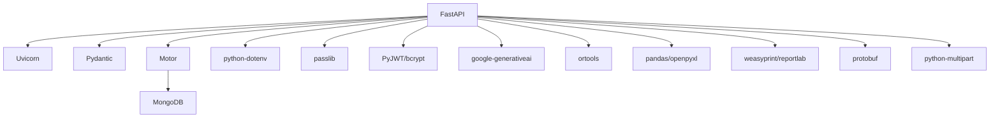

# Backend Application

<cite>
**Referenced Files in This Document**
- [main.py](file://backend/app/main.py)
- [config.py](file://backend/app/core/config.py)
- [mongodb.py](file://backend/app/db/mongodb.py)
- [api.py](file://backend/app/api/api_v1/api.py)
- [auth.py](file://backend/app/api/v1/endpoints/auth.py)
- [users.py](file://backend/app/api/v1/endpoints/users.py)
- [timetable.py](file://backend/app/api/v1/endpoints/timetable.py)
- [user.py](file://backend/app/models/user.py)
- [course.py](file://backend/app/models/course.py)
- [generator.py](file://backend/app/services/timetable/generator.py)
- [__init__.py](file://backend/app/services/auth/__init__.py)
- [requirements.txt](file://backend/requirements.txt)
</cite>

## Table of Contents
1. [Introduction](#introduction)
2. [Project Structure](#project-structure)
3. [Core Components](#core-components)
4. [Architecture Overview](#architecture-overview)
5. [Detailed Component Analysis](#detailed-component-analysis)
6. [Dependency Analysis](#dependency-analysis)
7. [Performance Considerations](#performance-considerations)
8. [Troubleshooting Guide](#troubleshooting-guide)
9. [Conclusion](#conclusion)
10. [Appendices](#appendices)

## Introduction
This document provides comprehensive backend documentation for the ShedMaster FastAPI application. It explains the application structure, entry points, configuration management, middleware setup, modular API design with versioned endpoints, database connectivity using MongoDB with Motor, exception handling and validation error responses, CORS configuration for frontend integration, application lifecycle management via startup and shutdown hooks, extension guidelines for adding new endpoints and services, and security, logging, and performance considerations.

## Project Structure
The backend follows a layered, feature-based structure:
- Entry point initializes FastAPI app, middleware, exception handlers, and includes the versioned API router.
- Configuration is centralized in a settings class with environment variable support.
- Database access is abstracted via a Motor client wrapper with connection lifecycle management.
- API is organized under a versioned namespace with modular endpoint routers.
- Services encapsulate business logic (authentication, timetable generation, export).
- Pydantic models define request/response schemas and MongoDB compatibility.

**Diagram sources**
- [main.py:33-102](file://backend/app/main.py#L33-L102)
- [api.py:1-34](file://backend/app/api/api_v1/api.py#L1-L34)
- [mongodb.py:1-41](file://backend/app/db/mongodb.py#L1-L41)
- [config.py:1-61](file://backend/app/core/config.py#L1-L61)

**Section sources**
- [main.py:1-102](file://backend/app/main.py#L1-L102)
- [api.py:1-34](file://backend/app/api/api_v1/api.py#L1-L34)

## Core Components
- Application entry and lifecycle:
  - FastAPI app initialization with title, description, version, and debug flag.
  - Startup hook connects to MongoDB; shutdown hook closes the connection.
  - Health checks and root endpoint for service discovery.
- Middleware:
  - CORS configured for development frontend origins.
- Exception handling:
  - Centralized validation error handler returning structured error details.
- Configuration:
  - Settings class defines API version path, database URLs, security keys, AI and email settings, upload limits, pagination defaults, and CORS origins parsing.
- Database:
  - Motor client wrapper with connection testing and graceful fallback when DB is unavailable.

**Section sources**
- [main.py:25-102](file://backend/app/main.py#L25-L102)
- [config.py:7-61](file://backend/app/core/config.py#L7-L61)
- [mongodb.py:11-41](file://backend/app/db/mongodb.py#L11-L41)

## Architecture Overview
The backend uses a clean separation of concerns:
- Entry point orchestrates middleware, exception handling, and router inclusion.
- Versioned API routes map to feature-specific endpoint modules.
- Endpoint modules depend on services for business logic and models for validation.
- Services interact with the database through a shared Motor client managed by lifecycle hooks.

**Diagram sources**
- [main.py:33-102](file://backend/app/main.py#L33-L102)
- [api.py:1-34](file://backend/app/api/api_v1/api.py#L1-L34)
- [auth.py:1-123](file://backend/app/api/v1/endpoints/auth.py#L1-L123)
- [users.py:1-123](file://backend/app/api/v1/endpoints/users.py#L1-L123)
- [timetable.py:1-728](file://backend/app/api/v1/endpoints/timetable.py#L1-L728)
- [__init__.py:1-190](file://backend/app/services/auth/__init__.py#L1-L190)
- [generator.py:1-402](file://backend/app/services/timetable/generator.py#L1-L402)
- [mongodb.py:1-41](file://backend/app/db/mongodb.py#L1-L41)
- [user.py:1-76](file://backend/app/models/user.py#L1-L76)
- [course.py:1-43](file://backend/app/models/course.py#L1-L43)

## Detailed Component Analysis

### Application Lifecycle and Entry Point
- Startup:
  - Connects to MongoDB using the configured URL and database name.
  - Tests connectivity with a ping command.
- Shutdown:
  - Closes the MongoDB client connection.
- Root and health endpoints:
  - Root provides service metadata and docs links.
  - Health endpoint confirms service availability.
- CORS:
  - Configured for development frontend origins with credentials, headers, and methods allowed.
- Validation error handler:
  - Returns structured JSON with validation errors, raw body, and a human-readable message.

**Diagram sources**
- [main.py:25-39](file://backend/app/main.py#L25-L39)
- [mongodb.py:11-41](file://backend/app/db/mongodb.py#L11-L41)

**Section sources**
- [main.py:25-102](file://backend/app/main.py#L25-L102)
- [mongodb.py:11-41](file://backend/app/db/mongodb.py#L11-L41)

### Configuration Management
- Settings class centralizes:
  - API version path and project name.
  - CORS origins parsing from comma-separated strings or lists.
  - MongoDB URL and database name.
  - Security parameters (secret key, algorithm, token expiry).
  - AI API key placeholder.
  - Email configuration placeholders.
  - Upload directory, max file size, pagination defaults.
- Environment loading uses a .env file with UTF-8 encoding.

**Section sources**
- [config.py:7-61](file://backend/app/core/config.py#L7-L61)

### Database Connectivity with MongoDB and Motor
- Database wrapper stores AsyncIOMotorClient and database handle.
- Connection:
  - Uses configured URL and sets a server selection timeout.
  - Pings the database to confirm connectivity.
- Disconnection:
  - Safely closes the client on shutdown.
- Graceful failure:
  - Logs warnings on connection failure and allows the app to start without DB.

**Diagram sources**
- [mongodb.py:11-33](file://backend/app/db/mongodb.py#L11-L33)

**Section sources**
- [mongodb.py:1-41](file://backend/app/db/mongodb.py#L1-L41)

### Modular API Design and Routing
- Versioned API router:
  - Includes routers for users, auth, programs, courses, faculty, student groups, rooms, timetable, timetable templates, constraints, rules, and AI.
- Endpoint modules:
  - Each module defines its own APIRouter and endpoints.
  - Endpoints often require authentication via dependency injection.
- Example endpoints:
  - Authentication: login, register, token test, token refresh.
  - Users: CRUD operations with permission checks.
  - Timetable: list, retrieve, create, update, delete, generate, export, validate, optimize.

**Diagram sources**
- [api.py:1-34](file://backend/app/api/api_v1/api.py#L1-L34)
- [auth.py:1-123](file://backend/app/api/v1/endpoints/auth.py#L1-L123)
- [users.py:1-123](file://backend/app/api/v1/endpoints/users.py#L1-L123)
- [timetable.py:1-728](file://backend/app/api/v1/endpoints/timetable.py#L1-L728)
- [__init__.py:1-190](file://backend/app/services/auth/__init__.py#L1-L190)
- [generator.py:1-402](file://backend/app/services/timetable/generator.py#L1-L402)

**Section sources**
- [api.py:1-34](file://backend/app/api/api_v1/api.py#L1-L34)
- [auth.py:1-123](file://backend/app/api/v1/endpoints/auth.py#L1-L123)
- [users.py:1-123](file://backend/app/api/v1/endpoints/users.py#L1-L123)
- [timetable.py:1-728](file://backend/app/api/v1/endpoints/timetable.py#L1-L728)

### Authentication and Authorization
- OAuth2 password flow:
  - Token URL constructed from the versioned base path.
- Password handling:
  - Hashing and verification using bcrypt.
- Token creation and validation:
  - JWT encode/decode with configured secret and algorithm.
- User retrieval and active/admin checks:
  - Dependencies enforce active and admin privileges where required.
- Registration:
  - Validates input, checks uniqueness, hashes password, and persists user.

**Diagram sources**
- [auth.py:29-101](file://backend/app/api/v1/endpoints/auth.py#L29-L101)
- [__init__.py:62-190](file://backend/app/services/auth/__init__.py#L62-L190)
- [mongodb.py:1-41](file://backend/app/db/mongodb.py#L1-L41)

**Section sources**
- [auth.py:1-123](file://backend/app/api/v1/endpoints/auth.py#L1-L123)
- [__init__.py:1-190](file://backend/app/services/auth/__init__.py#L1-L190)
- [user.py:1-76](file://backend/app/models/user.py#L1-L76)

### Timetable Generation and Management
- Timetable endpoints:
  - List, retrieve, create, update, delete timetables with strict ownership checks.
  - Generate using rule-based generator, template-based generator, or NEP-compliant genetic algorithm.
  - Export to JSON, Excel, or PDF with streaming responses.
  - Validate and optimize existing timetables.
- Data models:
  - Course model defines course attributes and constraints.
- Generator logic:
  - Loads program, courses, groups, rooms, constraints, and faculty.
  - Implements placement heuristics for labs and theory sessions.
  - Produces timetable entries with time slots and metadata.

**Diagram sources**
- [timetable.py:234-264](file://backend/app/api/v1/endpoints/timetable.py#L234-L264)
- [generator.py:169-402](file://backend/app/services/timetable/generator.py#L169-L402)

**Section sources**
- [timetable.py:1-728](file://backend/app/api/v1/endpoints/timetable.py#L1-L728)
- [course.py:1-43](file://backend/app/models/course.py#L1-L43)
- [generator.py:1-402](file://backend/app/services/timetable/generator.py#L1-L402)

### Exception Handling and Validation Errors
- Centralized validation error handler:
  - Intercepts RequestValidationError and returns a structured JSON response containing validation errors, raw body, and a message.
- Endpoint-level exceptions:
  - HTTPException raised with appropriate status codes for authentication failures, inactive users, not found, forbidden, and internal errors.
- Logging:
  - Info/warning logs for DB connectivity events; debug prints in endpoints for troubleshooting.

**Section sources**
- [main.py:41-54](file://backend/app/main.py#L41-L54)
- [auth.py:36-47](file://backend/app/api/v1/endpoints/auth.py#L36-L47)
- [users.py:21-22](file://backend/app/api/v1/endpoints/users.py#L21-L22)
- [timetable.py:89-91](file://backend/app/api/v1/endpoints/timetable.py#L89-L91)

### CORS Configuration
- Middleware configured to allow:
  - Origins used by the Vite dev server.
  - Credentials, headers, and methods.
  - Exposed headers.
- Endpoint-level options handler for CORS preflight on registration.

**Section sources**
- [main.py:56-64](file://backend/app/main.py#L56-L64)
- [auth.py:17-27](file://backend/app/api/v1/endpoints/auth.py#L17-L27)

### Application Lifecycle Hooks
- Startup:
  - Establishes MongoDB connection and verifies connectivity.
- Shutdown:
  - Closes the MongoDB client gracefully.

**Section sources**
- [main.py:25-31](file://backend/app/main.py#L25-L31)
- [mongodb.py:34-41](file://backend/app/db/mongodb.py#L34-L41)

### Extending the Backend
- Add a new endpoint module under the versioned endpoints directory with its own APIRouter.
- Define request/response models in the models directory if needed.
- Implement service logic in the services directory.
- Register the new router in the versioned API router.
- Ensure authentication and authorization dependencies are applied where required.
- Add export/import utilities if needed for data operations.

[No sources needed since this section provides general guidance]

## Dependency Analysis
External dependencies include FastAPI, Uvicorn, Pydantic, Motor, PyMongo, python-dotenv, passlib, PyJWT, bcrypt, Google Generative AI, OR-Tools, pandas, openpyxl, WeasyPrint, reportlab, protobuf, and python-multipart.

**Diagram sources**
- [requirements.txt:1-19](file://backend/requirements.txt#L1-L19)

**Section sources**
- [requirements.txt:1-19](file://backend/requirements.txt#L1-L19)

## Performance Considerations
- Asynchronous database operations:
  - Motor ensures non-blocking I/O; ensure all DB calls remain async-aware.
- Pagination:
  - Use skip/limit parameters in endpoints to avoid large result sets.
- Validation overhead:
  - Keep Pydantic models concise; avoid overly complex validators.
- Export operations:
  - Stream large files (PDF/Excel) to reduce memory usage.
- Caching:
  - Consider caching frequently accessed static data (e.g., programs, rooms) with appropriate invalidation.
- Concurrency:
  - Use async endpoints and avoid blocking operations inside handlers.

[No sources needed since this section provides general guidance]

## Troubleshooting Guide
- MongoDB connection issues:
  - Verify MONGODB_URL and DATABASE_NAME in configuration.
  - Check server availability and network access.
  - Review logs for warnings on connection failure.
- CORS errors:
  - Confirm frontend origin matches configured allowed origins.
  - Ensure credentials and headers are included as needed.
- Authentication failures:
  - Validate SECRET_KEY and ALGORITHM.
  - Check user existence and password hash verification.
- Validation errors:
  - Inspect structured error response for field mismatches.
- Endpoint access denied:
  - Ensure proper authentication and admin/active user checks.

**Section sources**
- [mongodb.py:11-41](file://backend/app/db/mongodb.py#L11-L41)
- [main.py:56-64](file://backend/app/main.py#L56-L64)
- [__init__.py:62-144](file://backend/app/services/auth/__init__.py#L62-L144)
- [main.py:41-54](file://backend/app/main.py#L41-L54)

## Conclusion
The ShedMaster backend is structured around a clear separation of concerns with a versioned API, robust configuration, asynchronous database access, and strong security practices. The modular design facilitates easy extension, while lifecycle hooks and CORS configuration streamline deployment and integration with the frontend. Following the guidelines herein will help maintain reliability, performance, and security as the application evolves.

## Appendices
- Security checklist:
  - Use HTTPS in production.
  - Rotate SECRET_KEY regularly.
  - Enforce rate limiting for authentication endpoints.
  - Sanitize and validate all user inputs.
- Logging:
  - Configure log levels and handlers according to environment.
  - Avoid printing sensitive data in logs.

[No sources needed since this section provides general guidance]