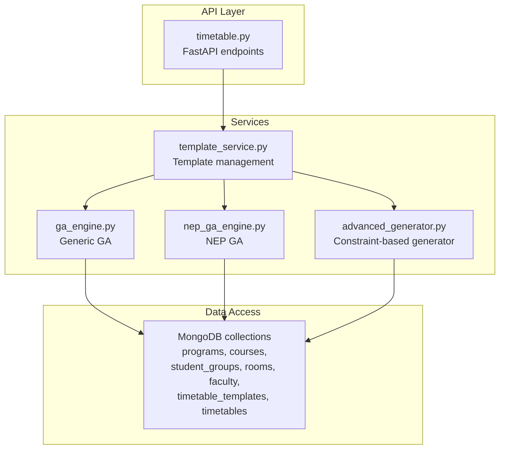
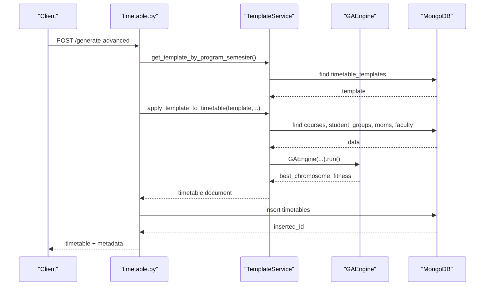
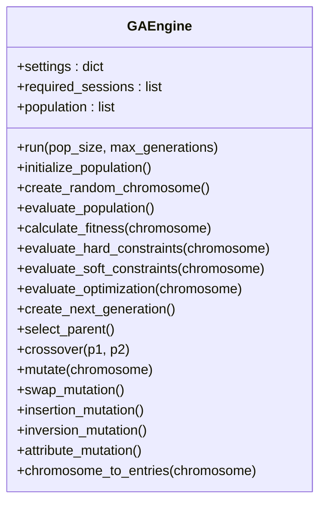
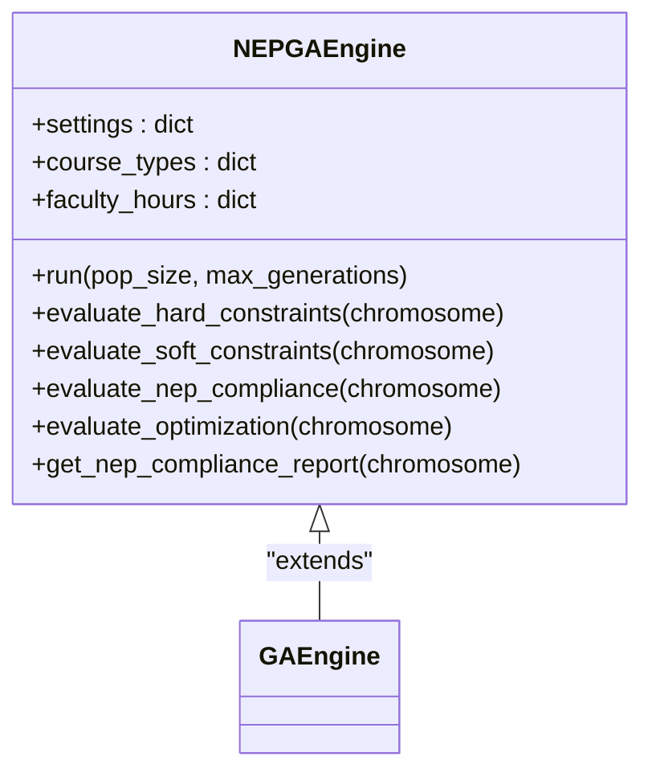
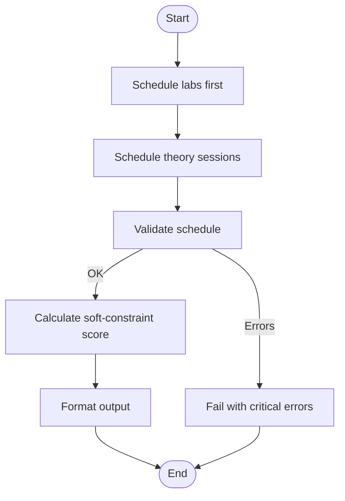
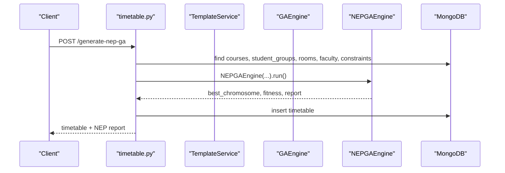
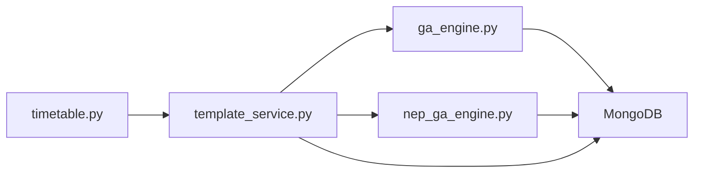

# Advanced Generation Algorithms

<cite>
**Referenced Files in This Document**
- [ga_engine.py](file://backend/app/services/timetable/ga_engine.py)
- [nep_ga_engine.py](file://backend/app/services/timetable/nep_ga_engine.py)
- [advanced_generator.py](file://backend/app/services/timetable/advanced_generator.py)
- [timetable.py](file://backend/app/api/v1/endpoints/timetable.py)
- [template_service.py](file://backend/app/services/timetable/template_service.py)
- [test_advanced_generator.py](file://backend/test_advanced_generator.py)
</cite>

## Table of Contents
1. [Introduction](#introduction)
2. [Project Structure](#project-structure)
3. [Core Components](#core-components)
4. [Architecture Overview](#architecture-overview)
5. [Detailed Component Analysis](#detailed-component-analysis)
6. [Dependency Analysis](#dependency-analysis)
7. [Performance Considerations](#performance-considerations)
8. [Troubleshooting Guide](#troubleshooting-guide)
9. [Conclusion](#conclusion)
10. [Appendices](#appendices)

## Introduction
This document explains the advanced timetable generation algorithms implemented in the project, focusing on:
- A general-purpose Genetic Algorithm engine for timetable optimization
- A NEP 2020-compliant extension tailored to Indian higher education guidelines
- A hybrid constraint satisfaction approach that combines structured scheduling with evolutionary optimization
- Population management, selection mechanisms, and convergence criteria
- Integration points with the API and template system

The goal is to help developers and stakeholders understand how chromosomes encode schedules, how fitness is evaluated, how crossover and mutation operators work, and how the system balances hard constraints, soft preferences, and NEP-specific objectives.

## Project Structure
The advanced generation algorithms live under the timetable services module and integrate with FastAPI endpoints and MongoDB-backed data access.

**Diagram sources**
- [timetable.py:234-537](file://backend/app/api/v1/endpoints/timetable.py#L234-L537)
- [template_service.py:209-413](file://backend/app/services/timetable/template_service.py#L209-L413)
- [ga_engine.py:19-414](file://backend/app/services/timetable/ga_engine.py#L19-L414)
- [nep_ga_engine.py:33-794](file://backend/app/services/timetable/nep_ga_engine.py#L33-L794)
- [advanced_generator.py:201-707](file://backend/app/services/timetable/advanced_generator.py#L201-L707)

**Section sources**
- [timetable.py:234-537](file://backend/app/api/v1/endpoints/timetable.py#L234-L537)
- [template_service.py:209-413](file://backend/app/services/timetable/template_service.py#L209-L413)

## Core Components
- GAEngine: A general-purpose genetic algorithm with chromosome representation, fitness evaluation, tournament selection, and multiple mutation/crossover operators.
- NEPGAEngine: A NEP 2020-compliant extension that adds NEP-specific objectives and constraints to the GA framework.
- AdvancedTimetableGenerator: A constraint satisfaction approach that generates schedules respecting hard and soft constraints, with prioritization and scoring heuristics.
- TemplateService: Orchestrates template creation and application, invoking GA engines to produce optimized timetables.
- API endpoints: Expose generation workflows via HTTP, including NEP GA generation and template-based generation.

Key capabilities:
- Chromosome encoding: Each gene represents a scheduled session with day, slot, room, and course metadata.
- Fitness composition: Hard constraints (conflicts), soft constraints (preferences), and optimization objectives.
- Selection and variation: Tournament selection, order crossover, and attribute mutation.
- Convergence: Early stopping and stagnation detection based on fitness improvement.

**Section sources**
- [ga_engine.py:19-414](file://backend/app/services/timetable/ga_engine.py#L19-L414)
- [nep_ga_engine.py:33-794](file://backend/app/services/timetable/nep_ga_engine.py#L33-L794)
- [advanced_generator.py:201-707](file://backend/app/services/timetable/advanced_generator.py#L201-L707)
- [template_service.py:209-413](file://backend/app/services/timetable/template_service.py#L209-L413)

## Architecture Overview
The system integrates constraint satisfaction and evolutionary computation in layered steps:
- Templates define working days, time slots, and constraints.
- Constraint-based generator handles strict requirements first (e.g., labs, capacity).
- GA engines optimize remaining allocations with multi-objective fitness.
- API endpoints orchestrate data retrieval, engine invocation, and persistence.

**Diagram sources**
- [timetable.py:266-375](file://backend/app/api/v1/endpoints/timetable.py#L266-L375)
- [template_service.py:209-413](file://backend/app/services/timetable/template_service.py#L209-L413)
- [ga_engine.py:125-165](file://backend/app/services/timetable/ga_engine.py#L125-L165)

## Detailed Component Analysis

### GAEngine: Chromosome Representation and Evolutionary Operators
- Chromosome: A list of genes, each representing a scheduled session with course, group, faculty, room, day, slot, and duration.
- Initialization: Random placement respecting lab/theory categorization and room/slot availability.
- Fitness:
  - Hard constraints: Conflict penalty derived from faculty, room, and group schedules.
  - Soft constraints: Room capacity adherence and lab room matching.
  - Optimization: Workload balance across days.
- Selection: Tournament selection with configurable tournament size.
- Crossover: Order crossover preserving relative ordering of sessions.
- Mutation: Four operators—swap, insertion, inversion, and attribute mutation—applied probabilistically.
- Population management: Elitism preserves top individuals; population size remains constant.
- Convergence: Early stopping threshold and stagnation counter based on fitness change.

**Diagram sources**
- [ga_engine.py:19-414](file://backend/app/services/timetable/ga_engine.py#L19-L414)

**Section sources**
- [ga_engine.py:19-414](file://backend/app/services/timetable/ga_engine.py#L19-L414)

### NEPGAEngine: NEP 2020 Compliance
- Extended GA with NEP-specific objectives:
  - Practical/theory ratio balancing
  - Faculty workload limits (daily/weekly)
  - Lab timing preferences
  - Multidisciplinary course distribution
- Fitness weights adjusted to emphasize NEP compliance.
- Enhanced hard constraints include daily workload checks.
- Provides a compliance report summarizing areas and recommendations.

**Diagram sources**
- [nep_ga_engine.py:33-794](file://backend/app/services/timetable/nep_ga_engine.py#L33-L794)
- [ga_engine.py:19-414](file://backend/app/services/timetable/ga_engine.py#L19-L414)

**Section sources**
- [nep_ga_engine.py:33-794](file://backend/app/services/timetable/nep_ga_engine.py#L33-L794)

### AdvancedTimetableGenerator: Hybrid Constraint Satisfaction
- Uses structured scheduling rules and dataclasses to model time slots, courses, rooms, and faculty.
- Enforces hard constraints first (labs, capacity, daily limits).
- Applies soft constraints to prioritize slots (afternoon labs, spread heavy courses).
- Generates a validated schedule with scoring and statistics.

**Diagram sources**
- [advanced_generator.py:569-707](file://backend/app/services/timetable/advanced_generator.py#L569-L707)

**Section sources**
- [advanced_generator.py:201-707](file://backend/app/services/timetable/advanced_generator.py#L201-L707)

### API Integration and Workflow
- Template-based generation endpoint invokes TemplateService, which builds datasets and runs GAEngine.
- NEP GA endpoint constructs NEPGAEngine with constraints and preferences, then persists results.
- Both flows return structured responses with entries, statistics, and metadata.

**Diagram sources**
- [timetable.py:377-537](file://backend/app/api/v1/endpoints/timetable.py#L377-L537)
- [nep_ga_engine.py:259-318](file://backend/app/services/timetable/nep_ga_engine.py#L259-L318)

**Section sources**
- [timetable.py:266-537](file://backend/app/api/v1/endpoints/timetable.py#L266-L537)

## Dependency Analysis
- GAEngine depends on:
  - Courses, student groups, rooms, faculty, and template data.
  - Utility time conversion helpers.
- NEPGAEngine extends GAEngine and adds NEP-specific categorization and scoring.
- TemplateService orchestrates data retrieval and delegates to GA engines.
- API endpoints depend on TemplateService and NEPGAEngine for generation workflows.

**Diagram sources**
- [timetable.py:266-537](file://backend/app/api/v1/endpoints/timetable.py#L266-L537)
- [template_service.py:209-413](file://backend/app/services/timetable/template_service.py#L209-L413)
- [ga_engine.py:19-414](file://backend/app/services/timetable/ga_engine.py#L19-L414)
- [nep_ga_engine.py:33-794](file://backend/app/services/timetable/nep_ga_engine.py#L33-L794)

**Section sources**
- [timetable.py:266-537](file://backend/app/api/v1/endpoints/timetable.py#L266-L537)
- [template_service.py:209-413](file://backend/app/services/timetable/template_service.py#L209-L413)

## Performance Considerations
- Population sizing and generation limits:
  - GAEngine defaults: population size 50, max generations 150.
  - NEPGAEngine defaults: population size 60, max generations 200.
- Convergence thresholds:
  - GAEngine: 30 generations without improvement.
  - NEPGAEngine: 40 generations without improvement.
- Mutation and crossover rates:
  - GAEngine: crossover rate 0.8, mutation rate 0.15.
  - NEPGAEngine: crossover rate 0.85, mutation rate 0.12.
- Early stopping:
  - GAEngine stops when fitness exceeds 0.95.
  - NEPGAEngine stops when fitness exceeds 0.92.
- Computational complexity:
  - Fitness evaluation scales with population size and number of sessions.
  - Tournament selection and order crossover are efficient for this problem domain.

[No sources needed since this section provides general guidance]

## Troubleshooting Guide
Common issues and remedies:
- No sessions generated:
  - Verify required sessions are built from courses and student groups.
  - Check template time slots and room availability.
- Conflicts persist:
  - Review hard constraint penalties and adjust weights.
  - Inspect faculty and room schedules for overlaps.
- Low fitness:
  - Increase population size or generations.
  - Adjust mutation rate to improve exploration.
- NEP compliance warnings:
  - Review practical/theory ratio and daily workload.
  - Use NEP compliance report to identify corrective actions.

**Section sources**
- [ga_engine.py:125-165](file://backend/app/services/timetable/ga_engine.py#L125-L165)
- [nep_ga_engine.py:259-318](file://backend/app/services/timetable/nep_ga_engine.py#L259-L318)

## Conclusion
The system combines robust constraint satisfaction with evolutionary computation to produce high-quality, NEP-compliant timetables. GAEngine provides a flexible foundation, while NEPGAEngine tailors objectives and constraints to NEP 2020 guidelines. TemplateService and API endpoints streamline integration, enabling scalable generation workflows.

[No sources needed since this section summarizes without analyzing specific files]

## Appendices

### Algorithm Configuration and Parameter Tuning
- GAEngine:
  - populationSize: 50
  - maxGenerations: 150
  - crossoverRate: 0.8
  - mutationRate: 0.15
  - eliteSize: 5
  - tournamentSize: 3
  - convergenceThreshold: 30
  - fitnessWeights: hardConstraints 0.6, softConstraints 0.2, optimization 0.2
- NEPGAEngine:
  - populationSize: 60
  - maxGenerations: 200
  - crossoverRate: 0.85
  - mutationRate: 0.12
  - eliteSize: 8
  - tournamentSize: 4
  - convergenceThreshold: 40
  - fitnessWeights: hardConstraints 0.50, softConstraints 0.20, nepCompliance 0.20, optimization 0.10

**Section sources**
- [ga_engine.py:38-51](file://backend/app/services/timetable/ga_engine.py#L38-L51)
- [nep_ga_engine.py:71-86](file://backend/app/services/timetable/nep_ga_engine.py#L71-L86)

### Example Workflows and Use Cases
- Template-based generation:
  - Endpoint: POST /generate-advanced
  - Purpose: Generate timetables using predefined templates and GA optimization.
  - Integration: TemplateService applies template, retrieves data, runs GAEngine.
- NEP GA generation:
  - Endpoint: POST /generate-nep-ga
  - Purpose: Generate NEP-compliant timetables with NEPGAEngine.
  - Integration: API fetches constraints and preferences, runs NEPGAEngine, persists results.

**Section sources**
- [timetable.py:266-375](file://backend/app/api/v1/endpoints/timetable.py#L266-L375)
- [timetable.py:377-537](file://backend/app/api/v1/endpoints/timetable.py#L377-L537)
- [template_service.py:209-413](file://backend/app/services/timetable/template_service.py#L209-L413)

### Testing and Validation
- Advanced generator tests demonstrate:
  - Time slot generation for theory, double periods, and labs.
  - Full timetable generation pipeline with validation and statistics.
- Test coverage includes:
  - Course setup and resource configuration.
  - Occupancy tracking and scheduling logic.
  - Validation and scoring.

**Section sources**
- [test_advanced_generator.py:15-184](file://backend/test_advanced_generator.py#L15-L184)