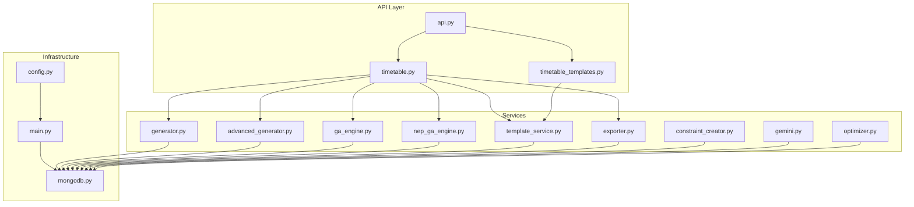
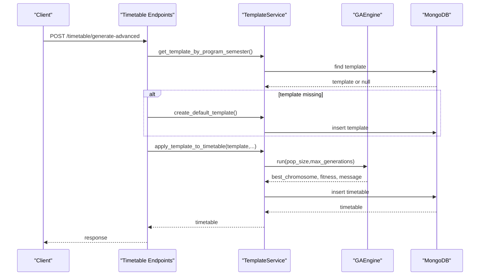
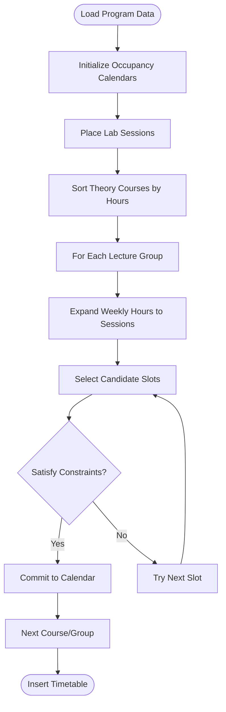
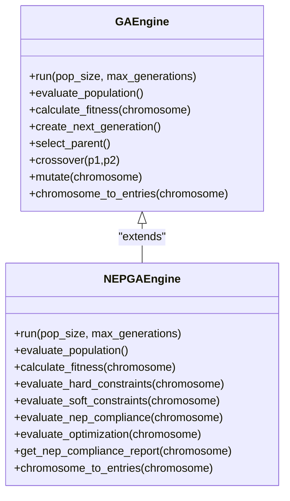
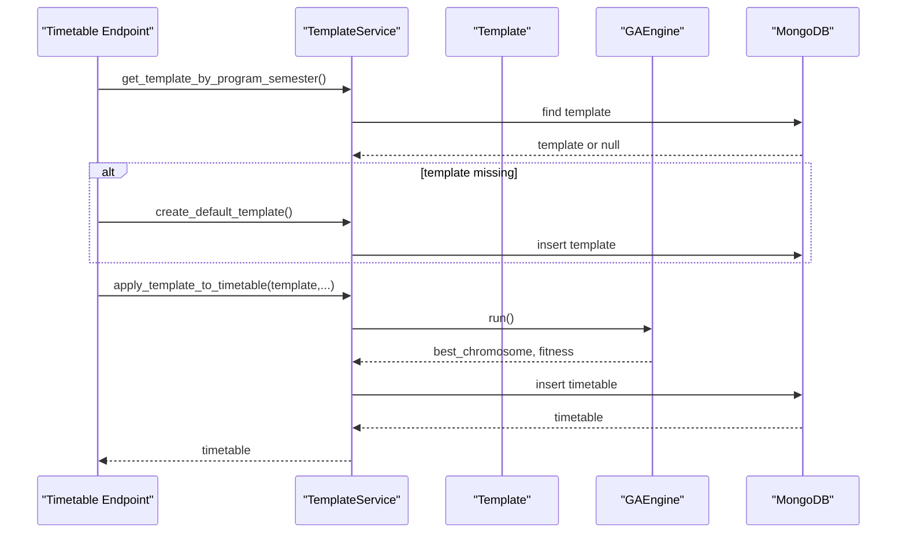
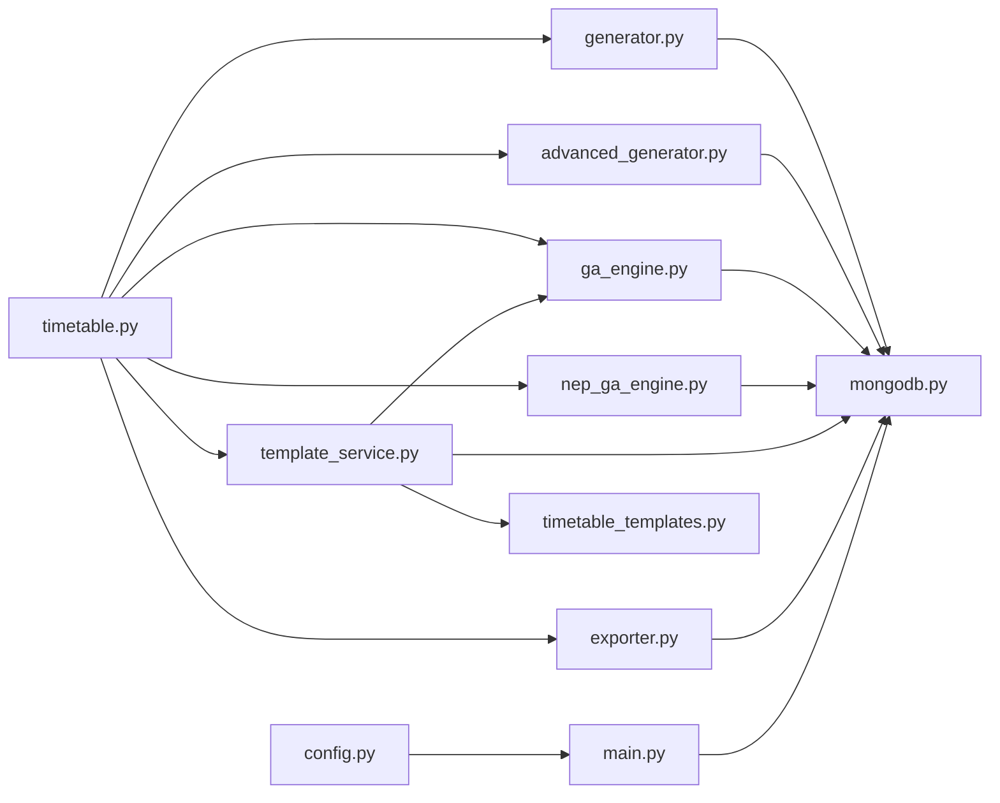

# Business Logic Layer

<cite>
**Referenced Files in This Document**
- [main.py](file://backend/app/main.py)
- [config.py](file://backend/app/core/config.py)
- [mongodb.py](file://backend/app/db/mongodb.py)
- [api.py](file://backend/app/api/api_v1/api.py)
- [timetable.py](file://backend/app/api/v1/endpoints/timetable.py)
- [timetable_templates.py](file://backend/app/api/v1/endpoints/timetable_templates.py)
- [generator.py](file://backend/app/services/timetable/generator.py)
- [advanced_generator.py](file://backend/app/services/timetable/advanced_generator.py)
- [ga_engine.py](file://backend/app/services/timetable/ga_engine.py)
- [nep_ga_engine.py](file://backend/app/services/timetable/nep_ga_engine.py)
- [template_service.py](file://backend/app/services/timetable/template_service.py)
- [exporter.py](file://backend/app/services/timetable/exporter.py)
- [constraint_creator.py](file://backend/app/services/ai/constraint_creator.py)
- [gemini.py](file://backend/app/services/ai/gemini.py)
- [optimizer.py](file://backend/app/services/ai/optimizer.py)
</cite>

## Table of Contents
1. [Introduction](#introduction)
2. [Project Structure](#project-structure)
3. [Core Components](#core-components)
4. [Architecture Overview](#architecture-overview)
5. [Detailed Component Analysis](#detailed-component-analysis)
6. [Dependency Analysis](#dependency-analysis)
7. [Performance Considerations](#performance-considerations)
8. [Troubleshooting Guide](#troubleshooting-guide)
9. [Conclusion](#conclusion)

## Introduction
This document describes the ShedMaster business logic layer responsible for timetable generation and management. It covers constraint-based generation engines, genetic algorithms and evolutionary computation, template-based generation, export capabilities, NEP 2020 compliance, performance optimization, error handling, and integration patterns. The system integrates FastAPI endpoints with MongoDB-backed services and AI-assisted optimization.

## Project Structure
The business logic layer is organized around:
- API endpoints orchestrating service calls
- Timetable generation services (constraint-based, advanced, GA, NEP-GA)
- Template management and export utilities
- AI services for constraint creation and optimization
- Database connectivity and configuration

**Diagram sources**
- [api.py:1-34](file://backend/app/api/api_v1/api.py#L1-L34)
- [timetable.py:1-728](file://backend/app/api/v1/endpoints/timetable.py#L1-L728)
- [timetable_templates.py:1-106](file://backend/app/api/v1/endpoints/timetable_templates.py#L1-L106)
- [generator.py:1-402](file://backend/app/services/timetable/generator.py#L1-L402)
- [advanced_generator.py:1-707](file://backend/app/services/timetable/advanced_generator.py#L1-L707)
- [ga_engine.py:1-414](file://backend/app/services/timetable/ga_engine.py#L1-L414)
- [nep_ga_engine.py:1-794](file://backend/app/services/timetable/nep_ga_engine.py#L1-L794)
- [template_service.py:1-486](file://backend/app/services/timetable/template_service.py#L1-L486)
- [exporter.py:1-383](file://backend/app/services/timetable/exporter.py#L1-L383)
- [constraint_creator.py:1-781](file://backend/app/services/ai/constraint_creator.py#L1-L781)
- [gemini.py:1-288](file://backend/app/services/ai/gemini.py#L1-L288)
- [optimizer.py:1-59](file://backend/app/services/ai/optimizer.py#L1-L59)
- [main.py:1-102](file://backend/app/main.py#L1-L102)
- [config.py:1-61](file://backend/app/core/config.py#L1-L61)
- [mongodb.py:1-41](file://backend/app/db/mongodb.py#L1-L41)

**Section sources**
- [main.py:1-102](file://backend/app/main.py#L1-L102)
- [config.py:1-61](file://backend/app/core/config.py#L1-L61)
- [mongodb.py:1-41](file://backend/app/db/mongodb.py#L1-L41)
- [api.py:1-34](file://backend/app/api/api_v1/api.py#L1-L34)

## Core Components
- Constraint-based generator: Builds timetables respecting hard and soft constraints, with lab-first and theory-second placement heuristics.
- Advanced generator: Implements detailed scheduling rules for specific programs with soft constraints and scoring.
- Genetic Algorithm engines: Standard GA and NEP 2020-compliant GA with multi-objective fitness, selection, crossover, and mutation.
- Template service: Manages reusable templates, normalizes overrides, and applies templates to produce optimized timetables via GA.
- Exporter: Produces Excel, PDF, JSON, and CSV exports with metadata and formatting.
- AI services: Natural language constraint parsing, NEP 2020 validation, and optimization suggestions.
- Endpoint orchestration: Secure CRUD operations, generation workflows, and export endpoints.

**Section sources**
- [generator.py:163-402](file://backend/app/services/timetable/generator.py#L163-L402)
- [advanced_generator.py:201-707](file://backend/app/services/timetable/advanced_generator.py#L201-L707)
- [ga_engine.py:19-414](file://backend/app/services/timetable/ga_engine.py#L19-L414)
- [nep_ga_engine.py:33-794](file://backend/app/services/timetable/nep_ga_engine.py#L33-L794)
- [template_service.py:6-486](file://backend/app/services/timetable/template_service.py#L6-L486)
- [exporter.py:16-383](file://backend/app/services/timetable/exporter.py#L16-L383)
- [constraint_creator.py:18-781](file://backend/app/services/ai/constraint_creator.py#L18-L781)
- [gemini.py:9-288](file://backend/app/services/ai/gemini.py#L9-L288)
- [optimizer.py:6-59](file://backend/app/services/ai/optimizer.py#L6-L59)

## Architecture Overview
The system follows a layered architecture:
- API layer handles requests, authentication, and delegates to services.
- Service layer encapsulates business logic for generation, optimization, templating, and export.
- Data access layer abstracts MongoDB connectivity and operations.
- AI layer augments constraint management and optimization.

**Diagram sources**
- [timetable.py:266-375](file://backend/app/api/v1/endpoints/timetable.py#L266-L375)
- [template_service.py:81-413](file://backend/app/services/timetable/template_service.py#L81-L413)
- [ga_engine.py:125-165](file://backend/app/services/timetable/ga_engine.py#L125-L165)

**Section sources**
- [timetable.py:234-375](file://backend/app/api/v1/endpoints/timetable.py#L234-L375)
- [template_service.py:209-413](file://backend/app/services/timetable/template_service.py#L209-L413)

## Detailed Component Analysis

### Constraint-Based Generation Engine
The constraint-based generator loads program/course/group/room/faculty data, constructs occupancy calendars, and places labs before theory sessions. It enforces hard constraints (no conflicts) and respects soft constraints (e.g., max periods per day, contiguous periods, lab windows). The algorithm prioritizes:
- Lab sessions first using predefined windows
- Theory sessions next with double-period preference when applicable
- Room/projector availability and group capacity checks
- Continuous period limits and daily load caps

**Diagram sources**
- [generator.py:169-301](file://backend/app/services/timetable/generator.py#L169-L301)
- [generator.py:303-379](file://backend/app/services/timetable/generator.py#L303-L379)

**Section sources**
- [generator.py:163-402](file://backend/app/services/timetable/generator.py#L163-L402)

### Advanced Generation Engine
The advanced generator defines detailed scheduling rules, course requirements, and resource constraints. It separates theory and lab slots, enforces daily and continuous period limits, and applies soft constraints to spread courses and avoid early slots for certain subjects. It validates schedules and calculates a soft-constraint score.

Key features:
- Course requirements with session structures
- Room capability checks (lab vs. theory)
- Faculty assignment and availability
- Daily and continuous period constraints
- Soft constraint scoring and validation

**Section sources**
- [advanced_generator.py:201-707](file://backend/app/services/timetable/advanced_generator.py#L201-L707)

### Genetic Algorithm Engines
Two GA engines implement evolutionary optimization:
- Standard GAEngine: Chromosome encodes course-day-slot-room; multi-objective fitness combining hard constraints, soft constraints, and optimization; tournament selection, crossover, and multiple mutation operators.
- NEPGAEngine: Extends GA with NEP 2020 objectives (practical/theory ratio, faculty workload, daily balance, lab timing), compliance scoring, and detailed reports.

**Diagram sources**
- [ga_engine.py:19-414](file://backend/app/services/timetable/ga_engine.py#L19-L414)
- [nep_ga_engine.py:33-794](file://backend/app/services/timetable/nep_ga_engine.py#L33-L794)

**Section sources**
- [ga_engine.py:19-414](file://backend/app/services/timetable/ga_engine.py#L19-L414)
- [nep_ga_engine.py:33-794](file://backend/app/services/timetable/nep_ga_engine.py#L33-L794)

### Template-Based Generation Service
TemplateService manages reusable templates, normalizes overrides for courses, groups, rooms, and faculty, and applies templates to generate optimized timetables using GA. It ensures user isolation, prevents duplicates, and converts ObjectIds to strings for JSON responses.

**Diagram sources**
- [timetable.py:296-346](file://backend/app/api/v1/endpoints/timetable.py#L296-L346)
- [template_service.py:81-413](file://backend/app/services/timetable/template_service.py#L81-L413)
- [ga_engine.py:125-165](file://backend/app/services/timetable/ga_engine.py#L125-L165)

**Section sources**
- [template_service.py:6-486](file://backend/app/services/timetable/template_service.py#L6-L486)
- [timetable.py:296-346](file://backend/app/api/v1/endpoints/timetable.py#L296-L346)

### Export Functionality
The exporter supports Excel, PDF, JSON, and CSV exports. It enriches timetable data with program and entity details, applies formatting (styles, borders, auto-width), and streams binary responses. Multiple timetables can be exported to a single Excel workbook or aggregated JSON.

Supported formats:
- Excel: styled worksheets with merged headers and auto-sized columns
- PDF: tabular layout with custom styles and page sizing
- JSON: enriched metadata and timestamps
- CSV: standardized column mapping

**Section sources**
- [exporter.py:16-383](file://backend/app/services/timetable/exporter.py#L16-L383)
- [timetable.py:623-687](file://backend/app/api/v1/endpoints/timetable.py#L623-L687)

### NEP 2020 Compliance Engine
The NEPGAEngine evaluates NEP 2020 compliance across six areas: credit system, multidisciplinary education, assessment patterns, skill development, research and innovation, and faculty workload. It computes area scores, generates compliance reports, and suggests improvements.

Key validations:
- Practical/theory ratio balancing
- Faculty workload limits (daily/weekly)
- Daily load balance
- Lab scheduling preferences
- Multidisciplinary course distribution

**Section sources**
- [nep_ga_engine.py:453-527](file://backend/app/services/timetable/nep_ga_engine.py#L453-L527)
- [nep_ga_engine.py:722-793](file://backend/app/services/timetable/nep_ga_engine.py#L722-L793)

### AI-Assisted Constraint Creation and Optimization
AIConstraintCreator parses natural language constraints into structured formats, suggests program-specific constraints, validates NEP 2020 compliance, and optimizes constraint sets. GeminiAIService provides AI-driven timetable analysis, suggestions, and NEP validation. A lightweight optimizer computes soft-constraint scores for quick evaluations.

**Section sources**
- [constraint_creator.py:18-781](file://backend/app/services/ai/constraint_creator.py#L18-L781)
- [gemini.py:9-288](file://backend/app/services/ai/gemini.py#L9-L288)
- [optimizer.py:6-59](file://backend/app/services/ai/optimizer.py#L6-L59)

## Dependency Analysis
The business logic layer exhibits clear separation of concerns:
- Endpoints depend on services for orchestration
- Services depend on MongoDB for persistence
- AI services depend on configuration for external APIs
- Exporter depends on third-party libraries for formatting

**Diagram sources**
- [timetable.py:1-728](file://backend/app/api/v1/endpoints/timetable.py#L1-L728)
- [timetable_templates.py:1-106](file://backend/app/api/v1/endpoints/timetable_templates.py#L1-L106)
- [generator.py:1-402](file://backend/app/services/timetable/generator.py#L1-L402)
- [advanced_generator.py:1-707](file://backend/app/services/timetable/advanced_generator.py#L1-L707)
- [ga_engine.py:1-414](file://backend/app/services/timetable/ga_engine.py#L1-L414)
- [nep_ga_engine.py:1-794](file://backend/app/services/timetable/nep_ga_engine.py#L1-L794)
- [template_service.py:1-486](file://backend/app/services/timetable/template_service.py#L1-L486)
- [exporter.py:1-383](file://backend/app/services/timetable/exporter.py#L1-L383)
- [mongodb.py:1-41](file://backend/app/db/mongodb.py#L1-L41)
- [config.py:1-61](file://backend/app/core/config.py#L1-L61)
- [main.py:1-102](file://backend/app/main.py#L1-L102)

**Section sources**
- [timetable.py:1-728](file://backend/app/api/v1/endpoints/timetable.py#L1-L728)
- [mongodb.py:1-41](file://backend/app/db/mongodb.py#L1-L41)

## Performance Considerations
- Data loading: Queries fetch entire collections for given scopes; consider pagination and indexing for large datasets.
- Occupancy tracking: Dictionary-based calendars enable O(1) conflict checks per resource.
- GA parameters: Population size and generations trade off accuracy and latency; tune based on dataset scale.
- Export streaming: Binary streaming avoids large in-memory buffers for Excel/PDF/CSV.
- Logging: Use structured logs for long-running GA runs and export operations.
- Concurrency: Endpoints are async; ensure database connections pool appropriately.

[No sources needed since this section provides general guidance]

## Troubleshooting Guide
Common issues and resolutions:
- Validation errors: The root endpoint prints validation errors and request bodies to aid debugging.
- Database connectivity: MongoDB connection attempts with timeouts; API continues without DB for testing.
- Authentication isolation: All timetable endpoints filter by created_by to prevent unauthorized access.
- Export failures: Exporter wraps exceptions with descriptive messages; verify format support and permissions.
- GA convergence: Monitor fitness history and adjust population size and generations.

**Section sources**
- [main.py:42-54](file://backend/app/main.py#L42-L54)
- [mongodb.py:11-32](file://backend/app/db/mongodb.py#L11-L32)
- [timetable.py:74-114](file://backend/app/api/v1/endpoints/timetable.py#L74-L114)
- [timetable.py:623-687](file://backend/app/api/v1/endpoints/timetable.py#L623-L687)
- [exporter.py:39-40](file://backend/app/services/timetable/exporter.py#L39-L40)

## Conclusion
The ShedMaster business logic layer integrates robust constraint-based generation, advanced scheduling rules, evolutionary computation, and AI assistance to deliver NEP 2020-compliant timetables. The modular design enables extensibility, maintainability, and scalable deployment through efficient data structures, streaming exports, and secure endpoint patterns.