# Constraint-Based Generation Engine

<cite>
**Referenced Files in This Document**
- [generator.py](file://backend/app/services/timetable/generator.py)
- [advanced_generator.py](file://backend/app/services/timetable/advanced_generator.py)
- [ga_engine.py](file://backend/app/services/timetable/ga_engine.py)
- [nep_ga_engine.py](file://backend/app/services/timetable/nep_ga_engine.py)
- [template_service.py](file://backend/app/services/timetable/template_service.py)
- [timetable.py](file://backend/app/models/timetable.py)
- [course.py](file://backend/app/models/course.py)
- [student_group.py](file://backend/app/models/student_group.py)
- [room.py](file://backend/app/models/room.py)
- [constraint.py](file://backend/app/models/constraint.py)
- [timetable.py](file://backend/app/api/v1/endpoints/timetable.py)
- [constraints.py](file://backend/app/api/v1/endpoints/constraints.py)
</cite>

## Table of Contents
1. [Introduction](#introduction)
2. [System Architecture](#system-architecture)
3. [Core Components](#core-components)
4. [Data Structures](#data-structures)
5. [Constraint Processing System](#constraint-processing-system)
6. [Two-Phase Generation Approach](#two-phase-generation-approach)
7. [Fitness Function and Conflict Detection](#fitness-function-and-conflict-detection)
8. [Placement Strategies](#placement-strategies)
9. [Calendar Occupancy Tracking](#calendar-occupancy-tracking)
10. [Error Handling and Fallback Mechanisms](#error-handling-and-fallback-mechanisms)
11. [Examples and Use Cases](#examples-and-use-cases)
12. [Performance Considerations](#performance-considerations)
13. [Troubleshooting Guide](#troubleshooting-guide)
14. [Conclusion](#conclusion)

## Introduction

The Constraint-Based Generation Engine is a sophisticated timetable generation system designed to solve complex scheduling problems using constraint satisfaction techniques. This system handles the intricate requirements of academic institutions, including course specifications, room allocations, group management, and strict time constraints while maintaining flexibility for various institutional needs.

The engine implements a multi-layered approach combining rule-based constraint satisfaction with advanced optimization algorithms, providing robust solutions for both traditional academic scheduling and NEP 2020 compliant timetables.

## System Architecture

The generation engine follows a modular architecture with distinct layers for data management, constraint processing, and optimization:

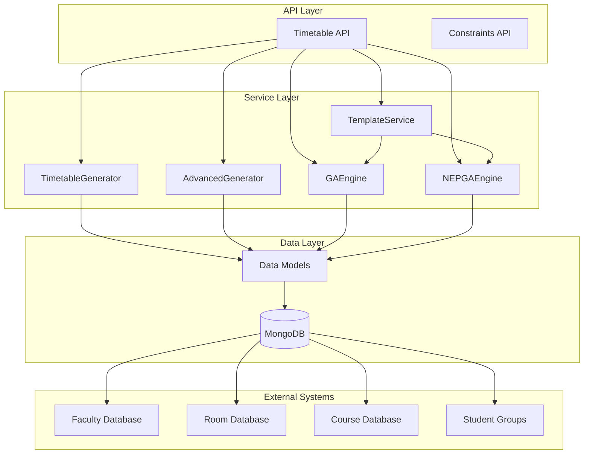

**Diagram sources**
- [generator.py:163-402](file://backend/app/services/timetable/generator.py#L163-L402)
- [advanced_generator.py:201-707](file://backend/app/services/timetable/advanced_generator.py#L201-L707)
- [ga_engine.py:19-414](file://backend/app/services/timetable/ga_engine.py#L19-L414)
- [nep_ga_engine.py:33-794](file://backend/app/services/timetable/nep_ga_engine.py#L33-L794)

## Core Components

### TimetableGenerator Class

The primary constraint-based generator implements a systematic approach to timetable creation through careful constraint satisfaction and strategic placement algorithms.

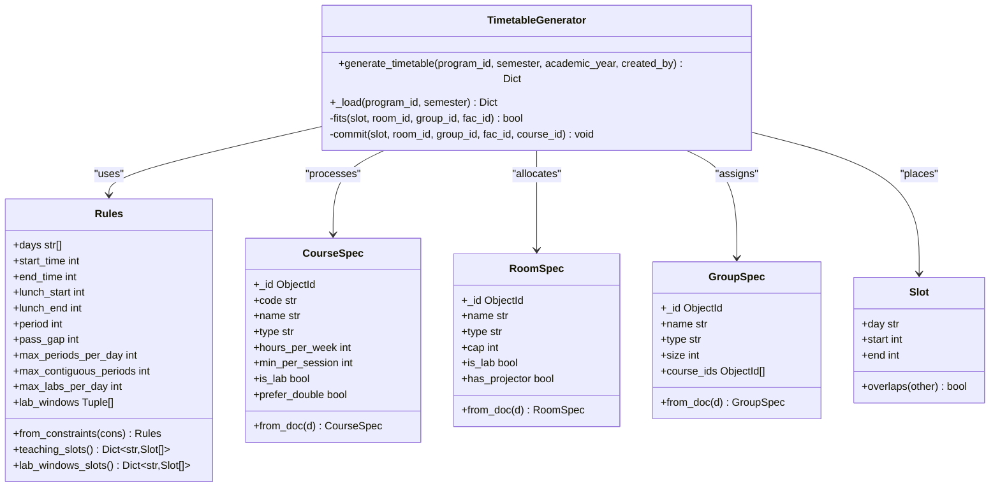

**Diagram sources**
- [generator.py:163-402](file://backend/app/services/timetable/generator.py#L163-L402)
- [generator.py:95-147](file://backend/app/services/timetable/generator.py#L95-L147)
- [generator.py:19-84](file://backend/app/services/timetable/generator.py#L19-L84)

**Section sources**
- [generator.py:163-402](file://backend/app/services/timetable/generator.py#L163-L402)

### Advanced Timetable Generator

The advanced generator provides enhanced constraint handling with soft constraints and detailed validation capabilities:

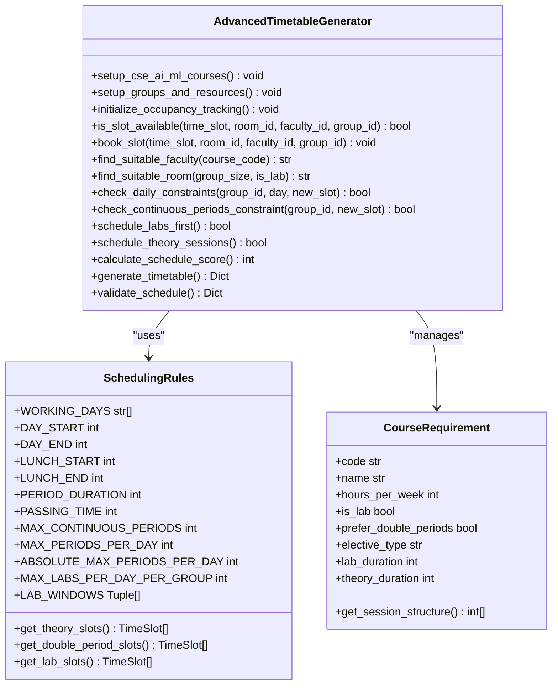

**Diagram sources**
- [advanced_generator.py:201-707](file://backend/app/services/timetable/advanced_generator.py#L201-L707)
- [advanced_generator.py:123-200](file://backend/app/services/timetable/advanced_generator.py#L123-L200)
- [advanced_generator.py:54-84](file://backend/app/services/timetable/advanced_generator.py#L54-L84)

**Section sources**
- [advanced_generator.py:201-707](file://backend/app/services/timetable/advanced_generator.py#L201-L707)

## Data Structures

### Course Specification

The CourseSpec data structure encapsulates all course-related information and intelligence for scheduling decisions:

| Field | Type | Description | Example |
|-------|------|-------------|---------|
| `_id` | ObjectId | Unique course identifier | `ObjectId("...")` |
| `code` | str | Course code (e.g., "CS101") | `"CS101"` |
| `name` | str | Full course name | `"Introduction to Programming"` |
| `type` | str | Course type classification | `"Core"` |
| `hours_per_week` | int | Total weekly teaching hours | `4` |
| `min_per_session` | int | Minutes per individual session | `50` |
| `is_lab` | bool | Whether course requires lab facilities | `True` |
| `prefer_double` | bool | Preference for double period sessions | `False` |

### Room Specification

RoomSpec defines facility characteristics and capacity constraints:

| Field | Type | Description | Example |
|-------|------|-------------|---------|
| `_id` | ObjectId | Unique room identifier | `ObjectId("...")` |
| `name` | str | Room designation | `"N-001"` |
| `type` | str | Room type classification | `"Classroom"` |
| `cap` | int | Maximum occupancy capacity | `75` |
| `is_lab` | bool | Laboratory designation | `False` |
| `has_projector` | bool | Audiovisual equipment availability | `True` |

### Group Specification

Student group management for course enrollment and scheduling:

| Field | Type | Description | Example |
|-------|------|-------------|---------|
| `_id` | ObjectId | Group identifier | `ObjectId("...")` |
| `name` | str | Group name | `"CSE AI & ML - Main"` |
| `type` | str | Group type classification | `"Regular Class"` |
| `size` | int | Number of enrolled students | `60` |
| `course_ids` | List[ObjectId] | Courses assigned to group | `[ObjectId("...")]` |

### Slot Management

Time slot representation for precise scheduling:

| Field | Type | Description | Example |
|-------|------|-------------|---------|
| `day` | str | Day of week | `"Mon"` |
| `start` | int | Start time in minutes | `480` |
| `end` | int | End time in minutes | `530` |
| `overlaps` | func | Overlap detection method | `bool` |

**Section sources**
- [generator.py:19-84](file://backend/app/services/timetable/generator.py#L19-L84)
- [generator.py:86-93](file://backend/app/services/timetable/generator.py#L86-L93)

## Constraint Processing System

### Time Settings Configuration

The Rules class centralizes all temporal constraints and configurations:

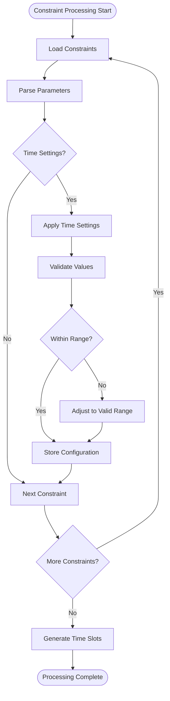

**Diagram sources**
- [generator.py:108-122](file://backend/app/services/timetable/generator.py#L108-L122)

### Lunch Break Management

Lunch break integration ensures proper scheduling gaps:

| Parameter | Default Value | Description |
|-----------|---------------|-------------|
| `lunch_start` | `12:30` | Lunch break start time |
| `lunch_end` | `13:20` | Lunch break end time |
| `lunch_duration` | `50` | Duration in minutes |
| `passing_gap` | `10` | Time between classes |

### Period Configuration

Flexible period management supports various institutional needs:

| Setting | Default | Purpose |
|---------|---------|---------|
| `period` | `50` minutes | Standard class duration |
| `max_periods_per_day` | `8` | Maximum daily classes |
| `max_contiguous_periods` | `3` | Consecutive class limit |
| `max_labs_per_day` | `1` | Daily lab session cap |

**Section sources**
- [generator.py:95-147](file://backend/app/services/timetable/generator.py#L95-L147)

## Two-Phase Generation Approach

The engine employs a strategic two-phase approach to handle different course types effectively:

### Phase 1: Lab Course Placement

Lab courses receive priority due to their specialized requirements and limited availability:

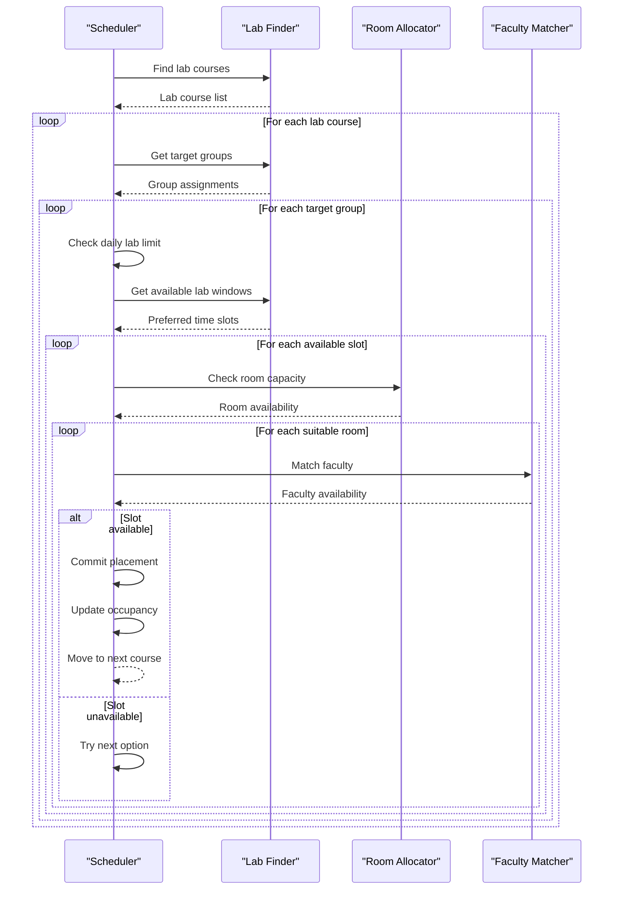

**Diagram sources**
- [generator.py:273-302](file://backend/app/services/timetable/generator.py#L273-L302)

### Phase 2: Theory Course Placement

Theory courses are scheduled with consideration for double periods and projector requirements:

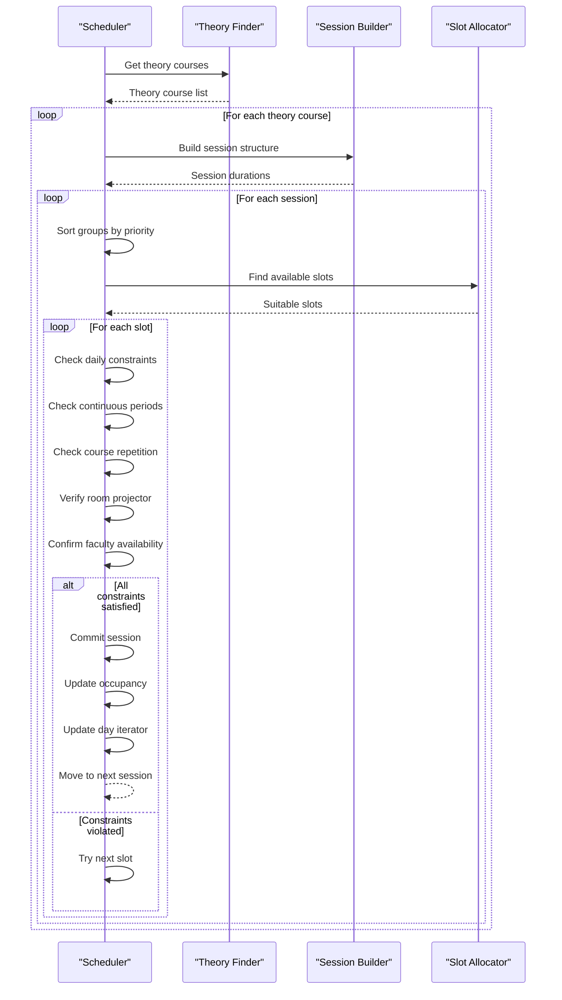

**Diagram sources**
- [generator.py:303-379](file://backend/app/services/timetable/generator.py#L303-L379)

**Section sources**
- [generator.py:273-379](file://backend/app/services/timetable/generator.py#L273-L379)

## Fitness Function and Conflict Detection

### Conflict Detection Mechanisms

The system implements comprehensive conflict detection across multiple resource types:

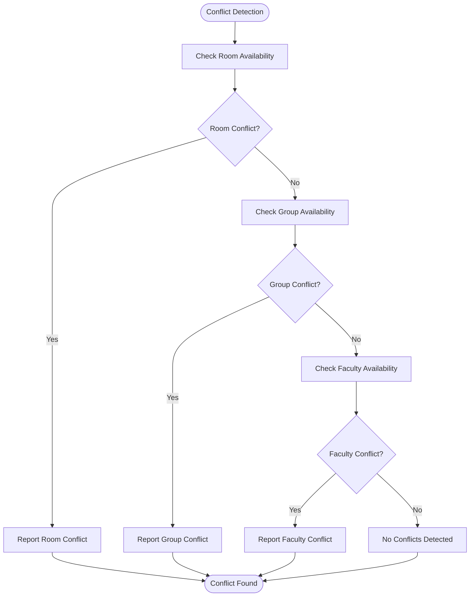

**Diagram sources**
- [generator.py:247-254](file://backend/app/services/timetable/generator.py#L247-L254)

### Continuous Period Validation

The system validates continuous period constraints to prevent excessive consecutive classes:

| Constraint | Limit | Purpose |
|------------|-------|---------|
| `max_contiguous_periods` | `3` | Prevents 4+ consecutive classes |
| `max_periods_per_day` | `8` | Manages daily workload |
| `passing_gap` | `10` minutes | Provides transition time |

### Session Structure Optimization

Theory course sessions are optimized for double periods when beneficial:

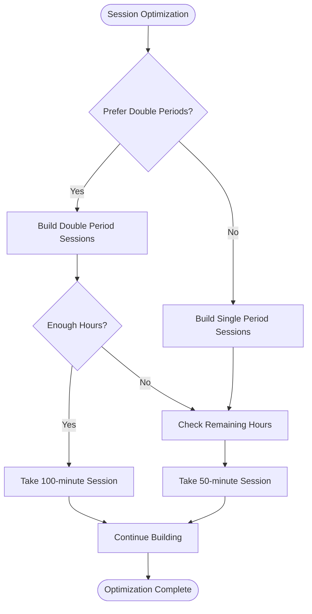

**Diagram sources**
- [generator.py:308-317](file://backend/app/services/timetable/generator.py#L308-L317)

**Section sources**
- [generator.py:149-161](file://backend/app/services/timetable/generator.py#L149-L161)
- [generator.py:308-317](file://backend/app/services/timetable/generator.py#L308-L317)

## Placement Strategies

### Resource Matching Algorithm

The placement system uses a sophisticated matching algorithm to pair courses with appropriate resources:

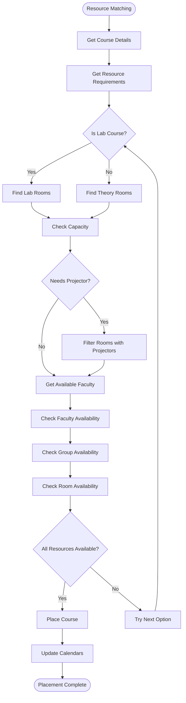

**Diagram sources**
- [generator.py:273-302](file://backend/app/services/timetable/generator.py#L273-L302)
- [generator.py:322-379](file://backend/app/services/timetable/generator.py#L322-L379)

### Priority-Based Course Selection

Courses are prioritized based on teaching load and importance:

| Priority Factor | Weight | Description |
|----------------|--------|-------------|
| `hours_per_week` | Higher | More hours = higher priority |
| `prefer_double` | Medium | Double periods preferred |
| `course_code` | Lower | Alphabetical sorting |
| `lab_courses` | Highest | Lab courses handled first |

**Section sources**
- [generator.py:273-379](file://backend/app/services/timetable/generator.py#L273-L379)

## Calendar Occupancy Tracking

### Multi-Dimensional Calendar System

The system maintains separate calendars for each resource type to prevent conflicts:

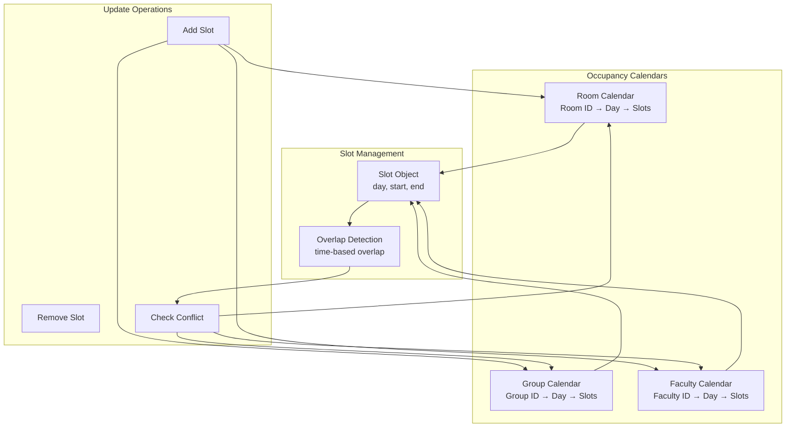

**Diagram sources**
- [generator.py:239-243](file://backend/app/services/timetable/generator.py#L239-L243)
- [generator.py:247-254](file://backend/app/services/timetable/generator.py#L247-L254)

### Slot Allocation Algorithms

The system implements efficient algorithms for slot allocation:

| Algorithm | Purpose | Complexity |
|-----------|---------|------------|
| `teaching_slots()` | Generate theory slots | O(Days × Periods) |
| `lab_windows_slots()` | Generate lab windows | O(Days × Windows) |
| `contiguous_ok()` | Validate continuity | O(Slots log Slots) |
| `fits()` | Conflict detection | O(3 × Occupancy) |

**Section sources**
- [generator.py:124-147](file://backend/app/services/timetable/generator.py#L124-L147)
- [generator.py:247-254](file://backend/app/services/timetable/generator.py#L247-L254)

## Error Handling and Fallback Mechanisms

### Placement Failure Scenarios

The system implements comprehensive error handling for placement failures:

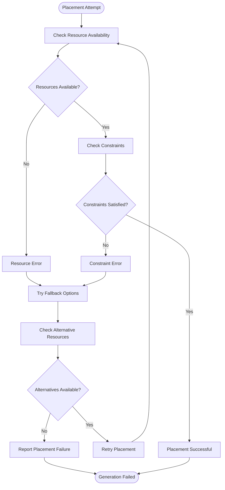

**Diagram sources**
- [generator.py:300-301](file://backend/app/services/timetable/generator.py#L300-L301)
- [generator.py:377-378](file://backend/app/services/timetable/generator.py#L377-L378)

### Fallback Mechanisms

When primary placement fails, the system employs several fallback strategies:

| Fallback Strategy | Implementation | Trigger Conditions |
|-------------------|----------------|-------------------|
| Alternative Rooms | Search different room types | Capacity mismatch |
| Flexible Timing | Try different time slots | Time conflicts |
| Faculty Rotation | Assign different faculty | Faculty unavailability |
| Course Splitting | Split into smaller sessions | Large session conflicts |
| Priority Adjustment | Lower course priority | Resource exhaustion |

**Section sources**
- [generator.py:300-301](file://backend/app/services/timetable/generator.py#L300-L301)
- [generator.py:377-378](file://backend/app/services/timetable/generator.py#L377-L378)

## Examples and Use Cases

### Example 1: Constraint Validation

The system validates constraints during timetable generation:

```python
# Example constraint validation process
def validate_constraint(constraint_type, parameters):
    """
    Validates a constraint against current timetable state
    """
    if constraint_type == "time_settings":
        # Validate time boundaries
        start_time = parameters.get("college_start_time", "08:00")
        end_time = parameters.get("college_end_time", "18:00")
        
        # Check if all courses fit within time bounds
        for course in timetable.courses:
            total_minutes = course.hours_per_week * 60
            if total_minutes > calculate_available_minutes(start_time, end_time):
                return False, "Time constraint violation"
    
    return True, "Constraint satisfied"
```

### Example 2: Slot Allocation Algorithm

The slot allocation algorithm demonstrates the core placement logic:

```python
def allocate_slot(course, group, room, faculty, day_slots):
    """
    Allocates a slot for course placement
    """
    for slot in day_slots:
        # Check all resource constraints
        if (is_room_available(room, slot) and 
            is_group_available(group, slot) and 
            is_faculty_available(faculty, slot) and
            is_course_repetition_allowed(group, course, slot.day)):
            
            # Commit the placement
            commit_placement(course, group, room, faculty, slot)
            return True
    
    return False  # No suitable slot found
```

### Example 3: Calendar Occupancy Update

The occupancy tracking system updates calendars after successful placements:

```python
def update_occupancy(room_id, group_id, faculty_id, slot):
    """
    Updates occupancy calendars for all involved resources
    """
    # Update room occupancy
    room_calendar[room_id][slot.day].append(slot)
    
    # Update group occupancy
    group_calendar[group_id][slot.day].append(slot)
    
    # Update faculty occupancy
    faculty_calendar[faculty_id][slot.day].append(slot)
    
    # Log the placement
    log_placement(room_id, group_id, faculty_id, slot)
```

## Performance Considerations

### Optimization Strategies

The system implements several optimization strategies for improved performance:

| Strategy | Benefit | Implementation |
|----------|---------|----------------|
| Pre-sorting | Reduces search time | Sort courses by hours_per_week |
| Early Termination | Saves computation | Stop when constraints satisfied |
| Caching | Reduces repeated calculations | Cache room/faculty availability |
| Parallel Processing | Utilizes multiple cores | Process independent groups concurrently |
| Memory Management | Reduces memory footprint | Clean up unused data structures |

### Complexity Analysis

| Operation | Time Complexity | Space Complexity |
|-----------|----------------|------------------|
| Course Loading | O(Courses + Groups + Rooms) | O(Courses + Groups + Rooms) |
| Constraint Processing | O(Constraints × Parameters) | O(Constraints) |
| Slot Generation | O(Days × Periods) | O(Days × Periods) |
| Placement Algorithm | O(Courses × Groups × Slots × Resources) | O(Slots × Resources) |
| Validation | O(Slots × Resources) | O(Slots × Resources) |

### Scalability Considerations

The system scales efficiently with institutional growth:

- **Linear Growth**: Course count affects runtime linearly
- **Quadratic Growth**: Group interactions create quadratic complexity
- **Logarithmic Optimization**: Sorting and searching reduce overhead
- **Memory Efficiency**: Shared calendars minimize memory usage

## Troubleshooting Guide

### Common Issues and Solutions

| Issue | Symptoms | Solution |
|-------|----------|----------|
| Placement Failures | Courses cannot be scheduled | Check resource availability and constraints |
| Time Conflicts | Overlapping schedules | Review time settings and lunch breaks |
| Room Capacity Errors | Students exceed room capacity | Verify room specifications and group sizes |
| Faculty Overload | Excessive teaching hours | Adjust faculty workload limits |
| Lab Scheduling Problems | Labs cannot be placed | Check lab room availability and windows |

### Debugging Techniques

1. **Constraint Validation**: Verify all constraints are properly configured
2. **Resource Audit**: Check room capacities and faculty availability
3. **Calendar Inspection**: Review occupancy calendars for conflicts
4. **Session Analysis**: Examine session structures and durations
5. **Priority Review**: Verify course priority settings

### Monitoring and Logging

The system provides comprehensive logging for troubleshooting:

- **Placement Attempts**: Track all placement attempts and outcomes
- **Constraint Violations**: Log specific constraint violations
- **Resource Conflicts**: Record resource availability issues
- **Performance Metrics**: Monitor generation performance
- **Error Messages**: Provide detailed error information

**Section sources**
- [generator.py:300-301](file://backend/app/services/timetable/generator.py#L300-L301)
- [generator.py:377-378](file://backend/app/services/timetable/generator.py#L377-L378)

## Conclusion

The Constraint-Based Generation Engine represents a comprehensive solution for academic timetable generation, combining sophisticated constraint satisfaction with practical scheduling considerations. The system's modular architecture, robust error handling, and flexible configuration make it suitable for diverse institutional needs while maintaining high-quality scheduling outcomes.

Key strengths include the two-phase generation approach, comprehensive constraint processing, efficient resource matching algorithms, and extensive validation capabilities. The system's ability to handle both traditional academic scheduling and NEP 2020 compliance demonstrates its adaptability to evolving educational standards.

Future enhancements could include machine learning-based optimization, real-time constraint adjustment, and enhanced user interface capabilities for manual timetable modification and fine-tuning.