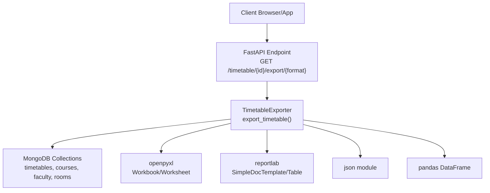
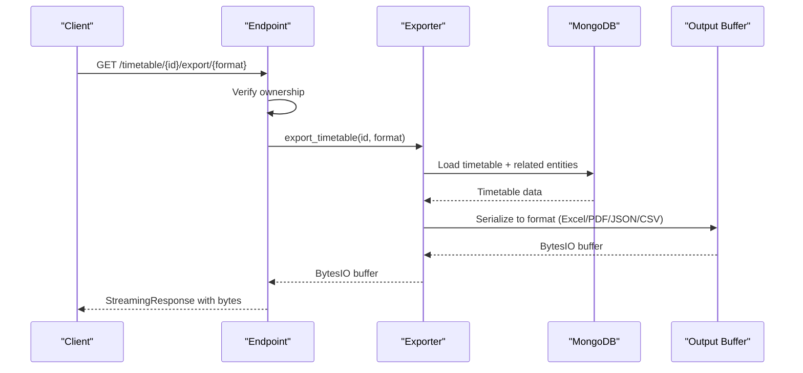
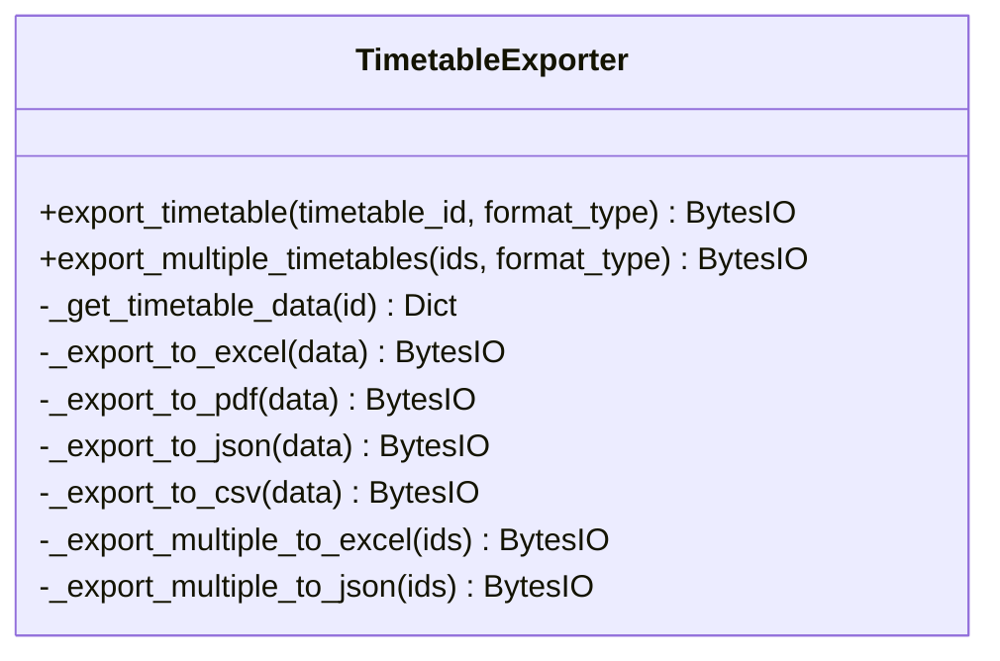
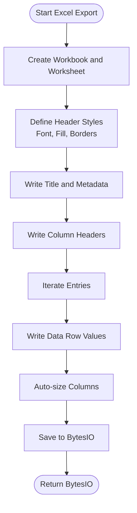
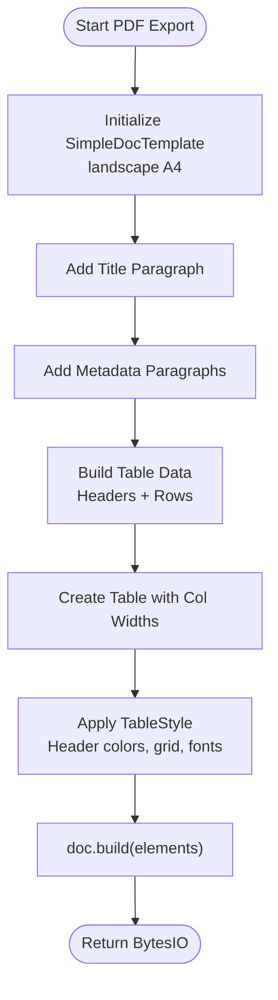
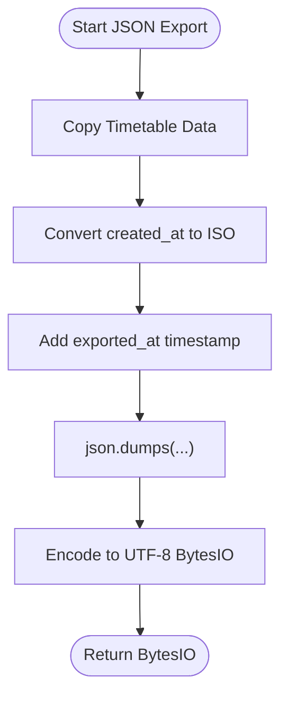
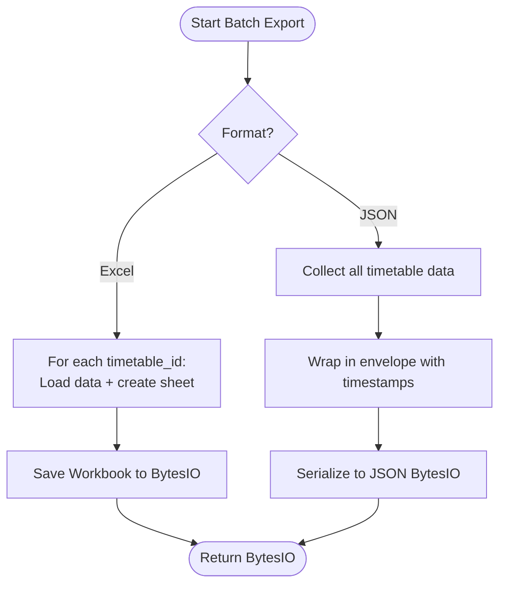
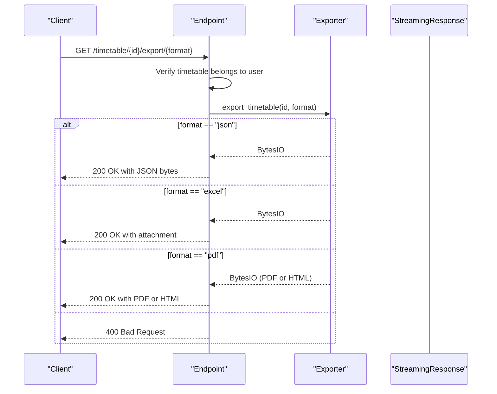
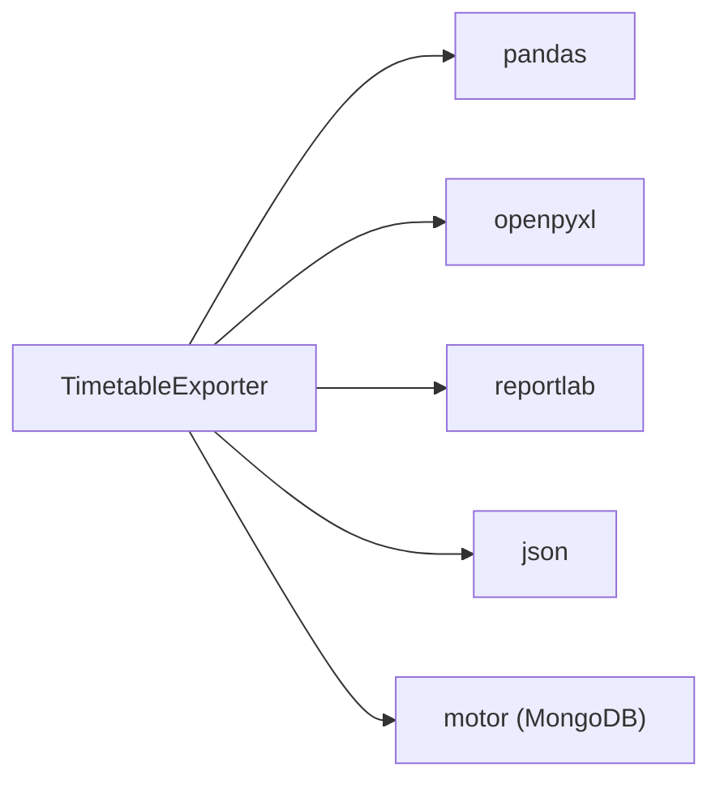

# Multi-Format Export System

<cite>
**Referenced Files in This Document**
- [exporter.py](file://backend/app/services/timetable/exporter.py)
- [timetable.py](file://backend/app/api/v1/endpoints/timetable.py)
- [mongodb.py](file://backend/app/db/mongodb.py)
- [requirements.txt](file://backend/requirements.txt)
- [timetable.py](file://backend/app/models/timetable.py)
- [course.py](file://backend/app/models/course.py)
- [faculty.py](file://backend/app/models/faculty.py)
- [room.py](file://backend/app/models/room.py)
</cite>

## Table of Contents
1. [Introduction](#introduction)
2. [Project Structure](#project-structure)
3. [Core Components](#core-components)
4. [Architecture Overview](#architecture-overview)
5. [Detailed Component Analysis](#detailed-component-analysis)
6. [Dependency Analysis](#dependency-analysis)
7. [Performance Considerations](#performance-considerations)
8. [Troubleshooting Guide](#troubleshooting-guide)
9. [Conclusion](#conclusion)

## Introduction
This document describes the multi-format export system for timetables, covering the exporter architecture, format-specific serializers, data transformation pipelines, and output generation processes. It explains:
- Excel export with sheet formatting, cell styling, and formula integration
- PDF export with page layout, table rendering, and print optimization
- JSON export for API consumption and data interchange
- Batch export capabilities for multiple timetables
- Customization options for export templates, styling, and content filtering
- Examples of export configuration, batch processing, and error handling for large exports
- Performance considerations and memory management strategies for bulk export operations

## Project Structure
The export system spans the API layer, service layer, and data access layer:
- API endpoints define export routes and response handling
- The exporter service encapsulates format-specific logic and data transformation
- Data access uses MongoDB collections for timetable, course, faculty, and room entities
- Dependencies include pandas, openpyxl, reportlab, and others for export formats



**Diagram sources**
- [timetable.py:623-687](file://backend/app/api/v1/endpoints/timetable.py#L623-L687)
- [exporter.py:22-40](file://backend/app/services/timetable/exporter.py#L22-L40)
- [mongodb.py:11-21](file://backend/app/db/mongodb.py#L11-L21)

**Section sources**
- [timetable.py:623-687](file://backend/app/api/v1/endpoints/timetable.py#L623-L687)
- [exporter.py:16-41](file://backend/app/services/timetable/exporter.py#L16-L41)
- [mongodb.py:11-21](file://backend/app/db/mongodb.py#L11-L21)

## Core Components
- TimetableExporter: Central orchestrator for export operations, format dispatch, and data transformation
- API endpoint: Validates ownership, invokes exporter, and streams binary responses
- Data access: Retrieves timetable and related entities from MongoDB
- Format-specific serializers: Excel (openpyxl), PDF (reportlab), JSON, CSV (pandas)

Key responsibilities:
- Format selection and routing
- Data enrichment with course, faculty, and room details
- Transformation to target format structures
- Streaming responses for large exports
- Error propagation with meaningful messages

**Section sources**
- [exporter.py:16-41](file://backend/app/services/timetable/exporter.py#L16-L41)
- [timetable.py:623-687](file://backend/app/api/v1/endpoints/timetable.py#L623-L687)

## Architecture Overview
The export pipeline follows a layered approach:
- Request enters the FastAPI endpoint
- Ownership verification ensures only authorized users can export their timetables
- Exporter retrieves enriched timetable data from MongoDB
- Format-specific serializer writes to an in-memory buffer
- Response is streamed to the client with appropriate MIME type and filename



**Diagram sources**
- [timetable.py:623-687](file://backend/app/api/v1/endpoints/timetable.py#L623-L687)
- [exporter.py:22-40](file://backend/app/services/timetable/exporter.py#L22-L40)
- [mongodb.py:11-21](file://backend/app/db/mongodb.py#L11-L21)

## Detailed Component Analysis

### TimetableExporter
The exporter class encapsulates all export logic:
- Dispatches to format-specific handlers
- Enriches timetable data with course, faculty, and room details
- Implements streaming responses for large outputs
- Provides batch export for Excel and JSON



**Diagram sources**
- [exporter.py:16-383](file://backend/app/services/timetable/exporter.py#L16-L383)

**Section sources**
- [exporter.py:16-383](file://backend/app/services/timetable/exporter.py#L16-L383)

### Excel Export
Excel export creates a workbook with:
- Styled headers (bold, colored fill, borders)
- Auto-sized columns based on content length
- Formatted time ranges and merged title cells
- Sheet-per-timetable for batch exports



**Diagram sources**
- [exporter.py:95-176](file://backend/app/services/timetable/exporter.py#L95-L176)

Key features:
- Header styling with font, fill, and border
- Auto-adjusted column widths with a cap
- Merged title cell spanning multiple columns
- Batch mode creates separate sheets per timetable

**Section sources**
- [exporter.py:95-176](file://backend/app/services/timetable/exporter.py#L95-L176)
- [exporter.py:327-359](file://backend/app/services/timetable/exporter.py#L327-L359)

### PDF Export
PDF export uses ReportLab to:
- Build a landscape A4 document with margins
- Render a styled table with alternating row colors and centered alignment
- Include program metadata and validation status
- Handle fallback to HTML when PDF generation fails



**Diagram sources**
- [exporter.py:178-262](file://backend/app/services/timetable/exporter.py#L178-L262)

Notes:
- Uses ReportLab’s TableStyle for grid, background, and alignment
- Paragraph styles for title and metadata
- Fallback handling checks for HTML vs PDF bytes

**Section sources**
- [exporter.py:178-262](file://backend/app/services/timetable/exporter.py#L178-L262)

### JSON Export
JSON export serializes:
- Converted datetime fields to ISO format
- Adds export timestamp for audit
- Suitable for API consumption and inter-system data exchange



**Diagram sources**
- [exporter.py:264-278](file://backend/app/services/timetable/exporter.py#L264-L278)

**Section sources**
- [exporter.py:264-278](file://backend/app/services/timetable/exporter.py#L264-L278)

### CSV Export
CSV export uses pandas:
- Converts entries to a DataFrame
- Renames and reorders columns for readability
- Writes to CSV with UTF-8 encoding

```mermaid
flowchart TD
Start(["Start CSV Export"]) --> DF["Create DataFrame from Entries"]
DF --> Rename["Rename and Reorder Columns"]
Rename --> ToCSV["df.to_csv(..., encoding='utf-8')"
ToCSV --> BytesIO["BytesIO Buffer"]
BytesIO --> End(["Return BytesIO"])
```

**Diagram sources**
- [exporter.py:280-312](file://backend/app/services/timetable/exporter.py#L280-L312)

**Section sources**
- [exporter.py:280-312](file://backend/app/services/timetable/exporter.py#L280-L312)

### Batch Export
Batch export supports:
- Excel: Multiple sheets, one per timetable
- JSON: Single JSON with an array of timetables and metadata



**Diagram sources**
- [exporter.py:314-383](file://backend/app/services/timetable/exporter.py#L314-L383)

**Section sources**
- [exporter.py:314-383](file://backend/app/services/timetable/exporter.py#L314-L383)

### API Endpoint Integration
The endpoint enforces ownership, selects the format, and streams the response:
- JSON returns raw bytes
- Excel returns a .xlsx attachment
- PDF attempts PDF; falls back to HTML if generation fails



**Diagram sources**
- [timetable.py:623-687](file://backend/app/api/v1/endpoints/timetable.py#L623-L687)
- [exporter.py:22-40](file://backend/app/services/timetable/exporter.py#L22-L40)

**Section sources**
- [timetable.py:623-687](file://backend/app/api/v1/endpoints/timetable.py#L623-L687)

## Dependency Analysis
External libraries and their roles:
- pandas: CSV export and DataFrame transformations
- openpyxl: Excel workbook creation and styling
- reportlab: PDF generation with tables and styles
- json: JSON serialization for API/data interchange
- motor: Asynchronous MongoDB driver for data access



**Diagram sources**
- [exporter.py:1-15](file://backend/app/services/timetable/exporter.py#L1-L15)
- [requirements.txt:1-19](file://backend/requirements.txt#L1-L19)

**Section sources**
- [exporter.py:1-15](file://backend/app/services/timetable/exporter.py#L1-L15)
- [requirements.txt:1-19](file://backend/requirements.txt#L1-L19)

## Performance Considerations
- Memory management
  - All exporters write to an in-memory BytesIO buffer; ensure clients consume the stream promptly to avoid buffering overhead
  - For large exports, consider chunked responses or server-side file generation with streaming
- Database load
  - Each export queries timetable plus related entities; batching reduces N+1 queries
  - Consider caching frequently accessed entities (courses, faculty, rooms) if repeated exports occur
- Format-specific optimizations
  - Excel auto-sizing is O(rows×columns); for very large datasets, precompute widths or cap column width
  - PDF rendering can be heavy; keep table styles minimal and avoid excessive images
- Concurrency
  - The exporter is asynchronous; ensure the web server handles concurrent export requests appropriately
- CSV export
  - Using pandas is efficient; ensure proper column ordering and avoid unnecessary conversions

[No sources needed since this section provides general guidance]

## Troubleshooting Guide
Common issues and resolutions:
- Unsupported format
  - The exporter raises a value error for unsupported formats; ensure the format parameter is one of excel, pdf, json, csv
- Ownership errors
  - The endpoint validates that the timetable belongs to the current user; ensure authentication is active and the user owns the timetable
- PDF generation failures
  - The endpoint detects HTML fallback; install or configure the PDF engine to produce PDFs consistently
- Large export timeouts
  - Increase server timeouts and ensure the client consumes the stream continuously
- Memory spikes during exports
  - Prefer streaming responses and avoid loading entire datasets into memory multiple times

**Section sources**
- [exporter.py:36-40](file://backend/app/services/timetable/exporter.py#L36-L40)
- [timetable.py:634-641](file://backend/app/api/v1/endpoints/timetable.py#L634-L641)
- [timetable.py:666-681](file://backend/app/api/v1/endpoints/timetable.py#L666-L681)

## Conclusion
The multi-format export system provides a robust, extensible foundation for exporting timetables across Excel, PDF, JSON, and CSV. It emphasizes secure access, format-specific styling, and streaming responses suitable for large-scale usage. Future enhancements could include configurable templates, export scheduling, and server-side file persistence for very large exports.