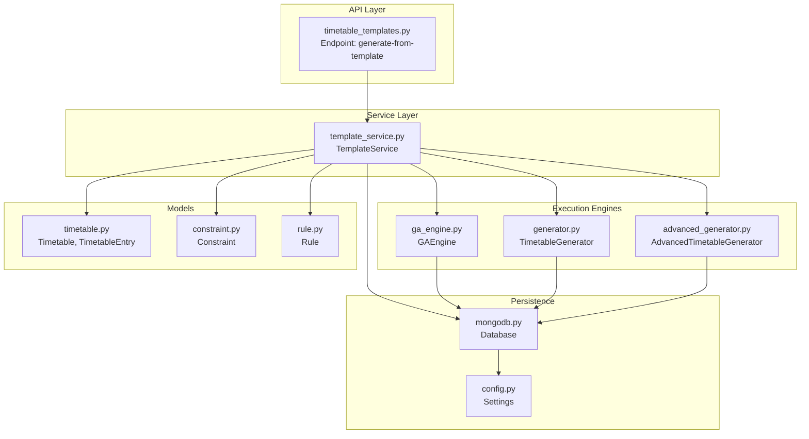
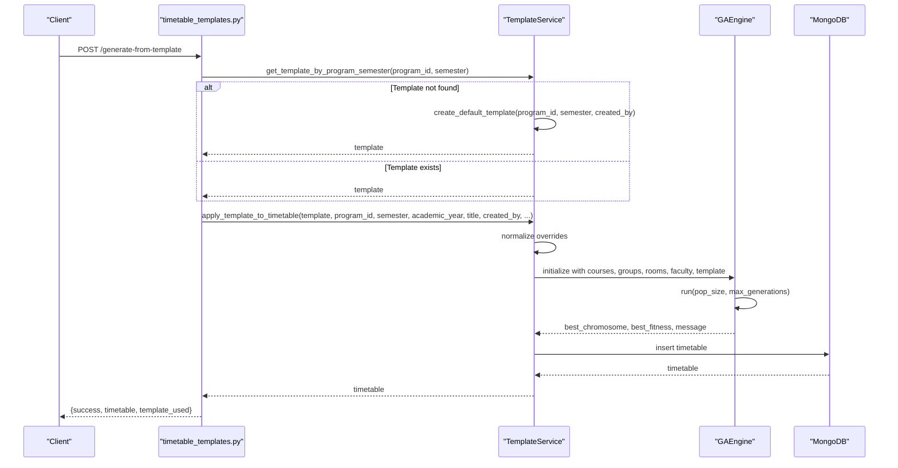
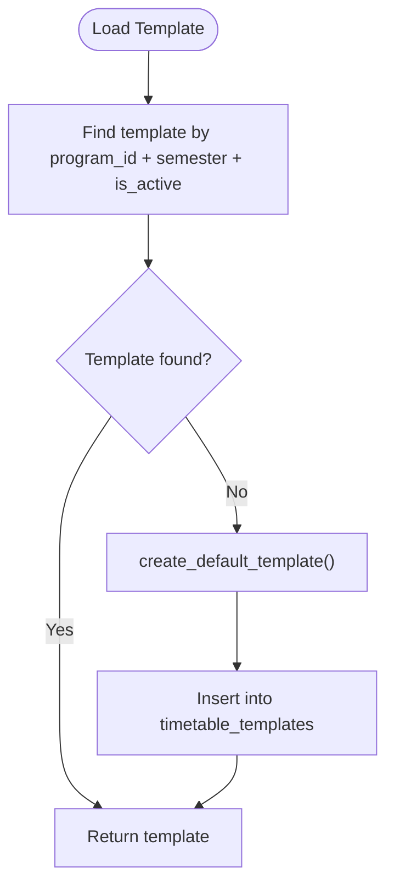
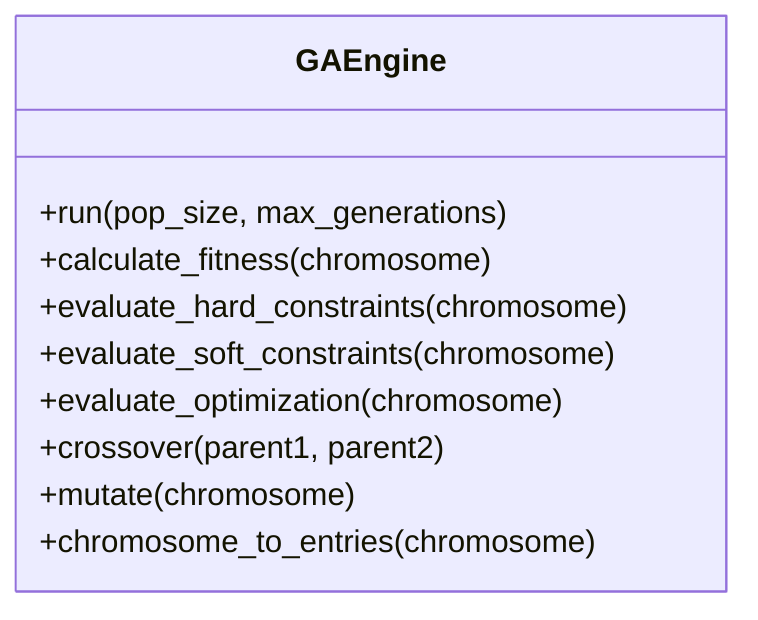
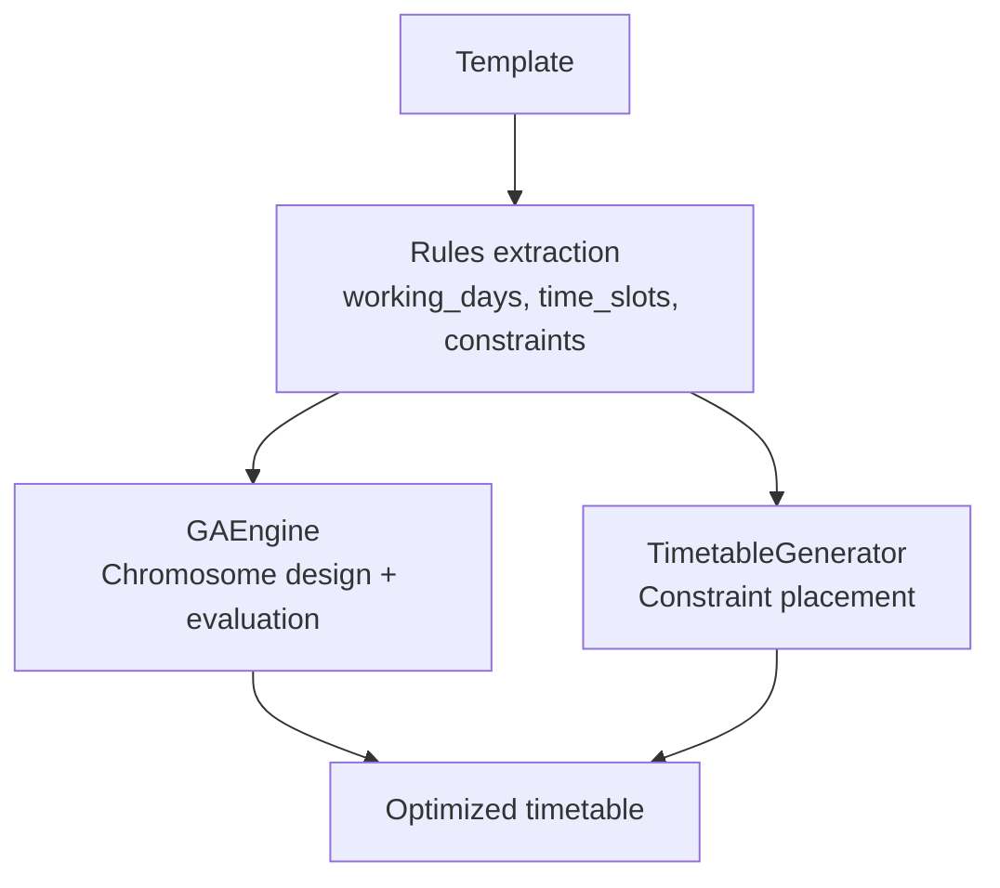
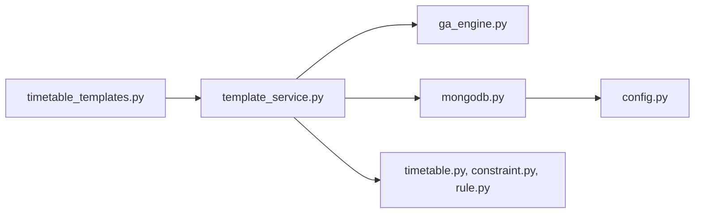

# Template-Based Generation System

<cite>
**Referenced Files in This Document**
- [template_service.py](file://backend/app/services/timetable/template_service.py)
- [timetable_templates.py](file://backend/app/api/v1/endpoints/timetable_templates.py)
- [ga_engine.py](file://backend/app/services/timetable/ga_engine.py)
- [generator.py](file://backend/app/services/timetable/generator.py)
- [advanced_generator.py](file://backend/app/services/timetable/advanced_generator.py)
- [timetable.py](file://backend/app/models/timetable.py)
- [constraint.py](file://backend/app/models/constraint.py)
- [rule.py](file://backend/app/models/rule.py)
- [mongodb.py](file://backend/app/db/mongodb.py)
- [config.py](file://backend/app/core/config.py)
- [cleanup_templates.py](file://backend/cleanup_templates.py)
</cite>

## Table of Contents
1. [Introduction](#introduction)
2. [Project Structure](#project-structure)
3. [Core Components](#core-components)
4. [Architecture Overview](#architecture-overview)
5. [Detailed Component Analysis](#detailed-component-analysis)
6. [Dependency Analysis](#dependency-analysis)
7. [Performance Considerations](#performance-considerations)
8. [Troubleshooting Guide](#troubleshooting-guide)
9. [Conclusion](#conclusion)

## Introduction
This document describes the template-based timetable generation system. It explains how templates define working days, time slots, subjects, room preferences, and constraints; how templates are loaded, validated, and applied; and how the execution engine integrates templates with the constraint-based generation process. It also covers storage, retrieval, versioning, backup strategies, and practical examples for creating, modifying, and deploying templates.

## Project Structure
The template system spans API endpoints, service layer, models, and database integration:
- API endpoints expose operations to generate timetables from templates
- Service layer manages template lifecycle, normalization, and application
- Execution engines (genetic algorithm and constraint-based generators) consume templates to produce schedules
- Models define data structures for templates, timetables, constraints, and rules
- Database layer persists templates and timetables

**Diagram sources**
- [timetable_templates.py:10-106](file://backend/app/api/v1/endpoints/timetable_templates.py#L10-L106)
- [template_service.py:6-486](file://backend/app/services/timetable/template_service.py#L6-L486)
- [ga_engine.py:19-414](file://backend/app/services/timetable/ga_engine.py#L19-L414)
- [generator.py:163-402](file://backend/app/services/timetable/generator.py#L163-L402)
- [advanced_generator.py:201-707](file://backend/app/services/timetable/advanced_generator.py#L201-L707)
- [timetable.py:6-52](file://backend/app/models/timetable.py#L6-L52)
- [constraint.py:6-30](file://backend/app/models/constraint.py#L6-L30)
- [rule.py:6-34](file://backend/app/models/rule.py#L6-L34)
- [mongodb.py:5-41](file://backend/app/db/mongodb.py#L5-L41)
- [config.py:7-61](file://backend/app/core/config.py#L7-L61)

**Section sources**
- [timetable_templates.py:10-106](file://backend/app/api/v1/endpoints/timetable_templates.py#L10-L106)
- [template_service.py:6-486](file://backend/app/services/timetable/template_service.py#L6-L486)
- [ga_engine.py:19-414](file://backend/app/services/timetable/ga_engine.py#L19-L414)
- [generator.py:163-402](file://backend/app/services/timetable/generator.py#L163-L402)
- [advanced_generator.py:201-707](file://backend/app/services/timetable/advanced_generator.py#L201-L707)
- [timetable.py:6-52](file://backend/app/models/timetable.py#L6-L52)
- [constraint.py:6-30](file://backend/app/models/constraint.py#L6-L30)
- [rule.py:6-34](file://backend/app/models/rule.py#L6-L34)
- [mongodb.py:5-41](file://backend/app/db/mongodb.py#L5-L41)
- [config.py:7-61](file://backend/app/core/config.py#L7-L61)

## Core Components
- TemplateService: Loads, normalizes, validates, creates, updates, deletes templates; applies templates to generate timetables via GAEngine
- GAEngine: Genetic algorithm that consumes template-defined time slots and room preferences to optimize a feasible timetable
- TimetableGenerator: Constraint-based generator that places labs first, then theory, enforcing hard and soft constraints
- AdvancedTimetableGenerator: Program-specific generator for CSE AI & ML with detailed rules and scoring
- Models: Define template structure (time slots, subjects, constraints), timetable entries, constraints, and rules
- Database: MongoDB integration for storing templates and timetables
- API Endpoint: Exposes generate-from-template operation

Key responsibilities:
- Template structure: working_days, time_slots, subjects, room_preferences, constraints
- Template loading: by program and semester, with fallback to default templates
- Template validation: via constraints and rule parameters
- Template application: normalization of overrides, fetching entities, GA execution, persistence

**Section sources**
- [template_service.py:6-486](file://backend/app/services/timetable/template_service.py#L6-L486)
- [ga_engine.py:19-414](file://backend/app/services/timetable/ga_engine.py#L19-L414)
- [generator.py:163-402](file://backend/app/services/timetable/generator.py#L163-L402)
- [advanced_generator.py:201-707](file://backend/app/services/timetable/advanced_generator.py#L201-L707)
- [timetable.py:6-52](file://backend/app/models/timetable.py#L6-L52)
- [constraint.py:6-30](file://backend/app/models/constraint.py#L6-L30)
- [rule.py:6-34](file://backend/app/models/rule.py#L6-L34)
- [mongodb.py:5-41](file://backend/app/db/mongodb.py#L5-L41)

## Architecture Overview
The template-based generation pipeline:
1. API receives a generation request with program_id, semester, academic_year, and optional title/student_group_id
2. Service loads or creates a template for the program and semester
3. Service normalizes overrides for courses, student groups, rooms, and faculty
4. Service runs GAEngine to allocate courses to time slots and rooms respecting template constraints
5. Service persists the generated timetable and returns it

**Diagram sources**
- [timetable_templates.py:10-106](file://backend/app/api/v1/endpoints/timetable_templates.py#L10-L106)
- [template_service.py:81-414](file://backend/app/services/timetable/template_service.py#L81-L414)
- [ga_engine.py:125-165](file://backend/app/services/timetable/ga_engine.py#L125-L165)
- [mongodb.py:11-41](file://backend/app/db/mongodb.py#L11-L41)

## Detailed Component Analysis

### Template Structure and Schema
Templates define:
- Template identity: template_name, program_id, semester, is_active, is_default
- Operational context: working_days, time_slots (with slot_type, duration_minutes), break_times
- Academic content: subjects (course-level info), room_preferences (lecture/lab)
- Constraints: list of constraints with types, parameters, and hard/soft flags
- Metadata: created_by, created_at, description

Normalization and defaults:
- Courses: normalize ids, codes, names, types, hours, min_per_session, lab flags, enrolledStudents
- Student groups: normalize ids, names, course_ids, strengths, program_id, group_type, section
- Rooms: normalize ids, names, types, capacities, lab flags
- Faculty: minimal normalization to ensure presence

Template creation:
- Default templates derive from active rules (time settings) and generate time_slots with theory and lab windows, plus default constraints

**Section sources**
- [template_service.py:10-78](file://backend/app/services/timetable/template_service.py#L10-L78)
- [template_service.py:81-207](file://backend/app/services/timetable/template_service.py#L81-L207)
- [timetable.py:6-52](file://backend/app/models/timetable.py#L6-L52)
- [constraint.py:6-30](file://backend/app/models/constraint.py#L6-L30)
- [rule.py:6-34](file://backend/app/models/rule.py#L6-L34)

### Template Loading and Retrieval
- Load by program_id and semester with is_active filter
- Fallback to create_default_template when missing
- Retrieve all templates with optional filters (program_id, semester, is_active)
- Convert ObjectIds to strings for JSON serialization

**Diagram sources**
- [template_service.py:81-207](file://backend/app/services/timetable/template_service.py#L81-L207)

**Section sources**
- [template_service.py:81-207](file://backend/app/services/timetable/template_service.py#L81-L207)
- [template_service.py:430-447](file://backend/app/services/timetable/template_service.py#L430-L447)

### Template Application and Execution Engine
- apply_template_to_timetable orchestrates:
  - Normalization of overrides
  - Entity resolution (courses, student groups, rooms, faculty)
  - Faculty mapping and assignment
  - GAEngine initialization and execution
  - Timetable construction and persistence

GAEngine specifics:
- Chromosome encodes required sessions (theory and lab) with day, slot, room, faculty
- Hard constraints: no faculty/room/group overlap
- Soft constraints: capacity utilization, balancing load across days
- Multi-objective fitness with weights for hard constraints, soft constraints, and optimization
- Evolution operators: crossover (order-based), mutation (swap, insertion, inversion, attribute)

**Diagram sources**
- [ga_engine.py:19-414](file://backend/app/services/timetable/ga_engine.py#L19-L414)

**Section sources**
- [template_service.py:209-414](file://backend/app/services/timetable/template_service.py#L209-L414)
- [ga_engine.py:19-414](file://backend/app/services/timetable/ga_engine.py#L19-L414)

### Constraint-Based Generation Integration
Two complementary approaches integrate templates with constraints:
- GAEngine: Uses template time_slots and room preferences to guide chromosome design and evaluation
- TimetableGenerator: A constraint-based placement engine that respects template-derived rules (working days, time windows, lunch breaks)

**Diagram sources**
- [template_service.py:209-414](file://backend/app/services/timetable/template_service.py#L209-L414)
- [ga_engine.py:19-414](file://backend/app/services/timetable/ga_engine.py#L19-L414)
- [generator.py:163-402](file://backend/app/services/timetable/generator.py#L163-L402)

**Section sources**
- [generator.py:95-233](file://backend/app/services/timetable/generator.py#L95-L233)
- [template_service.py:209-414](file://backend/app/services/timetable/template_service.py#L209-L414)

### Template Storage, Versioning, and Backup
Storage:
- Templates and timetables stored in MongoDB collections: timetable_templates, timetables
- Service converts ObjectIds to strings for JSON responses

Versioning and backup:
- No explicit version fields in templates; use created_at timestamps
- Recommended approach: create new templates per program/semester with descriptive names; keep older templates archived
- Backup strategy: export collections using MongoDB tools or scripts; the cleanup script demonstrates deletion and regeneration

**Section sources**
- [template_service.py:448-486](file://backend/app/services/timetable/template_service.py#L448-L486)
- [cleanup_templates.py:7-35](file://backend/cleanup_templates.py#L7-L35)
- [mongodb.py:11-41](file://backend/app/db/mongodb.py#L11-L41)

### Examples: Creation, Modification, Deployment
- Create default template: call create_default_template with program_id, semester, created_by; template derives from active rules
- Modify template: update template fields (time_slots, constraints, room_preferences) via update_template
- Deploy template: generate timetable from template; endpoint resolves program existence, loads/creates template, and executes GAEngine
- Cleanup and regenerate: run cleanup_templates to remove old templates and force regeneration with corrected time slots

**Section sources**
- [template_service.py:98-207](file://backend/app/services/timetable/template_service.py#L98-L207)
- [template_service.py:464-475](file://backend/app/services/timetable/template_service.py#L464-L475)
- [timetable_templates.py:10-106](file://backend/app/api/v1/endpoints/timetable_templates.py#L10-L106)
- [cleanup_templates.py:7-35](file://backend/cleanup_templates.py#L7-L35)

## Dependency Analysis
- API depends on TemplateService for orchestration
- TemplateService depends on:
  - MongoDB for persistence
  - GAEngine for optimization
  - Models for data structures
- GAEngine depends on template-provided working_days and time_slots
- Database configuration comes from settings

**Diagram sources**
- [timetable_templates.py:10-106](file://backend/app/api/v1/endpoints/timetable_templates.py#L10-L106)
- [template_service.py:6-486](file://backend/app/services/timetable/template_service.py#L6-L486)
- [ga_engine.py:19-414](file://backend/app/services/timetable/ga_engine.py#L19-L414)
- [timetable.py:6-52](file://backend/app/models/timetable.py#L6-L52)
- [constraint.py:6-30](file://backend/app/models/constraint.py#L6-L30)
- [rule.py:6-34](file://backend/app/models/rule.py#L6-L34)
- [mongodb.py:5-41](file://backend/app/db/mongodb.py#L5-L41)
- [config.py:7-61](file://backend/app/core/config.py#L7-L61)

**Section sources**
- [timetable_templates.py:10-106](file://backend/app/api/v1/endpoints/timetable_templates.py#L10-L106)
- [template_service.py:6-486](file://backend/app/services/timetable/template_service.py#L6-L486)
- [ga_engine.py:19-414](file://backend/app/services/timetable/ga_engine.py#L19-L414)
- [mongodb.py:5-41](file://backend/app/db/mongodb.py#L5-L41)
- [config.py:7-61](file://backend/app/core/config.py#L7-L61)

## Performance Considerations
- Population size and generations: tune GAEngine settings for convergence speed and solution quality
- Constraint evaluation: hard constraints dominate fitness; ensure templates minimize conflicts
- Room and faculty availability: pre-filter rooms by type and capacity; map faculty by subject expertise
- Time slot generation: leverage template time_slots to reduce search space

## Troubleshooting Guide
Common issues and resolutions:
- Template not found: ensure program_id and semester match; fallback creates default template
- No courses/rooms available: verify entity collections and active flags
- Overlapping allocations: hard constraint violations indicate template misalignment; adjust time_slots or constraints
- Database connectivity: confirm MongoDB connection settings and availability

Operational utilities:
- Cleanup old templates and regenerate: use cleanup_templates to remove stale templates and force new ones

**Section sources**
- [timetable_templates.py:35-106](file://backend/app/api/v1/endpoints/timetable_templates.py#L35-L106)
- [template_service.py:295-299](file://backend/app/services/timetable/template_service.py#L295-L299)
- [cleanup_templates.py:7-35](file://backend/cleanup_templates.py#L7-L35)

## Conclusion
The template-based generation system combines structured template definitions with robust execution engines. Templates encode operational context and constraints, while GAEngine and constraint-based generators enforce feasibility and quality. The service layer provides lifecycle management, normalization, and persistence, enabling reliable timetable creation, modification, and deployment.