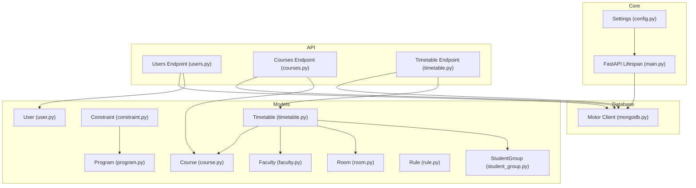
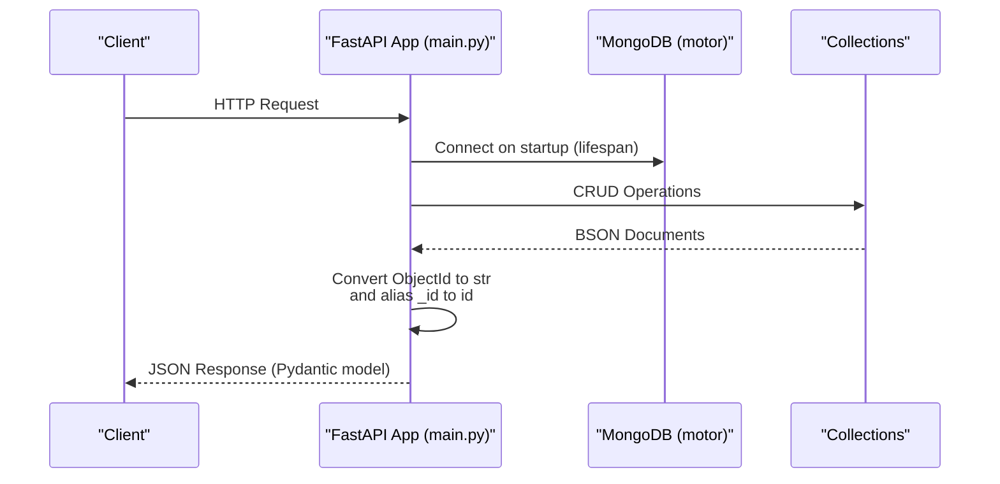
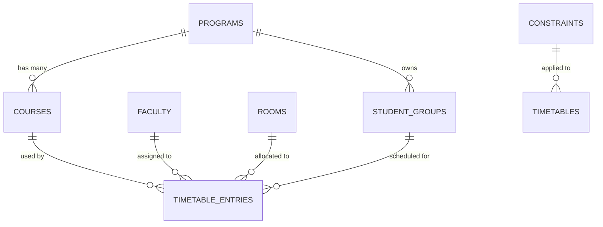
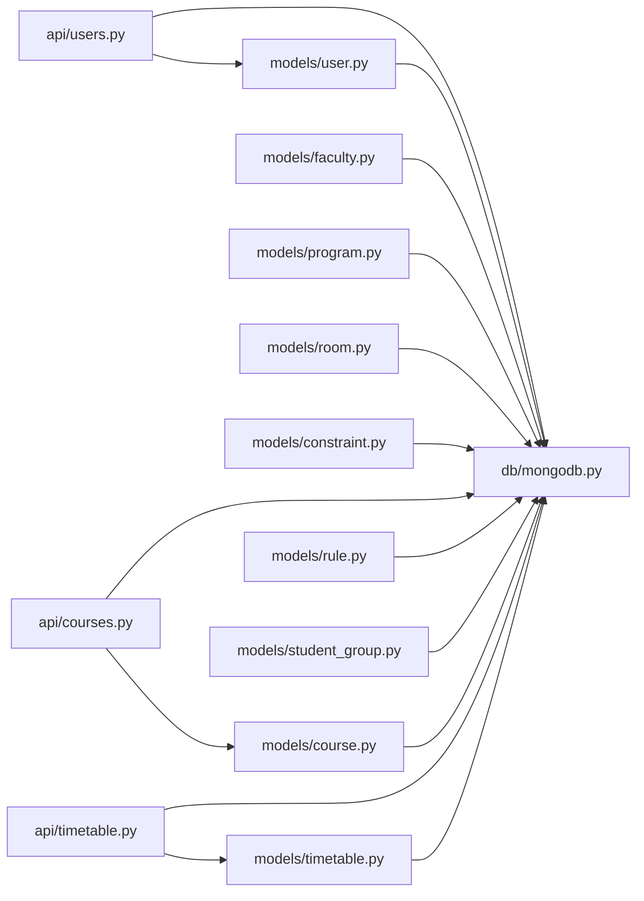

# Data Models and Database

<cite>
**Referenced Files in This Document**
- [mongodb.py](file://backend/app/db/mongodb.py)
- [config.py](file://backend/app/core/config.py)
- [main.py](file://backend/app/main.py)
- [user.py](file://backend/app/models/user.py)
- [course.py](file://backend/app/models/course.py)
- [faculty.py](file://backend/app/models/faculty.py)
- [program.py](file://backend/app/models/program.py)
- [room.py](file://backend/app/models/room.py)
- [constraint.py](file://backend/app/models/constraint.py)
- [timetable.py](file://backend/app/models/timetable.py)
- [rule.py](file://backend/app/models/rule.py)
- [student_group.py](file://backend/app/models/student_group.py)
- [users.py](file://backend/app/api/v1/endpoints/users.py)
- [courses.py](file://backend/app/api/v1/endpoints/courses.py)
- [timetable.py](file://backend/app/api/v1/endpoints/timetable.py)
</cite>

## Table of Contents
1. [Introduction](#introduction)
2. [Project Structure](#project-structure)
3. [Core Components](#core-components)
4. [Architecture Overview](#architecture-overview)
5. [Detailed Component Analysis](#detailed-component-analysis)
6. [Dependency Analysis](#dependency-analysis)
7. [Performance Considerations](#performance-considerations)
8. [Troubleshooting Guide](#troubleshooting-guide)
9. [Conclusion](#conclusion)
10. [Appendices](#appendices)

## Introduction
This document explains the ShedMaster data models and MongoDB integration. It covers Pydantic model definitions for User, Course, Faculty, Program, Room, Constraint, Timetable, Rule, and StudentGroup; MongoDB schema design patterns; collection relationships; connection management with the Motor async driver; validation, serialization, and deserialization; migration and schema evolution strategies; complex queries and aggregation patterns; data integrity and referential integrity; transaction handling; performance optimization, backup, and monitoring guidance.

## Project Structure
The backend follows a layered structure:
- Core configuration defines environment-driven settings (database URLs, secrets, pagination).
- Database module initializes and manages the async MongoDB connection via Motor.
- Models define Pydantic schemas for all domain entities.
- API endpoints orchestrate CRUD operations and orchestrate service logic while interacting with collections.
- Services encapsulate timetable generation, optimization, and export logic.

**Diagram sources**
- [config.py:1-61](file://backend/app/core/config.py#L1-L61)
- [main.py:25-32](file://backend/app/main.py#L25-L32)
- [mongodb.py:11-41](file://backend/app/db/mongodb.py#L11-L41)
- [user.py:11-76](file://backend/app/models/user.py#L11-L76)
- [course.py:1-43](file://backend/app/models/course.py#L1-L43)
- [faculty.py:1-39](file://backend/app/models/faculty.py#L1-L39)
- [program.py:1-33](file://backend/app/models/program.py#L1-L33)
- [room.py:1-43](file://backend/app/models/room.py#L1-L43)
- [constraint.py:1-30](file://backend/app/models/constraint.py#L1-L30)
- [timetable.py:1-52](file://backend/app/models/timetable.py#L1-L52)
- [rule.py:1-34](file://backend/app/models/rule.py#L1-L34)
- [student_group.py:1-36](file://backend/app/models/student_group.py#L1-L36)
- [users.py:1-123](file://backend/app/api/v1/endpoints/users.py#L1-L123)
- [courses.py:1-279](file://backend/app/api/v1/endpoints/courses.py#L1-L279)
- [timetable.py:1-728](file://backend/app/api/v1/endpoints/timetable.py#L1-L728)

**Section sources**
- [config.py:1-61](file://backend/app/core/config.py#L1-L61)
- [main.py:25-32](file://backend/app/main.py#L25-L32)
- [mongodb.py:11-41](file://backend/app/db/mongodb.py#L11-L41)

## Core Components
This section documents the Pydantic models and their roles in the system.

- MongoBaseModel: Provides ObjectId serialization and aliasing for MongoDB’s _id to id.
- User: Authentication and profile entity with timestamps and admin flags.
- Course: Academic course definition with credits, hours, semester, prerequisites, and lab flags.
- Faculty: Instructor profile with availability, max hours, and subject specializations.
- Program: Academic program with duration, total semesters, and credit requirements.
- Room: Classroom or lab facility with capacity, accessibility, and facilities.
- Constraint: Parameterized scheduling constraints with priority and scoping to program or global.
- Timetable: Timetable document composed of entries with course, faculty, room, and time slots; includes metadata and optimization fields.
- Rule: Global or scoped rule parameters for generation settings.
- StudentGroup: Logical grouping of students for scheduling (year, semester, section, strength).

Key validation and serialization behaviors:
- All models inherit from MongoBaseModel to ensure ObjectId-to-string conversion and consistent JSON encoders.
- Several models use strict numeric bounds (e.g., credits, hours, capacity) and enums-like strings for categorical fields.
- Timestamps are managed via datetime defaults and updates.

**Section sources**
- [user.py:11-76](file://backend/app/models/user.py#L11-L76)
- [course.py:1-43](file://backend/app/models/course.py#L1-L43)
- [faculty.py:1-39](file://backend/app/models/faculty.py#L1-L39)
- [program.py:1-33](file://backend/app/models/program.py#L1-L33)
- [room.py:1-43](file://backend/app/models/room.py#L1-L43)
- [constraint.py:1-30](file://backend/app/models/constraint.py#L1-L30)
- [timetable.py:1-52](file://backend/app/models/timetable.py#L1-L52)
- [rule.py:1-34](file://backend/app/models/rule.py#L1-L34)
- [student_group.py:1-36](file://backend/app/models/student_group.py#L1-L36)

## Architecture Overview
The system uses FastAPI with Motor for asynchronous MongoDB access. The application lifecycle manages a single shared database connection across requests. API endpoints convert Pydantic models to/from MongoDB documents, handling ObjectId conversions and JSON serialization.

**Diagram sources**
- [main.py:25-32](file://backend/app/main.py#L25-L32)
- [mongodb.py:11-41](file://backend/app/db/mongodb.py#L11-L41)
- [users.py:24-25](file://backend/app/api/v1/endpoints/users.py#L24-L25)
- [courses.py:37-51](file://backend/app/api/v1/endpoints/courses.py#L37-L51)
- [timetable.py:47-71](file://backend/app/api/v1/endpoints/timetable.py#L47-L71)

## Detailed Component Analysis

### Database Connection Management
- Connection creation uses Motor’s AsyncIOMotorClient with a server selection timeout.
- The database instance stores the client and the selected database by name.
- Health checks use a ping command to verify connectivity.
- On shutdown, the client closes gracefully.

Operational notes:
- Connection failures are logged but do not prevent API startup, enabling offline development/testing modes.
- The connection is reused across requests via a singleton-like db instance.

**Section sources**
- [mongodb.py:11-41](file://backend/app/db/mongodb.py#L11-L41)
- [config.py:25-27](file://backend/app/core/config.py#L25-L27)
- [main.py:25-32](file://backend/app/main.py#L25-L32)

### Data Validation, Serialization, and Deserialization
- Pydantic v2 configurations enable aliasing (_id to id), arbitrary types, JSON encoders for ObjectId, and strict field validation.
- API endpoints convert ObjectId fields to strings for JSON responses and handle aliasing consistently.
- Creation/update endpoints validate inputs, enforce uniqueness constraints, and sanitize ObjectId conversions.

Common patterns:
- ObjectId conversion: String IDs are parsed to ObjectId for queries; returned documents convert ObjectId back to strings.
- Aliasing: _id is exposed as id to the client.
- Strict validation: Numeric ranges enforced at model level and endpoint level.

**Section sources**
- [user.py:11-20](file://backend/app/models/user.py#L11-L20)
- [courses.py:68-74](file://backend/app/api/v1/endpoints/courses.py#L68-L74)
- [timetable.py:52-71](file://backend/app/api/v1/endpoints/timetable.py#L52-L71)

### MongoDB Schema Design Patterns and Collection Relationships
Collections and relationships:
- users: Stores user profiles and credentials.
- courses: Courses linked to programs; includes prerequisites and lab flags.
- faculty: Instructors with availability and subject specializations.
- programs: Academic programs with metadata.
- rooms: Facilities with attributes for accessibility and equipment.
- constraints: Scheduling constraints scoped globally or per program.
- timetables: Documents containing entries with course_id, faculty_id, room_id, time_slot, and metadata.
- timetable_templates: Templates used for generation (referenced by timetable generation endpoints).
- student_groups: Logical groups of students for scheduling.

Schema patterns:
- Embedded vs. referenced: Timetable entries embed course_id, faculty_id, room_id, and time_slot; these are referenced identifiers stored in separate collections.
- Scoping: Constraints can be global (program_id null) or program-specific.
- Metadata: Timetables include metadata for generation method, statistics, and optimization scores.

**Diagram sources**
- [timetable.py:13-18](file://backend/app/models/timetable.py#L13-L18)
- [courses.py:14](file://backend/app/models/course.py#L14)
- [constraint.py:13](file://backend/app/models/constraint.py#L13)
- [student_group.py:13](file://backend/app/models/student_group.py#L13)

### Indexing Strategies
Recommended indexes (conceptual guidance):
- Unique indexes:
  - users.email
  - courses.code
  - rooms.name + building + floor
- Compound indexes:
  - timetables.program_id + semester + academic_year
  - timetables.created_by + created_at
  - constraints.program_id + is_active
  - courses.program_id + semester + is_active
- Text/search indexes:
  - courses.name, faculty.name, rooms.name
- TTL for temporary or draft documents if applicable.

Note: The current code does not explicitly create indexes; adding them improves query performance for frequent filters and joins.

[No sources needed since this section provides general guidance]

### Data Integrity and Referential Integrity
- User isolation: Timetable endpoints filter by created_by to ensure users only access their own documents.
- Ownership checks: Updates and deletes verify that the requesting user owns the target document.
- Uniqueness: Courses enforce unique course codes; users enforce unique emails.
- ObjectId handling: All cross-entity references are stored as ObjectId; conversion to strings occurs only in responses.

Potential improvements:
- Add database-level foreign key-like checks via application-level validation or database triggers if supported.
- Enforce referential integrity by validating existence of referenced IDs before insert/update.

**Section sources**
- [timetable.py:34](file://backend/app/api/v1/endpoints/timetable.py#L34)
- [timetable.py:84-87](file://backend/app/api/v1/endpoints/timetable.py#L84-L87)
- [timetable.py:551-554](file://backend/app/api/v1/endpoints/timetable.py#L551-L554)
- [courses.py:68-74](file://backend/app/api/v1/endpoints/courses.py#L68-L74)
- [users.py:65-67](file://backend/app/api/v1/endpoints/users.py#L65-L67)

### Transaction Handling
- Current operations are single-document writes and reads; no multi-document transactions are used.
- Recommendations:
  - Wrap multi-step generation and validation in a single transaction if consistency across collections is required.
  - Use sessions and retries for idempotent operations.

[No sources needed since this section provides general guidance]

### Migration Strategies and Schema Evolution
- Backward compatibility: New fields are optional; existing documents remain readable.
- ObjectId normalization: Ensure all identifiers are stored as ObjectId and converted to strings for responses.
- Versioned metadata: Store schema version in documents or metadata to support migrations.
- Controlled rollout: Introduce new fields gradually and handle missing values gracefully.

[No sources needed since this section provides general guidance]

### Examples of Complex Queries and Aggregation Pipelines
- Filtering and pagination:
  - Courses: Filter by program_id and semester; paginate with skip/limit.
  - Timetables: Filter by created_by, program_id, semester, academic_year, is_draft; paginate.
- Aggregation examples (conceptual):
  - Count sessions per course per day: group by course_id and day, sum durations.
  - Faculty workload: group by faculty_id, sum hours per week/day.
  - Room utilization: group by room_id, count scheduled slots per time window.
  - Compliance metrics: compute NEP 2020 adherence scores using metadata fields.

[No sources needed since this section provides general guidance]

## Dependency Analysis
The following diagram shows how models and endpoints depend on the database layer and each other.

**Diagram sources**
- [mongodb.py:11-41](file://backend/app/db/mongodb.py#L11-L41)
- [user.py:11-76](file://backend/app/models/user.py#L11-L76)
- [course.py:1-43](file://backend/app/models/course.py#L1-L43)
- [faculty.py:1-39](file://backend/app/models/faculty.py#L1-L39)
- [program.py:1-33](file://backend/app/models/program.py#L1-L33)
- [room.py:1-43](file://backend/app/models/room.py#L1-L43)
- [constraint.py:1-30](file://backend/app/models/constraint.py#L1-L30)
- [timetable.py:1-52](file://backend/app/models/timetable.py#L1-L52)
- [rule.py:1-34](file://backend/app/models/rule.py#L1-L34)
- [student_group.py:1-36](file://backend/app/models/student_group.py#L1-L36)
- [users.py:1-123](file://backend/app/api/v1/endpoints/users.py#L1-L123)
- [courses.py:1-279](file://backend/app/api/v1/endpoints/courses.py#L1-L279)
- [timetable.py:1-728](file://backend/app/api/v1/endpoints/timetable.py#L1-L728)

**Section sources**
- [mongodb.py:11-41](file://backend/app/db/mongodb.py#L11-L41)
- [users.py:1-123](file://backend/app/api/v1/endpoints/users.py#L1-L123)
- [courses.py:1-279](file://backend/app/api/v1/endpoints/courses.py#L1-L279)
- [timetable.py:1-728](file://backend/app/api/v1/endpoints/timetable.py#L1-L728)

## Performance Considerations
- Connection pooling: Motor uses a pool under the hood; reuse the shared db instance.
- Indexing: Add targeted indexes for frequent filters (e.g., program_id + semester, created_by).
- Projection: Limit fields in find operations for read-heavy endpoints.
- Batching: Use bulk operations for imports and batch updates.
- Caching: Cache frequently accessed static data (programs, rooms, constraints) in memory.
- Pagination: Always paginate large lists; avoid returning entire collections.
- Monitoring: Track slow queries, connection counts, and timeouts.

[No sources needed since this section provides general guidance]

## Troubleshooting Guide
Common issues and resolutions:
- Connection failures:
  - Verify MONGODB_URL and DATABASE_NAME in settings.
  - Check network connectivity and firewall rules.
  - Review logs for ping failure messages.
- ObjectId errors:
  - Ensure string IDs are converted to ObjectId before queries.
  - Confirm ObjectId strings are valid hex values.
- Validation errors:
  - Check Pydantic field validators and ranges.
  - Inspect RequestValidationError responses for precise field issues.
- Permission errors:
  - Confirm user is admin for admin-only endpoints.
  - Verify created_by ownership for timetable operations.

**Section sources**
- [mongodb.py:11-41](file://backend/app/db/mongodb.py#L11-L41)
- [courses.py:68-74](file://backend/app/api/v1/endpoints/courses.py#L68-L74)
- [timetable.py:34](file://backend/app/api/v1/endpoints/timetable.py#L34)
- [timetable.py:84-87](file://backend/app/api/v1/endpoints/timetable.py#L84-L87)

## Conclusion
ShedMaster employs robust Pydantic models with Motor for asynchronous MongoDB access. The design emphasizes user isolation, strict validation, and flexible schema evolution. By adding strategic indexes, enforcing referential integrity, and adopting transactional patterns for multi-step operations, the system can scale effectively. The provided patterns for queries, aggregations, and performance tuning offer practical guidance for production deployments.

## Appendices

### Appendix A: Pydantic Model Class Diagram

```mermaid
classDiagram
class MongoBaseModel {
+string id
}
class UserBase
class UserCreate
class UserUpdate
class UserInDB
class User
class CourseBase
class CourseCreate
class CourseUpdate
class Course
class FacultyBase
class FacultyCreate
class FacultyUpdate
class FacultyInDB
class Faculty
class ProgramBase
class ProgramCreate
class ProgramUpdate
class Program
class RoomBase
class RoomCreate
class RoomUpdate
class Room
class ConstraintBase
class ConstraintCreate
class ConstraintUpdate
class Constraint
class TimeSlot
class TimetableEntry
class TimetableBase
class TimetableCreate
class TimetableUpdate
class Timetable
MongoBaseModel <|-- User
MongoBaseModel <|-- Course
MongoBaseModel <|-- Program
MongoBaseModel <|-- Room
MongoBaseModel <|-- Constraint
MongoBaseModel <|-- Timetable
UserBase <|-- User
UserCreate <|-- User
UserUpdate <|-- User
UserInDB <|-- User
CourseBase <|-- Course
CourseCreate <|-- Course
CourseUpdate <|-- Course
FacultyBase <|-- Faculty
FacultyCreate <|-- Faculty
FacultyUpdate <|-- Faculty
FacultyInDB <|-- Faculty
ProgramBase <|-- Program
ProgramCreate <|-- Program
ProgramUpdate <|-- Program
RoomBase <|-- Room
RoomCreate <|-- Room
RoomUpdate <|-- Room
ConstraintBase <|-- Constraint
ConstraintCreate <|-- Constraint
ConstraintUpdate <|-- Constraint
TimetableEntry <|-- Timetable
TimeSlot <|-- TimetableEntry
TimetableBase <|-- Timetable
TimetableCreate <|-- Timetable
TimetableUpdate <|-- Timetable
```

**Diagram sources**
- [user.py:11-76](file://backend/app/models/user.py#L11-L76)
- [course.py:1-43](file://backend/app/models/course.py#L1-L43)
- [faculty.py:1-39](file://backend/app/models/faculty.py#L1-L39)
- [program.py:1-33](file://backend/app/models/program.py#L1-L33)
- [room.py:1-43](file://backend/app/models/room.py#L1-L43)
- [constraint.py:1-30](file://backend/app/models/constraint.py#L1-L30)
- [timetable.py:1-52](file://backend/app/models/timetable.py#L1-L52)