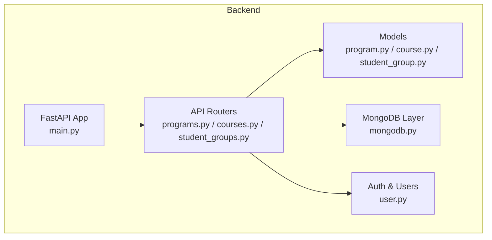
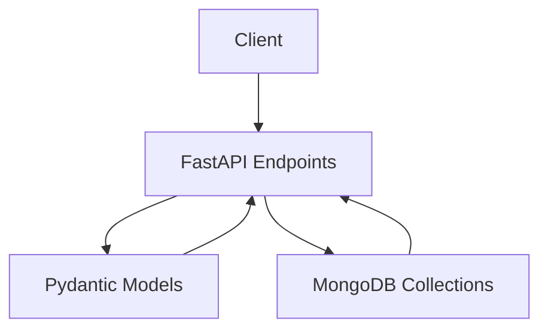
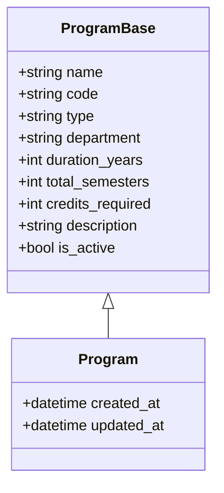
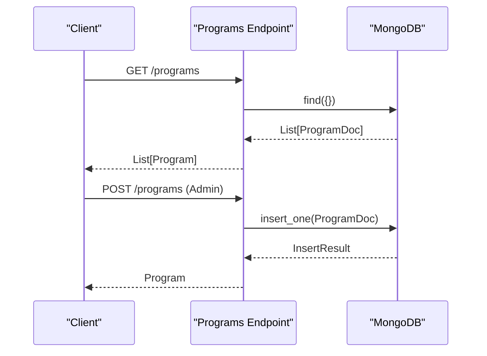
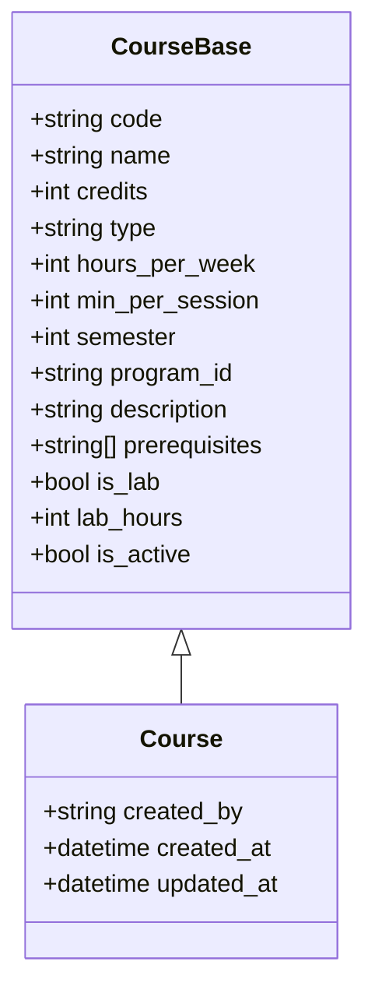
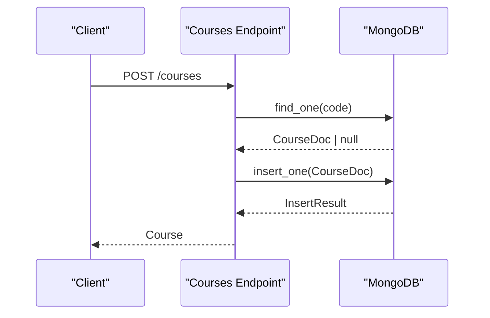
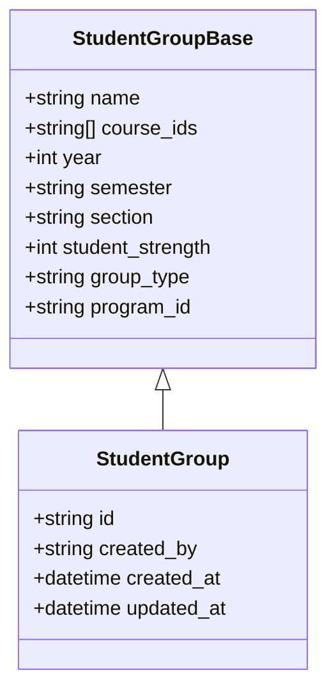
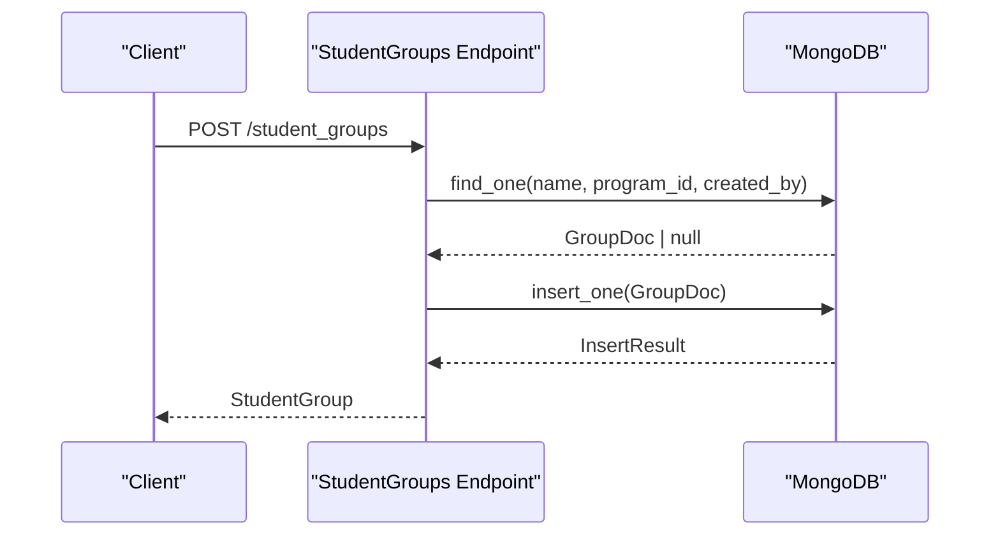
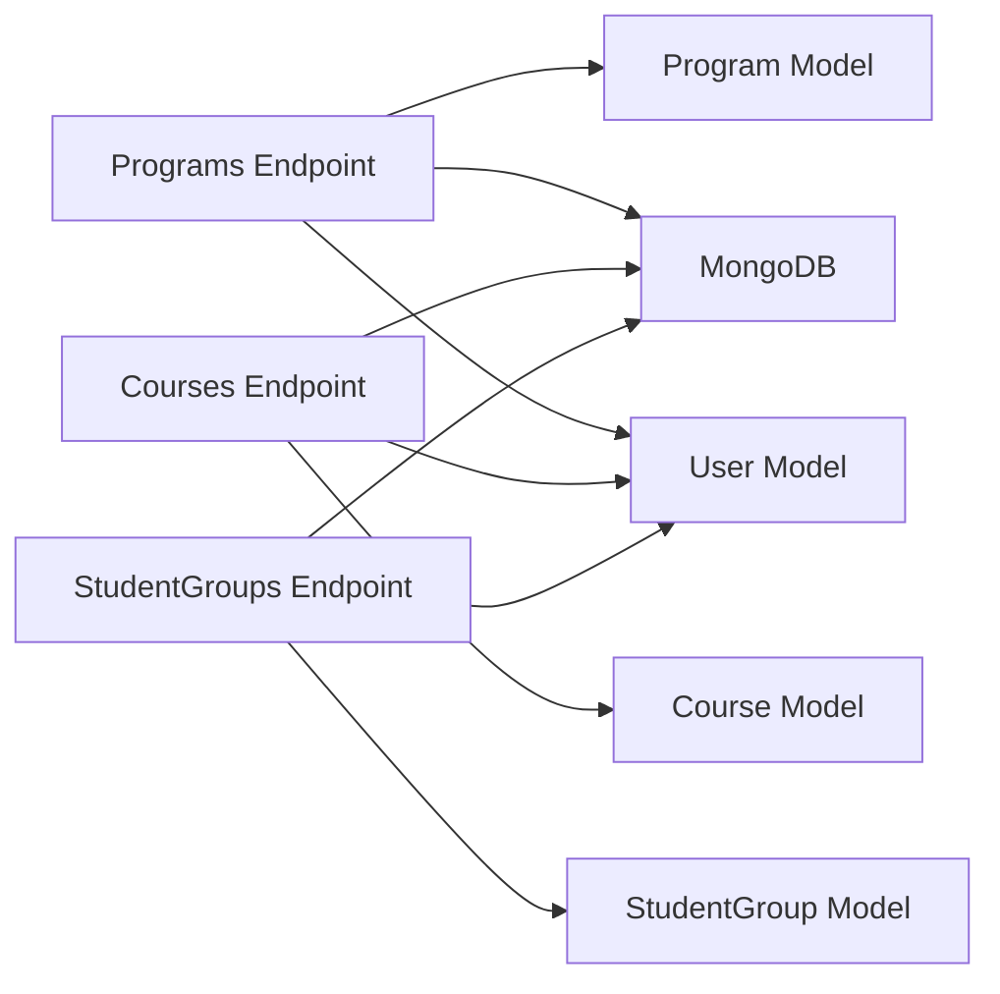

# Academic Models

<cite>
**Referenced Files in This Document**
- [program.py](file://backend/app/models/program.py)
- [course.py](file://backend/app/models/course.py)
- [student_group.py](file://backend/app/models/student_group.py)
- [constraint.py](file://backend/app/models/constraint.py)
- [rule.py](file://backend/app/models/rule.py)
- [programs.py](file://backend/app/api/v1/endpoints/programs.py)
- [courses.py](file://backend/app/api/v1/endpoints/courses.py)
- [student_groups.py](file://backend/app/api/v1/endpoints/student_groups.py)
- [constraints.py](file://backend/app/api/v1/endpoints/constraints.py)
- [rules.py](file://backend/app/api/v1/endpoints/rules.py)
- [mongodb.py](file://backend/app/db/mongodb.py)
- [user.py](file://backend/app/models/user.py)
- [main.py](file://backend/app/main.py)
- [config.py](file://backend/app/core/config.py)
</cite>

## Table of Contents
1. [Introduction](#introduction)
2. [Project Structure](#project-structure)
3. [Core Components](#core-components)
4. [Architecture Overview](#architecture-overview)
5. [Detailed Component Analysis](#detailed-component-analysis)
6. [Dependency Analysis](#dependency-analysis)
7. [Performance Considerations](#performance-considerations)
8. [Troubleshooting Guide](#troubleshooting-guide)
9. [Conclusion](#conclusion)
10. [Appendices](#appendices)

## Introduction
This document describes the academic hierarchy models in ShedMaster and how they are enforced through Pydantic models, FastAPI endpoints, and MongoDB persistence. It focuses on:
- Program: academic department and degree specifications, curriculum structure, and course requirements
- Course: academic properties, credit hours, prerequisites, and enrollment tracking
- StudentGroup: class grouping, batch management, and cohort tracking
It also documents model relationships, foreign key references, validation rules, and practical scenarios for academic planning, course catalog management, and student grouping strategies.

## Project Structure
The academic models are defined under the backend models directory and exposed via FastAPI endpoints grouped under the v1 API. MongoDB collections are accessed through a shared database client initialized at startup.

**Diagram sources**
- [main.py:33-102](file://backend/app/main.py#L33-L102)
- [programs.py:10-288](file://backend/app/api/v1/endpoints/programs.py#L10-L288)
- [courses.py:1-279](file://backend/app/api/v1/endpoints/courses.py#L1-L279)
- [student_groups.py:1-380](file://backend/app/api/v1/endpoints/student_groups.py#L1-L380)
- [mongodb.py:5-41](file://backend/app/db/mongodb.py#L5-L41)
- [user.py:11-76](file://backend/app/models/user.py#L11-L76)

**Section sources**
- [main.py:25-39](file://backend/app/main.py#L25-L39)
- [config.py:25-27](file://backend/app/core/config.py#L25-L27)
- [mongodb.py:11-26](file://backend/app/db/mongodb.py#L11-L26)

## Core Components
This section introduces the three primary academic models and their roles in the system.

- Program: Defines academic programs (e.g., B.Ed, M.Ed, FYUP) with metadata such as duration, semesters, and total credits required. It supports filtering and statistics endpoints.
- Course: Encapsulates course attributes including credits, hours per week, semester placement, prerequisites, lab flag, and linkage to a Program via program_id.
- StudentGroup: Represents class cohorts with year, semester, section, strength, and linked course IDs, tied to a Program via program_id.

Key model relationships:
- Courses belong to a Program via program_id
- StudentGroups belong to a Program via program_id
- Courses can reference other courses as prerequisites via prerequisite IDs
- StudentGroups link to multiple Course IDs

Validation highlights:
- Numeric bounds for credits, hours, sessions, and student strength
- Semester range constraints
- ObjectId parsing and validation in endpoints
- Uniqueness checks for program and course codes

**Section sources**
- [program.py:6-33](file://backend/app/models/program.py#L6-L33)
- [course.py:6-43](file://backend/app/models/course.py#L6-L43)
- [student_group.py:5-36](file://backend/app/models/student_group.py#L5-L36)

## Architecture Overview
The system follows a layered architecture:
- Presentation: FastAPI endpoints define CRUD and query operations for academic entities
- Domain: Pydantic models define schemas and validation rules
- Persistence: MongoDB collections store documents with ObjectId identifiers
- Authentication: User context is injected into endpoints to enforce permissions and ownership

**Diagram sources**
- [programs.py:12-288](file://backend/app/api/v1/endpoints/programs.py#L12-L288)
- [courses.py:12-279](file://backend/app/api/v1/endpoints/courses.py#L12-L279)
- [student_groups.py:13-380](file://backend/app/api/v1/endpoints/student_groups.py#L13-L380)
- [mongodb.py:5-41](file://backend/app/db/mongodb.py#L5-L41)

## Detailed Component Analysis

### Program Model
Program captures academic program metadata and supports listing, retrieval, creation, updates, deletion, course listing, and statistics.

- Fields: name, code, type, department, duration_years, total_semesters, credits_required, description, is_active
- Validation: numeric bounds and booleans; uniqueness of program code enforced during creation
- Ownership and permissions: admin-only creation/deletion; updates require admin
- Relationships: Courses reference program_id; statistics endpoint aggregates counts by semester

**Diagram sources**
- [program.py:6-33](file://backend/app/models/program.py#L6-L33)

**Diagram sources**
- [programs.py:12-139](file://backend/app/api/v1/endpoints/programs.py#L12-L139)
- [mongodb.py:20-21](file://backend/app/db/mongodb.py#L20-L21)

**Section sources**
- [programs.py:12-288](file://backend/app/api/v1/endpoints/programs.py#L12-L288)
- [program.py:6-33](file://backend/app/models/program.py#L6-L33)

### Course Model
Course defines academic offerings with academic properties, scheduling parameters, and prerequisites.

- Fields: code, name, credits, type, hours_per_week, min_per_session, semester, program_id, description, prerequisites, is_lab, lab_hours, is_active
- Validation: credits, hours, session minutes, semester range; prerequisites as a list of course IDs
- Ownership: created_by populated from current user; updates track updated_at
- Relationships: program_id links to Program; prerequisites reference other Course IDs

**Diagram sources**
- [course.py:6-43](file://backend/app/models/course.py#L6-L43)

**Diagram sources**
- [courses.py:58-126](file://backend/app/api/v1/endpoints/courses.py#L58-L126)
- [mongodb.py:20-21](file://backend/app/db/mongodb.py#L20-L21)

**Section sources**
- [courses.py:12-279](file://backend/app/api/v1/endpoints/courses.py#L12-L279)
- [course.py:6-43](file://backend/app/models/course.py#L6-L43)

### StudentGroup Model
StudentGroup represents class cohorts with grouping metadata and course associations.

- Fields: name, course_ids, year, semester, section, student_strength, group_type, program_id
- Validation: year and strength bounds; semester enumeration; uniqueness of group name scoped to program and creator
- Ownership: created_by, timestamps; endpoints restrict access to creator
- Relationships: links to Program via program_id; course_ids reference Course IDs

**Diagram sources**
- [student_group.py:5-36](file://backend/app/models/student_group.py#L5-L36)

**Diagram sources**
- [student_groups.py:59-138](file://backend/app/api/v1/endpoints/student_groups.py#L59-L138)
- [mongodb.py:20-21](file://backend/app/db/mongodb.py#L20-L21)

**Section sources**
- [student_groups.py:13-380](file://backend/app/api/v1/endpoints/student_groups.py#L13-L380)
- [student_group.py:5-36](file://backend/app/models/student_group.py#L5-L36)

### Academic Hierarchy Enforcement
- Foreign keys:
  - Courses.store program_id referencing Program._id
  - StudentGroups.store program_id referencing Program._id
  - Courses.prerequisites store Course IDs
- Ownership:
  - Courses.created_by references User._id
  - StudentGroups.created_by references User._id
- Permissions:
  - Program creation/deletion restricted to admins
  - StudentGroup updates/deletions restricted to creators
- Uniqueness:
  - Program.code must be unique
  - Course.code must be unique
  - StudentGroup.name uniqueness scoped to program and creator

**Section sources**
- [programs.py:100-139](file://backend/app/api/v1/endpoints/programs.py#L100-L139)
- [courses.py:58-126](file://backend/app/api/v1/endpoints/courses.py#L58-L126)
- [student_groups.py:59-138](file://backend/app/api/v1/endpoints/student_groups.py#L59-L138)
- [user.py:67-76](file://backend/app/models/user.py#L67-L76)

### Validation Rules and Constraints
- Numeric bounds:
  - Course.credits in [1, 10], hours_per_week in [1, 20], min_per_session in [30, 180], semester in [1, 8]
  - StudentGroup.year in [1, 4], student_strength in [1, 200]
- Range constraints:
  - Program.duration_years, total_semesters, credits_required are integers
- ObjectId validation:
  - Endpoints validate ObjectId format and existence for program_id, course_id, group_id
- Business rules:
  - Program deletion blocked if associated timetables exist
  - Course code uniqueness enforced during create/update
  - StudentGroup name uniqueness enforced per program and creator

**Section sources**
- [course.py:9-13](file://backend/app/models/course.py#L9-L13)
- [student_group.py:8-12](file://backend/app/models/student_group.py#L8-L12)
- [programs.py:172-199](file://backend/app/api/v1/endpoints/programs.py#L172-L199)
- [courses.py:67-74](file://backend/app/api/v1/endpoints/courses.py#L67-L74)
- [student_groups.py:68-79](file://backend/app/api/v1/endpoints/student_groups.py#L68-L79)

### Examples of Academic Planning Scenarios
- Academic planning:
  - Create a Program (e.g., B.Ed) with duration_years, total_semesters, credits_required
  - Add Courses linked to the Program via program_id; specify semester and prerequisites
  - Build StudentGroups for cohorts (year, semester, section) and link course_ids
- Course catalog management:
  - Filter courses by program_id and semester
  - Update course attributes (hours_per_week, credits) while preserving prerequisites
- Student grouping strategies:
  - Use year and section to separate cohorts
  - Track student_strength to manage capacity constraints
  - Link multiple Course IDs to represent combined curricula (e.g., theory + lab)

[No sources needed since this section provides scenario guidance]

### Program Evolution, Course Modifications, and Progression Tracking
- Program evolution:
  - Update Program metadata (e.g., total_semesters, credits_required)
  - Re-evaluate Course semester placements and prerequisites
- Course modifications:
  - Modify course attributes; ensure prerequisite consistency
  - Adjust lab hours and is_lab flags
- Progression tracking:
  - Enforce prerequisite fulfillment before allowing enrollment in advanced courses
  - Use semester-based course aggregation for cohort progression

[No sources needed since this section provides conceptual guidance]

## Dependency Analysis
The models and endpoints depend on:
- Pydantic for schema definition and validation
- MongoDB via Motor for asynchronous operations
- User context for permission checks and ownership
- ObjectId parsing for cross-entity linking

**Diagram sources**
- [program.py:6-33](file://backend/app/models/program.py#L6-L33)
- [course.py:6-43](file://backend/app/models/course.py#L6-L43)
- [student_group.py:5-36](file://backend/app/models/student_group.py#L5-L36)
- [programs.py:12-288](file://backend/app/api/v1/endpoints/programs.py#L12-L288)
- [courses.py:12-279](file://backend/app/api/v1/endpoints/courses.py#L12-L279)
- [student_groups.py:13-380](file://backend/app/api/v1/endpoints/student_groups.py#L13-L380)
- [mongodb.py:5-41](file://backend/app/db/mongodb.py#L5-L41)
- [user.py:11-76](file://backend/app/models/user.py#L11-L76)

**Section sources**
- [programs.py:12-288](file://backend/app/api/v1/endpoints/programs.py#L12-L288)
- [courses.py:12-279](file://backend/app/api/v1/endpoints/courses.py#L12-L279)
- [student_groups.py:13-380](file://backend/app/api/v1/endpoints/student_groups.py#L13-L380)
- [mongodb.py:5-41](file://backend/app/db/mongodb.py#L5-L41)
- [user.py:11-76](file://backend/app/models/user.py#L11-L76)

## Performance Considerations
- Indexing recommendations:
  - Ensure indexes on Program.code, Course.code, and StudentGroup.name for uniqueness checks
  - Indexes on program_id in Courses and StudentGroups for efficient filtering
- Aggregation:
  - Use pipeline aggregations for semester-wise course counts in Program statistics
- Pagination:
  - Apply skip/limit in listing endpoints to avoid large result sets
- ObjectId handling:
  - Prefer ObjectId validation early to fail fast on malformed IDs

[No sources needed since this section provides general guidance]

## Troubleshooting Guide
Common issues and resolutions:
- Database connectivity:
  - Verify MONGODB_URL and DATABASE_NAME in settings; ensure MongoDB is reachable
- ObjectId errors:
  - Validate IDs passed to endpoints; handle InvalidId exceptions gracefully
- Permission errors:
  - Program operations require admin; StudentGroup operations require creator ownership
- Uniqueness violations:
  - Program and Course code uniqueness enforced; adjust codes accordingly
- Deletion constraints:
  - Cannot delete Program if associated timetables exist

**Section sources**
- [config.py:25-27](file://backend/app/core/config.py#L25-L27)
- [mongodb.py:11-32](file://backend/app/db/mongodb.py#L11-L32)
- [programs.py:172-199](file://backend/app/api/v1/endpoints/programs.py#L172-L199)
- [courses.py:67-74](file://backend/app/api/v1/endpoints/courses.py#L67-L74)
- [student_groups.py:68-79](file://backend/app/api/v1/endpoints/student_groups.py#L68-L79)

## Conclusion
The academic models in ShedMaster provide a structured foundation for managing programs, courses, and student groups. Through Pydantic validation, ObjectId-based relationships, and endpoint-level permissions, the system enforces academic integrity, capacity constraints, and scheduling compatibility. The documented APIs enable practical scenarios for academic planning, course catalog management, and cohort grouping, with clear extension points for future enhancements.

## Appendices
- Additional models supporting constraints and rules:
  - Constraint: scheduling constraints with parameters and priorities
  - Rule: global time and scheduling settings
- These models complement the academic hierarchy by providing operational controls for timetable generation.

**Section sources**
- [constraint.py:6-30](file://backend/app/models/constraint.py#L6-L30)
- [rule.py:6-34](file://backend/app/models/rule.py#L6-L34)
- [constraints.py:11-189](file://backend/app/api/v1/endpoints/constraints.py#L11-L189)
- [rules.py:13-68](file://backend/app/api/v1/endpoints/rules.py#L13-L68)