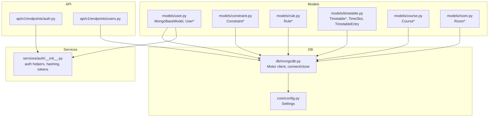
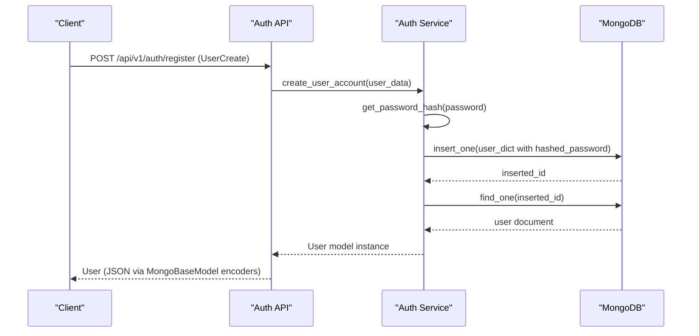
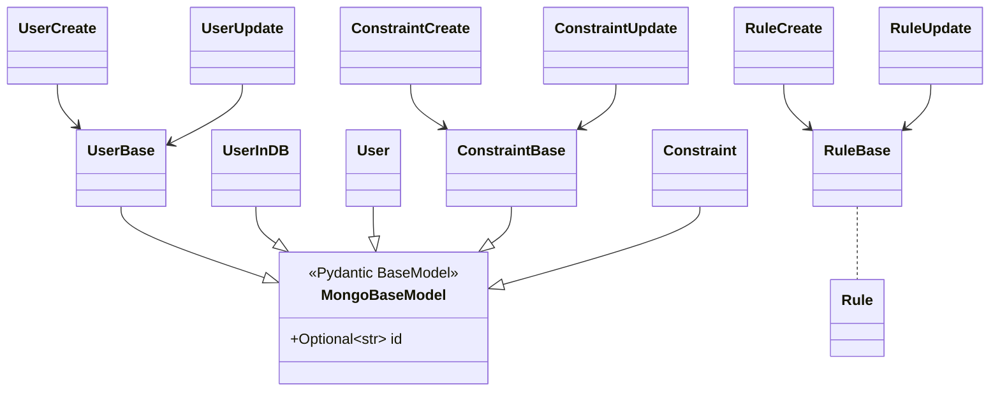
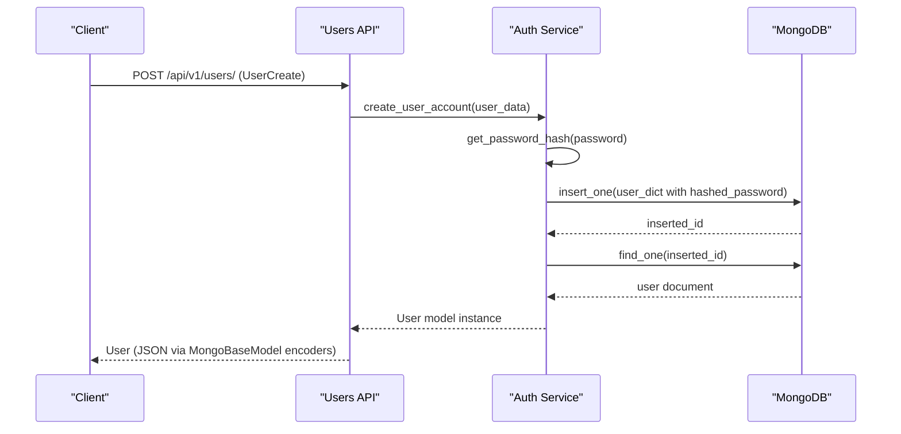
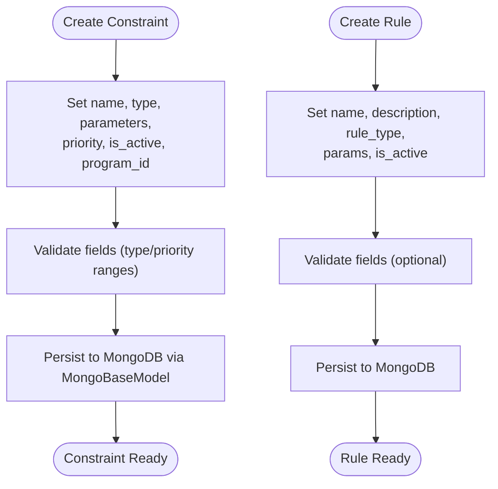
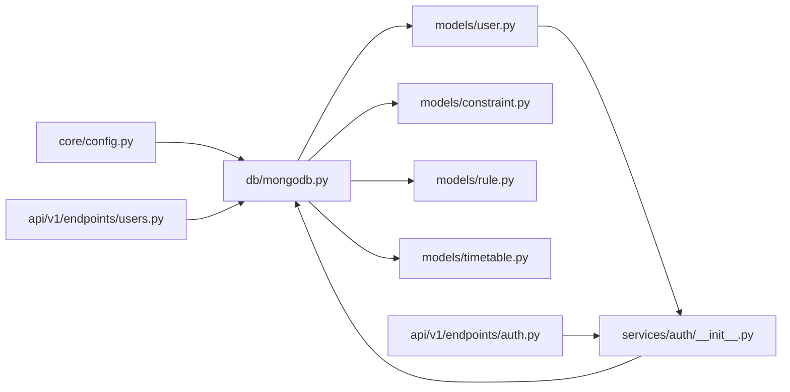

# Core Models

<cite>
**Referenced Files in This Document**
- [user.py](file://backend/app/models/user.py)
- [constraint.py](file://backend/app/models/constraint.py)
- [rule.py](file://backend/app/models/rule.py)
- [mongodb.py](file://backend/app/db/mongodb.py)
- [config.py](file://backend/app/core/config.py)
- [auth.py](file://backend/app/services/auth/__init__.py)
- [users.py](file://backend/app/api/v1/endpoints/users.py)
- [auth_api.py](file://backend/app/api/v1/endpoints/auth.py)
- [course.py](file://backend/app/models/course.py)
- [room.py](file://backend/app/models/room.py)
- [timetable.py](file://backend/app/models/timetable.py)
</cite>

## Table of Contents
1. [Introduction](#introduction)
2. [Project Structure](#project-structure)
3. [Core Components](#core-components)
4. [Architecture Overview](#architecture-overview)
5. [Detailed Component Analysis](#detailed-component-analysis)
6. [Dependency Analysis](#dependency-analysis)
7. [Performance Considerations](#performance-considerations)
8. [Troubleshooting Guide](#troubleshooting-guide)
9. [Conclusion](#conclusion)

## Introduction
This document explains the core Pydantic models that underpin ShedMaster’s data architecture. It focuses on:
- The MongoBaseModel base class and its MongoDB integration configuration
- The User model hierarchy and its validation and security features
- Constraint and Rule models for scheduling restrictions and compliance
- Model inheritance patterns, shared validation logic, and common field configurations
- Examples of model instantiation, validation workflows, and database serialization
- Security considerations including password hashing, role-based access fields, and data sanitization patterns

## Project Structure
The core models reside under backend/app/models and integrate with FastAPI endpoints, authentication services, and MongoDB via Motor. Configuration is centralized in backend/app/core/config.py.

**Diagram sources**
- [user.py:11-20](file://backend/app/models/user.py#L11-L20)
- [constraint.py:27-30](file://backend/app/models/constraint.py#L27-L30)
- [rule.py:26-34](file://backend/app/models/rule.py#L26-L34)
- [timetable.py:46-52](file://backend/app/models/timetable.py#L46-L52)
- [course.py:39-43](file://backend/app/models/course.py#L39-L43)
- [room.py:39-43](file://backend/app/models/room.py#L39-L43)
- [auth.py:12-14](file://backend/app/services/auth/__init__.py#L12-L14)
- [users.py:6-7](file://backend/app/api/v1/endpoints/users.py#L6-L7)
- [mongodb.py:5-41](file://backend/app/db/mongodb.py#L5-L41)
- [config.py:7-61](file://backend/app/core/config.py#L7-L61)

**Section sources**
- [user.py:11-76](file://backend/app/models/user.py#L11-L76)
- [constraint.py:1-30](file://backend/app/models/constraint.py#L1-L30)
- [rule.py:1-34](file://backend/app/models/rule.py#L1-L34)
- [mongodb.py:1-41](file://backend/app/db/mongodb.py#L1-L41)
- [config.py:1-61](file://backend/app/core/config.py#L1-L61)

## Core Components
This section documents the foundational models and their roles.

- MongoBaseModel
  - Purpose: Provides MongoDB-specific Pydantic configuration for seamless ObjectId handling and JSON serialization.
  - Key behaviors:
    - Uses alias "_id" for the id field and defaults to None for new records.
    - Enables arbitrary_types_allowed and registers ObjectId serialization via json_encoders.
    - Enforces populate_by_name and validate_by_name for robust field resolution.
    - Enables from_attributes for ORM-style population.
  - Usage: All MongoDB-backed models inherit from MongoBaseModel to ensure consistent serialization and deserialization.

- User Model Hierarchy
  - UserBase: Shared fields for users (email, full_name, is_active, is_admin, role).
  - UserCreate: Extends UserBase with password and optional name/full_name normalization via a validator that ensures either name or full_name is provided.
  - UserUpdate: Optional fields for partial updates.
  - UserInDB: Adds hashed_password and timestamps; inherits from MongoBaseModel for MongoDB serialization.
  - User: Adds timestamps; inherits from MongoBaseModel for MongoDB serialization.

- Constraint Model
  - ConstraintBase: Defines name, type, description, parameters, priority, is_active, and program_id.
  - ConstraintCreate: Inherits ConstraintBase for creation.
  - ConstraintUpdate: Optional fields for updates.
  - Constraint: Adds created_by, created_at, updated_at; inherits from MongoBaseModel.

- Rule Model
  - RuleBase: Defines name, description, rule_type, params, is_active.
  - RuleCreate: Inherits RuleBase for creation.
  - RuleUpdate: Optional fields for updates.
  - Rule: Adds id, created_by, created_at, updated_at; uses legacy orm_mode configuration.

**Section sources**
- [user.py:11-76](file://backend/app/models/user.py#L11-L76)
- [constraint.py:6-30](file://backend/app/models/constraint.py#L6-L30)
- [rule.py:6-34](file://backend/app/models/rule.py#L6-L34)

## Architecture Overview
The data architecture integrates Pydantic models with MongoDB and FastAPI endpoints. Authentication services handle password hashing and token management, while endpoints enforce role-based access controls.

**Diagram sources**
- [auth_api.py:78-101](file://backend/app/api/v1/endpoints/auth.py#L78-L101)
- [auth.py:159-189](file://backend/app/services/auth/__init__.py#L159-L189)
- [user.py:39-76](file://backend/app/models/user.py#L39-L76)

## Detailed Component Analysis

### MongoBaseModel and MongoDB Integration
- ObjectId handling
  - The id field aliases "_id" to match MongoDB documents.
  - json_encoders converts ObjectId to str during JSON serialization.
- Name resolution
  - populate_by_name and validate_by_name ensure consistent field resolution.
- Attribute population
  - from_attributes enables loading from ORM-like attributes.

**Diagram sources**
- [user.py:11-76](file://backend/app/models/user.py#L11-L76)
- [constraint.py:6-30](file://backend/app/models/constraint.py#L6-L30)
- [rule.py:6-34](file://backend/app/models/rule.py#L6-L34)

**Section sources**
- [user.py:11-20](file://backend/app/models/user.py#L11-L20)

### User Model Validation and Security
- Validation rules
  - UserCreate enforces that either name or full_name is provided via a field validator.
  - Role and admin flags are present for access control.
- Security considerations
  - Password hashing is performed by the authentication service before persisting to the database.
  - Token-based authentication uses JWT with configurable expiration and algorithm.
  - Endpoints enforce role checks (admin-only operations) and active-user validation.

**Diagram sources**
- [users.py:52-75](file://backend/app/api/v1/endpoints/users.py#L52-L75)
- [auth.py:159-189](file://backend/app/services/auth/__init__.py#L159-L189)
- [user.py:39-76](file://backend/app/models/user.py#L39-L76)

**Section sources**
- [user.py:39-56](file://backend/app/models/user.py#L39-L56)
- [auth.py:159-189](file://backend/app/services/auth/__init__.py#L159-L189)
- [users.py:52-75](file://backend/app/api/v1/endpoints/users.py#L52-L75)

### Constraint and Rule Models
- Constraint
  - Defines a named restriction with type, parameters, priority, activation flag, and optional program scoping.
  - Supports creation, updates, and persistence with MongoDB timestamps and creator tracking.
- Rule
  - Defines global or scoped scheduling rules with parameters and activation flag.
  - Supports creation, updates, and persistence with optional identifiers and timestamps.

**Diagram sources**
- [constraint.py:6-30](file://backend/app/models/constraint.py#L6-L30)
- [rule.py:6-34](file://backend/app/models/rule.py#L6-L34)

**Section sources**
- [constraint.py:6-30](file://backend/app/models/constraint.py#L6-L30)
- [rule.py:6-34](file://backend/app/models/rule.py#L6-L34)

### Model Inheritance Patterns and Shared Logic
- Shared patterns
  - Base classes (UserBase, ConstraintBase, RuleBase, CourseBase, RoomBase) define common fields and constraints.
  - Create and Update variants encapsulate input/output shapes for endpoints.
  - Mongo-backed models (UserInDB, Constraint, Rule, Course, Room, Timetable) inherit from MongoBaseModel for consistent serialization.
- Validation reuse
  - Pydantic validators and field constraints are defined in base classes to avoid duplication.
- Timestamps
  - Many models include created_at and updated_at fields with default factories.

**Section sources**
- [user.py:27-76](file://backend/app/models/user.py#L27-L76)
- [constraint.py:6-30](file://backend/app/models/constraint.py#L6-L30)
- [rule.py:6-34](file://backend/app/models/rule.py#L6-L34)
- [course.py:6-43](file://backend/app/models/course.py#L6-L43)
- [room.py:6-43](file://backend/app/models/room.py#L6-L43)
- [timetable.py:21-52](file://backend/app/models/timetable.py#L21-L52)

## Dependency Analysis
- Internal dependencies
  - User models depend on MongoBaseModel for MongoDB serialization.
  - Constraint and Rule models also depend on MongoBaseModel.
  - Authentication service depends on User models and MongoDB for user operations.
  - API endpoints depend on models and services for request/response handling.
- External dependencies
  - MongoDB driver (Motor) for async connectivity.
  - Pydantic v2 for data validation and serialization.
  - bcrypt for password hashing.
  - JWT library for token encoding/decoding.

**Diagram sources**
- [config.py:25-32](file://backend/app/core/config.py#L25-L32)
- [mongodb.py:11-33](file://backend/app/db/mongodb.py#L11-L33)
- [user.py:11-20](file://backend/app/models/user.py#L11-L20)
- [constraint.py:27-30](file://backend/app/models/constraint.py#L27-L30)
- [rule.py:26-34](file://backend/app/models/rule.py#L26-L34)
- [timetable.py:46-52](file://backend/app/models/timetable.py#L46-L52)
- [auth.py:12-14](file://backend/app/services/auth/__init__.py#L12-L14)
- [auth_api.py:1-123](file://backend/app/api/v1/endpoints/auth.py#L1-L123)
- [users.py:1-123](file://backend/app/api/v1/endpoints/users.py#L1-L123)

**Section sources**
- [config.py:25-32](file://backend/app/core/config.py#L25-L32)
- [mongodb.py:11-33](file://backend/app/db/mongodb.py#L11-L33)
- [user.py:11-20](file://backend/app/models/user.py#L11-L20)
- [constraint.py:27-30](file://backend/app/models/constraint.py#L27-L30)
- [rule.py:26-34](file://backend/app/models/rule.py#L26-L34)
- [timetable.py:46-52](file://backend/app/models/timetable.py#L46-L52)
- [auth.py:12-14](file://backend/app/services/auth/__init__.py#L12-L14)
- [auth_api.py:1-123](file://backend/app/api/v1/endpoints/auth.py#L1-L123)
- [users.py:1-123](file://backend/app/api/v1/endpoints/users.py#L1-L123)

## Performance Considerations
- Prefer using optional fields in update models to minimize write amplification.
- Leverage MongoDB indexes on frequently queried fields (e.g., email, program_id) to reduce query latency.
- Avoid serializing large nested structures unnecessarily; keep model schemas lean.
- Use pagination in endpoints to limit payload sizes for list operations.

## Troubleshooting Guide
- ObjectId conversion errors
  - Ensure models use MongoBaseModel to serialize ObjectId to str automatically.
  - When querying, convert string IDs to ObjectId for MongoDB filters.
- Validation failures
  - Confirm that UserCreate provides either name or full_name; otherwise validation will fail.
  - Verify field constraints (e.g., priority range, numeric bounds) in base models.
- Authentication issues
  - Confirm SECRET_KEY and ALGORITHM settings are configured correctly.
  - Ensure hashed passwords are stored and verified using bcrypt-compatible hashing.
- Database connectivity
  - Check MONGODB_URL and DATABASE_NAME in settings; verify network access and credentials.

**Section sources**
- [user.py:48-56](file://backend/app/models/user.py#L48-L56)
- [config.py:25-32](file://backend/app/core/config.py#L25-L32)
- [auth.py:26-38](file://backend/app/services/auth/__init__.py#L26-L38)
- [mongodb.py:11-33](file://backend/app/db/mongodb.py#L11-L33)

## Conclusion
ShedMaster’s core models establish a consistent, secure, and scalable data layer:
- MongoBaseModel centralizes MongoDB integration concerns.
- The User hierarchy enforces strong validation and security via dedicated models and services.
- Constraint and Rule models provide flexible, extensible definitions for scheduling policies.
- Clear inheritance patterns and shared validation logic simplify maintenance and reduce duplication.
- Authentication and endpoint layers enforce role-based access and protect sensitive data.