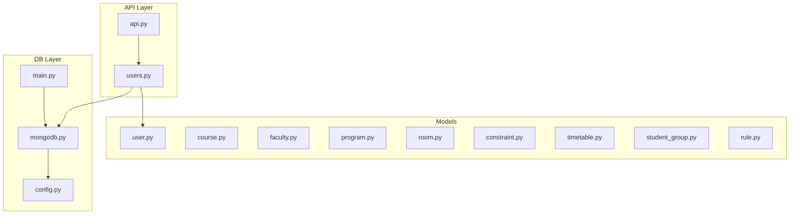
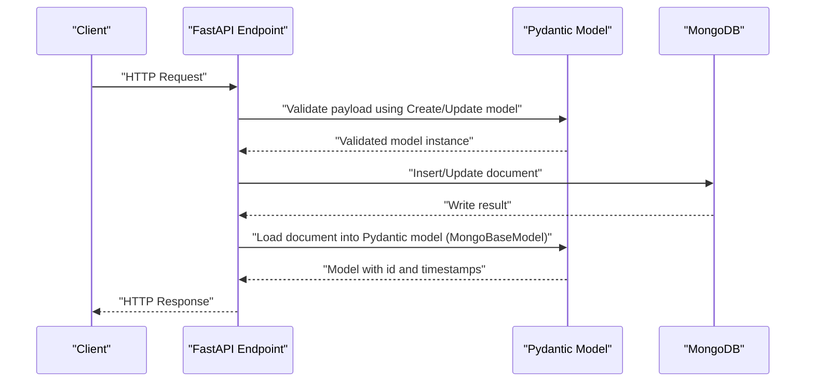
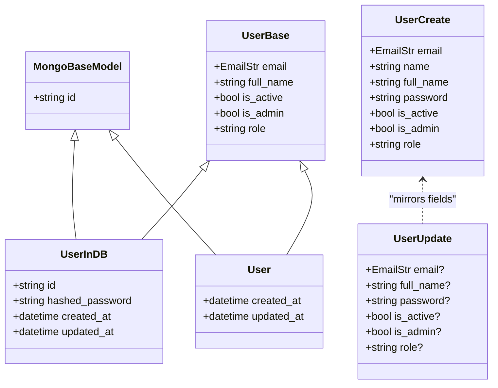
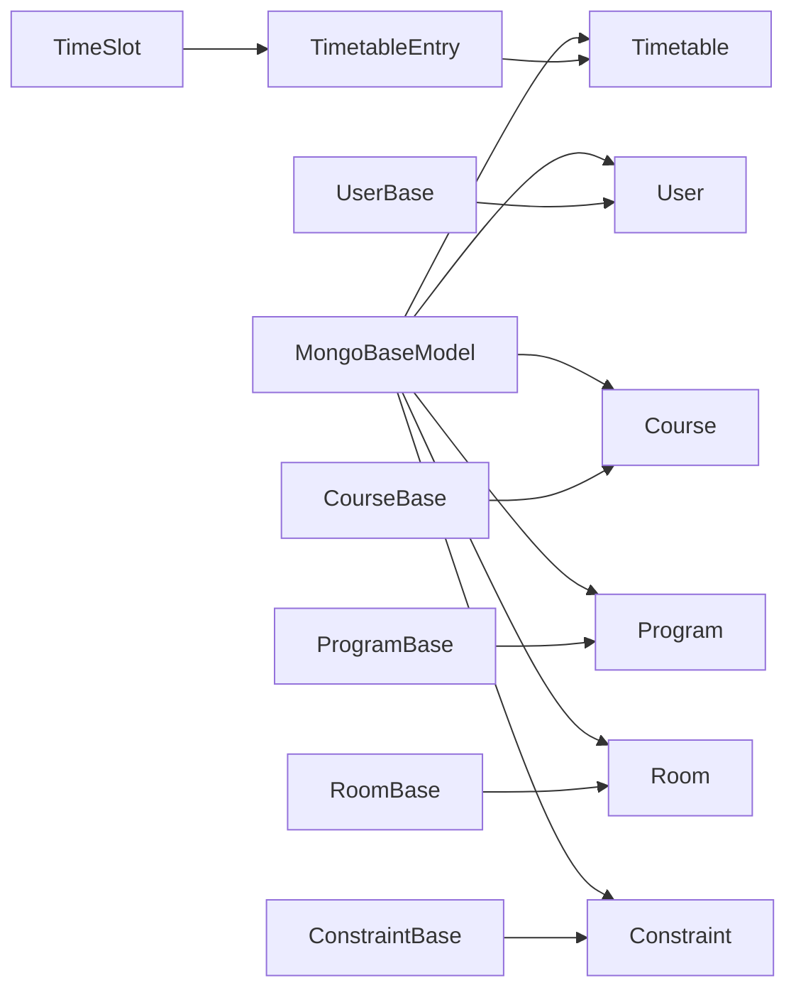

# Data Models

<cite>
**Referenced Files in This Document**
- [user.py](file://backend/app/models/user.py)
- [course.py](file://backend/app/models/course.py)
- [faculty.py](file://backend/app/models/faculty.py)
- [program.py](file://backend/app/models/program.py)
- [room.py](file://backend/app/models/room.py)
- [constraint.py](file://backend/app/models/constraint.py)
- [timetable.py](file://backend/app/models/timetable.py)
- [student_group.py](file://backend/app/models/student_group.py)
- [rule.py](file://backend/app/models/rule.py)
- [mongodb.py](file://backend/app/db/mongodb.py)
- [config.py](file://backend/app/core/config.py)
- [main.py](file://backend/app/main.py)
- [api.py](file://backend/app/api/api_v1/api.py)
- [users.py](file://backend/app/api/v1/endpoints/users.py)
</cite>

## Table of Contents
1. [Introduction](#introduction)
2. [Project Structure](#project-structure)
3. [Core Components](#core-components)
4. [Architecture Overview](#architecture-overview)
5. [Detailed Component Analysis](#detailed-component-analysis)
6. [Dependency Analysis](#dependency-analysis)
7. [Performance Considerations](#performance-considerations)
8. [Troubleshooting Guide](#troubleshooting-guide)
9. [Conclusion](#conclusion)
10. [Appendices](#appendices)

## Introduction
This document provides comprehensive documentation for the Pydantic data models used in ShedMaster’s backend. It covers schema definitions, field types, validation rules, defaults, constraints, inheritance patterns, and serialization/deserialization behavior with MongoDB. It also explains relationships via ObjectId references, embedded document patterns, and practical usage patterns for instantiation, validation, and querying. Finally, it outlines versioning considerations, backward compatibility strategies, and performance guidance for large datasets.

## Project Structure
The data models reside under backend/app/models and are consumed by FastAPI endpoints under backend/app/api/v1/endpoints. MongoDB connectivity is managed via backend/app/db/mongodb.py, configured by backend/app/core/config.py, and initialized in backend/app/main.py.

**Diagram sources**
- [api.py:1-34](file://backend/app/api/api_v1/api.py#L1-L34)
- [users.py:1-123](file://backend/app/api/v1/endpoints/users.py#L1-L123)
- [user.py:1-76](file://backend/app/models/user.py#L1-L76)
- [mongodb.py:1-41](file://backend/app/db/mongodb.py#L1-L41)
- [config.py:1-61](file://backend/app/core/config.py#L1-L61)
- [main.py:1-102](file://backend/app/main.py#L1-L102)

**Section sources**
- [api.py:1-34](file://backend/app/api/api_v1/api.py#L1-L34)
- [users.py:1-123](file://backend/app/api/v1/endpoints/users.py#L1-L123)
- [mongodb.py:1-41](file://backend/app/db/mongodb.py#L1-L41)
- [config.py:1-61](file://backend/app/core/config.py#L1-L61)
- [main.py:1-102](file://backend/app/main.py#L1-L102)

## Core Components
This section summarizes the shared base classes and inheritance patterns used across models.

- MongoBaseModel
  - Purpose: Provides MongoDB-specific Pydantic configuration for ObjectId handling and aliasing.
  - Key behaviors:
    - Uses alias "_id" for the id field.
    - Enables arbitrary_types_allowed and json_encoders for ObjectId serialization to string.
    - Enables from_attributes and validate_by_name for seamless ORM-style usage.
  - Usage: Several models inherit from MongoBaseModel to align with MongoDB document mapping.

- UserBase and User
  - UserBase defines common fields for user records.
  - User extends UserBase with MongoDB-specific id mapping and timestamps.
  - UserCreate and UserUpdate define request/response shapes for creation and updates, including a validator that ensures either name or full_name is provided.

- Other domain models
  - Course, Program, Room, Constraint, Timetable, StudentGroup, and Rule follow similar patterns:
    - Base classes define required and optional fields with constraints.
    - Create and Update classes mirror Base classes for request payloads.
    - Concrete models (e.g., Course, Program) inherit from MongoBaseModel to integrate with MongoDB.

**Section sources**
- [user.py:11-20](file://backend/app/models/user.py#L11-L20)
- [user.py:27-36](file://backend/app/models/user.py#L27-L36)
- [user.py:39-47](file://backend/app/models/user.py#L39-L47)
- [user.py:58-65](file://backend/app/models/user.py#L58-L65)
- [user.py:67-76](file://backend/app/models/user.py#L67-L76)

## Architecture Overview
The data model layer integrates tightly with MongoDB via Motor and FastAPI. Requests are validated against Pydantic models, transformed into MongoDB documents, and persisted. Responses are returned as Pydantic models for consistent serialization.

**Diagram sources**
- [users.py:52-75](file://backend/app/api/v1/endpoints/users.py#L52-L75)
- [user.py:39-47](file://backend/app/models/user.py#L39-L47)
- [mongodb.py:11-33](file://backend/app/db/mongodb.py#L11-L33)

## Detailed Component Analysis

### User Model Family
- MongoBaseModel
  - Provides MongoDB id mapping and JSON encoder for ObjectId.
- UserBase
  - Fields: email, full_name, is_active, is_admin, role.
  - Defaults: is_active=True, is_admin=False, role="user".
- UserCreate
  - Fields: email, name, full_name, password, is_active, is_admin, role.
  - Validation: full_name is derived from name if missing; otherwise raises validation error.
- UserUpdate
  - Optional fields for partial updates.
- UserInDB/User
  - Adds hashed_password, created_at, updated_at; User inherits MongoBaseModel for id mapping.

**Diagram sources**
- [user.py:11-20](file://backend/app/models/user.py#L11-L20)
- [user.py:27-36](file://backend/app/models/user.py#L27-L36)
- [user.py:39-47](file://backend/app/models/user.py#L39-L47)
- [user.py:58-65](file://backend/app/models/user.py#L58-L65)
- [user.py:67-76](file://backend/app/models/user.py#L67-L76)

**Section sources**
- [user.py:11-20](file://backend/app/models/user.py#L11-L20)
- [user.py:27-36](file://backend/app/models/user.py#L27-L36)
- [user.py:39-47](file://backend/app/models/user.py#L39-L47)
- [user.py:58-65](file://backend/app/models/user.py#L58-L65)
- [user.py:67-76](file://backend/app/models/user.py#L67-L76)

### Course Model Family
- CourseBase
  - Required: code, name, credits (1–10), type, hours_per_week (1–20), min_per_session (30–180).
  - Optional: semester (1–8), program_id, description, prerequisites, is_lab, lab_hours, is_active.
- CourseCreate/CourseUpdate
  - Mirrors CourseBase with optional fields for updates.
- Course
  - Inherits MongoBaseModel; adds created_by, created_at, updated_at.

Validation highlights:
- Range constraints enforced via Field validators (ge/le).
- Optional fields allow partial updates.

**Section sources**
- [course.py:6-22](file://backend/app/models/course.py#L6-L22)
- [course.py:24-38](file://backend/app/models/course.py#L24-L38)
- [course.py:39-43](file://backend/app/models/course.py#L39-L43)

### Faculty Model Family
- FacultyBase
  - Required: name, employee_id, department, designation, email, subjects, max_hours_per_week (1–40), available_days.
- FacultyCreate/FacultyUpdate
  - Mirrors FacultyBase with optional fields.
- FacultyInDB/Faculty
  - FacultyInDB includes id (alias _id), created_by, created_at, updated_at; Faculty extends it.

Notes:
- Legacy orm_mode is present in FacultyInDB.Config; MongoBaseModel supersedes this for newer models.

**Section sources**
- [faculty.py:5-16](file://backend/app/models/faculty.py#L5-L16)
- [faculty.py:18-27](file://backend/app/models/faculty.py#L18-L27)
- [faculty.py:28-39](file://backend/app/models/faculty.py#L28-L39)

### Program Model Family
- ProgramBase
  - Required: name, code, type, department, duration_years, total_semesters, credits_required.
  - Optional: description, is_active.
- ProgramCreate/ProgramUpdate
  - Mirrors ProgramBase with optional fields.
- Program
  - Inherits MongoBaseModel; adds created_at, updated_at.

**Section sources**
- [program.py:6-18](file://backend/app/models/program.py#L6-L18)
- [program.py:20-30](file://backend/app/models/program.py#L20-L30)
- [program.py:31-33](file://backend/app/models/program.py#L31-L33)

### Room Model Family
- RoomBase
  - Required: name, building, floor (0–20), capacity (1–500), room_type, facilities, is_lab, is_accessible, has_projector, has_ac, has_wifi, is_active.
  - Optional: location_notes.
- RoomCreate/RoomUpdate
  - Mirrors RoomBase with optional fields.
- Room
  - Inherits MongoBaseModel; adds created_by, created_at, updated_at.

**Section sources**
- [room.py:6-22](file://backend/app/models/room.py#L6-L22)
- [room.py:24-38](file://backend/app/models/room.py#L24-L38)
- [room.py:39-43](file://backend/app/models/room.py#L39-L43)

### Constraint Model Family
- ConstraintBase
  - Required: name, type, parameters (Dict[str, Any]), priority (default 1), program_id (optional).
  - Optional: description, is_active.
- ConstraintCreate/ConstraintUpdate
  - Mirrors ConstraintBase with optional fields.
- Constraint
  - Inherits MongoBaseModel; adds created_by, created_at, updated_at.

**Section sources**
- [constraint.py:6-16](file://backend/app/models/constraint.py#L6-L16)
- [constraint.py:18-26](file://backend/app/models/constraint.py#L18-L26)
- [constraint.py:27-30](file://backend/app/models/constraint.py#L27-L30)

### Timetable Model Family
- Embedded models:
  - TimeSlot: day, start_time (HH:MM), end_time (HH:MM), duration_minutes.
  - TimetableEntry: course_id, faculty_id, room_id, group_id (optional), time_slot (embedded TimeSlot).
- TimetableBase
  - Required: title, program_id, semester, academic_year, entries (list of TimetableEntry), is_draft, metadata.
- TimetableCreate/TimetableUpdate
  - Mirrors TimetableBase with optional fields.
- Timetable
  - Inherits MongoBaseModel; adds created_by, created_at, updated_at, generated_at, validation_status, optimization_score.

Relationships:
- Embedded documents: TimeSlot and TimetableEntry are embedded within TimetableBase.
- ObjectId references: course_id, faculty_id, room_id, group_id reference external entities.

**Section sources**
- [timetable.py:6-11](file://backend/app/models/timetable.py#L6-L11)
- [timetable.py:13-19](file://backend/app/models/timetable.py#L13-L19)
- [timetable.py:21-29](file://backend/app/models/timetable.py#L21-L29)
- [timetable.py:30-44](file://backend/app/models/timetable.py#L30-L44)
- [timetable.py:46-52](file://backend/app/models/timetable.py#L46-L52)

### StudentGroup Model Family
- StudentGroupBase
  - Required: name, course_ids, year (1–4), semester, section, student_strength (1–200), group_type, program_id.
- StudentGroupCreate/StudentGroupUpdate
  - Mirrors StudentGroupBase with optional fields.
- StudentGroup
  - Includes id, created_by, created_at, updated_at; uses legacy orm_mode in Config.

Relationships:
- course_ids and program_id are ObjectId references.
- Embedded documents: None; references used instead.

**Section sources**
- [student_group.py:5-16](file://backend/app/models/student_group.py#L5-L16)
- [student_group.py:18-27](file://backend/app/models/student_group.py#L18-L27)
- [student_group.py:28-36](file://backend/app/models/student_group.py#L28-L36)

### Rule Model Family
- RuleBase
  - Required: name, description (optional), rule_type (default "custom"), params (Dict[str, Any]), is_active (default True).
- RuleCreate/RuleUpdate
  - Mirrors RuleBase with optional fields.
- Rule
  - Includes id, created_by, created_at, updated_at; uses legacy orm_mode in Config.

Notes:
- No inheritance from MongoBaseModel; relies on legacy orm_mode for ORM-like behavior.

**Section sources**
- [rule.py:6-14](file://backend/app/models/rule.py#L6-L14)
- [rule.py:18-24](file://backend/app/models/rule.py#L18-L24)
- [rule.py:26-34](file://backend/app/models/rule.py#L26-L34)

## Dependency Analysis
- Shared base class usage:
  - MongoBaseModel is used by User, Course, Program, Room, Constraint, and Timetable, ensuring consistent id mapping and JSON encoding.
  - Some models (FacultyInDB, StudentGroup, Rule) rely on legacy orm_mode configuration.
- Relationship patterns:
  - ObjectId references: course_id, faculty_id, room_id, group_id in TimetableEntry and StudentGroup.
  - Embedded documents: TimeSlot and TimetableEntry within TimetableBase.
- API integration:
  - Endpoints validate requests using Create/Update models and return response models that inherit from MongoBaseModel for consistent serialization.

**Diagram sources**
- [user.py:11-20](file://backend/app/models/user.py#L11-L20)
- [course.py:6-22](file://backend/app/models/course.py#L6-L22)
- [program.py:6-18](file://backend/app/models/program.py#L6-L18)
- [room.py:6-22](file://backend/app/models/room.py#L6-L22)
- [constraint.py:6-16](file://backend/app/models/constraint.py#L6-L16)
- [timetable.py:13-19](file://backend/app/models/timetable.py#L13-L19)
- [timetable.py:6-11](file://backend/app/models/timetable.py#L6-L11)

**Section sources**
- [user.py:11-20](file://backend/app/models/user.py#L11-L20)
- [course.py:6-22](file://backend/app/models/course.py#L6-L22)
- [program.py:6-18](file://backend/app/models/program.py#L6-L18)
- [room.py:6-22](file://backend/app/models/room.py#L6-L22)
- [constraint.py:6-16](file://backend/app/models/constraint.py#L6-L16)
- [timetable.py:13-19](file://backend/app/models/timetable.py#L13-L19)
- [timetable.py:6-11](file://backend/app/models/timetable.py#L6-L11)

## Performance Considerations
- Model validation overhead:
  - Pydantic v2 validation is efficient; keep nested models shallow and avoid excessive recursion.
  - Prefer optional fields in updates to minimize write payloads.
- MongoDB serialization:
  - MongoBaseModel’s json_encoders ensure ObjectId serialization to string; avoid manual conversions in APIs.
- Embedded vs referenced documents:
  - Embedded TimeSlot and TimetableEntry reduce joins but increase document size; consider splitting large lists into paginated queries.
- Indexing and queries:
  - Add MongoDB indexes on frequently queried fields (e.g., program_id, semester, course_id, faculty_id).
- Pagination:
  - Use skip/limit with capped page sizes to prevent large result sets.
- Batch operations:
  - For bulk inserts/updates, batch requests to reduce round trips.

[No sources needed since this section provides general guidance]

## Troubleshooting Guide
- Validation errors:
  - FastAPI’s RequestValidationError handler logs raw request bodies and validation errors; use it to diagnose malformed payloads.
- ObjectId conversion:
  - Ensure string IDs are converted to ObjectId when querying/updating; avoid passing raw strings for _id fields.
- Legacy orm_mode:
  - Models relying on orm_mode (FacultyInDB, StudentGroup, Rule) require different configuration; prefer MongoBaseModel for consistency.
- Connection issues:
  - MongoDB connection failures are logged and do not block startup; verify MONGODB_URL and DATABASE_NAME in settings.

**Section sources**
- [main.py:41-54](file://backend/app/main.py#L41-L54)
- [mongodb.py:11-33](file://backend/app/db/mongodb.py#L11-L33)
- [config.py:25-28](file://backend/app/core/config.py#L25-L28)

## Conclusion
The ShedMaster data model layer leverages Pydantic v2 for robust validation and serialization, with MongoBaseModel ensuring consistent MongoDB integration. Models follow clear inheritance patterns, employ range and type constraints, and support both embedded and referenced relationships. By adhering to the documented patterns and applying the performance and troubleshooting recommendations, teams can maintain backward compatibility and scale effectively.

[No sources needed since this section summarizes without analyzing specific files]

## Appendices

### Model Serialization and Deserialization Notes
- MongoBaseModel configuration:
  - alias "_id" for id field.
  - json_encoders for ObjectId to string.
  - from_attributes and validate_by_name enabled for seamless ORM-style usage.
- Legacy models:
  - FacultyInDB, StudentGroup, and Rule use orm_mode; consider migrating to MongoBaseModel for consistency.

**Section sources**
- [user.py:11-20](file://backend/app/models/user.py#L11-L20)
- [faculty.py:34-35](file://backend/app/models/faculty.py#L34-L35)
- [student_group.py:34-35](file://backend/app/models/student_group.py#L34-L35)
- [rule.py:32-33](file://backend/app/models/rule.py#L32-L33)

### Example Usage Patterns
- Instantiation and validation:
  - Use UserCreate for registration payloads; Pydantic validates presence of either name or full_name.
  - Use CourseCreate for course creation; Field validators enforce numeric ranges.
- Querying patterns:
  - Retrieve users with pagination using skip/limit; return type is List[User].
  - Filter by ObjectId; ensure conversion to ObjectId before querying.

**Section sources**
- [user.py:39-47](file://backend/app/models/user.py#L39-L47)
- [course.py:21-22](file://backend/app/models/course.py#L21-L22)
- [users.py:11-25](file://backend/app/api/v1/endpoints/users.py#L11-L25)
- [users.py:36-50](file://backend/app/api/v1/endpoints/users.py#L36-L50)

### Model Versioning and Migration Strategies
- Backward compatibility:
  - Keep optional fields when extending models to avoid breaking existing documents.
  - Use defaults for new fields to preserve behavior for older records.
- Schema evolution:
  - Introduce new fields with sensible defaults; mark removed fields deprecated in code comments.
  - For embedded documents, prefer additive changes to avoid parsing conflicts.
- Migration scripts:
  - Write scripts to normalize existing documents (e.g., populate derived fields, adjust types).
  - Validate migrations with small batches before full rollout.

[No sources needed since this section provides general guidance]