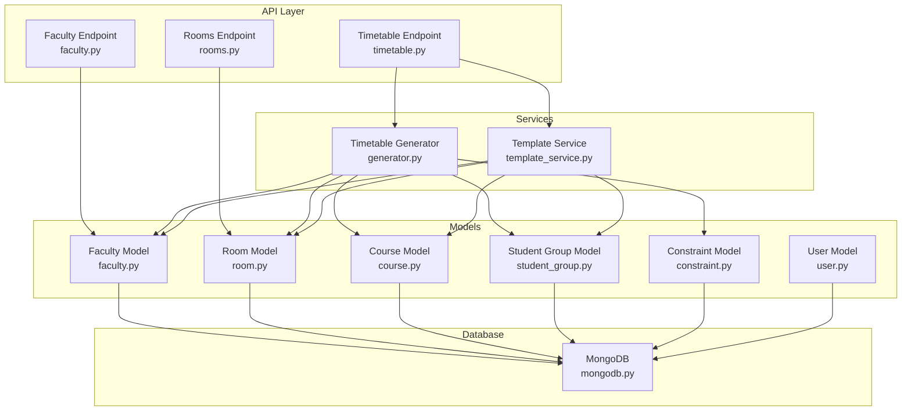
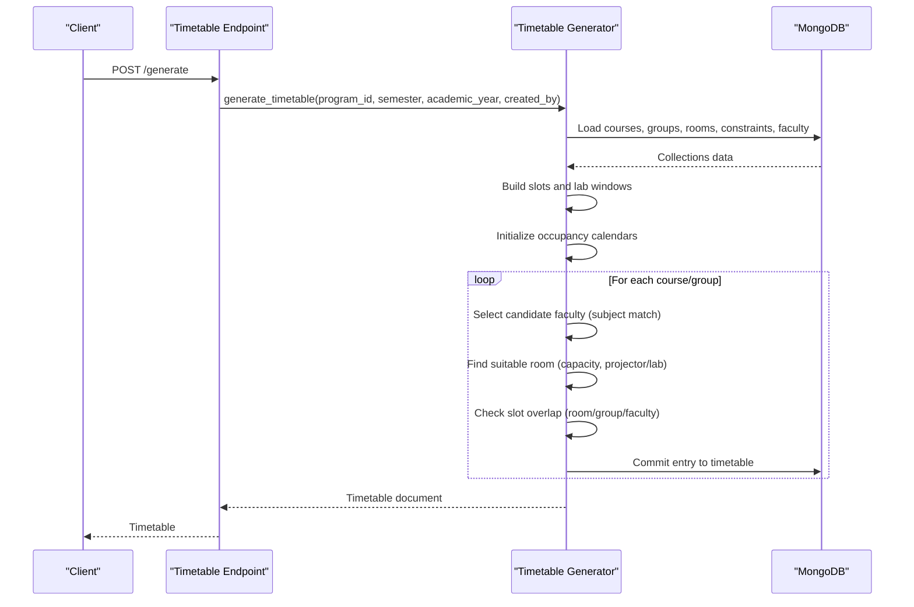
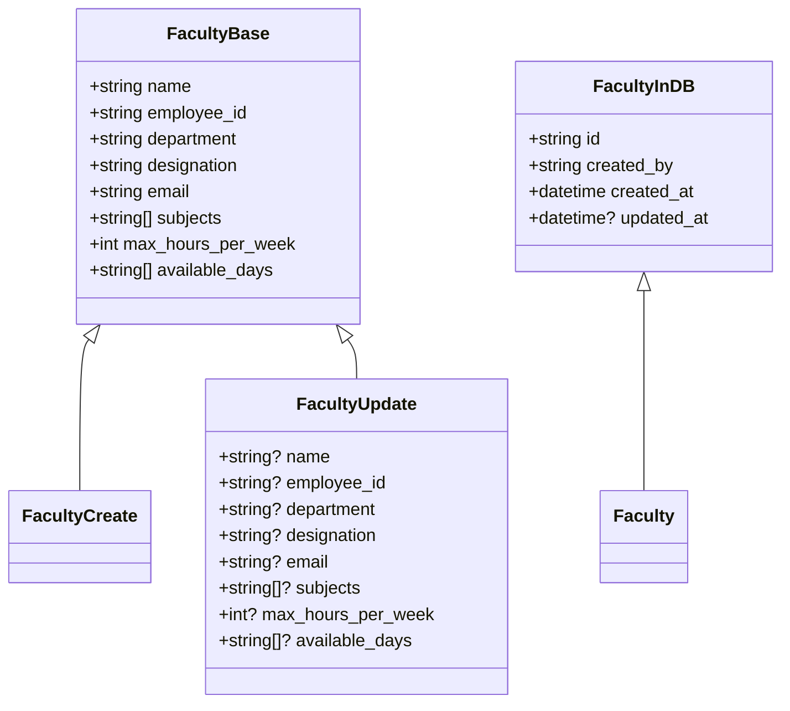
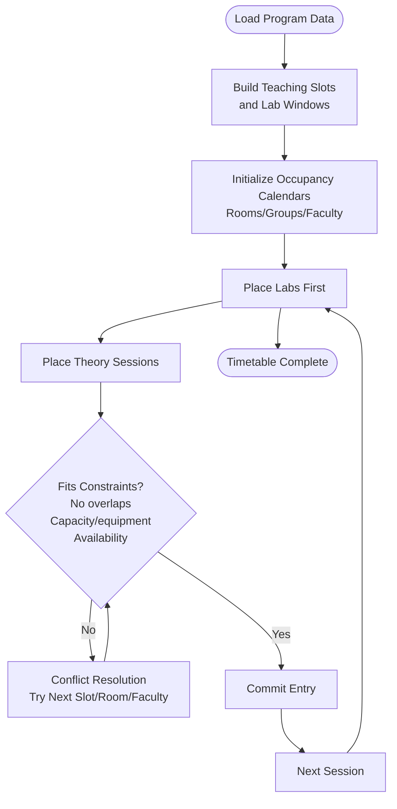
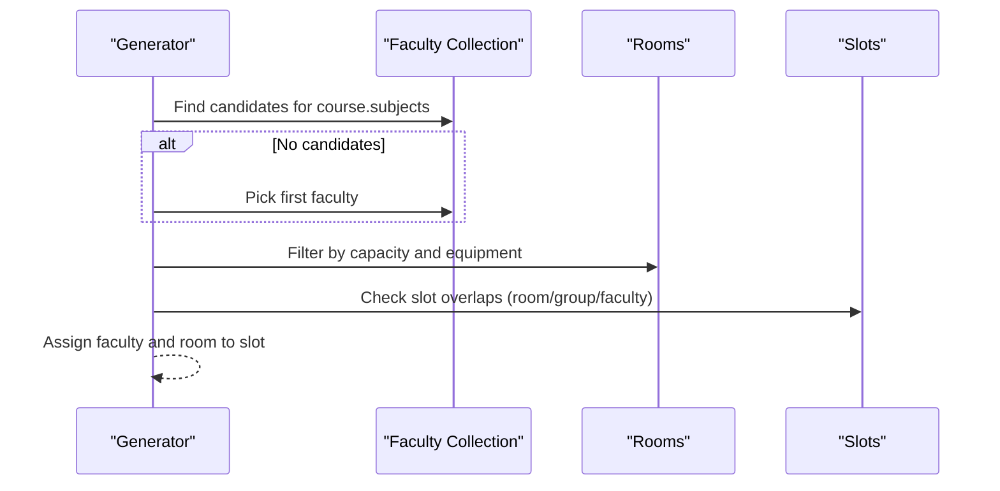
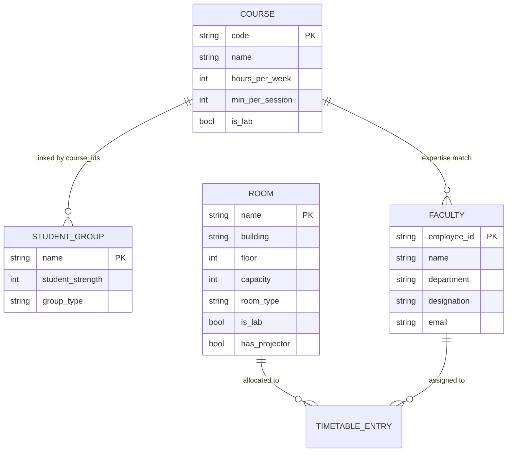
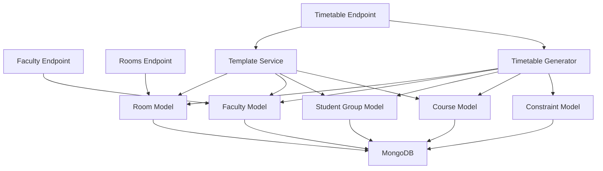

# Faculty and Room Models

<cite>
**Referenced Files in This Document**
- [faculty.py](file://backend/app/models/faculty.py)
- [room.py](file://backend/app/models/room.py)
- [faculty.py](file://backend/app/api/v1/endpoints/faculty.py)
- [rooms.py](file://backend/app/api/v1/endpoints/rooms.py)
- [generator.py](file://backend/app/services/timetable/generator.py)
- [template_service.py](file://backend/app/services/timetable/template_service.py)
- [timetable.py](file://backend/app/api/v1/endpoints/timetable.py)
- [constraint.py](file://backend/app/models/constraint.py)
- [course.py](file://backend/app/models/course.py)
- [student_group.py](file://backend/app/models/student_group.py)
- [user.py](file://backend/app/models/user.py)
- [mongodb.py](file://backend/app/db/mongodb.py)
</cite>

## Table of Contents
1. [Introduction](#introduction)
2. [Project Structure](#project-structure)
3. [Core Components](#core-components)
4. [Architecture Overview](#architecture-overview)
5. [Detailed Component Analysis](#detailed-component-analysis)
6. [Dependency Analysis](#dependency-analysis)
7. [Performance Considerations](#performance-considerations)
8. [Troubleshooting Guide](#troubleshooting-guide)
9. [Conclusion](#conclusion)
10. [Appendices](#appendices)

## Introduction
This document explains the Faculty and Room models in ShedMaster and how they integrate with scheduling constraints, resource availability validation, and capacity management during timetable generation. It covers:
- Faculty model fields and relationships (expertise domains, availability patterns, workload tracking, qualification specifications)
- Room model fields and relationships (facility attributes, capacity limits, equipment specifications, location mapping)
- Scheduling constraints and validation logic
- Examples of faculty assignment strategies, room allocation algorithms, and conflict resolution patterns
- Model relationships with timetable generation constraints, availability management, and resource utilization tracking
- Faculty preferences, room specializations, and infrastructure compliance requirements

## Project Structure
The Faculty and Room models are defined in Pydantic models and exposed via FastAPI endpoints. They are consumed by timetable generation services that enforce constraints and manage resource calendars.



**Diagram sources**
- [faculty.py:1-39](file://backend/app/models/faculty.py#L1-L39)
- [room.py:1-43](file://backend/app/models/room.py#L1-L43)
- [course.py:1-43](file://backend/app/models/course.py#L1-L43)
- [student_group.py:1-36](file://backend/app/models/student_group.py#L1-L36)
- [constraint.py:1-30](file://backend/app/models/constraint.py#L1-L30)
- [user.py:1-76](file://backend/app/models/user.py#L1-L76)
- [faculty.py:1-265](file://backend/app/api/v1/endpoints/faculty.py#L1-L265)
- [rooms.py:1-258](file://backend/app/api/v1/endpoints/rooms.py#L1-L258)
- [timetable.py:1-728](file://backend/app/api/v1/endpoints/timetable.py#L1-L728)
- [generator.py:1-402](file://backend/app/services/timetable/generator.py#L1-L402)
- [template_service.py:1-486](file://backend/app/services/timetable/template_service.py#L1-L486)
- [mongodb.py:1-41](file://backend/app/db/mongodb.py#L1-L41)

**Section sources**
- [faculty.py:1-39](file://backend/app/models/faculty.py#L1-L39)
- [room.py:1-43](file://backend/app/models/room.py#L1-L43)
- [faculty.py:1-265](file://backend/app/api/v1/endpoints/faculty.py#L1-L265)
- [rooms.py:1-258](file://backend/app/api/v1/endpoints/rooms.py#L1-L258)
- [generator.py:1-402](file://backend/app/services/timetable/generator.py#L1-L402)
- [template_service.py:1-486](file://backend/app/services/timetable/template_service.py#L1-L486)
- [timetable.py:1-728](file://backend/app/api/v1/endpoints/timetable.py#L1-L728)
- [mongodb.py:1-41](file://backend/app/db/mongodb.py#L1-L41)

## Core Components
- Faculty model: Defines identity, department, designation, contact, subjects (expertise domains), weekly teaching capacity, and available days.
- Room model: Defines room identification, building/floor, capacity, room type, facilities, accessibility, and activity flag.
- API endpoints: Provide CRUD operations for Faculty and Rooms with user isolation and validation.
- Timetable generator: Loads constraints, courses, groups, rooms, and faculty; builds occupancy calendars; enforces scheduling rules; assigns faculty and rooms; commits entries.

Key model relationships:
- Courses map to Student Groups and are associated with Faculty expertise.
- Rooms are filtered by capacity and equipment for theory vs lab sessions.
- Constraints define time windows, max periods per day, contiguous periods, and lab windows.

**Section sources**
- [faculty.py:5-38](file://backend/app/models/faculty.py#L5-L38)
- [room.py:6-43](file://backend/app/models/room.py#L6-L43)
- [faculty.py:13-98](file://backend/app/api/v1/endpoints/faculty.py#L13-L98)
- [rooms.py:12-115](file://backend/app/api/v1/endpoints/rooms.py#L12-L115)
- [generator.py:169-233](file://backend/app/services/timetable/generator.py#L169-L233)

## Architecture Overview
The Faculty and Room models participate in a constraint-driven timetable generation pipeline. The generator:
- Loads program data, courses, groups, rooms, and constraints
- Builds atomic teaching slots and lab windows
- Maintains occupancy calendars for rooms, groups, and faculty
- Assigns faculty based on subject expertise and availability
- Allocates rooms based on capacity and equipment (projector for theory)
- Enforces hard constraints (no overlaps, max contiguous periods, daily limits, lab windows)



**Diagram sources**
- [timetable.py:234-264](file://backend/app/api/v1/endpoints/timetable.py#L234-L264)
- [generator.py:169-401](file://backend/app/services/timetable/generator.py#L169-L401)

**Section sources**
- [timetable.py:234-264](file://backend/app/api/v1/endpoints/timetable.py#L234-L264)
- [generator.py:163-401](file://backend/app/services/timetable/generator.py#L163-L401)

## Detailed Component Analysis

### Faculty Model
The Faculty model defines:
- Identity and contact: name, employee_id, department, designation, email
- Expertise domains: subjects (teaching subjects/expertise)
- Workload and availability: max_hours_per_week, available_days
- Persistence: id alias, created_by, timestamps



**Diagram sources**
- [faculty.py:5-38](file://backend/app/models/faculty.py#L5-L38)

Usage in API:
- Create/update/delete faculty records with validation and uniqueness checks
- Enforce user isolation by requiring created_by to match current user

**Section sources**
- [faculty.py:5-38](file://backend/app/models/faculty.py#L5-L38)
- [faculty.py:43-98](file://backend/app/api/v1/endpoints/faculty.py#L43-L98)
- [faculty.py:139-222](file://backend/app/api/v1/endpoints/faculty.py#L139-L222)

### Room Model
The Room model defines:
- Identification: name, building, floor
- Capacity and type: capacity, room_type, is_lab
- Facilities and accessibility: facilities, is_accessible, has_projector, has_ac, has_wifi
- Location and activity: location_notes, is_active

```mermaid
classDiagram
class RoomBase {
+string name
+string building
+int floor
+int capacity
+string room_type
+string[] facilities
+bool is_lab
+bool is_accessible
+bool has_projector
+bool has_ac
+bool has_wifi
+string? location_notes
+bool is_active
}
class RoomCreate
class RoomUpdate {
+string? name
+string? building
+int? floor
+int? capacity
+string? room_type
+string[]? facilities
+bool? is_lab
+bool? is_accessible
+bool? has_projector
+bool? has_ac
+bool? has_wifi
+string? location_notes
+bool? is_active
}
class Room(RoomBase, MongoBaseModel) {
+string? created_by
+datetime created_at
+datetime? updated_at
}
RoomBase <|-- RoomCreate
RoomBase <|-- RoomUpdate
RoomBase <|-- Room
```

**Diagram sources**
- [room.py:6-43](file://backend/app/models/room.py#L6-L43)

Room specialization and capacity management:
- Theory sessions require a room with a projector
- Lab sessions require a lab room and sufficient capacity for the group
- Occupancy calendars track conflicts across rooms, groups, and faculty

**Section sources**
- [room.py:6-43](file://backend/app/models/room.py#L6-L43)
- [rooms.py:12-115](file://backend/app/api/v1/endpoints/rooms.py#L12-L115)
- [rooms.py:118-206](file://backend/app/api/v1/endpoints/rooms.py#L118-L206)

### Scheduling Constraints and Resource Validation
The generator enforces:
- Time grid: atomic slots, passing gaps, lunch break exclusion
- Daily limits: max periods per day, max contiguous periods
- Lab constraints: lab windows, max labs per day
- Availability: faculty availability days, group and room availability
- Capacity: room capacity vs group strength
- Equipment: theory rooms must have a projector



**Diagram sources**
- [generator.py:124-147](file://backend/app/services/timetable/generator.py#L124-L147)
- [generator.py:247-272](file://backend/app/services/timetable/generator.py#L247-L272)
- [generator.py:273-301](file://backend/app/services/timetable/generator.py#L273-L301)
- [generator.py:304-378](file://backend/app/services/timetable/generator.py#L304-L378)

**Section sources**
- [generator.py:95-147](file://backend/app/services/timetable/generator.py#L95-L147)
- [generator.py:247-272](file://backend/app/services/timetable/generator.py#L247-L272)
- [generator.py:273-301](file://backend/app/services/timetable/generator.py#L273-L301)
- [generator.py:304-378](file://backend/app/services/timetable/generator.py#L304-L378)

### Faculty Assignment Strategies
- Subject-based matching: candidate faculty list includes those whose subjects include the course code or name
- Fallback: if no candidate found, pick the first faculty member
- Availability: ensure the chosen faculty member is available on the day/time slot
- Contiguity: prefer double-period sessions for theory when hours per week and session duration support it



**Diagram sources**
- [generator.py:211-220](file://backend/app/services/timetable/generator.py#L211-L220)
- [generator.py:346-348](file://backend/app/services/timetable/generator.py#L346-L348)
- [generator.py:363-365](file://backend/app/services/timetable/generator.py#L363-L365)

**Section sources**
- [generator.py:211-220](file://backend/app/services/timetable/generator.py#L211-L220)
- [generator.py:308-317](file://backend/app/services/timetable/generator.py#L308-L317)
- [generator.py:346-348](file://backend/app/services/timetable/generator.py#L346-L348)
- [generator.py:363-365](file://backend/app/services/timetable/generator.py#L363-L365)

### Room Allocation Algorithms
- Theory rooms: capacity >= group size and has_projector = true
- Lab rooms: capacity >= group size and is_lab = true
- Preference: prefer afternoon windows for labs; prefer double-period slots for theory when allowed
- Conflict detection: slot overlap across room, group, and faculty calendars

**Section sources**
- [generator.py:65-84](file://backend/app/services/timetable/generator.py#L65-L84)
- [generator.py:287-298](file://backend/app/services/timetable/generator.py#L287-L298)
- [generator.py:346-348](file://backend/app/services/timetable/generator.py#L346-L348)
- [generator.py:363-365](file://backend/app/services/timetable/generator.py#L363-L365)

### Conflict Resolution Patterns
- Slot overlap check: two slots overlap if they share the same day and intervals intersect
- Contiguity check: ensure max contiguous periods are respected
- Daily period limits: enforce max periods per day per group
- Lab window constraints: place labs only within allowed windows

**Section sources**
- [generator.py:91-92](file://backend/app/services/timetable/generator.py#L91-L92)
- [generator.py:149-161](file://backend/app/services/timetable/generator.py#L149-L161)
- [generator.py:124-137](file://backend/app/services/timetable/generator.py#L124-L137)
- [generator.py:139-147](file://backend/app/services/timetable/generator.py#L139-L147)

### Model Relationships with Timetable Generation
- Courses specify hours per week, min per session, and whether lab
- Student Groups link courses to groups and define student strength
- Faculty expertise drives course-to-faculty mapping
- Rooms drive capacity and equipment constraints
- Constraints define time grids and hard rules



**Diagram sources**
- [course.py:6-19](file://backend/app/models/course.py#L6-L19)
- [student_group.py:5-13](file://backend/app/models/student_group.py#L5-L13)
- [faculty.py:5-14](file://backend/app/models/faculty.py#L5-L14)
- [room.py:6-19](file://backend/app/models/room.py#L6-L19)
- [generator.py:19-44](file://backend/app/services/timetable/generator.py#L19-L44)

**Section sources**
- [course.py:6-19](file://backend/app/models/course.py#L6-L19)
- [student_group.py:5-13](file://backend/app/models/student_group.py#L5-L13)
- [generator.py:19-44](file://backend/app/services/timetable/generator.py#L19-L44)

### Faculty Preferences, Room Specializations, and Compliance
- Faculty preferences: available_days and max_hours_per_week are enforced during assignment
- Room specializations: is_lab and has_projector differentiate theory vs lab allocations
- Infrastructure compliance: capacity vs group size and equipment availability (projector) are mandatory for theory sessions

**Section sources**
- [faculty.py:11-13](file://backend/app/models/faculty.py#L11-L13)
- [room.py:11-18](file://backend/app/models/room.py#L11-L18)
- [generator.py:289-291](file://backend/app/services/timetable/generator.py#L289-L291)
- [generator.py:346-348](file://backend/app/services/timetable/generator.py#L346-L348)

## Dependency Analysis
- API endpoints depend on models and MongoDB for persistence
- Timetable generator depends on constraints, courses, groups, rooms, and faculty collections
- Template service orchestrates timetable creation from templates and applies overrides for courses, groups, rooms, and faculty



**Diagram sources**
- [faculty.py:1-265](file://backend/app/api/v1/endpoints/faculty.py#L1-L265)
- [rooms.py:1-258](file://backend/app/api/v1/endpoints/rooms.py#L1-L258)
- [timetable.py:1-728](file://backend/app/api/v1/endpoints/timetable.py#L1-L728)
- [generator.py:1-402](file://backend/app/services/timetable/generator.py#L1-L402)
- [template_service.py:1-486](file://backend/app/services/timetable/template_service.py#L1-L486)
- [constraint.py:1-30](file://backend/app/models/constraint.py#L1-L30)
- [course.py:1-43](file://backend/app/models/course.py#L1-L43)
- [student_group.py:1-36](file://backend/app/models/student_group.py#L1-L36)
- [mongodb.py:1-41](file://backend/app/db/mongodb.py#L1-L41)

**Section sources**
- [timetable.py:1-728](file://backend/app/api/v1/endpoints/timetable.py#L1-L728)
- [generator.py:1-402](file://backend/app/services/timetable/generator.py#L1-L402)
- [template_service.py:1-486](file://backend/app/services/timetable/template_service.py#L1-L486)

## Performance Considerations
- Indexing: ensure queries on courses by program_id and semester, rooms by is_active, and faculty by subjects are indexed in MongoDB
- Filtering: pre-filter rooms by capacity and equipment to reduce search space
- Calendar updates: maintain occupancy calendars incrementally to avoid recomputation
- Concurrency: use async database operations to minimize latency

## Troubleshooting Guide
Common issues and resolutions:
- Duplicate employee_id or room name: API endpoints validate uniqueness and return errors
- Invalid ObjectId format: endpoints validate ObjectId and return 400/404 accordingly
- Faculty not found or not accessible: ensure created_by matches current user
- Room not found or soft-deleted: rooms are soft-deleted by setting is_active to false
- Timetable generation failures: verify constraints, room availability, and faculty expertise mapping

**Section sources**
- [faculty.py:52-62](file://backend/app/api/v1/endpoints/faculty.py#L52-L62)
- [rooms.py:67-77](file://backend/app/api/v1/endpoints/rooms.py#L67-L77)
- [rooms.py:128-135](file://backend/app/api/v1/endpoints/rooms.py#L128-L135)
- [rooms.py:218-225](file://backend/app/api/v1/endpoints/rooms.py#L218-L225)
- [generator.py:299-301](file://backend/app/services/timetable/generator.py#L299-L301)
- [generator.py:376-378](file://backend/app/services/timetable/generator.py#L376-L378)

## Conclusion
The Faculty and Room models in ShedMaster are central to a robust, constraint-driven timetable generation system. By combining expertise-based faculty assignment, equipment-aware room allocation, and strict scheduling rules, the system ensures feasible and compliant timetables. The modular design of endpoints, models, and services enables scalability and maintainability.

## Appendices
- Data model normalization: template service normalizes incoming overrides for courses, groups, rooms, and faculty to ensure consistent processing
- User isolation: all endpoints filter by created_by to ensure data privacy and ownership

**Section sources**
- [template_service.py:10-78](file://backend/app/services/timetable/template_service.py#L10-L78)
- [timetable.py:30-34](file://backend/app/api/v1/endpoints/timetable.py#L30-L34)
- [user.py:11-20](file://backend/app/models/user.py#L11-L20)