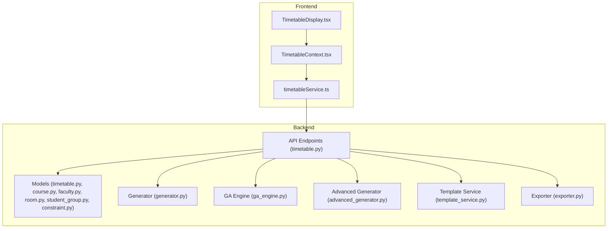
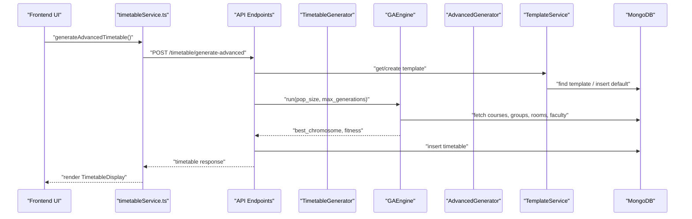
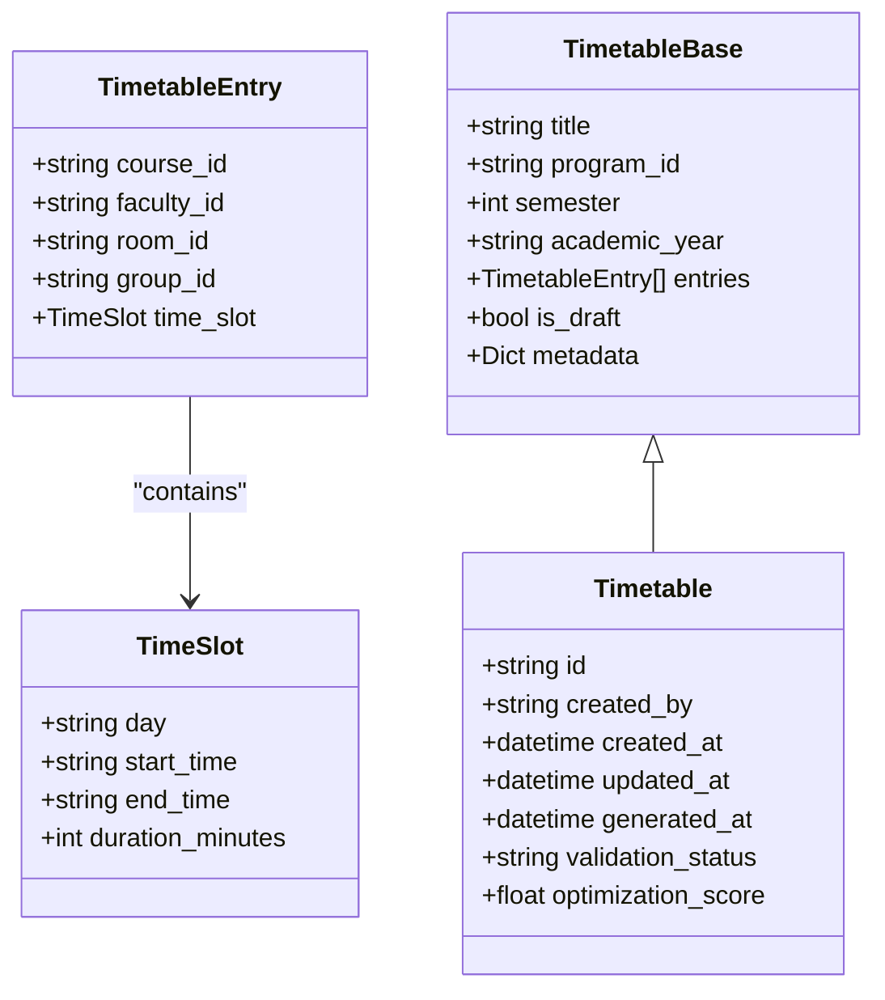
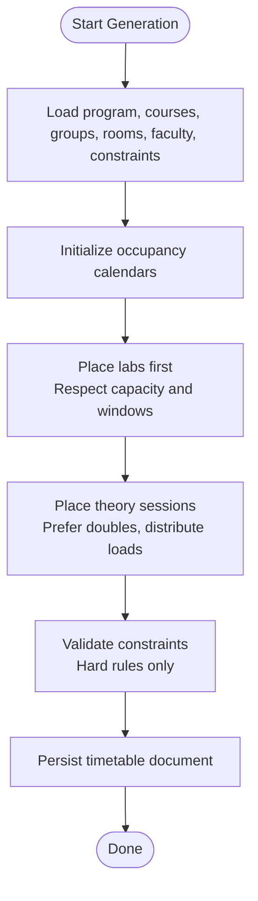
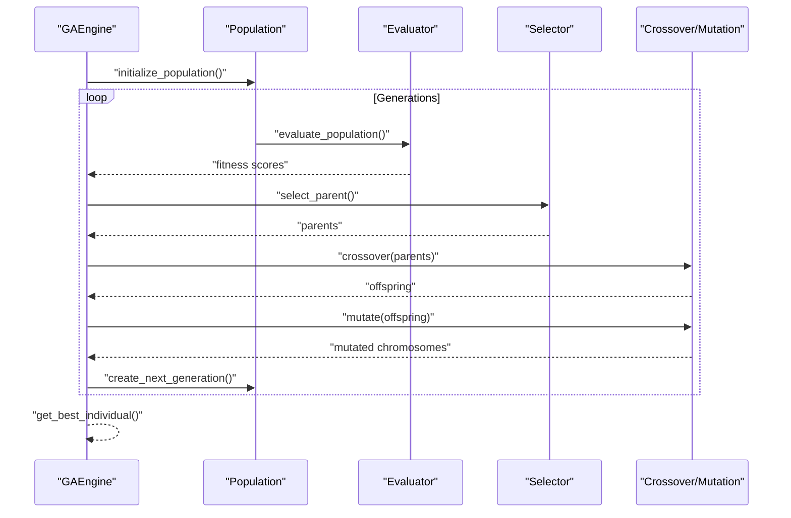
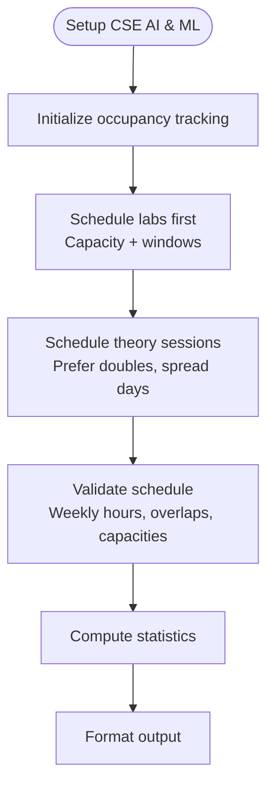
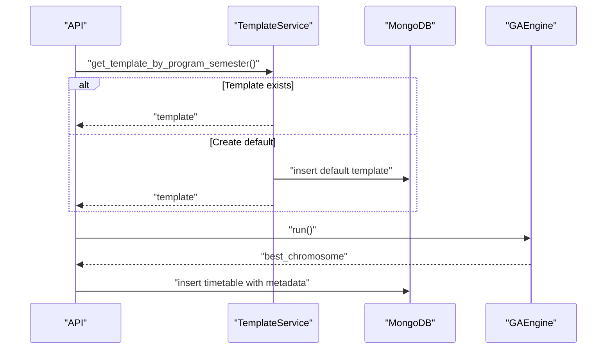
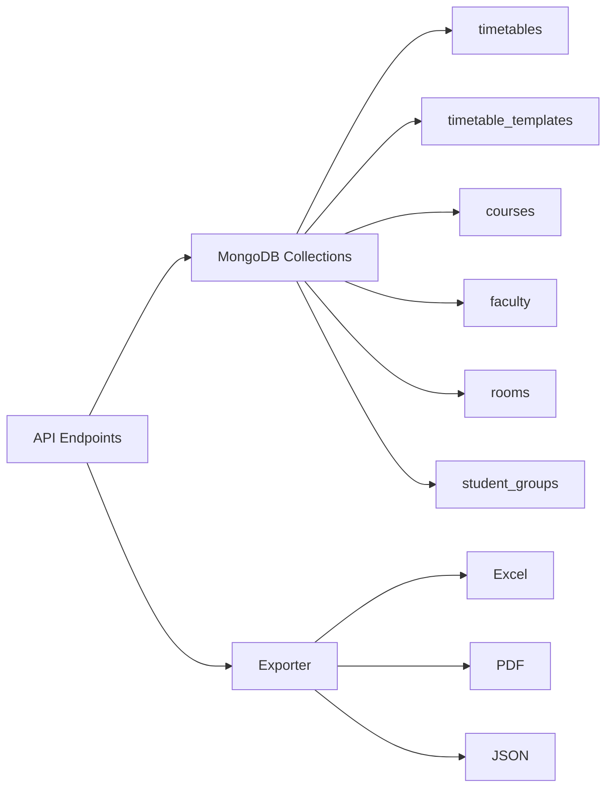
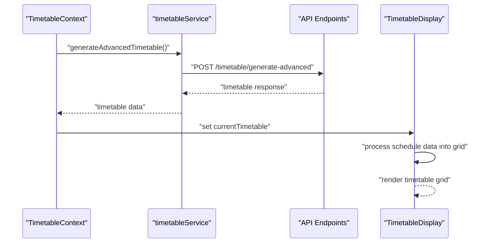
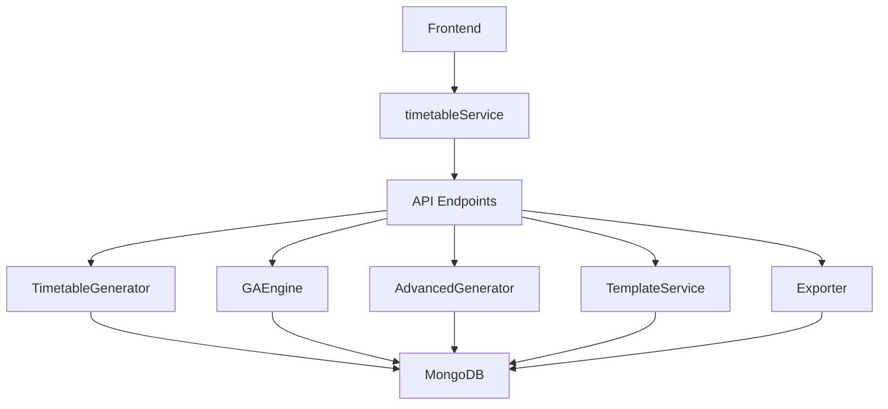

# Timetable Models

<cite>
**Referenced Files in This Document**
- [timetable.py](file://backend/app/models/timetable.py)
- [generator.py](file://backend/app/services/timetable/generator.py)
- [ga_engine.py](file://backend/app/services/timetable/ga_engine.py)
- [advanced_generator.py](file://backend/app/services/timetable/advanced_generator.py)
- [template_service.py](file://backend/app/services/timetable/template_service.py)
- [exporter.py](file://backend/app/services/timetable/exporter.py)
- [timetable.py](file://backend/app/api/v1/endpoints/timetable.py)
- [course.py](file://backend/app/models/course.py)
- [faculty.py](file://backend/app/models/faculty.py)
- [room.py](file://backend/app/models/room.py)
- [student_group.py](file://backend/app/models/student_group.py)
- [constraint.py](file://backend/app/models/constraint.py)
- [TimetableDisplay.tsx](file://frontend/src/components/pages/CreateTimetable/TimetableDisplay.tsx)
- [timetableService.ts](file://frontend/src/services/timetableService.ts)
- [TimetableContext.tsx](file://frontend/src/contexts/TimetableContext.tsx)
</cite>

## Table of Contents
1. [Introduction](#introduction)
2. [Project Structure](#project-structure)
3. [Core Components](#core-components)
4. [Architecture Overview](#architecture-overview)
5. [Detailed Component Analysis](#detailed-component-analysis)
6. [Dependency Analysis](#dependency-analysis)
7. [Performance Considerations](#performance-considerations)
8. [Troubleshooting Guide](#troubleshooting-guide)
9. [Conclusion](#conclusion)

## Introduction
This document provides comprehensive technical documentation for the Timetable model and its associated data structures within the academic scheduling system. It covers the timetable schema, time slot representation, scheduling algorithms, and integrations with academic models such as courses, faculty, rooms, and student groups. It also explains timetable generation patterns, validation rules, conflict detection, persistence mechanisms, and performance considerations for large-scale management and real-time updates.

## Project Structure
The timetable system spans backend models, services, APIs, and frontend components:
- Backend models define the Timetable schema and related entities (Course, Faculty, Room, StudentGroup, Constraint).
- Services implement scheduling algorithms (constraint-based, genetic algorithm, advanced generator).
- API endpoints expose CRUD, generation, optimization, validation, and export operations.
- Frontend components render timetables, manage form data, and integrate with backend services.

**Diagram sources**
- [timetable.py:1-728](file://backend/app/api/v1/endpoints/timetable.py#L1-L728)
- [timetable.py:1-52](file://backend/app/models/timetable.py#L1-L52)
- [generator.py:1-402](file://backend/app/services/timetable/generator.py#L1-L402)
- [ga_engine.py:1-414](file://backend/app/services/timetable/ga_engine.py#L1-L414)
- [advanced_generator.py:1-707](file://backend/app/services/timetable/advanced_generator.py#L1-L707)
- [template_service.py:1-486](file://backend/app/services/timetable/template_service.py#L1-L486)
- [exporter.py:1-383](file://backend/app/services/timetable/exporter.py#L1-L383)
- [TimetableDisplay.tsx:1-661](file://frontend/src/components/pages/CreateTimetable/TimetableDisplay.tsx#L1-L661)
- [timetableService.ts:1-772](file://frontend/src/services/timetableService.ts#L1-L772)
- [TimetableContext.tsx:1-629](file://frontend/src/contexts/TimetableContext.tsx#L1-L629)

**Section sources**
- [timetable.py:1-728](file://backend/app/api/v1/endpoints/timetable.py#L1-L728)
- [timetable.py:1-52](file://backend/app/models/timetable.py#L1-L52)
- [generator.py:1-402](file://backend/app/services/timetable/generator.py#L1-L402)
- [ga_engine.py:1-414](file://backend/app/services/timetable/ga_engine.py#L1-L414)
- [advanced_generator.py:1-707](file://backend/app/services/timetable/advanced_generator.py#L1-L707)
- [template_service.py:1-486](file://backend/app/services/timetable/template_service.py#L1-L486)
- [exporter.py:1-383](file://backend/app/services/timetable/exporter.py#L1-L383)
- [TimetableDisplay.tsx:1-661](file://frontend/src/components/pages/CreateTimetable/TimetableDisplay.tsx#L1-L661)
- [timetableService.ts:1-772](file://frontend/src/services/timetableService.ts#L1-L772)
- [TimetableContext.tsx:1-629](file://frontend/src/contexts/TimetableContext.tsx#L1-L629)

## Core Components
This section defines the primary data structures and their roles in the timetable system.

- Timetable schema
  - Title, program reference, semester, academic year, entries, draft flag, metadata, timestamps, validation status, and optimization score.
  - Entries include course, faculty, room, group, and time slot details.

- Time slot structures
  - Internal TimeSlot model captures day, start/end times, and duration in minutes.
  - External representation supports both internal TimeSlot and external time slot formats used by the GA engine and template service.

- Academic models integration
  - Course: course code, name, credits, type, hours per week, session duration, semester, program linkage, prerequisites, lab flag, and activity status.
  - Faculty: personal and professional attributes, subject specializations, max weekly hours, and availability.
  - Room: room name/number, building, floor, capacity, type, facilities, accessibility, projector availability, and activity status.
  - StudentGroup: group/class name, course linkage, academic year/semester/section, strength, group type, and program linkage.

- Constraint model
  - Named constraints with type, description, parameters, priority, activation flag, and optional program scoping.

**Section sources**
- [timetable.py:6-52](file://backend/app/models/timetable.py#L6-L52)
- [course.py:6-43](file://backend/app/models/course.py#L6-L43)
- [faculty.py:5-39](file://backend/app/models/faculty.py#L5-L39)
- [room.py:6-43](file://backend/app/models/room.py#L6-L43)
- [student_group.py:5-36](file://backend/app/models/student_group.py#L5-L36)
- [constraint.py:6-30](file://backend/app/models/constraint.py#L6-L30)

## Architecture Overview
The timetable system follows a layered architecture:
- Frontend renders timetables and manages user interactions.
- API layer validates requests, enforces user isolation, and orchestrates service operations.
- Service layer implements scheduling algorithms and template-based generation.
- Persistence layer stores timetables, templates, and related academic data in MongoDB.
- Export layer produces downloadable formats (Excel, PDF, JSON).

**Diagram sources**
- [timetable.py:266-375](file://backend/app/api/v1/endpoints/timetable.py#L266-L375)
- [template_service.py:80-206](file://backend/app/services/timetable/template_service.py#L80-L206)
- [ga_engine.py:125-165](file://backend/app/services/timetable/ga_engine.py#L125-L165)
- [TimetableDisplay.tsx:1-661](file://frontend/src/components/pages/CreateTimetable/TimetableDisplay.tsx#L1-L661)
- [timetableService.ts:346-359](file://frontend/src/services/timetableService.ts#L346-L359)

## Detailed Component Analysis

### Timetable Model and Schema
The Timetable model encapsulates the core scheduling entity with strong typing and validation:
- Fields: title, program_id, semester, academic_year, entries, is_draft, metadata, timestamps, validation_status, optimization_score.
- Entry composition: course_id, faculty_id, room_id, group_id, and embedded time_slot.
- TimeSlot: day, start_time, end_time, duration_minutes.

**Diagram sources**
- [timetable.py:6-52](file://backend/app/models/timetable.py#L6-L52)

**Section sources**
- [timetable.py:6-52](file://backend/app/models/timetable.py#L6-L52)

### Time Slot Structures and Representation Formats
Two complementary representations exist:
- Internal TimeSlot (Pydantic model) used in the TimetableEntry schema.
- External slot formats used by GAEngine and TemplateService:
  - GAEngine: slot dictionaries with day, start_time, end_time, duration_minutes, and slot_type.
  - TemplateService: structured time_slots with start_time, end_time, duration_minutes, and slot_type (lecture, lab, break).

These formats enable flexible scheduling while maintaining compatibility with the internal model.

**Section sources**
- [timetable.py:6-18](file://backend/app/models/timetable.py#L6-L18)
- [ga_engine.py:11-18](file://backend/app/services/timetable/ga_engine.py#L11-L18)
- [template_service.py:136-176](file://backend/app/services/timetable/template_service.py#L136-L176)

### Scheduling Algorithms and Generation Patterns

#### Constraint-Based Generator (TimetableGenerator)
- Loads program, courses, groups, rooms, faculty, and constraints.
- Initializes occupancy calendars for rooms, groups, and faculty.
- Enforces hard constraints: no resource overlap, capacity limits, max periods per day, max contiguous periods, max labs per day, and lab windows.
- Implements a two-phase placement strategy:
  - Phase 1: Labs first, prioritizing afternoon windows and subgroup capacity.
  - Phase 2: Theory sessions, preferring double periods for heavy courses and distributing sessions across days.
- Produces a timetable document with metadata indicating generation method and slot configuration.

**Diagram sources**
- [generator.py:169-233](file://backend/app/services/timetable/generator.py#L169-L233)
- [generator.py:273-301](file://backend/app/services/timetable/generator.py#L273-L301)
- [generator.py:303-378](file://backend/app/services/timetable/generator.py#L303-L378)
- [generator.py:380-401](file://backend/app/services/timetable/generator.py#L380-L401)

**Section sources**
- [generator.py:163-402](file://backend/app/services/timetable/generator.py#L163-L402)

#### Genetic Algorithm Engine (GAEngine)
- Chromosome representation: genes include course, group, faculty, room, day, slot, and duration.
- Fitness function balances hard constraint violations, soft constraints (room capacity ratio), and optimization goals (workload balance).
- Operators: tournament selection, order crossover, swap/inversion/insertion mutations, and attribute mutation.
- Runtime controls: population size, max generations, elitism, convergence threshold, and fitness weights.

**Diagram sources**
- [ga_engine.py:115-165](file://backend/app/services/timetable/ga_engine.py#L115-L165)
- [ga_engine.py:195-212](file://backend/app/services/timetable/ga_engine.py#L195-L212)
- [ga_engine.py:283-310](file://backend/app/services/timetable/ga_engine.py#L283-L310)
- [ga_engine.py:342-381](file://backend/app/services/timetable/ga_engine.py#L342-L381)

**Section sources**
- [ga_engine.py:19-414](file://backend/app/services/timetable/ga_engine.py#L19-L414)

#### Advanced Generator (AdvancedTimetableGenerator)
- Defines detailed scheduling rules: working days, start/end times, lunch break, period duration, passing time, max contiguous periods, max periods per day, and lab windows.
- Implements strict constraints: daily period counts, continuous periods, lab frequency, and capacity checks.
- Uses occupancy tracking and availability checks to ensure feasibility.
- Generates a validated schedule with statistics and formatted output.

**Diagram sources**
- [advanced_generator.py:217-254](file://backend/app/services/timetable/advanced_generator.py#L217-L254)
- [advanced_generator.py:256-260](file://backend/app/services/timetable/advanced_generator.py#L256-L260)
- [advanced_generator.py:369-423](file://backend/app/services/timetable/advanced_generator.py#L369-L423)
- [advanced_generator.py:425-508](file://backend/app/services/timetable/advanced_generator.py#L425-L508)
- [advanced_generator.py:617-659](file://backend/app/services/timetable/advanced_generator.py#L617-L659)

**Section sources**
- [advanced_generator.py:201-707](file://backend/app/services/timetable/advanced_generator.py#L201-L707)

### Template-Based Generation and Collaboration
TemplateService centralizes timetable template management:
- Normalizes overrides for courses, student groups, rooms, and faculty.
- Creates default templates based on active rules, generating time slots and constraints.
- Applies templates to produce timetables using GAEngine, persisting metadata and schedule details.
- Supports updating existing timetables to prevent duplicates and maintain consistency.

**Diagram sources**
- [template_service.py:80-95](file://backend/app/services/timetable/template_service.py#L80-L95)
- [template_service.py:97-206](file://backend/app/services/timetable/template_service.py#L97-L206)
- [template_service.py:208-413](file://backend/app/services/timetable/template_service.py#L208-L413)

**Section sources**
- [template_service.py:1-486](file://backend/app/services/timetable/template_service.py#L1-L486)

### Validation Rules and Conflict Detection
Validation occurs at multiple layers:
- Constraint-based generator: hard constraints enforced during placement (resource overlap, capacity, daily limits, contiguous periods).
- GAEngine: hard constraint violations penalized in fitness; soft constraints and optimization objectives considered.
- Advanced generator: comprehensive validation ensuring weekly hour targets, no overlaps, and capacity compliance.

Conflict detection mechanisms:
- Overlap checks between time slots for rooms, faculty, and groups.
- Capacity checks against group size and room capacity.
- Continuous periods and daily period limits enforcement.

**Section sources**
- [generator.py:247-254](file://backend/app/services/timetable/generator.py#L247-L254)
- [generator.py:149-161](file://backend/app/services/timetable/generator.py#L149-L161)
- [ga_engine.py:214-250](file://backend/app/services/timetable/ga_engine.py#L214-L250)
- [advanced_generator.py:617-659](file://backend/app/services/timetable/advanced_generator.py#L617-L659)

### Persistence, Versioning, and Collaborative Editing
Persistence and collaboration features:
- MongoDB storage for timetables, templates, and academic entities.
- User isolation enforced in API endpoints via created_by filtering.
- Draft support with is_draft flag and modified_by tracking.
- Metadata embedding for templates, schedule details, and generation parameters.
- Export capabilities for Excel, PDF, JSON, and CSV formats.

**Diagram sources**
- [timetable.py:17-71](file://backend/app/api/v1/endpoints/timetable.py#L17-L71)
- [timetable.py:539-589](file://backend/app/api/v1/endpoints/timetable.py#L539-L589)
- [exporter.py:22-93](file://backend/app/services/timetable/exporter.py#L22-L93)

**Section sources**
- [timetable.py:17-71](file://backend/app/api/v1/endpoints/timetable.py#L17-L71)
- [timetable.py:147-232](file://backend/app/api/v1/endpoints/timetable.py#L147-L232)
- [timetable.py:539-589](file://backend/app/api/v1/endpoints/timetable.py#L539-L589)
- [exporter.py:22-93](file://backend/app/services/timetable/exporter.py#L22-L93)

### Frontend Integration and Rendering
Frontend components consume backend APIs and present timetables:
- TimetableDisplay renders a grid-based timetable with dynamic days and time slots, handling lab sessions spanning multiple slots.
- TimetableContext manages form data, loading academic entities, and coordinating generation/export actions.
- timetableService abstracts API interactions, interceptors for authentication, and mock implementations for development.

**Diagram sources**
- [TimetableContext.tsx:444-460](file://frontend/src/contexts/TimetableContext.tsx#L444-L460)
- [timetableService.ts:346-359](file://frontend/src/services/timetableService.ts#L346-L359)
- [TimetableDisplay.tsx:229-343](file://frontend/src/components/pages/CreateTimetable/TimetableDisplay.tsx#L229-L343)

**Section sources**
- [TimetableDisplay.tsx:1-661](file://frontend/src/components/pages/CreateTimetable/TimetableDisplay.tsx#L1-L661)
- [timetableService.ts:161-772](file://frontend/src/services/timetableService.ts#L161-L772)
- [TimetableContext.tsx:1-629](file://frontend/src/contexts/TimetableContext.tsx#L1-L629)

## Dependency Analysis
The system exhibits clear separation of concerns:
- API depends on services for generation and optimization.
- Services depend on models and MongoDB for data access.
- TemplateService coordinates GAEngine with academic datasets.
- Frontend depends on timetableService for backend integration.

**Diagram sources**
- [timetable.py:1-728](file://backend/app/api/v1/endpoints/timetable.py#L1-L728)
- [generator.py:1-402](file://backend/app/services/timetable/generator.py#L1-L402)
- [ga_engine.py:1-414](file://backend/app/services/timetable/ga_engine.py#L1-L414)
- [advanced_generator.py:1-707](file://backend/app/services/timetable/advanced_generator.py#L1-L707)
- [template_service.py:1-486](file://backend/app/services/timetable/template_service.py#L1-L486)
- [exporter.py:1-383](file://backend/app/services/timetable/exporter.py#L1-L383)
- [timetableService.ts:1-772](file://frontend/src/services/timetableService.ts#L1-L772)

**Section sources**
- [timetable.py:1-728](file://backend/app/api/v1/endpoints/timetable.py#L1-L728)
- [generator.py:1-402](file://backend/app/services/timetable/generator.py#L1-L402)
- [ga_engine.py:1-414](file://backend/app/services/timetable/ga_engine.py#L1-L414)
- [advanced_generator.py:1-707](file://backend/app/services/timetable/advanced_generator.py#L1-L707)
- [template_service.py:1-486](file://backend/app/services/timetable/template_service.py#L1-L486)
- [exporter.py:1-383](file://backend/app/services/timetable/exporter.py#L1-L383)
- [timetableService.ts:1-772](file://frontend/src/services/timetableService.ts#L1-L772)

## Performance Considerations
- Scalability
  - Use indexed queries on program_id, semester, and academic_year for efficient timetable retrieval.
  - Batch operations for bulk course/group/room imports to reduce overhead.
- Algorithmic efficiency
  - Prefer double periods for heavy courses to minimize slot count and improve placement speed.
  - Limit search space by pre-filtering rooms by capacity and type, and faculty by subject specialization.
- Memory and computation
  - Cap population size and max generations in GAEngine to balance quality and runtime.
  - Cache frequently accessed constraints and templates to avoid repeated database reads.
- Real-time updates
  - Implement incremental updates to occupancy calendars and avoid full recomputation.
  - Use streaming responses for exports to reduce memory footprint.
- Frontend rendering
  - Virtualize large timetable grids to improve responsiveness.
  - Defer non-critical computations until after initial render.

## Troubleshooting Guide
Common issues and resolutions:
- Timetable not found or access denied
  - Verify user isolation filters and created_by ownership in API endpoints.
  - Ensure ObjectId conversions for program_id and other identifiers.
- Generation failures
  - Confirm program existence and active constraints.
  - Check room capacity and faculty availability; adjust overrides if needed.
- Export errors
  - Validate format type and handle unsupported formats gracefully.
  - Ensure required metadata fields are populated for export formatting.
- Frontend authentication
  - Confirm Authorization headers are attached via interceptors.
  - Handle token refresh and 401 responses appropriately.

**Section sources**
- [timetable.py:17-71](file://backend/app/api/v1/endpoints/timetable.py#L17-L71)
- [timetable.py:539-589](file://backend/app/api/v1/endpoints/timetable.py#L539-L589)
- [exporter.py:22-93](file://backend/app/services/timetable/exporter.py#L22-L93)
- [timetableService.ts:161-261](file://frontend/src/services/timetableService.ts#L161-L261)

## Conclusion
The timetable system integrates robust models, flexible scheduling algorithms, and a cohesive frontend/backend architecture. It supports constraint-based and genetic algorithm approaches, template-driven generation, comprehensive validation, and scalable persistence. By adhering to the outlined patterns and best practices, teams can efficiently manage large-scale timetables, ensure compliance with academic constraints, and deliver responsive user experiences.