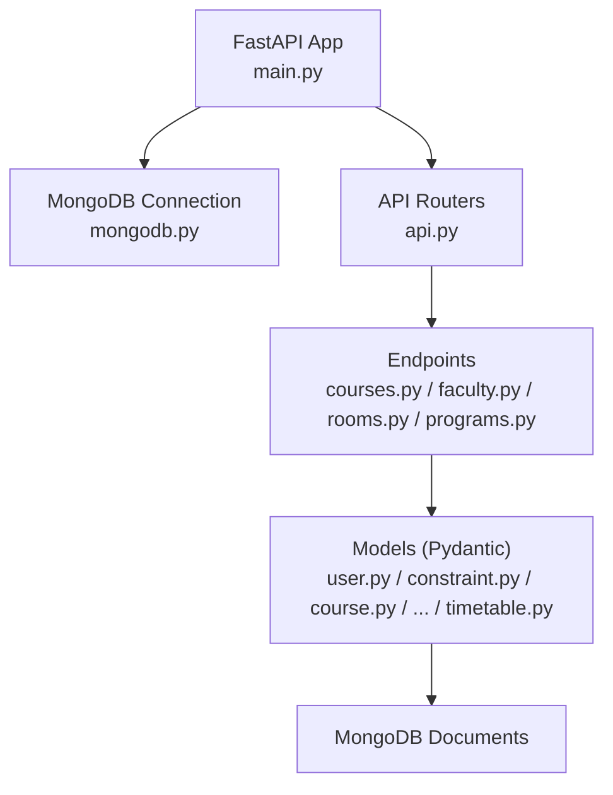
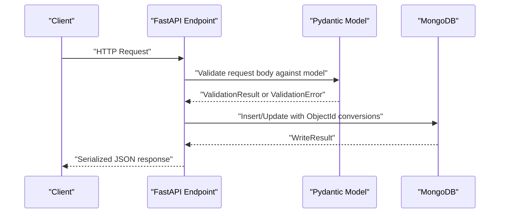
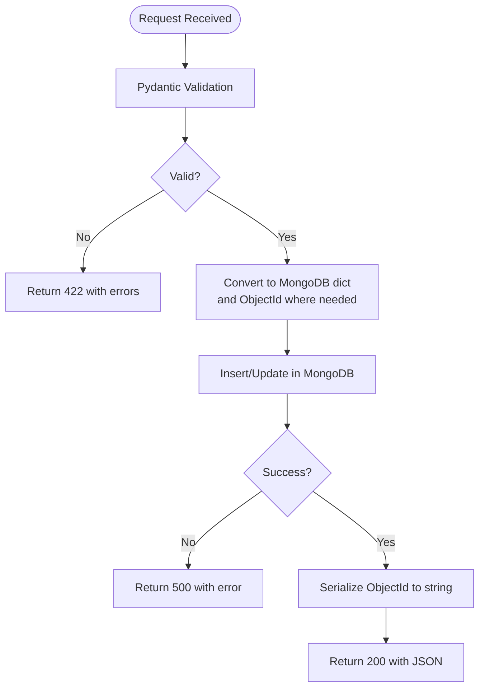
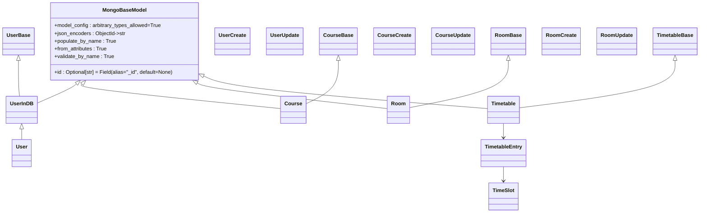
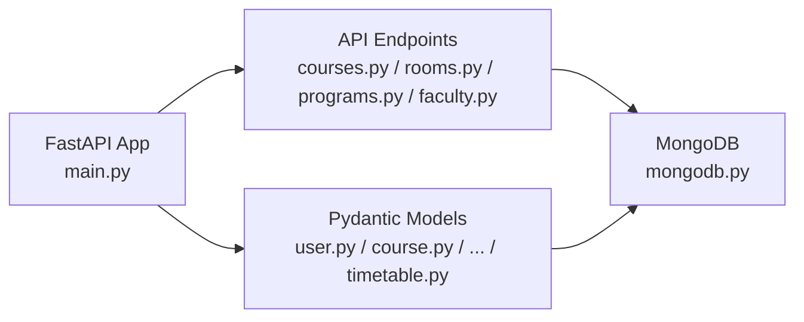

# Data Validation and Serialization

<cite>
**Referenced Files in This Document**
- [main.py](file://backend/app/main.py)
- [mongodb.py](file://backend/app/db/mongodb.py)
- [user.py](file://backend/app/models/user.py)
- [constraint.py](file://backend/app/models/constraint.py)
- [course.py](file://backend/app/models/course.py)
- [faculty.py](file://backend/app/models/faculty.py)
- [program.py](file://backend/app/models/program.py)
- [room.py](file://backend/app/models/room.py)
- [rule.py](file://backend/app/models/rule.py)
- [student_group.py](file://backend/app/models/student_group.py)
- [timetable.py](file://backend/app/models/timetable.py)
- [api.py](file://backend/app/api/api_v1/api.py)
- [courses.py](file://backend/app/api/v1/endpoints/courses.py)
- [faculty.py](file://backend/app/api/v1/endpoints/faculty.py)
- [rooms.py](file://backend/app/api/v1/endpoints/rooms.py)
- [programs.py](file://backend/app/api/v1/endpoints/programs.py)
</cite>

## Table of Contents
1. [Introduction](#introduction)
2. [Project Structure](#project-structure)
3. [Core Components](#core-components)
4. [Architecture Overview](#architecture-overview)
5. [Detailed Component Analysis](#detailed-component-analysis)
6. [Dependency Analysis](#dependency-analysis)
7. [Performance Considerations](#performance-considerations)
8. [Troubleshooting Guide](#troubleshooting-guide)
9. [Conclusion](#conclusion)
10. [Appendices](#appendices)

## Introduction
This document explains how ShedMaster validates and serializes data across the backend. It focuses on Pydantic validation mechanisms, custom validators, field-level constraints, and the round-trip mapping between Pydantic models and MongoDB documents. It also covers error handling strategies, serialization nuances for complex types, and practical guidance for bulk validation, partial updates, migrations, and performance optimization.

## Project Structure
The backend is organized around:
- FastAPI application entrypoint and global exception handling
- MongoDB connection management
- Pydantic models for domain entities and serialization
- API routers and endpoints implementing CRUD operations

**Diagram sources**
- [main.py:1-102](file://backend/app/main.py#L1-L102)
- [mongodb.py:1-41](file://backend/app/db/mongodb.py#L1-L41)
- [api.py:1-34](file://backend/app/api/api_v1/api.py#L1-L34)
- [courses.py:1-279](file://backend/app/api/v1/endpoints/courses.py#L1-L279)
- [faculty.py:1-265](file://backend/app/api/v1/endpoints/faculty.py#L1-L265)
- [rooms.py:1-258](file://backend/app/api/v1/endpoints/rooms.py#L1-L258)
- [programs.py:1-288](file://backend/app/api/v1/endpoints/programs.py#L1-L288)
- [user.py:1-76](file://backend/app/models/user.py#L1-L76)
- [constraint.py:1-30](file://backend/app/models/constraint.py#L1-L30)
- [course.py:1-43](file://backend/app/models/course.py#L1-L43)
- [faculty.py:1-39](file://backend/app/models/faculty.py#L1-L39)
- [program.py:1-33](file://backend/app/models/program.py#L1-L33)
- [room.py:1-43](file://backend/app/models/room.py#L1-L43)
- [rule.py:1-34](file://backend/app/models/rule.py#L1-L34)
- [student_group.py:1-36](file://backend/app/models/student_group.py#L1-L36)
- [timetable.py:1-52](file://backend/app/models/timetable.py#L1-L52)

**Section sources**
- [main.py:1-102](file://backend/app/main.py#L1-L102)
- [mongodb.py:1-41](file://backend/app/db/mongodb.py#L1-L41)
- [api.py:1-34](file://backend/app/api/api_v1/api.py#L1-L34)

## Core Components
- Pydantic models define validation rules and serialization behavior. They use field validators, constraints, and model configurations to ensure data integrity.
- MongoDB integration converts ObjectId fields to strings for JSON responses and relies on Pydantic’s json_encoders to serialize ObjectId to string consistently.
- FastAPI request validation is globally handled with a custom exception handler returning structured error details.

Key validation and serialization patterns:
- Field-level constraints via Pydantic Field parameters (e.g., numeric bounds).
- Custom validators using field_validator.
- MongoBaseModel configuration enabling ObjectId serialization and consistent aliasing.
- Endpoint-level validation using Pydantic models as request/response types and manual ObjectId conversions for MongoDB.

**Section sources**
- [user.py:1-76](file://backend/app/models/user.py#L1-L76)
- [course.py:1-43](file://backend/app/models/course.py#L1-L43)
- [constraint.py:1-30](file://backend/app/models/constraint.py#L1-L30)
- [room.py:1-43](file://backend/app/models/room.py#L1-L43)
- [timetable.py:1-52](file://backend/app/models/timetable.py#L1-L52)
- [main.py:41-54](file://backend/app/main.py#L41-L54)

## Architecture Overview
The validation and serialization pipeline:

**Diagram sources**
- [main.py:41-54](file://backend/app/main.py#L41-L54)
- [courses.py:58-126](file://backend/app/api/v1/endpoints/courses.py#L58-L126)
- [rooms.py:58-116](file://backend/app/api/v1/endpoints/rooms.py#L58-L116)
- [programs.py:100-139](file://backend/app/api/v1/endpoints/programs.py#L100-L139)
- [user.py:11-20](file://backend/app/models/user.py#L11-L20)

## Detailed Component Analysis

### Pydantic Validation Mechanisms and Field-Level Rules
- Numeric bounds and enums: Fields like credits, hours_per_week, min_per_session, floor, capacity, semester use ge/le constraints to enforce domain ranges.
- Optional vs required: Many fields are optional in update models, enabling partial updates.
- Email validation: Uses EmailStr for email fields.
- Alias mapping: MongoBaseModel maps id to _id for MongoDB storage while exposing id in JSON.

Examples of field-level constraints:
- Course credits and weekly hours: enforced via Field constraints.
- Room floor and capacity: constrained via Field parameters.
- Student group year and strength: bounded via Field constraints.
- Timetable entry fields: nested validation via nested Pydantic models.

**Section sources**
- [course.py:9-18](file://backend/app/models/course.py#L9-L18)
- [room.py:9-19](file://backend/app/models/room.py#L9-L19)
- [student_group.py:7-12](file://backend/app/models/student_group.py#L7-L12)
- [timetable.py:6-18](file://backend/app/models/timetable.py#L6-L18)
- [user.py:11-20](file://backend/app/models/user.py#L11-L20)

### Custom Validators
- User full_name normalization: A field_validator ensures either full_name or name is provided, normalizing missing values during validation.

**Section sources**
- [user.py:48-55](file://backend/app/models/user.py#L48-L55)

### Serialization to/from MongoDB Documents
- ObjectId serialization: MongoBaseModel defines json_encoders so ObjectId is serialized to string automatically.
- Alias handling: id is exposed as a field alias for _id, ensuring consistent JSON responses.
- Manual ObjectId conversions in endpoints: When inserting/updating, string program_id or faculty_id are converted to ObjectId before write operations.

Common serialization patterns:
- Converting ObjectId to string for JSON responses across endpoints.
- Using model_dump() and dict() to transform Pydantic models to dicts for MongoDB insertion/update.
- Ensuring nested objects (e.g., TimeSlot) are validated and serialized correctly.

**Section sources**
- [user.py:11-20](file://backend/app/models/user.py#L11-L20)
- [courses.py:77-94](file://backend/app/api/v1/endpoints/courses.py#L77-L94)
- [rooms.py:79-86](file://backend/app/api/v1/endpoints/rooms.py#L79-L86)
- [programs.py:123-125](file://backend/app/api/v1/endpoints/programs.py#L123-L125)

### Error Handling Strategies
- Global FastAPI validation error handler: Returns structured details including validation errors, raw body, and a user-friendly message.
- Endpoint-specific HTTP exceptions: Clear status codes and messages for invalid IDs, duplicates, not found, and permission checks.
- Database availability checks: Some endpoints guard against db.db being None.

**Diagram sources**
- [main.py:41-54](file://backend/app/main.py#L41-L54)
- [courses.py:138-145](file://backend/app/api/v1/endpoints/courses.py#L138-L145)
- [programs.py:31-32](file://backend/app/api/v1/endpoints/programs.py#L31-L32)

**Section sources**
- [main.py:41-54](file://backend/app/main.py#L41-L54)
- [courses.py:118-125](file://backend/app/api/v1/endpoints/courses.py#L118-L125)
- [programs.py:60-63](file://backend/app/api/v1/endpoints/programs.py#L60-L63)

### Relationship Between Pydantic Models and MongoDB Documents
- Storage: MongoDB stores documents with native ObjectId fields.
- Exposure: Pydantic models expose id as a string field, mapping to MongoDB’s _id.
- Nested models: Complex fields like TimeSlot and TimetableEntry are validated as nested Pydantic models.

**Diagram sources**
- [user.py:11-20](file://backend/app/models/user.py#L11-L20)
- [user.py:67-76](file://backend/app/models/user.py#L67-L76)
- [course.py:39-43](file://backend/app/models/course.py#L39-L43)
- [room.py:39-43](file://backend/app/models/room.py#L39-L43)
- [timetable.py:6-18](file://backend/app/models/timetable.py#L6-L18)
- [timetable.py:46-52](file://backend/app/models/timetable.py#L46-L52)

### Bulk Validation and Partial Updates
- Partial updates: Update models use Optional fields; endpoints apply exclude_unset or filter None values to perform sparse updates.
- Bulk reads: Endpoints return lists of documents; ObjectId fields are converted to strings for JSON responses.
- Example patterns:
  - Courses endpoint supports filtering and returns lists of dicts with stringified ObjectIds.
  - Rooms endpoint supports filtering and returns lists of dicts with stringified ObjectIds.
  - Programs endpoint paginates results and ensures default values for response models.

**Section sources**
- [courses.py:12-56](file://backend/app/api/v1/endpoints/courses.py#L12-L56)
- [rooms.py:12-55](file://backend/app/api/v1/endpoints/rooms.py#L12-L55)
- [programs.py:12-59](file://backend/app/api/v1/endpoints/programs.py#L12-L59)
- [course.py:24-37](file://backend/app/models/course.py#L24-L37)
- [room.py:24-37](file://backend/app/models/room.py#L24-L37)

### Data Migration Scenarios
- ObjectId normalization: When migrating from string program_id to ObjectId, endpoints convert string IDs to ObjectId before writes.
- Backward compatibility: Endpoints handle both ObjectId and string program_id in queries to support mixed environments.
- Schema evolution: New optional fields are defaulted in responses to maintain compatibility with older clients.

**Section sources**
- [courses.py:82-91](file://backend/app/api/v1/endpoints/courses.py#L82-L91)
- [programs.py:216-222](file://backend/app/api/v1/endpoints/programs.py#L216-L222)
- [programs.py:47-54](file://backend/app/api/v1/endpoints/programs.py#L47-L54)

### Examples Catalog
- Validation and serialization in action:
  - Course creation: Pydantic validation, duplicate checks, ObjectId conversion, and response serialization.
  - Room update: Partial update with exclude_unset, duplicate checks, and ObjectId conversion.
  - Program listing: Pagination, filtering, ObjectId-to-string conversion, and default field provisioning.

**Section sources**
- [courses.py:58-126](file://backend/app/api/v1/endpoints/courses.py#L58-L126)
- [rooms.py:118-206](file://backend/app/api/v1/endpoints/rooms.py#L118-L206)
- [programs.py:12-59](file://backend/app/api/v1/endpoints/programs.py#L12-L59)

## Dependency Analysis
- FastAPI depends on Pydantic models for request validation and on MongoDB for persistence.
- Endpoints depend on models for validation and on MongoDB for CRUD operations.
- MongoBaseModel centralizes ObjectId serialization and alias behavior.

**Diagram sources**
- [main.py:1-102](file://backend/app/main.py#L1-L102)
- [mongodb.py:1-41](file://backend/app/db/mongodb.py#L1-L41)
- [user.py:11-20](file://backend/app/models/user.py#L11-L20)
- [course.py:1-43](file://backend/app/models/course.py#L1-L43)
- [timetable.py:1-52](file://backend/app/models/timetable.py#L1-L52)

**Section sources**
- [main.py:1-102](file://backend/app/main.py#L1-L102)
- [mongodb.py:1-41](file://backend/app/db/mongodb.py#L1-L41)

## Performance Considerations
- Prefer exclude_unset for partial updates to minimize write payload sizes.
- Use pagination and filtering in endpoints to reduce memory footprint for bulk reads.
- Avoid unnecessary conversions: reuse model_dump()/dict() and minimize repeated ObjectId conversions.
- Batch operations: For large-scale ingestion, batch inserts and leverage MongoDB’s bulk helpers to reduce round trips.
- Validation cost: Keep validators simple; avoid heavy computations in field_validator.
- Connection resilience: The MongoDB connection attempts ping and logs warnings without failing the service startup, aiding operational stability.

[No sources needed since this section provides general guidance]

## Troubleshooting Guide
Common issues and resolutions:
- Validation failures:
  - Symptom: 422 Unprocessable Entity with detailed errors.
  - Action: Inspect returned errors and adjust request payload to match field constraints and required fields.
- ObjectId format errors:
  - Symptom: Invalid ID format errors on GET/PUT/DELETE.
  - Action: Ensure IDs are valid ObjectId strings; endpoints validate format and return 400.
- Duplicate resource errors:
  - Symptom: 400 errors indicating duplicates (e.g., course code or room name already exists).
  - Action: Change the conflicting field value or target a different resource.
- Not found errors:
  - Symptom: 404 when accessing non-existent resources.
  - Action: Verify the resource exists and the requester has appropriate access.
- Database unavailability:
  - Symptom: 503 when db.db is None.
  - Action: Confirm MongoDB connectivity and retry; the app logs connection attempts.
- Serialization anomalies:
  - Symptom: Missing or unexpected fields in responses.
  - Action: Ensure ObjectId fields are converted to strings; rely on model_dump()/dict() and endpoint conversions.

**Section sources**
- [main.py:41-54](file://backend/app/main.py#L41-L54)
- [courses.py:138-145](file://backend/app/api/v1/endpoints/courses.py#L138-L145)
- [programs.py:31-32](file://backend/app/api/v1/endpoints/programs.py#L31-L32)
- [rooms.py:128-135](file://backend/app/api/v1/endpoints/rooms.py#L128-L135)

## Conclusion
ShedMaster leverages Pydantic for robust, declarative validation and MongoDB for flexible document storage. ObjectId serialization is centralized in MongoBaseModel, while endpoints handle conversion and response formatting. The system provides clear error handling, supports partial updates and bulk operations, and maintains backward compatibility during schema evolution.

[No sources needed since this section summarizes without analyzing specific files]

## Appendices

### Appendix A: Validation and Serialization Patterns Across Entities
- Course: Numeric bounds on credits and hours; partial updates supported; ObjectId conversion for program_id.
- Room: Capacity and floor bounds; partial updates; duplicate name+building checks.
- Program: Admin-only mutations; pagination and filtering; default field provisioning for responses.
- Faculty: Unique employee_id per creator; ObjectId conversions; strict update validation.
- Timetable: Nested TimeSlot and TimetableEntry models; metadata and status fields.

**Section sources**
- [course.py:1-43](file://backend/app/models/course.py#L1-L43)
- [room.py:1-43](file://backend/app/models/room.py#L1-L43)
- [program.py:1-33](file://backend/app/models/program.py#L1-L33)
- [faculty.py:1-39](file://backend/app/models/faculty.py#L1-L39)
- [timetable.py:1-52](file://backend/app/models/timetable.py#L1-L52)