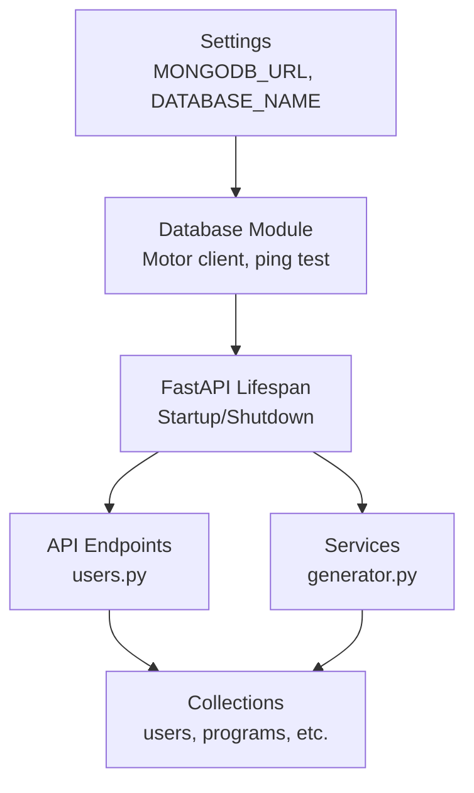
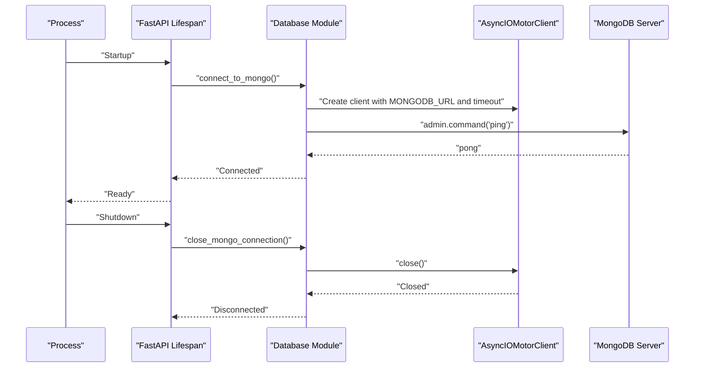
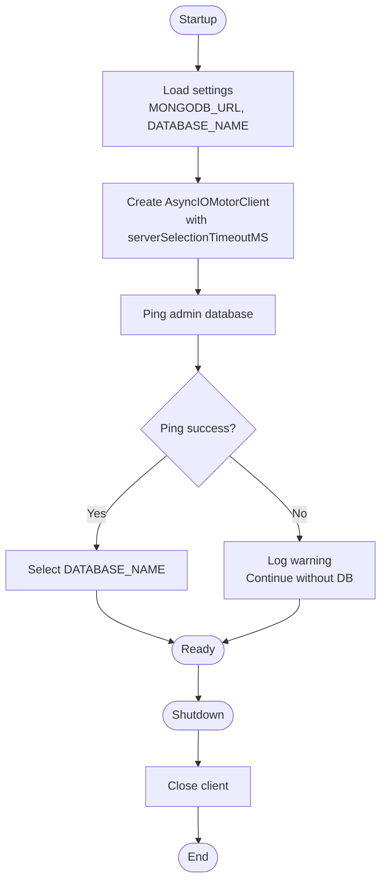
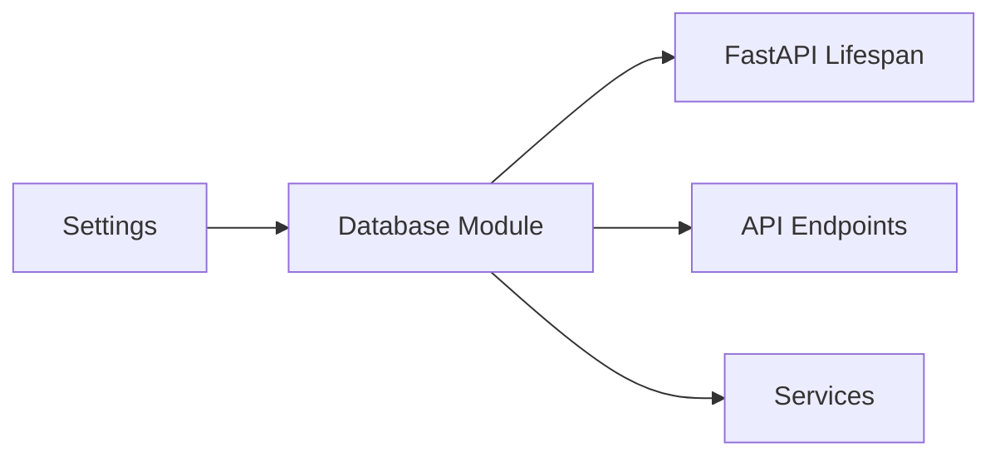

# Database Connection Management

<cite>
**Referenced Files in This Document**
- [mongodb.py](file://backend/app/db/mongodb.py)
- [config.py](file://backend/app/core/config.py)
- [main.py](file://backend/app/main.py)
- [users.py](file://backend/app/api/v1/endpoints/users.py)
- [generator.py](file://backend/app/services/timetable/generator.py)
- [docker-compose.yml](file://backend/docker-compose.yml)
- [requirements.txt](file://backend/requirements.txt)
- [create_admin.py](file://backend/create_admin.py)
- [tmp_check_user.py](file://backend/tmp_check_user.py)
- [inspect_programs.py](file://backend/inspect_programs.py)
</cite>

## Table of Contents
1. [Introduction](#introduction)
2. [Project Structure](#project-structure)
3. [Core Components](#core-components)
4. [Architecture Overview](#architecture-overview)
5. [Detailed Component Analysis](#detailed-component-analysis)
6. [Dependency Analysis](#dependency-analysis)
7. [Performance Considerations](#performance-considerations)
8. [Troubleshooting Guide](#troubleshooting-guide)
9. [Conclusion](#conclusion)

## Introduction
This document explains MongoDB connection management in ShedMaster, focusing on the Motor async driver integration, connection lifecycle, configuration, and operational practices. It covers how the application initializes the database client, handles connection strings and environment-based configuration, manages connection pools, and performs graceful shutdown. It also documents collection access patterns, transaction usage, monitoring and health checks, and provides troubleshooting guidance for common connection issues.

## Project Structure
The database-related code is organized into a small set of focused modules:
- Configuration module defines environment-driven settings for the database connection string and database name.
- Database module encapsulates the Motor client and exposes connection and disconnection helpers.
- Application lifecycle hooks integrate database startup and teardown with FastAPI.
- Endpoint and service modules access collections via a shared database handle.

**Diagram sources**
- [config.py:25-27](file://backend/app/core/config.py#L25-L27)
- [mongodb.py:11-33](file://backend/app/db/mongodb.py#L11-L33)
- [main.py:25-31](file://backend/app/main.py#L25-L31)
- [users.py:6](file://backend/app/api/v1/endpoints/users.py#L6)
- [generator.py:8](file://backend/app/services/timetable/generator.py#L8)

**Section sources**
- [config.py:25-27](file://backend/app/core/config.py#L25-L27)
- [mongodb.py:11-33](file://backend/app/db/mongodb.py#L11-L33)
- [main.py:25-31](file://backend/app/main.py#L25-L31)

## Core Components
- Settings: Provides MONGODB_URL and DATABASE_NAME from environment variables.
- Database module: Creates an AsyncIOMotorClient, selects the database, pings the server, and exposes helpers to close the connection.
- FastAPI lifespan: Calls connect/close during application startup/shutdown.
- Endpoints and services: Access collections via a shared database handle.

Key behaviors:
- Connection string and database name are environment-driven.
- A server selection timeout is configured to bound connection establishment.
- The application attempts a ping to validate connectivity.
- On failure, the app logs a warning and continues without raising an exception.
- Graceful shutdown closes the client.

**Section sources**
- [config.py:25-27](file://backend/app/core/config.py#L25-L27)
- [mongodb.py:11-33](file://backend/app/db/mongodb.py#L11-L33)
- [mongodb.py:34-41](file://backend/app/db/mongodb.py#L34-L41)
- [main.py:25-31](file://backend/app/main.py#L25-L31)

## Architecture Overview
The connection lifecycle is orchestrated by FastAPI’s lifespan manager. The database module encapsulates Motor client creation and health verification. Endpoints and services access collections through a global database handle initialized during startup.

**Diagram sources**
- [main.py:25-31](file://backend/app/main.py#L25-L31)
- [mongodb.py:11-33](file://backend/app/db/mongodb.py#L11-L33)
- [mongodb.py:34-41](file://backend/app/db/mongodb.py#L34-L41)

## Detailed Component Analysis

### Database Initialization and Connection Lifecycle
- Environment-based configuration: MONGODB_URL and DATABASE_NAME are loaded from environment variables via Pydantic settings.
- Client creation: An AsyncIOMotorClient is instantiated with a server selection timeout to bound connection establishment.
- Health check: A ping command against the admin database validates connectivity.
- Failure handling: On exception, the application logs a warning and continues without raising, enabling operation without a database for testing scenarios.
- Graceful shutdown: The client is closed during application shutdown.

**Diagram sources**
- [config.py:25-27](file://backend/app/core/config.py#L25-L27)
- [mongodb.py:11-33](file://backend/app/db/mongodb.py#L11-L33)
- [mongodb.py:34-41](file://backend/app/db/mongodb.py#L34-L41)

**Section sources**
- [config.py:25-27](file://backend/app/core/config.py#L25-L27)
- [mongodb.py:11-33](file://backend/app/db/mongodb.py#L11-L33)
- [mongodb.py:34-41](file://backend/app/db/mongodb.py#L34-L41)
- [main.py:25-31](file://backend/app/main.py#L25-L31)

### Connection Pool Configuration
- The current implementation does not explicitly configure Motor-specific pool options (e.g., maxPoolSize, minPoolSize, maxIdleTimeMS). The default Motor behavior applies.
- Production deployments should consider explicit pool sizing and timeouts to match workload characteristics.

[No sources needed since this section provides general guidance]

### Connection String Handling and Environment-Based Configuration
- MONGODB_URL and DATABASE_NAME are defined in settings and loaded from the .env file.
- docker-compose sets MONGODB_URL and DATABASE_NAME for containerized environments.
- Local development scripts and compose files demonstrate how to override the connection string.

**Section sources**
- [config.py:25-27](file://backend/app/core/config.py#L25-L27)
- [docker-compose.yml:10-12](file://backend/docker-compose.yml#L10-L12)

### Collection Access Patterns
- Endpoints and services import a shared database handle and access collections directly.
- Typical operations include find_one, find with pagination, insert_one, update_one, and delete_one.
- Cursor-based iteration is used for listing operations.

Examples of usage locations:
- Users endpoint reads and writes the users collection.
- Timetable generator reads multiple collections (programs, courses, student_groups, rooms, constraints, faculty) and writes timetables.

**Section sources**
- [users.py:24](file://backend/app/api/v1/endpoints/users.py#L24)
- [users.py:47](file://backend/app/api/v1/endpoints/users.py#L47)
- [users.py:73](file://backend/app/api/v1/endpoints/users.py#L73)
- [users.py:98](file://backend/app/api/v1/endpoints/users.py#L98)
- [users.py:121](file://backend/app/api/v1/endpoints/users.py#L121)
- [generator.py:170](file://backend/app/services/timetable/generator.py#L170)
- [generator.py:174](file://backend/app/services/timetable/generator.py#L174)
- [generator.py:188](file://backend/app/services/timetable/generator.py#L188)
- [generator.py:197](file://backend/app/services/timetable/generator.py#L197)
- [generator.py:399](file://backend/app/services/timetable/generator.py#L399)

### Transaction Management
- The current codebase does not implement explicit transactions in endpoints or services.
- Motor supports transactions via ClientSession. To add transaction support, wrap write operations in a session-bound transaction block and commit or abort accordingly.

[No sources needed since this section provides general guidance]

### Connection Retry Mechanisms and Timeouts
- The connection establishes with a server selection timeout to bound wait time for server discovery.
- No automatic retry loop is implemented around the connection or ping steps.
- For production, consider adding retry logic around connection establishment and critical operations.

**Section sources**
- [mongodb.py:17-20](file://backend/app/db/mongodb.py#L17-L20)
- [mongodb.py:24](file://backend/app/db/mongodb.py#L24)

### Error Handling Strategies
- Connection failures are caught and logged as warnings; the application proceeds without the database.
- Disconnection errors are caught and logged as warnings.
- Endpoint-level errors (e.g., not found, permission denied) are handled with appropriate HTTP exceptions.

**Section sources**
- [mongodb.py:28-32](file://backend/app/db/mongodb.py#L28-L32)
- [mongodb.py:36-41](file://backend/app/db/mongodb.py#L36-L41)
- [users.py:48](file://backend/app/api/v1/endpoints/users.py#L48)
- [users.py:112](file://backend/app/api/v1/endpoints/users.py#L112)

### Database Client Setup and Usage Examples
- Client creation and database selection occur in the connection helper.
- Example scripts demonstrate connecting and accessing collections for inspection and administrative tasks.

**Section sources**
- [mongodb.py:17-21](file://backend/app/db/mongodb.py#L17-L21)
- [tmp_check_user.py:5-7](file://backend/tmp_check_user.py#L5-L7)
- [inspect_programs.py:5-9](file://backend/inspect_programs.py#L5-L9)
- [create_admin.py:14](file://backend/create_admin.py#L14)

### Resource Cleanup and Graceful Shutdown
- The lifespan manager ensures the database client is closed during shutdown.
- Logging confirms successful disconnection.

**Section sources**
- [main.py:25-31](file://backend/app/main.py#L25-L31)
- [mongodb.py:34-41](file://backend/app/db/mongodb.py#L34-L41)

### Connection Monitoring and Health Checks
- A basic health endpoint is available at the root path.
- The application performs a ping during startup to validate connectivity.
- For production, consider adding a dedicated /health endpoint that probes the database and returns aggregated status.

**Section sources**
- [main.py:85-88](file://backend/app/main.py#L85-L88)
- [mongodb.py:24](file://backend/app/db/mongodb.py#L24)

## Dependency Analysis
- The database module depends on settings for configuration and Motor for async connectivity.
- FastAPI lifespan depends on the database module’s connection helpers.
- Endpoints and services depend on the database module for collection access.

**Diagram sources**
- [config.py:25-27](file://backend/app/core/config.py#L25-L27)
- [mongodb.py:11-33](file://backend/app/db/mongodb.py#L11-L33)
- [main.py:25-31](file://backend/app/main.py#L25-L31)
- [users.py:6](file://backend/app/api/v1/endpoints/users.py#L6)
- [generator.py:8](file://backend/app/services/timetable/generator.py#L8)

**Section sources**
- [config.py:25-27](file://backend/app/core/config.py#L25-L27)
- [mongodb.py:11-33](file://backend/app/db/mongodb.py#L11-L33)
- [main.py:25-31](file://backend/app/main.py#L25-L31)

## Performance Considerations
- Connection pool defaults apply; consider tuning pool size and idle timeouts for production workloads.
- Batch operations and indexed queries can improve throughput; ensure appropriate indexes exist for frequent filter fields.
- Minimize round-trips by combining updates and using aggregation pipelines where suitable.
- Monitor slow operations and query plans using MongoDB profiling and Atlas if applicable.

[No sources needed since this section provides general guidance]

## Troubleshooting Guide
Common issues and resolutions:
- Connection fails during startup:
  - Verify MONGODB_URL and DATABASE_NAME in environment variables.
  - Confirm the MongoDB server is reachable and accepting connections.
  - Review logs for warnings emitted on connection failure.
- Authentication errors:
  - Ensure credentials are embedded in the connection string if required.
  - Validate user privileges for the target database.
- Timeout during connection or ping:
  - Increase server selection timeout cautiously.
  - Investigate network latency or server load.
- Collections not found:
  - Confirm the database name and collection names align with expectations.
  - Initialize seed data or run administrative scripts to populate required collections.
- Graceful shutdown:
  - Ensure the lifespan manager is invoked so the client closes cleanly.

**Section sources**
- [config.py:25-27](file://backend/app/core/config.py#L25-L27)
- [mongodb.py:17-20](file://backend/app/db/mongodb.py#L17-L20)
- [mongodb.py:28-32](file://backend/app/db/mongodb.py#L28-L32)
- [main.py:25-31](file://backend/app/main.py#L25-L31)

## Conclusion
ShedMaster integrates Motor asynchronously with a straightforward connection lifecycle managed by FastAPI’s lifespan. Configuration is environment-driven, and the application remains operable without a database connection for testing. For production, consider explicit connection pool tuning, transaction boundaries for multi-document writes, robust retry strategies, and dedicated health monitoring. The modular design allows incremental enhancements to connection management while maintaining clean separation of concerns.