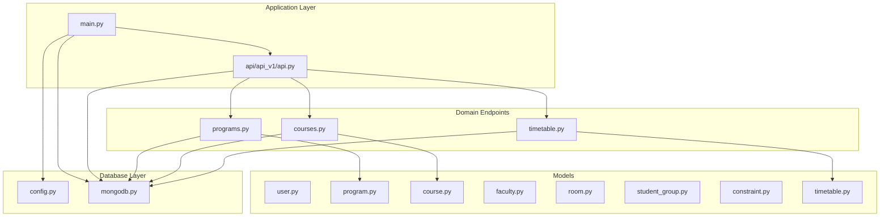
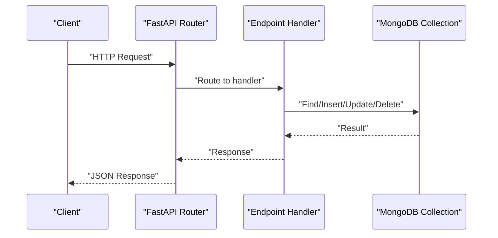
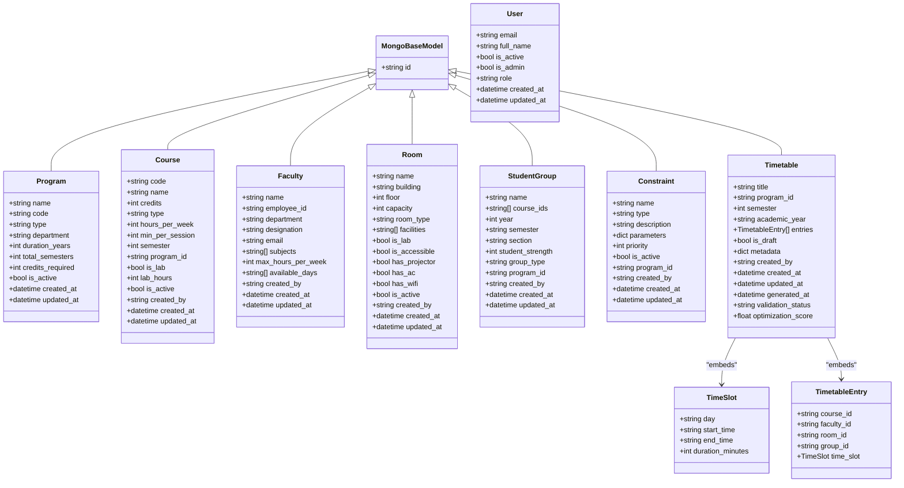
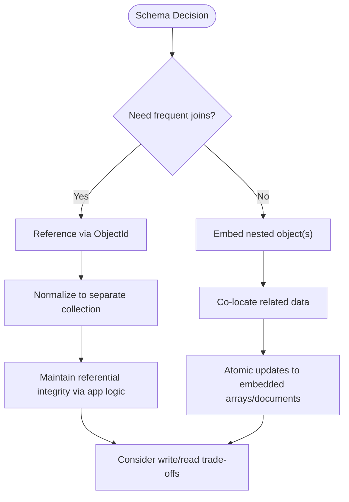
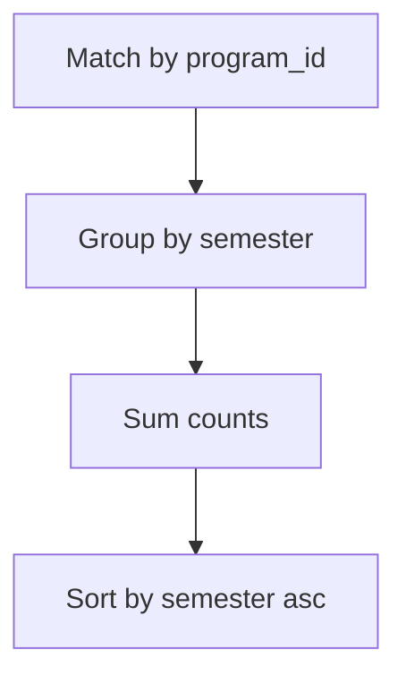
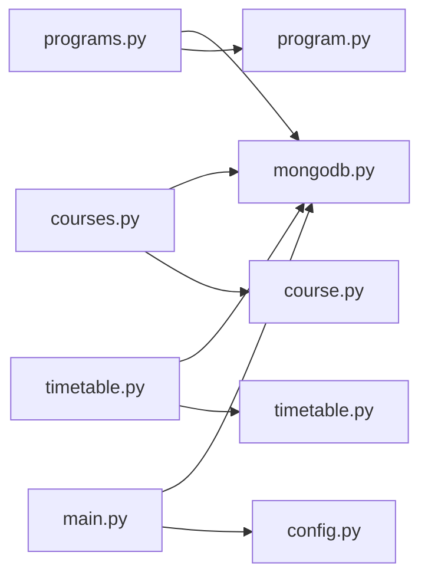

# Database Schema Design

<cite>
**Referenced Files in This Document**
- [mongodb.py](file://backend/app/db/mongodb.py)
- [config.py](file://backend/app/core/config.py)
- [main.py](file://backend/app/main.py)
- [api.py](file://backend/app/api/api_v1/api.py)
- [courses.py](file://backend/app/api/v1/endpoints/courses.py)
- [programs.py](file://backend/app/api/v1/endpoints/programs.py)
- [timetable.py](file://backend/app/api/v1/endpoints/timetable.py)
- [course.py](file://backend/app/models/course.py)
- [faculty.py](file://backend/app/models/faculty.py)
- [room.py](file://backend/app/models/room.py)
- [timetable.py](file://backend/app/models/timetable.py)
- [student_group.py](file://backend/app/models/student_group.py)
- [constraint.py](file://backend/app/models/constraint.py)
- [program.py](file://backend/app/models/program.py)
- [user.py](file://backend/app/models/user.py)
</cite>

## Table of Contents
1. [Introduction](#introduction)
2. [Project Structure](#project-structure)
3. [Core Components](#core-components)
4. [Architecture Overview](#architecture-overview)
5. [Detailed Component Analysis](#detailed-component-analysis)
6. [Dependency Analysis](#dependency-analysis)
7. [Performance Considerations](#performance-considerations)
8. [Troubleshooting Guide](#troubleshooting-guide)
9. [Conclusion](#conclusion)
10. [Appendices](#appendices)

## Introduction
This document describes the MongoDB schema design patterns used in ShedMaster. It focuses on how documents are modeled, how collections are organized, and how relationships between entities are handled. It also covers embedding versus referencing decisions, denormalization strategies, indexing and search capabilities, validation and integrity constraints, aggregation patterns, query and projection optimization, cursor management, schema evolution, backward compatibility, migrations, and scalability considerations.

## Project Structure
ShedMaster uses a layered architecture:
- Application entrypoint initializes FastAPI and connects to MongoDB.
- API routers define endpoints grouped by domain (programs, courses, faculty, rooms, student groups, constraints, timetable).
- Pydantic models define schemas for data validation and serialization.
- Database connectivity is handled via Motor (async MongoDB driver).

**Diagram sources**
- [main.py:1-102](file://backend/app/main.py#L1-L102)
- [api.py:1-34](file://backend/app/api/api_v1/api.py#L1-L34)
- [programs.py:1-288](file://backend/app/api/v1/endpoints/programs.py#L1-L288)
- [courses.py:1-279](file://backend/app/api/v1/endpoints/courses.py#L1-L279)
- [timetable.py:1-728](file://backend/app/api/v1/endpoints/timetable.py#L1-L728)
- [config.py:1-61](file://backend/app/core/config.py#L1-L61)
- [mongodb.py:1-41](file://backend/app/db/mongodb.py#L1-L41)
- [user.py:1-76](file://backend/app/models/user.py#L1-L76)
- [program.py:1-33](file://backend/app/models/program.py#L1-L33)
- [course.py:1-43](file://backend/app/models/course.py#L1-L43)
- [faculty.py:1-39](file://backend/app/models/faculty.py#L1-L39)
- [room.py:1-43](file://backend/app/models/room.py#L1-L43)
- [student_group.py:1-36](file://backend/app/models/student_group.py#L1-L36)
- [constraint.py:1-30](file://backend/app/models/constraint.py#L1-L30)
- [timetable.py:1-52](file://backend/app/models/timetable.py#L1-L52)

**Section sources**
- [main.py:1-102](file://backend/app/main.py#L1-L102)
- [api.py:1-34](file://backend/app/api/api_v1/api.py#L1-L34)
- [config.py:1-61](file://backend/app/core/config.py#L1-L61)
- [mongodb.py:1-41](file://backend/app/db/mongodb.py#L1-L41)

## Core Components
- Database connectivity and lifecycle management are centralized in a single module, ensuring a single client instance and controlled connection lifecycle.
- Pydantic models define typed schemas with validation rules and BSON/ObjectId handling for MongoDB interoperability.
- API endpoints operate against collections named after domain entities (e.g., programs, courses, timetables), with explicit ObjectId conversions for JSON responses.

Key observations:
- Collections: programs, courses, faculty, rooms, student_groups, constraints, timetables, timetable_templates.
- Relationship strategy: explicit references via ObjectId fields (e.g., program_id, created_by) with occasional embedded structures for small, cohesive data (e.g., TimeSlot and TimetableEntry within Timetable).
- Validation: Pydantic models enforce field types, constraints, and defaults; endpoints add additional checks (e.g., uniqueness, existence).

**Section sources**
- [mongodb.py:1-41](file://backend/app/db/mongodb.py#L1-L41)
- [user.py:1-76](file://backend/app/models/user.py#L1-L76)
- [program.py:1-33](file://backend/app/models/program.py#L1-L33)
- [course.py:1-43](file://backend/app/models/course.py#L1-L43)
- [faculty.py:1-39](file://backend/app/models/faculty.py#L1-L39)
- [room.py:1-43](file://backend/app/models/room.py#L1-L43)
- [student_group.py:1-36](file://backend/app/models/student_group.py#L1-L36)
- [constraint.py:1-30](file://backend/app/models/constraint.py#L1-L30)
- [timetable.py:1-52](file://backend/app/models/timetable.py#L1-L52)
- [programs.py:1-288](file://backend/app/api/v1/endpoints/programs.py#L1-L288)
- [courses.py:1-279](file://backend/app/api/v1/endpoints/courses.py#L1-L279)
- [timetable.py:1-728](file://backend/app/api/v1/endpoints/timetable.py#L1-L728)

## Architecture Overview
The system uses a RESTful API with asynchronous MongoDB operations. Endpoints query and mutate collections directly, applying user isolation and basic referential checks. Aggregation is used for lightweight analytics (e.g., course counts by semester).

**Diagram sources**
- [main.py:1-102](file://backend/app/main.py#L1-L102)
- [api.py:1-34](file://backend/app/api/api_v1/api.py#L1-L34)
- [programs.py:1-288](file://backend/app/api/v1/endpoints/programs.py#L1-L288)
- [courses.py:1-279](file://backend/app/api/v1/endpoints/courses.py#L1-L279)
- [timetable.py:1-728](file://backend/app/api/v1/endpoints/timetable.py#L1-L728)

## Detailed Component Analysis

### Document Modeling Approach
- Typed schemas with Pydantic ensure strong validation and serialization. MongoBaseModel standardizes ObjectId handling and aliasing for id.
- Embedded structures:
  - TimeSlot and TimetableEntry are embedded within Timetable to keep related scheduling data together.
- Referenced relationships:
  - course.program_id, timetable.program_id, timetable.created_by, timetable.entries.* foreign keys to courses, programs, users.
  - Program and Course models include created_by for ownership and audit.

**Diagram sources**
- [user.py:1-76](file://backend/app/models/user.py#L1-L76)
- [program.py:1-33](file://backend/app/models/program.py#L1-L33)
- [course.py:1-43](file://backend/app/models/course.py#L1-L43)
- [faculty.py:1-39](file://backend/app/models/faculty.py#L1-L39)
- [room.py:1-43](file://backend/app/models/room.py#L1-L43)
- [student_group.py:1-36](file://backend/app/models/student_group.py#L1-L36)
- [constraint.py:1-30](file://backend/app/models/constraint.py#L1-L30)
- [timetable.py:1-52](file://backend/app/models/timetable.py#L1-L52)

**Section sources**
- [user.py:1-76](file://backend/app/models/user.py#L1-L76)
- [program.py:1-33](file://backend/app/models/program.py#L1-L33)
- [course.py:1-43](file://backend/app/models/course.py#L1-L43)
- [faculty.py:1-39](file://backend/app/models/faculty.py#L1-L39)
- [room.py:1-43](file://backend/app/models/room.py#L1-L43)
- [student_group.py:1-36](file://backend/app/models/student_group.py#L1-L36)
- [constraint.py:1-30](file://backend/app/models/constraint.py#L1-L30)
- [timetable.py:1-52](file://backend/app/models/timetable.py#L1-L52)

### Collection Organization and Relationship Strategies
- Collections mirror domain entities: programs, courses, faculty, rooms, student_groups, constraints, timetables, timetable_templates.
- Embedding vs referencing:
  - Embedding: TimeSlot and TimetableEntry inside Timetable keeps scheduling data co-located, reducing joins and enabling atomic updates to entries.
  - Referencing: course.program_id, timetable.program_id, timetable.created_by, timetable.entries.* reference external entities. This supports normalization and avoids duplication.
- Ownership and isolation:
  - Endpoints consistently filter by created_by to ensure user isolation and prevent cross-user access.
- Denormalization:
  - Timetable stores program_id and metadata for quick retrieval without joins.
  - Course includes program_id and derived attributes (hours_per_week, min_per_session) to simplify queries.

**Diagram sources**
- [timetable.py:1-52](file://backend/app/models/timetable.py#L1-L52)
- [courses.py:1-279](file://backend/app/api/v1/endpoints/courses.py#L1-L279)
- [programs.py:1-288](file://backend/app/api/v1/endpoints/programs.py#L1-L288)
- [timetable.py:1-728](file://backend/app/api/v1/endpoints/timetable.py#L1-L728)

**Section sources**
- [timetable.py:1-52](file://backend/app/models/timetable.py#L1-L52)
- [courses.py:1-279](file://backend/app/api/v1/endpoints/courses.py#L1-L279)
- [programs.py:1-288](file://backend/app/api/v1/endpoints/programs.py#L1-L288)
- [timetable.py:1-728](file://backend/app/api/v1/endpoints/timetable.py#L1-L728)

### Indexing Strategies
Current code does not explicitly create indexes. Recommended indexes based on observed queries and relationships:
- Unique indexes:
  - courses.code (ensure uniqueness)
  - programs.code (ensure uniqueness)
  - faculty.employee_id (ensure uniqueness)
  - rooms.name+building (unique room identifier)
- Single-field indexes for filters:
  - courses.program_id, courses.semester
  - timetables.program_id, timetables.semester, timetables.academic_year, timetables.is_draft, timetables.created_by
  - student_groups.program_id, student_groups.year, student_groups.semester
  - constraints.program_id, constraints.is_active
- Compound indexes:
  - timetables.created_by+timetables.program_id
  - courses.program_id+courses.semester
  - timetables.program_id+timetables.semester+timetables.academic_year
- Text search:
  - Add text indexes on fields like course.name, program.name, faculty.name for free-text search.

Note: These are recommendations derived from usage patterns; actual creation is not present in the current codebase.

**Section sources**
- [courses.py:1-279](file://backend/app/api/v1/endpoints/courses.py#L1-L279)
- [programs.py:1-288](file://backend/app/api/v1/endpoints/programs.py#L1-L288)
- [timetable.py:1-728](file://backend/app/api/v1/endpoints/timetable.py#L1-L728)

### Aggregation Pipeline Patterns
- Lightweight analytics:
  - programs/{program_id}/statistics uses aggregation to group course counts by semester.
- Typical aggregation pattern:
  - Match by program_id
  - Group by semester
  - Sort ascending

**Diagram sources**
- [programs.py:269-274](file://backend/app/api/v1/endpoints/programs.py#L269-L274)

**Section sources**
- [programs.py:250-287](file://backend/app/api/v1/endpoints/programs.py#L250-L287)

### Efficient Query Patterns, Projection, and Cursor Management
- Queries:
  - courses: filter by program_id and/or semester; return all when no filters provided.
  - programs: paginated with skip/limit; optional filters by type and department.
  - timetables: user-isolation enforced via created_by; optional filters by program_id, semester, academic_year, is_draft.
- Projections:
  - Prefer returning only required fields for listing endpoints to reduce payload size.
- Cursor management:
  - Use skip/limit for pagination; avoid deep pagination for large offsets.
- ObjectId handling:
  - Convert ObjectId to string for JSON responses; ensure ObjectId parsing/validation in endpoints.

**Section sources**
- [courses.py:12-56](file://backend/app/api/v1/endpoints/courses.py#L12-L56)
- [programs.py:12-63](file://backend/app/api/v1/endpoints/programs.py#L12-L63)
- [timetable.py:17-71](file://backend/app/api/v1/endpoints/timetable.py#L17-L71)

### Data Integrity and Referential Integrity
- Uniqueness:
  - courses.code uniqueness enforced in endpoint logic.
  - programs.code uniqueness enforced in endpoint logic.
- Existence checks:
  - programs/{program_id}/courses validates program existence before querying courses.
  - timetable generation validates program existence.
- Ownership:
  - All CRUD operations on timetables filter by created_by to prevent unauthorized access.
- Audit fields:
  - created_by, created_at, updated_at present on most entities for auditability.

**Section sources**
- [courses.py:67-74](file://backend/app/api/v1/endpoints/courses.py#L67-L74)
- [programs.py:116-120](file://backend/app/api/v1/endpoints/programs.py#L116-L120)
- [programs.py:210-214](file://backend/app/api/v1/endpoints/programs.py#L210-L214)
- [timetable.py:245-248](file://backend/app/api/v1/endpoints/timetable.py#L245-L248)
- [timetable.py:83-91](file://backend/app/api/v1/endpoints/timetable.py#L83-L91)

### Schema Validation Rules
- Pydantic validation:
  - Ranges: credits, hours_per_week, min_per_session, semester, capacity, floor.
  - Enums: type fields constrained by allowed values in models.
  - Required fields: Many fields are required; optional ones explicitly marked.
- Endpoint-level validation:
  - ObjectId parsing and error handling.
  - Uniqueness checks before insert/update.
  - Existence checks before dependent operations.

**Section sources**
- [course.py:6-19](file://backend/app/models/course.py#L6-L19)
- [room.py:6-19](file://backend/app/models/room.py#L6-L19)
- [student_group.py:5-13](file://backend/app/models/student_group.py#L5-L13)
- [constraint.py:6-12](file://backend/app/models/constraint.py#L6-L12)
- [courses.py:67-74](file://backend/app/api/v1/endpoints/courses.py#L67-L74)
- [programs.py:116-120](file://backend/app/api/v1/endpoints/programs.py#L116-L120)

### Schema Evolution, Backward Compatibility, and Migration
- Current state:
  - Endpoints handle missing fields gracefully (e.g., setting defaults for older documents).
- Recommended approach:
  - Version fields in documents to track schema versions.
  - Migration scripts to update documents when schema evolves.
  - Backward-compatible reads: tolerate missing optional fields and populate defaults.
  - Controlled rollout of new fields with default values.

[No sources needed since this section provides general guidance]

### Data Partitioning, Sharding, and Scalability Planning
- Current state:
  - Single database and collections; no explicit sharding configuration.
- Recommendations:
  - Shard key selection aligned with query patterns (e.g., program_id, created_by).
  - Horizontal scaling via replica sets for availability and reads.
  - Consider collection-level partitioning for large timetables or logs.

[No sources needed since this section provides general guidance]

## Dependency Analysis
The API layer depends on models and the database layer. Endpoints depend on the shared database client and perform user isolation and referential checks.

**Diagram sources**
- [programs.py:1-288](file://backend/app/api/v1/endpoints/programs.py#L1-L288)
- [courses.py:1-279](file://backend/app/api/v1/endpoints/courses.py#L1-L279)
- [timetable.py:1-728](file://backend/app/api/v1/endpoints/timetable.py#L1-L728)
- [mongodb.py:1-41](file://backend/app/db/mongodb.py#L1-L41)
- [main.py:1-102](file://backend/app/main.py#L1-L102)
- [config.py:1-61](file://backend/app/core/config.py#L1-L61)

**Section sources**
- [programs.py:1-288](file://backend/app/api/v1/endpoints/programs.py#L1-L288)
- [courses.py:1-279](file://backend/app/api/v1/endpoints/courses.py#L1-L279)
- [timetable.py:1-728](file://backend/app/api/v1/endpoints/timetable.py#L1-L728)
- [mongodb.py:1-41](file://backend/app/db/mongodb.py#L1-L41)
- [main.py:1-102](file://backend/app/main.py#L1-L102)
- [config.py:1-61](file://backend/app/core/config.py#L1-L61)

## Performance Considerations
- Embedding reduces join overhead but can increase document size; monitor average document sizes and consider splitting if entries grow large.
- Use indexes on frequently filtered fields (program_id, semester, academic_year, created_by).
- Prefer projections to limit returned fields for listing endpoints.
- Use skip/limit for pagination; avoid very large skips.
- Batch operations where feasible (e.g., bulk inserts for templates or constraints).

[No sources needed since this section provides general guidance]

## Troubleshooting Guide
- Connection issues:
  - The database connection is attempted during startup; failures are logged and the app continues without DB for testing.
- ObjectId errors:
  - Endpoints validate ObjectId format and return 400/404 accordingly.
- Uniqueness violations:
  - Endpoints check uniqueness for course code and program code before insert/update.
- Referential integrity:
  - Deletions guard against orphaned references (e.g., preventing program deletion if associated timetables exist).

**Section sources**
- [mongodb.py:11-32](file://backend/app/db/mongodb.py#L11-L32)
- [courses.py:67-74](file://backend/app/api/v1/endpoints/courses.py#L67-L74)
- [programs.py:116-120](file://backend/app/api/v1/endpoints/programs.py#L116-L120)
- [programs.py:189-195](file://backend/app/api/v1/endpoints/programs.py#L189-L195)

## Conclusion
ShedMaster employs a pragmatic MongoDB schema with:
- Clear separation of concerns via Pydantic models and endpoints.
- Embedding for co-location of closely related scheduling data and referencing for normalized entities.
- Strong validation at the model and endpoint level, complemented by ownership checks and referential safeguards.
- Opportunities for performance improvements through targeted indexing and pagination strategies.
- Room for future enhancements in aggregation, sharding, and schema evolution practices.

[No sources needed since this section summarizes without analyzing specific files]

## Appendices

### Appendix A: Collections and Representative Fields
- programs: code, name, type, department, duration_years, total_semesters, credits_required, is_active
- courses: code, name, credits, type, hours_per_week, min_per_session, semester, program_id, is_lab, lab_hours, is_active
- faculty: employee_id, name, department, designation, email, subjects, max_hours_per_week, available_days
- rooms: name, building, floor, capacity, room_type, facilities, is_lab, is_accessible, has_projector, has_ac, has_wifi, is_active
- student_groups: name, course_ids, year, semester, section, student_strength, group_type, program_id
- constraints: name, type, description, parameters, priority, is_active, program_id
- timetables: title, program_id, semester, academic_year, entries (embedded), is_draft, metadata, created_by, validation_status, optimization_score
- timetable_templates: template-specific fields (referenced by template service)

[No sources needed since this section lists fields conceptually]