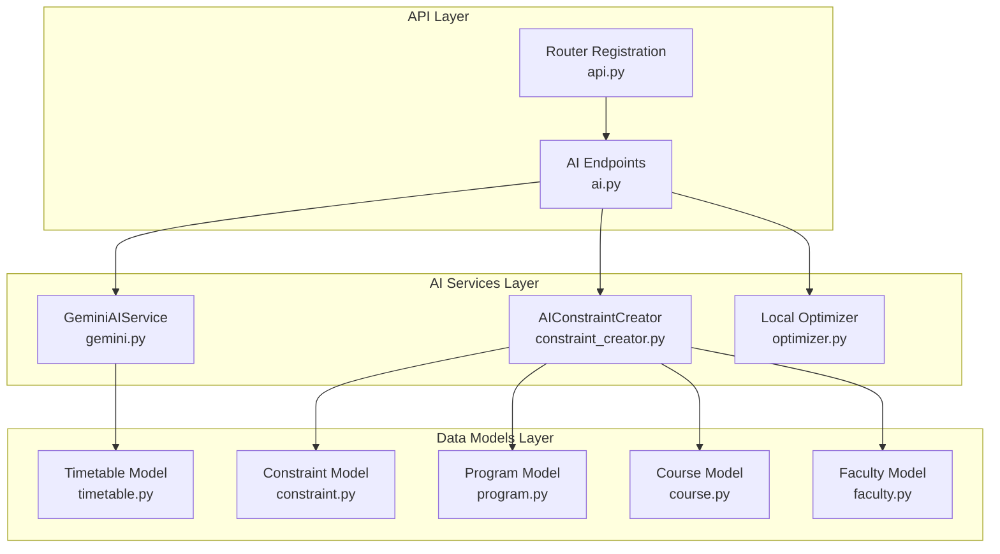
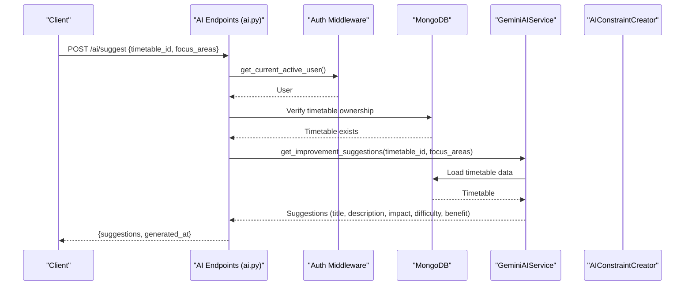
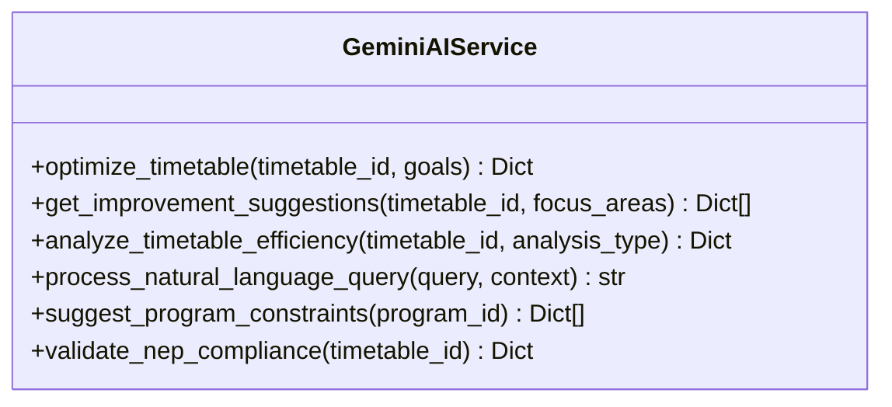
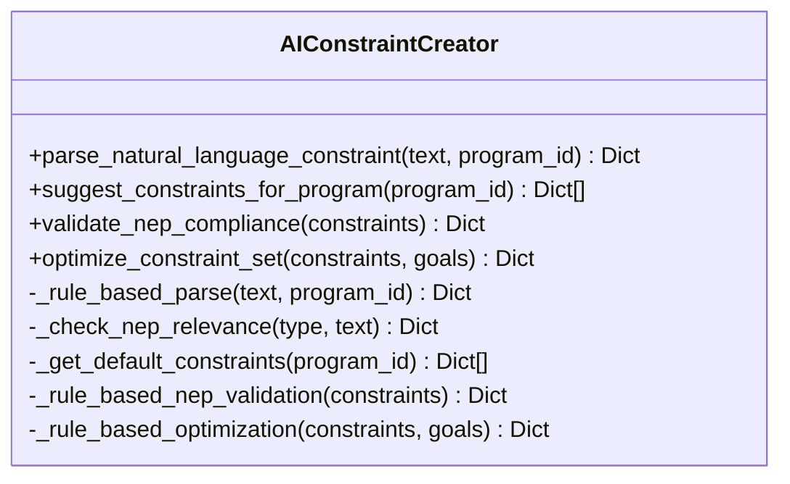
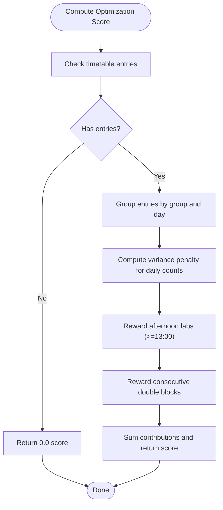
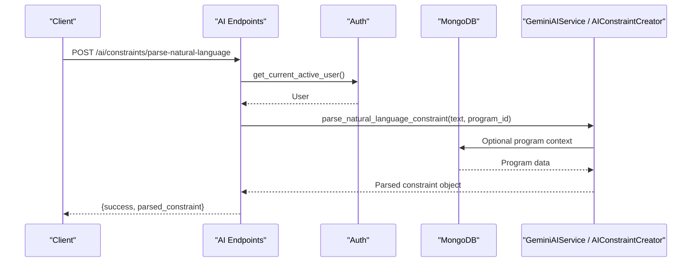
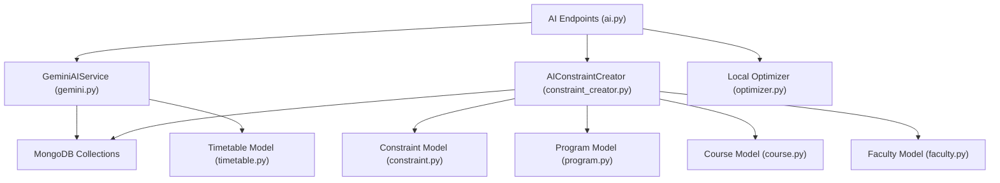

# AI Suggestion Engine

<cite>
**Referenced Files in This Document**
- [gemini.py](file://backend/app/services/ai/gemini.py)
- [constraint_creator.py](file://backend/app/services/ai/constraint_creator.py)
- [optimizer.py](file://backend/app/services/ai/optimizer.py)
- [ai.py](file://backend/app/api/v1/endpoints/ai.py)
- [timetable.py](file://backend/app/models/timetable.py)
- [constraint.py](file://backend/app/models/constraint.py)
- [program.py](file://backend/app/models/program.py)
- [course.py](file://backend/app/models/course.py)
- [faculty.py](file://backend/app/models/faculty.py)
- [api.py](file://backend/app/api/api_v1/api.py)
</cite>

## Table of Contents
1. [Introduction](#introduction)
2. [Project Structure](#project-structure)
3. [Core Components](#core-components)
4. [Architecture Overview](#architecture-overview)
5. [Detailed Component Analysis](#detailed-component-analysis)
6. [Dependency Analysis](#dependency-analysis)
7. [Performance Considerations](#performance-considerations)
8. [Troubleshooting Guide](#troubleshooting-guide)
9. [Conclusion](#conclusion)
10. [Appendices](#appendices)

## Introduction
This document describes the AI suggestion engine that powers actionable recommendations for timetable improvement. It covers the suggestion categorization system (faculty workload optimization, room utilization efficiency, student schedule gap reduction, NEP 2020 compliance), the suggestion prioritization framework, conflict resolution strategies, the suggestion generation workflow, and the integration of user feedback and continuous improvement. The engine leverages a Gemini-based AI service for natural language understanding and structured suggestion synthesis, while also providing lightweight local scoring for quick optimization insights.

## Project Structure
The AI suggestion engine spans three layers:
- API Layer: Exposes endpoints for optimization, suggestions, analysis, NEP validation, constraint parsing, and chat assistance.
- AI Services Layer: Implements Gemini-based AI services and an AI-powered constraint creator with NEP 2020 compliance rules and optimization logic.
- Data Models Layer: Defines timetable entries, constraints, and related entities used across the system.

**Diagram sources**
- [ai.py:1-362](file://backend/app/api/v1/endpoints/ai.py#L1-L362)
- [api.py:1-34](file://backend/app/api/api_v1/api.py#L1-L34)
- [gemini.py:1-288](file://backend/app/services/ai/gemini.py#L1-L288)
- [constraint_creator.py:1-781](file://backend/app/services/ai/constraint_creator.py#L1-L781)
- [optimizer.py:1-59](file://backend/app/services/ai/optimizer.py#L1-L59)
- [timetable.py:1-52](file://backend/app/models/timetable.py#L1-L52)
- [constraint.py:1-30](file://backend/app/models/constraint.py#L1-L30)
- [program.py:1-33](file://backend/app/models/program.py#L1-L33)
- [course.py:1-43](file://backend/app/models/course.py#L1-L43)
- [faculty.py:1-39](file://backend/app/models/faculty.py#L1-L39)

**Section sources**
- [ai.py:1-362](file://backend/app/api/v1/endpoints/ai.py#L1-L362)
- [api.py:1-34](file://backend/app/api/api_v1/api.py#L1-L34)

## Core Components
- GeminiAIService: Provides AI-driven optimization, suggestions, efficiency analysis, NEP 2020 validation, and natural language query processing.
- AIConstraintCreator: Parses natural language constraints into structured objects, suggests program-specific constraints, validates NEP 2020 compliance, and optimizes constraint sets.
- Local Optimizer: Computes a lightweight optimization score for timetable entries focusing on balanced daily load, afternoon labs, and consecutive double blocks.
- API Endpoints: Securely expose AI services behind user authentication and authorization checks.

Key capabilities:
- Suggestion categorization aligned with faculty workload, room utilization, student gaps, and NEP 2020 compliance.
- Prioritization via impact level, implementation difficulty, and expected benefit.
- Conflict resolution suggestions for scheduling conflicts and resource bottlenecks.
- Workflow: focus area specification → context analysis → recommendation synthesis.
- Examples of suggestion formats, impact assessments, and implementation guidance are defined in prompts and returned structures.
- Tracking and continuous improvement are supported by storing AI-generated metadata and enabling iterative refinement.

**Section sources**
- [gemini.py:1-288](file://backend/app/services/ai/gemini.py#L1-L288)
- [constraint_creator.py:1-781](file://backend/app/services/ai/constraint_creator.py#L1-L781)
- [optimizer.py:1-59](file://backend/app/services/ai/optimizer.py#L1-L59)
- [ai.py:1-362](file://backend/app/api/v1/endpoints/ai.py#L1-L362)

## Architecture Overview
The AI suggestion engine integrates FastAPI endpoints with AI services and MongoDB-backed data models. Security is enforced by verifying ownership of timetables and programs before invoking AI services.

**Diagram sources**
- [ai.py:75-106](file://backend/app/api/v1/endpoints/ai.py#L75-L106)
- [gemini.py:62-112](file://backend/app/services/ai/gemini.py#L62-L112)

**Section sources**
- [ai.py:75-106](file://backend/app/api/v1/endpoints/ai.py#L75-L106)
- [gemini.py:62-112](file://backend/app/services/ai/gemini.py#L62-L112)

## Detailed Component Analysis

### GeminiAIService
Responsibilities:
- Optimize timetables with configurable goals.
- Generate improvement suggestions across four categories: faculty workload, room utilization, student gaps, NEP 2020 compliance, and conflict resolution.
- Analyze timetable efficiency comprehensively.
- Validate NEP 2020 compliance and provide recommendations.
- Process natural language queries with contextual awareness.

Suggestion generation workflow:
- Accepts timetable_id and focus_areas.
- Loads timetable data from MongoDB.
- Builds a structured prompt instructing the model to produce actionable suggestions with standardized fields (title, description, impact_level, implementation_difficulty, expected_benefit).
- Returns a list of suggestion objects.

Prioritization framework:
- impact_level: high/medium/low.
- implementation_difficulty: easy/medium/hard.
- expected_benefit: qualitative assessment aligned with category goals.

Conflict resolution suggestions:
- Prompt explicitly requests conflict resolution recommendations.
- Typical resolutions include adjusting time slots, balancing faculty loads, ensuring room availability, and minimizing gaps.

NEP 2020 compliance:
- Dedicated validation endpoint returns a compliance score, detailed findings, and recommendations.
- Prompts enumerate NEP domains (credit system, multidisciplinary learning, assessment, skill development, research, faculty workload).

**Diagram sources**
- [gemini.py:9-288](file://backend/app/services/ai/gemini.py#L9-L288)

**Section sources**
- [gemini.py:18-153](file://backend/app/services/ai/gemini.py#L18-L153)
- [gemini.py:155-183](file://backend/app/services/ai/gemini.py#L155-L183)
- [gemini.py:184-239](file://backend/app/services/ai/gemini.py#L184-L239)
- [gemini.py:241-288](file://backend/app/services/ai/gemini.py#L241-L288)

### AIConstraintCreator
Responsibilities:
- Parse natural language constraints into structured objects with type, parameters, priority, and NEP relevance.
- Suggest program-specific constraints considering NEP 2020 guidelines.
- Validate constraint sets against NEP 2020 and provide compliance reports.
- Optimize constraint sets by removing redundancy, adjusting priorities, and adding missing constraints.

NEP 2020 compliance rules:
- Credit system (CBCS, flexibility).
- Multidisciplinary integration.
- Assessment and continuous evaluation.
- Skill development and practical hours.
- Research and innovation.
- Faculty workload limits.

Constraint parsing:
- Uses AI when available; falls back to rule-based parsing if API key is missing.
- Patterns detect faculty availability, workload limits, room capacity/type, time preferences, consecutive classes, gap minimization, block scheduling, and NEP compliance mentions.

Optimization:
- Identifies duplicates and removes lower-priority instances.
- Adds missing NEP constraints when requested.
- Estimates improvements (conflict reduction, NEP compliance increase, schedule quality).

**Diagram sources**
- [constraint_creator.py:18-781](file://backend/app/services/ai/constraint_creator.py#L18-L781)

**Section sources**
- [constraint_creator.py:179-282](file://backend/app/services/ai/constraint_creator.py#L179-L282)
- [constraint_creator.py:405-499](file://backend/app/services/ai/constraint_creator.py#L405-L499)
- [constraint_creator.py:536-598](file://backend/app/services/ai/constraint_creator.py#L536-L598)
- [constraint_creator.py:659-721](file://backend/app/services/ai/constraint_creator.py#L659-L721)

### Local Optimizer
Lightweight scoring focuses on:
- Balanced daily load across groups.
- Afternoon lab sessions.
- Consecutive double blocks for the same course.

Scoring mechanism:
- Aggregates entries by group and day.
- Computes variance penalty for imbalanced daily counts.
- Rewards labs after 13:00 and consecutive identical courses.

**Diagram sources**
- [optimizer.py:6-59](file://backend/app/services/ai/optimizer.py#L6-L59)

**Section sources**
- [optimizer.py:6-59](file://backend/app/services/ai/optimizer.py#L6-L59)

### API Endpoints and Security
Endpoints:
- POST /ai/optimize: AI optimization for a timetable.
- POST /ai/suggest: Improvement suggestions with focus areas.
- POST /ai/analysis: Efficiency analysis.
- POST /ai/query: Natural language query processing.
- GET /ai/constraints/suggest/{program_id}: AI-suggested constraints for a program.
- POST /ai/validate-schedule: NEP 2020 compliance validation.
- POST /ai/constraints/parse-natural-language: Parse NL constraints.
- POST /ai/constraints/optimize-set: Optimize constraint sets.
- POST /ai/constraints/check-nep-compliance: Validate constraints.
- POST /ai/chat: AI chat assistant.

Security:
- Ownership verification ensures users can only access their own timetables and programs.
- Authentication middleware enforces active user context.

**Diagram sources**
- [ai.py:209-228](file://backend/app/api/v1/endpoints/ai.py#L209-L228)
- [constraint_creator.py:179-282](file://backend/app/services/ai/constraint_creator.py#L179-L282)

**Section sources**
- [ai.py:46-74](file://backend/app/api/v1/endpoints/ai.py#L46-L74)
- [ai.py:75-106](file://backend/app/api/v1/endpoints/ai.py#L75-L106)
- [ai.py:108-136](file://backend/app/api/v1/endpoints/ai.py#L108-L136)
- [ai.py:137-157](file://backend/app/api/v1/endpoints/ai.py#L137-L157)
- [ai.py:159-181](file://backend/app/api/v1/endpoints/ai.py#L159-L181)
- [ai.py:183-207](file://backend/app/api/v1/endpoints/ai.py#L183-L207)
- [ai.py:209-228](file://backend/app/api/v1/endpoints/ai.py#L209-L228)
- [ai.py:230-248](file://backend/app/api/v1/endpoints/ai.py#L230-L248)
- [ai.py:250-265](file://backend/app/api/v1/endpoints/ai.py#L250-L265)
- [ai.py:267-362](file://backend/app/api/v1/endpoints/ai.py#L267-L362)

## Dependency Analysis
- API endpoints depend on AI services and MongoDB for data retrieval.
- GeminiAIService depends on configuration settings and MongoDB for timetable data.
- AIConstraintCreator depends on Gemini for AI parsing and validation, with fallbacks to rule-based logic.
- Local optimizer is independent and operates on in-memory timetable entries.

**Diagram sources**
- [ai.py:1-362](file://backend/app/api/v1/endpoints/ai.py#L1-L362)
- [gemini.py:1-288](file://backend/app/services/ai/gemini.py#L1-L288)
- [constraint_creator.py:1-781](file://backend/app/services/ai/constraint_creator.py#L1-L781)
- [optimizer.py:1-59](file://backend/app/services/ai/optimizer.py#L1-L59)
- [timetable.py:1-52](file://backend/app/models/timetable.py#L1-L52)
- [constraint.py:1-30](file://backend/app/models/constraint.py#L1-L30)
- [program.py:1-33](file://backend/app/models/program.py#L1-L33)
- [course.py:1-43](file://backend/app/models/course.py#L1-L43)
- [faculty.py:1-39](file://backend/app/models/faculty.py#L1-L39)

**Section sources**
- [ai.py:1-362](file://backend/app/api/v1/endpoints/ai.py#L1-L362)
- [gemini.py:1-288](file://backend/app/services/ai/gemini.py#L1-L288)
- [constraint_creator.py:1-781](file://backend/app/services/ai/constraint_creator.py#L1-L781)
- [optimizer.py:1-59](file://backend/app/services/ai/optimizer.py#L1-L59)

## Performance Considerations
- AI inference latency: Gemini calls introduce network latency; batch operations and caching of parsed constraints can reduce repeated processing.
- Prompt complexity: Structured prompts with JSON expectations can increase token usage; keep prompts concise while preserving intent.
- Local scoring: The optimizer runs client-side on loaded entries; ensure entries are efficiently grouped and sorted to minimize computation.
- Database queries: Fetch only required fields for suggestions and validations to reduce payload sizes.

## Troubleshooting Guide
Common issues and resolutions:
- Missing API key: AI services return configuration errors; set the Gemini API key in settings.
- Timetable not found or unauthorized access: Endpoints enforce ownership checks; verify timetable_id and user context.
- Parsing failures: Natural language parsing falls back to rule-based logic; review constraint text for clarity.
- Validation errors: Constraint optimization and NEP validation return structured errors; adjust optimization goals or constraints accordingly.

**Section sources**
- [gemini.py:20-21](file://backend/app/services/ai/gemini.py#L20-L21)
- [gemini.py:116-118](file://backend/app/services/ai/gemini.py#L116-L118)
- [ai.py:56-63](file://backend/app/api/v1/endpoints/ai.py#L56-L63)
- [ai.py:118-125](file://backend/app/api/v1/endpoints/ai.py#L118-L125)
- [constraint_creator.py:190-193](file://backend/app/services/ai/constraint_creator.py#L190-L193)
- [constraint_creator.py:546-548](file://backend/app/services/ai/constraint_creator.py#L546-L548)

## Conclusion
The AI suggestion engine provides a robust foundation for generating actionable timetable improvements across faculty workload, room utilization, student scheduling, and NEP 2020 compliance. By combining AI-driven synthesis with structured constraint management and lightweight local scoring, it enables efficient conflict resolution, prioritization, and continuous refinement. Secure ownership checks and modular services ensure scalability and maintainability.

## Appendices

### Suggestion Generation Workflow
- Focus area specification: focus_areas list passed to suggestion endpoints.
- Context analysis: AI services load timetable and related entities (courses, faculty, rooms).
- Recommendation synthesis: Structured prompts guide the model to produce suggestions with standardized fields.
- Output: Suggestions include title, description, impact level, implementation difficulty, and expected benefit.

**Section sources**
- [ai.py:75-106](file://backend/app/api/v1/endpoints/ai.py#L75-L106)
- [gemini.py:62-112](file://backend/app/services/ai/gemini.py#L62-L112)

### Suggestion Formats and Prioritization
- Fields: title, description, impact_level, implementation_difficulty, expected_benefit.
- Prioritization criteria: impact level, implementation difficulty, and expected benefit inform ranking.
- Conflict resolution: Explicitly requested in prompts; typical resolutions include adjusting time slots, balancing loads, ensuring room availability, and minimizing gaps.

**Section sources**
- [gemini.py:88-94](file://backend/app/services/ai/gemini.py#L88-L94)
- [gemini.py:252-271](file://backend/app/services/ai/gemini.py#L252-L271)

### NEP 2020 Compliance Improvements
- Validation: Dedicated endpoint returns compliance score, detailed findings, and recommendations.
- Areas: Credit system, multidisciplinary learning, assessment, skill development, research, and faculty workload.
- Suggestions: AI proposes improvements aligned with NEP domains.

**Section sources**
- [gemini.py:241-288](file://backend/app/services/ai/gemini.py#L241-L288)
- [constraint_creator.py:28-90](file://backend/app/services/ai/constraint_creator.py#L28-L90)

### Constraint Management and Optimization
- Parsing: Natural language to structured constraints with NEP relevance.
- Suggestion: Program-specific constraints considering NEP guidelines.
- Optimization: Removes duplicates, adjusts priorities, adds missing constraints, and estimates improvements.

**Section sources**
- [constraint_creator.py:179-282](file://backend/app/services/ai/constraint_creator.py#L179-L282)
- [constraint_creator.py:405-499](file://backend/app/services/ai/constraint_creator.py#L405-L499)
- [constraint_creator.py:659-721](file://backend/app/services/ai/constraint_creator.py#L659-L721)

### Data Models Used by AI Engine
- Timetable: Entries define course, faculty, room, group, and time slot.
- Constraint: Base structure for scheduling constraints with type, parameters, priority, and NEP relevance.
- Program/Course/Faculty: Context for constraint suggestions and NEP validation.

**Section sources**
- [timetable.py:6-52](file://backend/app/models/timetable.py#L6-L52)
- [constraint.py:6-30](file://backend/app/models/constraint.py#L6-L30)
- [program.py:6-33](file://backend/app/models/program.py#L6-L33)
- [course.py:6-43](file://backend/app/models/course.py#L6-L43)
- [faculty.py:5-39](file://backend/app/models/faculty.py#L5-L39)