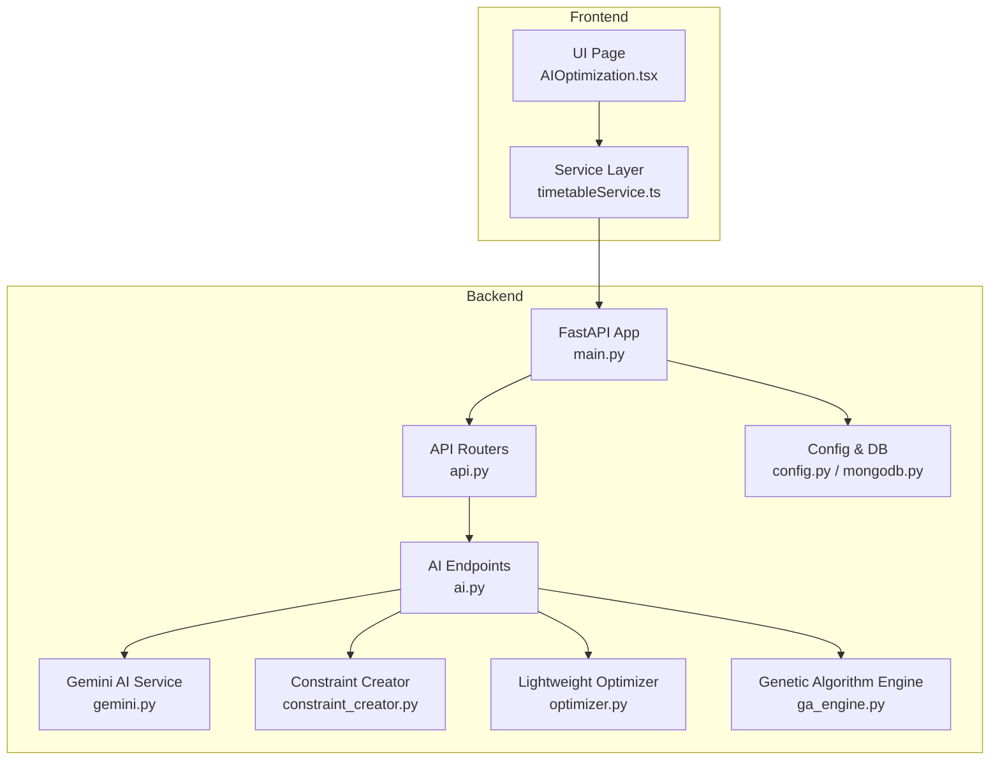
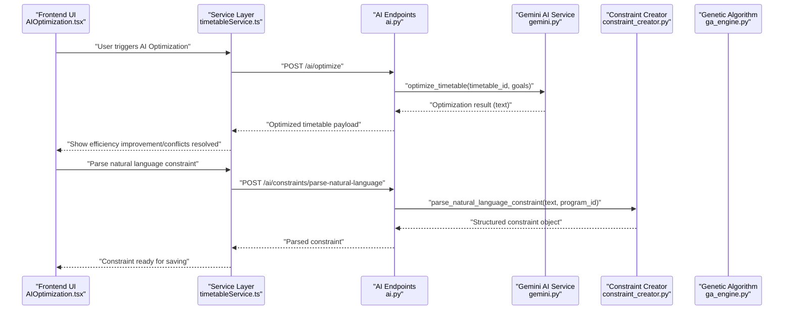
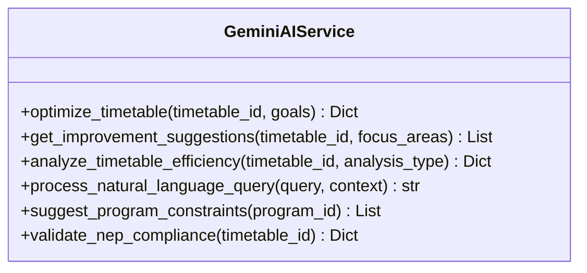
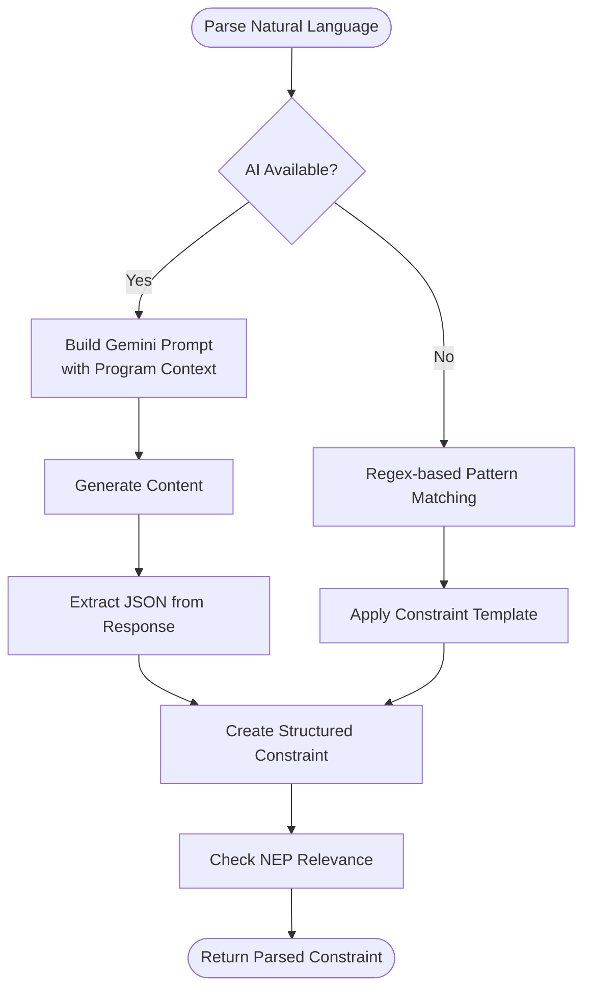
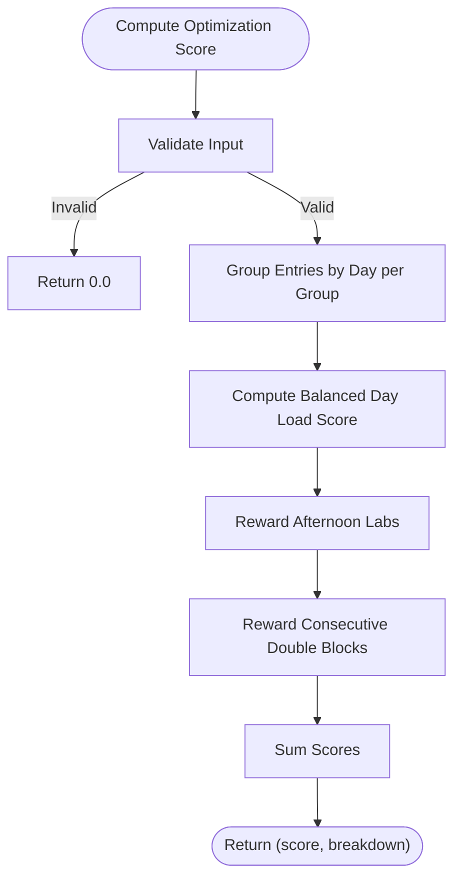
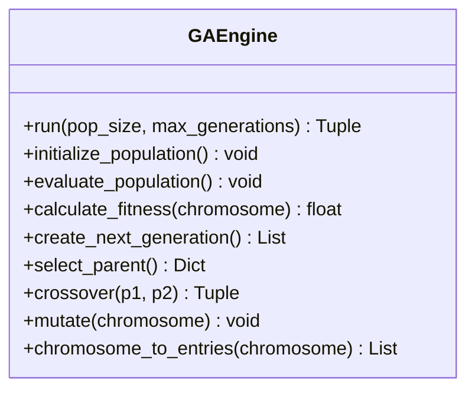
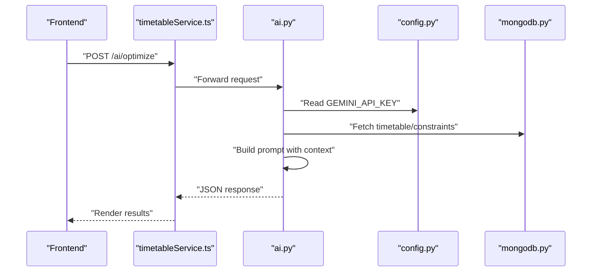
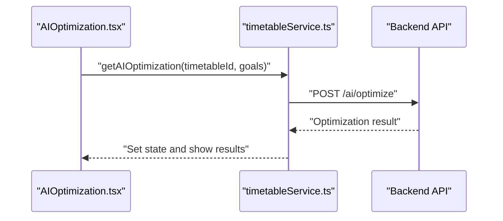
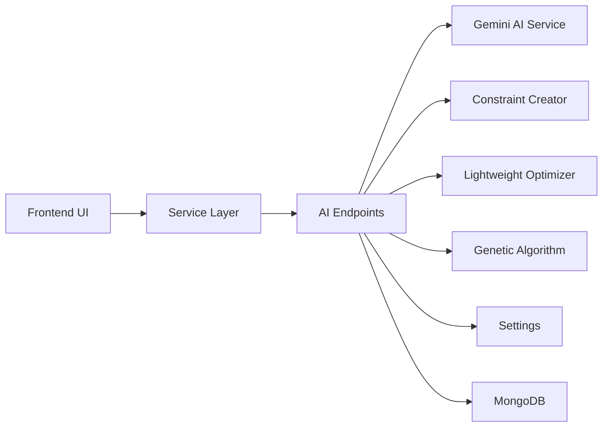

# AI-Powered Optimization

<cite>
**Referenced Files in This Document**
- [gemini.py](file://backend/app/services/ai/gemini.py)
- [constraint_creator.py](file://backend/app/services/ai/constraint_creator.py)
- [optimizer.py](file://backend/app/services/ai/optimizer.py)
- [ai.py](file://backend/app/api/v1/endpoints/ai.py)
- [ga_engine.py](file://backend/app/services/timetable/ga_engine.py)
- [config.py](file://backend/app/core/config.py)
- [mongodb.py](file://backend/app/db/mongodb.py)
- [api.py](file://backend/app/api/api_v1/api.py)
- [main.py](file://backend/app/main.py)
- [constraint.py](file://backend/app/models/constraint.py)
- [timetable.py](file://backend/app/models/timetable.py)
- [AIOptimization.tsx](file://frontend/src/components/pages/AIOptimization.tsx)
- [timetableService.ts](file://frontend/src/services/timetableService.ts)
</cite>

## Table of Contents
1. [Introduction](#introduction)
2. [Project Structure](#project-structure)
3. [Core Components](#core-components)
4. [Architecture Overview](#architecture-overview)
5. [Detailed Component Analysis](#detailed-component-analysis)
6. [Dependency Analysis](#dependency-analysis)
7. [Performance Considerations](#performance-considerations)
8. [Troubleshooting Guide](#troubleshooting-guide)
9. [Conclusion](#conclusion)
10. [Appendices](#appendices)

## Introduction
This document describes an AI-powered optimization system that integrates Google Gemini to provide intelligent timetable suggestions and constraint creation, with advanced algorithms to enhance generated timetables beyond basic constraint satisfaction. It covers:
- Natural language processing for converting academic requirements into scheduling constraints
- Optimization algorithms that refine timetables using soft constraints and evolutionary computation
- Constraint creation system that auto-generates scheduling rules from textual descriptions
- AI suggestion engine for conflict resolution and performance improvement recommendations
- API integration patterns, prompt engineering strategies, and response processing workflows
- Machine learning components, training data requirements, and continuous improvement mechanisms
- Examples of AI-assisted scheduling scenarios and optimization outcomes

## Project Structure
The system is organized into backend and frontend components:
- Backend: FastAPI application exposing AI-assisted endpoints, AI services (Gemini integration, constraint creator, lightweight optimizer), and timetable generation engines (genetic algorithm).
- Frontend: React-based UI enabling users to trigger AI optimization, receive suggestions, analyze efficiency, and validate NEP 2020 compliance.

**Diagram sources**
- [main.py:33-102](file://backend/app/main.py#L33-L102)
- [api.py:1-34](file://backend/app/api/api_v1/api.py#L1-L34)
- [ai.py:1-362](file://backend/app/api/v1/endpoints/ai.py#L1-L362)
- [gemini.py:1-288](file://backend/app/services/ai/gemini.py#L1-L288)
- [constraint_creator.py:1-781](file://backend/app/services/ai/constraint_creator.py#L1-L781)
- [optimizer.py:1-59](file://backend/app/services/ai/optimizer.py#L1-L59)
- [ga_engine.py:1-414](file://backend/app/services/timetable/ga_engine.py#L1-L414)
- [config.py:1-61](file://backend/app/core/config.py#L1-L61)
- [mongodb.py:1-41](file://backend/app/db/mongodb.py#L1-L41)
- [AIOptimization.tsx:1-1048](file://frontend/src/components/pages/AIOptimization.tsx#L1-L1048)
- [timetableService.ts:1-772](file://frontend/src/services/timetableService.ts#L1-L772)

**Section sources**
- [main.py:33-102](file://backend/app/main.py#L33-L102)
- [api.py:1-34](file://backend/app/api/api_v1/api.py#L1-L34)
- [AIOptimization.tsx:1-1048](file://frontend/src/components/pages/AIOptimization.tsx#L1-L1048)
- [timetableService.ts:1-772](file://frontend/src/services/timetableService.ts#L1-L772)

## Core Components
- Gemini AI Service: Provides optimization, suggestions, efficiency analysis, NEP 2020 validation, and natural language processing for academic scheduling queries.
- AI Constraint Creator: Parses natural language constraints into structured objects, suggests program-specific constraints, validates NEP 2020 compliance, and optimizes constraint sets.
- Lightweight Optimizer: Computes a simple score based on soft constraints (balanced daily load, afternoon labs, consecutive double blocks).
- Genetic Algorithm Engine: Evolves feasible timetables using hard constraints (no faculty/room/group conflicts), soft constraints (room capacity fit), and optimization objectives.
- API Endpoints: Expose AI features under /api/v1/ai with user ownership checks and security safeguards.
- Frontend UI: Enables users to select a timetable, configure optimization goals, and visualize results.

**Section sources**
- [gemini.py:9-288](file://backend/app/services/ai/gemini.py#L9-L288)
- [constraint_creator.py:18-781](file://backend/app/services/ai/constraint_creator.py#L18-L781)
- [optimizer.py:6-59](file://backend/app/services/ai/optimizer.py#L6-L59)
- [ga_engine.py:19-414](file://backend/app/services/timetable/ga_engine.py#L19-L414)
- [ai.py:46-362](file://backend/app/api/v1/endpoints/ai.py#L46-L362)
- [AIOptimization.tsx:129-1048](file://frontend/src/components/pages/AIOptimization.tsx#L129-L1048)

## Architecture Overview
The AI optimization pipeline combines natural language understanding, constraint management, and evolutionary computation:

**Diagram sources**
- [AIOptimization.tsx:222-381](file://frontend/src/components/pages/AIOptimization.tsx#L222-L381)
- [timetableService.ts:583-620](file://frontend/src/services/timetableService.ts#L583-L620)
- [ai.py:46-106](file://backend/app/api/v1/endpoints/ai.py#L46-L106)
- [gemini.py:18-60](file://backend/app/services/ai/gemini.py#L18-L60)
- [constraint_creator.py:179-282](file://backend/app/services/ai/constraint_creator.py#L179-L282)

## Detailed Component Analysis

### Gemini AI Service
The Gemini AI Service encapsulates AI-powered operations:
- Timetable optimization: Accepts a timetable identifier and optimization goals, returns a structured analysis and suggestions.
- Improvement suggestions: Generates actionable recommendations across focus areas (faculty workload, room utilization, student gaps, NEP 2020).
- Efficiency analysis: Produces an efficiency score and detailed metrics.
- Natural language query processing: Answers questions grounded in academic scheduling and NEP 2020 guidelines.
- Program constraint suggestions: Suggests 5–8 constraints tailored to a program’s profile.
- NEP 2020 validation: Scores compliance and provides recommendations.

**Diagram sources**
- [gemini.py:9-288](file://backend/app/services/ai/gemini.py#L9-L288)

**Section sources**
- [gemini.py:18-288](file://backend/app/services/ai/gemini.py#L18-L288)

### AI Constraint Creator
The AI Constraint Creator transforms natural language into structured constraints and manages NEP 2020 compliance:
- Natural language parsing: Uses Gemini prompts to produce JSON constraint objects with type, parameters, priority, and NEP relevance.
- Rule-based fallback: Regex patterns map common phrases to predefined constraint templates when AI is unavailable.
- Program-specific suggestions: Builds prompts incorporating program/course/faculty/room context to propose 8–12 constraints.
- NEP compliance validation: Scores overall and area-wise compliance, identifies strengths and gaps, and recommends missing constraints.
- Constraint optimization: Suggests removal/addition/priority adjustments to reduce conflicts and increase NEP alignment.

**Diagram sources**
- [constraint_creator.py:179-282](file://backend/app/services/ai/constraint_creator.py#L179-L282)
- [constraint_creator.py:283-374](file://backend/app/services/ai/constraint_creator.py#L283-L374)

**Section sources**
- [constraint_creator.py:18-781](file://backend/app/services/ai/constraint_creator.py#L18-L781)

### Lightweight Optimizer
The lightweight optimizer computes a simple score to reward desirable soft constraints:
- Balanced daily load: Penalizes variance in daily class counts per group.
- Afternoon labs: Rewards long lab sessions in the afternoon.
- Consecutive double blocks: Rewards back-to-back identical course sessions.

**Diagram sources**
- [optimizer.py:6-59](file://backend/app/services/ai/optimizer.py#L6-L59)

**Section sources**
- [optimizer.py:6-59](file://backend/app/services/ai/optimizer.py#L6-L59)

### Genetic Algorithm Engine
The GA engine evolves timetables with:
- Chromosome representation: One gene per required session with day, slot, room, and attributes.
- Hard constraints: Enforced via conflict checks (faculty, room, group).
- Soft constraints: Encourages room capacity fit.
- Optimization objective: Balances hard feasibility, soft fit, and optimization rewards.
- Evolutionary operators: Tournament selection, order crossover, and attribute mutation.
- Diversity and elitism: Preserves best individuals and introduces variation.

**Diagram sources**
- [ga_engine.py:19-414](file://backend/app/services/timetable/ga_engine.py#L19-L414)

**Section sources**
- [ga_engine.py:19-414](file://backend/app/services/timetable/ga_engine.py#L19-L414)

### API Integration Patterns and Prompt Engineering
- Endpoint design: Each AI capability is exposed via dedicated endpoints under /api/v1/ai with strict ownership checks.
- Prompt engineering: Prompts emphasize structured JSON output, explicit tasks, and NEP 2020 alignment. They include program context, timetable data, and desired output schema.
- Response processing: Responses are returned as JSON with metadata; the frontend displays structured results and metrics.

**Diagram sources**
- [ai.py:46-106](file://backend/app/api/v1/endpoints/ai.py#L46-L106)
- [config.py:34-35](file://backend/app/core/config.py#L34-L35)
- [mongodb.py:11-32](file://backend/app/db/mongodb.py#L11-L32)
- [timetableService.ts:583-589](file://frontend/src/services/timetableService.ts#L583-L589)

**Section sources**
- [ai.py:46-362](file://backend/app/api/v1/endpoints/ai.py#L46-L362)
- [config.py:34-35](file://backend/app/core/config.py#L34-L35)
- [mongodb.py:11-32](file://backend/app/db/mongodb.py#L11-L32)
- [timetableService.ts:583-620](file://frontend/src/services/timetableService.ts#L583-L620)

### Frontend Integration
- UI orchestration: The AI Optimization page allows selecting a timetable, configuring goals, and triggering operations.
- Service integration: The service layer adds auth headers, retries on 401, and calls backend endpoints for AI features.
- Result rendering: Displays efficiency improvements, conflict resolutions, suggestions, and compliance scores.

**Diagram sources**
- [AIOptimization.tsx:222-264](file://frontend/src/components/pages/AIOptimization.tsx#L222-L264)
- [timetableService.ts:583-589](file://frontend/src/services/timetableService.ts#L583-L589)

**Section sources**
- [AIOptimization.tsx:129-1048](file://frontend/src/components/pages/AIOptimization.tsx#L129-L1048)
- [timetableService.ts:583-620](file://frontend/src/services/timetableService.ts#L583-L620)

## Dependency Analysis
- External dependencies: Google Gemini SDK for AI inference; FastAPI for routing; Motor for MongoDB connectivity.
- Internal dependencies: AI endpoints depend on Gemini service and constraint creator; constraint creator depends on MongoDB for program/context data; GA engine depends on timetable models and data.

**Diagram sources**
- [ai.py:1-362](file://backend/app/api/v1/endpoints/ai.py#L1-L362)
- [gemini.py:1-288](file://backend/app/services/ai/gemini.py#L1-L288)
- [constraint_creator.py:1-781](file://backend/app/services/ai/constraint_creator.py#L1-L781)
- [optimizer.py:1-59](file://backend/app/services/ai/optimizer.py#L1-L59)
- [ga_engine.py:1-414](file://backend/app/services/timetable/ga_engine.py#L1-L414)
- [config.py:1-61](file://backend/app/core/config.py#L1-L61)
- [mongodb.py:1-41](file://backend/app/db/mongodb.py#L1-L41)

**Section sources**
- [ai.py:1-362](file://backend/app/api/v1/endpoints/ai.py#L1-L362)
- [config.py:1-61](file://backend/app/core/config.py#L1-L61)
- [mongodb.py:1-41](file://backend/app/db/mongodb.py#L1-L41)

## Performance Considerations
- AI latency: Gemini calls introduce network latency; cache or batch requests where feasible.
- Prompt size: Large timetable/context payloads increase token usage; trim non-essential fields.
- GA runtime: Population size, generations, and mutation rates affect convergence speed; tune for target timetables.
- Frontend responsiveness: Show progress indicators during AI operations; avoid blocking UI thread.

## Troubleshooting Guide
- Missing Gemini API key: AI endpoints return configuration errors; set GEMINI_API_KEY in environment.
- Ownership validation failures: AI endpoints require the timetable to belong to the current user; verify authentication and permissions.
- MongoDB connectivity: The app attempts to connect on startup; if connection fails, some features may be limited.
- Validation errors: FastAPI validation errors surface detailed request issues; review request bodies and schemas.

**Section sources**
- [ai.py:54-63](file://backend/app/api/v1/endpoints/ai.py#L54-L63)
- [ai.py:85-92](file://backend/app/api/v1/endpoints/ai.py#L85-L92)
- [ai.py:118-125](file://backend/app/api/v1/endpoints/ai.py#L118-L125)
- [config.py:34-35](file://backend/app/core/config.py#L34-L35)
- [mongodb.py:11-32](file://backend/app/db/mongodb.py#L11-L32)
- [main.py:42-54](file://backend/app/main.py#L42-L54)

## Conclusion
The AI-powered optimization system blends natural language understanding, structured constraint management, and evolutionary computation to deliver intelligent timetable solutions aligned with NEP 2020 guidelines. The modular design enables incremental enhancements, robust prompt engineering, and scalable integration patterns for future machine learning improvements.

## Appendices

### API Definitions
- Optimize Timetable
  - Method: POST
  - Path: /api/v1/ai/optimize
  - Body: { timetable_id: string, optimization_goals?: object }
  - Response: { timetable_id: string, optimization_result: string, optimized: boolean, timestamp: string }

- Get Improvement Suggestions
  - Method: POST
  - Path: /api/v1/ai/suggest
  - Body: { timetable_id: string, focus_areas?: string[] }
  - Response: { timetable_id: string, suggestions: array, generated_at: string }

- Analyze Timetable
  - Method: POST
  - Path: /api/v1/ai/analysis
  - Body: { timetable_id: string, analysis_type?: string }
  - Response: { timetable_id: string, analysis_type: string, efficiency_score: number, analysis_details: string, analyzed_at: string }

- Natural Language Query
  - Method: POST
  - Path: /api/v1/ai/query
  - Body: { query: string, context?: object }
  - Response: { query: string, response: string, processed_at: string }

- Validate Schedule Against NEP 2020
  - Method: POST
  - Path: /api/v1/ai/validate-schedule
  - Body: { timetable_id: string }
  - Response: { timetable_id: string, nep_compliance_score: number, compliance_details: string, validation_date: string, recommendations: string[] }

- Parse Natural Language Constraint
  - Method: POST
  - Path: /api/v1/ai/constraints/parse-natural-language
  - Body: { text: string, program_id?: string }
  - Response: { success: boolean, parsed_constraint: object, original_text: string }

- Optimize Constraint Set
  - Method: POST
  - Path: /api/v1/ai/constraints/optimize-set
  - Body: { constraints: object[], optimization_goals?: object }
  - Response: { success: boolean, optimization_result: object }

- Check NEP Compliance of Constraints
  - Method: POST
  - Path: /api/v1/ai/constraints/check-nep-compliance
  - Body: { constraints: object[] }
  - Response: { success: boolean, compliance_report: object }

- AI Chat Assistant
  - Method: POST
  - Path: /api/v1/ai/chat
  - Body: { message: string, conversation_history?: object[], context?: object }
  - Response: { response: string, suggestions: string[] }

**Section sources**
- [ai.py:46-362](file://backend/app/api/v1/endpoints/ai.py#L46-L362)

### Data Models
- Constraint Model
  - Fields: name, type, description, parameters, priority, is_active, program_id
  - Extended by: created_by, created_at, updated_at

- Timetable Model
  - Fields: title, program_id, semester, academic_year, entries, is_draft, metadata
  - Extended by: created_by, created_at, updated_at, generated_at, validation_status, optimization_score

**Section sources**
- [constraint.py:6-30](file://backend/app/models/constraint.py#L6-L30)
- [timetable.py:21-52](file://backend/app/models/timetable.py#L21-L52)

### Example Scenarios and Outcomes
- Scenario 1: Constraint Creation from Natural Language
  - Input: “Faculty Dr. Smith should teach at most 18 hours per week.”
  - Outcome: Structured constraint with type “faculty_workload”, parameters { max_hours_per_week: 18 }, priority 9, NEP relevance flagged.
- Scenario 2: AI-Assisted Optimization
  - Input: Existing timetable with imbalanced daily load and morning labs.
  - Outcome: Efficiency improvement score, reduced conflicts, and suggestions for afternoon labs and balanced scheduling.
- Scenario 3: NEP 2020 Compliance Check
  - Input: Constraint set for a multidisciplinary program.
  - Outcome: Overall compliance score, area-wise scores, recommendations to add CBCS and practical hour constraints.

[No sources needed since this section provides scenario-based examples without analyzing specific files]