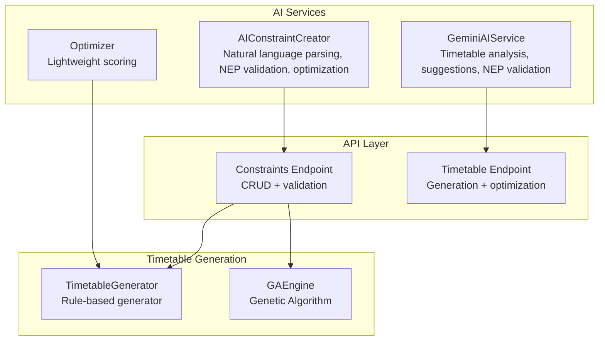
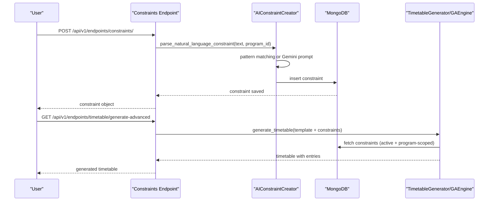
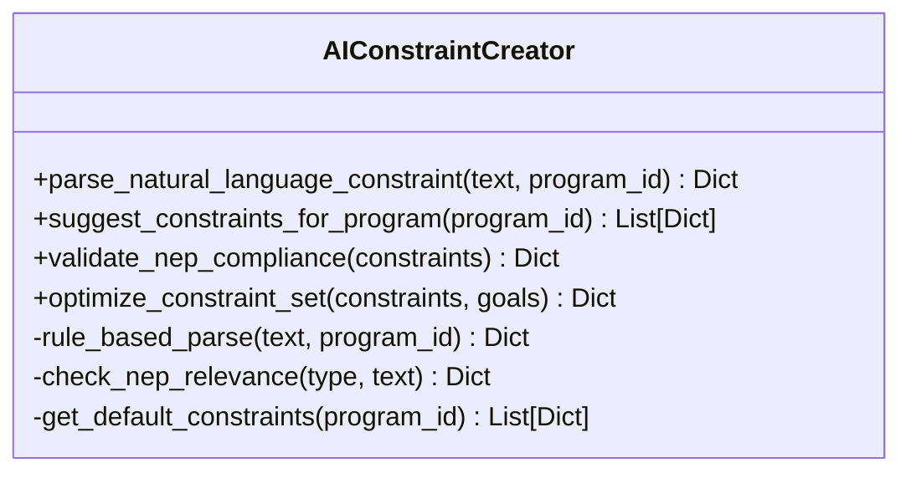
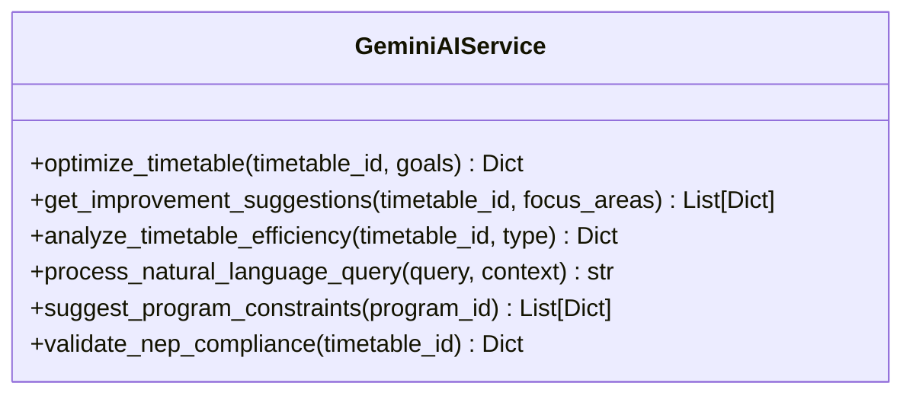
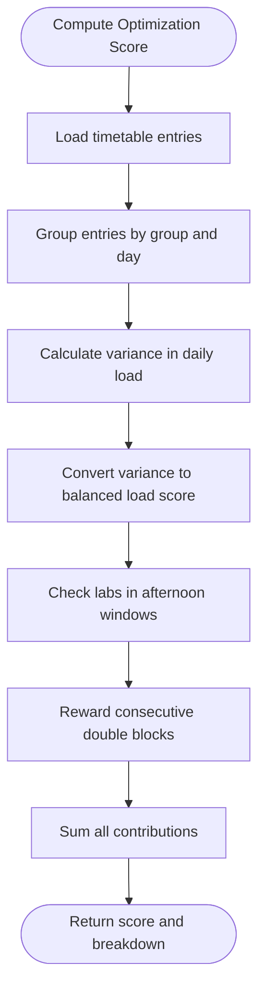
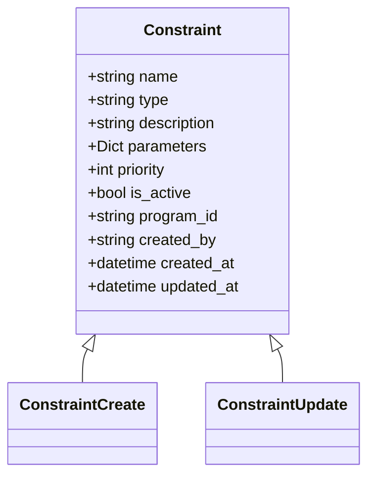
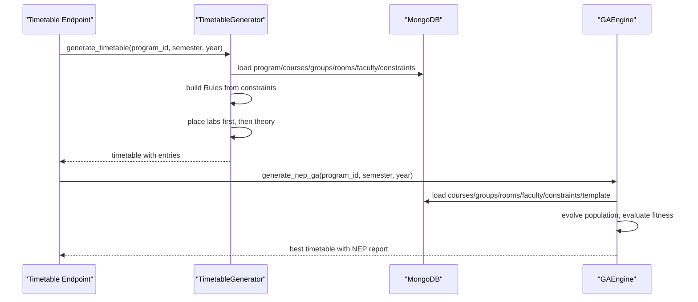
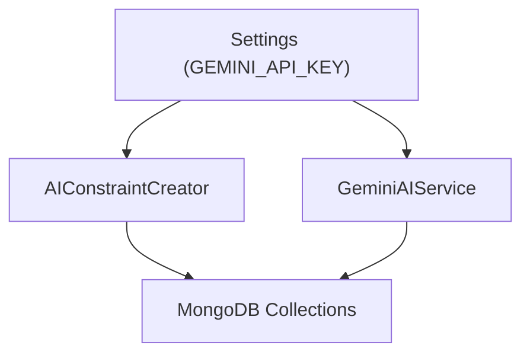

# Constraint Creation System

<cite>
**Referenced Files in This Document**
- [constraint_creator.py](file://backend/app/services/ai/constraint_creator.py)
- [gemini.py](file://backend/app/services/ai/gemini.py)
- [optimizer.py](file://backend/app/services/ai/optimizer.py)
- [constraint.py](file://backend/app/models/constraint.py)
- [constraints.py](file://backend/app/api/v1/endpoints/constraints.py)
- [timetable.py](file://backend/app/api/v1/endpoints/timetable.py)
- [generator.py](file://backend/app/services/timetable/generator.py)
- [ga_engine.py](file://backend/app/services/timetable/ga_engine.py)
- [config.py](file://backend/app/core/config.py)
</cite>

## Table of Contents
1. [Introduction](#introduction)
2. [Project Structure](#project-structure)
3. [Core Components](#core-components)
4. [Architecture Overview](#architecture-overview)
5. [Detailed Component Analysis](#detailed-component-analysis)
6. [Dependency Analysis](#dependency-analysis)
7. [Performance Considerations](#performance-considerations)
8. [Troubleshooting Guide](#troubleshooting-guide)
9. [Conclusion](#conclusion)

## Introduction
This document describes the AI-driven constraint creation system that automatically generates scheduling rules from academic requirements. It explains how natural language constraints are parsed into structured formats, how AI integrates with Gemini for intelligent constraint generation, and how constraints are validated, optimized, and evaluated. The system supports key constraint categories such as faculty workload limits, room capacity requirements, and NEP 2020 compliance rules. It also covers integration with the timetable generation engine and the constraint evaluation methodologies used to assess impact.

## Project Structure
The constraint creation system spans three primary layers:
- AI Services: Natural language parsing, AI suggestions, NEP validation, and optimization
- API Layer: REST endpoints for managing constraints and integrating with timetable generation
- Timetable Generation: Rule-based and genetic algorithm engines that consume constraints

**Diagram sources**
- [constraint_creator.py:18-781](file://backend/app/services/ai/constraint_creator.py#L18-L781)
- [gemini.py:9-288](file://backend/app/services/ai/gemini.py#L9-L288)
- [optimizer.py:6-59](file://backend/app/services/ai/optimizer.py#L6-L59)
- [constraints.py:11-189](file://backend/app/api/v1/endpoints/constraints.py#L11-L189)
- [timetable.py:234-537](file://backend/app/api/v1/endpoints/timetable.py#L234-L537)
- [generator.py:163-402](file://backend/app/services/timetable/generator.py#L163-L402)
- [ga_engine.py:19-414](file://backend/app/services/timetable/ga_engine.py#L19-L414)

**Section sources**
- [constraint_creator.py:18-781](file://backend/app/services/ai/constraint_creator.py#L18-L781)
- [gemini.py:9-288](file://backend/app/services/ai/gemini.py#L9-L288)
- [optimizer.py:6-59](file://backend/app/services/ai/optimizer.py#L6-L59)
- [constraints.py:11-189](file://backend/app/api/v1/endpoints/constraints.py#L11-L189)
- [timetable.py:234-537](file://backend/app/api/v1/endpoints/timetable.py#L234-L537)
- [generator.py:163-402](file://backend/app/services/timetable/generator.py#L163-L402)
- [ga_engine.py:19-414](file://backend/app/services/timetable/ga_engine.py#L19-L414)

## Core Components
- AIConstraintCreator: Parses natural language constraints, suggests program-specific constraints, validates NEP 2020 compliance, and optimizes constraint sets.
- GeminiAIService: Provides AI assistance for timetable analysis, suggestions, and NEP validation.
- Optimizer: Lightweight scoring for soft constraints to guide timetable quality.
- Constraint Model and API: Defines constraint schema and exposes CRUD/validation endpoints.
- Timetable Generators: Rule-based generator and genetic algorithm engine that consume constraints.

Key capabilities:
- Natural language parsing with rule-based fallback
- NEP 2020 compliance scoring and recommendations
- Constraint optimization to reduce conflicts and improve quality
- Integration with timetable generation and validation

**Section sources**
- [constraint_creator.py:18-781](file://backend/app/services/ai/constraint_creator.py#L18-L781)
- [gemini.py:9-288](file://backend/app/services/ai/gemini.py#L9-L288)
- [optimizer.py:6-59](file://backend/app/services/ai/optimizer.py#L6-L59)
- [constraint.py:6-30](file://backend/app/models/constraint.py#L6-L30)
- [constraints.py:11-189](file://backend/app/api/v1/endpoints/constraints.py#L11-L189)

## Architecture Overview
The system orchestrates constraint creation and validation through AI-assisted parsing and suggestions, followed by integration with timetable generation engines.

**Diagram sources**
- [constraints.py:47-64](file://backend/app/api/v1/endpoints/constraints.py#L47-L64)
- [constraint_creator.py:179-282](file://backend/app/services/ai/constraint_creator.py#L179-L282)
- [timetable.py:266-375](file://backend/app/api/v1/endpoints/timetable.py#L266-L375)
- [generator.py:169-233](file://backend/app/services/timetable/generator.py#L169-L233)

## Detailed Component Analysis

### AIConstraintCreator: Natural Language Parsing, Suggestions, Validation, and Optimization
- Natural language parsing: Uses Gemini AI when configured; otherwise falls back to rule-based pattern matching. Extracts structured parameters and assigns priority and NEP relevance.
- Program-specific suggestions: Generates tailored constraints for a given program using AI prompts enriched with program, courses, faculty, and room data.
- NEP 2020 validation: Scores constraint sets across six NEP areas and provides recommendations.
- Optimization: Suggests removal/additions/priority adjustments to reduce conflicts and improve NEP alignment.

**Diagram sources**
- [constraint_creator.py:18-781](file://backend/app/services/ai/constraint_creator.py#L18-L781)

**Section sources**
- [constraint_creator.py:179-282](file://backend/app/services/ai/constraint_creator.py#L179-L282)
- [constraint_creator.py:405-499](file://backend/app/services/ai/constraint_creator.py#L405-L499)
- [constraint_creator.py:536-598](file://backend/app/services/ai/constraint_creator.py#L536-L598)
- [constraint_creator.py:659-720](file://backend/app/services/ai/constraint_creator.py#L659-L720)

### GeminiAIService: AI-Assisted Timetable Analysis and Suggestions
- Provides AI-powered analysis of existing timetables, improvement suggestions, and NEP compliance checks.
- Processes natural language queries about timetables with contextual awareness.

**Diagram sources**
- [gemini.py:9-288](file://backend/app/services/ai/gemini.py#L9-L288)

**Section sources**
- [gemini.py:18-113](file://backend/app/services/ai/gemini.py#L18-L113)
- [gemini.py:114-154](file://backend/app/services/ai/gemini.py#L114-L154)
- [gemini.py:155-183](file://backend/app/services/ai/gemini.py#L155-L183)
- [gemini.py:184-240](file://backend/app/services/ai/gemini.py#L184-L240)
- [gemini.py:241-288](file://backend/app/services/ai/gemini.py#L241-L288)

### Optimizer: Lightweight Scoring for Soft Constraints
- Computes a simple score based on balanced daily load, afternoon lab preference, and consecutive double blocks.
- Provides a breakdown of contributions to the score.

**Diagram sources**
- [optimizer.py:6-59](file://backend/app/services/ai/optimizer.py#L6-L59)

**Section sources**
- [optimizer.py:6-59](file://backend/app/services/ai/optimizer.py#L6-L59)

### Constraint Model and API
- Constraint schema defines name, type, description, parameters, priority, activation flag, and program scoping.
- API endpoints support listing, retrieving, creating, updating, deleting constraints, listing types, and validating constraints for a program.

**Diagram sources**
- [constraint.py:6-30](file://backend/app/models/constraint.py#L6-L30)

**Section sources**
- [constraint.py:6-30](file://backend/app/models/constraint.py#L6-L30)
- [constraints.py:11-189](file://backend/app/api/v1/endpoints/constraints.py#L11-L189)

### Timetable Generation Integration
- Rule-based generator loads constraints, builds rules, and places theory and lab sessions respecting capacity, availability, and continuity constraints.
- Genetic Algorithm engine evaluates hard/soft constraints and optimization objectives, evolving solutions over generations.

**Diagram sources**
- [timetable.py:234-375](file://backend/app/api/v1/endpoints/timetable.py#L234-L375)
- [generator.py:169-402](file://backend/app/services/timetable/generator.py#L169-L402)
- [ga_engine.py:125-165](file://backend/app/services/timetable/ga_engine.py#L125-L165)

**Section sources**
- [timetable.py:234-375](file://backend/app/api/v1/endpoints/timetable.py#L234-L375)
- [generator.py:169-402](file://backend/app/services/timetable/generator.py#L169-L402)
- [ga_engine.py:125-165](file://backend/app/services/timetable/ga_engine.py#L125-L165)

## Dependency Analysis
- AIConstraintCreator depends on configuration settings for Gemini API key and MongoDB for program/course/faculty/room data.
- GeminiAIService depends on configuration settings and MongoDB for timetable retrieval.
- Timetable generators depend on constraints loaded from MongoDB and templates for slot allocation.

**Diagram sources**
- [config.py:34-36](file://backend/app/core/config.py#L34-L36)
- [constraint_creator.py:171-178](file://backend/app/services/ai/constraint_creator.py#L171-L178)
- [gemini.py:10-16](file://backend/app/services/ai/gemini.py#L10-L16)

**Section sources**
- [config.py:34-36](file://backend/app/core/config.py#L34-L36)
- [constraint_creator.py:171-178](file://backend/app/services/ai/constraint_creator.py#L171-L178)
- [gemini.py:10-16](file://backend/app/services/ai/gemini.py#L10-L16)

## Performance Considerations
- Natural language parsing: AI parsing is preferred; rule-based fallback ensures basic functionality when AI is unavailable.
- Constraint optimization: The lightweight optimizer provides quick feedback on soft constraints; for large-scale optimization, the GA engine offers robust multi-objective optimization.
- Timetable generation: Rule-based generator prioritizes labs first and theory second, reducing backtracking; GA engine evolves solutions with elitism and diverse mutation operators.

[No sources needed since this section provides general guidance]

## Troubleshooting Guide
Common issues and resolutions:
- Missing Gemini API key: AI features fall back to rule-based parsing and default suggestions. Verify configuration settings.
- Constraint validation failures: Use the validation endpoint to review per-constraint validation results and adjust parameters accordingly.
- Timetable generation errors: Ensure constraints are valid and compatible with available rooms, faculty, and student groups.

**Section sources**
- [constraint_creator.py:190-193](file://backend/app/services/ai/constraint_creator.py#L190-L193)
- [constraints.py:151-189](file://backend/app/api/v1/endpoints/constraints.py#L151-L189)

## Conclusion
The AI-driven constraint creation system provides a robust pipeline for transforming academic requirements into structured, validated, and optimized scheduling constraints. By leveraging AI for parsing and suggestions, maintaining NEP 2020 compliance, and integrating seamlessly with both rule-based and genetic algorithm timetable generators, the system supports efficient, high-quality timetabling aligned with institutional guidelines.