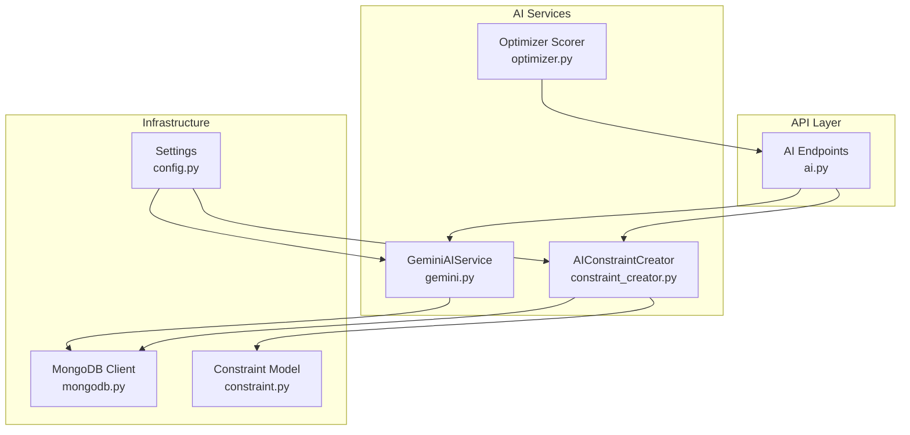
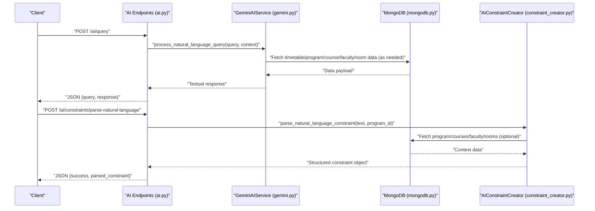
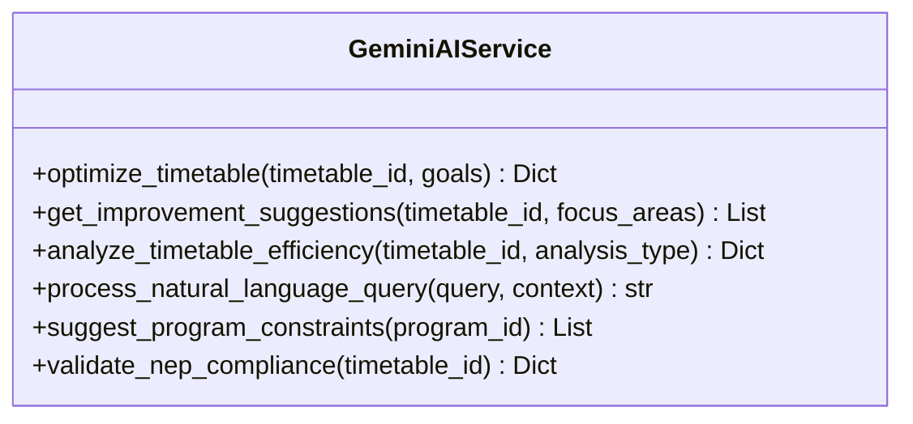
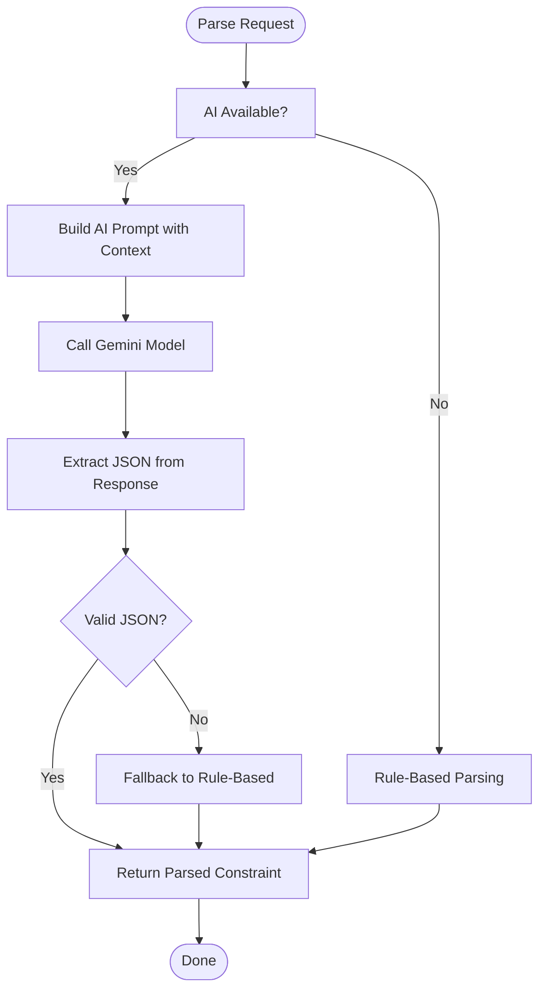
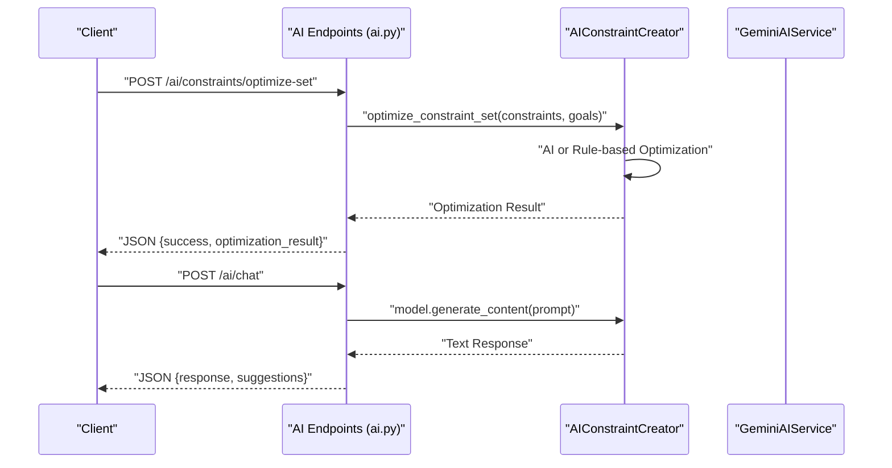
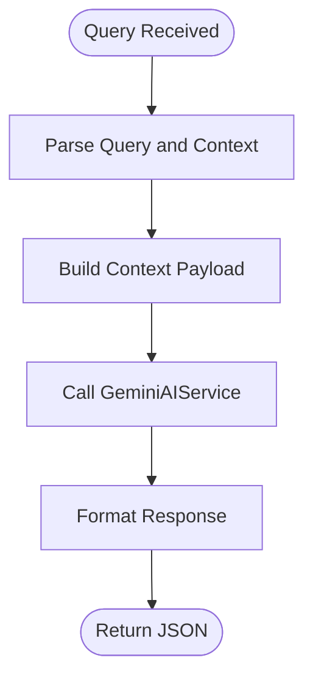
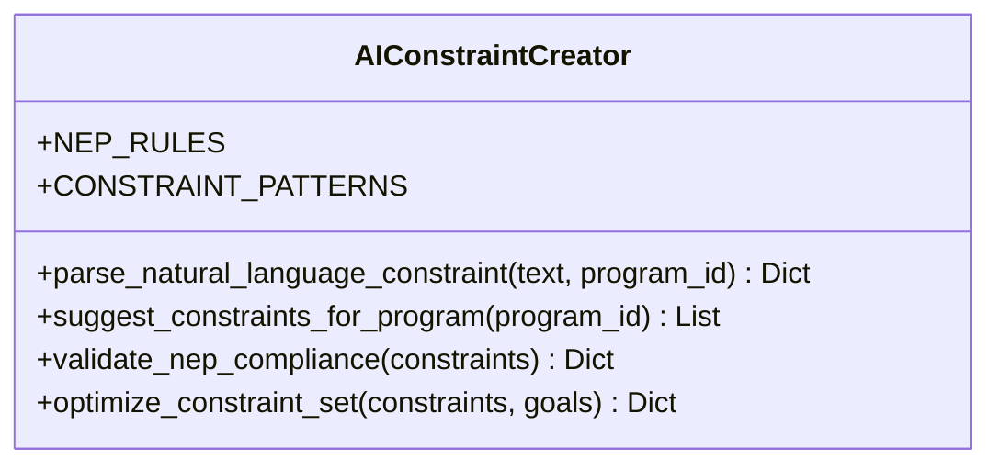
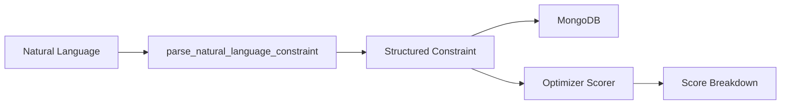
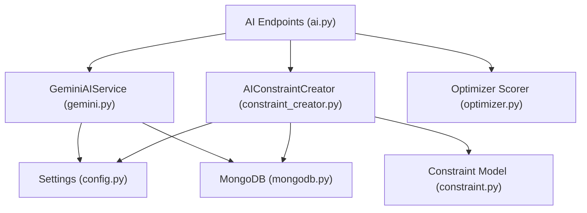

# Natural Language Processing

<cite>
**Referenced Files in This Document**
- [gemini.py](file://backend/app/services/ai/gemini.py)
- [constraint_creator.py](file://backend/app/services/ai/constraint_creator.py)
- [ai.py](file://backend/app/api/v1/endpoints/ai.py)
- [config.py](file://backend/app/core/config.py)
- [mongodb.py](file://backend/app/db/mongodb.py)
- [constraint.py](file://backend/app/models/constraint.py)
- [optimizer.py](file://backend/app/services/ai/optimizer.py)
</cite>

## Table of Contents
1. [Introduction](#introduction)
2. [Project Structure](#project-structure)
3. [Core Components](#core-components)
4. [Architecture Overview](#architecture-overview)
5. [Detailed Component Analysis](#detailed-component-analysis)
6. [Dependency Analysis](#dependency-analysis)
7. [Performance Considerations](#performance-considerations)
8. [Troubleshooting Guide](#troubleshooting-guide)
9. [Conclusion](#conclusion)

## Introduction
This document describes the natural language processing (NLP) component of the AI optimization system. It focuses on how the system integrates with the Gemini API to process academic queries, convert textual descriptions into actionable scheduling insights, and support NEP 2020 guideline interpretation and constraint translation. It also documents the query processing pipeline, prompt engineering strategies, response formatting, integration patterns with the constraint creation system, error handling, fallback mechanisms, and performance optimization techniques.

## Project Structure
The NLP functionality spans several modules:
- API endpoints define the external interface for AI-assisted timetable and constraint operations.
- Gemini service encapsulates Gemini API interactions and prompt construction.
- AI constraint creator parses natural language constraints into structured formats, validates against NEP 2020 guidelines, and optimizes constraint sets.
- Configuration and database modules provide runtime settings and persistence integration.

**Diagram sources**
- [ai.py:1-362](file://backend/app/api/v1/endpoints/ai.py#L1-L362)
- [gemini.py:1-288](file://backend/app/services/ai/gemini.py#L1-L288)
- [constraint_creator.py:1-781](file://backend/app/services/ai/constraint_creator.py#L1-L781)
- [optimizer.py:1-59](file://backend/app/services/ai/optimizer.py#L1-L59)
- [config.py:1-61](file://backend/app/core/config.py#L1-L61)
- [mongodb.py:1-41](file://backend/app/db/mongodb.py#L1-L41)
- [constraint.py:1-30](file://backend/app/models/constraint.py#L1-L30)

**Section sources**
- [ai.py:1-362](file://backend/app/api/v1/endpoints/ai.py#L1-L362)
- [gemini.py:1-288](file://backend/app/services/ai/gemini.py#L1-L288)
- [constraint_creator.py:1-781](file://backend/app/services/ai/constraint_creator.py#L1-L781)
- [config.py:1-61](file://backend/app/core/config.py#L1-L61)
- [mongodb.py:1-41](file://backend/app/db/mongodb.py#L1-L41)
- [constraint.py:1-30](file://backend/app/models/constraint.py#L1-L30)
- [optimizer.py:1-59](file://backend/app/services/ai/optimizer.py#L1-L59)

## Core Components
- GeminiAIService: Provides AI-powered operations for timetable optimization, suggestions, efficiency analysis, NEP 2020 validation, and natural language query processing. It constructs prompts tailored to academic scheduling and NEP 2020 guidelines and returns structured results.
- AIConstraintCreator: Parses natural language constraints into structured objects, suggests constraints for programs, validates constraint sets against NEP 2020, and optimizes constraint sets. It includes a rule-based fallback when AI is unavailable.
- API endpoints: Expose routes for optimization, suggestions, analysis, NEP validation, constraint parsing, optimization, and NEP compliance checks. They enforce user ownership and handle errors.
- Configuration and database: Settings manage the Gemini API key and other runtime parameters. MongoDB client manages database connectivity and is used for fetching timetable, program, course, faculty, and room data.

Key responsibilities:
- Prompt engineering for academic scheduling and NEP 2020 compliance.
- Structured constraint parsing and NEP relevance detection.
- Constraint optimization and compliance scoring.
- Secure access to user-owned resources.

**Section sources**
- [gemini.py:9-288](file://backend/app/services/ai/gemini.py#L9-L288)
- [constraint_creator.py:18-781](file://backend/app/services/ai/constraint_creator.py#L18-L781)
- [ai.py:46-362](file://backend/app/api/v1/endpoints/ai.py#L46-L362)
- [config.py:34-35](file://backend/app/core/config.py#L34-L35)
- [mongodb.py:11-32](file://backend/app/db/mongodb.py#L11-L32)

## Architecture Overview
The NLP pipeline integrates API requests, Gemini prompts, and database lookups to produce actionable scheduling insights and structured constraints.

**Diagram sources**
- [ai.py:137-157](file://backend/app/api/v1/endpoints/ai.py#L137-L157)
- [gemini.py:155-182](file://backend/app/services/ai/gemini.py#L155-L182)
- [constraint_creator.py:179-281](file://backend/app/services/ai/constraint_creator.py#L179-L281)
- [mongodb.py:11-32](file://backend/app/db/mongodb.py#L11-L32)

## Detailed Component Analysis

### GeminiAIService
Responsibilities:
- Timetable optimization and suggestions using curated prompts.
- Efficiency analysis with metrics and recommendations.
- NEP 2020 compliance validation and reporting.
- Natural language query processing with academic scheduling focus.

Prompt engineering strategies:
- Structured instruction templates that enumerate tasks and desired outputs.
- Context injection for timetable, program, and resource data.
- Explicit JSON formatting requirements for structured responses.
- Domain-specific guidance for NEP 2020 alignment.

Processing logic:
- Validates API key availability and returns error responses when not configured.
- Fetches relevant data from MongoDB for context.
- Constructs prompts with clear roles and expectations.
- Returns standardized JSON responses with metadata.

Error handling:
- Graceful error returns for missing API key, missing timetable, and exceptions.

Response formatting:
- Consistent keys across operations (e.g., timetable_id, analysis_type, generated_at).
- Timestamps and metadata for traceability.

**Diagram sources**
- [gemini.py:18-288](file://backend/app/services/ai/gemini.py#L18-L288)

**Section sources**
- [gemini.py:9-288](file://backend/app/services/ai/gemini.py#L9-L288)

### AIConstraintCreator
Responsibilities:
- Parse natural language constraints into structured objects with parameters and NEP relevance.
- Suggest constraints for a program using AI with NEP 2020 guidance.
- Validate a set of constraints against NEP 2020 areas and produce compliance reports.
- Optimize constraint sets to reduce conflicts and improve NEP alignment.

Prompt engineering strategies:
- Explicit constraint types and parameter schemas.
- NEP 2020 areas and rationale requirements.
- Structured JSON output constraints for reliable parsing.

Rule-based fallback:
- Pattern-matching engine for constraint types when AI is unavailable.
- Default constraint templates and NEP relevance heuristics.

Validation and optimization:
- AI-driven validation with area-wise scores and recommendations.
- Rule-based fallback validation when AI is unavailable.
- Optimization suggestions for conflict reduction and NEP compliance.

**Diagram sources**
- [constraint_creator.py:179-281](file://backend/app/services/ai/constraint_creator.py#L179-L281)

**Section sources**
- [constraint_creator.py:18-781](file://backend/app/services/ai/constraint_creator.py#L18-L781)
- [constraint.py:6-30](file://backend/app/models/constraint.py#L6-L30)

### API Endpoints for NLP
Endpoints:
- Timetable optimization, suggestions, and analysis.
- NEP 2020 validation for timetables.
- Natural language query processing.
- Constraint parsing, optimization, and NEP compliance checks.
- AI chat assistant with follow-up suggestions.

Security:
- Enforce user ownership of timetables and programs before processing.
- Raise HTTP 404 when resources are not found or not owned.

Error handling:
- Wrap service calls in try-catch and return HTTP 500 with error details.

**Diagram sources**
- [ai.py:230-248](file://backend/app/api/v1/endpoints/ai.py#L230-L248)
- [ai.py:267-361](file://backend/app/api/v1/endpoints/ai.py#L267-L361)
- [constraint_creator.py:659-720](file://backend/app/services/ai/constraint_creator.py#L659-L720)

**Section sources**
- [ai.py:46-362](file://backend/app/api/v1/endpoints/ai.py#L46-L362)

### Query Processing Pipeline
Input parsing:
- Natural language queries are accepted with optional context.
- Context can include timetable, program, or other domain-specific data.

Context extraction:
- API endpoints fetch relevant data from MongoDB to enrich prompts.
- Program context, course lists, faculty, and room inventories are injected into prompts.

Response formatting:
- Textual responses are returned for natural language queries.
- Suggestions and compliance reports include structured metadata.

**Diagram sources**
- [ai.py:137-157](file://backend/app/api/v1/endpoints/ai.py#L137-L157)
- [gemini.py:155-182](file://backend/app/services/ai/gemini.py#L155-L182)

**Section sources**
- [ai.py:26-44](file://backend/app/api/v1/endpoints/ai.py#L26-L44)
- [gemini.py:155-182](file://backend/app/services/ai/gemini.py#L155-L182)

### NEP 2020 Interpretation and Constraint Translation
NEP 2020 guidelines:
- Credit system flexibility, multidisciplinary integration, continuous assessment, skill development, research and innovation, and faculty workload recommendations.
- AIConstraintCreator maintains NEP rules and maps constraint relevance to NEP areas.

Constraint translation:
- Natural language constraints are parsed into structured objects with parameters.
- NEP relevance is detected via keywords and constraint types.
- Suggestions and validations include NEP rationale and recommendations.

**Diagram sources**
- [constraint_creator.py:28-90](file://backend/app/services/ai/constraint_creator.py#L28-L90)
- [constraint_creator.py:92-169](file://backend/app/services/ai/constraint_creator.py#L92-L169)
- [constraint_creator.py:405-500](file://backend/app/services/ai/constraint_creator.py#L405-L500)

**Section sources**
- [constraint_creator.py:28-90](file://backend/app/services/ai/constraint_creator.py#L28-L90)
- [constraint_creator.py:179-281](file://backend/app/services/ai/constraint_creator.py#L179-L281)
- [constraint_creator.py:405-500](file://backend/app/services/ai/constraint_creator.py#L405-L500)
- [constraint_creator.py:536-657](file://backend/app/services/ai/constraint_creator.py#L536-L657)

### Integration Patterns with Constraint Creation System
- Natural language constraints are parsed into structured objects compatible with the constraint model.
- AIConstraintCreator enriches parsed constraints with NEP relevance and metadata.
- Optimizer service provides lightweight scoring for timetable entries to complement AI insights.

**Diagram sources**
- [constraint_creator.py:179-281](file://backend/app/services/ai/constraint_creator.py#L179-L281)
- [constraint.py:6-30](file://backend/app/models/constraint.py#L6-L30)
- [optimizer.py:6-59](file://backend/app/services/ai/optimizer.py#L6-L59)

**Section sources**
- [constraint_creator.py:179-281](file://backend/app/services/ai/constraint_creator.py#L179-L281)
- [constraint.py:6-30](file://backend/app/models/constraint.py#L6-L30)
- [optimizer.py:6-59](file://backend/app/services/ai/optimizer.py#L6-L59)

## Dependency Analysis
- API endpoints depend on GeminiAIService and AIConstraintCreator.
- GeminiAIService depends on MongoDB for data retrieval and on configuration for API key.
- AIConstraintCreator depends on MongoDB for program and resource data and on configuration for API key.
- Optimizer service is independent and complements AI insights.

**Diagram sources**
- [ai.py:1-362](file://backend/app/api/v1/endpoints/ai.py#L1-L362)
- [gemini.py:1-288](file://backend/app/services/ai/gemini.py#L1-L288)
- [constraint_creator.py:1-781](file://backend/app/services/ai/constraint_creator.py#L1-L781)
- [config.py:1-61](file://backend/app/core/config.py#L1-L61)
- [mongodb.py:1-41](file://backend/app/db/mongodb.py#L1-L41)
- [constraint.py:1-30](file://backend/app/models/constraint.py#L1-L30)
- [optimizer.py:1-59](file://backend/app/services/ai/optimizer.py#L1-L59)

**Section sources**
- [ai.py:1-362](file://backend/app/api/v1/endpoints/ai.py#L1-L362)
- [gemini.py:1-288](file://backend/app/services/ai/gemini.py#L1-L288)
- [constraint_creator.py:1-781](file://backend/app/services/ai/constraint_creator.py#L1-L781)
- [config.py:1-61](file://backend/app/core/config.py#L1-L61)
- [mongodb.py:1-41](file://backend/app/db/mongodb.py#L1-L41)
- [constraint.py:1-30](file://backend/app/models/constraint.py#L1-L30)
- [optimizer.py:1-59](file://backend/app/services/ai/optimizer.py#L1-L59)

## Performance Considerations
- Prompt construction: Keep prompts concise while including sufficient context to avoid token waste and latency.
- Structured JSON output: Encourage AI to return JSON directly to reduce post-processing overhead.
- Fallback strategies: Rule-based parsing and validation reduce dependency on AI when unavailable.
- Database queries: Fetch only necessary fields and limit result sizes to minimize latency.
- Caching: Consider caching repeated queries or frequently accessed program/context data at the application layer.
- Concurrency: Gemini calls are asynchronous; ensure proper rate limiting and backoff if scaling.

[No sources needed since this section provides general guidance]

## Troubleshooting Guide
Common issues and resolutions:
- Missing Gemini API key: Configure the environment variable and restart the service. API endpoints return informative errors when AI is not configured.
- Timetable or program not found: Verify ownership and IDs; endpoints enforce user ownership and return 404 when not found.
- AI parsing failures: The system falls back to rule-based parsing; review natural language phrasing and ensure it matches known patterns.
- NEP validation errors: Use the NEP compliance endpoint to identify gaps and adjust constraints accordingly.

Error handling patterns:
- API endpoints wrap service calls and return HTTP 500 with error details.
- GeminiAIService returns structured error dictionaries when AI is unavailable or when exceptions occur.
- AIConstraintCreator returns fallback objects or rule-based results when AI fails.

**Section sources**
- [ai.py:54-73](file://backend/app/api/v1/endpoints/ai.py#L54-L73)
- [ai.py:85-106](file://backend/app/api/v1/endpoints/ai.py#L85-L106)
- [gemini.py:20-21](file://backend/app/services/ai/gemini.py#L20-L21)
- [constraint_creator.py:190-192](file://backend/app/services/ai/constraint_creator.py#L190-L192)
- [constraint_creator.py:598-599](file://backend/app/services/ai/constraint_creator.py#L598-L599)

## Conclusion
The NLP component integrates Gemini AI with academic scheduling workflows to transform natural language queries and constraints into structured, NEP 2020-aligned insights. The system employs robust prompt engineering, structured response formats, rule-based fallbacks, and secure access controls. Together with the optimizer service, it enables efficient timetable generation and compliance validation, providing a strong foundation for AI-driven academic scheduling systems.