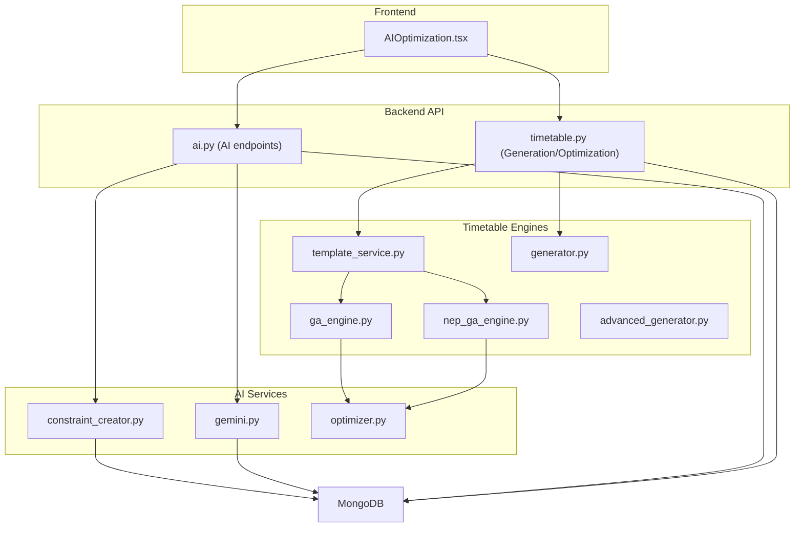
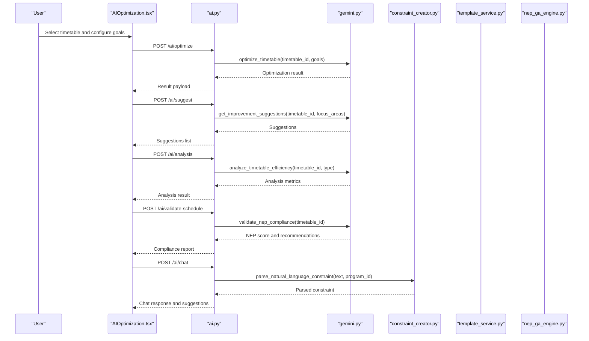
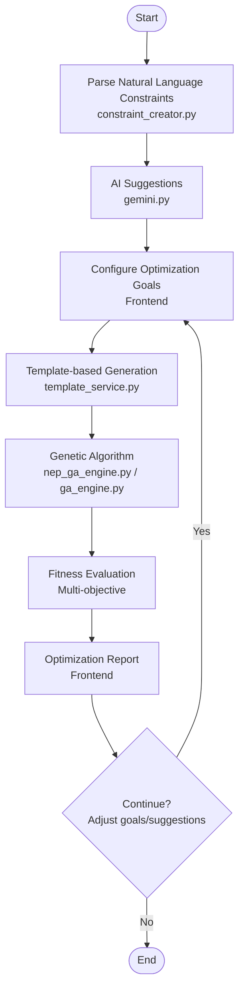
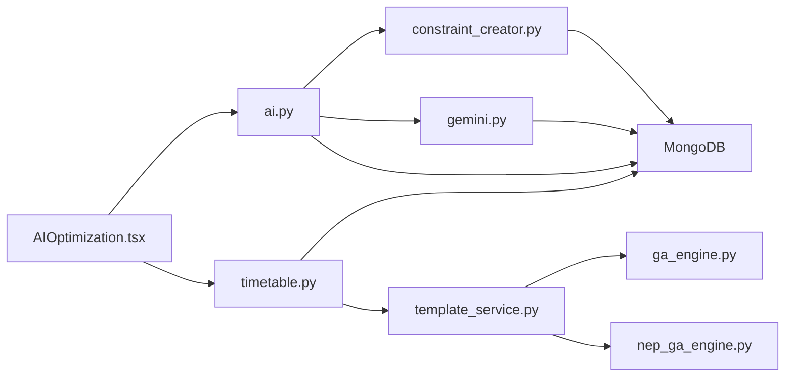

# Optimization Algorithms

<cite>
**Referenced Files in This Document**
- [optimizer.py](file://backend/app/services/ai/optimizer.py)
- [constraint_creator.py](file://backend/app/services/ai/constraint_creator.py)
- [gemini.py](file://backend/app/services/ai/gemini.py)
- [ga_engine.py](file://backend/app/services/timetable/ga_engine.py)
- [nep_ga_engine.py](file://backend/app/services/timetable/nep_ga_engine.py)
- [advanced_generator.py](file://backend/app/services/timetable/advanced_generator.py)
- [template_service.py](file://backend/app/services/timetable/template_service.py)
- [generator.py](file://backend/app/services/timetable/generator.py)
- [ai.py](file://backend/app/api/v1/endpoints/ai.py)
- [timetable.py](file://backend/app/api/v1/endpoints/timetable.py)
- [AIOptimization.tsx](file://frontend/src/components/pages/AIOptimization.tsx)
</cite>

## Table of Contents
1. [Introduction](#introduction)
2. [Project Structure](#project-structure)
3. [Core Components](#core-components)
4. [Architecture Overview](#architecture-overview)
5. [Detailed Component Analysis](#detailed-component-analysis)
6. [Dependency Analysis](#dependency-analysis)
7. [Performance Considerations](#performance-considerations)
8. [Troubleshooting Guide](#troubleshooting-guide)
9. [Conclusion](#conclusion)

## Introduction
This document explains the hybrid optimization algorithms that enhance timetable efficiency beyond basic constraint satisfaction. It covers:
- A hybrid approach combining genetic algorithms with AI-driven suggestions for conflict resolution and performance improvement
- Fitness functions evaluating timetable quality across faculty workload balance, room utilization, and student schedule optimization
- Multi-objective strategies balancing NEP 2020 compliance, resource utilization, and academic quality
- Algorithm selection criteria, convergence mechanisms, and performance metrics
- Examples of optimization scenarios, parameter tuning, and comparisons with baseline constraint satisfaction
- Integration with the genetic algorithm engine and real-time optimization capabilities

## Project Structure
The optimization system spans backend services, AI modules, and frontend components:
- AI services: natural language constraint parsing, NEP 2020 validation, and AI-driven timetable analysis
- Timetable engines: standard GA and NEP-compliant GA with multi-objective fitness
- API endpoints: orchestrate generation, optimization, and analysis
- Frontend: user interface for selecting timetables, configuring optimization goals, and viewing results

**Diagram sources**
- [AIOptimization.tsx](file://frontend/src/components/pages/AIOptimization.tsx)
- [ai.py](file://backend/app/api/v1/endpoints/ai.py)
- [timetable.py](file://backend/app/api/v1/endpoints/timetable.py)
- [constraint_creator.py](file://backend/app/services/ai/constraint_creator.py)
- [gemini.py](file://backend/app/services/ai/gemini.py)
- [optimizer.py](file://backend/app/services/ai/optimizer.py)
- [ga_engine.py](file://backend/app/services/timetable/ga_engine.py)
- [nep_ga_engine.py](file://backend/app/services/timetable/nep_ga_engine.py)
- [advanced_generator.py](file://backend/app/services/timetable/advanced_generator.py)
- [template_service.py](file://backend/app/services/timetable/template_service.py)
- [generator.py](file://backend/app/services/timetable/generator.py)

**Section sources**
- [AIOptimization.tsx](file://frontend/src/components/pages/AIOptimization.tsx)
- [ai.py](file://backend/app/api/v1/endpoints/ai.py)
- [timetable.py](file://backend/app/api/v1/endpoints/timetable.py)

## Core Components
- AI Constraint Creator: Parses natural language constraints, suggests constraints aligned with NEP 2020, validates constraint sets, and optimizes them.
- Gemini AI Service: Provides AI-powered timetable optimization, suggestions, efficiency analysis, NEP 2020 validation, and chat assistance.
- GA Engines:
  - Standard GA Engine: Chromosome-based scheduling with multi-objective fitness combining hard constraints, soft constraints, and optimization terms.
  - NEP GA Engine: Extends the standard GA with NEP 2020-specific objectives and evaluations.
- Scoring Utility: Lightweight optimization scoring for soft constraints (balanced daily load, afternoon labs, consecutive double blocks).
- Template Service: Applies templates to generate timetables using GA engines.
- Advanced Generator: Demonstrates advanced scheduling rules and soft constraints for CSE AI & ML programs.

**Section sources**
- [constraint_creator.py](file://backend/app/services/ai/constraint_creator.py)
- [gemini.py](file://backend/app/services/ai/gemini.py)
- [ga_engine.py](file://backend/app/services/timetable/ga_engine.py)
- [nep_ga_engine.py](file://backend/app/services/timetable/nep_ga_engine.py)
- [optimizer.py](file://backend/app/services/ai/optimizer.py)
- [template_service.py](file://backend/app/services/timetable/template_service.py)
- [advanced_generator.py](file://backend/app/services/timetable/advanced_generator.py)

## Architecture Overview
The hybrid optimization pipeline integrates AI-driven insights with evolutionary computation:
- AI parses constraints and suggests improvements, validates NEP 2020 compliance, and generates analysis reports.
- GA engines evolve feasible solutions respecting hard constraints while optimizing soft objectives and NEP targets.
- Frontend surfaces optimization goals, displays suggestions, and presents analysis results.

**Diagram sources**
- [AIOptimization.tsx](file://frontend/src/components/pages/AIOptimization.tsx)
- [ai.py](file://backend/app/api/v1/endpoints/ai.py)
- [gemini.py](file://backend/app/services/ai/gemini.py)
- [constraint_creator.py](file://backend/app/services/ai/constraint_creator.py)

## Detailed Component Analysis

### Hybrid Optimization Pipeline
- AI-driven suggestions and analysis inform optimization goals and highlight improvement areas.
- GA engines evolve solutions with multi-objective fitness, converging toward better hard/soft constraint satisfaction and NEP alignment.
- Real-time feedback loop: users can re-run optimization with adjusted goals and review suggestions/analysis.

**Diagram sources**
- [constraint_creator.py](file://backend/app/services/ai/constraint_creator.py)
- [gemini.py](file://backend/app/services/ai/gemini.py)
- [template_service.py](file://backend/app/services/timetable/template_service.py)
- [nep_ga_engine.py](file://backend/app/services/timetable/nep_ga_engine.py)
- [ga_engine.py](file://backend/app/services/timetable/ga_engine.py)
- [AIOptimization.tsx](file://frontend/src/components/pages/AIOptimization.tsx)

**Section sources**
- [constraint_creator.py](file://backend/app/services/ai/constraint_creator.py)
- [gemini.py](file://backend/app/services/ai/gemini.py)
- [template_service.py](file://backend/app/services/timetable/template_service.py)
- [nep_ga_engine.py](file://backend/app/services/timetable/nep_ga_engine.py)
- [ga_engine.py](file://backend/app/services/timetable/ga_engine.py)
- [AIOptimization.tsx](file://frontend/src/components/pages/AIOptimization.tsx)

### AI Constraint Creator
- Parses natural language constraints into structured formats using AI with fallback to rule-based parsing.
- Suggests constraints tailored to a program and validates NEP 2020 compliance.
- Optimizes constraint sets by identifying conflicts, adjusting priorities, and recommending additions.

Key capabilities:
- Constraint type mapping and pattern matching for faculty availability, workload, room capacity/type, time preferences, consecutive classes, gap minimization, block scheduling, and NEP compliance.
- NEP 2020 rule catalog covering credit system, multidisciplinary learning, continuous assessment, skill development, research, and faculty workload.
- Validation and optimization workflows with structured JSON outputs.

**Section sources**
- [constraint_creator.py](file://backend/app/services/ai/constraint_creator.py)

### Gemini AI Service
- Provides AI-powered timetable optimization, suggestions, efficiency analysis, NEP 2020 validation, and chat assistance.
- Processes natural language queries contextualized with timetable and program data.
- Returns structured suggestions with impact and difficulty ratings.

**Section sources**
- [gemini.py](file://backend/app/services/ai/gemini.py)

### Lightweight Optimization Scoring (Soft Constraints)
- Computes a lightweight score emphasizing:
  - Balanced daily load per group
  - Afternoon lab sessions
  - Consecutive double blocks for the same course
- Produces a breakdown of contributions to the total score.

**Section sources**
- [optimizer.py](file://backend/app/services/ai/optimizer.py)

### Standard Genetic Algorithm Engine
- Chromosome representation encodes course sessions with day, slot, and room.
- Multi-objective fitness:
  - Hard constraints: penalties for conflicts among faculty, rooms, and groups
  - Soft constraints: room capacity adherence
  - Optimization: balanced daily workload across days
- Operators: tournament selection, order crossover, swap/inversion/insertion mutations, attribute mutation
- Convergence: monitors best fitness change and stops early upon excellent solutions

**Section sources**
- [ga_engine.py](file://backend/app/services/timetable/ga_engine.py)

### NEP 2020 Compliant Genetic Algorithm Engine
- Extends standard GA with NEP-specific objectives:
  - Practical/theory ratio
  - Faculty workload limits (≤18 hours/week)
  - Daily load balance
  - Afternoon lab scheduling
- Multi-objective fitness with weights for hard constraints, soft constraints, NEP compliance, and general optimization
- Generates NEP compliance reports with area scores and recommendations

**Section sources**
- [nep_ga_engine.py](file://backend/app/services/timetable/nep_ga_engine.py)

### Template-Based Generation and Integration
- TemplateService normalizes overrides for courses, groups, rooms, and faculty; builds time slots and constraints from rules.
- Applies templates to generate timetables using GA engines and returns enriched metadata.

**Section sources**
- [template_service.py](file://backend/app/services/timetable/template_service.py)

### Advanced Generator (CSE AI & ML)
- Demonstrates advanced scheduling rules and soft constraints for a specific program.
- Includes time slot generation, lab windows, and scoring for soft constraints.

**Section sources**
- [advanced_generator.py](file://backend/app/services/timetable/advanced_generator.py)

### API Orchestration
- AI endpoints: optimize, suggest, analysis, validate, query, constraint parsing, optimization, NEP compliance, chat
- Timetable endpoints: generate, generate-advanced, generate-nep-ga, optimize, validate, export

**Section sources**
- [ai.py](file://backend/app/api/v1/endpoints/ai.py)
- [timetable.py](file://backend/app/api/v1/endpoints/timetable.py)

## Dependency Analysis
- AI services depend on MongoDB for program/course/faculty/room data and optionally on Gemini API for natural language processing.
- GA engines depend on template data and course/group/room/faculty collections.
- Frontend interacts with backend APIs to fetch timetables, run optimizations, and display results.

**Diagram sources**
- [AIOptimization.tsx](file://frontend/src/components/pages/AIOptimization.tsx)
- [ai.py](file://backend/app/api/v1/endpoints/ai.py)
- [timetable.py](file://backend/app/api/v1/endpoints/timetable.py)
- [constraint_creator.py](file://backend/app/services/ai/constraint_creator.py)
- [gemini.py](file://backend/app/services/ai/gemini.py)
- [template_service.py](file://backend/app/services/timetable/template_service.py)
- [ga_engine.py](file://backend/app/services/timetable/ga_engine.py)
- [nep_ga_engine.py](file://backend/app/services/timetable/nep_ga_engine.py)

**Section sources**
- [ai.py](file://backend/app/api/v1/endpoints/ai.py)
- [timetable.py](file://backend/app/api/v1/endpoints/timetable.py)
- [constraint_creator.py](file://backend/app/services/ai/constraint_creator.py)
- [gemini.py](file://backend/app/services/ai/gemini.py)
- [template_service.py](file://backend/app/services/timetable/template_service.py)
- [ga_engine.py](file://backend/app/services/timetable/ga_engine.py)
- [nep_ga_engine.py](file://backend/app/services/timetable/nep_ga_engine.py)

## Performance Considerations
- Population sizing and generation limits: GA engines expose parameters for population size, max generations, and convergence thresholds. Tuning these impacts solution quality and runtime.
- Mutation and crossover rates: Balance exploration and exploitation; higher mutation increases diversity but may slow convergence.
- Fitness weighting: Adjust weights for hard constraints, soft constraints, NEP compliance, and optimization to emphasize desired outcomes.
- Convergence detection: Early stopping on excellent fitness prevents unnecessary iterations; monitor best fitness change to detect plateauing.
- Data normalization: TemplateService normalizes inputs to reduce mismatches and improve GA feasibility.

[No sources needed since this section provides general guidance]

## Troubleshooting Guide
Common issues and resolutions:
- AI API key not configured: Gemini AI Service returns an error indicating missing API key; configure settings and retry.
- Timetable not found: API endpoints validate ownership and existence; ensure the selected timetable belongs to the current user.
- Constraint parsing failures: Natural language parsing falls back to rule-based mode; simplify constraints or adjust phrasing.
- GA convergence stalls: Increase population size, adjust mutation rate, or relax hard constraints slightly to improve feasibility.
- NEP compliance gaps: Review NEP report recommendations and add missing constraints (e.g., practical/theory ratio, faculty workload limits).

**Section sources**
- [gemini.py](file://backend/app/services/ai/gemini.py)
- [ai.py](file://backend/app/api/v1/endpoints/ai.py)
- [timetable.py](file://backend/app/api/v1/endpoints/timetable.py)
- [constraint_creator.py](file://backend/app/services/ai/constraint_creator.py)
- [nep_ga_engine.py](file://backend/app/services/timetable/nep_ga_engine.py)

## Conclusion
The hybrid optimization system combines AI-driven insights with genetic algorithms to produce efficient, NEP 2020-aligned timetables. By integrating constraint parsing, suggestions, analysis, and NEP validation with robust GA engines, the platform enables iterative, real-time optimization. Users can tailor goals, review suggestions, and compare pre/post scenarios to achieve balanced academic quality, resource utilization, and compliance.