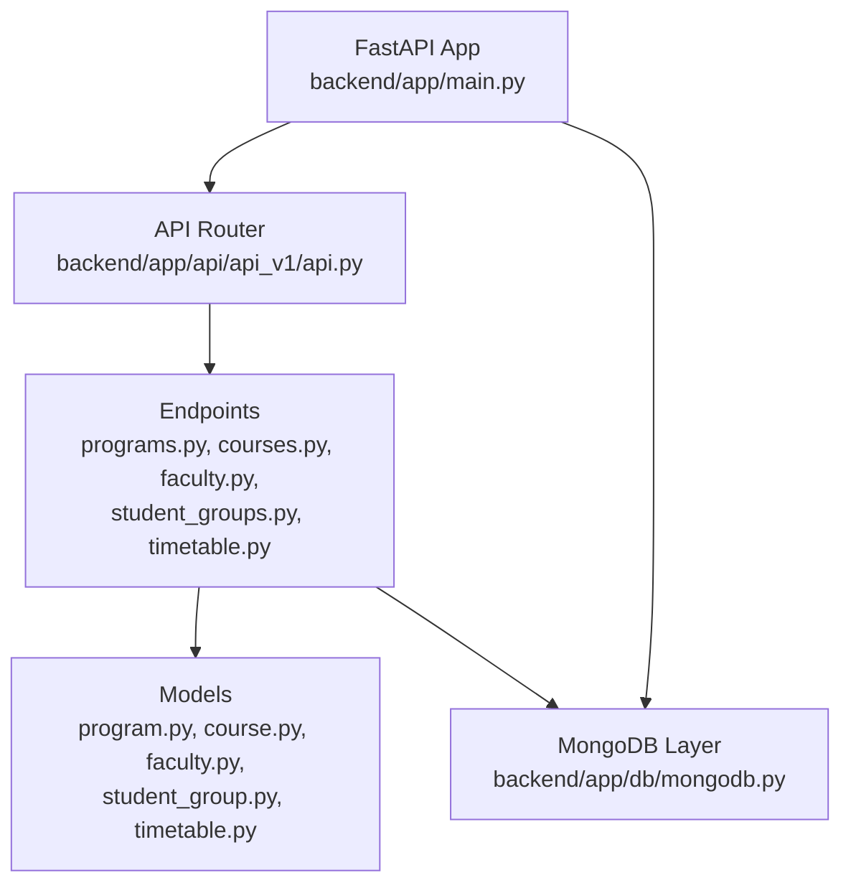
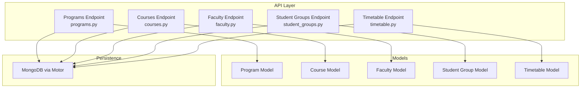
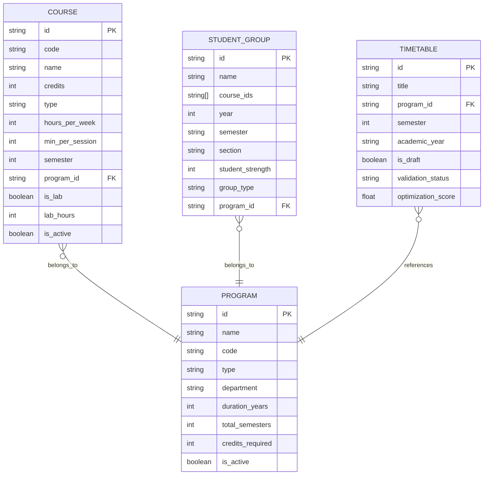
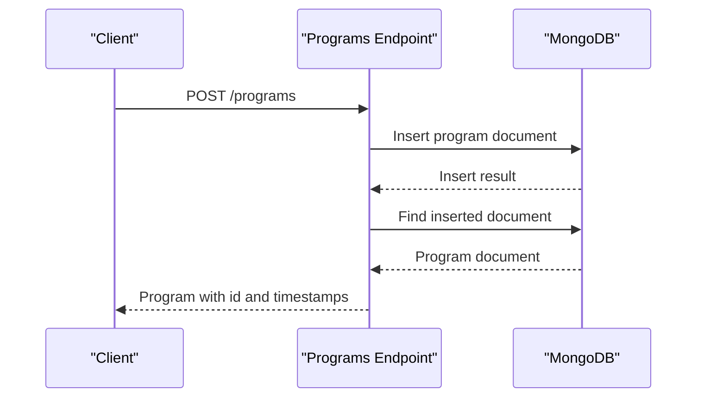
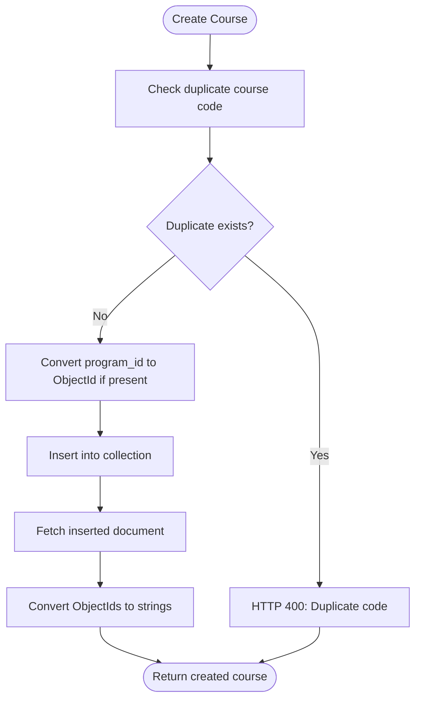
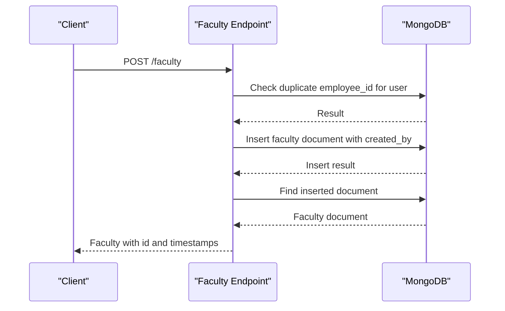
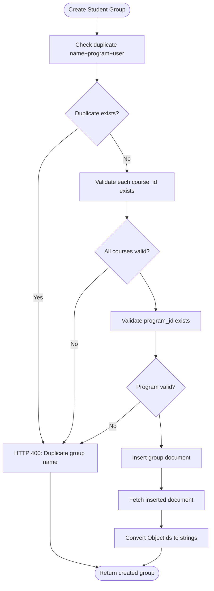
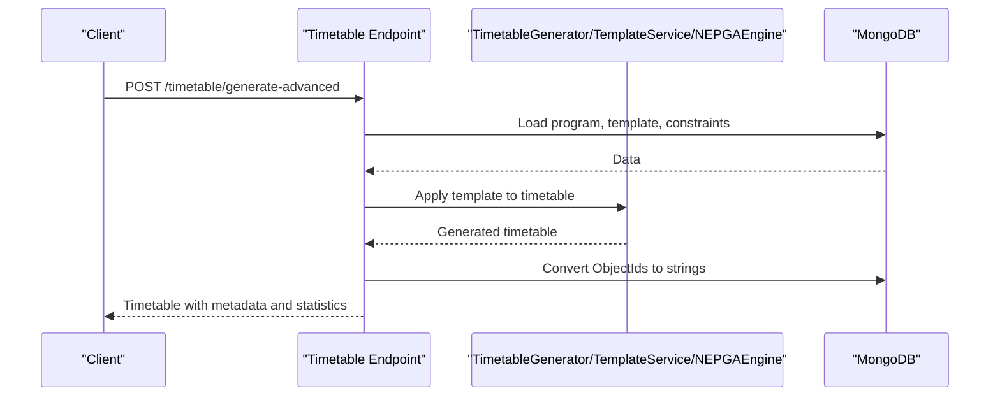
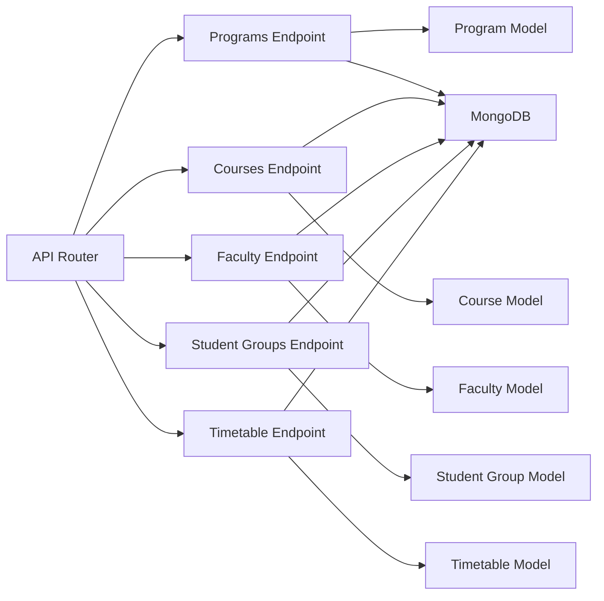

# Academic Management System

<cite>
**Referenced Files in This Document**
- [main.py](file://backend/app/main.py)
- [api.py](file://backend/app/api/api_v1/api.py)
- [program.py](file://backend/app/models/program.py)
- [course.py](file://backend/app/models/course.py)
- [faculty.py](file://backend/app/models/faculty.py)
- [student_group.py](file://backend/app/models/student_group.py)
- [timetable.py](file://backend/app/models/timetable.py)
- [programs.py](file://backend/app/api/v1/endpoints/programs.py)
- [courses.py](file://backend/app/api/v1/endpoints/courses.py)
- [faculty.py](file://backend/app/api/v1/endpoints/faculty.py)
- [student_groups.py](file://backend/app/api/v1/endpoints/student_groups.py)
- [timetable.py](file://backend/app/api/v1/endpoints/timetable.py)
- [mongodb.py](file://backend/app/db/mongodb.py)
- [STUDENT_GROUPS_IMPLEMENTATION.md](file://STUDENT_GROUPS_IMPLEMENTATION.md)
- [TASKS.md](file://TASKS.md)
</cite>

## Table of Contents
1. [Introduction](#introduction)
2. [Project Structure](#project-structure)
3. [Core Components](#core-components)
4. [Architecture Overview](#architecture-overview)
5. [Detailed Component Analysis](#detailed-component-analysis)
6. [Dependency Analysis](#dependency-analysis)
7. [Performance Considerations](#performance-considerations)
8. [Troubleshooting Guide](#troubleshooting-guide)
9. [Conclusion](#conclusion)
10. [Appendices](#appendices)

## Introduction
This document describes the Academic Management System that supports program and course administration, faculty management, and student group configuration. It covers CRUD operations for academic entities, data validation rules, business logic, and the integration with the timetable generation engine. The system is built with FastAPI and MongoDB, and includes both REST endpoints and AI-driven timetable generation capabilities.

## Project Structure
The backend follows a layered architecture:
- Entry point initializes FastAPI, middleware, and database lifecycle hooks.
- API router aggregates all endpoint modules under a single prefix.
- Models define Pydantic schemas for validation and serialization.
- Endpoints implement REST APIs for programs, courses, faculty, student groups, and timetables.
- Database layer manages MongoDB connections with Motor.

**Diagram sources**
- [main.py:1-102](file://backend/app/main.py#L1-L102)
- [api.py:1-34](file://backend/app/api/api_v1/api.py#L1-L34)
- [programs.py:1-288](file://backend/app/api/v1/endpoints/programs.py#L1-L288)
- [courses.py:1-279](file://backend/app/api/v1/endpoints/courses.py#L1-L279)
- [faculty.py:1-265](file://backend/app/api/v1/endpoints/faculty.py#L1-L265)
- [student_groups.py:1-380](file://backend/app/api/v1/endpoints/student_groups.py#L1-L380)
- [timetable.py:1-728](file://backend/app/api/v1/endpoints/timetable.py#L1-L728)
- [mongodb.py:1-41](file://backend/app/db/mongodb.py#L1-L41)

**Section sources**
- [main.py:1-102](file://backend/app/main.py#L1-L102)
- [api.py:1-34](file://backend/app/api/api_v1/api.py#L1-L34)
- [mongodb.py:1-41](file://backend/app/db/mongodb.py#L1-L41)

## Core Components
- Program entity: Academic program definition with metadata and activity flag.
- Course entity: Course definition with credits, hours, sessions, semester linkage, prerequisites, and lab attributes.
- Faculty entity: Faculty profile with availability, max weekly hours, and subject specializations.
- Student Group entity: Cohort grouping for scheduling with multiple course linkage, year/semester/section, strength, and type.
- Timetable entity: Schedule entries with time slots, course, faculty, room, and group assignments.

**Section sources**
- [program.py:1-33](file://backend/app/models/program.py#L1-L33)
- [course.py:1-43](file://backend/app/models/course.py#L1-L43)
- [faculty.py:1-39](file://backend/app/models/faculty.py#L1-L39)
- [student_group.py:1-36](file://backend/app/models/student_group.py#L1-L36)
- [timetable.py:1-52](file://backend/app/models/timetable.py#L1-L52)

## Architecture Overview
The system enforces user isolation at the database level and converts ObjectId fields to strings for JSON responses. Endpoints implement CRUD operations with validation and error handling. The timetable module integrates with generation engines and exporters.

**Diagram sources**
- [programs.py:1-288](file://backend/app/api/v1/endpoints/programs.py#L1-L288)
- [courses.py:1-279](file://backend/app/api/v1/endpoints/courses.py#L1-L279)
- [faculty.py:1-265](file://backend/app/api/v1/endpoints/faculty.py#L1-L265)
- [student_groups.py:1-380](file://backend/app/api/v1/endpoints/student_groups.py#L1-L380)
- [timetable.py:1-728](file://backend/app/api/v1/endpoints/timetable.py#L1-L728)
- [program.py:1-33](file://backend/app/models/program.py#L1-L33)
- [course.py:1-43](file://backend/app/models/course.py#L1-L43)
- [faculty.py:1-39](file://backend/app/models/faculty.py#L1-L39)
- [student_group.py:1-36](file://backend/app/models/student_group.py#L1-L36)
- [timetable.py:1-52](file://backend/app/models/timetable.py#L1-L52)
- [mongodb.py:1-41](file://backend/app/db/mongodb.py#L1-L41)

## Detailed Component Analysis

### Academic Hierarchy and Entity Relationships
- Programs define academic structure and duration.
- Courses belong to a Program and are organized by semester.
- Student Groups are linked to multiple Courses and belong to a Program with year/semester/section metadata.
- Timetables reference Programs, Semesters, and Academic Year, and contain entries linking Courses, Faculty, Rooms, and Student Groups.

**Diagram sources**
- [program.py:6-33](file://backend/app/models/program.py#L6-L33)
- [course.py:6-43](file://backend/app/models/course.py#L6-L43)
- [student_group.py:5-36](file://backend/app/models/student_group.py#L5-L36)
- [timetable.py:21-52](file://backend/app/models/timetable.py#L21-L52)

**Section sources**
- [program.py:6-33](file://backend/app/models/program.py#L6-L33)
- [course.py:6-43](file://backend/app/models/course.py#L6-L43)
- [student_group.py:5-36](file://backend/app/models/student_group.py#L5-L36)
- [timetable.py:21-52](file://backend/app/models/timetable.py#L21-L52)

### Program Administration
- Endpoints:
  - GET /programs with pagination and filters by type and department.
  - GET /programs/{program_id} for a specific program.
  - POST /programs for creation (admin-only).
  - PUT /programs/{program_id} for updates (admin-only).
  - DELETE /programs/{program_id} for deletion (admin-only; prevents deletion if associated timetables exist).
  - GET /programs/{program_id}/courses for course listing with optional semester filter.
  - GET /programs/{program_id}/statistics for counts and semester breakdown.
- Business logic:
  - Admin-only operations.
  - Prevent duplicate program codes.
  - ObjectId parsing and conversion to string for JSON responses.
  - Aggregation pipeline for statistics.

**Diagram sources**
- [programs.py:100-139](file://backend/app/api/v1/endpoints/programs.py#L100-L139)

**Section sources**
- [programs.py:12-288](file://backend/app/api/v1/endpoints/programs.py#L12-L288)

### Course Administration
- Endpoints:
  - GET /courses with optional filters by program_id and semester.
  - POST /courses for creation with program_id validation.
  - PUT /courses/{course_id} for updates with duplicate code prevention.
  - DELETE /courses/{course_id} for deletion.
- Business logic:
  - Duplicate course code enforcement.
  - ObjectId conversion for program_id and response serialization.
  - Validation of program_id format.

**Diagram sources**
- [courses.py:58-126](file://backend/app/api/v1/endpoints/courses.py#L58-L126)

**Section sources**
- [courses.py:12-279](file://backend/app/api/v1/endpoints/courses.py#L12-L279)

### Faculty Management
- Endpoints:
  - GET /faculty for listing all faculty.
  - POST /faculty for creation with user isolation.
  - GET /faculty/{faculty_id} for retrieval with user isolation.
  - PUT /faculty/{faculty_id} for updates with user isolation and duplicate employee_id checks.
  - DELETE /faculty/{faculty_id} for deletion with user isolation.
- Business logic:
  - User isolation enforced via created_by matching current user.
  - Duplicate employee_id detection per user.
  - ObjectId validation and conversion.

**Diagram sources**
- [faculty.py:43-98](file://backend/app/api/v1/endpoints/faculty.py#L43-L98)

**Section sources**
- [faculty.py:13-265](file://backend/app/api/v1/endpoints/faculty.py#L13-L265)

### Student Group Configuration
- Endpoints:
  - GET /student-groups with optional program_id filter.
  - POST /student-groups for creation with course and program existence checks.
  - GET /student-groups/{group_id} for retrieval with user isolation.
  - PUT /student-groups/{group_id} for updates with validations and duplicates.
  - DELETE /student-groups/{group_id} for deletion with user isolation.
  - GET /student-groups/program/{program_id}/available-years for year options based on program duration.
- Business logic:
  - Validates course_ids and program_id existence.
  - Enforces uniqueness of group name within a program for a user.
  - Converts ObjectIds to strings for JSON responses.
  - Supports multi-course linkage for cohort-based scheduling.

**Diagram sources**
- [student_groups.py:59-137](file://backend/app/api/v1/endpoints/student_groups.py#L59-L137)

**Section sources**
- [student_groups.py:13-380](file://backend/app/api/v1/endpoints/student_groups.py#L13-L380)
- [STUDENT_GROUPS_IMPLEMENTATION.md:58-68](file://STUDENT_GROUPS_IMPLEMENTATION.md#L58-L68)

### Timetable Generation and Integration
- Endpoints:
  - GET /timetable with filters by program_id, semester, academic_year, and is_draft.
  - GET /timetable/{timetable_id} with user isolation.
  - POST /timetable for creating empty timetables.
  - POST /timetable/draft for saving drafts with user isolation.
  - POST /timetable/generate for AI-based generation.
  - POST /timetable/generate-advanced for template-based generation with optional overrides.
  - POST /timetable/generate-nep-ga for NEP 2020 compliant genetic algorithm generation.
  - PUT /timetable/{timetable_id} for updates with user isolation.
  - DELETE /timetable/{timetable_id} for deletions with user isolation.
  - GET /timetable/{timetable_id}/export/{format} for exports (JSON, Excel, PDF/HTML).
  - POST /timetable/{timetable_id}/optimize for AI optimization.
  - POST /timetable/{timetable_id}/validate for constraint validation.
- Business logic:
  - Strict user isolation via created_by filtering.
  - ObjectId conversions for responses.
  - Template-based generation with optional rule-specific reconstruction.
  - NEP GA engine integration with preferences and compliance reporting.
  - Exporters for multiple formats.

**Diagram sources**
- [timetable.py:266-375](file://backend/app/api/v1/endpoints/timetable.py#L266-L375)

**Section sources**
- [timetable.py:17-728](file://backend/app/api/v1/endpoints/timetable.py#L17-728)

### Data Validation Rules
- Programs:
  - Required fields: name, code, type, department, duration_years, total_semesters, credits_required.
  - Optional fields: description, is_active.
- Courses:
  - Required fields: code, name, credits, type, hours_per_week, min_per_session.
  - Constraints: credits in [1,10], hours_per_week in [1,20], min_per_session in [30,180].
  - Optional: semester in [1,8], program_id, prerequisites, is_lab, lab_hours, is_active.
- Faculty:
  - Required fields: name, employee_id, department, designation, email, subjects, max_hours_per_week, available_days.
  - Constraint: max_hours_per_week in [1,40].
- Student Groups:
  - Required fields: name, course_ids, year in [1,4], semester, section, student_strength in [1,200], group_type, program_id.
- Timetable Entries:
  - TimeSlot: day, start_time, end_time, duration_minutes.
  - Entry: course_id, faculty_id, room_id, group_id, time_slot.

**Section sources**
- [program.py:6-16](file://backend/app/models/program.py#L6-L16)
- [course.py:6-19](file://backend/app/models/course.py#L6-L19)
- [faculty.py:5-14](file://backend/app/models/faculty.py#L5-L14)
- [student_group.py:5-13](file://backend/app/models/student_group.py#L5-L13)
- [timetable.py:6-19](file://backend/app/models/timetable.py#L6-L19)

## Dependency Analysis
- API router aggregates all endpoint modules and prefixes them appropriately.
- Endpoints depend on models for request/response validation and on MongoDB for persistence.
- MongoDB layer encapsulates Motor client initialization and connection lifecycle.

**Diagram sources**
- [api.py:6-34](file://backend/app/api/api_v1/api.py#L6-L34)
- [programs.py:4](file://backend/app/api/v1/endpoints/programs.py#L4)
- [courses.py:5](file://backend/app/api/v1/endpoints/courses.py#L5)
- [faculty.py:8](file://backend/app/api/v1/endpoints/faculty.py#L8)
- [student_groups.py:8](file://backend/app/api/v1/endpoints/student_groups.py#L8)
- [timetable.py](file://backend/app/api/v1/endpoints/timetable.py#L6)
- [mongodb.py:5-41](file://backend/app/db/mongodb.py#L5-L41)

**Section sources**
- [api.py:6-34](file://backend/app/api/api_v1/api.py#L6-L34)
- [mongodb.py:5-41](file://backend/app/db/mongodb.py#L5-L41)

## Performance Considerations
- Pagination and limits are enforced on listing endpoints to avoid large result sets.
- ObjectId conversions occur during serialization; ensure minimal conversion overhead by limiting unnecessary fields.
- Aggregation pipelines are used for statistics to reduce application-side computation.
- Export operations stream binary data for large files (e.g., Excel/PDF).

## Troubleshooting Guide
- Health checks:
  - GET /health returns service status.
  - GET /test-cors and POST /test-cors verify CORS configuration.
- Validation errors:
  - Custom validation exception handler returns structured error details and request body for inspection.
- Database connectivity:
  - MongoDB connection attempts with timeouts; logs indicate connection status.
- Common HTTP errors:
  - 400 for invalid IDs or duplicate records.
  - 401/403 for unauthorized or insufficient permissions.
  - 404 for missing resources.
  - 500 for internal server errors with detailed messages.

**Section sources**
- [main.py:85-101](file://backend/app/main.py#L85-L101)
- [main.py:42-54](file://backend/app/main.py#L42-L54)
- [mongodb.py:11-32](file://backend/app/db/mongodb.py#L11-L32)

## Conclusion
The Academic Management System provides a robust foundation for managing academic programs, courses, faculty, and student groups, with integrated timetable generation and export capabilities. Its layered design, strict user isolation, and comprehensive validation ensure secure and reliable operation. The system’s modular endpoints and clear data models facilitate extension and maintenance.

## Appendices

### API Endpoints Summary
- Programs
  - GET /programs
  - GET /programs/{program_id}
  - POST /programs
  - PUT /programs/{program_id}
  - DELETE /programs/{program_id}
  - GET /programs/{program_id}/courses
  - GET /programs/{program_id}/statistics
- Courses
  - GET /courses
  - POST /courses
  - PUT /courses/{course_id}
  - DELETE /courses/{course_id}
- Faculty
  - GET /faculty
  - POST /faculty
  - GET /faculty/{faculty_id}
  - PUT /faculty/{faculty_id}
  - DELETE /faculty/{faculty_id}
- Student Groups
  - GET /student-groups
  - POST /student-groups
  - GET /student-groups/{group_id}
  - PUT /student-groups/{group_id}
  - DELETE /student-groups/{group_id}
  - GET /student-groups/program/{program_id}/available-years
- Timetable
  - GET /timetable
  - GET /timetable/{timetable_id}
  - POST /timetable
  - POST /timetable/draft
  - POST /timetable/generate
  - POST /timetable/generate-advanced
  - POST /timetable/generate-nep-ga
  - PUT /timetable/{timetable_id}
  - DELETE /timetable/{timetable_id}
  - GET /timetable/{timetable_id}/export/{format}
  - POST /timetable/{timetable_id}/optimize
  - POST /timetable/{timetable_id}/validate

**Section sources**
- [programs.py:12-288](file://backend/app/api/v1/endpoints/programs.py#L12-L288)
- [courses.py:12-279](file://backend/app/api/v1/endpoints/courses.py#L12-L279)
- [faculty.py:13-265](file://backend/app/api/v1/endpoints/faculty.py#L13-L265)
- [student_groups.py:13-380](file://backend/app/api/v1/endpoints/student_groups.py#L13-L380)
- [timetable.py:17-728](file://backend/app/api/v1/endpoints/timetable.py#L17-728)

### Setup and Documentation Access
- API documentation is available at /docs and /redoc.
- Environment setup and running instructions are provided in TASKS.md.

**Section sources**
- [TASKS.md:72-78](file://TASKS.md#L72-L78)