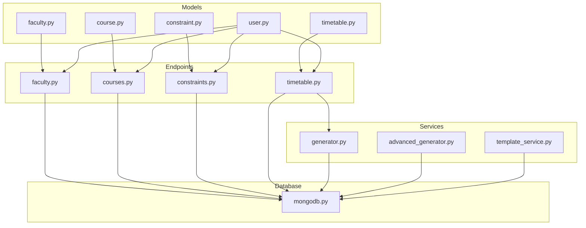
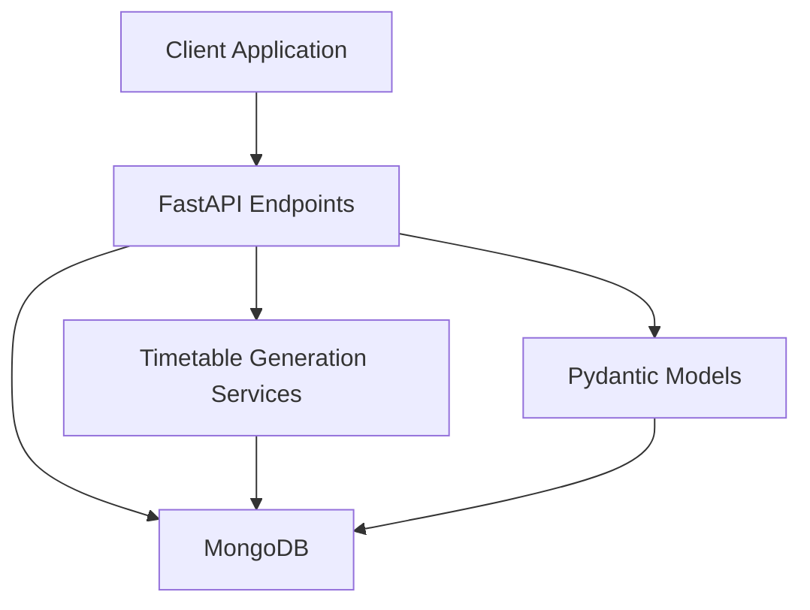
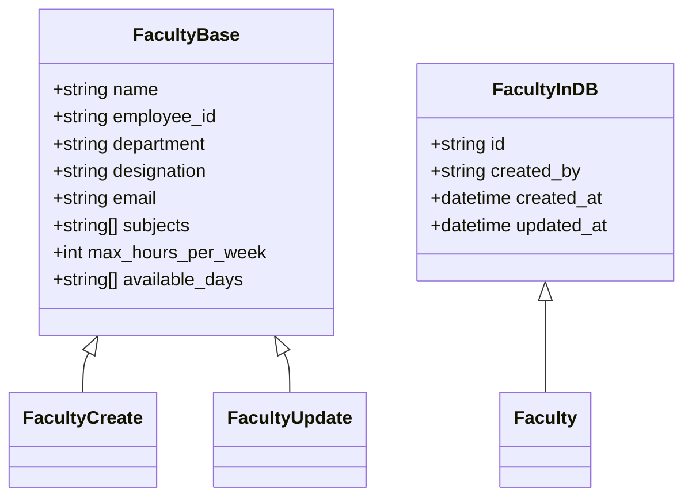
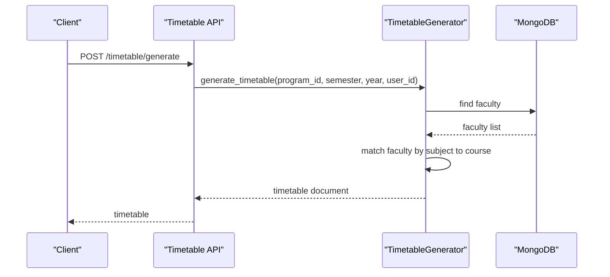
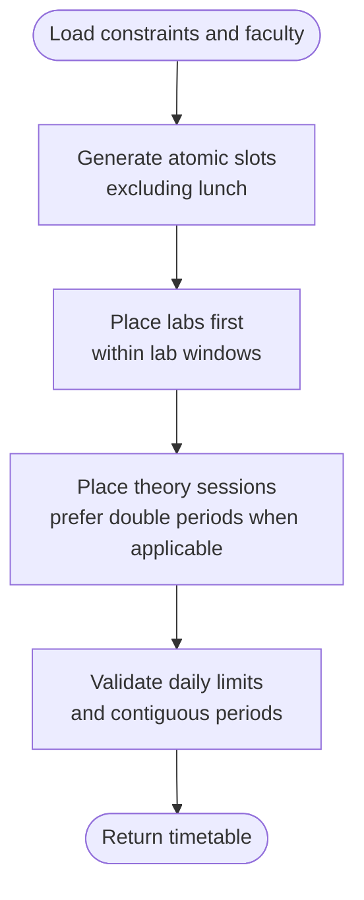
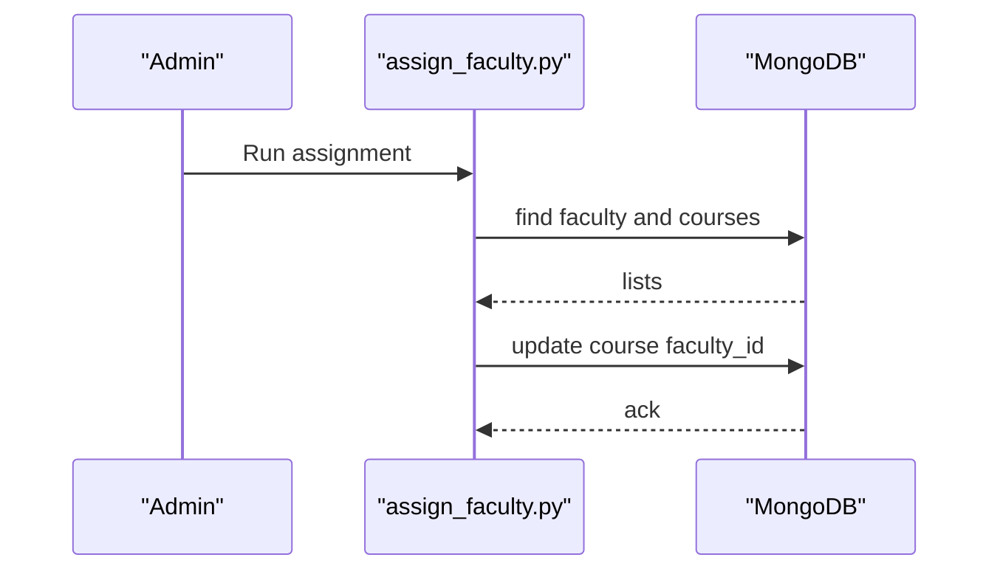
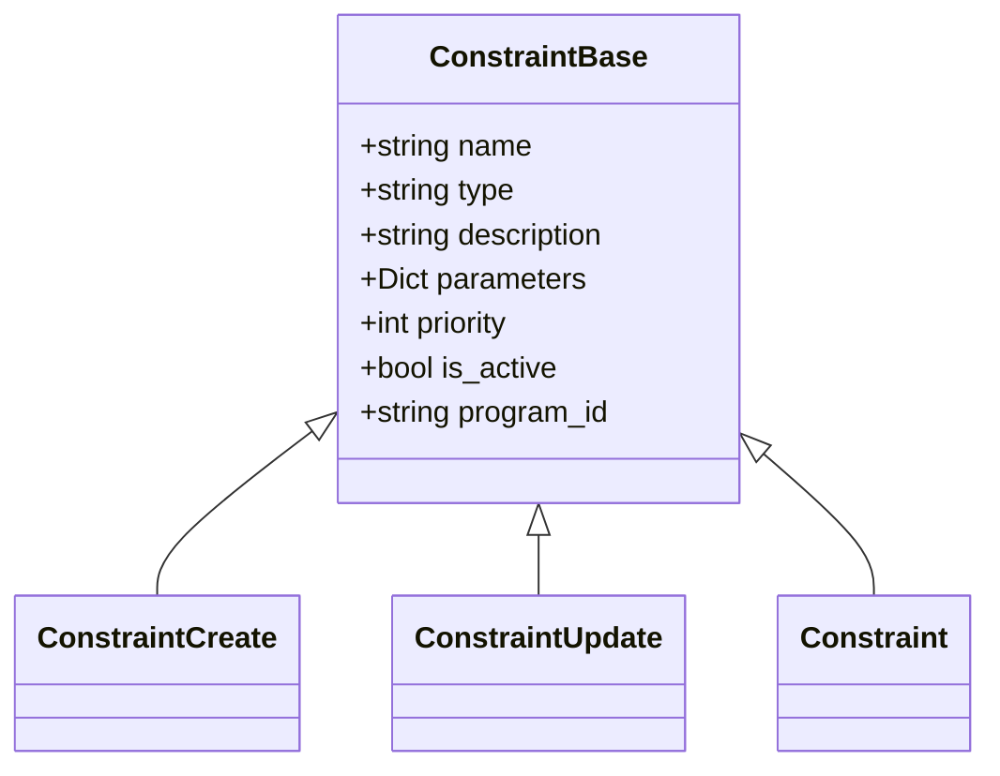
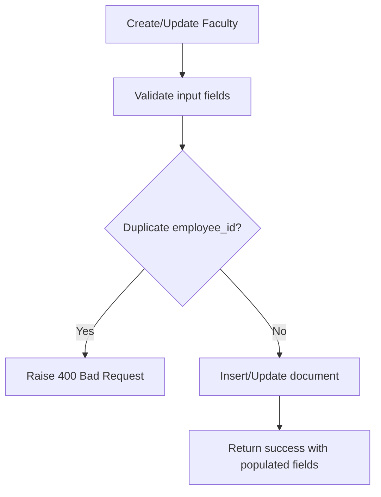
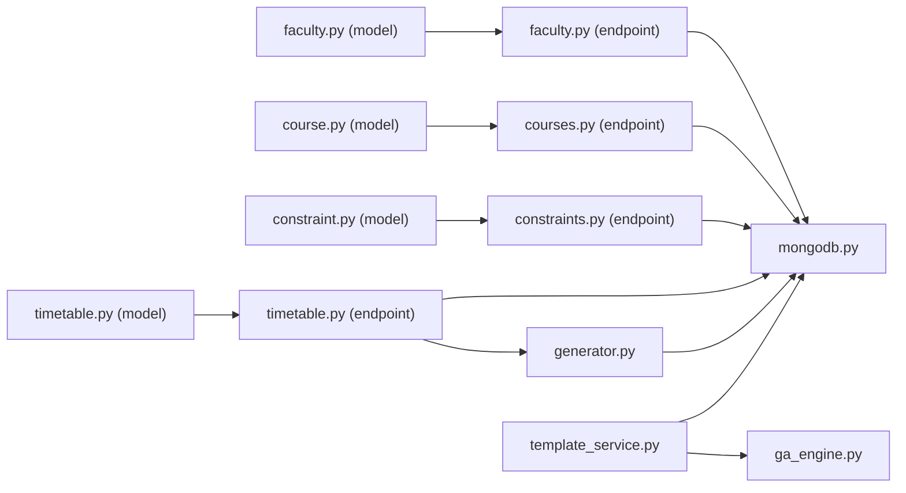

# Faculty Management System

<cite>
**Referenced Files in This Document**
- [faculty.py](file://backend/app/models/faculty.py)
- [faculty.py](file://backend/app/api/v1/endpoints/faculty.py)
- [mongodb.py](file://backend/app/db/mongodb.py)
- [generator.py](file://backend/app/services/timetable/generator.py)
- [timetable.py](file://backend/app/models/timetable.py)
- [timetable.py](file://backend/app/api/v1/endpoints/timetable.py)
- [course.py](file://backend/app/models/course.py)
- [courses.py](file://backend/app/api/v1/endpoints/courses.py)
- [constraint.py](file://backend/app/models/constraint.py)
- [constraints.py](file://backend/app/api/v1/endpoints/constraints.py)
- [user.py](file://backend/app/models/user.py)
- [import_faculty.py](file://backend/import_faculty.py)
- [assign_faculty.py](file://backend/assign_faculty.py)
- [advanced_generator.py](file://backend/app/services/timetable/advanced_generator.py)
- [template_service.py](file://backend/app/services/timetable/template_service.py)
</cite>

## Table of Contents
1. [Introduction](#introduction)
2. [Project Structure](#project-structure)
3. [Core Components](#core-components)
4. [Architecture Overview](#architecture-overview)
5. [Detailed Component Analysis](#detailed-component-analysis)
6. [Dependency Analysis](#dependency-analysis)
7. [Performance Considerations](#performance-considerations)
8. [Troubleshooting Guide](#troubleshooting-guide)
9. [Conclusion](#conclusion)

## Introduction
This document describes the Faculty Management System, focusing on faculty member registration, profile management, academic qualification tracking, availability management, assignment capabilities, scheduling constraints, data validation rules, API endpoints, and integration with timetable generation. It synthesizes backend components that handle faculty records, constraints, courses, and timetable generation, and explains how they work together to support automated scheduling and conflict detection.

## Project Structure
The system is organized around FastAPI endpoints, Pydantic models, MongoDB persistence, and timetable generation services. Key areas:
- Models define schemas for faculty, courses, constraints, and timetables
- Endpoints expose CRUD APIs for faculty and timetable operations
- Services implement timetable generation and constraint enforcement
- Database layer connects to MongoDB for persistence

**Diagram sources**
- [faculty.py:1-39](file://backend/app/models/faculty.py#L1-L39)
- [course.py:1-43](file://backend/app/models/course.py#L1-L43)
- [constraint.py:1-30](file://backend/app/models/constraint.py#L1-L30)
- [timetable.py:1-52](file://backend/app/models/timetable.py#L1-L52)
- [user.py:1-76](file://backend/app/models/user.py#L1-L76)
- [faculty.py:1-265](file://backend/app/api/v1/endpoints/faculty.py#L1-L265)
- [courses.py:1-279](file://backend/app/api/v1/endpoints/courses.py#L1-L279)
- [constraints.py:1-189](file://backend/app/api/v1/endpoints/constraints.py#L1-L189)
- [timetable.py:1-728](file://backend/app/api/v1/endpoints/timetable.py#L1-L728)
- [generator.py:1-402](file://backend/app/services/timetable/generator.py#L1-L402)
- [advanced_generator.py:1-707](file://backend/app/services/timetable/advanced_generator.py#L1-L707)
- [template_service.py:1-486](file://backend/app/services/timetable/template_service.py#L1-L486)
- [mongodb.py:1-41](file://backend/app/db/mongodb.py#L1-L41)

**Section sources**
- [faculty.py:1-39](file://backend/app/models/faculty.py#L1-L39)
- [faculty.py:1-265](file://backend/app/api/v1/endpoints/faculty.py#L1-L265)
- [mongodb.py:1-41](file://backend/app/db/mongodb.py#L1-L41)

## Core Components
- Faculty model and API: Defines faculty profile fields, validation rules, and CRUD endpoints with user isolation and duplicate checks
- Courses model and API: Manages course definitions and CRUD operations
- Constraints model and API: Manages scheduling constraints with type taxonomy and validation
- Timetable model and API: Encapsulates timetable structure and exposes generation endpoints
- Timetable generation services: Implement constraint-based placement of theory and lab sessions, with occupancy tracking and validation
- Database connectivity: Async MongoDB client with connection lifecycle management

**Section sources**
- [faculty.py:1-39](file://backend/app/models/faculty.py#L1-L39)
- [faculty.py:1-265](file://backend/app/api/v1/endpoints/faculty.py#L1-L265)
- [course.py:1-43](file://backend/app/models/course.py#L1-L43)
- [courses.py:1-279](file://backend/app/api/v1/endpoints/courses.py#L1-L279)
- [constraint.py:1-30](file://backend/app/models/constraint.py#L1-L30)
- [constraints.py:1-189](file://backend/app/api/v1/endpoints/constraints.py#L1-L189)
- [timetable.py:1-52](file://backend/app/models/timetable.py#L1-L52)
- [timetable.py:1-728](file://backend/app/api/v1/endpoints/timetable.py#L1-L728)
- [generator.py:1-402](file://backend/app/services/timetable/generator.py#L1-L402)
- [mongodb.py:1-41](file://backend/app/db/mongodb.py#L1-L41)

## Architecture Overview
The system follows a layered architecture:
- Presentation: FastAPI endpoints
- Domain: Pydantic models for data contracts
- Persistence: MongoDB via Motor async client
- Business logic: Timetable generation services enforcing hard and soft constraints

**Diagram sources**
- [timetable.py:1-728](file://backend/app/api/v1/endpoints/timetable.py#L1-L728)
- [generator.py:1-402](file://backend/app/services/timetable/generator.py#L1-L402)
- [mongodb.py:1-41](file://backend/app/db/mongodb.py#L1-L41)

## Detailed Component Analysis

### Faculty Registration and Profile Management
- Data model: Includes personal info, department, designation, email, subjects, max weekly hours, and available days
- Validation: Fields constrained with types, sizes, and ranges; max hours constrained to a safe range
- CRUD endpoints:
  - List all faculty
  - Create faculty with uniqueness check on employee ID per user
  - Retrieve by ID with user isolation
  - Update with selective field updates and duplicate checks
  - Delete with user isolation
- Data import: CSV importer creates faculty records with defaults and admin ownership

**Diagram sources**
- [faculty.py:5-38](file://backend/app/models/faculty.py#L5-L38)

**Section sources**
- [faculty.py:1-39](file://backend/app/models/faculty.py#L1-L39)
- [faculty.py:13-265](file://backend/app/api/v1/endpoints/faculty.py#L13-L265)
- [import_faculty.py:1-37](file://backend/import_faculty.py#L1-L37)

### Academic Qualification Tracking
- The faculty model supports storing subjects as taught disciplines, enabling course-to-faculty matching during timetable generation
- During generation, faculty candidates are selected based on subject match against course identifiers

**Diagram sources**
- [timetable.py:234-264](file://backend/app/api/v1/endpoints/timetable.py#L234-L264)
- [generator.py:209-233](file://backend/app/services/timetable/generator.py#L209-L233)

**Section sources**
- [generator.py:209-233](file://backend/app/services/timetable/generator.py#L209-L233)

### Faculty Availability Management and Workload Distribution
- Availability: Faculty records include available days; generation logic respects daily slot availability and constraints
- Workload: Max hours per week enforced via model constraints; generation enforces daily limits and contiguous period limits
- Constraints: Time settings (start/end, lunch break, period length, passing gap) and daily caps are loaded from constraints and applied during slot generation

**Diagram sources**
- [generator.py:95-147](file://backend/app/services/timetable/generator.py#L95-L147)
- [generator.py:273-379](file://backend/app/services/timetable/generator.py#L273-L379)

**Section sources**
- [generator.py:95-147](file://backend/app/services/timetable/generator.py#L95-L147)
- [generator.py:273-379](file://backend/app/services/timetable/generator.py#L273-L379)

### Faculty Assignment Capabilities
- Manual assignment: Utility script assigns faculty to courses randomly if not already assigned
- Automated assignment: Timetable generator selects faculty based on subject match and availability
- Template-based assignment: Template service orchestrates GA engine to allocate rooms, groups, and faculty consistently

**Diagram sources**
- [assign_faculty.py:1-24](file://backend/assign_faculty.py#L1-L24)

**Section sources**
- [assign_faculty.py:1-24](file://backend/assign_faculty.py#L1-L24)
- [template_service.py:319-326](file://backend/app/services/timetable/template_service.py#L319-L326)

### Scheduling Constraints: Preferred Hours, Departmental Allocations, Administrative Responsibilities
- Constraint types: Faculty availability, room capacity, time preferences, prerequisites, workload, room type requirements, block scheduling, gap minimization, consecutive classes, NEP compliance
- Constraint loading: Timetable generation aggregates active constraints per program and applies them to slot selection and validation
- Time settings: Start/end times, lunch break, period length, passing gap, max periods per day, max contiguous periods, and lab windows are derived from constraints

**Diagram sources**
- [constraint.py:6-29](file://backend/app/models/constraint.py#L6-L29)

**Section sources**
- [constraints.py:115-149](file://backend/app/api/v1/endpoints/constraints.py#L115-L149)
- [generator.py:95-122](file://backend/app/services/timetable/generator.py#L95-L122)

### Data Validation Rules for Faculty Profiles
- Employee ID uniqueness: Creation and update endpoints check for duplicates per user
- Field validation: Ranges and types enforced by Pydantic models (e.g., max hours per week)
- ObjectId validation: Endpoint handlers validate IDs before queries
- User isolation: All reads/writes filter by created_by to ensure tenant isolation

**Diagram sources**
- [faculty.py:52-62](file://backend/app/api/v1/endpoints/faculty.py#L52-L62)
- [faculty.py:176-188](file://backend/app/api/v1/endpoints/faculty.py#L176-L188)

**Section sources**
- [faculty.py:52-62](file://backend/app/api/v1/endpoints/faculty.py#L52-L62)
- [faculty.py:176-188](file://backend/app/api/v1/endpoints/faculty.py#L176-L188)

### API Endpoints for Faculty, Availability, and Assignment
- Faculty endpoints:
  - GET /faculty: List all faculty
  - POST /faculty: Create faculty with uniqueness check
  - GET /faculty/{faculty_id}: Retrieve by ID with user isolation
  - PUT /faculty/{faculty_id}: Update with selective fields and duplicate checks
  - DELETE /faculty/{faculty_id}: Delete with user isolation
- Timetable endpoints:
  - GET /timetable: List timetables with filters and user isolation
  - POST /timetable/generate: Generate timetable using rules-based generator
  - POST /timetable/generate-advanced: Template-based generation with GA
  - POST /timetable/generate-nep-ga: NEP-compliant genetic algorithm generation
  - Other endpoints for draft saving, validation, optimization, export, and CRUD on timetables

**Section sources**
- [faculty.py:13-265](file://backend/app/api/v1/endpoints/faculty.py#L13-L265)
- [timetable.py:17-728](file://backend/app/api/v1/endpoints/timetable.py#L17-L728)

### Examples and Scenarios
- Faculty profile configuration:
  - Create a faculty with name, employee ID, department, designation, email, subjects, max hours per week, and available days
  - Update profile fields selectively; ensure employee ID remains unique per user
- Availability scheduling:
  - Define constraints for working days, start/end times, lunch break, and max periods per day
  - Generate timetable ensuring labs are placed within lab windows and theory sessions respect contiguous period limits
- Workload balancing:
  - Enforce max hours per week and daily caps; prefer spreading heavy theory courses across days
  - Use NEP GA engine to optimize fitness and compliance scores

[No sources needed since this section provides scenario descriptions without quoting specific code]

## Dependency Analysis
- Faculty model depends on Pydantic for validation
- Endpoints depend on MongoDB for persistence and on user context for isolation
- Timetable generation depends on constraints and faculty/course data
- Template service integrates GA engine for allocation decisions

**Diagram sources**
- [faculty.py:1-39](file://backend/app/models/faculty.py#L1-L39)
- [faculty.py:1-265](file://backend/app/api/v1/endpoints/faculty.py#L1-L265)
- [course.py:1-43](file://backend/app/models/course.py#L1-L43)
- [courses.py:1-279](file://backend/app/api/v1/endpoints/courses.py#L1-L279)
- [constraint.py:1-30](file://backend/app/models/constraint.py#L1-L30)
- [constraints.py:1-189](file://backend/app/api/v1/endpoints/constraints.py#L1-L189)
- [timetable.py:1-52](file://backend/app/models/timetable.py#L1-L52)
- [timetable.py:1-728](file://backend/app/api/v1/endpoints/timetable.py#L1-L728)
- [generator.py:1-402](file://backend/app/services/timetable/generator.py#L1-L402)
- [template_service.py:1-486](file://backend/app/services/timetable/template_service.py#L1-L486)

**Section sources**
- [mongodb.py:1-41](file://backend/app/db/mongodb.py#L1-L41)

## Performance Considerations
- Asynchronous MongoDB operations reduce latency under load
- Constraint-driven slot generation avoids scanning all possible slots unnecessarily
- Template-based generation with GA reduces brute-force search space
- Daily and contiguous period checks short-circuit invalid placements early

[No sources needed since this section provides general guidance]

## Troubleshooting Guide
- Connection issues: Verify MongoDB URL and database name; the connection module logs failures and continues without DB for testing
- Authorization: Ensure requests include a valid user context; endpoints enforce user isolation via created_by filters
- Duplicate employee ID: Creation and update endpoints explicitly check for duplicates per user
- Invalid IDs: Handlers validate ObjectId format and return 400 for malformed IDs
- Timetable generation failures: Generator raises exceptions when courses cannot be placed; review constraints and resource availability

**Section sources**
- [mongodb.py:11-41](file://backend/app/db/mongodb.py#L11-L41)
- [faculty.py:109-113](file://backend/app/api/v1/endpoints/faculty.py#L109-L113)
- [faculty.py:149-153](file://backend/app/api/v1/endpoints/faculty.py#L149-L153)
- [timetable.py:244-264](file://backend/app/api/v1/endpoints/timetable.py#L244-L264)

## Conclusion
The Faculty Management System provides robust faculty profile management, constraint-driven scheduling, and automated timetable generation. Its modular design separates concerns across models, endpoints, services, and persistence, enabling scalable enhancements such as NEP compliance and advanced optimization strategies.