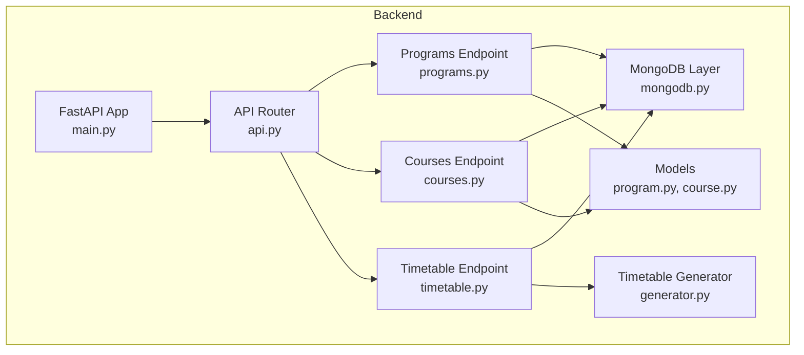
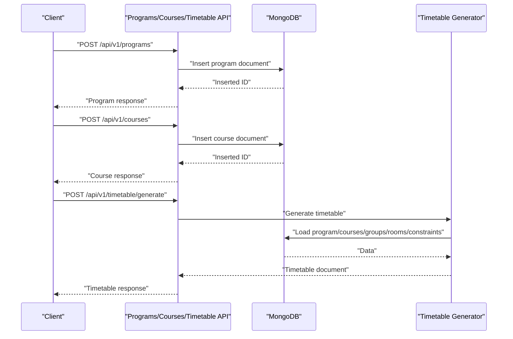
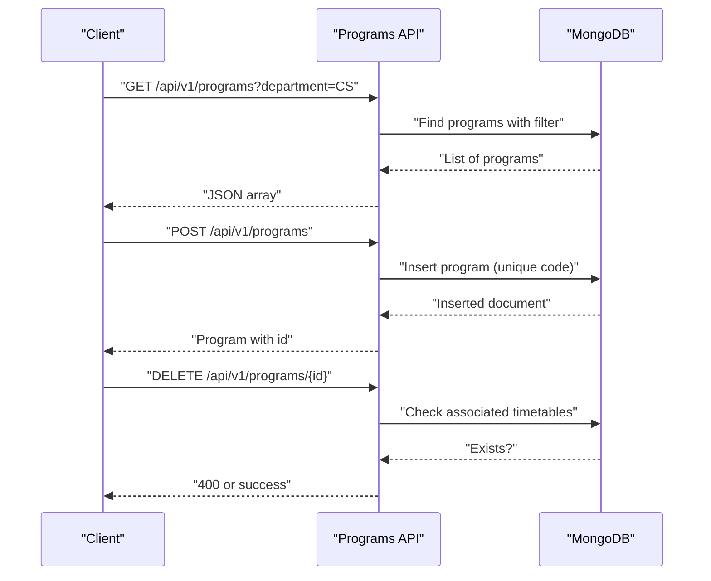
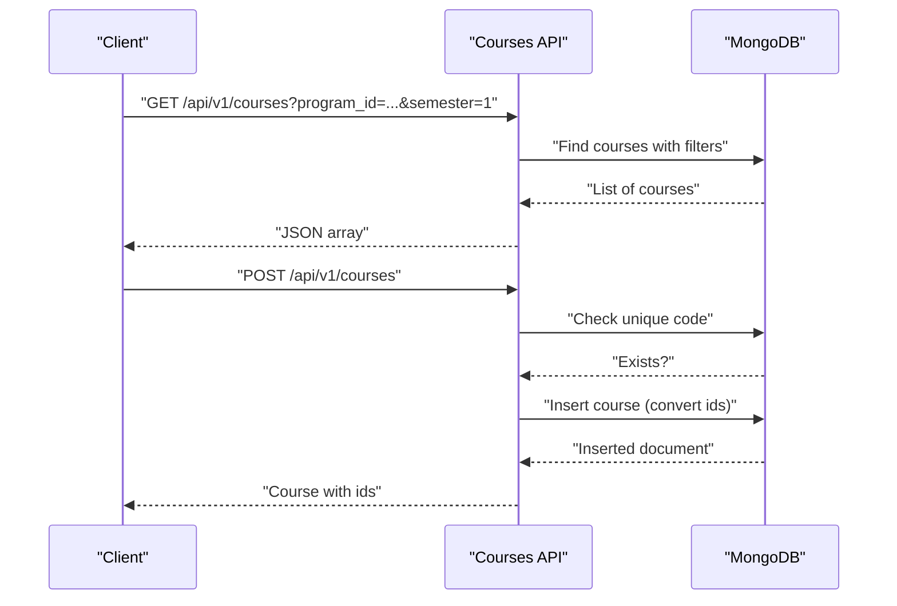
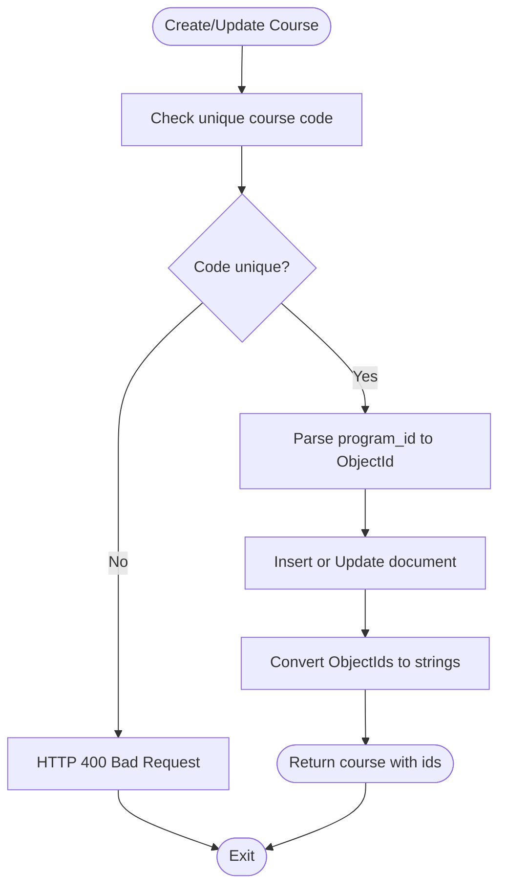
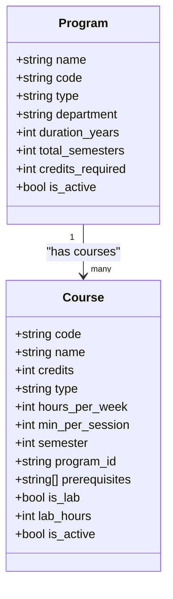
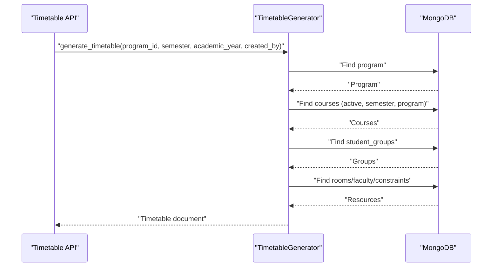
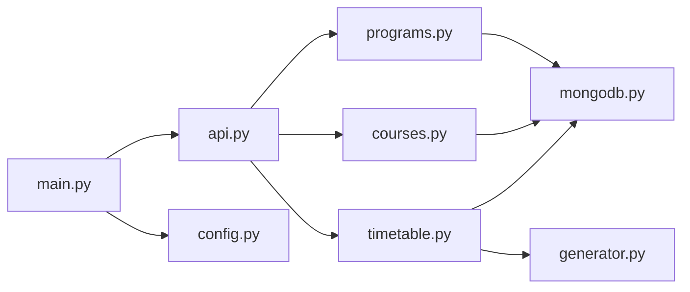

# Program and Course Management

<cite>
**Referenced Files in This Document**
- [program.py](file://backend/app/models/program.py)
- [course.py](file://backend/app/models/course.py)
- [programs.py](file://backend/app/api/v1/endpoints/programs.py)
- [courses.py](file://backend/app/api/v1/endpoints/courses.py)
- [mongodb.py](file://backend/app/db/mongodb.py)
- [config.py](file://backend/app/core/config.py)
- [generator.py](file://backend/app/services/timetable/generator.py)
- [timetable.py](file://backend/app/api/v1/endpoints/timetable.py)
- [api.py](file://backend/app/api/api_v1/api.py)
- [main.py](file://backend/app/main.py)
- [courses.csv](file://archive/courses.csv)
</cite>

## Table of Contents
1. [Introduction](#introduction)
2. [Project Structure](#project-structure)
3. [Core Components](#core-components)
4. [Architecture Overview](#architecture-overview)
5. [Detailed Component Analysis](#detailed-component-analysis)
6. [Dependency Analysis](#dependency-analysis)
7. [Performance Considerations](#performance-considerations)
8. [Troubleshooting Guide](#troubleshooting-guide)
9. [Conclusion](#conclusion)
10. [Appendices](#appendices)

## Introduction
This document describes the program and course management subsystem of the academic scheduling platform. It covers academic program administration (creation, modification, deletion), course catalog management (specification, prerequisites, academic requirements), data validation rules, API endpoints for CRUD operations, the relationship between programs and courses across academic years and semesters, examples of program structure and academic progression, and integration with timetable generation for scheduling and resource allocation.

## Project Structure
The backend is organized around a FastAPI application with Pydantic models, MongoDB persistence, and service layers for timetable generation. The program and course management features are exposed via dedicated API endpoints grouped under `/api/v1`.

**Diagram sources**
- [main.py:33-102](file://backend/app/main.py#L33-L102)
- [api.py:1-34](file://backend/app/api/api_v1/api.py#L1-L34)
- [programs.py:1-288](file://backend/app/api/v1/endpoints/programs.py#L1-L288)
- [courses.py:1-279](file://backend/app/api/v1/endpoints/courses.py#L1-L279)
- [timetable.py:1-728](file://backend/app/api/v1/endpoints/timetable.py#L1-L728)
- [mongodb.py:1-41](file://backend/app/db/mongodb.py#L1-L41)
- [program.py:1-33](file://backend/app/models/program.py#L1-L33)
- [course.py:1-43](file://backend/app/models/course.py#L1-L43)
- [generator.py:1-402](file://backend/app/services/timetable/generator.py#L1-L402)

**Section sources**
- [main.py:33-102](file://backend/app/main.py#L33-L102)
- [api.py:1-34](file://backend/app/api/api_v1/api.py#L1-L34)

## Core Components
- Program model defines academic program attributes and validation constraints.
- Course model defines course attributes, including semester mapping and prerequisites.
- Programs API provides CRUD operations with admin-only write permissions and program-specific course retrieval/statistics.
- Courses API provides CRUD operations with uniqueness checks and ObjectId conversions.
- MongoDB layer manages asynchronous connections and database access.
- Timetable generator consumes program and course data to build schedules aligned with constraints and rules.

**Section sources**
- [program.py:6-33](file://backend/app/models/program.py#L6-L33)
- [course.py:6-43](file://backend/app/models/course.py#L6-L43)
- [programs.py:100-288](file://backend/app/api/v1/endpoints/programs.py#L100-L288)
- [courses.py:12-279](file://backend/app/api/v1/endpoints/courses.py#L12-L279)
- [mongodb.py:5-41](file://backend/app/db/mongodb.py#L5-L41)
- [generator.py:169-233](file://backend/app/services/timetable/generator.py#L169-L233)

## Architecture Overview
The system follows a layered architecture:
- Presentation: FastAPI endpoints for programs, courses, and timetable.
- Domain: Pydantic models define data contracts and validation.
- Persistence: Motor client connects to MongoDB collections.
- Services: Timetable generation orchestrates course, group, room, and faculty data.

**Diagram sources**
- [programs.py:100-171](file://backend/app/api/v1/endpoints/programs.py#L100-L171)
- [courses.py:58-126](file://backend/app/api/v1/endpoints/courses.py#L58-L126)
- [timetable.py:234-264](file://backend/app/api/v1/endpoints/timetable.py#L234-L264)
- [generator.py:235-401](file://backend/app/services/timetable/generator.py#L235-L401)
- [mongodb.py:11-41](file://backend/app/db/mongodb.py#L11-L41)

## Detailed Component Analysis

### Academic Program Administration
Programs represent academic tracks with metadata such as type, department, duration, total semesters, and credit requirements. The API enforces admin-only modifications and prevents deletion if associated timetables exist.

Key capabilities:
- List programs with optional filters (type, department).
- Retrieve a single program by ID.
- Create a program with unique code enforcement.
- Update a program with selective field updates.
- Delete a program with cascade protection against existing timetables.
- Retrieve program courses filtered by semester.
- Compute program statistics (course counts, timetable counts, per-semester breakdown).

**Diagram sources**
- [programs.py:12-98](file://backend/app/api/v1/endpoints/programs.py#L12-L98)
- [programs.py:100-171](file://backend/app/api/v1/endpoints/programs.py#L100-L171)
- [programs.py:172-199](file://backend/app/api/v1/endpoints/programs.py#L172-L199)
- [programs.py:201-248](file://backend/app/api/v1/endpoints/programs.py#L201-L248)
- [programs.py:250-287](file://backend/app/api/v1/endpoints/programs.py#L250-L287)

**Section sources**
- [program.py:6-33](file://backend/app/models/program.py#L6-L33)
- [programs.py:12-287](file://backend/app/api/v1/endpoints/programs.py#L12-L287)

### Course Catalog Management
Courses are defined with attributes including code, name, credits, type, weekly hours, session length, semester mapping, program association, prerequisites, lab flags, and activity status. The API ensures:
- Unique course codes.
- ObjectId conversion for identifiers.
- Validation of program_id format during create/update.
- Filtering by program_id and semester.
- Prerequisite lists for course relationships.

**Diagram sources**
- [courses.py:12-56](file://backend/app/api/v1/endpoints/courses.py#L12-L56)
- [courses.py:58-126](file://backend/app/api/v1/endpoints/courses.py#L58-L126)
- [courses.py:128-230](file://backend/app/api/v1/endpoints/courses.py#L128-L230)

**Section sources**
- [course.py:6-43](file://backend/app/models/course.py#L6-L43)
- [courses.py:12-279](file://backend/app/api/v1/endpoints/courses.py#L12-L279)

### Data Validation Rules and Business Logic
Validation and constraints:
- Program model enforces presence of core fields and defaults for response normalization.
- Course model enforces numeric bounds for credits, hours, and session length; optional semester and program linkage; prerequisites as a list; lab flags and hours; activity flag.
- Programs API:
  - Admin-only write operations.
  - Unique program code enforcement.
  - Deletion blocked if associated timetables exist.
  - ObjectId parsing/validation for identifiers.
- Courses API:
  - Unique course code enforcement.
  - Program ID conversion to ObjectId when present.
  - Update validation for code changes and ObjectId format.
  - ObjectId conversion for all identifiers in responses.

**Diagram sources**
- [courses.py:67-91](file://backend/app/api/v1/endpoints/courses.py#L67-L91)
- [courses.py:170-180](file://backend/app/api/v1/endpoints/courses.py#L170-L180)
- [courses.py:100-108](file://backend/app/api/v1/endpoints/courses.py#L100-L108)

**Section sources**
- [program.py:6-33](file://backend/app/models/program.py#L6-L33)
- [course.py:6-43](file://backend/app/models/course.py#L6-L43)
- [programs.py:113-121](file://backend/app/api/v1/endpoints/programs.py#L113-L121)
- [courses.py:67-91](file://backend/app/api/v1/endpoints/courses.py#L67-L91)
- [courses.py:170-180](file://backend/app/api/v1/endpoints/courses.py#L170-L180)

### API Endpoints: Programs and Courses CRUD
Endpoints summary:
- Programs:
  - GET /api/v1/programs (list with filters)
  - GET /api/v1/programs/{id} (retrieve)
  - POST /api/v1/programs (create)
  - PUT /api/v1/programs/{id} (update)
  - DELETE /api/v1/programs/{id} (delete)
  - GET /api/v1/programs/{id}/courses (list program courses)
  - GET /api/v1/programs/{id}/statistics (program stats)
- Courses:
  - GET /api/v1/courses (list with filters)
  - POST /api/v1/courses (create)
  - PUT /api/v1/courses/{id} (update)
  - DELETE /api/v1/courses/{id} (delete)

Request/response characteristics:
- Requests use Pydantic models for validation.
- Responses convert ObjectId fields to strings for JSON compatibility.
- Error responses use standard HTTP status codes with descriptive messages.

**Section sources**
- [programs.py:12-287](file://backend/app/api/v1/endpoints/programs.py#L12-L287)
- [courses.py:12-279](file://backend/app/api/v1/endpoints/courses.py#L12-L279)

### Academic Hierarchy and Progression Rules
Relationships:
- Courses belong to a Program via program_id and are mapped to specific semesters.
- Prerequisites define course ordering within a program.
- Academic progression is enforced implicitly by requiring prerequisite fulfillment before enrolling in dependent courses.

Integration with timetable generation:
- The generator loads active courses for a given program and semester, along with student groups, rooms, and constraints.
- It builds a timetable respecting rules such as max periods per day, contiguous sessions, lab windows, and faculty/group/room availability.

**Diagram sources**
- [program.py:6-33](file://backend/app/models/program.py#L6-L33)
- [course.py:6-43](file://backend/app/models/course.py#L6-L43)

**Section sources**
- [generator.py:169-233](file://backend/app/services/timetable/generator.py#L169-L233)
- [course.py:13-18](file://backend/app/models/course.py#L13-L18)

### Examples and Use Cases
- Program structure definition:
  - Define program metadata (type, department, duration, total semesters, credits required).
  - Map courses to semesters within the program.
- Course enrollment requirements:
  - Specify prerequisites as a list of course codes/IDs.
  - Enforce prerequisite fulfillment before allowing enrollment in dependent courses.
- Academic progression rules:
  - Courses are scheduled per semester; progression follows semester sequencing.
  - Lab courses are scheduled in designated windows and respect capacity and equipment constraints.

**Section sources**
- [program.py:6-33](file://backend/app/models/program.py#L6-L33)
- [course.py:13-18](file://backend/app/models/course.py#L13-L18)
- [generator.py:273-302](file://backend/app/services/timetable/generator.py#L273-L302)
- [generator.py:303-379](file://backend/app/services/timetable/generator.py#L303-L379)

### Integration with Timetable Generation
The timetable generation pipeline integrates program and course data:
- Loads program metadata and active courses for a specific semester.
- Loads student groups linked to the program.
- Applies constraints and rules to allocate rooms, faculty, and time slots.
- Produces a timetable document with entries and metadata.

**Diagram sources**
- [timetable.py:234-264](file://backend/app/api/v1/endpoints/timetable.py#L234-L264)
- [generator.py:169-233](file://backend/app/services/timetable/generator.py#L169-L233)
- [generator.py:235-401](file://backend/app/services/timetable/generator.py#L235-L401)

**Section sources**
- [timetable.py:234-264](file://backend/app/api/v1/endpoints/timetable.py#L234-L264)
- [generator.py:169-233](file://backend/app/services/timetable/generator.py#L169-L233)
- [generator.py:235-401](file://backend/app/services/timetable/generator.py#L235-L401)

## Dependency Analysis
- FastAPI app registers routers for programs, courses, and timetable.
- Endpoints depend on MongoDB for persistence.
- Timetable generation depends on program/course data and constraints.
- Configuration drives database connection settings.

**Diagram sources**
- [main.py:101](file://backend/app/main.py#L101)
- [api.py:22-33](file://backend/app/api/api_v1/api.py#L22-L33)
- [programs.py:6](file://backend/app/api/v1/endpoints/programs.py#L6)
- [courses.py:6](file://backend/app/api/v1/endpoints/courses.py#L6)
- [timetable.py:11](file://backend/app/api/v1/endpoints/timetable.py#L11)
- [mongodb.py:1-41](file://backend/app/db/mongodb.py#L1-L41)
- [generator.py:1-402](file://backend/app/services/timetable/generator.py#L1-L402)
- [config.py:25-27](file://backend/app/core/config.py#L25-L27)

**Section sources**
- [main.py:101](file://backend/app/main.py#L101)
- [api.py:22-33](file://backend/app/api/api_v1/api.py#L22-L33)
- [mongodb.py:11-41](file://backend/app/db/mongodb.py#L11-L41)
- [config.py:25-27](file://backend/app/core/config.py#L25-L27)

## Performance Considerations
- Database queries use filters and limits; pagination parameters are validated to avoid excessive loads.
- ObjectId conversions occur in memory; ensure efficient handling for large result sets.
- Timetable generation involves multiple collection reads and aggregation; consider indexing on frequently queried fields (program_id, semester, is_active).
- Connection timeouts are configured for MongoDB; ensure robust retry/backoff in production deployments.

[No sources needed since this section provides general guidance]

## Troubleshooting Guide
Common issues and resolutions:
- Database connectivity failures:
  - The application attempts to connect to MongoDB and logs warnings if unavailable; API continues running for testing.
  - Verify MONGODB_URL and DATABASE_NAME in configuration.
- Validation errors:
  - Request validation failures return structured error details; check required fields and data types.
- ObjectId errors:
  - Invalid identifiers trigger HTTP 400 responses; ensure correct ID formats.
- Permission errors:
  - Write operations require admin privileges; verify current user role.
- Deletion conflicts:
  - Programs with associated timetables cannot be deleted; remove dependencies first.

**Section sources**
- [mongodb.py:11-32](file://backend/app/db/mongodb.py#L11-L32)
- [main.py:42-54](file://backend/app/main.py#L42-L54)
- [programs.py:113-121](file://backend/app/api/v1/endpoints/programs.py#L113-L121)
- [programs.py:181-195](file://backend/app/api/v1/endpoints/programs.py#L181-L195)
- [courses.py:138-145](file://backend/app/api/v1/endpoints/courses.py#L138-L145)

## Conclusion
The program and course management system provides a robust foundation for academic administration with strong validation, clear API contracts, and seamless integration with timetable generation. Admin controls protect critical data, while flexible filtering and statistics endpoints support operational insights. The modular design enables extension for advanced academic rules and NEP-compliant scheduling workflows.

[No sources needed since this section summarizes without analyzing specific files]

## Appendices

### Appendix A: Configuration Reference
- Database:
  - MONGODB_URL: MongoDB connection string.
  - DATABASE_NAME: Target database name.
- API:
  - API_V1_STR: Base path for API version 1.
  - ALLOWED_ORIGINS: CORS configuration for frontend domains.

**Section sources**
- [config.py:25-27](file://backend/app/core/config.py#L25-L27)
- [config.py:10-12](file://backend/app/core/config.py#L10-L12)
- [config.py:14-23](file://backend/app/core/config.py#L14-L23)

### Appendix B: Sample Course Data
Sample course records demonstrate typical fields such as course code, name, credits, and description.

**Section sources**
- [courses.csv:1-40](file://archive/courses.csv#L1-L40)