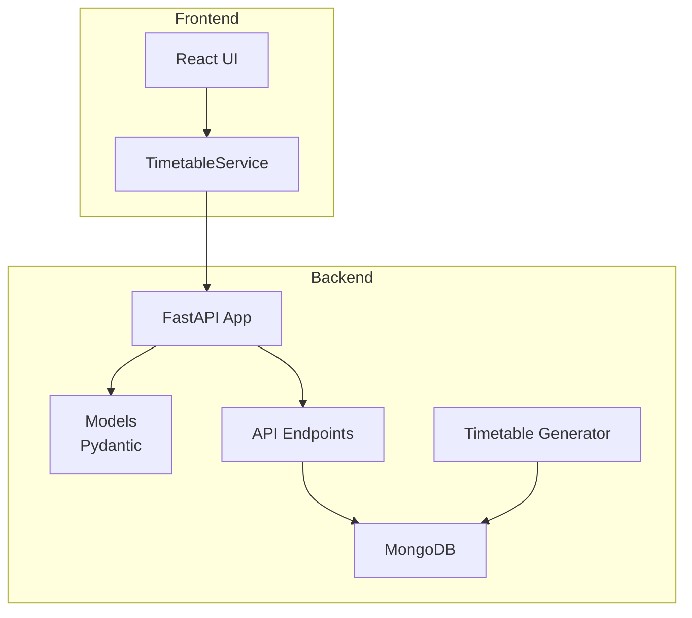
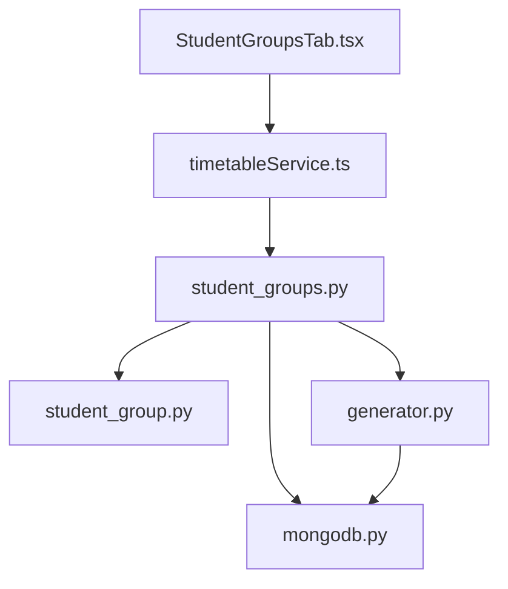
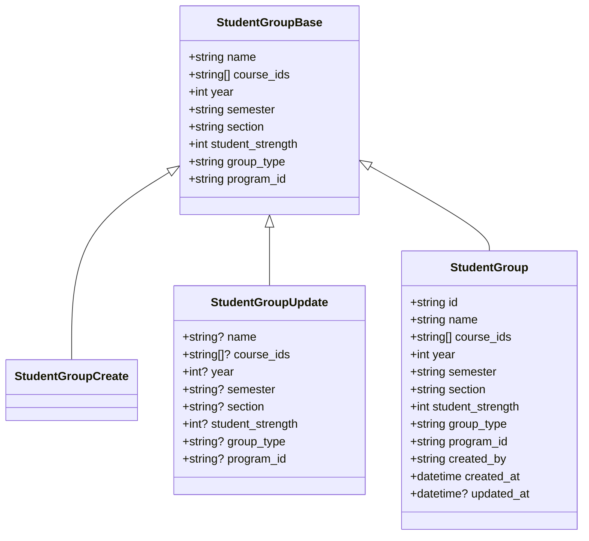
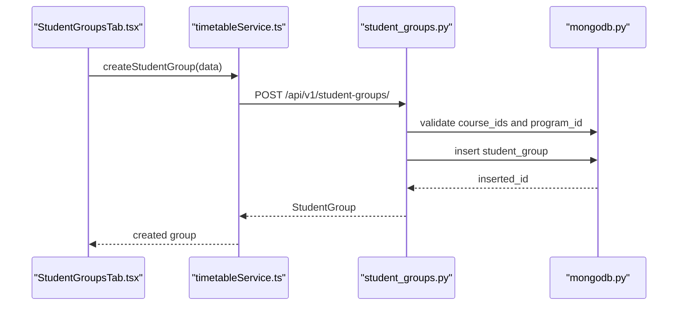
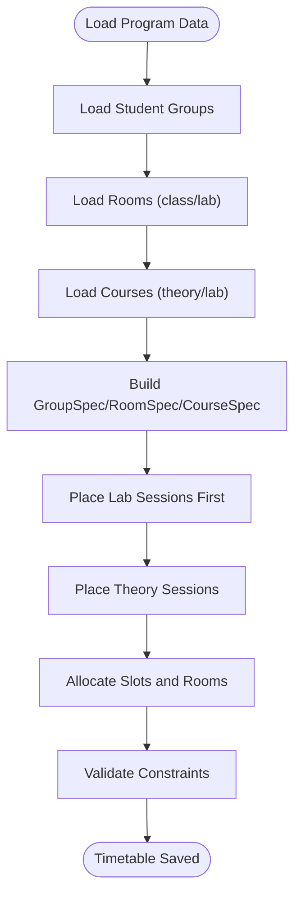
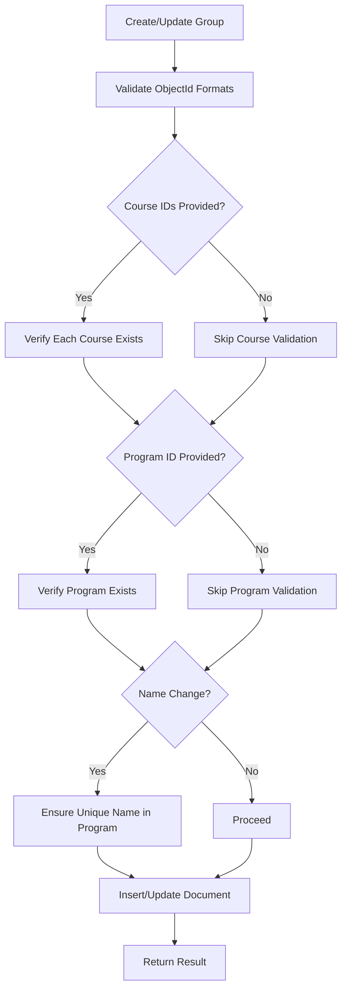
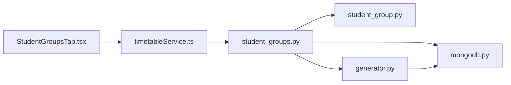

# Student Group Management

<cite>
**Referenced Files in This Document**
- [student_group.py](file://backend/app/models/student_group.py)
- [student_groups.py](file://backend/app/api/v1/endpoints/student_groups.py)
- [mongodb.py](file://backend/app/db/mongodb.py)
- [generator.py](file://backend/app/services/timetable/generator.py)
- [StudentGroupsTab.tsx](file://frontend/src/components/pages/CreateTimetable/StudentGroupsTab.tsx)
- [timetableService.ts](file://frontend/src/services/timetableService.ts)
- [course.py](file://backend/app/models/course.py)
- [program.py](file://backend/app/models/program.py)
- [courses.py](file://backend/app/api/v1/endpoints/courses.py)
- [programs.py](file://backend/app/api/v1/endpoints/programs.py)
- [timetable.py](file://backend/app/api/v1/endpoints/timetable.py)
- [STUDENT_GROUPS_IMPLEMENTATION.md](file://STUDENT_GROUPS_IMPLEMENTATION.md)
</cite>

## Table of Contents
1. [Introduction](#introduction)
2. [Project Structure](#project-structure)
3. [Core Components](#core-components)
4. [Architecture Overview](#architecture-overview)
5. [Detailed Component Analysis](#detailed-component-analysis)
6. [Dependency Analysis](#dependency-analysis)
7. [Performance Considerations](#performance-considerations)
8. [Troubleshooting Guide](#troubleshooting-guide)
9. [Conclusion](#conclusion)
10. [Appendices](#appendices)

## Introduction
This document describes the student group management system that enables academic programs to define, track, and schedule student cohorts. It covers:
- Cohort configuration: group creation, enrollment tracking, and academic year management
- Hierarchy and classification: academic levels and specializations
- Enrollment management: adding/removing students, capacity limits, and prerequisite fulfillment
- Scheduling requirements: course enrollment patterns, group-specific activities, and resource allocation
- Data validation rules: enrollment constraints and academic progression
- API endpoints for CRUD operations, enrollment management, and capacity tracking
- Examples of cohort-based scheduling scenarios, group-specific course requirements, and validation processes
- Integration with timetable generation for group-based scheduling and resource optimization

## Project Structure
The system comprises:
- Backend: FastAPI application with Pydantic models, MongoDB persistence, and timetable generation services
- Frontend: React-based UI for creating and managing student groups and integrating with backend APIs
- Shared integration: TypeScript service layer for API communication

**Diagram sources**
- [student_groups.py:1-380](file://backend/app/api/v1/endpoints/student_groups.py#L1-L380)
- [generator.py:1-402](file://backend/app/services/timetable/generator.py#L1-L402)
- [timetableService.ts:1-772](file://frontend/src/services/timetableService.ts#L1-L772)

**Section sources**
- [STUDENT_GROUPS_IMPLEMENTATION.md:30-56](file://STUDENT_GROUPS_IMPLEMENTATION.md#L30-L56)

## Core Components
- StudentGroup model defines the cohort entity with attributes for name, courses, academic year, semester, section, student strength, group type, and program linkage.
- API endpoints provide full CRUD for student groups, including validation and user isolation.
- Frontend integrates with the backend via a typed service layer and a dedicated tab for managing student groups.
- Timetable generator consumes student groups to schedule theory and lab sessions, respecting capacities and constraints.

Key capabilities:
- Multiple course selection per group
- Academic year derived from program duration
- Section management and group types (Regular Class, Practical Lab)
- Capacity-driven scheduling and room allocation
- User-based access control and audit fields

**Section sources**
- [student_group.py:5-36](file://backend/app/models/student_group.py#L5-L36)
- [student_groups.py:13-380](file://backend/app/api/v1/endpoints/student_groups.py#L13-L380)
- [StudentGroupsTab.tsx:44-809](file://frontend/src/components/pages/CreateTimetable/StudentGroupsTab.tsx#L44-L809)
- [timetableService.ts:495-528](file://frontend/src/services/timetableService.ts#L495-L528)
- [generator.py:46-62](file://backend/app/services/timetable/generator.py#L46-L62)

## Architecture Overview
The system follows a layered architecture:
- Presentation: React UI with Material-UI components
- Service: Axios-based client for backend API calls
- Application: FastAPI endpoints with Pydantic validation
- Persistence: MongoDB collections for student groups, courses, programs, rooms, and timetables
- Intelligence: Timetable generator orchestrates scheduling using group specs, course specs, room specs, and rules

**Diagram sources**
- [StudentGroupsTab.tsx:44-809](file://frontend/src/components/pages/CreateTimetable/StudentGroupsTab.tsx#L44-L809)
- [timetableService.ts:495-528](file://frontend/src/services/timetableService.ts#L495-L528)
- [student_groups.py:1-380](file://backend/app/api/v1/endpoints/student_groups.py#L1-L380)
- [student_group.py:5-36](file://backend/app/models/student_group.py#L5-L36)
- [mongodb.py:5-41](file://backend/app/db/mongodb.py#L5-L41)
- [generator.py:169-233](file://backend/app/services/timetable/generator.py#L169-L233)

## Detailed Component Analysis

### StudentGroup Model and Validation
The model enforces:
- Required fields: name, course_ids, year, semester, section, student_strength, group_type, program_id
- Numeric bounds: year in [1..4], student_strength in [1..200]
- Enum-like semantics: semester and group_type constrained by accepted values
- Identity and audit: id, created_by, created_at, updated_at

**Diagram sources**
- [student_group.py:5-36](file://backend/app/models/student_group.py#L5-L36)

**Section sources**
- [student_group.py:5-36](file://backend/app/models/student_group.py#L5-L36)

### API Endpoints for Student Groups
Endpoints:
- GET /api/v1/student-groups/: list all groups (with optional program filter)
- POST /api/v1/student-groups/: create a group
- GET /api/v1/student-groups/{id}: retrieve a specific group
- PUT /api/v1/student-groups/{id}: update a group
- DELETE /api/v1/student-groups/{id}: delete a group
- GET /api/v1/student-groups/program/{program_id}/available-years: get available years for a program

Validation and security:
- Course existence checks before creation/update
- Program existence checks before creation/update
- Duplicate group name prevention within a user’s program
- ObjectId validation for IDs and foreign keys
- User isolation enforced by filtering queries by created_by

**Diagram sources**
- [StudentGroupsTab.tsx:121-187](file://frontend/src/components/pages/CreateTimetable/StudentGroupsTab.tsx#L121-L187)
- [timetableService.ts:506-509](file://frontend/src/services/timetableService.ts#L506-L509)
- [student_groups.py:59-137](file://backend/app/api/v1/endpoints/student_groups.py#L59-L137)
- [mongodb.py:5-41](file://backend/app/db/mongodb.py#L5-L41)

**Section sources**
- [student_groups.py:13-380](file://backend/app/api/v1/endpoints/student_groups.py#L13-L380)
- [timetable.py:234-264](file://backend/app/api/v1/endpoints/timetable.py#L234-L264)

### Enrollment Management and Capacity Tracking
Enrollment management:
- Student strength controls capacity for scheduling
- Group type distinguishes theory (Regular Class) and lab (Practical Lab)
- Course selection ties groups to specific courses

Capacity and scheduling:
- Timetable generator uses GroupSpec to allocate rooms and slots
- RoomSpec ensures capacity meets group size and type (classroom vs lab)
- Rules enforce max periods per day, contiguous periods, and lab windows

**Diagram sources**
- [generator.py:169-233](file://backend/app/services/timetable/generator.py#L169-L233)
- [generator.py:273-301](file://backend/app/services/timetable/generator.py#L273-L301)
- [generator.py:303-378](file://backend/app/services/timetable/generator.py#L303-L378)

**Section sources**
- [generator.py:46-62](file://backend/app/services/timetable/generator.py#L46-L62)
- [generator.py:273-301](file://backend/app/services/timetable/generator.py#L273-L301)
- [generator.py:303-378](file://backend/app/services/timetable/generator.py#L303-L378)

### Student Group Hierarchy and Classification
Hierarchy:
- Program (duration_years drives available years)
- Student Group (year, semester, section, group_type)
- Courses (linked to groups via course_ids)

Classification:
- Academic level: 1, 2, 3, 4 based on program duration
- Specialization: implicit via course selection within a program
- Group type: Regular Class vs Practical Lab

Integration points:
- Programs endpoint provides duration_years for available year options
- Courses endpoint filters by program and semester
- Student groups link to both programs and courses

**Section sources**
- [programs.py:12-98](file://backend/app/api/v1/endpoints/programs.py#L12-L98)
- [courses.py:12-51](file://backend/app/api/v1/endpoints/courses.py#L12-L51)
- [student_groups.py:344-380](file://backend/app/api/v1/endpoints/student_groups.py#L344-L380)

### Data Validation Rules
Validation rules implemented:
- Course existence: before creating/updating groups, each course_id is validated
- Program existence: program_id is validated before creating/updating groups
- Duplicate group name: within a user’s program, group name uniqueness is enforced
- ObjectId format: all IDs are validated as MongoDB ObjectIds
- Numeric bounds: year and student_strength constrained by model fields
- User isolation: all reads/writes filter by created_by

**Diagram sources**
- [student_groups.py:67-110](file://backend/app/api/v1/endpoints/student_groups.py#L67-L110)
- [student_groups.py:219-266](file://backend/app/api/v1/endpoints/student_groups.py#L219-L266)

**Section sources**
- [student_groups.py:67-110](file://backend/app/api/v1/endpoints/student_groups.py#L67-L110)
- [student_groups.py:219-266](file://backend/app/api/v1/endpoints/student_groups.py#L219-L266)

### API Endpoints Summary
- Student Groups:
  - GET /api/v1/student-groups/
  - POST /api/v1/student-groups/
  - GET /api/v1/student-groups/{id}
  - PUT /api/v1/student-groups/{id}
  - DELETE /api/v1/student-groups/{id}
  - GET /api/v1/student-groups/program/{program_id}/available-years

- Programs:
  - GET /api/v1/programs/
  - GET /api/v1/programs/{id}
  - GET /api/v1/programs/{id}/courses
  - GET /api/v1/programs/{id}/statistics

- Courses:
  - GET /api/v1/courses/
  - POST /api/v1/courses/
  - PUT /api/v1/courses/{id}
  - DELETE /api/v1/courses/{id}

- Timetable:
  - POST /api/v1/timetable/generate
  - POST /api/v1/timetable/generate-advanced
  - POST /api/v1/timetable/generate-nep-ga

**Section sources**
- [student_groups.py:13-380](file://backend/app/api/v1/endpoints/student_groups.py#L13-L380)
- [programs.py:12-288](file://backend/app/api/v1/endpoints/programs.py#L12-L288)
- [courses.py:12-279](file://backend/app/api/v1/endpoints/courses.py#L12-L279)
- [timetable.py:234-537](file://backend/app/api/v1/endpoints/timetable.py#L234-L537)

### Cohort-Based Scheduling Scenarios
Example scenarios:
- Scenario 1: A Computer Science program’s Year 3 Odd Semester A section requires 6 theory courses and 2 lab courses. The generator places labs first in available lab windows, then allocates theory sessions with projector availability and contiguous period constraints.
- Scenario 2: A B.Ed program’s FYUP Year 1 Even Semester Group1 has 40 students. The generator ensures classroom capacity meets group size and assigns faculty with subject expertise.
- Scenario 3: A program with 4-year duration allows groups to be configured for years 1–4. The available-years endpoint dynamically reflects program duration.

**Section sources**
- [generator.py:273-301](file://backend/app/services/timetable/generator.py#L273-L301)
- [generator.py:303-378](file://backend/app/services/timetable/generator.py#L303-L378)
- [student_groups.py:344-380](file://backend/app/api/v1/endpoints/student_groups.py#L344-L380)

### Integration with Timetable Generation
The timetable generator consumes:
- GroupSpec: group name, type, size, and course_ids
- CourseSpec: course metadata including hours_per_week, min_per_session, and lab flag
- RoomSpec: room capacity, type, and facilities
- Rules: time settings, max periods per day, contiguous periods, and lab windows

It produces a timetable document with entries containing course_id, faculty_id, room_id, and time_slot, tagged with group_id for UI filtering.

**Section sources**
- [generator.py:46-62](file://backend/app/services/timetable/generator.py#L46-L62)
- [generator.py:169-233](file://backend/app/services/timetable/generator.py#L169-L233)
- [generator.py:380-401](file://backend/app/services/timetable/generator.py#L380-L401)

## Dependency Analysis
- Frontend depends on timetableService for API calls and StudentGroupsTab for UI interactions.
- Backend endpoints depend on Pydantic models, MongoDB driver, and timetable generator.
- Timetable generator depends on course, room, and group specs built from database collections.

**Diagram sources**
- [StudentGroupsTab.tsx:44-809](file://frontend/src/components/pages/CreateTimetable/StudentGroupsTab.tsx#L44-L809)
- [timetableService.ts:495-528](file://frontend/src/services/timetableService.ts#L495-L528)
- [student_groups.py:1-380](file://backend/app/api/v1/endpoints/student_groups.py#L1-L380)
- [student_group.py:5-36](file://backend/app/models/student_group.py#L5-L36)
- [mongodb.py:5-41](file://backend/app/db/mongodb.py#L5-L41)
- [generator.py:169-233](file://backend/app/services/timetable/generator.py#L169-L233)

**Section sources**
- [timetableService.ts:495-528](file://frontend/src/services/timetableService.ts#L495-L528)
- [student_groups.py:1-380](file://backend/app/api/v1/endpoints/student_groups.py#L1-L380)
- [generator.py:169-233](file://backend/app/services/timetable/generator.py#L169-L233)

## Performance Considerations
- Indexing recommendations:
  - student_groups: program_id, created_by, name
  - courses: program_id, semester, code
  - rooms: is_active, capacity, is_lab
  - timetables: program_id, semester, academic_year, created_by
- Query optimization:
  - Use targeted filters (program_id, semester) to reduce result sets
  - Avoid returning large arrays when listing groups; paginate where appropriate
- Timetable generation:
  - Prefer template-based generation for predictable schedules
  - Use lab-first placement to minimize backtracking
  - Limit concurrent generation requests to prevent resource contention

## Troubleshooting Guide
Common issues and resolutions:
- Invalid ObjectId format:
  - Ensure IDs are valid MongoDB ObjectIds before API calls
- Course or program not found:
  - Verify course_ids and program_id exist in their respective collections
- Duplicate group name:
  - Change group name within the same program and user context
- User isolation errors:
  - Confirm the created_by field matches the authenticated user
- Timetable generation failures:
  - Check room capacity and lab availability; verify course lab flags align with group type

**Section sources**
- [student_groups.py:148-170](file://backend/app/api/v1/endpoints/student_groups.py#L148-L170)
- [student_groups.py:219-266](file://backend/app/api/v1/endpoints/student_groups.py#L219-L266)
- [timetable.py:234-264](file://backend/app/api/v1/endpoints/timetable.py#L234-L264)

## Conclusion
The student group management system provides a robust foundation for configuring cohorts, enforcing validation rules, and integrating with timetable generation. Its layered architecture supports scalability, maintainability, and user-friendly management of academic groups and their scheduling requirements.

## Appendices

### Appendix A: API Definitions
- Student Groups
  - GET /api/v1/student-groups/?program_id={id}
  - POST /api/v1/student-groups/
  - GET /api/v1/student-groups/{id}
  - PUT /api/v1/student-groups/{id}
  - DELETE /api/v1/student-groups/{id}
  - GET /api/v1/student-groups/program/{program_id}/available-years

- Programs
  - GET /api/v1/programs/
  - GET /api/v1/programs/{id}
  - GET /api/v1/programs/{id}/courses?semester={n}
  - GET /api/v1/programs/{id}/statistics

- Courses
  - GET /api/v1/courses/?program_id={id}&semester={n}
  - POST /api/v1/courses/
  - PUT /api/v1/courses/{id}
  - DELETE /api/v1/courses/{id}

- Timetable
  - POST /api/v1/timetable/generate?program_id={id}&semester={n}&academic_year={year}
  - POST /api/v1/timetable/generate-advanced
  - POST /api/v1/timetable/generate-nep-ga

**Section sources**
- [student_groups.py:13-380](file://backend/app/api/v1/endpoints/student_groups.py#L13-L380)
- [programs.py:12-288](file://backend/app/api/v1/endpoints/programs.py#L12-L288)
- [courses.py:12-279](file://backend/app/api/v1/endpoints/courses.py#L12-L279)
- [timetable.py:234-537](file://backend/app/api/v1/endpoints/timetable.py#L234-L537)