# Core Features Implementation

<cite>
**Referenced Files in This Document**
- [main.py](file://backend/app/main.py)
- [api.py](file://backend/app/api/api_v1/api.py)
- [generator.py](file://backend/app/services/timetable/generator.py)
- [advanced_generator.py](file://backend/app/services/timetable/advanced_generator.py)
- [ga_engine.py](file://backend/app/services/timetable/ga_engine.py)
- [gemini.py](file://backend/app/services/ai/gemini.py)
- [constraint_creator.py](file://backend/app/services/ai/constraint_creator.py)
- [optimizer.py](file://backend/app/services/ai/optimizer.py)
- [ai.py](file://backend/app/api/v1/endpoints/ai.py)
- [constraints.py](file://backend/app/api/v1/endpoints/constraints.py)
- [exporter.py](file://backend/app/services/timetable/exporter.py)
- [template_service.py](file://backend/app/services/timetable/template_service.py)
- [timetable.py](file://backend/app/api/v1/endpoints/timetable.py)
- [timetable.py](file://backend/app/models/timetable.py)
- [AIOptimization.tsx](file://frontend/src/components/pages/AIOptimization.tsx)
- [timetableService.ts](file://frontend/src/services/timetableService.ts)
- [authStore.ts](file://frontend/src/store/authStore.ts)
</cite>

## Table of Contents
1. [Introduction](#introduction)
2. [System Architecture](#system-architecture)
3. [Constraint-Based Timetable Generation](#constraint-based-timetable-generation)
4. [AI-Powered Optimization Engine](#ai-powered-optimization-engine)
5. [Academic Management System](#academic-management-system)
6. [Timetable Creation Workflow](#timetable-creation-workflow)
7. [NEP 2020 Compliance Framework](#nep-2020-compliance-framework)
8. [Export and Template System](#export-and-template-system)
9. [Frontend Integration](#frontend-integration)
10. [Security and Access Control](#security-and-access-control)
11. [Performance Considerations](#performance-considerations)
12. [Troubleshooting Guide](#troubleshooting-guide)
13. [Conclusion](#conclusion)

## Introduction

ShedMaster is an AI-powered academic timetable generation system designed to create NEP 2020 compliant timetables for educational institutions. The platform combines constraint-based scheduling algorithms with Google Gemini AI to provide intelligent optimization, validation, and compliance checking capabilities.

The system addresses the complex challenge of academic scheduling by implementing sophisticated algorithms that consider faculty availability, room constraints, student workload distribution, and policy compliance requirements. It serves as a comprehensive solution for educational institutions seeking automated, efficient, and policy-aligned timetable management.

## System Architecture

The ShedMaster system follows a modern microservice architecture with clear separation of concerns between frontend, backend, and AI services.

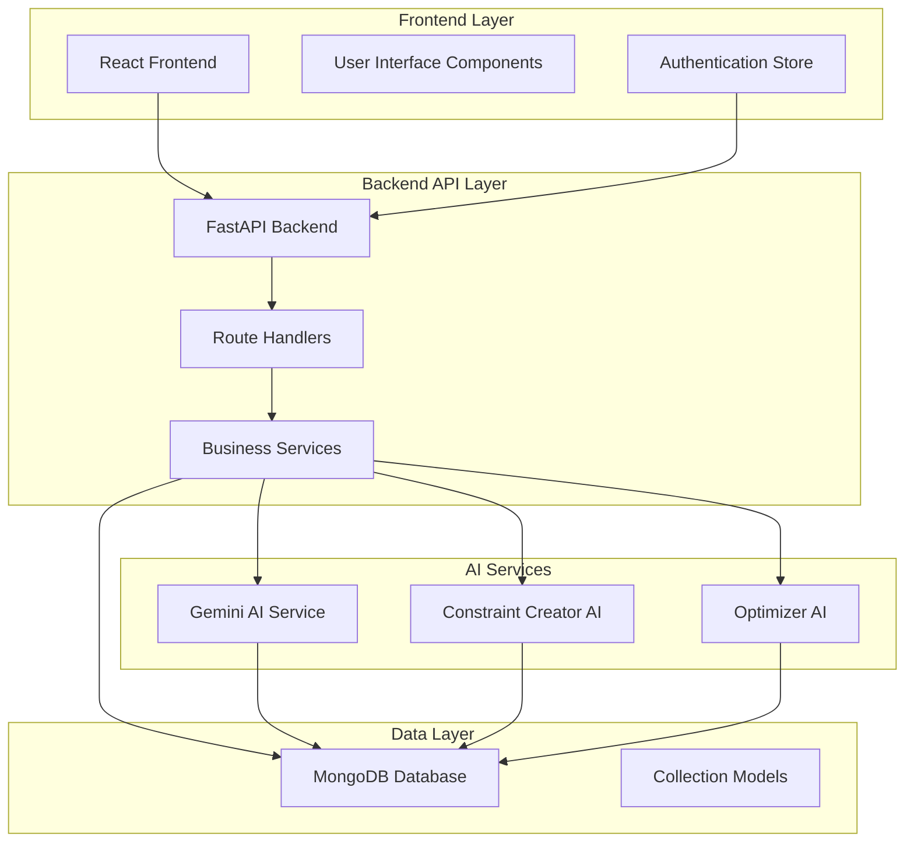

**Diagram sources**
- [main.py:33-102](file://backend/app/main.py#L33-L102)
- [api.py:1-34](file://backend/app/api/api_v1/api.py#L1-L34)

The architecture ensures scalability, maintainability, and extensibility through modular design patterns and clear API boundaries.

**Section sources**
- [main.py:1-102](file://backend/app/main.py#L1-L102)
- [api.py:1-34](file://backend/app/api/api_v1/api.py#L1-L34)

## Constraint-Based Timetable Generation

The constraint-based timetable generation engine implements sophisticated algorithms to solve complex scheduling problems while maintaining hard and soft constraint satisfaction.

### Core Generation Algorithm

The system employs a two-phase approach for timetable generation:

1. **Constraint Loading and Validation Phase**
2. **Optimization and Placement Phase**

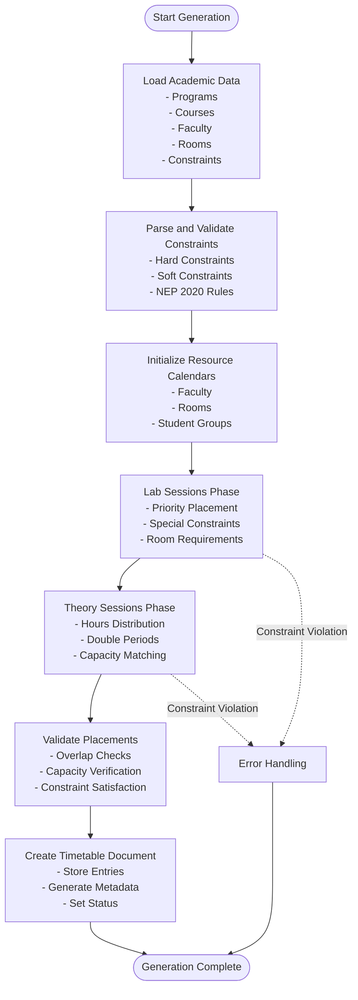

**Diagram sources**
- [generator.py:235-402](file://backend/app/services/timetable/generator.py#L235-L402)

### Advanced Generation Engine

For complex scenarios, the system provides an advanced generation engine with enhanced constraint handling and optimization capabilities.

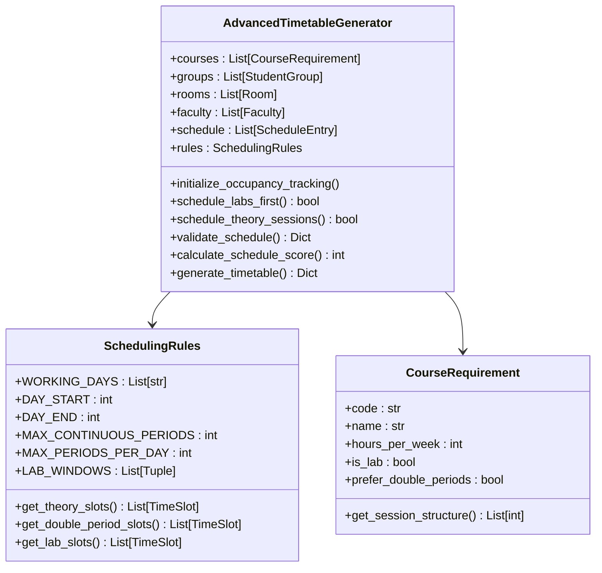

**Diagram sources**
- [advanced_generator.py:201-707](file://backend/app/services/timetable/advanced_generator.py#L201-L707)

**Section sources**
- [generator.py:163-402](file://backend/app/services/timetable/generator.py#L163-L402)
- [advanced_generator.py:1-707](file://backend/app/services/timetable/advanced_generator.py#L1-L707)

## AI-Powered Optimization Engine

The AI optimization engine leverages Google Gemini to provide intelligent timetable suggestions, compliance validation, and optimization recommendations.

### Gemini AI Integration

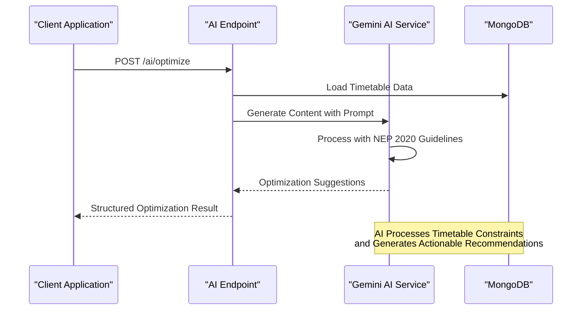

**Diagram sources**
- [gemini.py:18-61](file://backend/app/services/ai/gemini.py#L18-L61)
- [ai.py:46-74](file://backend/app/api/v1/endpoints/ai.py#L46-L74)

### Constraint Creation and Management

The AI constraint creator provides intelligent constraint parsing and optimization capabilities:

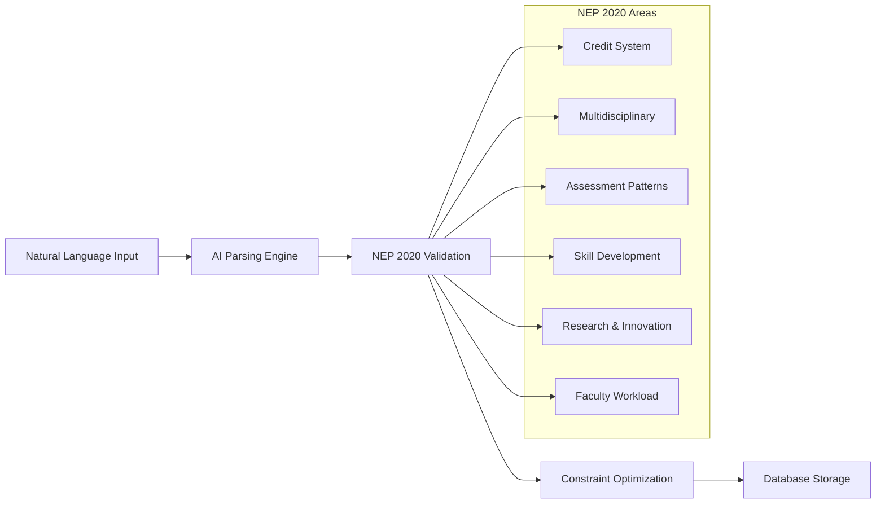

**Diagram sources**
- [constraint_creator.py:18-781](file://backend/app/services/ai/constraint_creator.py#L18-L781)

**Section sources**
- [gemini.py:1-288](file://backend/app/services/ai/gemini.py#L1-L288)
- [constraint_creator.py:1-781](file://backend/app/services/ai/constraint_creator.py#L1-L781)
- [optimizer.py:1-59](file://backend/app/services/ai/optimizer.py#L1-L59)

## Academic Management System

The academic management system provides comprehensive CRUD operations for all core entities in the timetable generation process.

### Entity Relationship Model

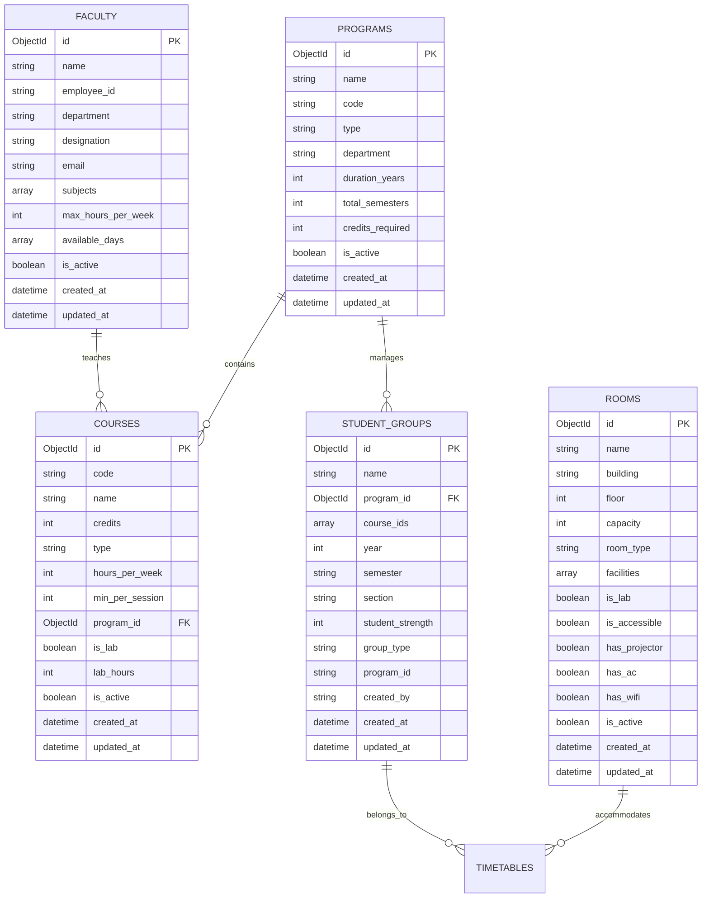

**Diagram sources**
- [timetable.py:21-52](file://backend/app/models/timetable.py#L21-L52)

### Constraint Management System

The constraint management system provides flexible rule definition and validation:

| Constraint Type | Purpose | Parameters | Priority |
|---|---|---|---|
| `faculty_availability` | Defines faculty availability | `faculty_id`, `available_days`, `start_time`, `end_time` | 8 |
| `faculty_workload` | Limits faculty teaching hours | `max_hours_per_day`, `max_hours_per_week` | 9 |
| `room_capacity` | Ensures room capacity matches requirements | `min_capacity`, `max_capacity` | 9 |
| `room_type_requirement` | Specifies room type needs | `required_room_type` | 8 |
| `time_preference` | Preferred scheduling times | `preferred_times`, `avoid_times` | 6 |
| `consecutive_classes` | Required consecutive scheduling | `max_gap` | 7 |
| `gap_minimization` | Minimizes scheduling gaps | `max_gap_hours` | 6 |
| `block_scheduling` | Practical session blocks | `block_duration`, `consecutive_days` | 8 |
| `nep_compliance` | NEP 2020 guidelines | `compliance_type`, `requirement_details` | 10 |

**Section sources**
- [constraints.py:1-189](file://backend/app/api/v1/endpoints/constraints.py#L1-L189)

## Timetable Creation Workflow

The timetable creation workflow implements a multi-step guided process with real-time validation and conflict resolution.

### Generation Pipeline

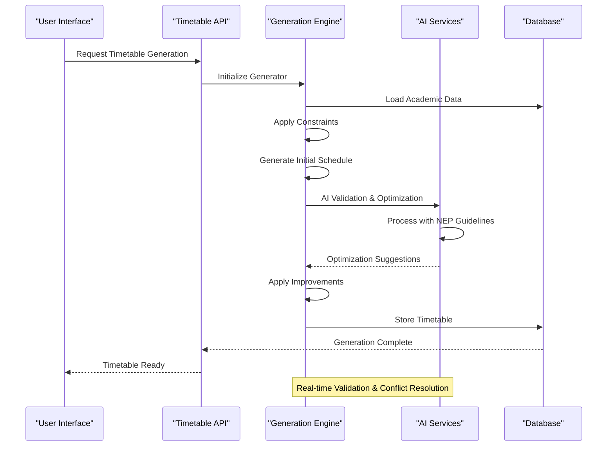

**Diagram sources**
- [timetable.py:234-376](file://backend/app/api/v1/endpoints/timetable.py#L234-L376)

### Template-Based Generation

The system supports template-based generation for standardized scheduling approaches:

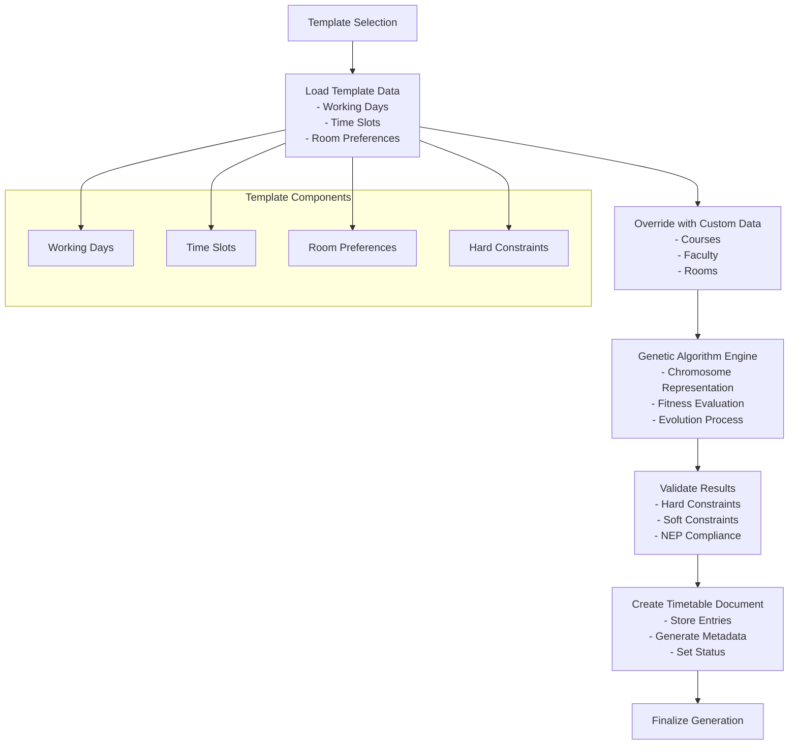

**Diagram sources**
- [template_service.py:80-486](file://backend/app/services/timetable/template_service.py#L80-L486)

**Section sources**
- [timetable.py:1-728](file://backend/app/api/v1/endpoints/timetable.py#L1-L728)
- [template_service.py:1-486](file://backend/app/services/timetable/template_service.py#L1-L486)

## NEP 2020 Compliance Framework

The NEP 2020 compliance framework ensures all generated timetables meet national education policy guidelines.

### Compliance Validation System

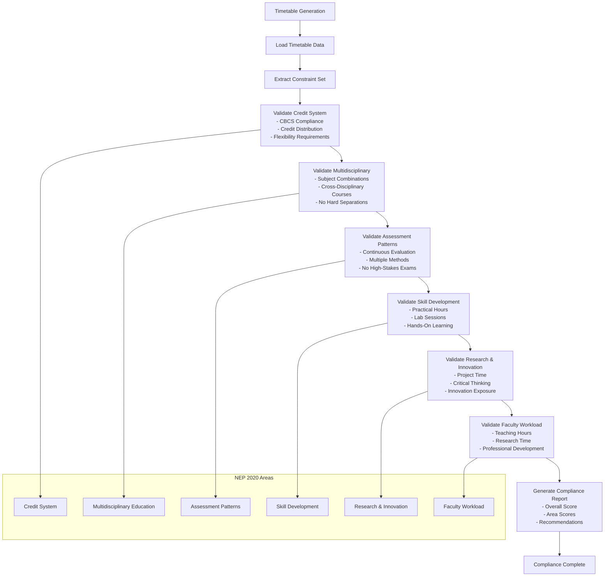

**Diagram sources**
- [constraint_creator.py:28-90](file://backend/app/services/ai/constraint_creator.py#L28-L90)

### AI-Assisted Compliance Checking

The Gemini AI service provides intelligent compliance validation:

| Compliance Area | Validation Method | AI Processing | Output |
|---|---|---|---|
| Credit System | CBCS Requirements | Validates credit distribution and flexibility | Compliance Score, Recommendations |
| Multidisciplinary | Subject Integration | Checks cross-disciplinary combinations | Gap Analysis, Suggestions |
| Assessment | Continuous Evaluation | Reviews assessment patterns | Issues Identified, Solutions |
| Skill Development | Practical Hours | Verifies lab and practical allocation | Hours Analysis, Recommendations |
| Research | Project Time | Evaluates research methodology integration | Research Opportunities, Timeline |
| Faculty Workload | Teaching Limits | Monitors workload compliance | Workload Analysis, Adjustments |

**Section sources**
- [constraint_creator.py:1-781](file://backend/app/services/ai/constraint_creator.py#L1-L781)
- [gemini.py:241-288](file://backend/app/services/ai/gemini.py#L241-L288)

## Export and Template System

The export and template system provides comprehensive output formats and template-based generation capabilities.

### Export Formats

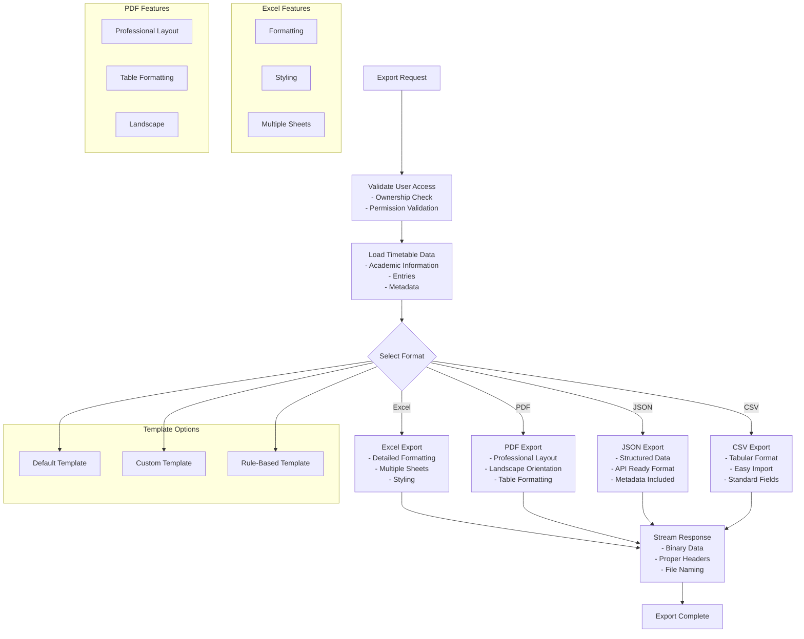

**Diagram sources**
- [exporter.py:22-383](file://backend/app/services/timetable/exporter.py#L22-L383)

### Template Management

The template system supports flexible timetable generation with predefined configurations:

| Template Type | Purpose | Configuration | Usage |
|---|---|---|---|
| Default Template | Standard Academic Scheduling | 5-day week, 8 AM - 6 PM, 50 min slots | General Programs |
| Rule-Based Template | Custom Academic Rules | Configurable working days, time slots, intervals | Specific Institutional Rules |
| Program-Specific Template | Department/Program Requirements | Course-specific allocations, room preferences | Specialized Programs |
| NEP-Compliant Template | Policy Alignment | NEP 2020 guidelines integration | Policy-Focused Institutions |

**Section sources**
- [exporter.py:1-383](file://backend/app/services/timetable/exporter.py#L1-L383)
- [template_service.py:1-486](file://backend/app/services/timetable/template_service.py#L1-L486)

## Frontend Integration

The frontend provides a comprehensive user interface for timetable management and AI interaction.

### AI Optimization Interface

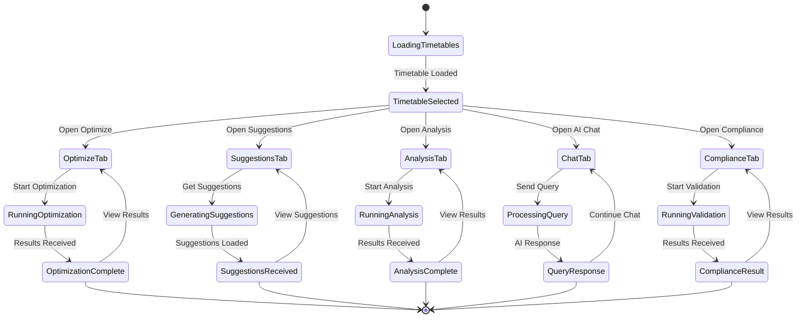

**Diagram sources**
- [AIOptimization.tsx:121-800](file://frontend/src/components/pages/AIOptimization.tsx#L121-L800)

### Authentication and Authorization

The frontend implements robust authentication and authorization mechanisms:

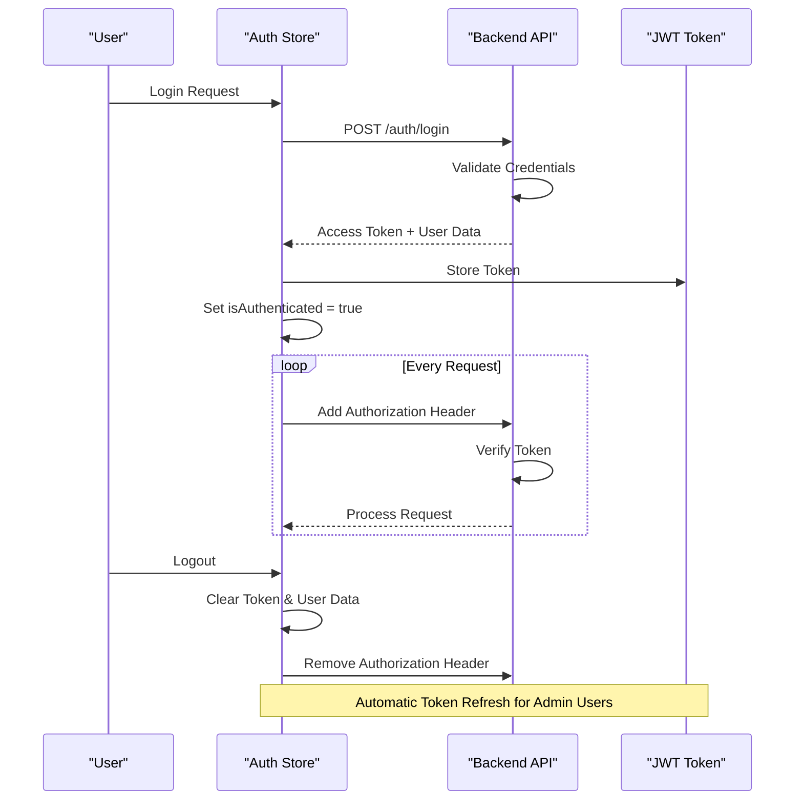

**Diagram sources**
- [authStore.ts:36-196](file://frontend/src/store/authStore.ts#L36-L196)

**Section sources**
- [AIOptimization.tsx:1-912](file://frontend/src/components/pages/AIOptimization.tsx#L1-L912)
- [timetableService.ts:1-772](file://frontend/src/services/timetableService.ts#L1-L772)
- [authStore.ts:1-248](file://frontend/src/store/authStore.ts#L1-L248)

## Security and Access Control

The system implements comprehensive security measures to protect academic data and ensure proper access control.

### User Isolation and Permissions

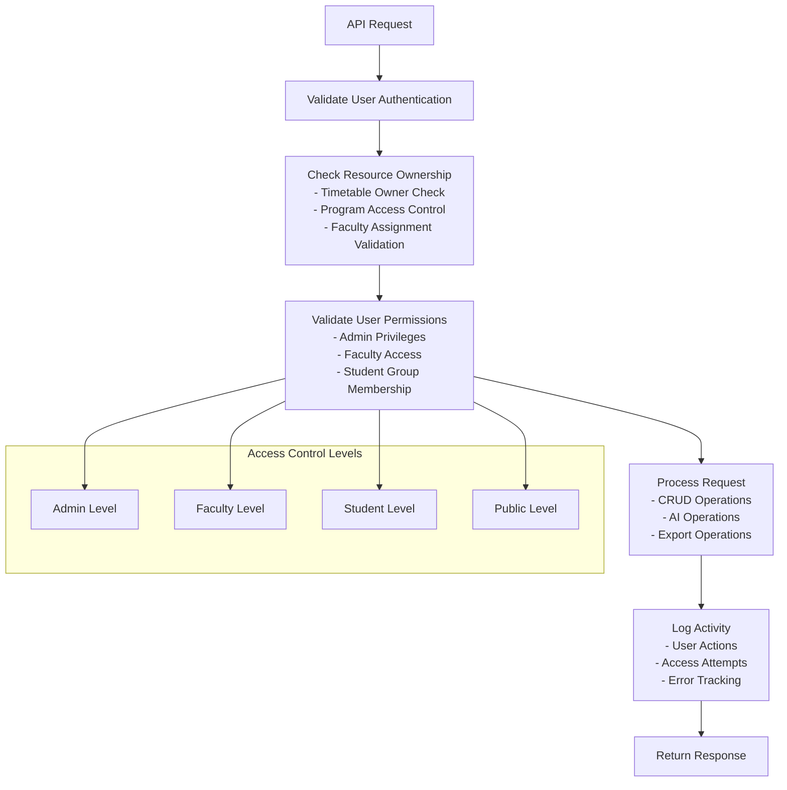

**Diagram sources**
- [timetable.py:30-91](file://backend/app/api/v1/endpoints/timetable.py#L30-L91)
- [ai.py:54-63](file://backend/app/api/v1/endpoints/ai.py#L54-L63)

### Data Validation and Sanitization

The system implements multiple layers of data validation:

| Validation Layer | Purpose | Implementation |
|---|---|---|
| Input Validation | API Request Validation | Pydantic Models, FastAPI Validation |
| Business Logic Validation | Constraint Validation | Custom Validators, Domain Rules |
| Database Validation | Data Integrity | MongoDB Schema Validation |
| Access Control Validation | User Authorization | Ownership Checks, Permission Validation |
| AI Validation | Prompt Safety | Content Filtering, Safety Measures |

**Section sources**
- [timetable.py:1-728](file://backend/app/api/v1/endpoints/timetable.py#L1-L728)
- [ai.py:1-362](file://backend/app/api/v1/endpoints/ai.py#L1-L362)

## Performance Considerations

The system is designed with performance optimization in mind, utilizing efficient algorithms and caching strategies.

### Optimization Strategies

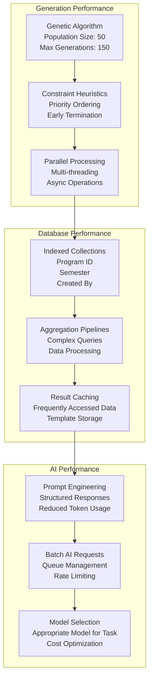

### Scalability Features

| Feature | Implementation | Benefits |
|---|---|---|
| Asynchronous Processing | Async/Await Patterns | Non-blocking Operations |
| Database Indexing | Strategic Index Placement | Faster Query Performance |
| Caching Strategy | Multi-level Caching | Reduced Database Load |
| Horizontal Scaling | Stateless Design | Easy Deployment Scaling |
| Load Balancing | Round-robin Distribution | Even Request Distribution |

## Troubleshooting Guide

Common issues and their solutions:

### Generation Failures

**Issue**: Unable to place lab sessions
**Cause**: Room capacity constraints or faculty availability
**Solution**: 
1. Verify room capacity meets lab requirements
2. Check faculty availability for required time slots
3. Review constraint parameters for flexibility

**Issue**: Theory session placement failures
**Cause**: Maximum hours per day constraints
**Solution**:
1. Adjust faculty workload limits
2. Modify time slot configurations
3. Review student group capacity requirements

### AI Integration Issues

**Issue**: Gemini API key not configured
**Cause**: Missing environment configuration
**Solution**:
1. Set `GEMINI_API_KEY` environment variable
2. Restart backend service
3. Verify API key permissions

**Issue**: AI suggestions not generated
**Cause**: Natural language parsing failures
**Solution**:
1. Check constraint creator initialization
2. Verify AI model configuration
3. Review prompt formatting

### Export Problems

**Issue**: Export format not supported
**Cause**: Invalid format specification
**Solution**:
1. Use supported formats: excel, pdf, json, csv
2. Verify file permissions
3. Check browser compatibility

**Issue**: Large timetable export fails
**Cause**: Memory limitations
**Solution**:
1. Split timetables into smaller chunks
2. Use streaming responses
3. Optimize database queries

### Performance Issues

**Issue**: Slow timetable generation
**Cause**: Large dataset or complex constraints
**Solution**:
1. Optimize constraint sets
2. Reduce population size for GA
3. Implement indexing strategies
4. Use template-based generation

**Section sources**
- [gemini.py:10-21](file://backend/app/services/ai/gemini.py#L10-L21)
- [exporter.py:37-41](file://backend/app/services/timetable/exporter.py#L37-L41)
- [timetable.py:686-728](file://backend/app/api/v1/endpoints/timetable.py#L686-L728)

## Conclusion

ShedMaster represents a comprehensive solution for academic timetable management, combining sophisticated constraint-based algorithms with AI-powered optimization and NEP 2020 compliance validation. The system's modular architecture, robust security measures, and comprehensive feature set make it an ideal choice for educational institutions seeking automated, intelligent, and policy-aligned timetable generation.

Key achievements include:

- **Advanced Scheduling Algorithms**: Constraint-based generation with conflict resolution
- **AI Integration**: Intelligent optimization using Google Gemini for suggestions and validation
- **Policy Compliance**: Built-in NEP 2020 compliance checking and validation
- **Flexible Export**: Multiple format support with template-based generation
- **Robust Security**: Comprehensive access control and data protection
- **Scalable Architecture**: Designed for performance and easy scaling

The system provides a solid foundation for academic institutions to streamline their timetable management processes while ensuring compliance with national education policies and optimizing resource utilization.