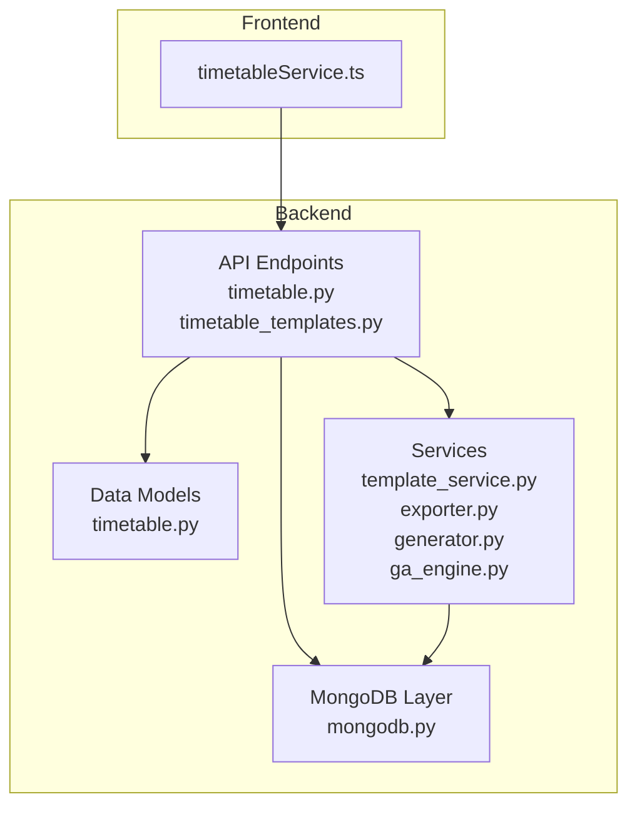
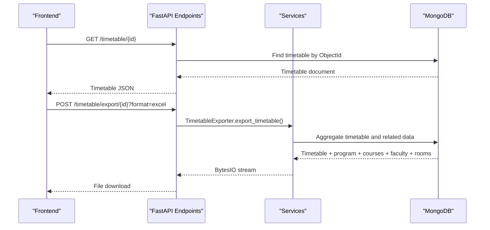
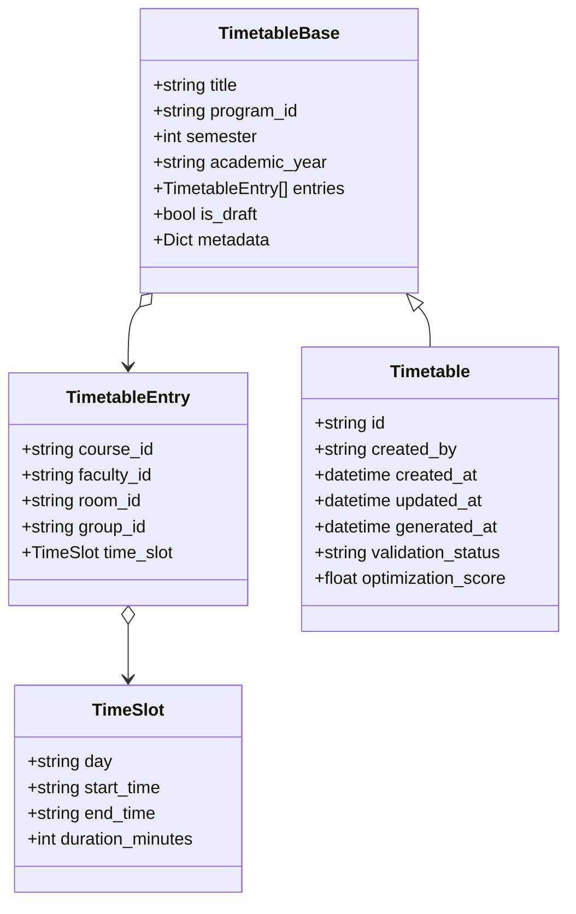
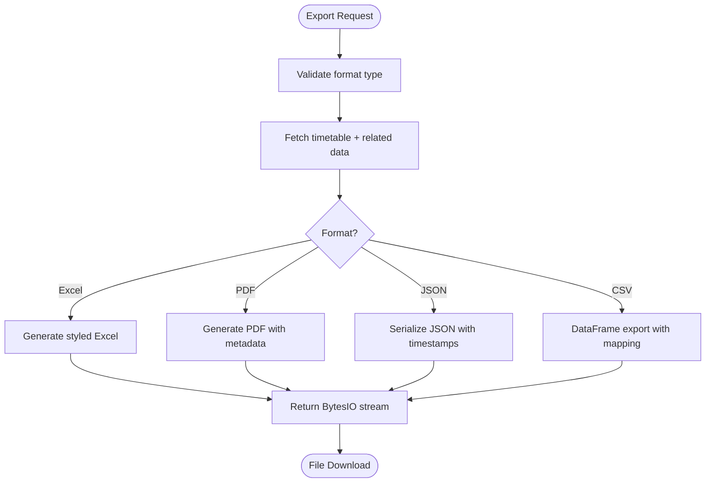
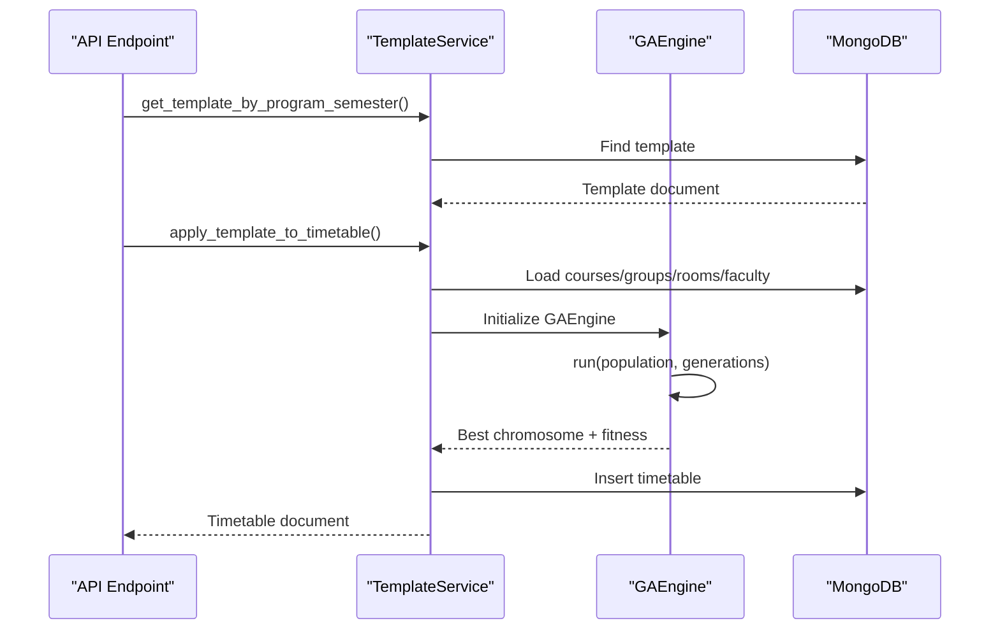
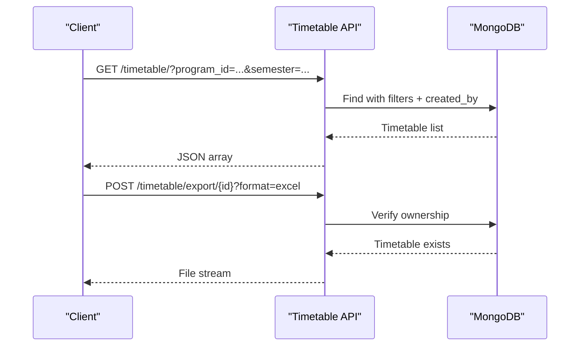
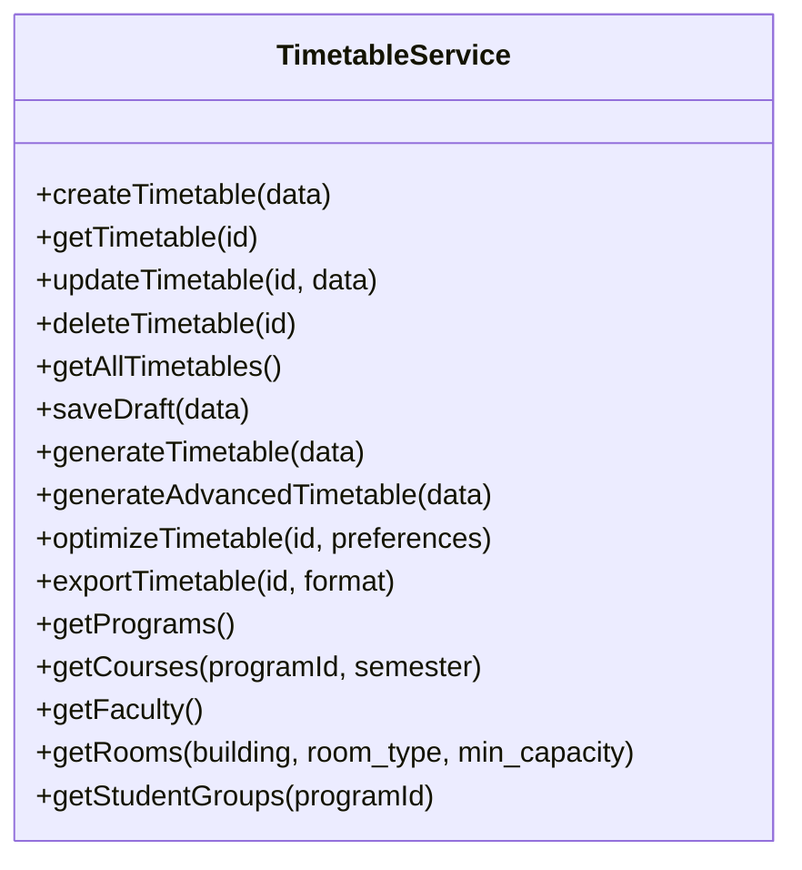
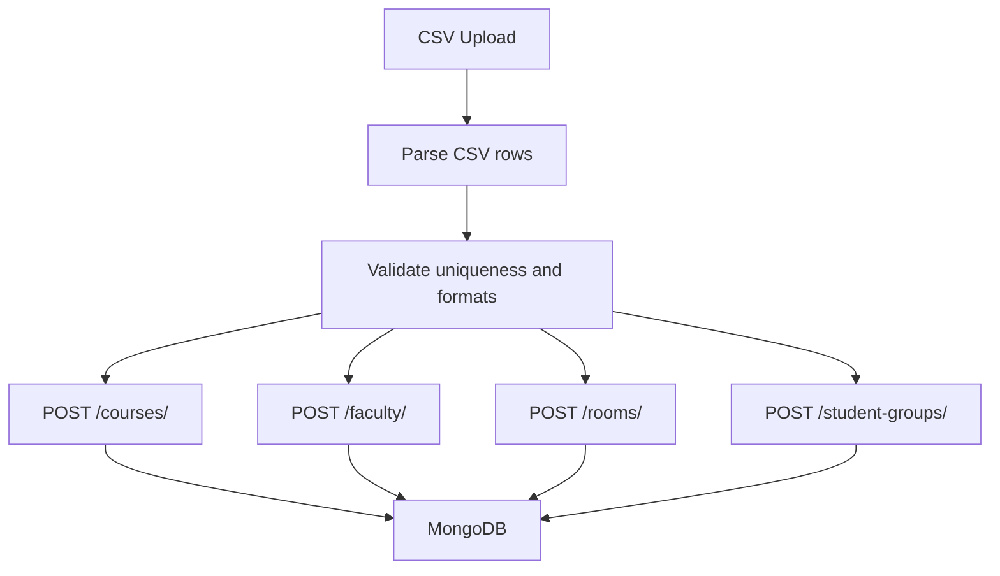
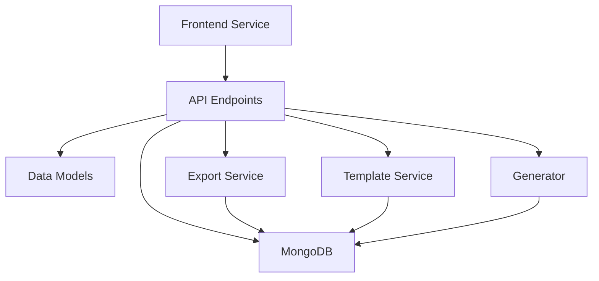

# Data Management and Export

<cite>
**Referenced Files in This Document**
- [timetable.py](file://backend/app/models/timetable.py)
- [exporter.py](file://backend/app/services/timetable/exporter.py)
- [timetable.py](file://backend/app/api/v1/endpoints/timetable.py)
- [mongodb.py](file://backend/app/db/mongodb.py)
- [template_service.py](file://backend/app/services/timetable/template_service.py)
- [generator.py](file://backend/app/services/timetable/generator.py)
- [timetable_templates.py](file://backend/app/api/v1/endpoints/timetable_templates.py)
- [timetableService.ts](file://frontend/src/services/timetableService.ts)
- [courses.py](file://backend/app/api/v1/endpoints/courses.py)
- [faculty.py](file://backend/app/api/v1/endpoints/faculty.py)
- [rooms.py](file://backend/app/api/v1/endpoints/rooms.py)
- [student_groups.py](file://backend/app/api/v1/endpoints/student_groups.py)
- [ga_engine.py](file://backend/app/services/timetable/ga_engine.py)
- [schedule.csv](file://archive/schedule.csv)
</cite>

## Table of Contents
1. [Introduction](#introduction)
2. [Project Structure](#project-structure)
3. [Core Components](#core-components)
4. [Architecture Overview](#architecture-overview)
5. [Detailed Component Analysis](#detailed-component-analysis)
6. [Dependency Analysis](#dependency-analysis)
7. [Performance Considerations](#performance-considerations)
8. [Troubleshooting Guide](#troubleshooting-guide)
9. [Conclusion](#conclusion)

## Introduction
This document explains the data management and export functionality for timetable storage, retrieval, and multi-format export. It covers the persistence layer, indexing strategies, query optimization, export system supporting Excel, PDF, and JSON formats with customizable templates, import functionality for academic data, validation pipeline, integrity checks, error handling, API endpoints for CRUD, search, and bulk operations, and frontend integration patterns for display, filtering, and user interaction.

## Project Structure
The system is organized into:
- Backend API endpoints for timetable CRUD, generation, validation, and export
- Data models for timetable entries and metadata
- Persistence layer using MongoDB via Motor
- Timetable generation engines (template-based and genetic algorithm)
- Export service supporting multiple formats
- Frontend service for API integration and user interactions

**Diagram sources**
- [timetable.py:1-728](file://backend/app/api/v1/endpoints/timetable.py#L1-L728)
- [timetable.py:1-52](file://backend/app/models/timetable.py#L1-L52)
- [mongodb.py:1-41](file://backend/app/db/mongodb.py#L1-L41)
- [template_service.py:1-486](file://backend/app/services/timetable/template_service.py#L1-L486)
- [exporter.py:1-383](file://backend/app/services/timetable/exporter.py#L1-L383)
- [generator.py:1-402](file://backend/app/services/timetable/generator.py#L1-L402)
- [ga_engine.py:1-414](file://backend/app/services/timetable/ga_engine.py#L1-L414)
- [timetableService.ts:1-772](file://frontend/src/services/timetableService.ts#L1-L772)

**Section sources**
- [timetable.py:1-52](file://backend/app/models/timetable.py#L1-L52)
- [timetable.py:1-728](file://backend/app/api/v1/endpoints/timetable.py#L1-L728)
- [mongodb.py:1-41](file://backend/app/db/mongodb.py#L1-L41)
- [exporter.py:1-383](file://backend/app/services/timetable/exporter.py#L1-L383)
- [template_service.py:1-486](file://backend/app/services/timetable/template_service.py#L1-L486)
- [generator.py:1-402](file://backend/app/services/timetable/generator.py#L1-L402)
- [timetable_templates.py:1-106](file://backend/app/api/v1/endpoints/timetable_templates.py#L1-L106)
- [timetableService.ts:1-772](file://frontend/src/services/timetableService.ts#L1-L772)

## Core Components
- Timetable data model defines title, program association, semester, academic year, entries, draft flag, metadata, and validation status
- MongoDB persistence with ObjectId-based identifiers and automatic conversion for JSON responses
- Export service supports Excel, PDF, JSON, and CSV with customizable templates and batch exports
- Generation services implement template-based scheduling and genetic algorithm optimization
- API endpoints expose CRUD, generation, validation, and export operations with user isolation and filtering
- Frontend service integrates with backend APIs for timetable management and export

**Section sources**
- [timetable.py:21-52](file://backend/app/models/timetable.py#L21-L52)
- [mongodb.py:1-41](file://backend/app/db/mongodb.py#L1-L41)
- [exporter.py:16-383](file://backend/app/services/timetable/exporter.py#L16-L383)
- [generator.py:163-402](file://backend/app/services/timetable/generator.py#L163-L402)
- [timetable.py:17-728](file://backend/app/api/v1/endpoints/timetable.py#L17-L728)
- [timetableService.ts:161-772](file://frontend/src/services/timetableService.ts#L161-L772)

## Architecture Overview
The system follows a layered architecture:
- Presentation layer: Frontend service communicates with backend API
- API layer: FastAPI endpoints manage timetable lifecycle and export
- Service layer: Business logic for generation, export, and template management
- Persistence layer: MongoDB stores timetables, academic data, and templates

**Diagram sources**
- [timetable.py:623-687](file://backend/app/api/v1/endpoints/timetable.py#L623-L687)
- [exporter.py:22-94](file://backend/app/services/timetable/exporter.py#L22-L94)
- [mongodb.py:11-41](file://backend/app/db/mongodb.py#L11-L41)

**Section sources**
- [timetable.py:17-728](file://backend/app/api/v1/endpoints/timetable.py#L17-L728)
- [exporter.py:16-383](file://backend/app/services/timetable/exporter.py#L16-L383)
- [mongodb.py:1-41](file://backend/app/db/mongodb.py#L1-L41)

## Detailed Component Analysis

### Data Models and Persistence
- Timetable model encapsulates core attributes and nested entry structure with time slots
- MongoDB uses ObjectId for identifiers; API converts to string for frontend compatibility
- Academic data models (courses, faculty, rooms, student groups) support generation and export workflows

**Diagram sources**
- [timetable.py:6-52](file://backend/app/models/timetable.py#L6-L52)

**Section sources**
- [timetable.py:6-52](file://backend/app/models/timetable.py#L6-L52)
- [mongodb.py:1-41](file://backend/app/db/mongodb.py#L1-L41)

### Export System and Multi-format Support
- Excel export: Styled workbook with merged headers, auto-adjusted column widths, and metadata
- PDF export: Landscape A4 PDF with structured tables and metadata
- JSON export: Serialized timetable with timestamps and metadata
- CSV export: DataFrame-based export with renamed and reordered columns
- Batch export: Multiple timetables into single Excel workbook or consolidated JSON

**Diagram sources**
- [exporter.py:22-383](file://backend/app/services/timetable/exporter.py#L22-L383)

**Section sources**
- [exporter.py:16-383](file://backend/app/services/timetable/exporter.py#L16-L383)

### Generation and Validation Pipelines
- Template-based generation: Builds required sessions from courses and student groups, applies working days and time slots, and runs genetic algorithm
- Genetic algorithm engine: Implements population initialization, fitness evaluation, selection, crossover, mutation, and elitism
- Validation: Checks hard constraints (conflicts), soft constraints (room capacity), and optimization metrics

**Diagram sources**
- [timetable_templates.py:10-106](file://backend/app/api/v1/endpoints/timetable_templates.py#L10-L106)
- [template_service.py:81-414](file://backend/app/services/timetable/template_service.py#L81-L414)
- [ga_engine.py:125-165](file://backend/app/services/timetable/ga_engine.py#L125-L165)

**Section sources**
- [generator.py:169-402](file://backend/app/services/timetable/generator.py#L169-L402)
- [template_service.py:81-414](file://backend/app/services/timetable/template_service.py#L81-L414)
- [ga_engine.py:19-414](file://backend/app/services/timetable/ga_engine.py#L19-L414)

### API Endpoints and Security
- CRUD operations: Create, retrieve, update, delete timetables with user isolation using created_by filters
- Search and filtering: Query timetables by program, semester, academic year, and draft status
- Bulk operations: Export multiple timetables in Excel or JSON
- Validation and optimization: Dedicated endpoints for timetable validation and AI optimization
- Export endpoints: Streamed downloads for Excel, PDF, and JSON formats

**Diagram sources**
- [timetable.py:17-728](file://backend/app/api/v1/endpoints/timetable.py#L17-L728)

**Section sources**
- [timetable.py:17-728](file://backend/app/api/v1/endpoints/timetable.py#L17-L728)

### Frontend Integration Patterns
- Axios-based service with interceptors for authentication and token refresh
- Typed models for timetable, entries, and academic entities
- Export workflow: request file stream and receive Blob for download
- Filtering and pagination handled via query parameters

**Diagram sources**
- [timetableService.ts:161-772](file://frontend/src/services/timetableService.ts#L161-L772)

**Section sources**
- [timetableService.ts:161-772](file://frontend/src/services/timetableService.ts#L161-L772)

### Import Functionality and Data Validation
- Academic data endpoints for courses, faculty, rooms, and student groups with validation and uniqueness checks
- CSV import scenario: Use academic data endpoints to populate collections; validate uniqueness and referential integrity
- Validation pipeline: Hard constraints (conflicts), soft constraints (capacity), and optimization metrics

**Diagram sources**
- [courses.py:58-126](file://backend/app/api/v1/endpoints/courses.py#L58-L126)
- [faculty.py:43-98](file://backend/app/api/v1/endpoints/faculty.py#L43-L98)
- [rooms.py:58-115](file://backend/app/api/v1/endpoints/rooms.py#L58-L115)
- [student_groups.py:59-137](file://backend/app/api/v1/endpoints/student_groups.py#L59-L137)

**Section sources**
- [courses.py:12-279](file://backend/app/api/v1/endpoints/courses.py#L12-L279)
- [faculty.py:13-265](file://backend/app/api/v1/endpoints/faculty.py#L13-L265)
- [rooms.py:12-258](file://backend/app/api/v1/endpoints/rooms.py#L12-L258)
- [student_groups.py:13-380](file://backend/app/api/v1/endpoints/student_groups.py#L13-L380)
- [schedule.csv:1-800](file://archive/schedule.csv#L1-L800)

## Dependency Analysis
The system exhibits clear separation of concerns:
- API depends on models and MongoDB layer
- Services encapsulate business logic and coordinate with MongoDB
- Export service depends on MongoDB and external libraries for formatting
- Frontend service depends on API endpoints

**Diagram sources**
- [timetable.py:1-728](file://backend/app/api/v1/endpoints/timetable.py#L1-L728)
- [exporter.py:1-383](file://backend/app/services/timetable/exporter.py#L1-L383)
- [template_service.py:1-486](file://backend/app/services/timetable/template_service.py#L1-L486)
- [generator.py:1-402](file://backend/app/services/timetable/generator.py#L1-L402)
- [timetableService.ts:1-772](file://frontend/src/services/timetableService.ts#L1-L772)

**Section sources**
- [timetable.py:1-728](file://backend/app/api/v1/endpoints/timetable.py#L1-L728)
- [exporter.py:1-383](file://backend/app/services/timetable/exporter.py#L1-L383)
- [template_service.py:1-486](file://backend/app/services/timetable/template_service.py#L1-L486)
- [generator.py:1-402](file://backend/app/services/timetable/generator.py#L1-L402)
- [timetableService.ts:1-772](file://frontend/src/services/timetableService.ts#L1-L772)

## Performance Considerations
- Indexing strategies: Ensure ObjectId-based queries on created_by, program_id, and composite indexes for frequent filters (program_id + semester + academic_year)
- Query optimization: Use projection to limit returned fields; leverage skip/limit for pagination; avoid N+1 queries by aggregating related data in export service
- Export efficiency: Stream BytesIO responses to reduce memory overhead; batch exports consolidate queries
- Generation performance: Tune GA parameters (population size, generations) and use early stopping criteria; cache templates when applicable
- Frontend responsiveness: Paginate timetable lists; lazy-load export options; debounce search/filter operations

## Troubleshooting Guide
- Authentication failures: Verify Authorization header and token validity; frontend interceptor handles token refresh
- Timetable not found: Confirm ownership filters and ObjectId format; check demo user behavior
- Export errors: Validate format type and ensure timetable ownership; handle streaming response errors
- Generation failures: Check program existence and template availability; review GA convergence thresholds
- Data validation errors: Review uniqueness constraints and referential integrity for courses, faculty, rooms, and groups

**Section sources**
- [timetableService.ts:170-261](file://frontend/src/services/timetableService.ts#L170-L261)
- [timetable.py:623-687](file://backend/app/api/v1/endpoints/timetable.py#L623-L687)
- [courses.py:67-91](file://backend/app/api/v1/endpoints/courses.py#L67-L91)
- [faculty.py:52-62](file://backend/app/api/v1/endpoints/faculty.py#L52-L62)
- [rooms.py:67-77](file://backend/app/api/v1/endpoints/rooms.py#L67-L77)
- [student_groups.py:68-95](file://backend/app/api/v1/endpoints/student_groups.py#L68-L95)

## Conclusion
The system provides a robust foundation for timetable data management with secure CRUD operations, flexible generation pipelines, and comprehensive export capabilities across multiple formats. The modular architecture enables scalability, maintainability, and extensibility for future enhancements such as advanced AI optimization, enhanced validation, and expanded import formats.