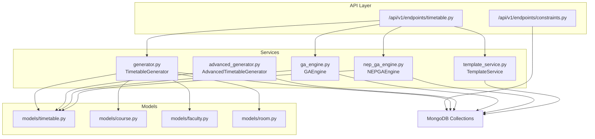
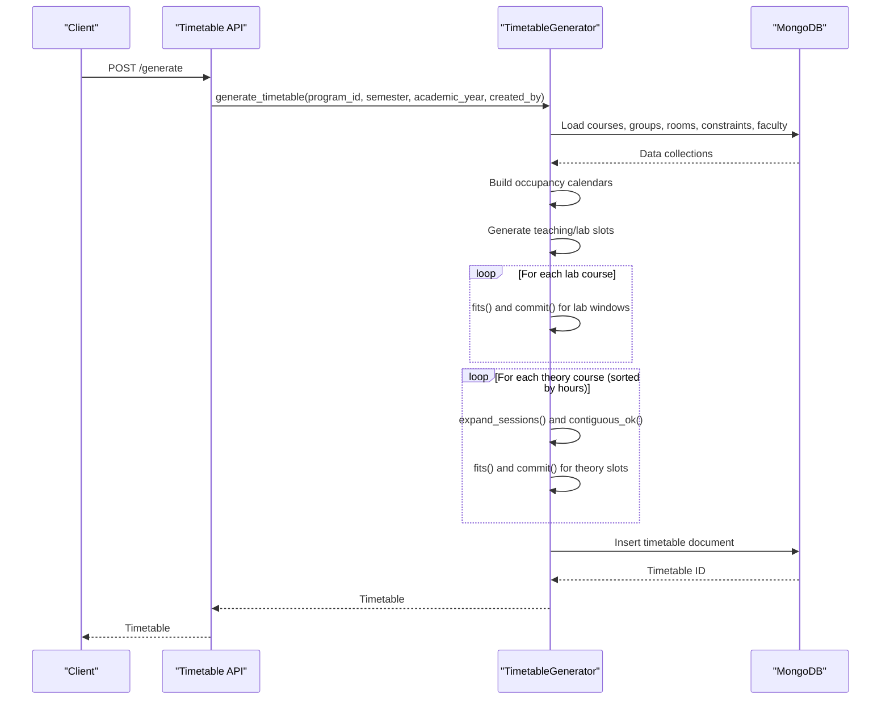
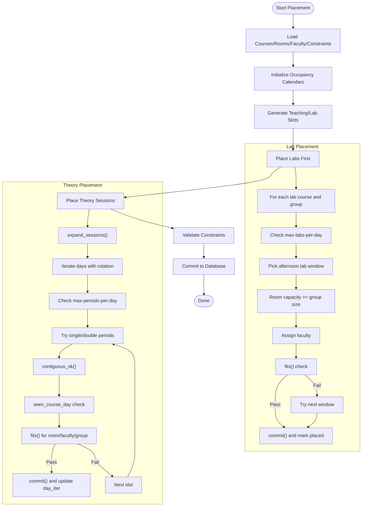
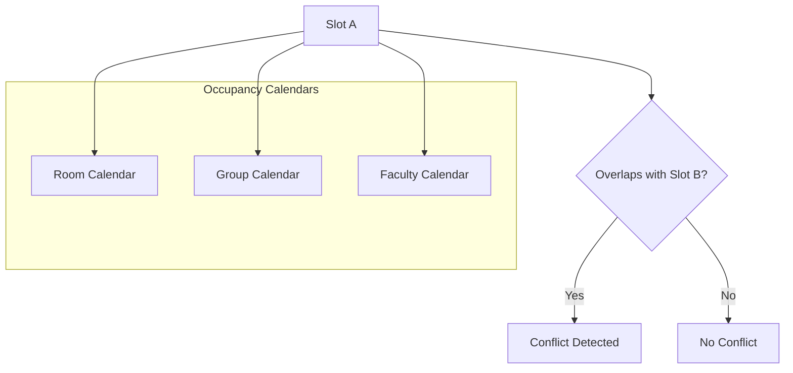
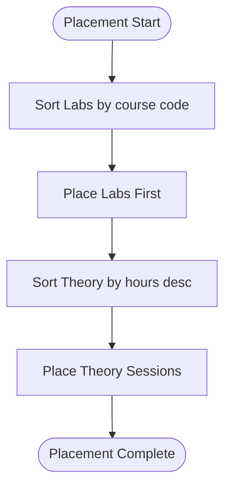
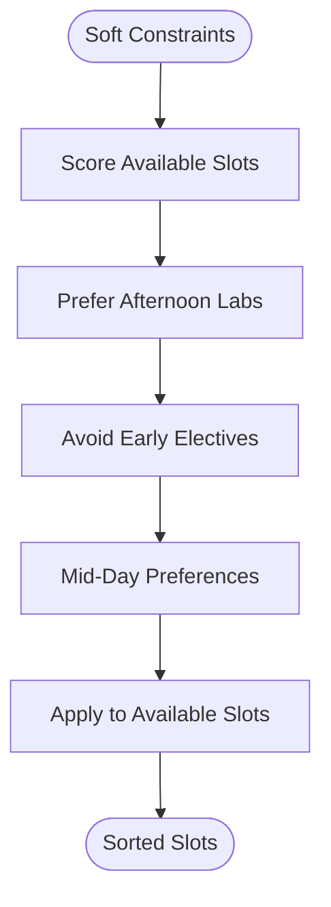
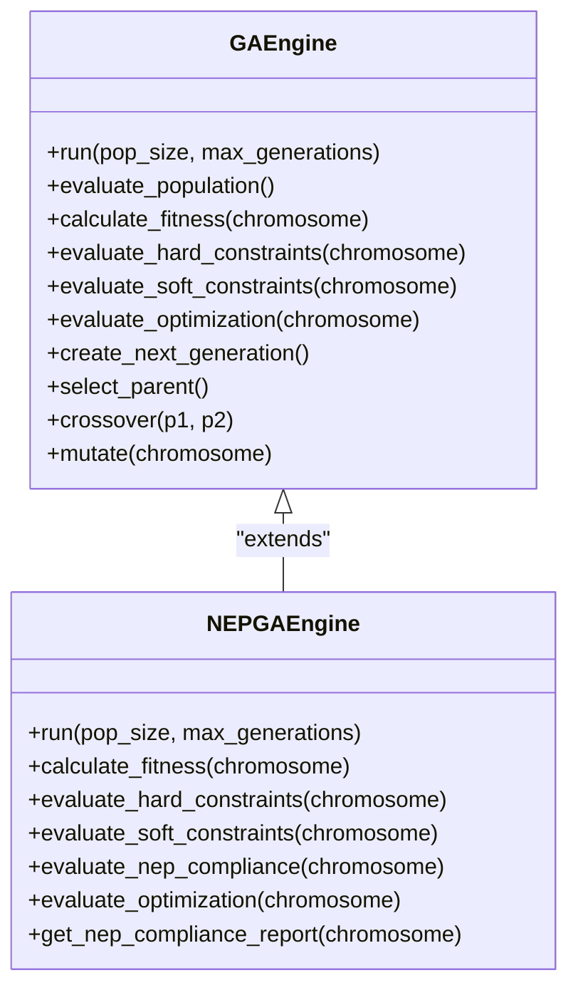
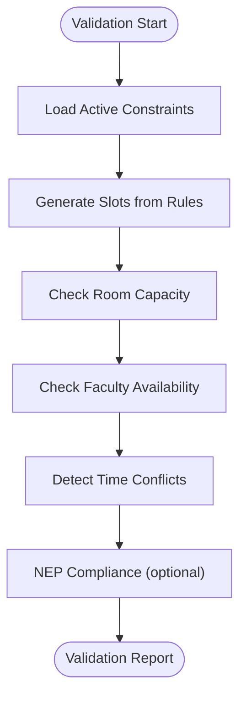
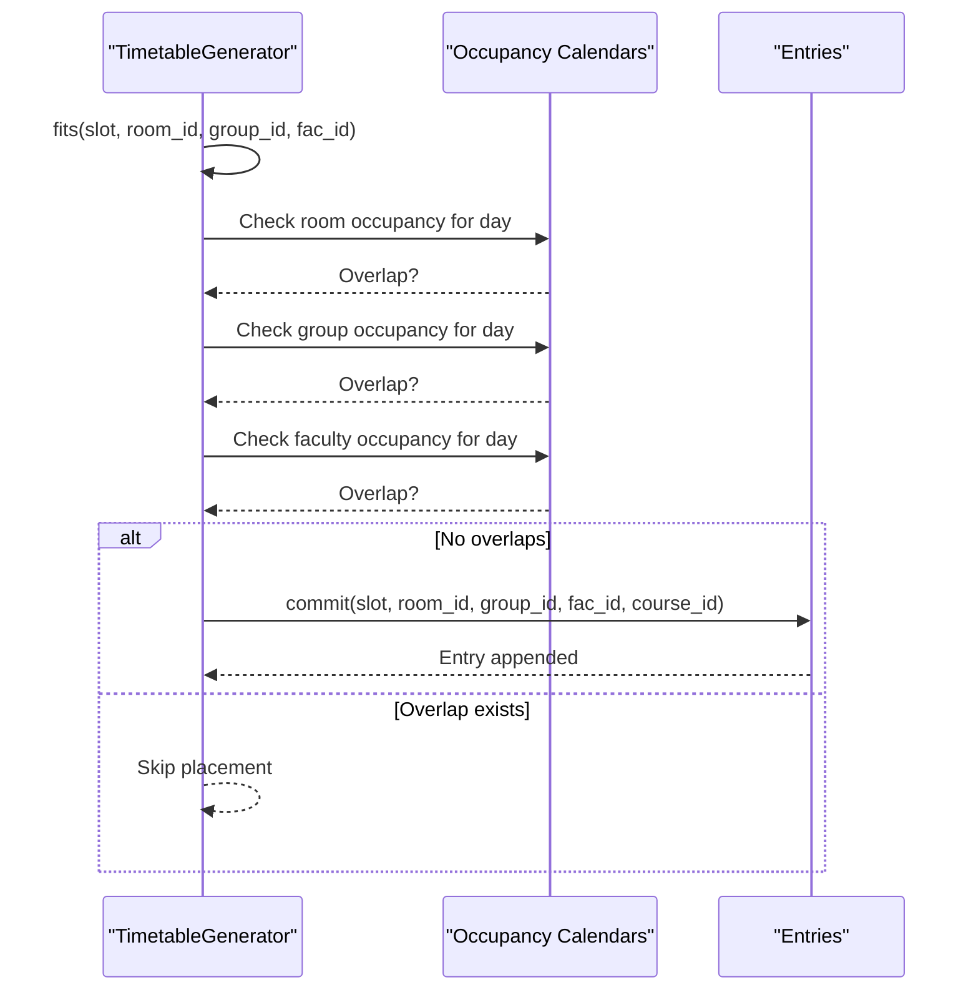
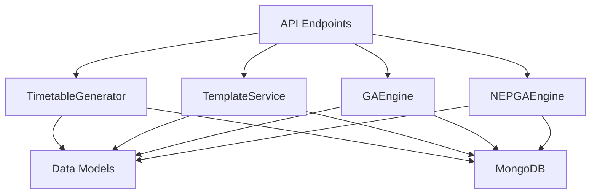

# Constraint Satisfaction Algorithm

<cite>
**Referenced Files in This Document**
- [generator.py](file://backend/app/services/timetable/generator.py)
- [advanced_generator.py](file://backend/app/services/timetable/advanced_generator.py)
- [ga_engine.py](file://backend/app/services/timetable/ga_engine.py)
- [nep_ga_engine.py](file://backend/app/services/timetable/nep_ga_engine.py)
- [template_service.py](file://backend/app/services/timetable/template_service.py)
- [timetable.py](file://backend/app/models/timetable.py)
- [course.py](file://backend/app/models/course.py)
- [faculty.py](file://backend/app/models/faculty.py)
- [room.py](file://backend/app/models/room.py)
- [constraints.py](file://backend/app/api/v1/endpoints/constraints.py)
- [timetable.py](file://backend/app/api/v1/endpoints/timetable.py)
</cite>

## Table of Contents
1. [Introduction](#introduction)
2. [Project Structure](#project-structure)
3. [Core Components](#core-components)
4. [Architecture Overview](#architecture-overview)
5. [Detailed Component Analysis](#detailed-component-analysis)
6. [Dependency Analysis](#dependency-analysis)
7. [Performance Considerations](#performance-considerations)
8. [Troubleshooting Guide](#troubleshooting-guide)
9. [Conclusion](#conclusion)

## Introduction
This document explains the constraint satisfaction algorithm used in timetable generation. It covers the CSP solver implementation with hard constraints (room capacity, faculty availability, time conflicts) and soft constraints (preference matching, double period optimization). It documents the slot allocation mechanism, occupancy calendar tracking, and conflict detection algorithms. It also describes the constraint validation pipeline, priority-based course placement strategy, lab-first placement algorithm, and theory course distribution. Implementation details of the fits() function, commit() operation, and the overall backtracking approach are included, along with examples of constraint violations and resolution strategies.

## Project Structure
The timetable generation system is implemented primarily in Python services under backend/app/services/timetable/. The main CSP solver is implemented in the TimetableGenerator class, with supporting advanced generator and genetic algorithm engines. Templates and constraints are managed via MongoDB collections and exposed through FastAPI endpoints.

**Diagram sources**
- [timetable.py:1-728](file://backend/app/api/v1/endpoints/timetable.py#L1-L728)
- [constraints.py:1-189](file://backend/app/api/v1/endpoints/constraints.py#L1-L189)
- [generator.py:163-402](file://backend/app/services/timetable/generator.py#L163-L402)
- [advanced_generator.py:201-707](file://backend/app/services/timetable/advanced_generator.py#L201-L707)
- [ga_engine.py:19-414](file://backend/app/services/timetable/ga_engine.py#L19-L414)
- [nep_ga_engine.py:33-794](file://backend/app/services/timetable/nep_ga_engine.py#L33-L794)
- [template_service.py:6-486](file://backend/app/services/timetable/template_service.py#L6-L486)
- [timetable.py:1-52](file://backend/app/models/timetable.py#L1-L52)
- [course.py:1-43](file://backend/app/models/course.py#L1-L43)
- [faculty.py:1-39](file://backend/app/models/faculty.py#L1-L39)
- [room.py:1-43](file://backend/app/models/room.py#L1-L43)

**Section sources**
- [generator.py:1-402](file://backend/app/services/timetable/generator.py#L1-L402)
- [timetable.py:1-728](file://backend/app/api/v1/endpoints/timetable.py#L1-L728)

## Core Components
- TimetableGenerator: Implements a CSP-based solver with occupancy calendars, slot generation, and placement heuristics.
- AdvancedTimetableGenerator: Provides a more detailed scheduling pipeline with explicit soft constraints scoring and validation.
- GAEngine and NEPGAEngine: Evolutionary algorithms that optimize timetables using multi-objective fitness functions.
- TemplateService: Manages timetable templates and integrates GA-based generation.
- Data models: Define course, faculty, room, and timetable structures used across the system.

Key implementation highlights:
- Occupancy calendars track room, group, and faculty schedules per day.
- Slot generation creates atomic time slots excluding lunch breaks and passing gaps.
- Conflict detection uses overlap checks across calendars.
- Priority-based placement prioritizes heavy theory courses and labs first.

**Section sources**
- [generator.py:163-402](file://backend/app/services/timetable/generator.py#L163-L402)
- [advanced_generator.py:201-707](file://backend/app/services/timetable/advanced_generator.py#L201-L707)
- [ga_engine.py:19-414](file://backend/app/services/timetable/ga_engine.py#L19-L414)
- [nep_ga_engine.py:33-794](file://backend/app/services/timetable/nep_ga_engine.py#L33-L794)
- [template_service.py:6-486](file://backend/app/services/timetable/template_service.py#L6-L486)
- [timetable.py:1-52](file://backend/app/models/timetable.py#L1-L52)
- [course.py:1-43](file://backend/app/models/course.py#L1-L43)
- [faculty.py:1-39](file://backend/app/models/faculty.py#L1-L39)
- [room.py:1-43](file://backend/app/models/room.py#L1-L43)

## Architecture Overview
The CSP solver orchestrates data loading, slot generation, occupancy tracking, and placement decisions. It supports both lab-first and theory-first strategies, with hard and soft constraints enforced during allocation.

**Diagram sources**
- [timetable.py:234-264](file://backend/app/api/v1/endpoints/timetable.py#L234-L264)
- [generator.py:235-402](file://backend/app/services/timetable/generator.py#L235-L402)

## Detailed Component Analysis

### CSP Solver: TimetableGenerator
The solver loads program data, builds occupancy calendars, generates slots, and places courses using a lab-first, theory-second strategy with hard and soft constraints.

- Occupancy calendars:
  - Room: tracks booked slots per room per day.
  - Group: tracks enrolled group slots per day.
  - Faculty: tracks assigned slots per faculty per day.
- Slot generation:
  - Teaching slots exclude lunch and passing gaps.
  - Lab windows define candidate time blocks for lab sessions.
- Conflict detection:
  - fits(): checks overlap across room, group, and faculty calendars.
- Placement heuristics:
  - Labs first, preferring afternoon windows and respecting max-labs-per-day.
  - Theory courses expanded into single/double periods; double periods require contiguous_ok().
  - seen_course_day prevents repeated same-course-on-same-day within a group.

**Diagram sources**
- [generator.py:239-379](file://backend/app/services/timetable/generator.py#L239-L379)

**Section sources**
- [generator.py:163-402](file://backend/app/services/timetable/generator.py#L163-L402)

### Slot Allocation and Conflict Detection
- Slot representation: day, start, end; overlap determined by time intervals.
- fits(): returns false if any calendar overlap exists for the given slot and resources.
- contiguous_ok(): ensures maximum contiguous periods and passing gaps are respected.

**Diagram sources**
- [generator.py:87-93](file://backend/app/services/timetable/generator.py#L87-L93)
- [generator.py:247-254](file://backend/app/services/timetable/generator.py#L247-L254)
- [generator.py:149-161](file://backend/app/services/timetable/generator.py#L149-L161)

**Section sources**
- [generator.py:87-93](file://backend/app/services/timetable/generator.py#L87-L93)
- [generator.py:247-254](file://backend/app/services/timetable/generator.py#L247-L254)
- [generator.py:149-161](file://backend/app/services/timetable/generator.py#L149-L161)

### Priority-Based Course Placement and Strategy
- Lab-first strategy: labs are placed before theory, with constraints on max labs per day and preferred afternoon windows.
- Theory distribution: heavy courses are prioritized; sessions expanded into double periods when preferred.
- Group rotation: day_iter rotates among groups to distribute load.

**Diagram sources**
- [generator.py:273-301](file://backend/app/services/timetable/generator.py#L273-L301)
- [generator.py:319-378](file://backend/app/services/timetable/generator.py#L319-L378)

**Section sources**
- [generator.py:273-301](file://backend/app/services/timetable/generator.py#L273-L301)
- [generator.py:319-378](file://backend/app/services/timetable/generator.py#L319-L378)

### Soft Constraints and Preference Matching
- Preference matching: AdvancedTimetableGenerator applies slot scoring for soft constraints (e.g., avoiding early slots for electives, mid-day preference for specific courses).
- Double period optimization: Prefer 100-minute blocks for courses with prefer_double=True.
- Capacity and room-type preferences: Theory rooms must have projectors; lab rooms must accommodate group sizes.

**Diagram sources**
- [advanced_generator.py:510-539](file://backend/app/services/timetable/advanced_generator.py#L510-L539)
- [advanced_generator.py:369-424](file://backend/app/services/timetable/advanced_generator.py#L369-L424)

**Section sources**
- [advanced_generator.py:510-539](file://backend/app/services/timetable/advanced_generator.py#L510-L539)
- [advanced_generator.py:369-424](file://backend/app/services/timetable/advanced_generator.py#L369-L424)

### Evolutionary Optimization Engines
- GAEngine: Random initialization, tournament selection, crossover, mutation, and multi-objective fitness combining hard constraints, soft constraints, and optimization.
- NEPGAEngine: Extends GA with NEP 2020 compliance, including practical/theory ratios, faculty workload limits, and multidisciplinary balance.

**Diagram sources**
- [ga_engine.py:19-414](file://backend/app/services/timetable/ga_engine.py#L19-L414)
- [nep_ga_engine.py:33-794](file://backend/app/services/timetable/nep_ga_engine.py#L33-L794)

**Section sources**
- [ga_engine.py:19-414](file://backend/app/services/timetable/ga_engine.py#L19-L414)
- [nep_ga_engine.py:33-794](file://backend/app/services/timetable/nep_ga_engine.py#L33-L794)

### Constraint Validation Pipeline
- Time slot generation: Rules.generate() produces atomic slots and lab windows.
- Room availability checking: capacity and room type verification.
- Faculty scheduling conflicts: overlap detection across calendars.
- Constraint types: faculty availability, room capacity, time preferences, NEP compliance, etc.

**Diagram sources**
- [constraints.py:115-189](file://backend/app/api/v1/endpoints/constraints.py#L115-L189)
- [generator.py:108-147](file://backend/app/services/timetable/generator.py#L108-L147)

**Section sources**
- [constraints.py:115-189](file://backend/app/api/v1/endpoints/constraints.py#L115-L189)
- [generator.py:108-147](file://backend/app/services/timetable/generator.py#L108-L147)

### Implementation Details: fits() and commit()
- fits(slot, room_id, group_id, fac_id): Iterates through each resource’s occupancy calendar for the slot’s day and checks overlap.
- commit(slot, room_id, group_id, fac_id, course_id): Appends the slot to all three calendars and records the timetable entry.

**Diagram sources**
- [generator.py:247-272](file://backend/app/services/timetable/generator.py#L247-L272)

**Section sources**
- [generator.py:247-272](file://backend/app/services/timetable/generator.py#L247-L272)

## Dependency Analysis
The system exhibits layered dependencies:
- API endpoints depend on service generators and template service.
- Generators depend on MongoDB collections for courses, rooms, faculty, constraints.
- Models define shared data structures across services.

**Diagram sources**
- [timetable.py:1-728](file://backend/app/api/v1/endpoints/timetable.py#L1-L728)
- [generator.py:1-402](file://backend/app/services/timetable/generator.py#L1-L402)
- [template_service.py:6-486](file://backend/app/services/timetable/template_service.py#L6-L486)
- [ga_engine.py:19-414](file://backend/app/services/timetable/ga_engine.py#L19-L414)
- [nep_ga_engine.py:33-794](file://backend/app/services/timetable/nep_ga_engine.py#L33-L794)
- [timetable.py:1-52](file://backend/app/models/timetable.py#L1-L52)
- [course.py:1-43](file://backend/app/models/course.py#L1-L43)
- [faculty.py:1-39](file://backend/app/models/faculty.py#L1-L39)
- [room.py:1-43](file://backend/app/models/room.py#L1-L43)

**Section sources**
- [timetable.py:1-728](file://backend/app/api/v1/endpoints/timetable.py#L1-L728)
- [generator.py:1-402](file://backend/app/services/timetable/generator.py#L1-L402)
- [template_service.py:6-486](file://backend/app/services/timetable/template_service.py#L6-L486)
- [ga_engine.py:19-414](file://backend/app/services/timetable/ga_engine.py#L19-L414)
- [nep_ga_engine.py:33-794](file://backend/app/services/timetable/nep_ga_engine.py#L33-L794)
- [timetable.py:1-52](file://backend/app/models/timetable.py#L1-L52)
- [course.py:1-43](file://backend/app/models/course.py#L1-L43)
- [faculty.py:1-39](file://backend/app/models/faculty.py#L1-L39)
- [room.py:1-43](file://backend/app/models/room.py#L1-L43)

## Performance Considerations
- Complexity:
  - Slot generation: O(Days × Periods) for atomic slots.
  - Placement: O(Courses × Groups × Days × Slots × Resources) in worst case; pruning via early exits reduces practical cost.
  - GA/NEP-GA: Population-based optimization scales with population size and generations.
- Optimization opportunities:
  - Index MongoDB queries by program_id, semester, and active flags.
  - Precompute faculty-course mappings and room capacities.
  - Use efficient overlap checks with sorted calendars.
  - Parallelize independent placements where safe.

[No sources needed since this section provides general guidance]

## Troubleshooting Guide
Common constraint violations and resolutions:
- Room capacity violation: Ensure group size ≤ room capacity and room type matches session (lab vs. theory).
  - Resolution: Adjust room assignment or split groups.
- Faculty scheduling conflict: Overlapping time slots for the same faculty.
  - Resolution: Reassign faculty or reschedule conflicting sessions.
- Time conflict for groups: Same group assigned to overlapping slots.
  - Resolution: Increase passing gaps or adjust session durations.
- NEP workload exceeded: Faculty exceeds max hours per day/week.
  - Resolution: Reduce daily load or distribute sessions across days.

Validation and reporting:
- Use the validation endpoint to detect overlaps and missing sessions.
- Review NEP compliance report for practical/theory ratios and workload distribution.

**Section sources**
- [timetable.py:709-727](file://backend/app/api/v1/endpoints/timetable.py#L709-L727)
- [nep_ga_engine.py:722-794](file://backend/app/services/timetable/nep_ga_engine.py#L722-L794)

## Conclusion
The timetable generation system combines a CSP solver with occupancy calendars, strict slot generation, and robust conflict detection. It enforces hard constraints (room capacity, faculty availability, time conflicts) while incorporating soft constraints (preferences, double periods, NEP compliance). The lab-first placement strategy and theory distribution heuristics ensure balanced and feasible schedules. Evolutionary engines further optimize solutions with multi-objective fitness functions, enabling scalable and high-quality timetable generation.