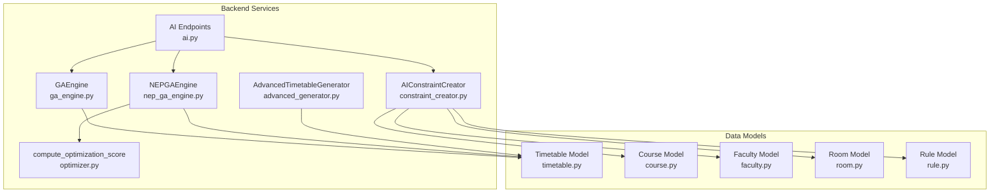
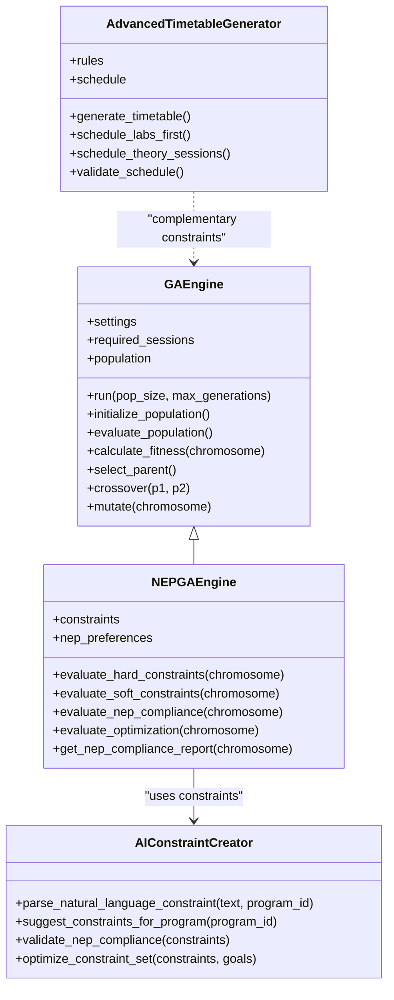
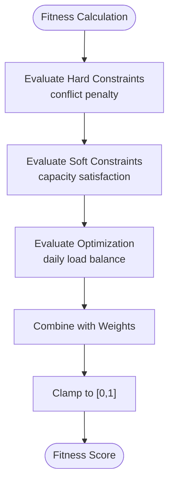
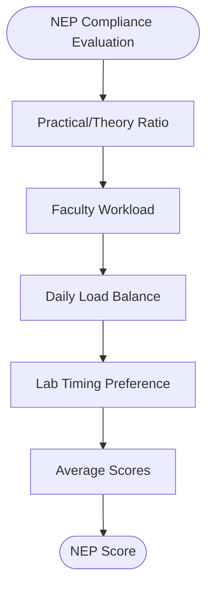
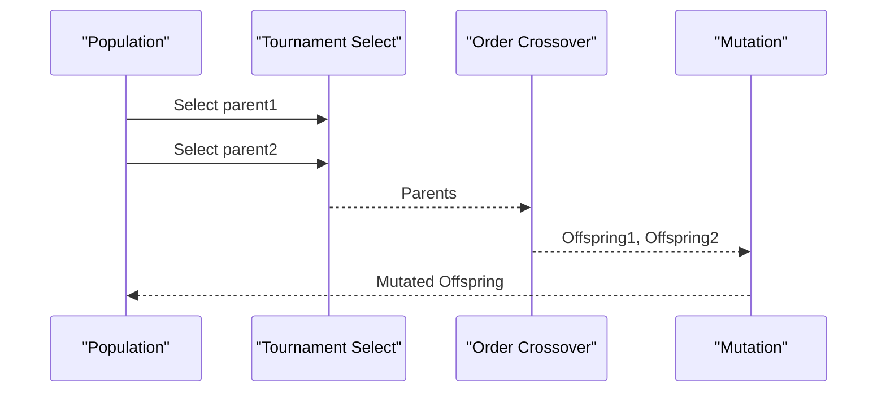
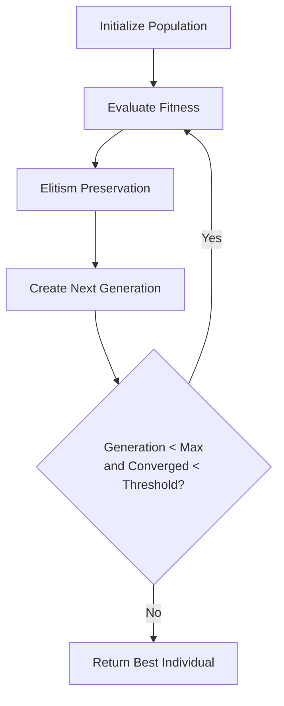
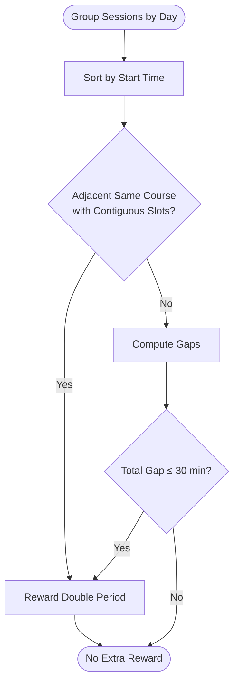
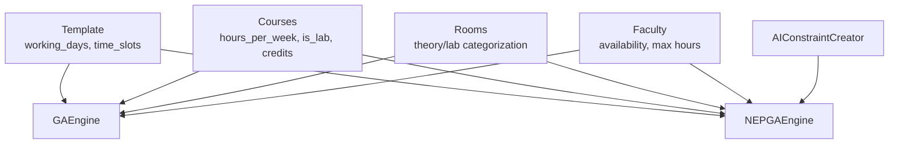

# Genetic Algorithm Implementation

<cite>
**Referenced Files in This Document**
- [ga_engine.py](file://backend/app/services/timetable/ga_engine.py)
- [nep_ga_engine.py](file://backend/app/services/timetable/nep_ga_engine.py)
- [advanced_generator.py](file://backend/app/services/timetable/advanced_generator.py)
- [optimizer.py](file://backend/app/services/ai/optimizer.py)
- [ai.py](file://backend/app/api/v1/endpoints/ai.py)
- [constraint_creator.py](file://backend/app/services/ai/constraint_creator.py)
- [timetable.py](file://backend/app/models/timetable.py)
- [course.py](file://backend/app/models/course.py)
- [faculty.py](file://backend/app/models/faculty.py)
- [room.py](file://backend/app/models/room.py)
- [rule.py](file://backend/app/models/rule.py)
</cite>

## Table of Contents
1. [Introduction](#introduction)
2. [Project Structure](#project-structure)
3. [Core Components](#core-components)
4. [Architecture Overview](#architecture-overview)
5. [Detailed Component Analysis](#detailed-component-analysis)
6. [Dependency Analysis](#dependency-analysis)
7. [Performance Considerations](#performance-considerations)
8. [Troubleshooting Guide](#troubleshooting-guide)
9. [Conclusion](#conclusion)
10. [Appendices](#appendices)

## Introduction
This document explains the genetic algorithm implementation used for advanced timetable optimization. It covers chromosome representation, fitness calculation, selection and crossover, mutation strategies, population initialization, elitism, convergence criteria, and NEP 2020 compliance scoring. It also documents double period optimization and lunch break maximization features, along with performance tuning parameters and practical examples of genetic operations.

## Project Structure
The genetic algorithm implementation resides in the backend under the timetable and AI services modules. The key files are:
- GA base engine for general-purpose timetable optimization
- NEP 2020-specific GA engine extending the base engine
- Advanced constraint-based generator for comparison and complementary constraints
- Lightweight AI optimizer for post-generation scoring
- API endpoints integrating AI and constraint management
- Pydantic models defining data structures for courses, faculty, rooms, timetables, and rules

**Diagram sources**
- [ga_engine.py:19-414](file://backend/app/services/timetable/ga_engine.py#L19-L414)
- [nep_ga_engine.py:33-794](file://backend/app/services/timetable/nep_ga_engine.py#L33-L794)
- [advanced_generator.py:201-707](file://backend/app/services/timetable/advanced_generator.py#L201-L707)
- [optimizer.py:6-59](file://backend/app/services/ai/optimizer.py#L6-L59)
- [ai.py:46-362](file://backend/app/api/v1/endpoints/ai.py#L46-L362)
- [constraint_creator.py:18-781](file://backend/app/services/ai/constraint_creator.py#L18-L781)
- [timetable.py:21-52](file://backend/app/models/timetable.py#L21-L52)
- [course.py:6-43](file://backend/app/models/course.py#L6-L43)
- [faculty.py:5-39](file://backend/app/models/faculty.py#L5-L39)
- [room.py:6-43](file://backend/app/models/room.py#L6-L43)
- [rule.py:6-34](file://backend/app/models/rule.py#L6-L34)

**Section sources**
- [ga_engine.py:19-414](file://backend/app/services/timetable/ga_engine.py#L19-L414)
- [nep_ga_engine.py:33-794](file://backend/app/services/timetable/nep_ga_engine.py#L33-L794)
- [advanced_generator.py:201-707](file://backend/app/services/timetable/advanced_generator.py#L201-L707)
- [optimizer.py:6-59](file://backend/app/services/ai/optimizer.py#L6-L59)
- [ai.py:46-362](file://backend/app/api/v1/endpoints/ai.py#L46-L362)
- [constraint_creator.py:18-781](file://backend/app/services/ai/constraint_creator.py#L18-L781)
- [timetable.py:21-52](file://backend/app/models/timetable.py#L21-L52)
- [course.py:6-43](file://backend/app/models/course.py#L6-L43)
- [faculty.py:5-39](file://backend/app/models/faculty.py#L5-L39)
- [room.py:6-43](file://backend/app/models/room.py#L6-L43)
- [rule.py:6-34](file://backend/app/models/rule.py#L6-L34)

## Core Components
- GAEngine: Base genetic algorithm with chromosome representation, fitness calculation, selection, crossover, mutation, and population management.
- NEPGAEngine: NEP 2020-compliant extension with specialized constraints and scoring for CBCS, multidisciplinary courses, practical/theory ratios, faculty workload, and optimization.
- AdvancedTimetableGenerator: Constraint-based generator with detailed rules for time slots, double periods, labs, and soft constraints.
- compute_optimization_score: Lightweight scoring for balanced daily load, afternoon labs, and double blocks.
- AIConstraintCreator: Parses natural language constraints, validates NEP compliance, and optimizes constraint sets.
- API endpoints: Expose AI optimization, suggestions, analysis, and NEP validation via Gemini.

Key implementation specifics:
- Chromosome encoding includes course, group, faculty, room, day, time slot, and duration.
- Fitness combines penalties for hard constraints, soft constraints, and NEP-specific objectives.
- Selection uses tournament selection; crossover uses order crossover; mutation includes swap, insertion, inversion, and attribute mutation.
- Elitism preserves top individuals; convergence monitored via fitness threshold and patience.

**Section sources**
- [ga_engine.py:19-414](file://backend/app/services/timetable/ga_engine.py#L19-L414)
- [nep_ga_engine.py:33-794](file://backend/app/services/timetable/nep_ga_engine.py#L33-L794)
- [advanced_generator.py:201-707](file://backend/app/services/timetable/advanced_generator.py#L201-L707)
- [optimizer.py:6-59](file://backend/app/services/ai/optimizer.py#L6-L59)
- [constraint_creator.py:18-781](file://backend/app/services/ai/constraint_creator.py#L18-L781)
- [ai.py:46-362](file://backend/app/api/v1/endpoints/ai.py#L46-L362)

## Architecture Overview
The genetic algorithm integrates with the AI constraint system and API layer. The NEP engine extends the base GA with NEP-specific evaluations and weights.

**Diagram sources**
- [ga_engine.py:19-414](file://backend/app/services/timetable/ga_engine.py#L19-L414)
- [nep_ga_engine.py:33-794](file://backend/app/services/timetable/nep_ga_engine.py#L33-L794)
- [advanced_generator.py:201-707](file://backend/app/services/timetable/advanced_generator.py#L201-L707)
- [constraint_creator.py:18-781](file://backend/app/services/ai/constraint_creator.py#L18-L781)

## Detailed Component Analysis

### GAEngine: Chromosome Representation and Fitness
- Chromosome: Each gene encodes a scheduled session with course, group, faculty, room, day, slot, and duration. The gene set corresponds to required sessions derived from course requirements.
- Encoding details:
  - Course identifiers and metadata (code, name, credits, is_lab)
  - Group identifiers and enrollment
  - Faculty identifier
  - Room identifier, name, and capacity
  - Day and time slot (start/end/duration)
- Fitness function:
  - Hard constraints: penalty ratio for conflicts among faculty, rooms, and groups
  - Soft constraints: room capacity satisfaction (50%-100% ideal)
  - Optimization: daily load balance (variance minimization)
  - Weights: configurable hardConstraints, softConstraints, optimization

**Diagram sources**
- [ga_engine.py:202-281](file://backend/app/services/timetable/ga_engine.py#L202-L281)

**Section sources**
- [ga_engine.py:177-193](file://backend/app/services/timetable/ga_engine.py#L177-L193)
- [ga_engine.py:202-281](file://backend/app/services/timetable/ga_engine.py#L202-L281)

### NEPGAEngine: NEP 2020 Compliance Scoring
- Practical/Theory balance: ratio of lab vs theory sessions evaluated against recommended 0.25–0.50
- Faculty workload: weekly hours capped at 18; scoring based on adherence
- Daily load balance: variance-normalized score across working days
- Lab timing: preference for afternoon labs (≥13:00)
- Additional optimization: rewards for double periods and minimal gaps

**Diagram sources**
- [nep_ga_engine.py:453-527](file://backend/app/services/timetable/nep_ga_engine.py#L453-L527)

**Section sources**
- [nep_ga_engine.py:453-527](file://backend/app/services/timetable/nep_ga_engine.py#L453-L527)

### Selection, Crossover, and Mutation
- Selection: tournament selection with configurable tournament size
- Crossover: order crossover (OX) copying segments and filling remaining positions
- Mutation:
  - Swap: exchange two genes
  - Insertion: move a gene to another position
  - Inversion: reverse a segment
  - Attribute: resample day, slot, and room for a gene

**Diagram sources**
- [ga_engine.py:312-381](file://backend/app/services/timetable/ga_engine.py#L312-L381)
- [nep_ga_engine.py:603-681](file://backend/app/services/timetable/nep_ga_engine.py#L603-L681)

**Section sources**
- [ga_engine.py:312-381](file://backend/app/services/timetable/ga_engine.py#L312-L381)
- [nep_ga_engine.py:603-681](file://backend/app/services/timetable/nep_ga_engine.py#L603-L681)

### Population Initialization, Elitism, and Convergence
- Initialization: random chromosome creation respecting lab/theory categorization and room/slot availability
- Elitism: preserve top individuals across generations
- Convergence: monitor best fitness improvement; stop if plateau exceeds threshold

**Diagram sources**
- [ga_engine.py:167-165](file://backend/app/services/timetable/ga_engine.py#L167-L165)
- [nep_ga_engine.py:320-318](file://backend/app/services/timetable/nep_ga_engine.py#L320-L318)

**Section sources**
- [ga_engine.py:167-165](file://backend/app/services/timetable/ga_engine.py#L167-L165)
- [nep_ga_engine.py:320-318](file://backend/app/services/timetable/nep_ga_engine.py#L320-L318)

### Double Period Optimization and Lunch Break Maximization
- Double period optimization: detect adjacent same-course sessions and reward continuity
- Lunch break maximization: avoid scheduling during lunch slots when feasible; the base GA avoids lunch overlaps implicitly via slot generation

**Diagram sources**
- [nep_ga_engine.py:529-570](file://backend/app/services/timetable/nep_ga_engine.py#L529-L570)

**Section sources**
- [nep_ga_engine.py:529-570](file://backend/app/services/timetable/nep_ga_engine.py#L529-L570)

### Implementation Examples of Genetic Operations
- Random chromosome creation: assigns random day/slot/room to each required session
- Crossover example: order crossover copying a segment from each parent and filling remaining positions from the other parent
- Mutation example: attribute mutation resamples day/slot/room for a gene with low probability

**Section sources**
- [ga_engine.py:177-193](file://backend/app/services/timetable/ga_engine.py#L177-L193)
- [ga_engine.py:316-340](file://backend/app/services/timetable/ga_engine.py#L316-L340)
- [ga_engine.py:371-381](file://backend/app/services/timetable/ga_engine.py#L371-L381)

### Performance Tuning Parameters
- Population size, max generations, crossover rate, mutation rate, elite size, tournament size, convergence threshold
- Fitness weights: hardConstraints, softConstraints, optimization (and nepCompliance in NEP engine)
- NEP engine settings tuned for CBCS and multidisciplinary emphasis

**Section sources**
- [ga_engine.py:38-51](file://backend/app/services/timetable/ga_engine.py#L38-L51)
- [nep_ga_engine.py:71-86](file://backend/app/services/timetable/nep_ga_engine.py#L71-L86)

## Dependency Analysis
The GA engines depend on:
- Template-defined working days and time slots
- Course/session requirements (theory/lab hours, enrolled students)
- Room and faculty availability
- AI constraint system for NEP validation and suggestions

**Diagram sources**
- [ga_engine.py:31-68](file://backend/app/services/timetable/ga_engine.py#L31-L68)
- [nep_ga_engine.py:43-127](file://backend/app/services/timetable/nep_ga_engine.py#L43-L127)
- [constraint_creator.py:28-90](file://backend/app/services/ai/constraint_creator.py#L28-L90)

**Section sources**
- [ga_engine.py:31-68](file://backend/app/services/timetable/ga_engine.py#L31-L68)
- [nep_ga_engine.py:43-127](file://backend/app/services/timetable/nep_ga_engine.py#L43-L127)
- [constraint_creator.py:28-90](file://backend/app/services/ai/constraint_creator.py#L28-L90)

## Performance Considerations
- Population size and tournament size influence exploration/exploitation balance
- Crossover and mutation rates control genetic diversity
- Early stopping thresholds reduce unnecessary computation
- NEP scoring adds computational overhead but improves compliance
- Lightweight optimization scoring can be used post-generation for quick quality checks

[No sources needed since this section provides general guidance]

## Troubleshooting Guide
Common issues and remedies:
- No required sessions: initialization fails gracefully with a message
- Convergence stalls: adjust convergence threshold or increase mutation rate
- Hard constraint violations: review faculty/workload limits and room capacities
- NEP compliance gaps: use AI constraint suggestions and validation reports

**Section sources**
- [ga_engine.py:132-134](file://backend/app/services/timetable/ga_engine.py#L132-L134)
- [nep_ga_engine.py:272-274](file://backend/app/services/timetable/nep_ga_engine.py#L272-L274)
- [constraint_creator.py:536-598](file://backend/app/services/ai/constraint_creator.py#L536-L598)

## Conclusion
The genetic algorithm implementation provides a robust, extensible framework for timetable optimization. The base GAEngine offers flexible chromosome representation and multi-objective fitness, while NEPGAEngine adds NEP 2020-specific compliance scoring. Together with the AI constraint system and lightweight optimization scoring, the solution balances hard constraints, soft preferences, and institutional guidelines.

[No sources needed since this section summarizes without analyzing specific files]

## Appendices

### Data Models Overview
- TimetableEntry: course, faculty, room, group, and time slot
- Course: course metadata, hours, credits, lab flag
- Faculty: availability and workload limits
- Room: capacity and type classification
- Rule: global time and scheduling settings

**Section sources**
- [timetable.py:13-52](file://backend/app/models/timetable.py#L13-L52)
- [course.py:6-43](file://backend/app/models/course.py#L6-L43)
- [faculty.py:5-39](file://backend/app/models/faculty.py#L5-L39)
- [room.py:6-43](file://backend/app/models/room.py#L6-L43)
- [rule.py:6-34](file://backend/app/models/rule.py#L6-L34)