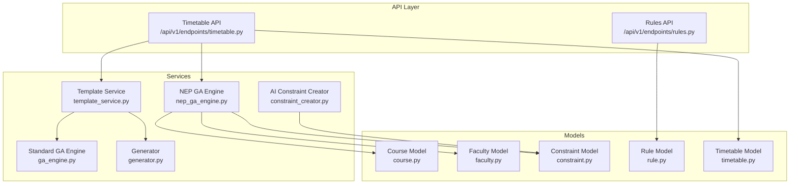
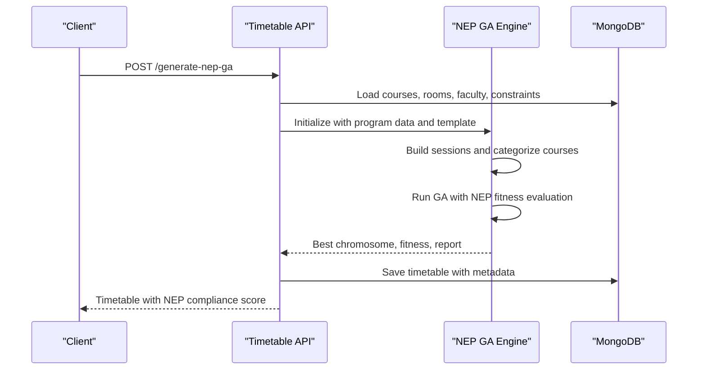
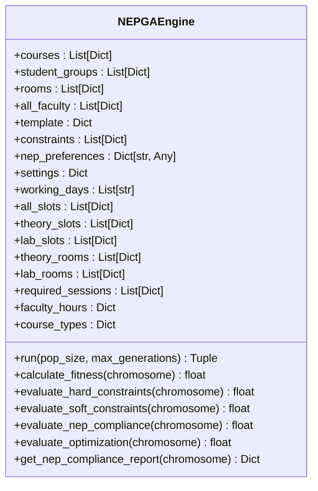
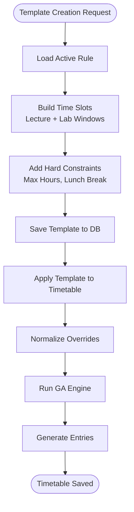
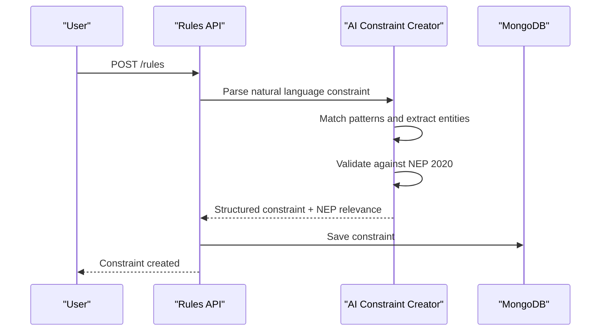
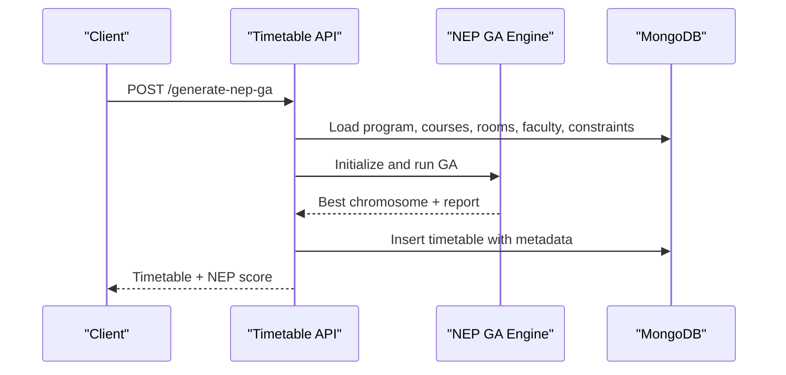
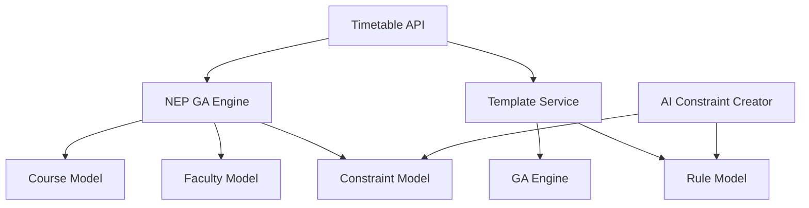

# NEP 2020 Compliance Validation

<cite>
**Referenced Files in This Document**
- [nep_ga_engine.py](file://backend/app/services/timetable/nep_ga_engine.py)
- [ga_engine.py](file://backend/app/services/timetable/ga_engine.py)
- [timetable.py](file://backend/app/api/v1/endpoints/timetable.py)
- [template_service.py](file://backend/app/services/timetable/template_service.py)
- [generator.py](file://backend/app/services/timetable/generator.py)
- [course.py](file://backend/app/models/course.py)
- [faculty.py](file://backend/app/models/faculty.py)
- [constraint.py](file://backend/app/models/constraint.py)
- [constraint_creator.py](file://backend/app/services/ai/constraint_creator.py)
- [rules.py](file://backend/app/api/v1/endpoints/rules.py)
- [rule.py](file://backend/app/models/rule.py)
</cite>

## Table of Contents
1. [Introduction](#introduction)
2. [Project Structure](#project-structure)
3. [Core Components](#core-components)
4. [Architecture Overview](#architecture-overview)
5. [Detailed Component Analysis](#detailed-component-analysis)
6. [Dependency Analysis](#dependency-analysis)
7. [Performance Considerations](#performance-considerations)
8. [Troubleshooting Guide](#troubleshooting-guide)
9. [Conclusion](#conclusion)

## Introduction
This document describes the NEP 2020 compliance validation system integrated into the timetable generation pipeline. It explains the compliance scoring algorithm, including credit hour calculations, course load balancing, and academic rigor metrics. It documents validation rules for semester-wise course distribution, practical lab requirements, and faculty workload optimization. It also covers the compliance reporting system, violation detection, and remediation suggestions, along with the integration of genetic algorithms for automatic compliance optimization and manual adjustment capabilities.

## Project Structure
The NEP 2020 compliance system spans backend services, API endpoints, and data models:
- Genetic algorithm engines for timetable optimization with NEP 2020 constraints
- Template-based generation with rule-driven slot allocation
- Constraint management and NEP 2020 validation via AI
- API endpoints for generating NEP-compliant timetables and retrieving compliance reports

**Diagram sources**
- [timetable.py:377-537](file://backend/app/api/v1/endpoints/timetable.py#L377-L537)
- [nep_ga_engine.py:33-127](file://backend/app/services/timetable/nep_ga_engine.py#L33-L127)
- [template_service.py:209-413](file://backend/app/services/timetable/template_service.py#L209-L413)
- [course.py:6-20](file://backend/app/models/course.py#L6-L20)
- [faculty.py:5-13](file://backend/app/models/faculty.py#L5-L13)
- [constraint.py:6-13](file://backend/app/models/constraint.py#L6-L13)
- [rule.py:6-12](file://backend/app/models/rule.py#L6-L12)
- [rules.py:1-68](file://backend/app/api/v1/endpoints/rules.py#L1-L68)

**Section sources**
- [timetable.py:1-728](file://backend/app/api/v1/endpoints/timetable.py#L1-L728)
- [nep_ga_engine.py:1-794](file://backend/app/services/timetable/nep_ga_engine.py#L1-L794)
- [template_service.py:1-486](file://backend/app/services/timetable/template_service.py#L1-L486)

## Core Components
- NEP GA Engine: Implements NEP 2020-specific fitness evaluation, including practical/theory ratio, faculty workload limits, daily load balance, and lab timing preferences.
- Standard GA Engine: Provides baseline genetic algorithm functionality for timetable generation.
- Template Service: Creates rule-driven time slot templates and applies them to generate timetables.
- Generator: Implements rule-based timetable construction with lab-first and theory-second scheduling.
- AI Constraint Creator: Parses natural language constraints, validates against NEP 2020 guidelines, and suggests improvements.
- API Endpoints: Expose NEP GA generation, compliance reporting, and constraint management.

Key compliance metrics include:
- Practical/Theory ratio scoring (target 30–40% practical)
- Weekly faculty workload scoring (max 18 hours/week)
- Daily load balance scoring
- Lab session timing preference (afternoon scheduling)
- Room capacity and lab room matching

**Section sources**
- [nep_ga_engine.py:453-527](file://backend/app/services/timetable/nep_ga_engine.py#L453-L527)
- [nep_ga_engine.py:722-793](file://backend/app/services/timetable/nep_ga_engine.py#L722-L793)
- [ga_engine.py:19-31](file://backend/app/services/timetable/ga_engine.py#L19-L31)
- [template_service.py:98-206](file://backend/app/services/timetable/template_service.py#L98-L206)
- [generator.py:163-401](file://backend/app/services/timetable/generator.py#L163-L401)
- [constraint_creator.py:18-26](file://backend/app/services/ai/constraint_creator.py#L18-L26)

## Architecture Overview
The NEP 2020 compliance system integrates multiple layers:
- API layer handles requests for NEP GA generation and compliance reporting
- Service layer orchestrates data retrieval, GA execution, and report generation
- Model layer defines constraints, rules, courses, and faculty entities
- AI layer provides NEP validation and constraint suggestions

**Diagram sources**
- [timetable.py:377-537](file://backend/app/api/v1/endpoints/timetable.py#L377-L537)
- [nep_ga_engine.py:259-318](file://backend/app/services/timetable/nep_ga_engine.py#L259-L318)
- [nep_ga_engine.py:453-527](file://backend/app/services/timetable/nep_ga_engine.py#L453-L527)

**Section sources**
- [timetable.py:377-537](file://backend/app/api/v1/endpoints/timetable.py#L377-L537)
- [nep_ga_engine.py:33-127](file://backend/app/services/timetable/nep_ga_engine.py#L33-L127)

## Detailed Component Analysis

### NEP GA Engine: Compliance Scoring and Optimization
The NEP GA Engine extends the standard GA with NEP 2020-specific objectives:
- Hard constraints: conflict-free scheduling for faculty, rooms, and groups
- Soft constraints: room capacity adherence and lab room matching
- NEP objectives: practical/theory balance, faculty workload, daily load balance, and lab timing
- Optimization: minimized gaps and maximized consecutive sessions

**Diagram sources**
- [nep_ga_engine.py:33-127](file://backend/app/services/timetable/nep_ga_engine.py#L33-L127)
- [nep_ga_engine.py:358-379](file://backend/app/services/timetable/nep_ga_engine.py#L358-L379)
- [nep_ga_engine.py:453-527](file://backend/app/services/timetable/nep_ga_engine.py#L453-L527)
- [nep_ga_engine.py:722-793](file://backend/app/services/timetable/nep_ga_engine.py#L722-L793)

Key scoring components:
- Practical/Theory ratio: compares lab sessions to theory sessions; targets 30–40% practical
- Faculty workload: sums daily hours per faculty; caps at 6 hours/day and 18 hours/week
- Daily load balance: measures variance across working days
- Lab timing preference: rewards afternoon scheduling for practical sessions

Threshold validation:
- Violations penalize hard constraints; penalties are normalized by total checks
- NEP compliance score averages area-specific scores
- Optimization score rewards minimized gaps and consecutive sessions

Progress tracking:
- Tracks best fitness, convergence count, and generation history
- Logs progress every 20 generations

**Section sources**
- [nep_ga_engine.py:259-318](file://backend/app/services/timetable/nep_ga_engine.py#L259-L318)
- [nep_ga_engine.py:358-379](file://backend/app/services/timetable/nep_ga_engine.py#L358-L379)
- [nep_ga_engine.py:453-527](file://backend/app/services/timetable/nep_ga_engine.py#L453-L527)
- [nep_ga_engine.py:722-793](file://backend/app/services/timetable/nep_ga_engine.py#L722-L793)

### Template Service: Rule-Driven Slot Allocation
The Template Service generates time slot templates based on active rules and applies them to create timetables:
- Creates default templates with lecture and lab slots
- Enforces constraints like max hours per day and mandatory lunch break
- Normalizes overrides for courses, groups, rooms, and faculty
- Integrates GA Engine to allocate sessions optimally

**Diagram sources**
- [template_service.py:98-206](file://backend/app/services/timetable/template_service.py#L98-L206)
- [template_service.py:209-413](file://backend/app/services/timetable/template_service.py#L209-L413)

**Section sources**
- [template_service.py:98-206](file://backend/app/services/timetable/template_service.py#L98-L206)
- [template_service.py:209-413](file://backend/app/services/timetable/template_service.py#L209-L413)

### AI Constraint Creator: NEP Validation and Suggestions
The AI Constraint Creator parses natural language constraints, validates against NEP 2020 guidelines, and suggests improvements:
- NEP 2020 areas: credit system, multidisciplinary, assessment, skill development, research, faculty workload
- Validates constraints and computes area scores
- Suggests new constraints and optimizes existing sets

**Diagram sources**
- [constraint_creator.py:179-282](file://backend/app/services/ai/constraint_creator.py#L179-L282)
- [constraint_creator.py:536-598](file://backend/app/services/ai/constraint_creator.py#L536-L598)
- [rules.py:23-34](file://backend/app/api/v1/endpoints/rules.py#L23-L34)

**Section sources**
- [constraint_creator.py:28-90](file://backend/app/services/ai/constraint_creator.py#L28-L90)
- [constraint_creator.py:179-282](file://backend/app/services/ai/constraint_creator.py#L179-L282)
- [constraint_creator.py:536-598](file://backend/app/services/ai/constraint_creator.py#L536-L598)
- [rules.py:1-68](file://backend/app/api/v1/endpoints/rules.py#L1-L68)

### API Integration: NEP GA Generation and Reporting
The API exposes endpoints for generating NEP-compliant timetables and retrieving compliance reports:
- POST /generate-nep-ga: Runs NEP GA, saves timetable with metadata, and returns NEP compliance score
- GET /{timetable_id}/validate: Validates timetable against constraints
- GET /{timetable_id}/export: Exports timetable in multiple formats

**Diagram sources**
- [timetable.py:377-537](file://backend/app/api/v1/endpoints/timetable.py#L377-L537)
- [nep_ga_engine.py:259-318](file://backend/app/services/timetable/nep_ga_engine.py#L259-L318)

**Section sources**
- [timetable.py:377-537](file://backend/app/api/v1/endpoints/timetable.py#L377-L537)

## Dependency Analysis
The NEP 2020 compliance system exhibits layered dependencies:
- API depends on NEP GA Engine and Template Service
- NEP GA Engine depends on course, faculty, and constraint models
- Template Service depends on rule models and GA Engine
- AI Constraint Creator depends on constraint models and rule models

**Diagram sources**
- [timetable.py:377-537](file://backend/app/api/v1/endpoints/timetable.py#L377-L537)
- [nep_ga_engine.py:33-127](file://backend/app/services/timetable/nep_ga_engine.py#L33-L127)
- [template_service.py:209-413](file://backend/app/services/timetable/template_service.py#L209-L413)
- [constraint_creator.py:18-26](file://backend/app/services/ai/constraint_creator.py#L18-L26)

**Section sources**
- [timetable.py:1-728](file://backend/app/api/v1/endpoints/timetable.py#L1-L728)
- [nep_ga_engine.py:1-794](file://backend/app/services/timetable/nep_ga_engine.py#L1-L794)
- [template_service.py:1-486](file://backend/app/services/timetable/template_service.py#L1-L486)
- [constraint_creator.py:1-781](file://backend/app/services/ai/constraint_creator.py#L1-L781)

## Performance Considerations
- Population size and max generations: tune GA parameters to balance solution quality and runtime
- Convergence threshold: early stopping prevents unnecessary iterations when solutions stabilize
- Slot categorization: separate theory and lab slots reduce search space complexity
- Room categorization: theory vs lab rooms improves feasibility checks
- Logging and progress tracking: periodic logs help monitor performance during long runs

## Troubleshooting Guide
Common issues and resolutions:
- No required sessions to schedule: Verify course data and semester filters
- Excessive faculty workload: Adjust NEP preferences or reduce course load
- Practical/theory imbalance: Increase lab hours or adjust course offerings
- Room capacity violations: Reassign to larger rooms or split groups
- Convergence stalls: Increase mutation rate or introduce diversity mechanisms

Remediation strategies:
- Use AI Constraint Creator to suggest NEP-aligned constraints
- Manually adjust rule parameters (e.g., max hours per day)
- Review and refine course and faculty data models
- Monitor GA logs for insight into fitness trends and convergence

**Section sources**
- [nep_ga_engine.py:272-274](file://backend/app/services/timetable/nep_ga_engine.py#L272-L274)
- [nep_ga_engine.py:422-429](file://backend/app/services/timetable/nep_ga_engine.py#L422-L429)
- [constraint_creator.py:536-598](file://backend/app/services/ai/constraint_creator.py#L536-L598)

## Conclusion
The NEP 2020 compliance validation system integrates genetic algorithms, rule-based scheduling, and AI-driven constraint management to produce academically rigorous and NEP-aligned timetables. The NEP GA Engine provides robust scoring and optimization, while the Template Service ensures consistent slot allocation. The AI Constraint Creator enhances compliance through validation and suggestions. Together, these components enable both automated optimization and manual adjustment for institutional needs.