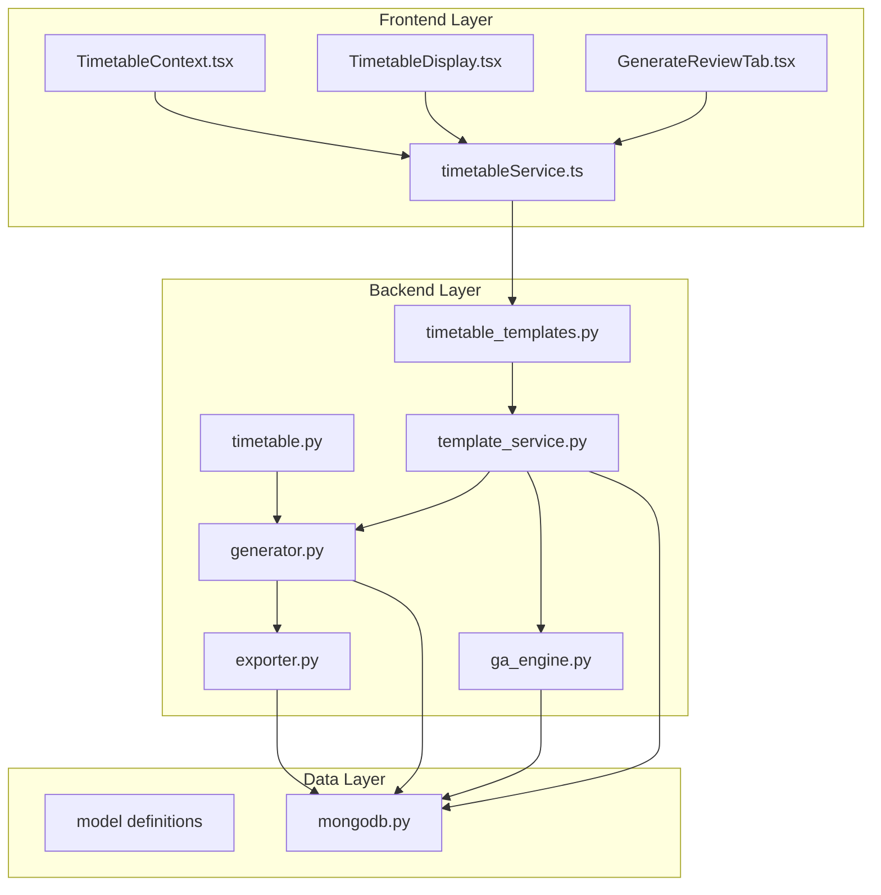
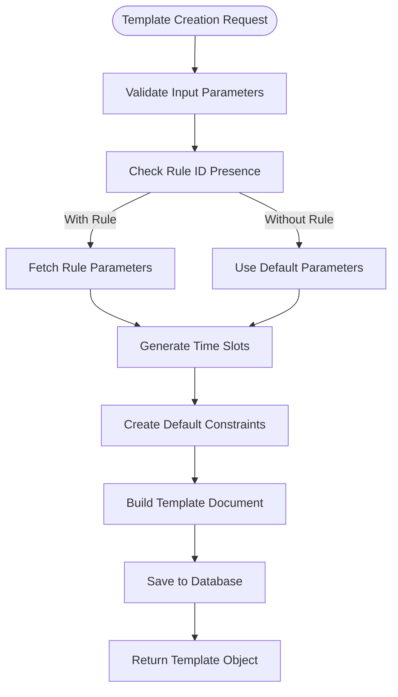
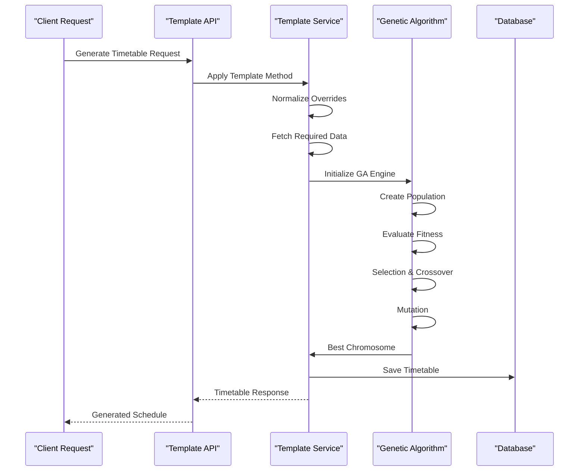
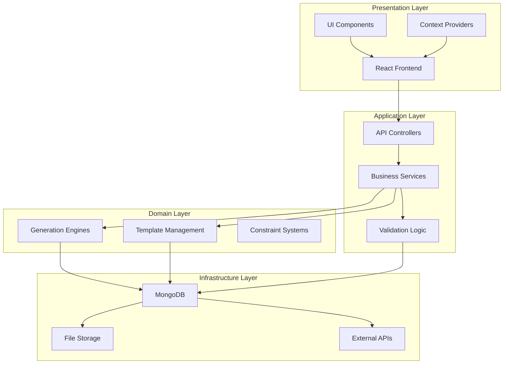
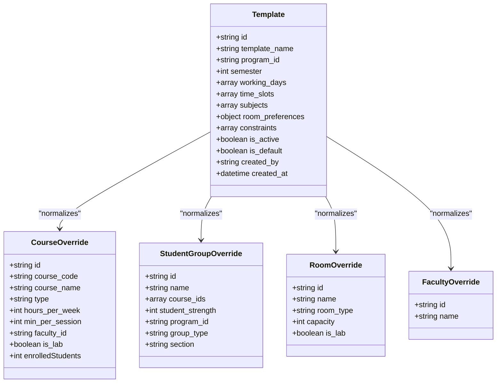
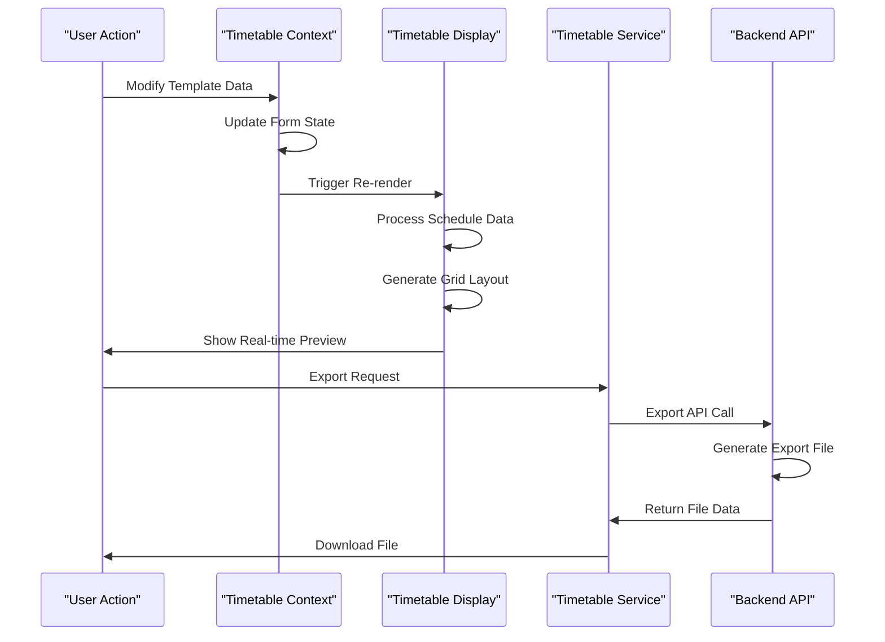
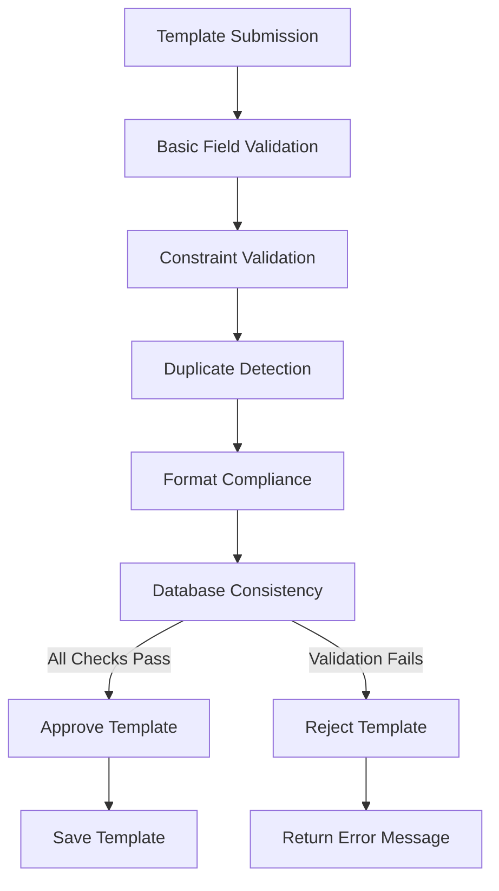
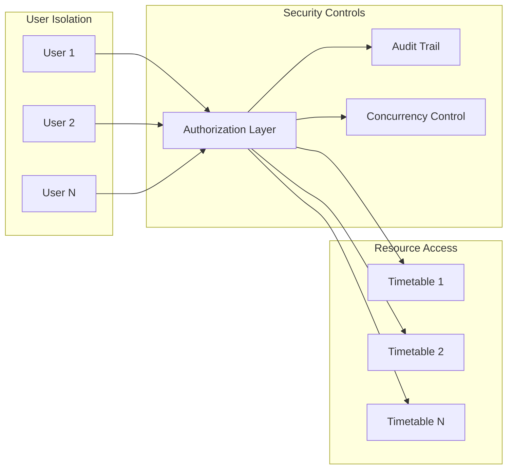
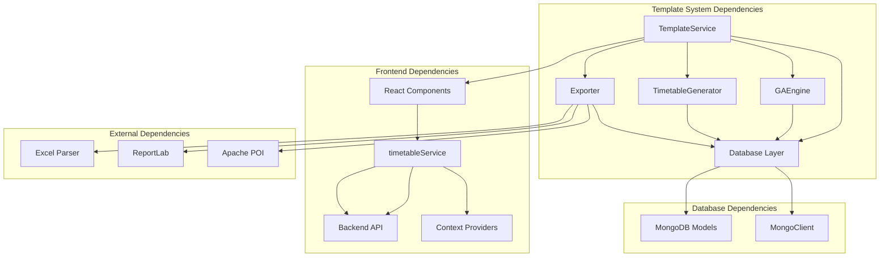

# Template-Based Generation System

<cite>
**Referenced Files in This Document**
- [template_service.py](file://backend/app/services/timetable/template_service.py)
- [timetable_templates.py](file://backend/app/api/v1/endpoints/timetable_templates.py)
- [timetable.py](file://backend/app/api/v1/endpoints/timetable.py)
- [generator.py](file://backend/app/services/timetable/generator.py)
- [ga_engine.py](file://backend/app/services/timetable/ga_engine.py)
- [exporter.py](file://backend/app/services/timetable/exporter.py)
- [constraint.py](file://backend/app/models/constraint.py)
- [rule.py](file://backend/app/models/rule.py)
- [mongodb.py](file://backend/app/db/mongodb.py)
- [timetableService.ts](file://frontend/src/services/timetableService.ts)
- [TimetableDisplay.tsx](file://frontend/src/components/pages/CreateTimetable/TimetableDisplay.tsx)
- [GenerateReviewTab.tsx](file://frontend/src/components/pages/CreateTimetable/GenerateReviewTab.tsx)
- [TimetableContext.tsx](file://frontend/src/contexts/TimetableContext.tsx)
</cite>

## Table of Contents
1. [Introduction](#introduction)
2. [Project Structure](#project-structure)
3. [Core Components](#core-components)
4. [Architecture Overview](#architecture-overview)
5. [Detailed Component Analysis](#detailed-component-analysis)
6. [Dependency Analysis](#dependency-analysis)
7. [Performance Considerations](#performance-considerations)
8. [Troubleshooting Guide](#troubleshooting-guide)
9. [Conclusion](#conclusion)

## Introduction

The Template-Based Generation System is a sophisticated timetable management platform that leverages reusable templates to automate the creation of academic schedules. This system combines intelligent constraint-based generation with flexible template inheritance to produce optimized timetables that meet institutional requirements while maintaining flexibility for customization.

The platform supports multiple generation approaches including genetic algorithm optimization, rule-based constraint satisfaction, and template-driven scheduling. It provides comprehensive template management capabilities including metadata storage, parameter substitution, batch processing, and collaborative editing features.

## Project Structure

The system follows a modern full-stack architecture with clear separation of concerns:

**Diagram sources**
- [timetableService.ts:1-772](file://frontend/src/services/timetableService.ts#L1-L772)
- [timetable_templates.py:1-106](file://backend/app/api/v1/endpoints/timetable_templates.py#L1-L106)
- [template_service.py:1-486](file://backend/app/services/timetable/template_service.py#L1-L486)

**Section sources**
- [timetableService.ts:1-772](file://frontend/src/services/timetableService.ts#L1-L772)
- [timetable_templates.py:1-106](file://backend/app/api/v1/endpoints/timetable_templates.py#L1-L106)
- [template_service.py:1-486](file://backend/app/services/timetable/template_service.py#L1-L486)

## Core Components

### Template Management Service

The TemplateService serves as the central orchestrator for all template-related operations, providing comprehensive template lifecycle management including creation, retrieval, updates, and deletion.

**Key Features:**
- **Template Normalization**: Automatic data normalization for courses, student groups, rooms, and faculty overrides
- **Template Retrieval**: Intelligent template lookup by program and semester with fallback mechanisms
- **Template Application**: End-to-end template application with constraint validation and conflict resolution
- **Batch Processing**: Support for bulk template operations and mass generation workflows

**Template Creation Pipeline:**

**Diagram sources**
- [template_service.py:98-206](file://backend/app/services/timetable/template_service.py#L98-L206)

**Section sources**
- [template_service.py:1-486](file://backend/app/services/timetable/template_service.py#L1-L486)

### Constraint-Based Generation Engine

The system implements sophisticated constraint satisfaction algorithms that ensure generated timetables meet institutional requirements while optimizing for efficiency and fairness.

**Constraint Types Supported:**
- **Hard Constraints**: Non-negotiable rules (room capacity, faculty availability, time conflicts)
- **Soft Constraints**: Preference-based rules (preferred time slots, balanced workload)
- **Optimization Metrics**: Performance indicators (conflict minimization, resource utilization)

**Generation Algorithm:**

**Diagram sources**
- [timetable_templates.py:10-106](file://backend/app/api/v1/endpoints/timetable_templates.py#L10-L106)
- [template_service.py:209-414](file://backend/app/services/timetable/template_service.py#L209-L414)

**Section sources**
- [generator.py:1-402](file://backend/app/services/timetable/generator.py#L1-L402)
- [ga_engine.py:1-414](file://backend/app/services/timetable/ga_engine.py#L1-L414)

### Export and Validation System

The system provides comprehensive export capabilities supporting multiple formats (Excel, PDF, JSON, CSV) along with robust validation mechanisms to ensure timetable quality and compliance.

**Export Formats:**
- **Excel**: Rich formatting with pivot tables and conditional formatting
- **PDF**: Professional printing-ready layouts with customizable styling
- **JSON**: Machine-readable format for integration and processing
- **CSV**: Lightweight format for spreadsheet applications

**Section sources**
- [exporter.py:1-383](file://backend/app/services/timetable/exporter.py#L1-L383)

## Architecture Overview

The system employs a layered architecture with clear separation between presentation, business logic, and data persistence layers:

**Diagram sources**
- [timetableService.ts:1-772](file://frontend/src/services/timetableService.ts#L1-L772)
- [timetable_templates.py:1-106](file://backend/app/api/v1/endpoints/timetable_templates.py#L1-L106)
- [template_service.py:1-486](file://backend/app/services/timetable/template_service.py#L1-L486)

## Detailed Component Analysis

### Template Inheritance and Parameter Substitution

The template system implements a hierarchical inheritance model that allows templates to inherit properties from parent templates while enabling selective overrides.

**Template Inheritance Flow:**

**Diagram sources**
- [template_service.py:10-78](file://backend/app/services/timetable/template_service.py#L10-L78)

**Section sources**
- [template_service.py:10-78](file://backend/app/services/timetable/template_service.py#L10-L78)

### Real-Time Preview Generation

The frontend implements sophisticated real-time preview capabilities that allow users to visualize timetable changes before finalization.

**Preview Generation Process:**

**Diagram sources**
- [TimetableDisplay.tsx:1-661](file://frontend/src/components/pages/CreateTimetable/TimetableDisplay.tsx#L1-L661)
- [TimetableContext.tsx:1-629](file://frontend/src/contexts/TimetableContext.tsx#L1-L629)

**Section sources**
- [TimetableDisplay.tsx:1-661](file://frontend/src/components/pages/CreateTimetable/TimetableDisplay.tsx#L1-L661)
- [TimetableContext.tsx:1-629](file://frontend/src/contexts/TimetableContext.tsx#L1-L629)

### Template Validation Pipeline

The system implements a comprehensive validation pipeline that ensures template integrity and prevents generation conflicts.

**Validation Workflow:**

**Diagram sources**
- [template_service.py:448-486](file://backend/app/services/timetable/template_service.py#L448-L486)

**Section sources**
- [template_service.py:448-486](file://backend/app/services/timetable/template_service.py#L448-L486)

### Collaborative Editing Features

The system supports collaborative editing through user isolation, audit trails, and concurrent access controls.

**Collaboration Security Model:**

**Diagram sources**
- [timetable.py:17-114](file://backend/app/api/v1/endpoints/timetable.py#L17-L114)

**Section sources**
- [timetable.py:17-114](file://backend/app/api/v1/endpoints/timetable.py#L17-L114)

## Dependency Analysis

The system exhibits strong modularity with well-defined dependencies between components:

**Diagram sources**
- [template_service.py:1-486](file://backend/app/services/timetable/template_service.py#L1-L486)
- [timetableService.ts:1-772](file://frontend/src/services/timetableService.ts#L1-L772)

**Section sources**
- [template_service.py:1-486](file://backend/app/services/timetable/template_service.py#L1-L486)
- [timetableService.ts:1-772](file://frontend/src/services/timetableService.ts#L1-L772)

## Performance Considerations

The system implements several performance optimization strategies:

**Database Optimization:**
- Efficient indexing on frequently queried fields (program_id, semester, created_by)
- Connection pooling for database operations
- Batch operations for bulk data processing

**Memory Management:**
- Lazy loading of large datasets
- Proper resource cleanup in export operations
- Optimized data structures for template processing

**API Performance:**
- Response caching for static data
- Pagination for large result sets
- Asynchronous processing for heavy operations

## Troubleshooting Guide

### Common Issues and Solutions

**Template Generation Failures:**
- Verify template completeness (working_days, time_slots, constraints)
- Check data normalization for overrides
- Validate database connectivity

**Export Issues:**
- Ensure sufficient memory for large exports
- Verify file permissions for download
- Check format-specific dependencies

**Performance Problems:**
- Monitor database query performance
- Implement proper indexing
- Consider pagination for large datasets

**Section sources**
- [mongodb.py:1-41](file://backend/app/db/mongodb.py#L1-L41)
- [template_service.py:1-486](file://backend/app/services/timetable/template_service.py#L1-L486)

## Conclusion

The Template-Based Generation System provides a comprehensive solution for automated timetable creation with robust template management, constraint-based generation, and flexible export capabilities. The system's modular architecture enables easy maintenance and extension while providing powerful features for educational institutions.

Key strengths include:
- **Template Flexibility**: Hierarchical inheritance with parameter substitution
- **Constraint Satisfaction**: Sophisticated algorithms ensuring compliance
- **Real-time Preview**: Interactive user experience with instant feedback
- **Export Versatility**: Multiple format support for diverse use cases
- **Collaborative Features**: Secure multi-user access with audit trails

The system demonstrates best practices in software architecture, data modeling, and user experience design, making it suitable for deployment in educational environments requiring scalable timetable management solutions.