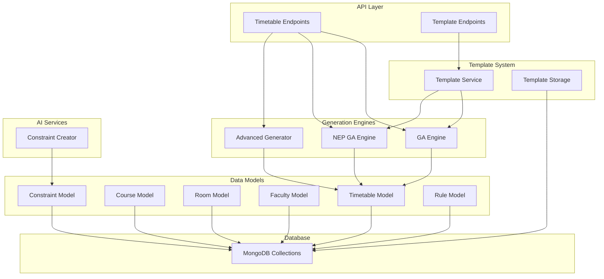
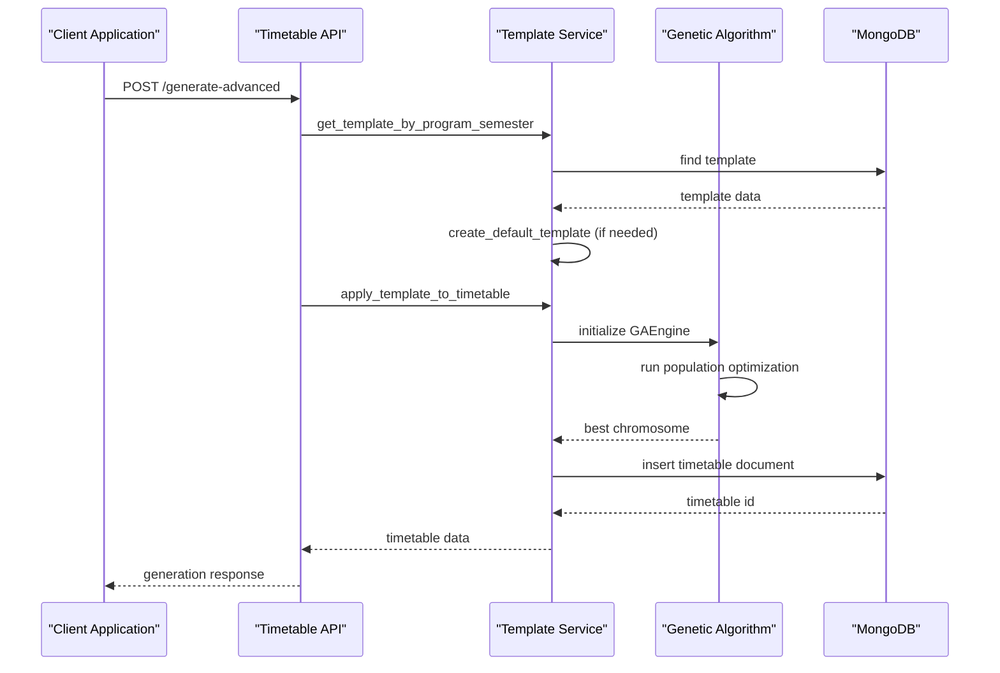
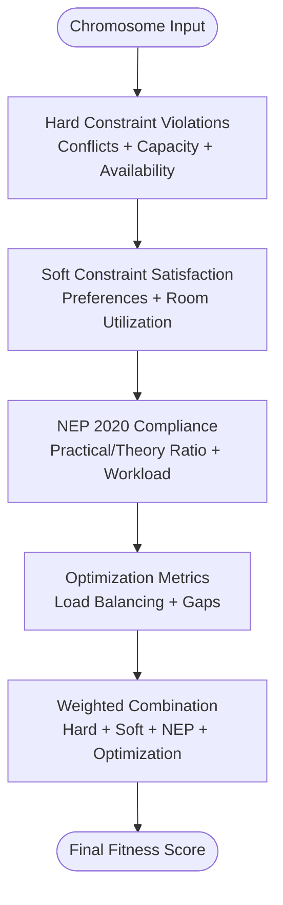
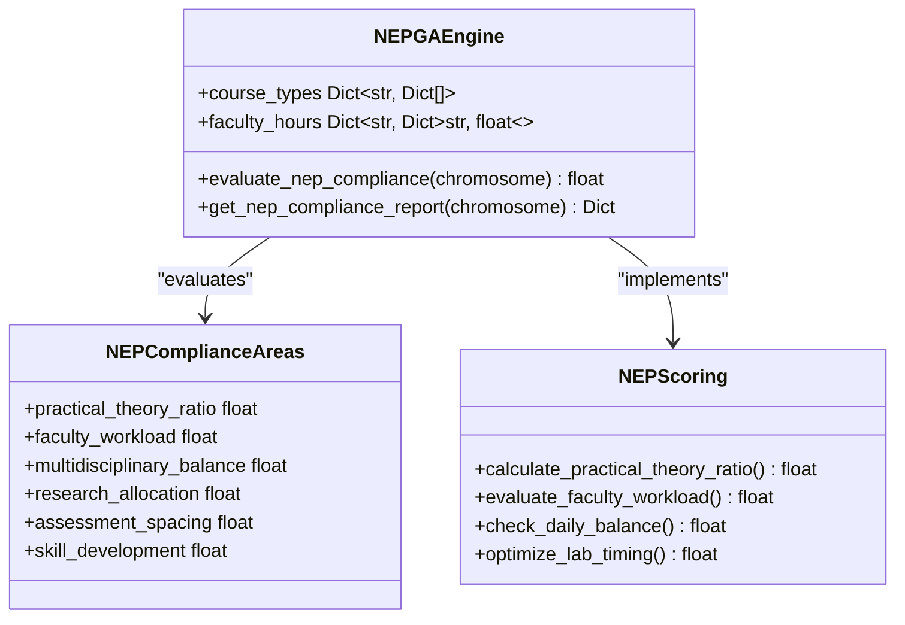
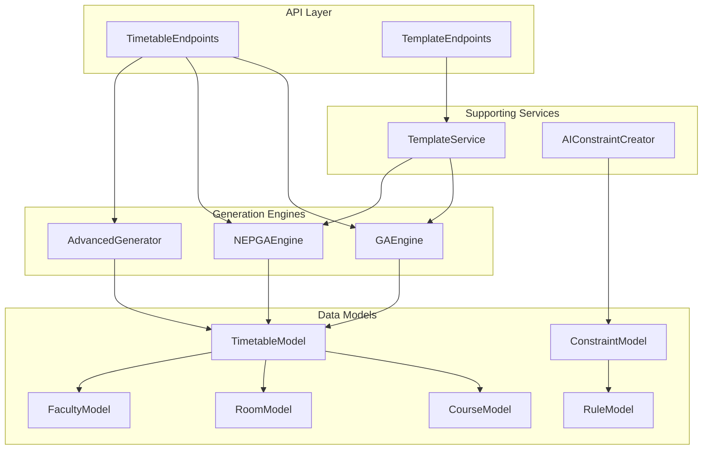

# Timetable Generation Engine

<cite>
**Referenced Files in This Document**
- [ga_engine.py](file://backend/app/services/timetable/ga_engine.py)
- [nep_ga_engine.py](file://backend/app/services/timetable/nep_ga_engine.py)
- [advanced_generator.py](file://backend/app/services/timetable/advanced_generator.py)
- [template_service.py](file://backend/app/services/timetable/template_service.py)
- [generator.py](file://backend/app/services/timetable/generator.py)
- [timetable.py](file://backend/app/api/v1/endpoints/timetable.py)
- [timetable_templates.py](file://backend/app/api/v1/endpoints/timetable_templates.py)
- [constraint_creator.py](file://backend/app/services/ai/constraint_creator.py)
- [constraint.py](file://backend/app/models/constraint.py)
- [rule.py](file://backend/app/models/rule.py)
- [timetable_model.py](file://backend/app/models/timetable.py)
- [course_model.py](file://backend/app/models/course.py)
- [student_group_model.py](file://backend/app/models/student_group.py)
- [room_model.py](file://backend/app/models/room.py)
- [faculty_model.py](file://backend/app/models/faculty.py)
</cite>

## Table of Contents
1. [Introduction](#introduction)
2. [Project Structure](#project-structure)
3. [Core Components](#core-components)
4. [Architecture Overview](#architecture-overview)
5. [Detailed Component Analysis](#detailed-component-analysis)
6. [Dependency Analysis](#dependency-analysis)
7. [Performance Considerations](#performance-considerations)
8. [Troubleshooting Guide](#troubleshooting-guide)
9. [Conclusion](#conclusion)

## Introduction
This document provides comprehensive technical documentation for the timetable generation engine, focusing on constraint satisfaction problem solving, genetic algorithm implementation, and template-based generation. It explains the CSP solver algorithms used for conflict resolution and optimal assignment, advanced generation techniques including NEP 2020 compliance validation, and performance optimization strategies. The document also details the template system for reusable generation patterns, batch processing capabilities, constraint validation pipeline, fitness evaluation functions, and solution quality metrics. Implementation details cover genetic algorithm components, mutation and crossover operators, and convergence criteria, along with examples of generation workflows and troubleshooting common constraint conflicts.

## Project Structure
The timetable generation engine is organized around several key modules:
- Genetic Algorithm Engines: Standard GA and NEP 2020-compliant GA
- Constraint Satisfaction Generators: Advanced constraint-based generator
- Template System: Reusable generation patterns with batch processing
- API Endpoints: REST endpoints for generation, validation, and export
- AI Constraint Creator: Natural language parsing and NEP compliance validation
- Data Models: Pydantic models for timetable, courses, rooms, faculty, and constraints

**Diagram sources**
- [timetable.py:234-537](file://backend/app/api/v1/endpoints/timetable.py#L234-L537)
- [timetable_templates.py:10-105](file://backend/app/api/v1/endpoints/timetable_templates.py#L10-L105)
- [ga_engine.py:19-414](file://backend/app/services/timetable/ga_engine.py#L19-L414)
- [nep_ga_engine.py:33-794](file://backend/app/services/timetable/nep_ga_engine.py#L33-L794)
- [advanced_generator.py:201-707](file://backend/app/services/timetable/advanced_generator.py#L201-L707)
- [template_service.py:6-486](file://backend/app/services/timetable/template_service.py#L6-L486)
- [constraint_creator.py:18-781](file://backend/app/services/ai/constraint_creator.py#L18-L781)

**Section sources**
- [timetable.py:1-728](file://backend/app/api/v1/endpoints/timetable.py#L1-L728)
- [timetable_templates.py:1-106](file://backend/app/api/v1/endpoints/timetable_templates.py#L1-L106)

## Core Components
This section covers the primary generation engines and their core functionalities.

### Genetic Algorithm Engine (Standard)
The standard GA engine implements a chromosome-based representation of timetables with:
- Chromosome structure: Each gene encodes course, group, faculty, room, day, and time slot
- Population initialization: Random assignment respecting room types and lab requirements
- Fitness evaluation: Multi-objective scoring combining hard constraints, soft constraints, and optimization metrics
- Selection: Tournament selection with configurable tournament size
- Crossover: Order crossover preserving gene order relationships
- Mutation: Four operators (swap, insertion, inversion, attribute) with weighted probabilities
- Convergence: Early stopping based on fitness improvement thresholds

Key implementation aspects:
- Time conversion utilities for slot comparisons
- Conflict detection across faculty, rooms, and groups
- Penalty-based hard constraint scoring
- Soft constraint scoring for room capacity utilization
- Optimization scoring for workload balancing

**Section sources**
- [ga_engine.py:19-414](file://backend/app/services/timetable/ga_engine.py#L19-L414)

### NEP 2020 Compliant Genetic Algorithm Engine
The NEP GA engine extends the standard GA with NEP 2020 compliance:
- Enhanced fitness function incorporating NEP objectives
- Practical/theory ratio optimization (recommended 30-40% practical)
- Faculty workload management (max 18 hours/week)
- Multidisciplinary course distribution
- Research and innovation time allocation
- Comprehensive compliance reporting

Advanced features:
- Course categorization (theory, lab, practical, multidisciplinary, skill-based, research, elective, core)
- Daily load balancing with variance normalization
- Lab timing preferences (afternoon scheduling)
- Continuous assessment spacing considerations
- Detailed NEP compliance reports with actionable recommendations

**Section sources**
- [nep_ga_engine.py:33-794](file://backend/app/services/timetable/nep_ga_engine.py#L33-L794)

### Advanced Constraint-Based Generator
The advanced generator implements explicit CSP with:
- TimeSlot dataclass with overlap detection
- CourseRequirement modeling with session structure calculation
- Room and Faculty specifications with capacity/type matching
- Comprehensive constraint enforcement:
  - Working days and time bounds
  - Lunch break exclusions
  - Maximum continuous periods
  - Daily period limits
  - Lab session constraints
  - Room capacity requirements
  - Faculty availability and workload limits

Generation strategy:
- Priority-based scheduling: Labs first, then theory sessions
- Double period preference for heavy theory courses
- Soft constraint prioritization for better student experience
- Validation pipeline with detailed error reporting

**Section sources**
- [advanced_generator.py:27-707](file://backend/app/services/timetable/advanced_generator.py#L27-L707)

### Template Service System
The template service enables reusable generation patterns:
- Template creation from program/semester rules
- Default template generation with rule-based configuration
- Template application to create timetables
- Batch processing capabilities through template reuse
- Override mechanisms for courses, groups, rooms, and faculty

Template features:
- Time slot generation with theory and lab combinations
- Break time configuration
- Room preferences by type
- Constraint inheritance and customization
- ObjectId conversion for frontend compatibility

**Section sources**
- [template_service.py:6-486](file://backend/app/services/timetable/template_service.py#L6-L486)

## Architecture Overview
The system follows a layered architecture with clear separation of concerns:

**Diagram sources**
- [timetable.py:266-375](file://backend/app/api/v1/endpoints/timetable.py#L266-L375)
- [template_service.py:209-413](file://backend/app/services/timetable/template_service.py#L209-L413)

The architecture supports multiple generation strategies:
- Rule-based generation for simple constraints
- AI-powered generation for complex optimization
- Template-based generation for institutional standards
- NEP 2020 compliance for educational guidelines

## Detailed Component Analysis

### Genetic Algorithm Implementation Details

#### Chromosome Representation and Encoding
Each chromosome represents a complete timetable assignment:
- Gene structure includes course metadata, group association, faculty assignment, room selection, and time slot
- Encoding preserves relationships between course requirements and resource availability
- Random initialization respects room type constraints and lab requirements

#### Fitness Evaluation Pipeline
The fitness function combines multiple objectives:

**Diagram sources**
- [ga_engine.py:202-212](file://backend/app/services/timetable/ga_engine.py#L202-L212)
- [nep_ga_engine.py:358-379](file://backend/app/services/timetable/nep_ga_engine.py#L358-L379)

#### Crossover and Mutation Operators
Crossover strategies:
- Order crossover maintaining gene order relationships
- Segment-based copying with remaining gene filling
- Preservation of course-hour requirements

Mutation operators:
- Swap mutation: Random gene exchange
- Insertion mutation: Move gene to different position
- Inversion mutation: Reverse gene segment
- Attribute mutation: Random attribute value change

Convergence criteria:
- Fitness improvement threshold monitoring
- Early stopping at 95%+ fitness
- Generation limit enforcement
- Diversity preservation through elitism

**Section sources**
- [ga_engine.py:283-381](file://backend/app/services/timetable/ga_engine.py#L283-L381)
- [nep_ga_engine.py:572-681](file://backend/app/services/timetable/nep_ga_engine.py#L572-L681)

### Constraint Satisfaction Problem Solving

#### Advanced Generator Constraint Model
The advanced generator implements explicit CSP with:
- TimeSlot overlap detection for resource conflicts
- Course requirement modeling with session structure calculation
- Room capacity and type matching
- Faculty subject expertise and availability constraints
- Student group enrollment and capacity matching

Constraint enforcement hierarchy:
- Hard constraints: Non-negotiable rules (conflicts, capacity, availability)
- Soft constraints: Preferred arrangements (timing, preferences)
- Optimization constraints: Quality metrics (balance, gaps)

**Section sources**
- [advanced_generator.py:123-707](file://backend/app/services/timetable/advanced_generator.py#L123-L707)

#### Template-Based Constraint Validation
Template service ensures constraint consistency:
- Rule-based template creation from program configurations
- Constraint inheritance from program rules
- Override mechanisms for specific requirements
- Validation of template applicability

**Section sources**
- [template_service.py:80-206](file://backend/app/services/timetable/template_service.py#L80-L206)

### NEP 2020 Compliance System

#### Compliance Scoring Mechanism
The NEP compliance system evaluates multiple areas:

**Diagram sources**
- [nep_ga_engine.py:453-527](file://backend/app/services/timetable/nep_ga_engine.py#L453-L527)

#### Compliance Reporting and Recommendations
The system generates comprehensive compliance reports:
- Overall compliance score calculation
- Area-specific scores with recommendations
- Actionable suggestions for improvement
- Statistical analysis of scheduling patterns

**Section sources**
- [nep_ga_engine.py:722-793](file://backend/app/services/timetable/nep_ga_engine.py#L722-L793)

### Template System Architecture

#### Template Creation and Management
Template service provides:
- Dynamic template creation from rule configurations
- Default template generation with college settings
- Template storage with program/semester association
- Template retrieval and application workflows

Template features:
- Time slot generation with theory/lab combinations
- Break time configuration
- Room preference mapping
- Constraint inheritance and customization

**Section sources**
- [template_service.py:80-206](file://backend/app/services/timetable/template_service.py#L80-L206)

#### Batch Processing Capabilities
Batch processing enables:
- Multiple program/semester generation
- Template reuse across institutions
- Override mechanisms for customization
- Consistent constraint application

**Section sources**
- [template_service.py:209-413](file://backend/app/services/timetable/template_service.py#L209-L413)

## Dependency Analysis

**Diagram sources**
- [timetable.py:234-537](file://backend/app/api/v1/endpoints/timetable.py#L234-L537)
- [timetable_templates.py:10-105](file://backend/app/api/v1/endpoints/timetable_templates.py#L10-L105)
- [ga_engine.py:19-414](file://backend/app/services/timetable/ga_engine.py#L19-L414)
- [nep_ga_engine.py:33-794](file://backend/app/services/timetable/nep_ga_engine.py#L33-L794)
- [advanced_generator.py:201-707](file://backend/app/services/timetable/advanced_generator.py#L201-L707)
- [template_service.py:6-486](file://backend/app/services/timetable/template_service.py#L6-L486)
- [constraint_creator.py:18-781](file://backend/app/services/ai/constraint_creator.py#L18-L781)

The dependency graph reveals:
- API endpoints orchestrate generation workflows
- Template service acts as a bridge between templates and engines
- AI constraint creator provides external constraint intelligence
- Data models define the canonical data structures
- Engines depend on shared utilities and validation logic

**Section sources**
- [timetable.py:1-728](file://backend/app/api/v1/endpoints/timetable.py#L1-L728)
- [timetable_templates.py:1-106](file://backend/app/api/v1/endpoints/timetable_templates.py#L1-L106)

## Performance Considerations
The system implements several optimization strategies:

### Algorithmic Optimizations
- Population sizing: 50-60 individuals with 150-200 generations
- Elite preservation: Maintains best solutions across generations
- Tournament selection: Reduces computational overhead
- Convergence monitoring: Early stopping prevents unnecessary computation

### Memory and Computational Efficiency
- Chromosome caching and reuse
- Incremental fitness evaluation
- Efficient conflict detection using hash maps
- Parallelizable template application

### Scalability Features
- Template-based reuse reduces recomputation
- Modular design allows component replacement
- Database indexing for efficient lookups
- Batch processing for multiple generations

## Troubleshooting Guide

### Common Constraint Conflicts
**Faculty Overload Issues:**
- Symptom: Repeated fitness penalties for faculty conflicts
- Solution: Adjust faculty workload constraints or increase faculty pool
- Prevention: Monitor faculty hours during generation

**Room Capacity Problems:**
- Symptom: Capacity violation penalties in fitness scoring
- Solution: Increase room capacity or adjust student group sizes
- Prevention: Validate room capacity during template creation

**Lab Scheduling Conflicts:**
- Symptom: Lab session placement failures
- Solution: Ensure adequate lab facilities and adjust scheduling preferences
- Prevention: Pre-validate lab availability during template setup

### Generation Failures
**Population Convergence Issues:**
- Symptom: Stagnant fitness scores despite continued generations
- Solution: Increase mutation rate or introduce diversity mechanisms
- Prevention: Monitor convergence metrics during generation

**Template Application Errors:**
- Symptom: Template creation/validation failures
- Solution: Verify program/semester associations and rule configurations
- Prevention: Validate template data before application

**Section sources**
- [ga_engine.py:125-165](file://backend/app/services/timetable/ga_engine.py#L125-L165)
- [nep_ga_engine.py:259-318](file://backend/app/services/timetable/nep_ga_engine.py#L259-L318)
- [advanced_generator.py:569-615](file://backend/app/services/timetable/advanced_generator.py#L569-L615)

## Conclusion
The timetable generation engine provides a robust, extensible framework for academic scheduling with multiple generation strategies. The genetic algorithm implementations offer powerful optimization capabilities with NEP 2020 compliance, while the constraint satisfaction approach ensures strict adherence to institutional requirements. The template system enables scalable, reusable generation patterns with comprehensive validation and reporting capabilities. The modular architecture supports future enhancements including additional constraint types, alternative optimization algorithms, and expanded compliance frameworks.

The system successfully balances computational efficiency with solution quality, providing both automated optimization and human oversight capabilities. The comprehensive constraint validation pipeline, detailed compliance reporting, and flexible template system make it suitable for diverse institutional needs while maintaining educational standards and regulatory compliance.