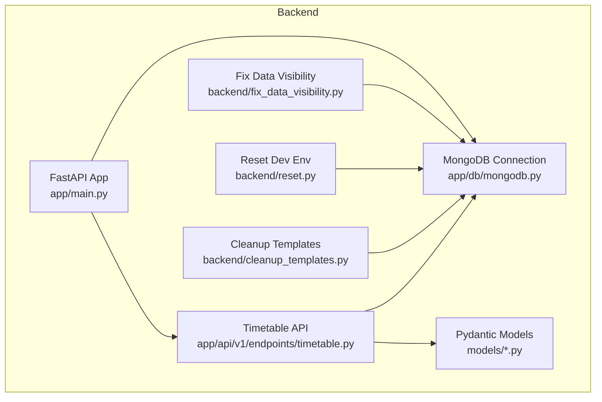
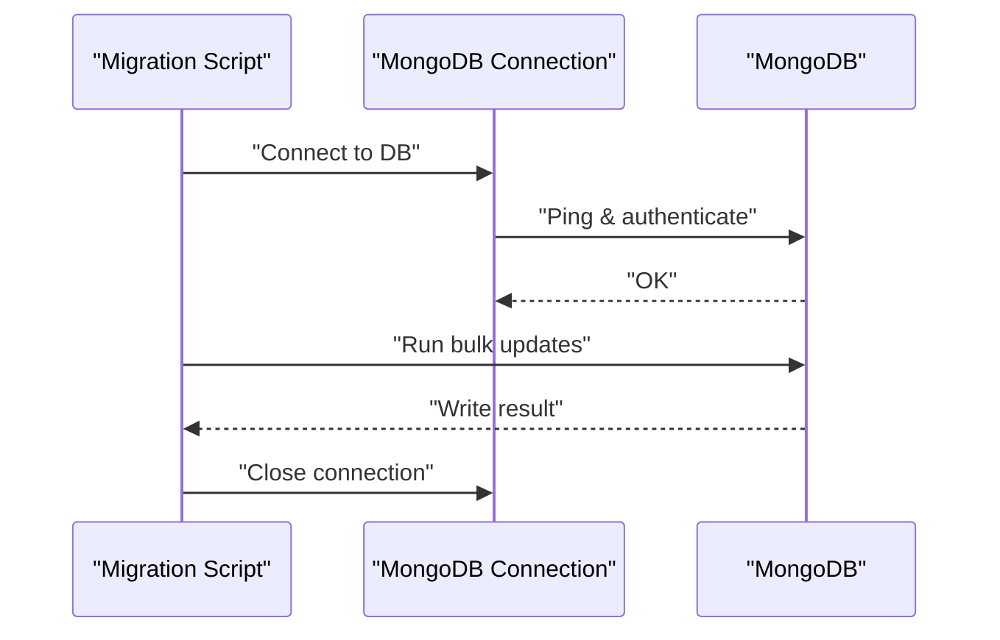
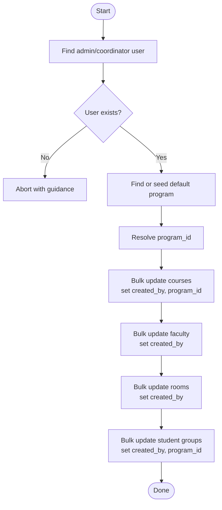
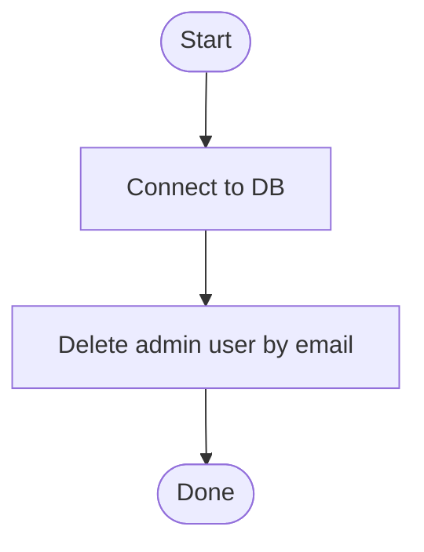
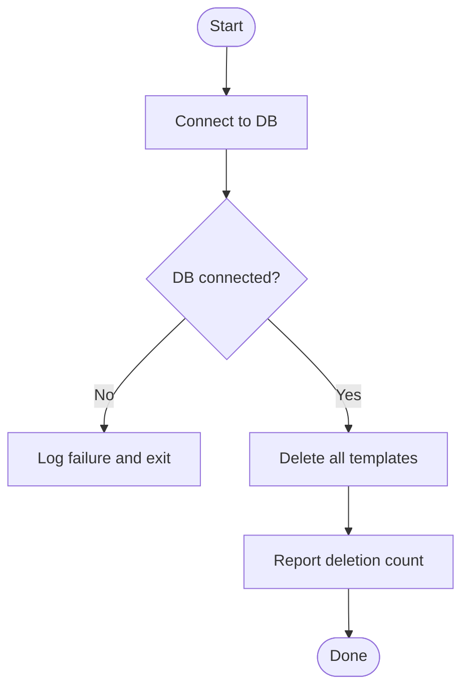
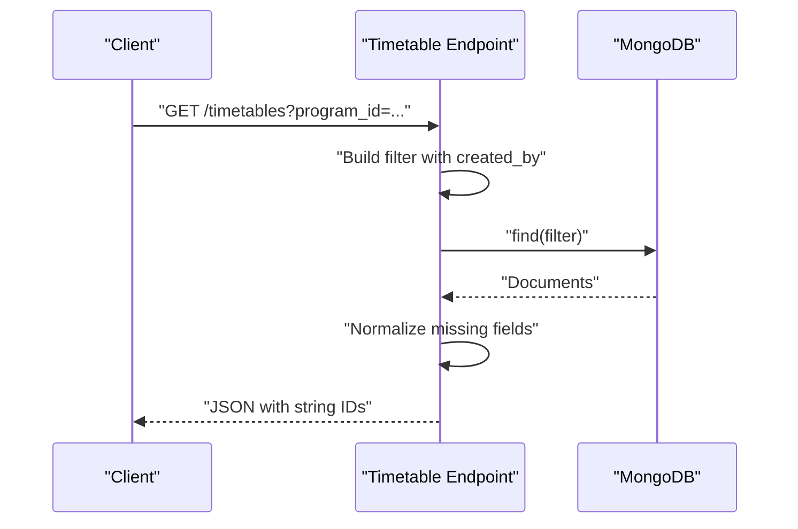
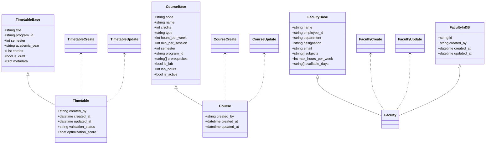
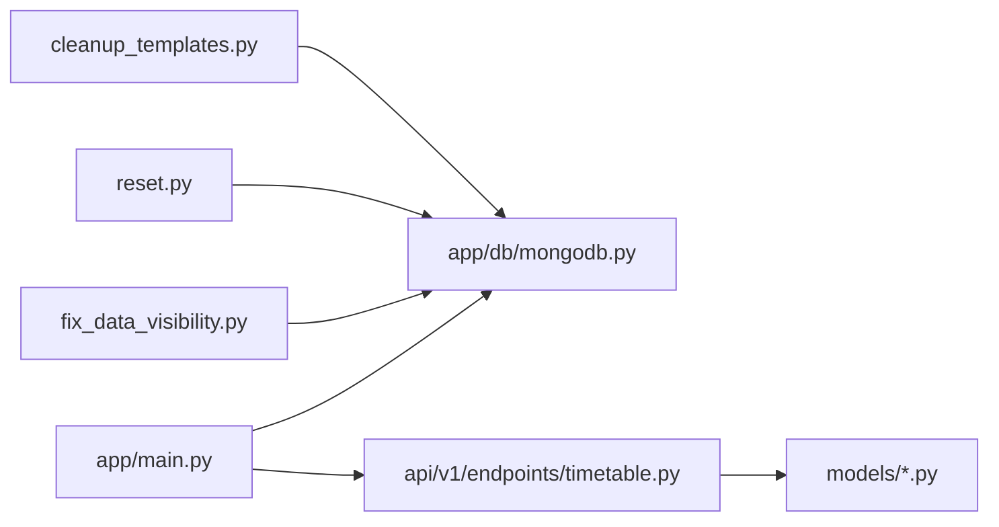

# Data Migration

<cite>
**Referenced Files in This Document**
- [fix_data_visibility.py](file://backend/fix_data_visibility.py)
- [reset.py](file://backend/reset.py)
- [cleanup_templates.py](file://backend/cleanup_templates.py)
- [mongodb.py](file://backend/app/db/mongodb.py)
- [main.py](file://backend/app/main.py)
- [timetable.py](file://backend/app/api/v1/endpoints/timetable.py)
- [timetable_model.py](file://backend/app/models/timetable.py)
- [course_model.py](file://backend/app/models/course.py)
- [faculty_model.py](file://backend/app/models/faculty.py)
- [faculty_endpoint.py](file://backend/app/api/v1/endpoints/faculty.py)
</cite>

## Table of Contents
1. [Introduction](#introduction)
2. [Project Structure](#project-structure)
3. [Core Components](#core-components)
4. [Architecture Overview](#architecture-overview)
5. [Detailed Component Analysis](#detailed-component-analysis)
6. [Dependency Analysis](#dependency-analysis)
7. [Performance Considerations](#performance-considerations)
8. [Troubleshooting Guide](#troubleshooting-guide)
9. [Conclusion](#conclusion)
10. [Appendices](#appendices)

## Introduction
This document explains ShedMaster’s data migration and transformation processes. It covers schema evolution patterns, version management strategies, backward compatibility considerations, and operational procedures for safe data updates. It documents three key maintenance scripts—data visibility fix, development reset, and template cleanup—and details bulk update operations, atomicity patterns, backup/recovery, and validation strategies. Step-by-step guides and troubleshooting procedures are included for common migration scenarios.

## Project Structure
The backend uses FastAPI with Motor for asynchronous MongoDB access. Data migration scripts operate independently of the web server lifecycle, while API endpoints enforce user isolation and data validation. The database connection is established at application startup and closed on shutdown.

**Diagram sources**
- [main.py:25-32](file://backend/app/main.py#L25-L32)
- [mongodb.py:11-33](file://backend/app/db/mongodb.py#L11-L33)
- [timetable.py:17-71](file://backend/app/api/v1/endpoints/timetable.py#L17-L71)
- [fix_data_visibility.py:5-74](file://backend/fix_data_visibility.py#L5-L74)
- [reset.py:4-12](file://backend/reset.py#L4-L12)
- [cleanup_templates.py:7-35](file://backend/cleanup_templates.py#L7-L35)

**Section sources**
- [main.py:25-32](file://backend/app/main.py#L25-L32)
- [mongodb.py:11-33](file://backend/app/db/mongodb.py#L11-L33)

## Core Components
- Data migration scripts:
  - fix_data_visibility.py: Ensures ownership and program linkage for courses, faculty, rooms, and student groups; adds missing fields for UI visibility.
  - reset.py: Removes a specific admin user for development resets.
  - cleanup_templates.py: Deletes old timetable templates to force regeneration with corrected time slots.
- Database connectivity:
  - mongodb.py: Centralized async connection management with graceful fallback when DB is unavailable.
- API and models:
  - timetable.py: Enforces user isolation via created_by filters and handles backward-compatible field normalization.
  - timetable_model.py, course_model.py, faculty_model.py: Define schemas and validation rules.

**Section sources**
- [fix_data_visibility.py:5-74](file://backend/fix_data_visibility.py#L5-L74)
- [reset.py:4-12](file://backend/reset.py#L4-L12)
- [cleanup_templates.py:7-35](file://backend/cleanup_templates.py#L7-L35)
- [mongodb.py:11-33](file://backend/app/db/mongodb.py#L11-L33)
- [timetable.py:17-71](file://backend/app/api/v1/endpoints/timetable.py#L17-L71)
- [timetable_model.py:21-52](file://backend/app/models/timetable.py#L21-L52)
- [course_model.py:6-43](file://backend/app/models/course.py#L6-L43)
- [faculty_model.py:5-39](file://backend/app/models/faculty.py#L5-L39)

## Architecture Overview
The migration pipeline integrates standalone scripts with the application runtime. Scripts connect directly to MongoDB, while API endpoints rely on the shared connection managed by the app lifecycle.

**Diagram sources**
- [mongodb.py:11-33](file://backend/app/db/mongodb.py#L11-L33)
- [fix_data_visibility.py:6-74](file://backend/fix_data_visibility.py#L6-L74)
- [reset.py:5-12](file://backend/reset.py#L5-L12)
- [cleanup_templates.py:10-27](file://backend/cleanup_templates.py#L10-L27)

## Detailed Component Analysis

### fix_data_visibility.py
Purpose:
- Assign ownership (created_by) and program linkage (program_id) to entities requiring these fields for UI visibility.
- Normalize inconsistent datasets by adding missing fields.

Key behaviors:
- Validates presence of admin/coordinator user and a program; seeds defaults if missing.
- Bulk updates courses, faculty, rooms, and student groups with set operations.
- Uses update_many for efficient bulk transformations.

**Diagram sources**
- [fix_data_visibility.py:5-74](file://backend/fix_data_visibility.py#L5-L74)

**Section sources**
- [fix_data_visibility.py:5-74](file://backend/fix_data_visibility.py#L5-L74)

### reset.py
Purpose:
- Clean development environments by removing a specific admin user.

Behavior:
- Connects to MongoDB and deletes matching user records.

**Diagram sources**
- [reset.py:4-12](file://backend/reset.py#L4-L12)

**Section sources**
- [reset.py:4-12](file://backend/reset.py#L4-L12)

### cleanup_templates.py
Purpose:
- Remove outdated timetable templates to force regeneration with corrected time slots.

Behavior:
- Establishes DB connection via shared module.
- Deletes all timetable_templates documents.
- Provides next steps for regeneration and verification.

**Diagram sources**
- [cleanup_templates.py:7-35](file://backend/cleanup_templates.py#L7-L35)
- [mongodb.py:11-33](file://backend/app/db/mongodb.py#L11-L33)

**Section sources**
- [cleanup_templates.py:7-35](file://backend/cleanup_templates.py#L7-L35)

### API Security and Backward Compatibility
- User isolation: All timetable queries and mutations filter by created_by to prevent cross-user data access.
- Backward compatibility: Handles missing fields (e.g., title, created_at) by normalizing legacy documents.
- ObjectId conversion: Converts ObjectId fields to strings for JSON responses.

**Diagram sources**
- [timetable.py:17-71](file://backend/app/api/v1/endpoints/timetable.py#L17-L71)

**Section sources**
- [timetable.py:17-71](file://backend/app/api/v1/endpoints/timetable.py#L17-L71)

### Data Models and Schema Evolution
- TimetableBase/Timetable: Defines core fields and optional metadata; supports evolution via optional fields and metadata expansion.
- CourseBase/Course: Adds constraints (credits, hours, sessions) and optional fields for lab support.
- FacultyBase/Faculty: Captures availability and constraints; supports incremental additions.

**Diagram sources**
- [timetable_model.py:21-52](file://backend/app/models/timetable.py#L21-L52)
- [course_model.py:6-43](file://backend/app/models/course.py#L6-L43)
- [faculty_model.py:5-39](file://backend/app/models/faculty.py#L5-L39)

**Section sources**
- [timetable_model.py:21-52](file://backend/app/models/timetable.py#L21-L52)
- [course_model.py:6-43](file://backend/app/models/course.py#L6-L43)
- [faculty_model.py:5-39](file://backend/app/models/faculty.py#L5-L39)

## Dependency Analysis
- Runtime dependencies:
  - main.py manages the application lifespan and DB connection lifecycle.
  - mongodb.py centralizes connection creation and teardown.
  - timetable endpoints depend on the shared DB handle and enforce user isolation.
- Standalone scripts:
  - fix_data_visibility.py and cleanup_templates.py connect directly to MongoDB.
  - reset.py connects to MongoDB to remove a user.

**Diagram sources**
- [main.py:25-32](file://backend/app/main.py#L25-L32)
- [mongodb.py:11-33](file://backend/app/db/mongodb.py#L11-L33)
- [timetable.py:17-71](file://backend/app/api/v1/endpoints/timetable.py#L17-L71)
- [fix_data_visibility.py:6-74](file://backend/fix_data_visibility.py#L6-L74)
- [reset.py:5-12](file://backend/reset.py#L5-L12)
- [cleanup_templates.py:10-27](file://backend/cleanup_templates.py#L10-L27)

**Section sources**
- [main.py:25-32](file://backend/app/main.py#L25-L32)
- [mongodb.py:11-33](file://backend/app/db/mongodb.py#L11-L33)
- [timetable.py:17-71](file://backend/app/api/v1/endpoints/timetable.py#L17-L71)

## Performance Considerations
- Use update_many for bulk operations to minimize round-trips.
- Prefer targeted filters to reduce write amplification.
- For large collections, consider paginated processing if future scripts evolve beyond current single-pass updates.
- Ensure indexes exist on frequently filtered fields (e.g., created_by, program_id) to improve query performance.

## Troubleshooting Guide
Common issues and resolutions:
- Database connection failures:
  - Verify MongoDB URL and credentials; check network/firewall settings.
  - The shared connection module allows the API to start without DB; scripts require DB connectivity.
- Ownership and visibility problems:
  - Run the fix_data_visibility script to assign created_by and program_id.
  - Confirm admin/coordinator user exists; seed defaults if needed.
- Template regeneration issues:
  - Run cleanup_templates to remove stale templates; restart backend and regenerate.
- Validation errors:
  - Review API validation error handler output for malformed requests.
  - Ensure required fields match model definitions.

**Section sources**
- [mongodb.py:11-33](file://backend/app/db/mongodb.py#L11-L33)
- [fix_data_visibility.py:5-74](file://backend/fix_data_visibility.py#L5-L74)
- [cleanup_templates.py:7-35](file://backend/cleanup_templates.py#L7-L35)
- [main.py:41-54](file://backend/app/main.py#L41-L54)

## Conclusion
ShedMaster’s migration toolkit combines robust API-level user isolation and backward compatibility with practical maintenance scripts for data hygiene and template regeneration. By leveraging bulk updates, targeted filters, and centralized connection management, migrations remain efficient and safe. The documented procedures and troubleshooting steps enable reliable schema evolution and operational continuity.

## Appendices

### Migration Testing Approaches
- Snapshot the database before running scripts.
- Test fix_data_visibility on a copy of production data to validate ownership and program linkage.
- Validate timetable API responses after applying changes; confirm title and created_at normalization.
- Regression-test template regeneration after cleanup_templates.

### Rollback Procedures
- Restore from pre-migration snapshots.
- Reapply earlier versions of data models and re-run targeted updates if partial changes were applied.
- Re-seed default admin/coordinator user if reset.py removed it unintentionally.

### Validation Strategies
- Post-migration checks:
  - Confirm created_by and program_id fields are present for courses, faculty, rooms, and student groups.
  - Verify timetable entries render correctly in the UI.
  - Ensure template regeneration produces expected time slots.
- Consistency verification:
  - Cross-check counts of updated documents against script outputs.
  - Validate that user isolation remains intact post-migration.

### Step-by-Step Migration Guides

#### Fix Data Visibility
1. Ensure an admin/coordinator user exists; seed defaults if absent.
2. Seed a default program if none exists.
3. Run the fix_data_visibility script to bulk-update ownership and program linkage.
4. Confirm UI visibility improvements and normalized fields.

**Section sources**
- [fix_data_visibility.py:5-74](file://backend/fix_data_visibility.py#L5-L74)

#### Reset Development Environment
1. Stop backend if running.
2. Run the reset script to remove the admin user.
3. Restart backend and re-seed users as needed.

**Section sources**
- [reset.py:4-12](file://backend/reset.py#L4-L12)

#### Cleanup Templates and Regenerate
1. Run the cleanup_templates script to remove old templates.
2. Restart the backend server.
3. Generate a new timetable; verify correct time slots in the UI.
4. Check browser console for debug logs.

**Section sources**
- [cleanup_templates.py:7-35](file://backend/cleanup_templates.py#L7-L35)